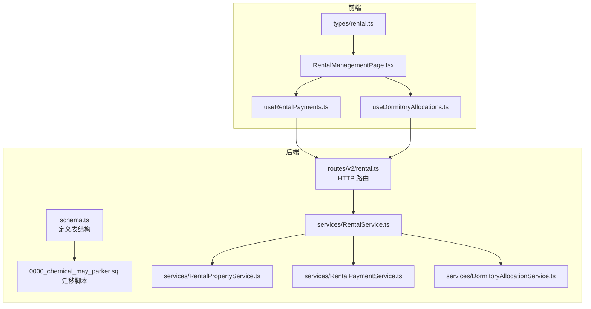
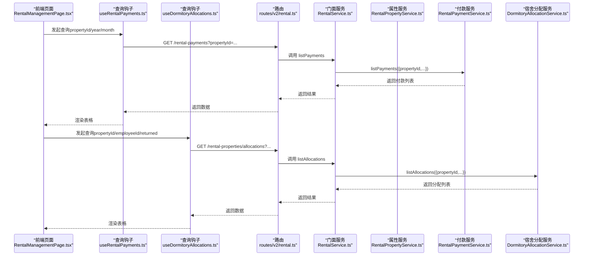
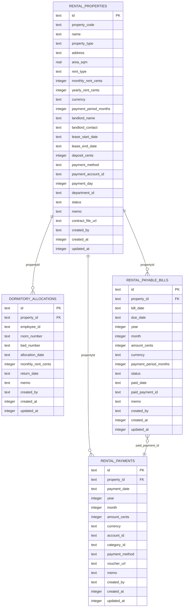
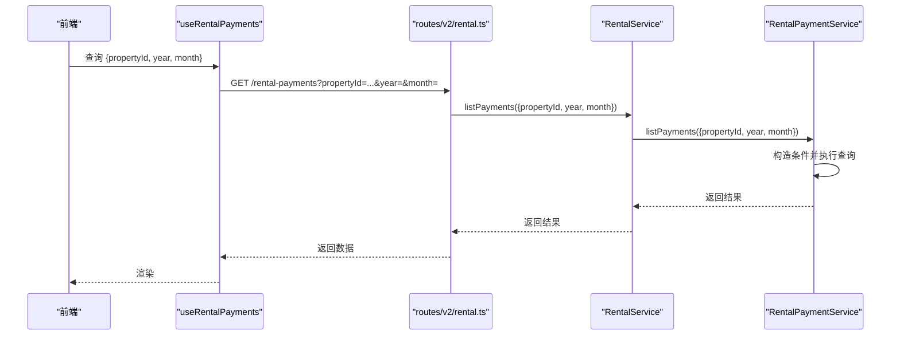
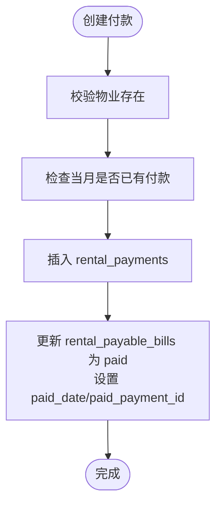
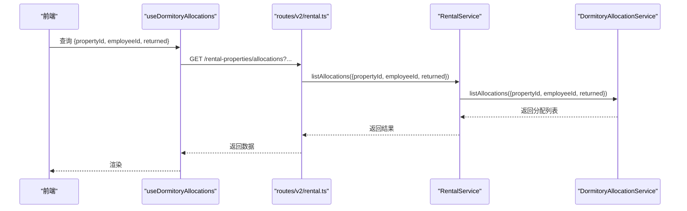
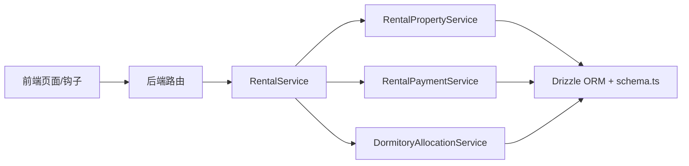

# 租赁管理关系模型

<cite>
**本文引用的文件**
- [schema.ts](file://backend/src/db/schema.ts)
- [0000_chemical_may_parker.sql](file://backend/drizzle/0000_chemical_may_parker.sql)
- [RentalService.ts](file://backend/src/services/RentalService.ts)
- [RentalPropertyService.ts](file://backend/src/services/RentalPropertyService.ts)
- [RentalPaymentService.ts](file://backend/src/services/RentalPaymentService.ts)
- [DormitoryAllocationService.ts](file://backend/src/services/DormitoryAllocationService.ts)
- [rental.ts](file://backend/src/routes/v2/rental.ts)
- [RentalManagementPage.tsx](file://frontend/src/features/assets/pages/RentalManagementPage.tsx)
- [useRentalPayments.ts](file://frontend/src/hooks/business/useRentalPayments.ts)
- [useDormitoryAllocations.ts](file://frontend/src/hooks/business/useDormitoryAllocations.ts)
- [rental.ts（前端类型）](file://frontend/src/types/rental.ts)
</cite>

## 目录
1. [简介](#简介)
2. [项目结构](#项目结构)
3. [核心组件](#核心组件)
4. [架构总览](#架构总览)
5. [详细组件分析](#详细组件分析)
6. [依赖关系分析](#依赖关系分析)
7. [性能考量](#性能考量)
8. [故障排查指南](#故障排查指南)
9. [结论](#结论)
10. [附录](#附录)

## 简介
本文件聚焦于租赁管理子系统中的三张核心表及其服务层关系：
- rentalProperties（租赁物业）
- rentalPayments（租赁付款记录）
- dormitoryAllocations（员工宿舍分配）

并说明：
- 物业与付款记录的关联（propertyId 外键）
- 物业与应付账单的关系（rentalPayableBills）
- 宿舍分配与员工的绑定关系
- 提供“查询某物业所有付款记录”和“获取某员工宿舍分配信息”的查询示例路径

## 项目结构
后端采用 Drizzle ORM + SQLite，数据库模式在 schema.ts 中定义，并通过 SQL 迁移脚本落地。前端通过 React Query 调用后端路由，展示与操作租赁数据。

图表来源
- [schema.ts](file://backend/src/db/schema.ts#L576-L673)
- [0000_chemical_may_parker.sql](file://backend/drizzle/0000_chemical_may_parker.sql#L441-L505)
- [RentalService.ts](file://backend/src/services/RentalService.ts#L1-L162)
- [RentalPropertyService.ts](file://backend/src/services/RentalPropertyService.ts#L1-L291)
- [RentalPaymentService.ts](file://backend/src/services/RentalPaymentService.ts#L1-L400)
- [DormitoryAllocationService.ts](file://backend/src/services/DormitoryAllocationService.ts#L1-L177)
- [rental.ts](file://backend/src/routes/v2/rental.ts#L484-L800)
- [RentalManagementPage.tsx](file://frontend/src/features/assets/pages/RentalManagementPage.tsx#L1-L200)
- [useRentalPayments.ts](file://frontend/src/hooks/business/useRentalPayments.ts#L1-L57)
- [useDormitoryAllocations.ts](file://frontend/src/hooks/business/useDormitoryAllocations.ts#L1-L56)
- [rental.ts（前端类型）](file://frontend/src/types/rental.ts#L1-L144)

章节来源
- [schema.ts](file://backend/src/db/schema.ts#L576-L673)
- [0000_chemical_may_parker.sql](file://backend/drizzle/0000_chemical_may_parker.sql#L441-L505)
- [RentalService.ts](file://backend/src/services/RentalService.ts#L1-L162)
- [RentalPropertyService.ts](file://backend/src/services/RentalPropertyService.ts#L1-L291)
- [RentalPaymentService.ts](file://backend/src/services/RentalPaymentService.ts#L1-L400)
- [DormitoryAllocationService.ts](file://backend/src/services/DormitoryAllocationService.ts#L1-L177)
- [rental.ts](file://backend/src/routes/v2/rental.ts#L484-L800)
- [RentalManagementPage.tsx](file://frontend/src/features/assets/pages/RentalManagementPage.tsx#L1-L200)
- [useRentalPayments.ts](file://frontend/src/hooks/business/useRentalPayments.ts#L1-L57)
- [useDormitoryAllocations.ts](file://frontend/src/hooks/business/useDormitoryAllocations.ts#L1-L56)
- [rental.ts（前端类型）](file://frontend/src/types/rental.ts#L1-L144)

## 核心组件
- 表结构与关系
  - rentalProperties：记录物业基本信息与计租参数（如月租/年租、付款周期、付款日等）
  - rentalPayments：记录实际付款，包含 propertyId 外键，关联到 rentalProperties
  - dormitoryAllocations：记录员工宿舍分配，包含 propertyId 与 employeeId
  - rentalPayableBills：记录应付账单，用于生成与核对，与 rentalPayments 关联（paid_payment_id）

- 服务层职责
  - RentalPropertyService：查询/创建/更新/删除物业，以及关联变更记录
  - RentalPaymentService：查询/创建/更新/删除付款记录，生成应付账单、标记账单为已付
  - DormitoryAllocationService：查询/分配/归还宿舍
  - RentalService：门面聚合，统一对外暴露属性、付款、分配的组合查询

章节来源
- [schema.ts](file://backend/src/db/schema.ts#L576-L673)
- [RentalPropertyService.ts](file://backend/src/services/RentalPropertyService.ts#L1-L291)
- [RentalPaymentService.ts](file://backend/src/services/RentalPaymentService.ts#L1-L400)
- [DormitoryAllocationService.ts](file://backend/src/services/DormitoryAllocationService.ts#L1-L177)
- [RentalService.ts](file://backend/src/services/RentalService.ts#L1-L162)

## 架构总览
后端通过路由将前端请求转发至 RentalService，再由其委派到具体服务（属性、付款、分配）。服务层基于 Drizzle ORM 查询数据库，返回结构化的结果。

图表来源
- [rental.ts](file://backend/src/routes/v2/rental.ts#L484-L800)
- [RentalService.ts](file://backend/src/services/RentalService.ts#L1-L162)
- [RentalPaymentService.ts](file://backend/src/services/RentalPaymentService.ts#L1-L120)
- [DormitoryAllocationService.ts](file://backend/src/services/DormitoryAllocationService.ts#L1-L80)
- [useRentalPayments.ts](file://frontend/src/hooks/business/useRentalPayments.ts#L1-L57)
- [useDormitoryAllocations.ts](file://frontend/src/hooks/business/useDormitoryAllocations.ts#L1-L56)

## 详细组件分析

### 数据模型与关系图

图表来源
- [schema.ts](file://backend/src/db/schema.ts#L576-L673)
- [0000_chemical_may_parker.sql](file://backend/drizzle/0000_chemical_may_parker.sql#L441-L505)

章节来源
- [schema.ts](file://backend/src/db/schema.ts#L576-L673)
- [0000_chemical_may_parker.sql](file://backend/drizzle/0000_chemical_may_parker.sql#L441-L505)

### 物业与付款记录关联
- 关联键：rentalPayments.property_id 引用 rentalProperties.id
- 服务层查询：RentalPaymentService.listPayments 支持按 propertyId、year、month 过滤
- 前端查询：useRentalPayments 通过路由 GET /rental-payments 传入 propertyId/year/month

图表来源
- [rental.ts](file://backend/src/routes/v2/rental.ts#L484-L564)
- [RentalService.ts](file://backend/src/services/RentalService.ts#L90-L121)
- [RentalPaymentService.ts](file://backend/src/services/RentalPaymentService.ts#L23-L51)
- [useRentalPayments.ts](file://frontend/src/hooks/business/useRentalPayments.ts#L1-L57)

章节来源
- [rental.ts](file://backend/src/routes/v2/rental.ts#L484-L564)
- [RentalService.ts](file://backend/src/services/RentalService.ts#L90-L121)
- [RentalPaymentService.ts](file://backend/src/services/RentalPaymentService.ts#L23-L51)
- [useRentalPayments.ts](file://frontend/src/hooks/business/useRentalPayments.ts#L1-L57)

### 应付账单与实际付款联动
- rentalPayableBills：记录应付账单（未付/已付），支持按 propertyId、status、dueDate 范围过滤
- 创建付款时：RentalPaymentService 在事务中更新应付账单状态为 paid，并回写 paid_date 和 paid_payment_id
- 前端可通过“生成应付账单”批量生成，或手动标记账单为已付

图表来源
- [RentalPaymentService.ts](file://backend/src/services/RentalPaymentService.ts#L113-L211)
- [schema.ts](file://backend/src/db/schema.ts#L656-L673)

章节来源
- [RentalPaymentService.ts](file://backend/src/services/RentalPaymentService.ts#L113-L211)
- [schema.ts](file://backend/src/db/schema.ts#L656-L673)

### 宿舍分配与员工关系
- dormitoryAllocations：记录员工在某物业的分配（房间号、床号、分配日期、月租等），支持按 propertyId、employeeId、returned 过滤
- 分配前会校验物业类型必须为 dormitory，且员工存在且有效
- 归还时设置 return_date 并可追加 memo

图表来源
- [rental.ts](file://backend/src/routes/v2/rental.ts#L68-L124)
- [RentalService.ts](file://backend/src/services/RentalService.ts#L139-L161)
- [DormitoryAllocationService.ts](file://backend/src/services/DormitoryAllocationService.ts#L20-L78)
- [useDormitoryAllocations.ts](file://frontend/src/hooks/business/useDormitoryAllocations.ts#L1-L56)

章节来源
- [rental.ts](file://backend/src/routes/v2/rental.ts#L68-L124)
- [RentalService.ts](file://backend/src/services/RentalService.ts#L139-L161)
- [DormitoryAllocationService.ts](file://backend/src/services/DormitoryAllocationService.ts#L20-L78)
- [useDormitoryAllocations.ts](file://frontend/src/hooks/business/useDormitoryAllocations.ts#L1-L56)

### 查询示例路径

- 查询某物业的所有付款记录
  - 后端路由：GET /rental-payments
  - 服务调用链：routes/v2/rental.ts -> RentalService.listPayments -> RentalPaymentService.listPayments
  - 前端调用：useRentalPayments({ propertyId, year, month })
  - 示例路径
    - [routes/v2/rental.ts](file://backend/src/routes/v2/rental.ts#L484-L564)
    - [RentalService.ts](file://backend/src/services/RentalService.ts#L90-L121)
    - [RentalPaymentService.ts](file://backend/src/services/RentalPaymentService.ts#L23-L51)
    - [useRentalPayments.ts](file://frontend/src/hooks/business/useRentalPayments.ts#L1-L57)

- 获取某员工的宿舍分配信息
  - 后端路由：GET /rental-properties/allocations
  - 服务调用链：routes/v2/rental.ts -> RentalService.listAllocations -> DormitoryAllocationService.listAllocations
  - 前端调用：useDormitoryAllocations({ employeeId, propertyId, returned })
  - 示例路径
    - [routes/v2/rental.ts](file://backend/src/routes/v2/rental.ts#L68-L124)
    - [RentalService.ts](file://backend/src/services/RentalService.ts#L139-L161)
    - [DormitoryAllocationService.ts](file://backend/src/services/DormitoryAllocationService.ts#L20-L78)
    - [useDormitoryAllocations.ts](file://frontend/src/hooks/business/useDormitoryAllocations.ts#L1-L56)

## 依赖关系分析
- 组件耦合
  - RentalService 作为门面，聚合 RentalPropertyService、RentalPaymentService、DormitoryAllocationService
  - 各服务内部通过 Drizzle ORM 访问 schema.ts 定义的表
- 外部依赖
  - 前端通过 React Query 钩子与后端 REST 接口交互
  - 类型定义来自 frontend/src/types/rental.ts，确保前后端契约一致

图表来源
- [RentalService.ts](file://backend/src/services/RentalService.ts#L1-L162)
- [RentalPropertyService.ts](file://backend/src/services/RentalPropertyService.ts#L1-L291)
- [RentalPaymentService.ts](file://backend/src/services/RentalPaymentService.ts#L1-L400)
- [DormitoryAllocationService.ts](file://backend/src/services/DormitoryAllocationService.ts#L1-L177)
- [schema.ts](file://backend/src/db/schema.ts#L576-L673)

章节来源
- [RentalService.ts](file://backend/src/services/RentalService.ts#L1-L162)
- [RentalPropertyService.ts](file://backend/src/services/RentalPropertyService.ts#L1-L291)
- [RentalPaymentService.ts](file://backend/src/services/RentalPaymentService.ts#L1-L400)
- [DormitoryAllocationService.ts](file://backend/src/services/DormitoryAllocationService.ts#L1-L177)
- [schema.ts](file://backend/src/db/schema.ts#L576-L673)

## 性能考量
- 查询优化
  - 使用索引：cash_flows、account_transactions 等表具备常用查询索引，有助于财务流水与交易明细的检索
  - 建议在 rental_payments 上对 property_id/year/month 建立复合索引，提升按物业与时间维度的查询效率
- 事务一致性
  - 创建付款时，RentalPaymentService 在事务中同时写入 rental_payments 与更新 rental_payable_bills，保证状态一致性
- 前端缓存
  - React Query 的 staleTime 设置为 5 分钟，减少重复请求，提高交互流畅度

[本节为通用指导，无需列出具体文件来源]

## 故障排查指南
- 删除物业失败（仍有付款记录）
  - 现象：删除 rental_properties 报错提示“无法删除，该物业还有付款记录”
  - 原因：RentalPropertyService.deleteProperty 在删除前检查 rental_payments
  - 解决：先清理该物业的付款记录，再删除物业
  - 参考路径
    - [RentalPropertyService.ts](file://backend/src/services/RentalPropertyService.ts#L213-L239)

- 重复付款
  - 现象：同一 propertyId+year+month 的付款重复创建
  - 原因：RentalPaymentService.createPayment 对当月付款进行去重校验
  - 解决：修改月份或清理重复记录后再提交
  - 参考路径
    - [RentalPaymentService.ts](file://backend/src/services/RentalPaymentService.ts#L76-L89)

- 账单状态异常
  - 现象：应付账单已支付但状态未更新
  - 原因：创建付款时需确保 paid_payment_id 回写成功
  - 解决：确认创建付款流程未报错，必要时手动标记账单为已付
  - 参考路径
    - [RentalPaymentService.ts](file://backend/src/services/RentalPaymentService.ts#L191-L208)

- 宿舍分配冲突
  - 现象：同一员工在同一物业未归还即再次分配
  - 原因：DormitoryAllocationService.allocateDormitory 对未归还记录进行去重校验
  - 解决：先归还旧分配，再创建新分配
  - 参考路径
    - [DormitoryAllocationService.ts](file://backend/src/services/DormitoryAllocationService.ts#L114-L127)

章节来源
- [RentalPropertyService.ts](file://backend/src/services/RentalPropertyService.ts#L213-L239)
- [RentalPaymentService.ts](file://backend/src/services/RentalPaymentService.ts#L76-L89)
- [RentalPaymentService.ts](file://backend/src/services/RentalPaymentService.ts#L191-L208)
- [DormitoryAllocationService.ts](file://backend/src/services/DormitoryAllocationService.ts#L114-L127)

## 结论
- rentalProperties 与 rentalPayments 通过 propertyId 强关联，形成“物业-付款”的核心关系
- rentalPayableBills 作为应付账单管理工具，与实际付款记录保持状态同步
- dormitoryAllocations 将员工与宿舍物业绑定，支持分配与归还流程
- 前后端通过清晰的路由与服务层协作，提供稳定的查询与操作体验

[本节为总结性内容，无需列出具体文件来源]

## 附录

### 常用查询参数与类型
- 物业付款查询
  - 参数：propertyId（可选）、year（可选）、month（可选）
  - 返回：付款记录数组（含物业编码/名称、账户/分类名称、创建人等）
  - 参考路径
    - [useRentalPayments.ts](file://frontend/src/hooks/business/useRentalPayments.ts#L1-L57)
    - [rental.ts](file://backend/src/routes/v2/rental.ts#L484-L564)

- 宿舍分配查询
  - 参数：propertyId（可选）、employeeId（可选）、returned（true/false/undefined）
  - 返回：分配记录数组（含员工姓名/部门、物业编码/名称等）
  - 参考路径
    - [useDormitoryAllocations.ts](file://frontend/src/hooks/business/useDormitoryAllocations.ts#L1-L56)
    - [rental.ts](file://backend/src/routes/v2/rental.ts#L68-L124)

### 前端类型定义参考
- 物业、付款、分配、应付账单类型定义
  - [rental.ts（前端类型）](file://frontend/src/types/rental.ts#L1-L144)