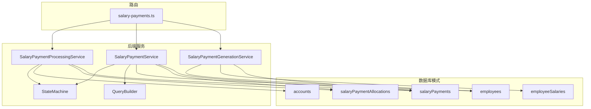
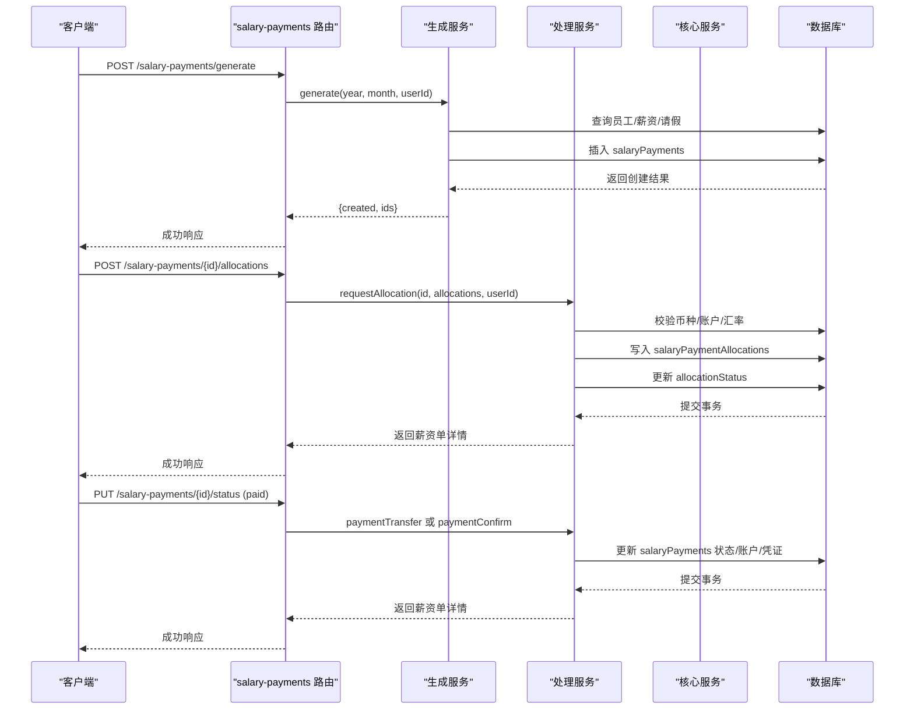
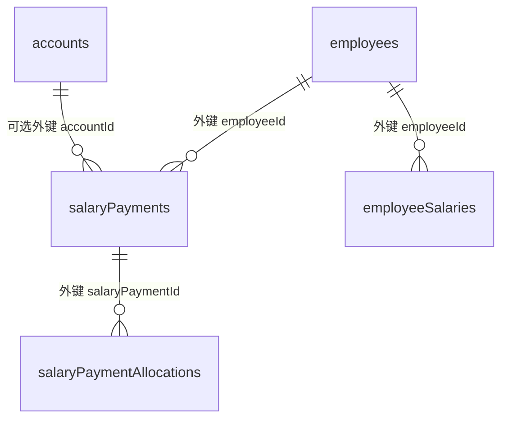
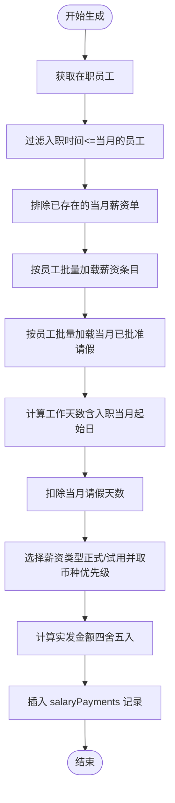
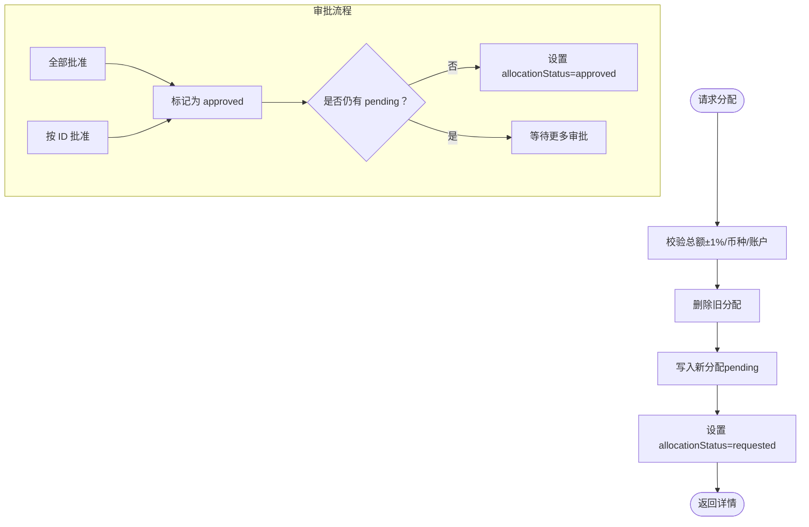
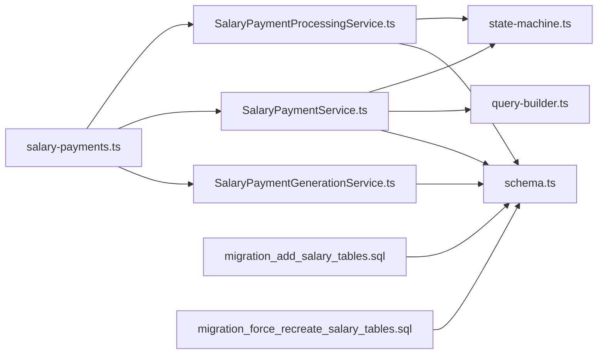

# 薪资发放关系模型

<cite>
**本文引用的文件**
- [schema.ts](file://backend/src/db/schema.ts)
- [salary-payments.ts](file://backend/src/routes/v2/salary-payments.ts)
- [SalaryPaymentService.ts](file://backend/src/services/SalaryPaymentService.ts)
- [SalaryPaymentGenerationService.ts](file://backend/src/services/SalaryPaymentGenerationService.ts)
- [SalaryPaymentProcessingService.ts](file://backend/src/services/SalaryPaymentProcessingService.ts)
- [query-builder.ts](file://backend/src/utils/query-builder.ts)
- [state-machine.ts](file://backend/src/utils/state-machine.ts)
- [migration_add_salary_tables.sql](file://backend/src/db/migration_add_salary_tables.sql)
- [migration_force_recreate_salary_tables.sql](file://backend/src/db/migration_force_recreate_salary_tables.sql)
</cite>

## 目录
1. [简介](#简介)
2. [项目结构](#项目结构)
3. [核心组件](#核心组件)
4. [架构总览](#架构总览)
5. [详细组件分析](#详细组件分析)
6. [依赖关系分析](#依赖关系分析)
7. [性能考量](#性能考量)
8. [故障排查指南](#故障排查指南)
9. [结论](#结论)
10. [附录](#附录)

## 简介
本文件面向财务与HR系统中的“薪资发放”业务，系统性梳理以下数据模型与关系：
- salaryPayments 表与 employees、accounts 的连接：salaryPayments.employeeId 外键关联员工；可选 accountId 关联支付账户。
- salaryPaymentAllocations 中间实体：支持按多币种对单笔薪资进行拆分与分配，并通过状态机控制审批流程。
- employeeSalaries 表：存储员工薪资标准，用于生成薪资单时计算应发金额。
- 提供两类典型查询示例：查询某员工历史薪资记录、统计某月薪资发放总额。

## 项目结构
围绕薪资发放的核心文件分布如下：
- 数据库模式定义：schema.ts 定义了 salaryPayments、salaryPaymentAllocations、employeeSalaries、accounts、employees 等关键表。
- 路由层：salary-payments.ts 定义了薪资单的生成、状态变更、分配请求与审批等接口。
- 服务层：
  - SalaryPaymentGenerationService：生成薪资单（基于员工薪资标准与请假天数）。
  - SalaryPaymentService：薪资单查询、状态流转、删除与回退。
  - SalaryPaymentProcessingService：支付转账、支付确认、多币种分配请求与审批。
- 工具层：query-builder.ts 提供通用的员工关联查询封装；state-machine.ts 提供状态机校验。

图表来源
- [schema.ts](file://backend/src/db/schema.ts#L286-L331)
- [salary-payments.ts](file://backend/src/routes/v2/salary-payments.ts#L1-L604)
- [SalaryPaymentGenerationService.ts](file://backend/src/services/SalaryPaymentGenerationService.ts#L1-L278)
- [SalaryPaymentService.ts](file://backend/src/services/SalaryPaymentService.ts#L1-L326)
- [SalaryPaymentProcessingService.ts](file://backend/src/services/SalaryPaymentProcessingService.ts#L1-L378)
- [query-builder.ts](file://backend/src/utils/query-builder.ts#L1-L177)
- [state-machine.ts](file://backend/src/utils/state-machine.ts#L1-L89)

章节来源
- [schema.ts](file://backend/src/db/schema.ts#L140-L331)
- [salary-payments.ts](file://backend/src/routes/v2/salary-payments.ts#L1-L604)

## 核心组件
- salaryPayments：记录每名员工每月的薪资单，包含年、月、应发金额、状态、分配状态、以及可选的支付账户与凭证路径等字段。
- salaryPaymentAllocations：多币种分配中间表，记录每笔薪资单的币种拆分、金额、账户与审批状态。
- employeeSalaries：员工薪资标准表，按员工与“试用期/正式”类型维护不同币种的薪资条目。
- accounts：支付账户表，支持币种与账户信息。
- employees：员工基本信息，用于薪资单的员工关联展示。

章节来源
- [schema.ts](file://backend/src/db/schema.ts#L220-L331)

## 架构总览
薪资发放流程的关键交互如下：
- 生成阶段：根据员工薪资标准与当月工作日/请假天数生成 salaryPayments 记录。
- 分配阶段：请求多币种分配，校验总额与币种/账户一致性，进入审批。
- 支付阶段：完成审批后执行转账或确认支付，更新状态并记录凭证。

图表来源
- [salary-payments.ts](file://backend/src/routes/v2/salary-payments.ts#L52-L203)
- [SalaryPaymentGenerationService.ts](file://backend/src/services/SalaryPaymentGenerationService.ts#L21-L211)
- [SalaryPaymentProcessingService.ts](file://backend/src/services/SalaryPaymentProcessingService.ts#L179-L378)
- [SalaryPaymentService.ts](file://backend/src/services/SalaryPaymentService.ts#L117-L171)

## 详细组件分析

### 数据模型关系图

图表来源
- [schema.ts](file://backend/src/db/schema.ts#L140-L331)

章节来源
- [schema.ts](file://backend/src/db/schema.ts#L140-L331)

### 薪资单生成与员工薪资标准
- 生成逻辑要点：
  - 过滤在当月及之前入职的在职员工。
  - 计算当月工作天数（考虑入职当月起始日）。
  - 扣除当月已批准的请假天数。
  - 依据员工状态选择“试用期/正式”薪资类型，优先取 USDT，否则按币种排序取第一条。
  - 实发金额 = 基础薪资 × 工作天数 ÷ 当月总天数。
  - 生成 salaryPayments 记录，初始状态为待员工确认，分配状态为 none。
- 与 employeeSalaries 的关联：
  - 通过 employeeId 与 salary_type（probation/regular）筛选对应币种薪资条目。
  - 若存在 USDT 则优先使用，否则按币种排序取首个条目。

图表来源
- [SalaryPaymentGenerationService.ts](file://backend/src/services/SalaryPaymentGenerationService.ts#L21-L211)
- [schema.ts](file://backend/src/db/schema.ts#L220-L229)

章节来源
- [SalaryPaymentGenerationService.ts](file://backend/src/services/SalaryPaymentGenerationService.ts#L21-L211)
- [schema.ts](file://backend/src/db/schema.ts#L220-L229)

### 多币种分配与审批
- 分配请求：
  - 校验多币种分配总额与基准币种（USDT）的差额在 1% 以内。
  - 校验币种存在与账户币种一致（若提供账户）。
  - 清空旧分配并写入新分配，设置分配状态为 requested。
- 分配审批：
  - 支持全部批准或按 ID 批量批准。
  - 全部批准后将分配状态置为 approved，否则保持 pending。
- 支付阶段：
  - 支付转账：更新状态为待支付确认，并记录 accountId。
  - 支付确认：更新状态为 completed，并记录凭证路径。

图表来源
- [SalaryPaymentProcessingService.ts](file://backend/src/services/SalaryPaymentProcessingService.ts#L179-L378)
- [state-machine.ts](file://backend/src/utils/state-machine.ts#L44-L55)

章节来源
- [SalaryPaymentProcessingService.ts](file://backend/src/services/SalaryPaymentProcessingService.ts#L179-L378)
- [state-machine.ts](file://backend/src/utils/state-machine.ts#L44-L55)

### 薪资单状态机与权限控制
- 状态机定义了从“待员工确认”到“完成”的合法流转路径，任何非法转换会被拒绝。
- 路由层对部分操作（如支付转账/确认）要求提供必要参数（accountId 或凭证路径）。
- 服务层在关键更新前进行乐观锁版本校验，避免并发覆盖。

章节来源
- [state-machine.ts](file://backend/src/utils/state-machine.ts#L1-L89)
- [salary-payments.ts](file://backend/src/routes/v2/salary-payments.ts#L172-L203)
- [SalaryPaymentService.ts](file://backend/src/services/SalaryPaymentService.ts#L117-L171)
- [SalaryPaymentProcessingService.ts](file://backend/src/services/SalaryPaymentProcessingService.ts#L30-L116)

### 查询示例

#### 示例一：查询某员工历史薪资记录
- 目标：列出某员工在某年某月的历史薪资单，同时附带员工姓名、部门名称与币种分配明细。
- 实现思路：
  - 在 SalaryPaymentService.list 中，按 employeeId 过滤。
  - 使用 QueryBuilder.buildEmployeeJoinQuery 自动关联 employees、departments、orgDepartments、positions，获取员工与部门信息。
  - 同步拉取该批薪资单对应的 salaryPaymentAllocations 明细，组装返回。
- 关键点：
  - 排序按年、月降序。
  - 返回字段包含 employeeName、departmentName 与 allocations 数组。

章节来源
- [SalaryPaymentService.ts](file://backend/src/services/SalaryPaymentService.ts#L28-L84)
- [query-builder.ts](file://backend/src/utils/query-builder.ts#L23-L43)

#### 示例二：统计某月薪资发放总额
- 目标：统计某年某月所有已完成薪资单的实发金额总和。
- 实现思路：
  - 在 SalaryPaymentService.list 中按 year、month 过滤，且 status 为 completed。
  - 对返回的薪资单列表按 salaryCents 求和，得到该月发放总额。
- 关键点：
  - 若需要跨币种汇总，可在前端或服务层将各币种金额按汇率折算至统一币种后再求和（当前服务层未内置汇率转换逻辑，建议在调用方处理）。

章节来源
- [SalaryPaymentService.ts](file://backend/src/services/SalaryPaymentService.ts#L28-L58)

## 依赖关系分析
- 路由层依赖服务层：salary-payments.ts 将 HTTP 请求映射到具体服务方法。
- 服务层依赖数据库模式：各服务均使用 schema.ts 中定义的表结构进行查询与更新。
- 服务层依赖工具层：
  - QueryBuilder：用于构建员工关联查询，减少重复代码。
  - StateMachine：用于校验状态转换合法性。
- 迁移脚本：确保 employeeSalaries、employeeAllowances 等表结构在数据库侧正确存在。

图表来源
- [salary-payments.ts](file://backend/src/routes/v2/salary-payments.ts#L1-L604)
- [SalaryPaymentGenerationService.ts](file://backend/src/services/SalaryPaymentGenerationService.ts#L1-L278)
- [SalaryPaymentService.ts](file://backend/src/services/SalaryPaymentService.ts#L1-L326)
- [SalaryPaymentProcessingService.ts](file://backend/src/services/SalaryPaymentProcessingService.ts#L1-L378)
- [schema.ts](file://backend/src/db/schema.ts#L220-L331)
- [query-builder.ts](file://backend/src/utils/query-builder.ts#L1-L177)
- [state-machine.ts](file://backend/src/utils/state-machine.ts#L1-L89)
- [migration_add_salary_tables.sql](file://backend/src/db/migration_add_salary_tables.sql#L1-L21)
- [migration_force_recreate_salary_tables.sql](file://backend/src/db/migration_force_recreate_salary_tables.sql#L1-L24)

章节来源
- [salary-payments.ts](file://backend/src/routes/v2/salary-payments.ts#L1-L604)
- [schema.ts](file://backend/src/db/schema.ts#L220-L331)

## 性能考量
- 批量查询与关联：SalaryPaymentService.list 使用 QueryBuilder 构建一次员工关联查询，随后一次性拉取该批次的分配明细，避免 N+1 查询。
- 乐观锁：在状态更新前进行版本校验，降低并发冲突导致的数据不一致风险。
- 状态机前置校验：在服务层进行状态转换校验，减少无效数据库写入。
- 建议：
  - 对高频查询（如按年/月/状态过滤）可考虑在 salaryPayments 上建立复合索引（year, month, status, employeeId）以提升查询性能。
  - 多币种分配校验在服务层进行，建议在调用方提供汇率参数，避免默认值带来的误差。

[本节为通用指导，无需源码引用]

## 故障排查指南
- “不允许的状态转换”：检查当前薪资单状态与期望目标状态是否在状态机允许范围内。
- “分配总额不匹配”：核对多币种分配合计与基准币种（USDT）的差额是否超过 1%，并确认汇率参数是否正确。
- “账户已停用或币种不匹配”：确认 accountId 存在且与分配币种一致。
- “并发更新失败”：检查请求中携带的版本号是否与数据库一致，避免被其他会话覆盖。
- “删除失败”：仅允许在特定状态下删除薪资单（例如待员工确认或待财务审批）。

章节来源
- [state-machine.ts](file://backend/src/utils/state-machine.ts#L16-L33)
- [SalaryPaymentProcessingService.ts](file://backend/src/services/SalaryPaymentProcessingService.ts#L179-L278)
- [SalaryPaymentService.ts](file://backend/src/services/SalaryPaymentService.ts#L238-L260)

## 结论
本关系模型通过 salaryPayments、salaryPaymentAllocations 与 employeeSalaries 的协同，实现了“按月生成、多币种分配、审批驱动、状态机约束”的薪资发放闭环。结合 QueryBuilder 与状态机工具，既保证了查询性能与数据一致性，也为后续扩展（如汇率配置、更复杂的分配规则）提供了清晰的边界。

[本节为总结性内容，无需源码引用]

## 附录

### 表结构与字段摘要
- salaryPayments
  - 主键：id
  - 外键：employeeId → employees.id
  - 可选外键：accountId → accounts.id
  - 关键字段：year, month, salaryCents, status, allocationStatus
- salaryPaymentAllocations
  - 主键：id
  - 外键：salaryPaymentId → salaryPayments.id
  - 关键字段：currencyId, amountCents, accountId, status
- employeeSalaries
  - 主键：id
  - 外键：employeeId → employees.id
  - 关键字段：salaryType（probation/regular）、currencyId、amountCents、effectiveDate
- accounts
  - 主键：id
  - 关键字段：name, type, currency, alias, accountNumber, active

章节来源
- [schema.ts](file://backend/src/db/schema.ts#L140-L331)

### 迁移脚本参考
- 新增薪资相关表：见 migration_add_salary_tables.sql
- 强制重建薪资相关表：见 migration_force_recreate_salary_tables.sql

章节来源
- [migration_add_salary_tables.sql](file://backend/src/db/migration_add_salary_tables.sql#L1-L21)
- [migration_force_recreate_salary_tables.sql](file://backend/src/db/migration_force_recreate_salary_tables.sql#L1-L24)