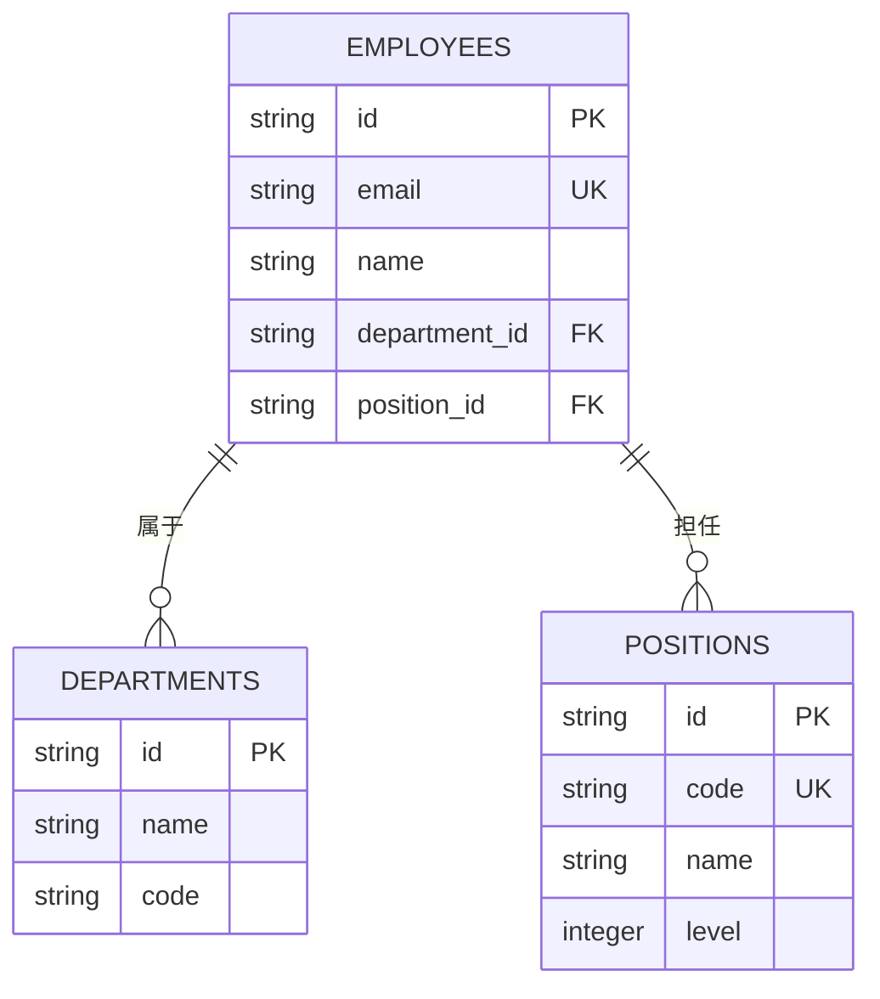
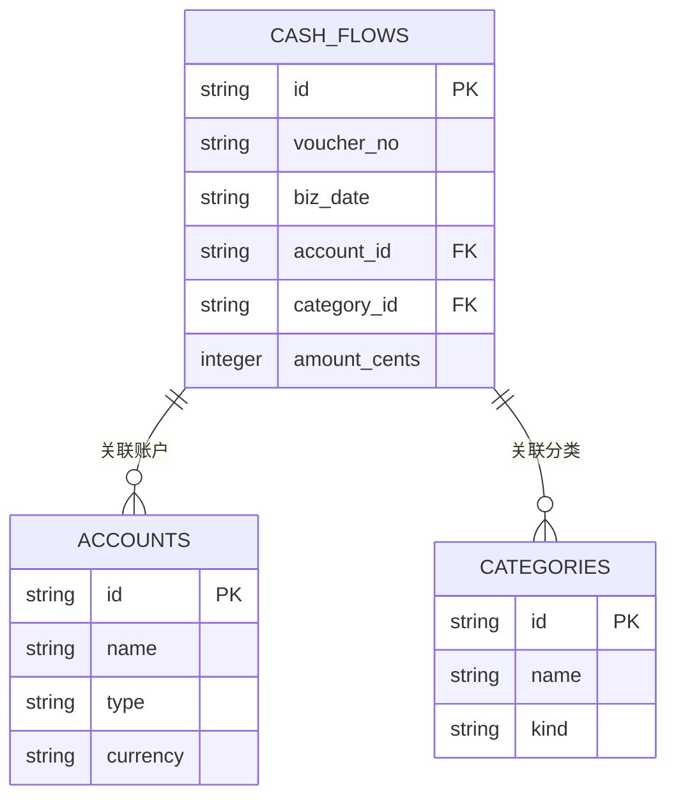
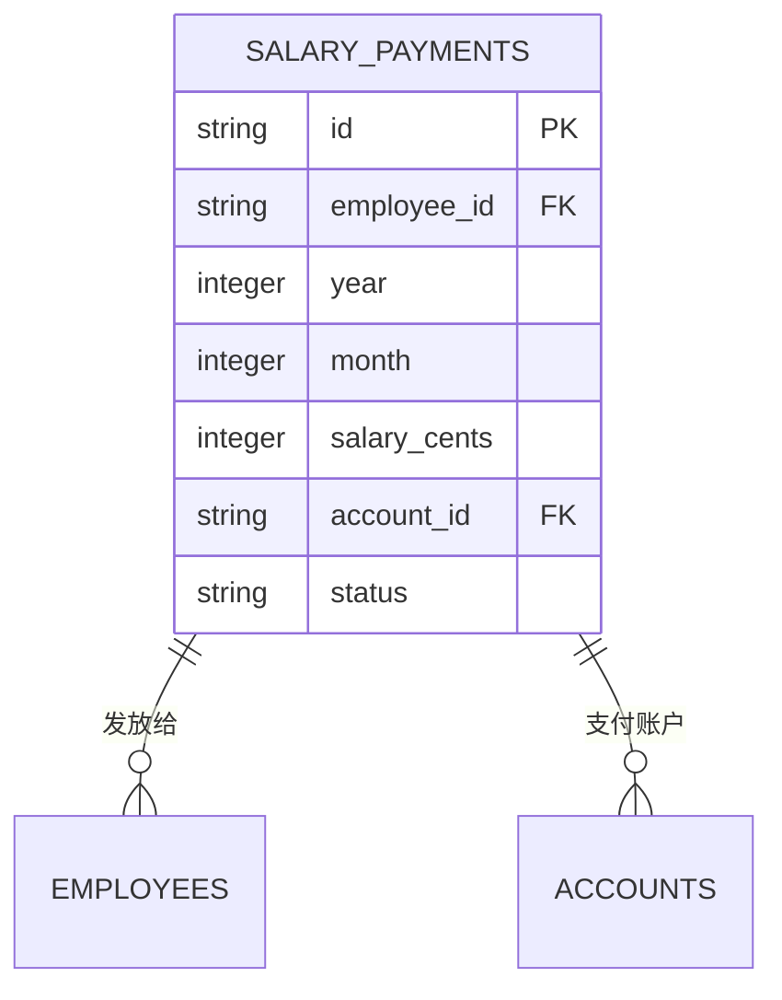
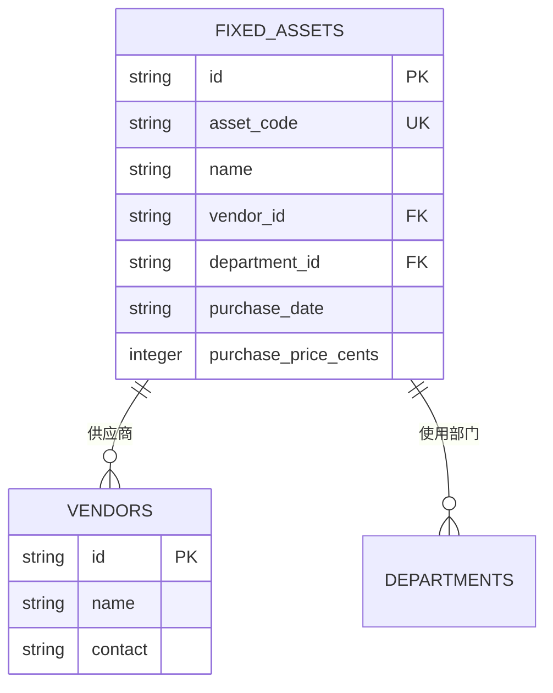
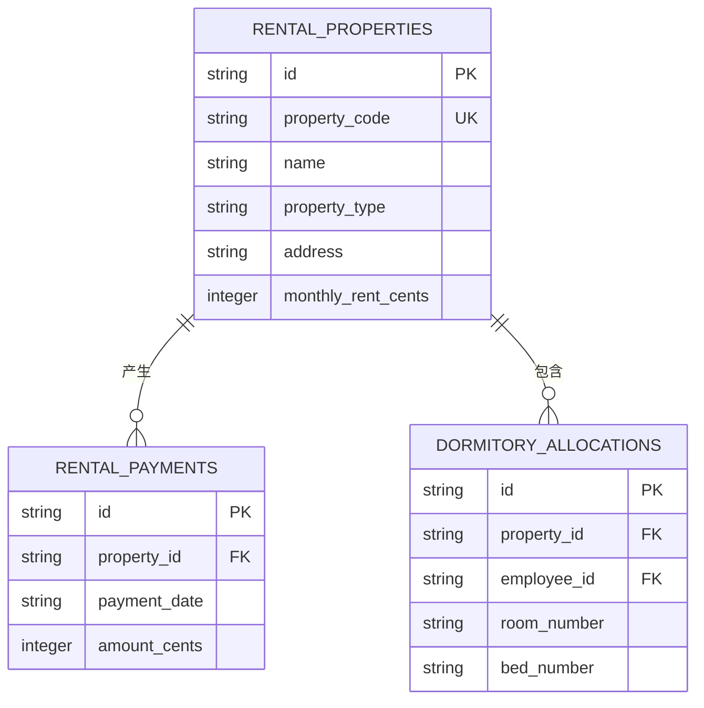
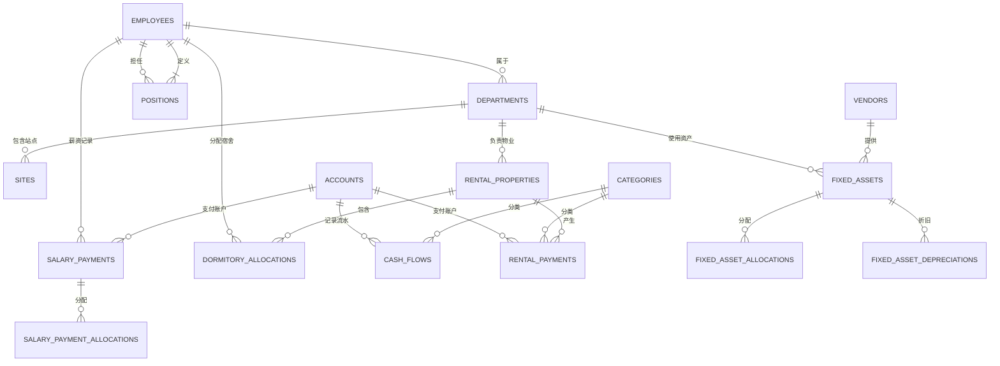
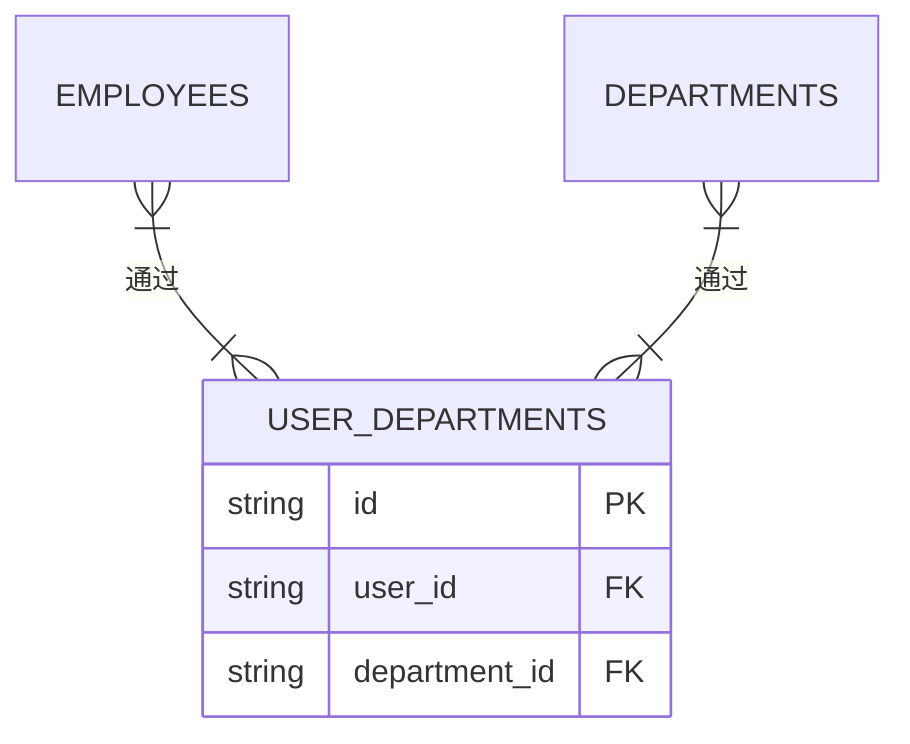

# 表间关系与ER图

<cite>
**本文档引用的文件**   
- [schema.ts](file://backend/src/db/schema.ts)
- [schema.sql](file://backend/src/db/schema.sql)
- [employees.ts](file://backend/src/routes/v2/employees.ts)
- [salary-payments.ts](file://backend/src/routes/v2/salary-payments.ts)
- [fixed-assets.ts](file://backend/src/routes/v2/fixed-assets.ts)
- [rental.ts](file://backend/src/routes/v2/rental.ts)
- [departments.ts](file://backend/src/routes/v2/master-data/departments.ts)
- [positions.ts](file://backend/src/routes/v2/master-data/positions.ts)
- [accounts.ts](file://backend/src/routes/v2/master-data/accounts.ts)
- [categories.ts](file://backend/src/routes/v2/master-data/categories.ts)
- [vendors.ts](file://backend/src/routes/v2/master-data/vendors.ts)
</cite>

## 目录
1. [引言](#引言)
2. [核心表关系分析](#核心表关系分析)
3. [实体关系图（ER图）](#实体关系图er图)
4. [多对多关系实现](#多对多关系实现)
5. [实际查询示例](#实际查询示例)
6. [结论](#结论)

## 引言
本文档基于 `schema.ts` 和 `schema.sql` 文件中的数据库模式定义，详细描述了财务系统中各核心表之间的关系。通过分析外键约束和业务逻辑，本文档将阐明员工、部门、职位、财务流水、薪资、固定资产和租赁物业等实体之间的关联方式，并提供相应的实体关系图（ER图）和实际查询示例。

**Section sources**
- [schema.ts](file://backend/src/db/schema.ts#L1-L706)
- [schema.sql](file://backend/src/db/schema.sql#L1-L678)

## 核心表关系分析

### 员工与部门、职位的关系
员工（`employees`）表通过外键 `department_id` 和 `position_id` 分别与部门（`departments`）表和职位（`positions`）表建立一对多关系。每个员工属于一个部门并担任一个职位。



**Diagram sources**
- [schema.ts](file://backend/src/db/schema.ts#L14-L63)
- [schema.sql](file://backend/src/db/schema.sql#L8-L64)
- [employees.ts](file://backend/src/routes/v2/employees.ts#L196-L212)
- [departments.ts](file://backend/src/routes/v2/master-data/departments.ts)
- [positions.ts](file://backend/src/routes/v2/master-data/positions.ts)

### 财务流水与账户、分类的关系
财务流水（`cash_flows`）表通过外键 `account_id` 和 `category_id` 分别与账户（`accounts`）表和分类（`categories`）表建立关联。每条流水记录必须关联到一个账户和一个分类。



**Diagram sources**
- [schema.ts](file://backend/src/db/schema.ts#L159-L188)
- [schema.sql](file://backend/src/db/schema.sql#L186-L203)
- [accounts.ts](file://backend/src/routes/v2/master-data/accounts.ts)
- [categories.ts](file://backend/src/routes/v2/master-data/categories.ts)

### 薪资发放与员工、账户的关系
薪资发放（`salary_payments`）表通过外键 `employee_id` 与员工（`employees`）表建立一对多关系，并通过 `account_id` 与账户（`accounts`）表关联。每条薪资记录对应一名员工，并可能关联到支付账户。



**Diagram sources**
- [schema.ts](file://backend/src/db/schema.ts#L286-L316)
- [schema.sql](file://backend/src/db/schema.sql#L274-L295)
- [salary-payments.ts](file://backend/src/routes/v2/salary-payments.ts#L177-L190)

### 固定资产与供应商、使用部门的关系
固定资产（`fixed_assets`）表通过外键 `vendor_id` 与供应商（`vendors`）表关联，并通过 `department_id` 与部门（`departments`）表关联。每项资产由一个供应商提供，并由一个部门使用。



**Diagram sources**
- [schema.ts](file://backend/src/db/schema.ts#L506-L530)
- [schema.sql](file://backend/src/db/schema.sql#L471-L496)
- [fixed-assets.ts](file://backend/src/routes/v2/fixed-assets.ts#L354-L365)
- [vendors.ts](file://backend/src/routes/v2/master-data/vendors.ts)

### 租赁物业与租赁付款、宿舍分配的关系
租赁物业（`rental_properties`）表与租赁付款（`rental_payments`）表和宿舍分配（`dormitory_allocations`）表形成一对多关系。每处物业可以有多个付款记录和多个宿舍分配记录。



**Diagram sources**
- [schema.ts](file://backend/src/db/schema.ts#L576-L654)
- [schema.sql](file://backend/src/db/schema.sql#L546-L627)
- [rental.ts](file://backend/src/routes/v2/rental.ts#L172-L174)

## 实体关系图（ER图）
以下是系统核心实体的完整ER图，展示了主要表之间的关系。



**Diagram sources**
- [schema.ts](file://backend/src/db/schema.ts)
- [schema.sql](file://backend/src/db/schema.sql)

## 多对多关系实现
系统中通过中间表 `user_departments` 实现了员工与部门之间的多对多关系。一个员工可以属于多个部门，一个部门也可以包含多个员工。



**Diagram sources**
- [schema.ts](file://backend/src/db/schema.ts#L111-L116)
- [schema.sql](file://backend/src/db/schema.sql#L157-L162)

## 实际查询示例
以下是一些常见的JOIN查询示例，展示了如何利用表间关系获取数据。

### 查询员工及其部门和职位信息
```sql
SELECT 
  e.name as employee_name,
  d.name as department_name,
  p.name as position_name
FROM employees e
JOIN departments d ON e.department_id = d.id
JOIN positions p ON e.position_id = p.id
WHERE e.active = 1;
```

### 查询财务流水及其账户和分类信息
```sql
SELECT 
  cf.voucher_no,
  cf.biz_date,
  a.name as account_name,
  c.name as category_name,
  cf.amount_cents
FROM cash_flows cf
JOIN accounts a ON cf.account_id = a.id
JOIN categories c ON cf.category_id = c.id
WHERE cf.type = 'expense';
```

### 查询薪资发放记录及其员工信息
```sql
SELECT 
  sp.year,
  sp.month,
  e.name as employee_name,
  sp.salary_cents,
  a.name as payment_account
FROM salary_payments sp
JOIN employees e ON sp.employee_id = e.id
LEFT JOIN accounts a ON sp.account_id = a.id
ORDER BY sp.year DESC, sp.month DESC;
```

### 查询固定资产及其供应商和部门信息
```sql
SELECT 
  fa.asset_code,
  fa.name as asset_name,
  v.name as vendor_name,
  d.name as department_name,
  fa.purchase_price_cents
FROM fixed_assets fa
JOIN vendors v ON fa.vendor_id = v.id
JOIN departments d ON fa.department_id = d.id
WHERE fa.status = 'in_use';
```

### 查询租赁物业及其付款记录
```sql
SELECT 
  rp.property_code,
  rp.name as property_name,
  rp.monthly_rent_cents,
  rp.landlord_name,
  rp.lease_start_date,
  rp.lease_end_date,
  COUNT(rpmt.id) as payment_count,
  SUM(rpmt.amount_cents) as total_paid
FROM rental_properties rp
LEFT JOIN rental_payments rpmt ON rp.id = rpmt.property_id
GROUP BY rp.id;
```

**Section sources**
- [schema.ts](file://backend/src/db/schema.ts)
- [schema.sql](file://backend/src/db/schema.sql)

## 结论
本文档详细分析了财务系统中各核心表之间的关系，包括一对多、多对多等关联方式。通过ER图和实际查询示例，清晰地展示了数据模型的设计思路和使用方法。这些关系为系统的业务逻辑提供了坚实的基础，确保了数据的一致性和完整性。