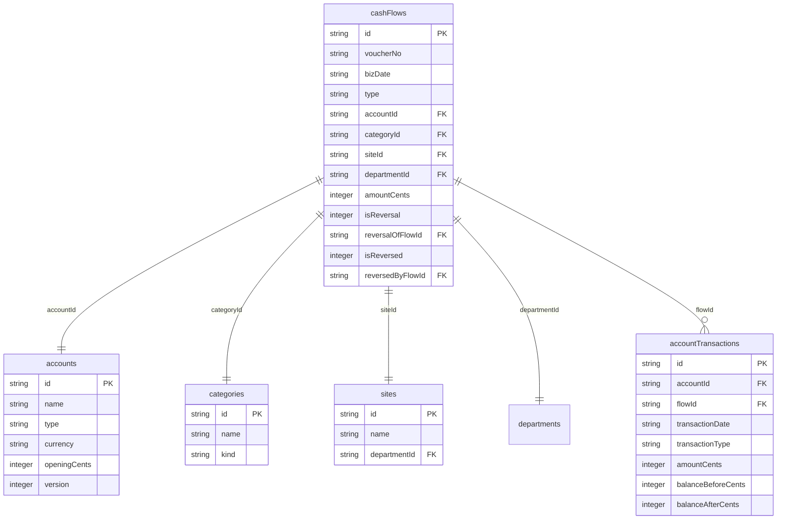
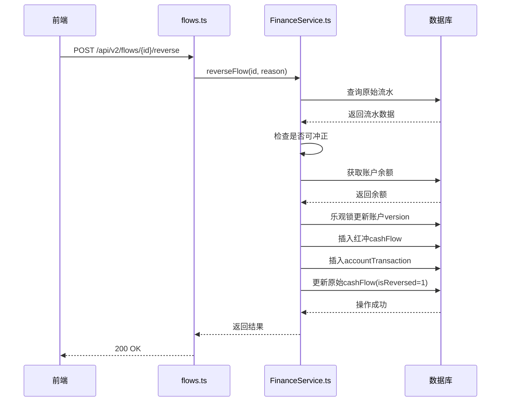

# 财务流水与账户关系

<cite>
**本文档引用文件**   
- [schema.ts](file://backend/src/db/schema.ts)
- [schema.sql](file://backend/src/db/schema.sql)
- [migration_add_cash_flow_reversal_fields.sql](file://backend/src/db/migration_add_cash_flow_reversal_fields.sql)
- [FinanceService.ts](file://backend/src/services/FinanceService.ts)
- [flows.ts](file://backend/src/routes/v2/flows.ts)
- [FlowsPage.tsx](file://frontend/src/features/finance/pages/FlowsPage.tsx)
</cite>

## 目录
1. [引言](#引言)
2. [核心数据表结构](#核心数据表结构)
3. [财务流水与账户关系](#财务流水与账户关系)
4. [账户交易记录作用](#账户交易记录作用)
5. [红冲机制实现](#红冲机制实现)
6. [查询与计算示例](#查询与计算示例)
7. [前端交互流程](#前端交互流程)

## 引言
本文档详细描述了财务系统中`cashFlows`表与`accounts`、`categories`、`sites`表之间的数据关系模型。重点阐述了财务流水如何通过外键与账户、分类和业务地点进行关联，以及`accountTransactions`表在记录账户余额变动中的核心作用。文档深入解析了红冲机制（isReversal, reversalOfFlowId）的技术实现，并提供了查询账户流水和计算余额的SQL示例，为系统的财务数据管理提供全面的技术参考。

## 核心数据表结构
系统中的核心财务数据由多个表构成，它们通过外键建立关联，形成完整的业务数据模型。



**图表来源**
- [schema.ts](file://backend/src/db/schema.ts#L159-L208)
- [schema.sql](file://backend/src/db/schema.sql#L186-L217)

## 财务流水与账户关系
`cashFlows`表是记录所有财务收支的核心表，它通过外键与多个维度表建立关联，实现数据的多维分析。

### 与账户的连接
`cashFlows`表通过`accountId`字段与`accounts`表建立外键关联。`accountId`是`cashFlows`表的必填字段，用于标识每一笔财务流水所属的具体账户。当创建一笔新的财务流水时，系统会根据`accountId`查找对应的账户信息，并在后续的余额计算和乐观锁控制中使用该账户的版本号（version）。

**关联字段**
- `cashFlows.accountId` → `accounts.id`

**关联作用**
- 确定资金流动的源头或去向。
- 为账户余额的计算提供基础。
- 通过账户的乐观锁机制（version字段）防止并发修改冲突。

### 与分类的关联
`cashFlows`表通过`categoryId`字段与`categories`表建立外键关联。`categoryId`字段是可选的，用于对财务流水进行业务分类。`categories`表中的`kind`字段定义了分类的类型，如“收入”(income)或“支出”(expense)，这有助于对流水进行更精细的统计和分析。

**关联字段**
- `cashFlows.categoryId` → `categories.id`

**关联作用**
- 对财务流水进行业务归类，便于生成按分类的财务报表。
- 支持按收入/支出类型进行数据筛选和汇总。

### 与业务地点的关系
`cashFlows`表通过`siteId`字段与`sites`表建立外键关联。`siteId`字段是可选的，用于标识该笔财务流水发生的业务地点。`sites`表本身也通过`departmentId`与`departments`表关联，从而将财务数据与组织架构联系起来。

**关联字段**
- `cashFlows.siteId` → `sites.id`

**关联作用**
- 追踪财务活动的物理或业务发生地。
- 支持按业务地点生成财务报告，进行成本中心分析。

**本节来源**
- [schema.ts](file://backend/src/db/schema.ts#L159-L188)
- [schema.sql](file://backend/src/db/schema.sql#L186-L204)

## 账户交易记录作用
`accountTransactions`表作为`cashFlows`表与`accounts`表之间的中间记录，扮演着记录账户余额变动历史的关键角色。

### 中间记录作用
`accountTransactions`表并非简单的关联表，而是承载了账户余额计算逻辑的核心。每当一笔新的`cashFlow`被创建或发生红冲时，系统都会在`accountTransactions`表中插入一条对应的交易记录。这条记录不仅记录了交易的金额和类型，更重要的是记录了交易发生前后的账户余额（`balanceBeforeCents`和`balanceAfterCents`）。

### 余额计算逻辑
账户的实时余额并非存储在`accounts`表中，而是通过`accountTransactions`表中的历史记录动态计算得出。系统通过`getAccountBalanceBefore`方法，根据指定的账户ID和时间点，查询该时间点之前的所有交易记录，并返回最后一条记录的`balanceAfterCents`作为当时的余额。如果不存在历史记录，则返回账户的期初余额（`openingCents`）。

**核心方法**
- `FinanceService.getAccountBalanceBefore(accountId, date, timestamp)`

**本节来源**
- [schema.ts](file://backend/src/db/schema.ts#L190-L208)
- [FinanceService.ts](file://backend/src/services/FinanceService.ts#L40-L67)

## 红冲机制实现
红冲机制是财务系统中用于纠正错误凭证的核心功能，通过`isReversal`和`reversalOfFlowId`等字段实现。

### 字段定义
红冲机制由`cashFlows`表中的四个字段共同实现：
- `isReversal`: 布尔值，标记该条流水是否为红冲记录（1表示是，0表示否）。
- `reversalOfFlowId`: 字符串，存储被冲正的原始流水ID，形成外键关联。
- `isReversed`: 布尔值，标记原始流水是否已被冲正（1表示是，0表示否）。
- `reversedByFlowId`: 字符串，存储冲正该流水的红冲记录ID。

### 实现流程
红冲操作的实现流程如下：
1.  **检查状态**：系统首先检查目标流水是否存在，是否已被冲正，以及是否本身就是一条红冲记录（防止重复冲正）。
2.  **生成红冲记录**：创建一条新的`cashFlow`记录，其`type`与原流水相反（收入变支出，支出变收入），金额相同，并设置`isReversal=1`和`reversalOfFlowId`为原流水ID。
3.  **更新余额**：计算红冲后的账户余额，并在`accountTransactions`表中创建相应的交易记录。
4.  **标记原流水**：更新原始流水的`isReversed=1`和`reversedByFlowId`，表明其已被冲正。

此机制确保了财务数据的可追溯性，原始错误记录被保留，同时通过新增的红冲记录来抵消其影响。



**图表来源**
- [migration_add_cash_flow_reversal_fields.sql](file://backend/src/db/migration_add_cash_flow_reversal_fields.sql#L5-L8)
- [FinanceService.ts](file://backend/src/services/FinanceService.ts#L300-L436)
- [flows.ts](file://backend/src/routes/v2/flows.ts#L544-L565)

**本节来源**
- [migration_add_cash_flow_reversal_fields.sql](file://backend/src/db/migration_add_cash_flow_reversal_fields.sql#L1-L17)
- [FinanceService.ts](file://backend/src/services/FinanceService.ts#L300-L436)

## 查询与计算示例
以下是两个核心业务场景的SQL查询示例。

### 查询某账户某时间段内所有流水
此查询用于获取指定账户在特定时间范围内的所有财务流水，通常用于对账或生成流水清单。

```sql
SELECT 
    cf.id,
    cf.voucherNo,
    cf.bizDate,
    cf.type,
    cf.amountCents,
    cf.memo,
    a.name as accountName,
    c.name as categoryName
FROM cash_flows cf
LEFT JOIN accounts a ON cf.accountId = a.id
LEFT JOIN categories c ON cf.categoryId = c.id
WHERE cf.accountId = '指定账户ID'
  AND cf.bizDate >= '2023-01-01'
  AND cf.bizDate <= '2023-12-31'
  AND cf.isReversed = 0 -- 排除已被冲正的原始记录
ORDER BY cf.bizDate DESC, cf.createdAt DESC;
```

### 计算账户余额
此查询用于计算账户在指定时间点的余额。系统通过查找`accountTransactions`表中该时间点之前的所有交易记录来实现。

```sql
-- 计算账户在 '2023-12-31' 结束时的余额
SELECT 
    COALESCE(MAX(at.balanceAfterCents), a.openingCents) as finalBalance
FROM accounts a
LEFT JOIN account_transactions at ON a.id = at.accountId
WHERE a.id = '指定账户ID'
  AND (at.transactionDate < '2023-12-31' 
       OR (at.transactionDate = '2023-12-31' AND at.createdAt <= 1704067200000)) -- 1704067200000 是 '2023-12-31' 的时间戳
GROUP BY a.id, a.openingCents;
```

**本节来源**
- [FinanceService.ts](file://backend/src/services/FinanceService.ts#L40-L67)
- [FinanceService.ts](file://backend/src/services/FinanceService.ts#L240-L267)

## 前端交互流程
前端通过API与后端交互，实现财务流水的查询和红冲操作。

### 流水查询流程
1.  用户在`FlowsPage.tsx`页面设置查询条件（如账户、日期范围）。
2.  页面调用`useFlows` Hook，该Hook向`/api/v2/flows`发起GET请求。
3.  后端`flows.ts`路由处理请求，调用`FinanceService.listCashFlows`方法。
4.  服务层执行SQL查询，返回分页的流水数据。
5.  前端接收到数据后，在表格中渲染展示。

### 红冲操作流程
1.  用户在流水列表中选择一条记录并点击“红冲”按钮。
2.  弹出模态框，用户输入冲正原因。
3.  用户确认后，前端调用`api.post(/api/v2/flows/{id}/reverse)`。
4.  后端`flows.ts`路由接收到请求，调用`FinanceService.reverseFlow`方法。
5.  服务层执行红冲逻辑，返回结果。
6.  前端根据结果提示用户操作成功或失败，并刷新数据。

**本节来源**
- [FlowsPage.tsx](file://frontend/src/features/finance/pages/FlowsPage.tsx#L91-L113)
- [useFlows.ts](file://frontend/src/hooks/business/useFlows.ts#L8-L28)
- [api.ts](file://frontend/src/config/api.ts#L40-L42)