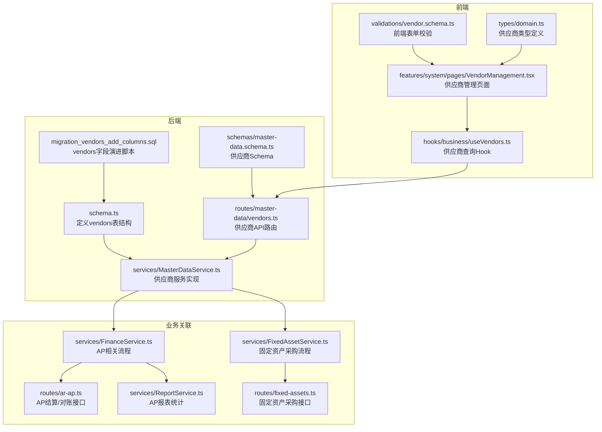
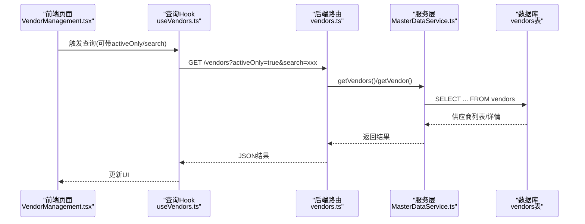
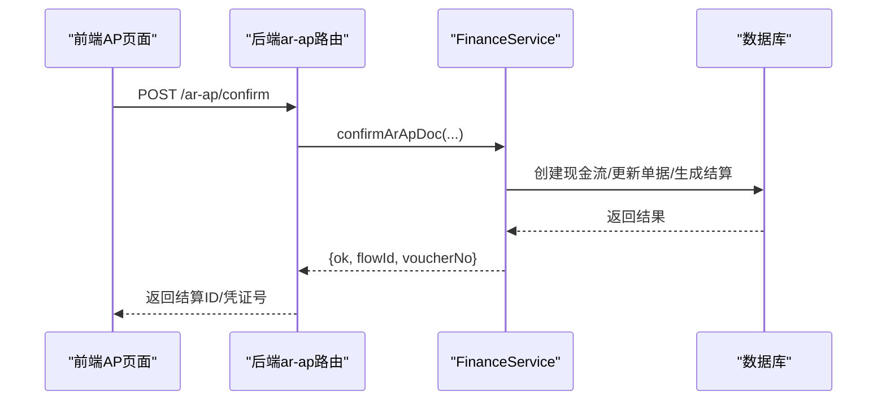
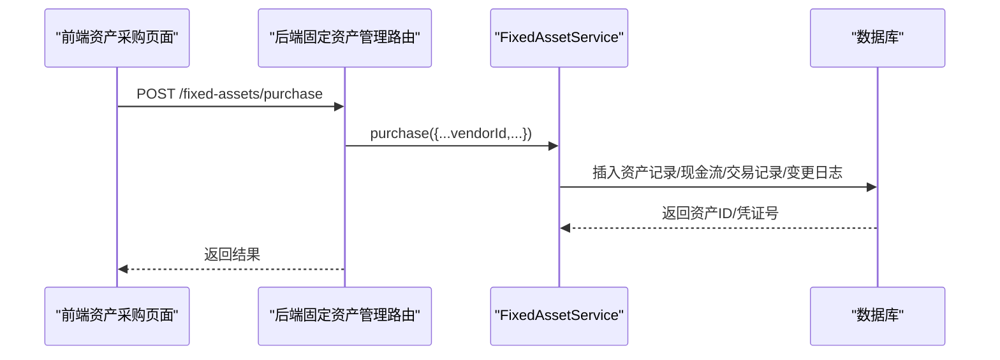
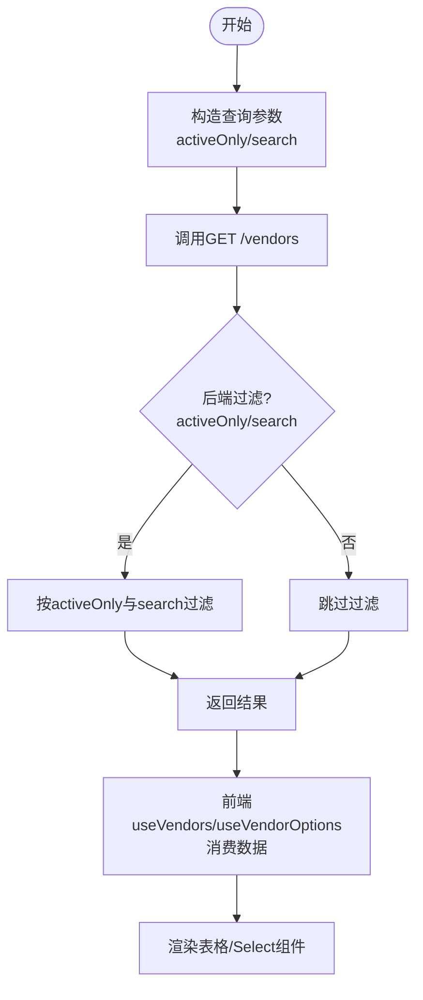
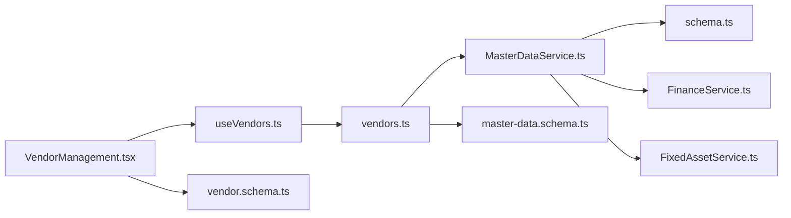
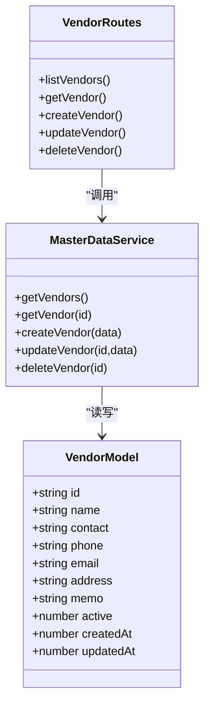

# 供应商模型

<cite>
**本文引用的文件**
- [schema.ts](file://backend/src/db/schema.ts)
- [migration_vendors_add_columns.sql](file://backend/src/db/archive/migration_vendors_add_columns.sql)
- [vendors.ts](file://backend/src/routes/master-data/vendors.ts)
- [MasterDataService.ts](file://backend/src/services/MasterDataService.ts)
- [master-data.schema.ts](file://backend/src/schemas/master-data.schema.ts)
- [VendorManagement.tsx](file://frontend/src/features/system/pages/VendorManagement.tsx)
- [useVendors.ts](file://frontend/src/hooks/business/useVendors.ts)
- [vendor.schema.ts](file://frontend/src/validations/vendor.schema.ts)
- [domain.ts](file://frontend/src/types/domain.ts)
- [FinanceService.ts](file://backend/src/services/FinanceService.ts)
- [ar-ap.ts](file://backend/src/routes/ar-ap.ts)
- [ReportService.ts](file://backend/src/services/ReportService.ts)
- [ReportAPSummary.tsx](file://frontend/src/features/reports/pages/ReportAPSummary.tsx)
- [FixedAssetService.ts](file://backend/src/services/FixedAssetService.ts)
- [fixed-assets.ts](file://backend/src/routes/fixed-assets.ts)
- [FixedAssetPurchase.tsx](file://frontend/src/features/assets/pages/FixedAssetPurchase.tsx)
</cite>

## 目录
1. [简介](#简介)
2. [项目结构](#项目结构)
3. [核心组件](#核心组件)
4. [架构总览](#架构总览)
5. [详细组件分析](#详细组件分析)
6. [依赖关系分析](#依赖关系分析)
7. [性能考量](#性能考量)
8. [故障排查指南](#故障排查指南)
9. [结论](#结论)
10. [附录](#附录)

## 简介
本文件系统性梳理“供应商模型”的数据库结构、后端接口与服务层实现、前端页面与查询集成，并结合迁移脚本说明供应商字段的演进过程。同时阐述供应商在应付账款（AP）与固定资产采购中的关键作用，提供查询过滤与前端选择器集成的完整示例，以及数据维护最佳实践。

## 项目结构
供应商模型涉及后端数据库表vendors、路由vendors.ts、服务层MasterDataService.ts、OpenAPI Schema定义、以及前端VendorManagement页面与查询Hook。

图表来源
- [schema.ts](file://backend/src/db/schema.ts#L89-L100)
- [migration_vendors_add_columns.sql](file://backend/src/db/archive/migration_vendors_add_columns.sql#L1-L18)
- [vendors.ts](file://backend/src/routes/master-data/vendors.ts#L1-L237)
- [MasterDataService.ts](file://backend/src/services/MasterDataService.ts#L279-L334)
- [master-data.schema.ts](file://backend/src/schemas/master-data.schema.ts#L101-L117)
- [VendorManagement.tsx](file://frontend/src/features/system/pages/VendorManagement.tsx#L1-L167)
- [useVendors.ts](file://frontend/src/hooks/business/useVendors.ts#L1-L68)
- [vendor.schema.ts](file://frontend/src/validations/vendor.schema.ts#L1-L9)
- [domain.ts](file://frontend/src/types/domain.ts#L236-L253)
- [FinanceService.ts](file://backend/src/services/FinanceService.ts#L365-L435)
- [ar-ap.ts](file://backend/src/routes/ar-ap.ts#L246-L291)
- [ReportService.ts](file://backend/src/services/ReportService.ts#L235-L256)
- [FixedAssetService.ts](file://backend/src/services/FixedAssetService.ts#L417-L539)
- [fixed-assets.ts](file://backend/src/routes/fixed-assets.ts#L511-L563)

章节来源
- [schema.ts](file://backend/src/db/schema.ts#L89-L100)
- [vendors.ts](file://backend/src/routes/master-data/vendors.ts#L1-L237)
- [MasterDataService.ts](file://backend/src/services/MasterDataService.ts#L279-L334)
- [VendorManagement.tsx](file://frontend/src/features/system/pages/VendorManagement.tsx#L1-L167)
- [useVendors.ts](file://frontend/src/hooks/business/useVendors.ts#L1-L68)

## 核心组件
- 数据库表vendors：包含基础信息（name、contact、phone、email）、地址信息（address）、状态与时间戳（active、createdAt、updatedAt），并支持memo备注。
- 迁移脚本migration_vendors_add_columns.sql：为vendors表添加phone、email、address、memo、active、created_at、updated_at等列，并设置默认索引。
- 后端路由vendors.ts：提供供应商列表、详情、创建、更新、删除接口，支持activeOnly与search参数过滤。
- 服务层MasterDataService.ts：封装供应商的增删改查与软删除逻辑，提供按启用状态排序的列表查询。
- 前端VendorManagement.tsx：供应商管理页面，支持新建、编辑、批量删除、刷新与表格展示。
- 查询Hook useVendors.ts：封装供应商列表与Select选项查询，支持activeOnly与search参数。
- Schema与类型：后端OpenAPI Schema与前端类型定义保持一致，确保前后端契约稳定。

章节来源
- [schema.ts](file://backend/src/db/schema.ts#L89-L100)
- [migration_vendors_add_columns.sql](file://backend/src/db/archive/migration_vendors_add_columns.sql#L1-L18)
- [vendors.ts](file://backend/src/routes/master-data/vendors.ts#L1-L237)
- [MasterDataService.ts](file://backend/src/services/MasterDataService.ts#L279-L334)
- [VendorManagement.tsx](file://frontend/src/features/system/pages/VendorManagement.tsx#L1-L167)
- [useVendors.ts](file://frontend/src/hooks/business/useVendors.ts#L1-L68)
- [master-data.schema.ts](file://backend/src/schemas/master-data.schema.ts#L101-L117)
- [domain.ts](file://frontend/src/types/domain.ts#L236-L253)

## 架构总览
供应商模型在系统中的位置与职责：
- 数据层：vendors表承载供应商主数据，迁移脚本保证字段完整性与索引。
- 应用层：vendors路由负责请求校验与权限控制，调用MasterDataService执行业务逻辑。
- 前端层：VendorManagement页面与useVendors Hook提供查询、筛选与表单交互。
- 业务关联：供应商作为AP单据的对方主体，参与固定资产采购流程，支撑报表统计。

图表来源
- [VendorManagement.tsx](file://frontend/src/features/system/pages/VendorManagement.tsx#L1-L167)
- [useVendors.ts](file://frontend/src/hooks/business/useVendors.ts#L1-L68)
- [vendors.ts](file://backend/src/routes/master-data/vendors.ts#L1-L237)
- [MasterDataService.ts](file://backend/src/services/MasterDataService.ts#L279-L334)
- [schema.ts](file://backend/src/db/schema.ts#L89-L100)

## 详细组件分析

### 数据库结构与迁移演进
- vendors表字段
  - 基础信息：id、name、contact、phone、email
  - 地址信息：address
  - 备注：memo
  - 状态与时间：active、createdAt、updatedAt
- 迁移脚本要点
  - 添加phone、email、address、memo、active、created_at、updated_at列
  - 设置active默认值为1，created_at/updated_at默认为当前时间戳
  - 为name与active建立索引以提升查询效率

章节来源
- [schema.ts](file://backend/src/db/schema.ts#L89-L100)
- [migration_vendors_add_columns.sql](file://backend/src/db/archive/migration_vendors_add_columns.sql#L1-L18)

### 后端路由与服务层
- 路由vendors.ts
  - 列表接口：支持activeOnly与search参数，后端进行二次过滤
  - 详情接口：按id查询供应商
  - 新建接口：基于OpenAPI Schema校验，写入vendors
  - 更新接口：基于OpenAPI Schema校验，更新vendors
  - 删除接口：软删除（active置0）
- 服务层MasterDataService.ts
  - getVendors：按active=1排序返回供应商列表
  - getVendor：按id查询供应商
  - createVendor/updateVendor/deleteVendor：标准CRUD与软删除
  - 注意：更新时若未传入name，需在服务层做兼容处理（建议允许部分更新）

章节来源
- [vendors.ts](file://backend/src/routes/master-data/vendors.ts#L1-L237)
- [MasterDataService.ts](file://backend/src/services/MasterDataService.ts#L279-L334)
- [master-data.schema.ts](file://backend/src/schemas/master-data.schema.ts#L101-L117)

### 前端页面与查询集成
- 页面VendorManagement.tsx
  - 使用useVendors Hook加载供应商列表
  - 支持新建/编辑/删除/批量删除/刷新
  - 表单使用vendor.schema.ts进行校验
- 查询Hook useVendors.ts
  - 支持activeOnly与search参数
  - 提供Select选项格式化函数useVendorOptions
- 类型定义domain.ts
  - 定义Vendor接口，包含id、name、contact、address、active、createdAt、updatedAt等字段

章节来源
- [VendorManagement.tsx](file://frontend/src/features/system/pages/VendorManagement.tsx#L1-L167)
- [useVendors.ts](file://frontend/src/hooks/business/useVendors.ts#L1-L68)
- [vendor.schema.ts](file://frontend/src/validations/vendor.schema.ts#L1-L9)
- [domain.ts](file://frontend/src/types/domain.ts#L236-L253)

### 供应商在应付账款（AP）中的关键作用
- 单据对方主体：AP单据的partyId通常指向供应商（vendors）。
- 结算与确认：FinanceService在确认AP单据时，会创建现金流、生成结算记录并更新单据状态。
- 报表统计：ReportService提供AP汇总与明细统计，供应商作为维度之一参与统计。

图表来源
- [FinanceService.ts](file://backend/src/services/FinanceService.ts#L365-L435)
- [ar-ap.ts](file://backend/src/routes/ar-ap.ts#L246-L291)
- [ReportService.ts](file://backend/src/services/ReportService.ts#L235-L256)
- [ReportAPSummary.tsx](file://frontend/src/features/reports/pages/ReportAPSummary.tsx#L1-L26)

章节来源
- [FinanceService.ts](file://backend/src/services/FinanceService.ts#L365-L435)
- [ar-ap.ts](file://backend/src/routes/ar-ap.ts#L246-L291)
- [ReportService.ts](file://backend/src/services/ReportService.ts#L235-L256)
- [ReportAPSummary.tsx](file://frontend/src/features/reports/pages/ReportAPSummary.tsx#L1-L26)

### 供应商在固定资产采购中的关键作用
- 资产采购流程：FixedAssetService.purchase接收vendorId，用于记录供应商信息并在现金流memo中体现。
- 路由固定资产管理：/fixed-assets/purchase接口接收vendorId等参数，完成资产入库、现金流与会计分录。

图表来源
- [FixedAssetService.ts](file://backend/src/services/FixedAssetService.ts#L417-L539)
- [fixed-assets.ts](file://backend/src/routes/fixed-assets.ts#L511-L563)
- [FixedAssetPurchase.tsx](file://frontend/src/features/assets/pages/FixedAssetPurchase.tsx#L28-L58)

章节来源
- [FixedAssetService.ts](file://backend/src/services/FixedAssetService.ts#L417-L539)
- [fixed-assets.ts](file://backend/src/routes/fixed-assets.ts#L511-L563)
- [FixedAssetPurchase.tsx](file://frontend/src/features/assets/pages/FixedAssetPurchase.tsx#L28-L58)

### 查询过滤与前端选择器集成示例
- 后端过滤
  - activeOnly=true：仅返回active=1的供应商
  - search：按name模糊匹配（小写比较）
- 前端查询
  - useVendors(params)：支持activeOnly与search参数
  - useVendorOptions：将供应商转换为Select组件可用的{value,label}数组
- 页面集成
  - VendorManagement页面通过useVendors加载列表，支持刷新与批量删除

图表来源
- [vendors.ts](file://backend/src/routes/master-data/vendors.ts#L1-L237)
- [useVendors.ts](file://frontend/src/hooks/business/useVendors.ts#L1-L68)
- [VendorManagement.tsx](file://frontend/src/features/system/pages/VendorManagement.tsx#L1-L167)

章节来源
- [vendors.ts](file://backend/src/routes/master-data/vendors.ts#L1-L237)
- [useVendors.ts](file://frontend/src/hooks/business/useVendors.ts#L1-L68)
- [VendorManagement.tsx](file://frontend/src/features/system/pages/VendorManagement.tsx#L1-L167)

## 依赖关系分析
- 路由vendors.ts依赖OpenAPI Schema与权限工具，调用MasterDataService
- MasterDataService依赖Drizzle ORM与schema.ts中的vendors表定义
- 前端VendorManagement.tsx依赖useVendors Hook与vendor.schema.ts
- 业务关联：FinanceService与FixedAssetService分别在AP与资产采购场景中引用供应商

图表来源
- [vendors.ts](file://backend/src/routes/master-data/vendors.ts#L1-L237)
- [MasterDataService.ts](file://backend/src/services/MasterDataService.ts#L279-L334)
- [schema.ts](file://backend/src/db/schema.ts#L89-L100)
- [master-data.schema.ts](file://backend/src/schemas/master-data.schema.ts#L101-L117)
- [VendorManagement.tsx](file://frontend/src/features/system/pages/VendorManagement.tsx#L1-L167)
- [useVendors.ts](file://frontend/src/hooks/business/useVendors.ts#L1-L68)
- [vendor.schema.ts](file://frontend/src/validations/vendor.schema.ts#L1-L9)
- [FinanceService.ts](file://backend/src/services/FinanceService.ts#L365-L435)
- [FixedAssetService.ts](file://backend/src/services/FixedAssetService.ts#L417-L539)

章节来源
- [vendors.ts](file://backend/src/routes/master-data/vendors.ts#L1-L237)
- [MasterDataService.ts](file://backend/src/services/MasterDataService.ts#L279-L334)
- [VendorManagement.tsx](file://frontend/src/features/system/pages/VendorManagement.tsx#L1-L167)
- [useVendors.ts](file://frontend/src/hooks/business/useVendors.ts#L1-L68)

## 性能考量
- 索引策略：迁移脚本为vendors.name与vendors.active建立索引，有助于列表查询与过滤性能
- 查询优化：后端对activeOnly与search进行二次过滤，建议在高频查询场景考虑数据库层面的where条件优化
- 缓存策略：前端useVendors默认staleTime为5分钟，减少重复请求
- 批量操作：前端提供批量删除，服务端采用逐条删除（可考虑批量删除优化）

章节来源
- [migration_vendors_add_columns.sql](file://backend/src/db/archive/migration_vendors_add_columns.sql#L16-L18)
- [vendors.ts](file://backend/src/routes/master-data/vendors.ts#L34-L55)
- [useVendors.ts](file://frontend/src/hooks/business/useVendors.ts#L1-L68)

## 故障排查指南
- 供应商名称冲突
  - 后端在创建/更新时可能抛出重复错误，前端应捕获并提示
- 权限不足
  - 新建/更新/删除接口需要相应权限，无权限时返回禁止访问
- 供应商删除限制
  - 若存在关联业务记录（如AP单据），删除可能被拒绝
- 前端表单校验
  - vendor.schema.ts对name与contact进行长度与必填约束，需在表单中正确展示错误信息

章节来源
- [vendors.ts](file://backend/src/routes/master-data/vendors.ts#L114-L237)
- [vendor.schema.ts](file://frontend/src/validations/vendor.schema.ts#L1-L9)
- [VendorManagement.tsx](file://frontend/src/features/system/pages/VendorManagement.tsx#L1-L167)

## 结论
供应商模型通过vendors表承载核心主数据，配合迁移脚本完善字段与索引，后端提供完善的CRUD与过滤能力，前端通过页面与Hook实现高效查询与选择器集成。在AP与固定资产采购两大业务场景中，供应商作为关键外部实体贯穿单据、结算与资产入账流程，形成完整的财务闭环。

## 附录

### 供应商模型类图（代码级）

图表来源
- [schema.ts](file://backend/src/db/schema.ts#L89-L100)
- [MasterDataService.ts](file://backend/src/services/MasterDataService.ts#L279-L334)
- [vendors.ts](file://backend/src/routes/master-data/vendors.ts#L1-L237)