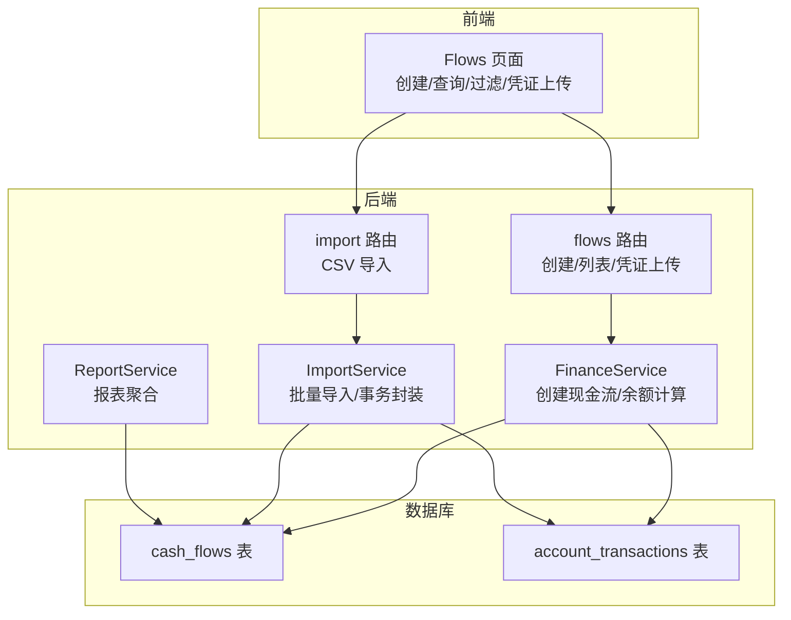
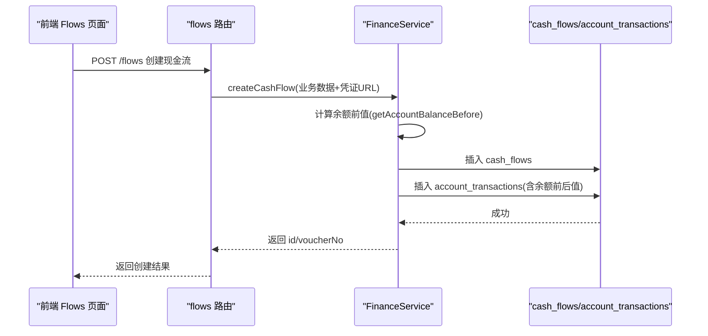
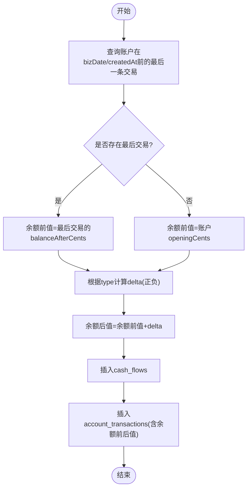
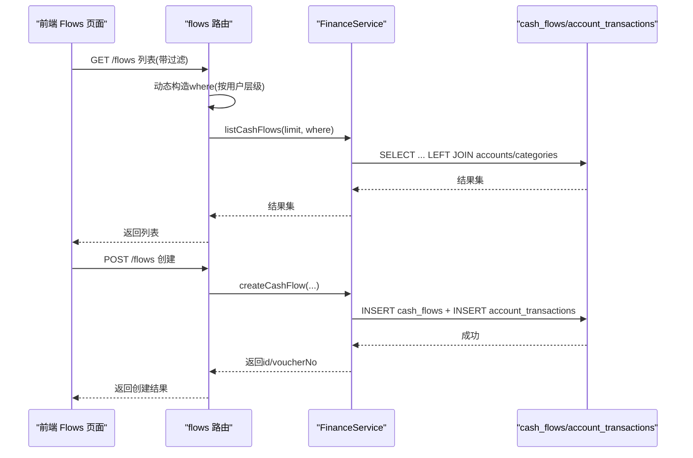
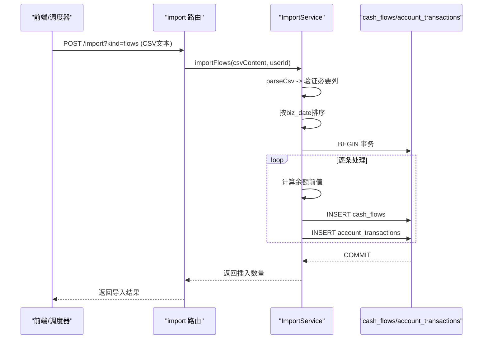
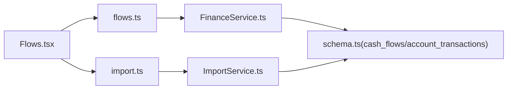

# 现金流模型

<cite>
**本文引用的文件**
- [schema.ts](file://backend/src/db/schema.ts)
- [FinanceService.ts](file://backend/src/services/FinanceService.ts)
- [flows.ts](file://backend/src/routes/flows.ts)
- [business.schema.ts](file://backend/src/schemas/business.schema.ts)
- [csv.ts](file://backend/src/utils/csv.ts)
- [ImportService.ts](file://backend/src/services/ImportService.ts)
- [import.ts](file://backend/src/routes/import.ts)
- [Flows.tsx](file://frontend/src/features/finance/pages/Flows.tsx)
- [flow.schema.ts](file://frontend/src/validations/flow.schema.ts)
- [import-flows-example.csv](file://frontend/public/examples/import-flows-example.csv)
- [ReportService.ts](file://backend/src/services/ReportService.ts)
- [reports.ts](file://backend/src/routes/reports.ts)
</cite>

## 目录
1. [简介](#简介)
2. [项目结构](#项目结构)
3. [核心组件](#核心组件)
4. [架构总览](#架构总览)
5. [详细组件分析](#详细组件分析)
6. [依赖关系分析](#依赖关系分析)
7. [性能考量](#性能考量)
8. [故障排查指南](#故障排查指南)
9. [结论](#结论)
10. [附录](#附录)

## 简介
本文件围绕“现金流模型”进行深入技术文档化，聚焦于后端数据库表 cash_flows 的核心字段与业务语义，以及与 account_transactions 的关联机制如何确保账户余额准确。同时结合前端 Flows 页面，说明现金流记录的创建、查询与过滤能力；并给出批量导入的最佳实践与数据一致性校验机制，最后为财务模块开发者提供高性能查询与报表生成的指导。

## 项目结构
- 后端采用 Drizzle ORM + D1 数据库，cash_flows 与 account_transactions 是核心交易表。
- 前端提供 Flows 页面用于录入、查看、上传凭证等。
- 提供 CSV 导入接口，支持批量导入现金流数据。

图表来源
- [flows.ts](file://backend/src/routes/flows.ts#L1-L424)
- [import.ts](file://backend/src/routes/import.ts#L1-L65)
- [FinanceService.ts](file://backend/src/services/FinanceService.ts#L1-L200)
- [ImportService.ts](file://backend/src/services/ImportService.ts#L1-L113)
- [schema.ts](file://backend/src/db/schema.ts#L165-L193)
- [ReportService.ts](file://backend/src/services/ReportService.ts#L120-L156)

章节来源
- [schema.ts](file://backend/src/db/schema.ts#L165-L193)
- [flows.ts](file://backend/src/routes/flows.ts#L1-L424)
- [import.ts](file://backend/src/routes/import.ts#L1-L65)
- [FinanceService.ts](file://backend/src/services/FinanceService.ts#L1-L200)
- [ImportService.ts](file://backend/src/services/ImportService.ts#L1-L113)
- [ReportService.ts](file://backend/src/services/ReportService.ts#L120-L156)

## 核心组件
- 数据模型
  - cash_flows：记录每笔现金流的业务事实，包含业务日期、收支类型、金额（分）、币种、账户、部门/站点、摘要、凭证等。
  - account_transactions：记录账户的逐笔交易流水，包含余额前后值，用于保证余额准确性。
- 服务层
  - FinanceService：负责创建现金流、计算余额、查询列表等。
  - ImportService：负责 CSV 批量导入，按日期排序并使用事务保证一致性。
- 路由层
  - flows 路由：提供创建、列表、凭证上传/下载、凭证更新等接口。
  - import 路由：提供 CSV 导入入口。
- 前端
  - Flows 页面：提供表单录入、凭证上传、表格展示、批量删除、凭证预览等。

章节来源
- [schema.ts](file://backend/src/db/schema.ts#L165-L193)
- [FinanceService.ts](file://backend/src/services/FinanceService.ts#L71-L128)
- [flows.ts](file://backend/src/routes/flows.ts#L303-L423)
- [import.ts](file://backend/src/routes/import.ts#L51-L65)
- [ImportService.ts](file://backend/src/services/ImportService.ts#L12-L113)
- [Flows.tsx](file://frontend/src/features/finance/pages/Flows.tsx#L1-L537)

## 架构总览
现金流从创建到落库的关键流程如下：

图表来源
- [flows.ts](file://backend/src/routes/flows.ts#L303-L374)
- [FinanceService.ts](file://backend/src/services/FinanceService.ts#L71-L128)

章节来源
- [flows.ts](file://backend/src/routes/flows.ts#L303-L374)
- [FinanceService.ts](file://backend/src/services/FinanceService.ts#L41-L128)

## 详细组件分析

### 数据模型与字段语义
cash_flows 表核心字段与含义：
- biz_date：业务日期，作为余额计算的时间锚点。
- type：收支类型，income/expense 等。
- amount_cents：金额，单位为“分”，便于精确存储与计算。
- accountId：资金账户标识，与 accounts 关联。
- categoryId/siteId/departmentId：归属维度，便于按部门/站点统计。
- counterparty：对方信息，便于溯源。
- memo：备注，用于业务说明与审计。
- voucherUrl：凭证 URL（支持数组 JSON 存储），用于附件管理。
- createdBy/createdAt：创建人与时间戳，便于审计。
- voucherNo：凭证号，用于业务编号与检索。

account_transactions 表核心字段与含义：
- accountId：账户标识。
- flowId：关联 cash_flows 的 id。
- transactionDate：交易日期。
- transactionType：交易类型（income/expense/transfer_*）。
- amountCents：交易金额（分）。
- balanceBeforeCents/balanceAfterCents：余额前后值，确保余额准确性。
- createdAt：记录创建时间。

字段复杂度与索引建议（基于现有实现与查询模式）：
- 查询与排序常基于 biz_date、createdAt、accountId、departmentId/siteId 等，建议在这些列上建立合适索引以提升查询性能。
- 余额计算依赖 account_transactions 的有序性，当前通过交易时间戳与日期组合排序实现，建议在交易表上建立复合索引以优化 getAccountBalanceBefore。

章节来源
- [schema.ts](file://backend/src/db/schema.ts#L165-L193)
- [FinanceService.ts](file://backend/src/services/FinanceService.ts#L41-L69)

### 余额计算与一致性保障
FinanceService 中的余额计算逻辑：
- 通过 account_transactions 获取某账户在指定日期/时间之前的最后一笔交易，取其 balance_after_cents 作为“余额前值”；若无则取账户初始 opening_cents。
- 新交易的“余额后值” = 余额前值 ± 金额（收入加、支出减）。
- 两步写入：先插入 cash_flows，再插入 account_transactions，形成“事实表 + 流水表”的双写，确保余额可追溯。

图表来源
- [FinanceService.ts](file://backend/src/services/FinanceService.ts#L41-L128)

章节来源
- [FinanceService.ts](file://backend/src/services/FinanceService.ts#L41-L128)

### 前端 Flows 页面：创建、查询与过滤
- 创建：表单包含业务日期、类型、金额、账户、类别、对方、备注、凭证上传等；提交时将金额转换为“分”，owner_scope 控制“总部/项目”归属。
- 查询：列表接口支持按用户权限过滤（HQ 全见、项目级过滤、团队级仅见本人创建）。
- 过滤：前端可选择日期范围、类型、账户、类别、部门/站点等条件，后端路由中对 where 条件进行动态拼接。
- 凭证：支持多图上传并转换为 WebP，支持补充/重新上传凭证 URL 数组。

图表来源
- [flows.ts](file://backend/src/routes/flows.ts#L82-L196)
- [flows.ts](file://backend/src/routes/flows.ts#L303-L374)
- [FinanceService.ts](file://backend/src/services/FinanceService.ts#L138-L152)

章节来源
- [flows.ts](file://backend/src/routes/flows.ts#L82-L196)
- [flows.ts](file://backend/src/routes/flows.ts#L303-L374)
- [Flows.tsx](file://frontend/src/features/finance/pages/Flows.tsx#L1-L537)
- [flow.schema.ts](file://frontend/src/validations/flow.schema.ts#L1-L30)

### 批量导入：最佳实践与一致性校验
- 导入入口：POST /import?kind=flows，请求体为 CSV 文本。
- CSV 字段映射：biz_date、type、account_id、amount、site_id、department_id、counterparty、memo、category_id、voucher_no、method。
- 一致性保障：
  - 使用事务包裹整个批次，失败回滚。
  - 按 biz_date 升序排序，确保余额计算顺序正确。
  - 逐条插入 cash_flows 与 account_transactions，保持余额前后值一致。
  - 金额统一转换为“分”，避免浮点误差。
- 最佳实践：
  - 导入前准备：确保 CSV 包含必要列；金额为数值；日期格式规范；账户存在且有效。
  - 导入后核对：检查导入数量与余额是否一致；对异常数据进行人工复核。
  - 并发控制：导入期间避免并发写入导致的余额错乱，可在导入任务中加锁或串行化。

图表来源
- [import.ts](file://backend/src/routes/import.ts#L51-L65)
- [ImportService.ts](file://backend/src/services/ImportService.ts#L12-L113)
- [csv.ts](file://backend/src/utils/csv.ts#L1-L16)

章节来源
- [import.ts](file://backend/src/routes/import.ts#L51-L65)
- [ImportService.ts](file://backend/src/services/ImportService.ts#L12-L113)
- [csv.ts](file://backend/src/utils/csv.ts#L1-L16)
- [import-flows-example.csv](file://frontend/public/examples/import-flows-example.csv#L1-L5)

### 业务追溯：memo 与 ref_id 的作用
- memo（备注）：提供业务说明与审计线索，便于后续查询与对账。
- ref_id（关联单据 ID）：在当前 cash_flows 字段定义中未出现 ref_id 字段。若需与 AR/AP、借款/还款等单据建立强关联，可在业务设计中扩展字段或通过外部单据表与 settlement 表进行关联。建议在业务层面约定 ref_id 的命名与来源，确保跨模块可追溯。

章节来源
- [schema.ts](file://backend/src/db/schema.ts#L165-L193)
- [FinanceService.ts](file://backend/src/services/FinanceService.ts#L388-L435)

### 报表与高性能查询指导
- 报表示例：部门现金流、站点增长、账户余额等。
- 高性能建议：
  - 在 cash_flows 上建立复合索引：biz_date、department_id、site_id、accountId、type。
  - 在 account_transactions 上建立复合索引：accountId、transactionDate、createdAt。
  - 对高频报表查询使用物化视图或缓存策略，定期刷新。
  - 分页与限制：列表默认限制数量，避免一次性返回过多数据。
  - 过滤下推：尽量在数据库侧完成 where 条件过滤，减少应用层二次筛选。

章节来源
- [ReportService.ts](file://backend/src/services/ReportService.ts#L120-L156)
- [reports.ts](file://backend/src/routes/reports.ts#L76-L106)

## 依赖关系分析
- 路由层依赖服务层，服务层依赖数据库模型与工具函数。
- 前端依赖路由提供的 API，路由与服务共同保证数据一致性与业务规则。

图表来源
- [flows.ts](file://backend/src/routes/flows.ts#L1-L424)
- [import.ts](file://backend/src/routes/import.ts#L1-L65)
- [FinanceService.ts](file://backend/src/services/FinanceService.ts#L1-L200)
- [ImportService.ts](file://backend/src/services/ImportService.ts#L1-L113)
- [schema.ts](file://backend/src/db/schema.ts#L165-L193)
- [Flows.tsx](file://frontend/src/features/finance/pages/Flows.tsx#L1-L537)

章节来源
- [flows.ts](file://backend/src/routes/flows.ts#L1-L424)
- [import.ts](file://backend/src/routes/import.ts#L1-L65)
- [FinanceService.ts](file://backend/src/services/FinanceService.ts#L1-L200)
- [ImportService.ts](file://backend/src/services/ImportService.ts#L1-L113)
- [schema.ts](file://backend/src/db/schema.ts#L165-L193)
- [Flows.tsx](file://frontend/src/features/finance/pages/Flows.tsx#L1-L537)

## 性能考量
- 余额计算：getAccountBalanceBefore 使用“交易日期 < 指定日期 OR (交易日期=指定日期 且 创建时间 < 指定时间)”的排序与 LIMIT 1，建议在 account_transactions 上建立复合索引以降低扫描成本。
- 列表查询：flows 列表接口默认限制数量，建议前端分页加载；后端按日期与创建时间降序，利于快速获取最新记录。
- 批量导入：事务内逐条插入，避免中间状态；按日期排序确保余额连续性。
- 报表查询：ReportService 对多表聚合，建议在 cash_flows 与相关维度表上建立索引，必要时引入物化视图或缓存。

[本节为通用性能建议，无需特定文件引用]

## 故障排查指南
- 凭证上传失败：检查文件大小、格式限制与 R2 存储权限；前端提示与后端错误码需一致。
- 余额不一致：核对导入顺序是否按日期排序；检查是否存在并发写入；确认金额单位是否为“分”。
- 列表无数据：确认用户权限层级与 where 条件是否正确；检查过滤参数是否匹配实际数据。
- 导入 CSV 格式问题：确认 CSV 是否包含必要列；金额是否为数值；日期格式是否正确。

章节来源
- [flows.ts](file://backend/src/routes/flows.ts#L198-L301)
- [ImportService.ts](file://backend/src/services/ImportService.ts#L12-L113)
- [csv.ts](file://backend/src/utils/csv.ts#L1-L16)

## 结论
cash_flows 与 account_transactions 的双写模型确保了现金流事实与余额流水的完整性与可追溯性。前端 Flows 页面提供了完善的录入、查询与凭证管理能力；后端通过 FinanceService 与 ImportService 实现了严谨的余额计算与批量导入一致性保障。配合合理的索引与报表策略，可满足财务模块对准确性与性能的双重需求。

[本节为总结性内容，无需特定文件引用]

## 附录
- 字段定义参考：cash_flows 与 account_transactions 的字段说明与用途。
- 前端表单与校验：Flows 页面表单字段与前端校验规则。
- 导入样例：CSV 字段与示例数据。

章节来源
- [schema.ts](file://backend/src/db/schema.ts#L165-L193)
- [Flows.tsx](file://frontend/src/features/finance/pages/Flows.tsx#L1-L537)
- [flow.schema.ts](file://frontend/src/validations/flow.schema.ts#L1-L30)
- [import-flows-example.csv](file://frontend/public/examples/import-flows-example.csv#L1-L5)