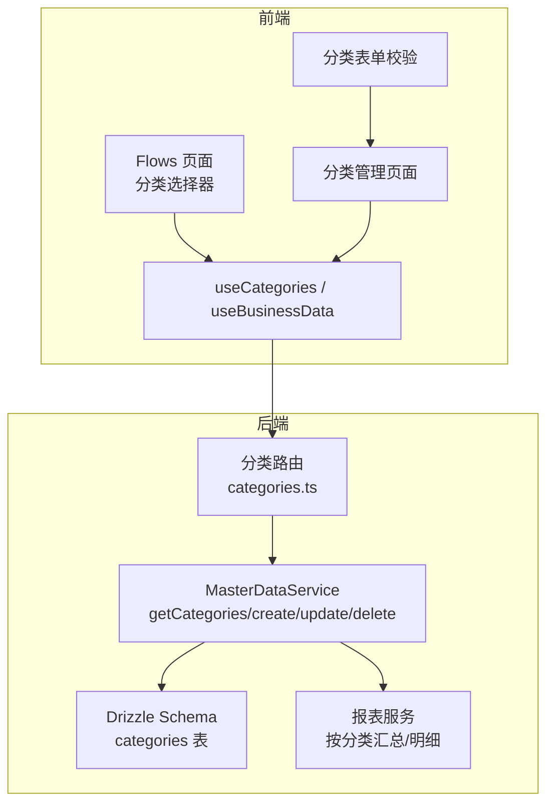
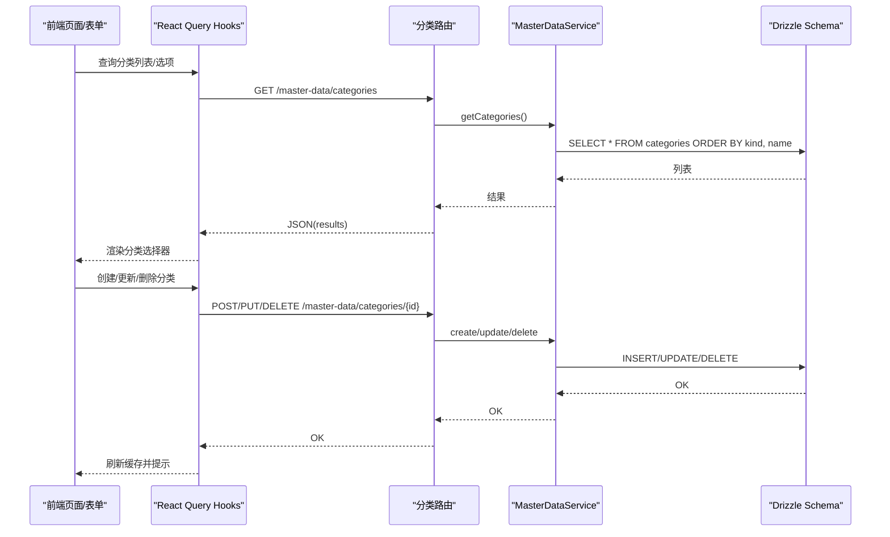
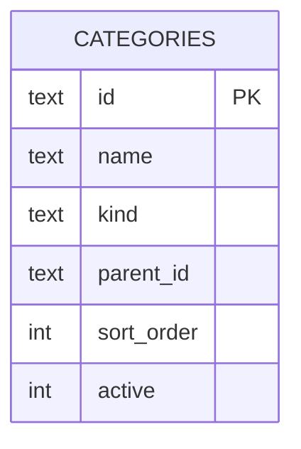
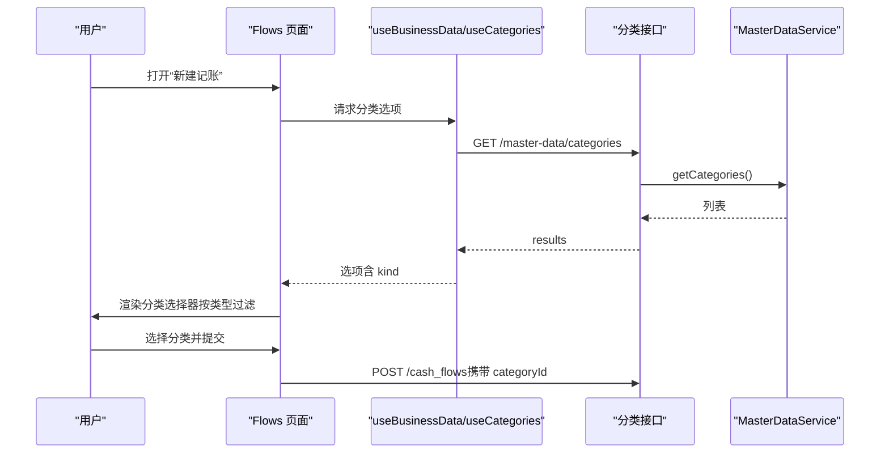
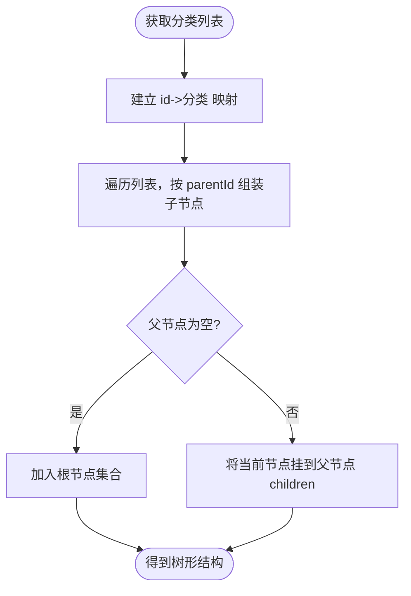
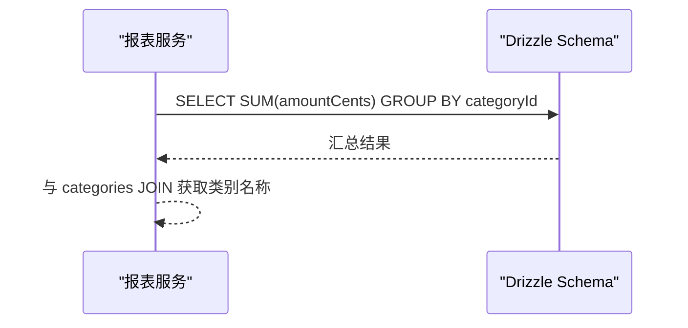
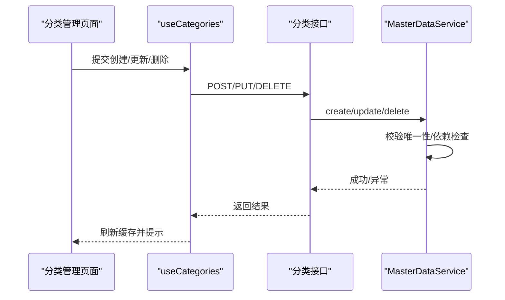
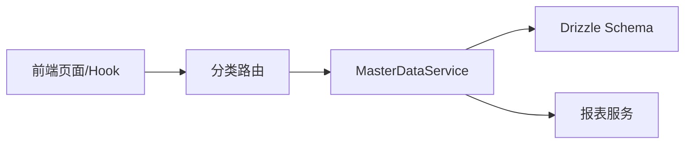

# 财务分类模型

<cite>
**本文引用的文件**
- [backend/src/db/schema.ts](file://backend/src/db/schema.ts)
- [backend/src/routes/master-data/categories.ts](file://backend/src/routes/master-data/categories.ts)
- [backend/src/services/MasterDataService.ts](file://backend/src/services/MasterDataService.ts)
- [backend/src/schemas/master-data.schema.ts](file://backend/src/schemas/master-data.schema.ts)
- [frontend/src/features/finance/pages/Flows.tsx](file://frontend/src/features/finance/pages/Flows.tsx)
- [frontend/src/features/system/pages/CategoryManagement.tsx](file://frontend/src/features/system/pages/CategoryManagement.tsx)
- [frontend/src/hooks/business/useCategories.ts](file://frontend/src/hooks/business/useCategories.ts)
- [frontend/src/hooks/useBusinessData.ts](file://frontend/src/hooks/useBusinessData.ts)
- [frontend/src/validations/category.schema.ts](file://frontend/src/validations/category.schema.ts)
- [backend/src/services/ReportService.ts](file://backend/src/services/ReportService.ts)
</cite>

## 目录
1. [引言](#引言)
2. [项目结构](#项目结构)
3. [核心组件](#核心组件)
4. [架构总览](#架构总览)
5. [详细组件分析](#详细组件分析)
6. [依赖关系分析](#依赖关系分析)
7. [性能考虑](#性能考虑)
8. [故障排查指南](#故障排查指南)
9. [结论](#结论)
10. [附录](#附录)

## 引言
本文件面向财务分类模型的全面文档化，围绕 categories 表的树形结构设计与业务落地展开，重点说明：
- 字段设计与业务含义：id、name、kind（income/expense）、parentId、sortOrder、active
- 分类在财务记账中的核心作用：如何通过分类实现收支的层级化管理
- 前端展示排序：sortOrder 在前端选择器中的应用
- Flows 页面的分类选择器实现机制
- 分类数据的递归查询方法与前端树形组件集成最佳实践
- 分类创建、编辑、删除的完整工作流示例

## 项目结构
财务分类模型横跨后端路由、服务层、数据库模式与前端页面与 Hook，形成“请求—校验—持久化—查询—展示”的闭环。



图表来源
- [backend/src/routes/master-data/categories.ts](file://backend/src/routes/master-data/categories.ts#L1-L155)
- [backend/src/services/MasterDataService.ts](file://backend/src/services/MasterDataService.ts#L415-L466)
- [backend/src/db/schema.ts](file://backend/src/db/schema.ts#L303-L310)
- [frontend/src/features/finance/pages/Flows.tsx](file://frontend/src/features/finance/pages/Flows.tsx#L1-L537)
- [frontend/src/features/system/pages/CategoryManagement.tsx](file://frontend/src/features/system/pages/CategoryManagement.tsx#L1-L141)
- [frontend/src/hooks/business/useCategories.ts](file://frontend/src/hooks/business/useCategories.ts#L1-L90)
- [frontend/src/hooks/useBusinessData.ts](file://frontend/src/hooks/useBusinessData.ts#L69-L112)
- [frontend/src/validations/category.schema.ts](file://frontend/src/validations/category.schema.ts#L1-L9)
- [backend/src/services/ReportService.ts](file://backend/src/services/ReportService.ts#L279-L337)

章节来源
- [backend/src/routes/master-data/categories.ts](file://backend/src/routes/master-data/categories.ts#L1-L155)
- [backend/src/services/MasterDataService.ts](file://backend/src/services/MasterDataService.ts#L415-L466)
- [backend/src/db/schema.ts](file://backend/src/db/schema.ts#L303-L310)
- [frontend/src/features/finance/pages/Flows.tsx](file://frontend/src/features/finance/pages/Flows.tsx#L1-L537)
- [frontend/src/features/system/pages/CategoryManagement.tsx](file://frontend/src/features/system/pages/CategoryManagement.tsx#L1-L141)
- [frontend/src/hooks/business/useCategories.ts](file://frontend/src/hooks/business/useCategories.ts#L1-L90)
- [frontend/src/hooks/useBusinessData.ts](file://frontend/src/hooks/useBusinessData.ts#L69-L112)
- [frontend/src/validations/category.schema.ts](file://frontend/src/validations/category.schema.ts#L1-L9)
- [backend/src/services/ReportService.ts](file://backend/src/services/ReportService.ts#L279-L337)

## 核心组件
- 数据库表：categories（id、name、kind、parentId、sortOrder、active）
- 后端路由：提供分类列表、创建、更新、删除接口
- 服务层：封装分类 CRUD 与依赖检查
- 前端 Hook：统一查询与缓存策略；分类选项格式化
- 前端页面：Flows 页面的分类选择器；系统设置中的分类管理页
- 报表服务：按分类进行收支汇总与明细查询

章节来源
- [backend/src/db/schema.ts](file://backend/src/db/schema.ts#L303-L310)
- [backend/src/routes/master-data/categories.ts](file://backend/src/routes/master-data/categories.ts#L1-L155)
- [backend/src/services/MasterDataService.ts](file://backend/src/services/MasterDataService.ts#L415-L466)
- [frontend/src/hooks/business/useCategories.ts](file://frontend/src/hooks/business/useCategories.ts#L1-L90)
- [frontend/src/features/finance/pages/Flows.tsx](file://frontend/src/features/finance/pages/Flows.tsx#L1-L537)
- [frontend/src/features/system/pages/CategoryManagement.tsx](file://frontend/src/features/system/pages/CategoryManagement.tsx#L1-L141)
- [backend/src/services/ReportService.ts](file://backend/src/services/ReportService.ts#L279-L337)

## 架构总览
后端采用 Hono + Drizzle ORM 的轻量架构，前端使用 React + Ant Design + TanStack Query。分类数据从后端路由进入服务层，再写入数据库；前端通过 Hook 获取数据并在页面中消费。



图表来源
- [backend/src/routes/master-data/categories.ts](file://backend/src/routes/master-data/categories.ts#L1-L155)
- [backend/src/services/MasterDataService.ts](file://backend/src/services/MasterDataService.ts#L415-L466)
- [backend/src/db/schema.ts](file://backend/src/db/schema.ts#L303-L310)
- [frontend/src/hooks/business/useCategories.ts](file://frontend/src/hooks/business/useCategories.ts#L1-L90)

## 详细组件分析

### 数据模型与字段语义
- id：分类唯一标识，UUID
- name：分类名称，必填且唯一约束
- kind：分类类型，枚举值 income 或 expense
- parentId：父级分类 ID，支持空值（根节点）
- sortOrder：排序字段，用于前端展示顺序
- active：启用状态，默认 1（启用）



图表来源
- [backend/src/db/schema.ts](file://backend/src/db/schema.ts#L303-L310)

章节来源
- [backend/src/db/schema.ts](file://backend/src/db/schema.ts#L303-L310)

### 后端路由与服务层
- 路由层提供分类的增删改查接口，并进行权限校验与审计日志记录
- 服务层负责：
  - 列表查询：按 kind、name 排序
  - 创建：校验名称唯一性
  - 更新：校验名称唯一性（排除自身）
  - 删除：检查是否仍有流水使用该分类，避免破坏数据完整性

```mermaid
classDiagram
class CategoriesRoutes {
+GET /
+POST /
+PUT /{id}
+DELETE /{id}
}
class MasterDataService {
+getCategories()
+createCategory(data)
+updateCategory(id, data)
+deleteCategory(id)
}
class CategoriesSchema {
+categorySchema
+createCategorySchema
+updateCategorySchema
}
CategoriesRoutes --> MasterDataService : "调用"
CategoriesRoutes --> CategoriesSchema : "使用"
MasterDataService --> CategoriesSchema : "参数/返回校验"
```

图表来源
- [backend/src/routes/master-data/categories.ts](file://backend/src/routes/master-data/categories.ts#L1-L155)
- [backend/src/services/MasterDataService.ts](file://backend/src/services/MasterDataService.ts#L415-L466)
- [backend/src/schemas/master-data.schema.ts](file://backend/src/schemas/master-data.schema.ts#L70-L87)

章节来源
- [backend/src/routes/master-data/categories.ts](file://backend/src/routes/master-data/categories.ts#L1-L155)
- [backend/src/services/MasterDataService.ts](file://backend/src/services/MasterDataService.ts#L415-L466)
- [backend/src/schemas/master-data.schema.ts](file://backend/src/schemas/master-data.schema.ts#L70-L87)

### 前端分类选择器与工作流
- Flows 页面在新建记账时根据类型（income/expense/transfer/adjust）动态过滤可用分类，并在选择器中展示
- 分类选项通过 useBusinessData 中的 useAllCategories 与 useIncomeCategories 提供
- 分类管理页面支持创建、编辑、删除分类，并对重复名称进行冲突处理



图表来源
- [frontend/src/features/finance/pages/Flows.tsx](file://frontend/src/features/finance/pages/Flows.tsx#L1-L537)
- [frontend/src/hooks/useBusinessData.ts](file://frontend/src/hooks/useBusinessData.ts#L69-L112)
- [frontend/src/hooks/business/useCategories.ts](file://frontend/src/hooks/business/useCategories.ts#L1-L90)
- [backend/src/routes/master-data/categories.ts](file://backend/src/routes/master-data/categories.ts#L1-L155)
- [backend/src/services/MasterDataService.ts](file://backend/src/services/MasterDataService.ts#L415-L466)

章节来源
- [frontend/src/features/finance/pages/Flows.tsx](file://frontend/src/features/finance/pages/Flows.tsx#L1-L537)
- [frontend/src/hooks/useBusinessData.ts](file://frontend/src/hooks/useBusinessData.ts#L69-L112)
- [frontend/src/hooks/business/useCategories.ts](file://frontend/src/hooks/business/useCategories.ts#L1-L90)
- [backend/src/routes/master-data/categories.ts](file://backend/src/routes/master-data/categories.ts#L1-L155)

### 分类树形结构与递归查询
当前实现采用扁平列表 + 前端组装的方式：
- 后端仅提供扁平列表（按 kind、name 排序），未直接提供父子关系的树形结构
- 前端在需要树形展示时，依据 parentId 将列表转为树结构
- 若需后端直接提供树形结构，可在服务层增加递归查询或路径枚举算法，但当前仓库未实现



图表来源
- [backend/src/services/MasterDataService.ts](file://backend/src/services/MasterDataService.ts#L415-L466)
- [frontend/src/hooks/useBusinessData.ts](file://frontend/src/hooks/useBusinessData.ts#L69-L112)

章节来源
- [backend/src/services/MasterDataService.ts](file://backend/src/services/MasterDataService.ts#L415-L466)
- [frontend/src/hooks/useBusinessData.ts](file://frontend/src/hooks/useBusinessData.ts#L69-L112)

### 分类在财务记账中的作用
- Flows 页面的记账表单使用分类作为必填项之一，确保每笔流水都有明确的收支类别
- 报表服务按分类进行汇总与明细查询，支撑财务分析与对账



图表来源
- [backend/src/services/ReportService.ts](file://backend/src/services/ReportService.ts#L279-L337)
- [backend/src/db/schema.ts](file://backend/src/db/schema.ts#L303-L310)

章节来源
- [backend/src/services/ReportService.ts](file://backend/src/services/ReportService.ts#L279-L337)
- [backend/src/db/schema.ts](file://backend/src/db/schema.ts#L303-L310)

### 前端展示排序与分类选择器
- sortOrder 字段用于控制前端展示顺序（如 Ant Design Select 的排序）
- Flows 页面在打开新建记账时，会根据当前类型动态过滤分类选项，保证用户仅看到对应类型的分类
- 分类管理页面提供统一的创建/编辑入口，表单使用 Zod 校验

章节来源
- [frontend/src/features/finance/pages/Flows.tsx](file://frontend/src/features/finance/pages/Flows.tsx#L1-L537)
- [frontend/src/features/system/pages/CategoryManagement.tsx](file://frontend/src/features/system/pages/CategoryManagement.tsx#L1-L141)
- [frontend/src/validations/category.schema.ts](file://frontend/src/validations/category.schema.ts#L1-L9)

### 分类工作流示例（创建/编辑/删除）
- 创建：分类管理页面提交表单，后端校验名称唯一性并插入数据库，返回新分类信息
- 编辑：更新名称或类型，后端再次校验名称唯一性
- 删除：若该分类仍被流水使用，则拒绝删除；否则执行删除并返回成功



图表来源
- [frontend/src/features/system/pages/CategoryManagement.tsx](file://frontend/src/features/system/pages/CategoryManagement.tsx#L1-L141)
- [frontend/src/hooks/business/useCategories.ts](file://frontend/src/hooks/business/useCategories.ts#L1-L90)
- [backend/src/routes/master-data/categories.ts](file://backend/src/routes/master-data/categories.ts#L1-L155)
- [backend/src/services/MasterDataService.ts](file://backend/src/services/MasterDataService.ts#L415-L466)

章节来源
- [frontend/src/features/system/pages/CategoryManagement.tsx](file://frontend/src/features/system/pages/CategoryManagement.tsx#L1-L141)
- [frontend/src/hooks/business/useCategories.ts](file://frontend/src/hooks/business/useCategories.ts#L1-L90)
- [backend/src/routes/master-data/categories.ts](file://backend/src/routes/master-data/categories.ts#L1-L155)
- [backend/src/services/MasterDataService.ts](file://backend/src/services/MasterDataService.ts#L415-L466)

## 依赖关系分析
- 路由依赖服务层；服务层依赖 Drizzle Schema；前端依赖路由与服务层
- 分类选项在前端通过 useBusinessData 与 useCategories 统一获取，避免重复请求
- 报表服务依赖分类与流水表进行聚合统计



图表来源
- [backend/src/routes/master-data/categories.ts](file://backend/src/routes/master-data/categories.ts#L1-L155)
- [backend/src/services/MasterDataService.ts](file://backend/src/services/MasterDataService.ts#L415-L466)
- [backend/src/db/schema.ts](file://backend/src/db/schema.ts#L303-L310)
- [frontend/src/hooks/useBusinessData.ts](file://frontend/src/hooks/useBusinessData.ts#L69-L112)
- [frontend/src/hooks/business/useCategories.ts](file://frontend/src/hooks/business/useCategories.ts#L1-L90)
- [backend/src/services/ReportService.ts](file://backend/src/services/ReportService.ts#L279-L337)

章节来源
- [backend/src/routes/master-data/categories.ts](file://backend/src/routes/master-data/categories.ts#L1-L155)
- [backend/src/services/MasterDataService.ts](file://backend/src/services/MasterDataService.ts#L415-L466)
- [backend/src/db/schema.ts](file://backend/src/db/schema.ts#L303-L310)
- [frontend/src/hooks/useBusinessData.ts](file://frontend/src/hooks/useBusinessData.ts#L69-L112)
- [frontend/src/hooks/business/useCategories.ts](file://frontend/src/hooks/business/useCategories.ts#L1-L90)
- [backend/src/services/ReportService.ts](file://backend/src/services/ReportService.ts#L279-L337)

## 性能考虑
- 列表查询按 kind、name 排序，有利于前端快速渲染与搜索
- React Query 使用合理的 staleTime 缓存主数据，减少重复请求
- 建议在前端对分类列表做本地缓存与去重，避免多次渲染
- 若未来分类数量增长，可考虑：
  - 后端分页与过滤
  - 前端树形组件使用虚拟化
  - 对常用分类进行本地索引（id->节点）

## 故障排查指南
- 创建/更新失败：名称重复
  - 现象：后端抛出重复错误
  - 处理：修改名称后重试
- 删除失败：仍有流水使用该分类
  - 现象：后端提示无法删除
  - 处理：先清理相关流水，再删除分类
- 分类选择器无数据
  - 现象：Flows 页面分类选择器为空
  - 处理：确认分类管理页面已创建分类；检查网络请求与缓存状态

章节来源
- [backend/src/services/MasterDataService.ts](file://backend/src/services/MasterDataService.ts#L415-L466)
- [frontend/src/features/finance/pages/Flows.tsx](file://frontend/src/features/finance/pages/Flows.tsx#L1-L537)
- [frontend/src/features/system/pages/CategoryManagement.tsx](file://frontend/src/features/system/pages/CategoryManagement.tsx#L1-L141)

## 结论
本项目的财务分类模型以扁平列表为核心，配合前端树形组装与选择器过滤，实现了清晰的收支分类体系。通过统一的路由与服务层，保证了数据一致性与业务规则（名称唯一、依赖检查）。建议后续在大规模数据场景下引入树形结构的后端支持与更完善的排序/过滤能力，以进一步提升用户体验与性能。

## 附录
- 分类字段定义与校验
  - 字段：id、name、kind、parentId、sortOrder、active
  - 校验：前端使用 Zod；后端使用 OpenAPI Schema
- 前端集成要点
  - 使用 useBusinessData 与 useCategories 获取分类列表与选项
  - Flows 页面按类型动态过滤分类
  - 分类管理页面统一处理创建/编辑/删除与冲突提示

章节来源
- [backend/src/db/schema.ts](file://backend/src/db/schema.ts#L303-L310)
- [backend/src/schemas/master-data.schema.ts](file://backend/src/schemas/master-data.schema.ts#L70-L87)
- [frontend/src/validations/category.schema.ts](file://frontend/src/validations/category.schema.ts#L1-L9)
- [frontend/src/hooks/useBusinessData.ts](file://frontend/src/hooks/useBusinessData.ts#L69-L112)
- [frontend/src/hooks/business/useCategories.ts](file://frontend/src/hooks/business/useCategories.ts#L1-L90)
- [frontend/src/features/finance/pages/Flows.tsx](file://frontend/src/features/finance/pages/Flows.tsx#L1-L537)
- [frontend/src/features/system/pages/CategoryManagement.tsx](file://frontend/src/features/system/pages/CategoryManagement.tsx#L1-L141)