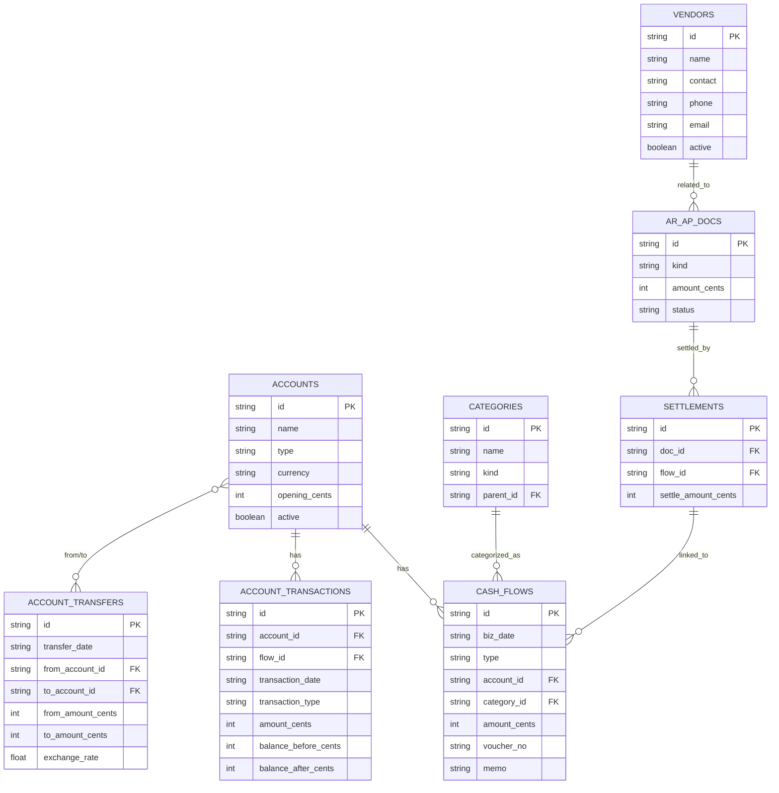

# 财务核心数据模型

<cite>
**本文档引用文件**   
- [schema.ts](file://backend/src/db/schema.ts)
- [schema.sql](file://backend/src/db/schema.sql)
- [accounts.ts](file://backend/src/routes/master-data/accounts.ts)
- [categories.ts](file://backend/src/routes/master-data/categories.ts)
- [vendors.ts](file://backend/src/routes/master-data/vendors.ts)
- [account-transfers.ts](file://backend/src/routes/account-transfers.ts)
- [ar-ap.ts](file://backend/src/routes/ar-ap.ts)
- [MasterDataService.ts](file://backend/src/services/MasterDataService.ts)
- [FinanceService.ts](file://backend/src/services/FinanceService.ts)
- [business.schema.ts](file://backend/src/schemas/business.schema.ts)
- [migration_add_return_type.sql](file://backend/src/db/migration_add_return_type.sql)
- [migration_add_created_by_to_repayments.sql](file://backend/src/db/migration_add_created_by_to_repayments.sql)
</cite>

## 目录
1. [账户模型](#账户模型)
2. [现金流模型](#现金流模型)
3. [账户转账模型](#账户转账模型)
4. [分类模型](#分类模型)
5. [供应商模型](#供应商模型)
6. [数据演进](#数据演进)

## 账户模型

账户表（accounts）是财务系统的核心实体，用于记录所有资金账户信息。每个账户都有唯一的ID、名称、类型、币种等属性。账户类型用于区分不同性质的账户，如现金、银行、虚拟货币等。账户的余额变化通过账户交易表（account_transactions）进行记录，该表记录了每次交易前后的余额，确保了余额计算的准确性和可追溯性。

账户交易表（account_transactions）与现金流表（cash_flows）通过flow_id关联，形成完整的交易链路。当创建一笔现金流时，系统会自动更新对应账户的余额，并在账户交易表中记录交易详情。这种设计实现了业务流水与账户余额的分离，既保证了数据一致性，又提高了查询性能。

**Section sources**
- [schema.ts](file://backend/src/db/schema.ts#L146-L155)
- [schema.sql](file://backend/src/db/schema.sql#L158-L168)
- [accounts.ts](file://backend/src/routes/master-data/accounts.ts#L1-L253)
- [MasterDataService.ts](file://backend/src/services/MasterDataService.ts#L220-L243)

## 现金流模型

现金流表（cash_flows）是财务系统中最核心的交易记录表，用于记录所有的收入和支出流水。该表的关键字段包括biz_date（业务日期）、type（类型）、amount_cents（金额，单位为分）等。biz_date字段记录了业务发生的实际日期，而非系统记录时间，这对于财务核算至关重要。type字段限定为'income'（收入）或'expense'（支出），确保了数据的规范性。

账户交易表（account_transactions）详细记录了账户余额的变化过程。每当发生一笔现金流时，系统会自动计算交易后的余额，并在该表中创建一条记录。balance_before_cents和balance_after_cents字段分别记录了交易前后的余额，这种设计避免了余额计算错误，并提供了完整的审计追踪能力。交易类型（transaction_type）通常与现金流类型一致，但也可用于记录特殊类型的账户调整。

**Section sources**
- [schema.ts](file://backend/src/db/schema.ts#L165-L181)
- [schema.sql](file://backend/src/db/schema.sql#L170-L187)
- [schema.ts](file://backend/src/db/schema.ts#L183-L193)
- [schema.sql](file://backend/src/db/schema.sql#L189-L200)
- [FinanceService.ts](file://backend/src/services/FinanceService.ts#L408-L422)

## 账户转账模型

账户转账表（account_transfers）专门用于记录不同账户之间的资金转移。与普通现金流不同，转账涉及两个账户的余额同时变化。该表记录了转出账户（from_account_id）、转入账户（to_account_id）、转出金额（from_amount_cents）、转入金额（to_amount_cents）以及汇率（exchange_rate）。当涉及不同币种的转账时，系统会根据汇率计算相应的金额。

账户转账功能通过专门的API路由实现，支持跨币种转账。系统会验证转出账户和转入账户不能相同，确保了数据的合理性。转账记录不仅更新了相关账户的余额，还生成了相应的现金流记录，保持了财务数据的一致性。这种设计使得账户间资金流动清晰可查，便于财务对账和审计。

**Diagram sources **
- [schema.ts](file://backend/src/db/schema.ts#L146-L155)
- [schema.ts](file://backend/src/db/schema.ts#L165-L181)
- [schema.ts](file://backend/src/db/schema.ts#L183-L193)
- [schema.ts](file://backend/src/db/schema.ts#L406-L434)
- [schema.ts](file://backend/src/db/schema.ts#L303-L310)
- [schema.ts](file://backend/src/db/schema.ts#L89-L99)
- [schema.ts](file://backend/src/db/schema.ts#L312-L326)
- [schema.ts](file://backend/src/db/schema.ts#L397-L404)

**Section sources**
- [schema.ts](file://backend/src/db/schema.ts#L406-L434)
- [schema.sql](file://backend/src/db/schema.sql#L408-L423)
- [account-transfers.ts](file://backend/src/routes/account-transfers.ts#L1-L209)

## 分类模型

分类表（categories）采用树形结构设计，支持多级分类。每个分类都有名称（name）、类型（kind）和父级ID（parent_id）等属性。kind字段限定为'income'（收入）或'expense'（支出），将分类体系分为收入和支出两大类。通过parent_id字段，可以构建无限层级的分类树，满足复杂财务核算的需求。

树形分类结构在财务记账中具有重要作用。它允许企业建立层次化的科目体系，如"办公费用"下包含"文具耗材"、"打印复印"等子分类。这种结构不仅便于费用归集和统计分析，还能生成多维度的财务报表。系统通过递归查询或预计算路径的方式，高效处理树形结构的查询需求，确保了用户体验。

**Section sources**
- [schema.ts](file://backend/src/db/schema.ts#L303-L310)
- [schema.sql](file://backend/src/db/schema.sql#L326-L334)
- [categories.ts](file://backend/src/routes/master-data/categories.ts#L1-L155)
- [MasterDataService.ts](file://backend/src/services/MasterDataService.ts#L417-L464)

## 供应商模型

供应商表（vendors）用于管理所有业务往来方信息，包括名称、联系人、联系方式等。该表与应收应付表（ar_ap_docs）通过party_id字段关联，形成了完整的业务链条。当创建应收（AR）或应付（AP）单据时，可以选择关联的供应商，便于后续的账款管理和对账。

应收应付表（ar_ap_docs）记录了与供应商之间的债权债务关系。该表包含单据类型（kind）、金额、状态等关键信息。通过结算表（settlements）与现金流表（cash_flows）的关联，系统能够追踪每笔应收应付的核销情况。这种设计实现了从业务单据到资金流动的完整闭环，为财务核算提供了坚实的数据基础。

**Section sources**
- [schema.ts](file://backend/src/db/schema.ts#L89-L99)
- [schema.sql](file://backend/src/db/schema.sql#L394-L406)
- [schema.ts](file://backend/src/db/schema.ts#L312-L326)
- [schema.sql](file://backend/src/db/schema.sql#L336-L351)
- [schema.ts](file://backend/src/db/schema.ts#L397-L404)
- [schema.sql](file://backend/src/db/schema.sql#L384-L392)
- [vendors.ts](file://backend/src/routes/master-data/vendors.ts#L1-L237)
- [ar-ap.ts](file://backend/src/routes/ar-ap.ts#L1-L353)
- [FinanceService.ts](file://backend/src/services/FinanceService.ts#L314-L345)

## 数据演进

系统的数据模型通过迁移脚本（migration）进行演进。例如，`migration_add_created_by_to_repayments.sql`脚本为repayments表添加了created_by字段，用于记录还款记录的创建人，增强了审计追踪能力。另一个迁移脚本`migration_add_return_type.sql`为fixed_asset_allocations表添加了return_type字段，用于记录固定资产归还的类型，完善了资产管理功能。

这些迁移脚本体现了系统数据模型的迭代过程。通过增量式修改，系统能够在不影响现有数据的前提下，逐步完善数据结构。每个迁移脚本都是一个独立的变更单元，便于版本控制和回滚。这种演进方式确保了数据模型的灵活性和可维护性，适应了业务需求的不断变化。

**Section sources**
- [migration_add_return_type.sql](file://backend/src/db/migration_add_return_type.sql#L1-L2)
- [migration_add_created_by_to_repayments.sql](file://backend/src/db/migration_add_created_by_to_repayments.sql#L1-L2)