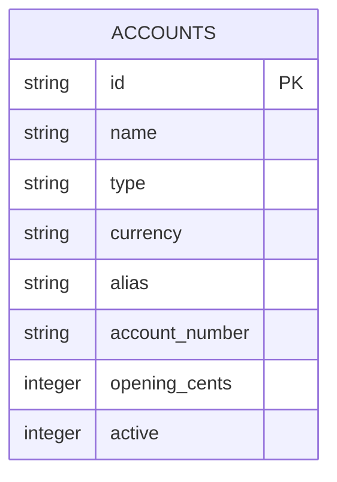
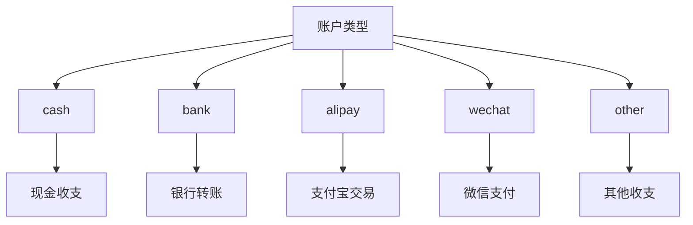
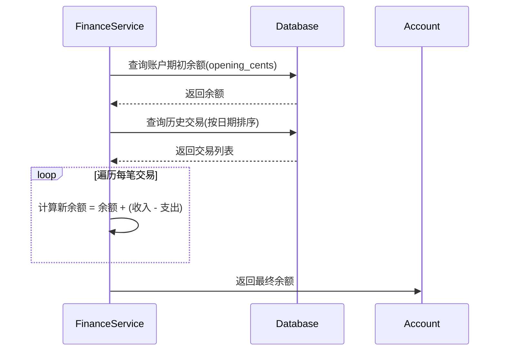
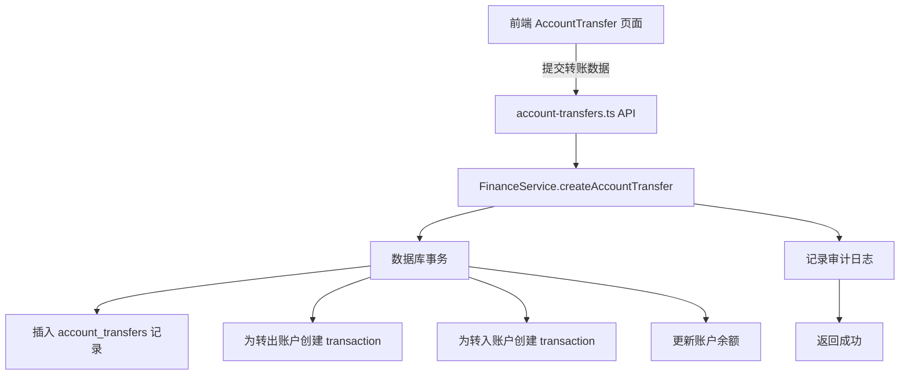

# 账户管理模型

<cite>
**本文档引用的文件**   
- [accounts.ts](file://backend/src/routes/master-data/accounts.ts)
- [schema.ts](file://backend/src/db/schema.ts)
- [master-data.schema.ts](file://backend/src/schemas/master-data.schema.ts)
- [account-transfers.ts](file://backend/src/routes/account-transfers.ts)
- [FinanceService.ts](file://backend/src/services/FinanceService.ts)
- [ReportService.ts](file://backend/src/services/ReportService.ts)
- [AccountTransfer.tsx](file://frontend/src/features/finance/pages/AccountTransfer.tsx)
- [AccountManagement.tsx](file://frontend/src/features/system/pages/AccountManagement.tsx)
- [schema.sql](file://backend/src/db/schema.sql)
</cite>

## 目录
1. [账户表结构详解](#账户表结构详解)
2. [账户类型枚举与扩展性](#账户类型枚举与扩展性)
3. [账户余额计算逻辑](#账户余额计算逻辑)
4. [账户间转账功能](#账户间转账功能)
5. [账户状态与软删除](#账户状态与软删除)
6. [数据查询与性能优化](#数据查询与性能优化)

## 账户表结构详解

账户管理模型的核心是 `accounts` 表，它存储了所有财务账户的基础信息。该表的每个字段都具有明确的业务含义，确保了数据的完整性和可追溯性。

**核心字段定义：**

- **id**: 账户的唯一标识符，使用UUID作为主键，确保全局唯一性。
- **name**: 账户的名称，是必填字段，用于在系统中标识和显示账户。
- **type**: 账户类型，是一个枚举字段，定义了账户的物理或逻辑类别，如现金、银行、支付宝等。
- **currency**: 账户的币种，使用3位ISO货币代码（如CNY、USD），决定了账户内所有交易的记账单位。
- **alias**: 账户别名，一个可选字段，支持模糊搜索，方便用户通过别名快速查找账户。
- **account_number**: 账户号，用于记录银行账号、卡号等外部系统识别码。
- **opening_cents**: 期初余额，以“分”为单位存储，避免了浮点数计算的精度问题。该字段代表了账户创建时的初始资金。
- **active**: 状态标志位，用于实现软删除功能。值为1表示账户处于启用状态，0表示已停用。

**Diagram sources**
- [schema.ts](file://backend/src/db/schema.ts#L146-L155)
- [schema.sql](file://backend/src/db/schema.sql#L158-L168)

**Section sources**
- [schema.ts](file://backend/src/db/schema.ts#L146-L155)
- [schema.sql](file://backend/src/db/schema.sql#L158-L168)

## 账户类型枚举与扩展性

账户类型（`type`）字段是账户管理模型中的关键分类依据，它直接影响了账户的使用场景和前端展示方式。

**枚举值及其应用场景：**

- **cash**: 代表现金账户，用于记录实体现金的收支情况。
- **bank**: 代表银行账户，用于关联具体的银行或金融机构。
- **alipay**: 代表支付宝账户，专门用于处理通过支付宝平台的交易。
- **wechat**: 代表微信支付账户，专门用于处理通过微信支付平台的交易。
- **other**: 代表其他类型的账户，用于处理无法归类到上述类型的特殊账户。

这种枚举设计具有良好的扩展性。当业务需要支持新的支付方式（例如，未来可能增加“unionpay”或“paypal”）时，只需在代码和数据库的枚举列表中添加新的值即可，而无需修改表结构。前端界面可以根据不同的类型显示相应的图标或进行特定的逻辑处理。

**Diagram sources**
- [master-data.schema.ts](file://backend/src/schemas/master-data.schema.ts#L57-L58)
- [openapi.json](file://backend/openapi.json#L1050-L1058)

## 账户余额计算逻辑

账户的实时余额并非直接存储在 `accounts` 表中，而是通过 `account_transactions` 表动态计算得出。这种设计保证了余额的准确性和可追溯性，每一次余额变化都有据可查。

**核心表与字段：**

- **account_transactions**: 此表记录了账户上发生的每一次资金变动。
  - `accountId`: 关联的账户ID。
  - `flowId`: 关联的现金流ID（`cash_flows` 表），建立交易与账户变动的联系。
  - `transactionDate`: 交易发生的业务日期。
  - `transactionType`: 交易类型，如 `income`（收入）、`expense`（支出）、`transfer_out`（转出）、`transfer_in`（转入）。
  - `amountCents`: 本次变动的金额（以分为单位）。
  - `balanceBeforeCents`: 交易发生前的账户余额。
  - `balanceAfterCents`: 交易发生后的账户余额。

**余额计算流程：**

1.  **获取期初余额**：首先，系统会查询 `accounts` 表中的 `opening_cents` 字段，作为计算的起点。
2.  **查找历史交易**：系统会查询 `account_transactions` 表，获取所有 `transactionDate` 小于目标日期的交易记录，并按日期和创建时间排序。
3.  **累加变动**：将所有历史交易的净变动（收入为正，支出为负）加到期初余额上，得到目标日期开始前的余额。
4.  **计算实时余额**：对于目标日期当天的交易，系统会根据 `balanceBeforeCents` 和 `amountCents` 字段，按顺序计算出最新的 `balanceAfterCents`。

**Diagram sources**
- [FinanceService.ts](file://backend/src/services/FinanceService.ts#L41-L69)
- [ReportService.ts](file://backend/src/services/ReportService.ts#L339-L413)

## 账户间转账功能

账户间转账是财务管理的核心功能之一，它通过 `account_transfers` 表来记录，并在 `account_transactions` 表中生成两条对应的交易记录。

**数据流分析（从前端 `AccountTransfer` 页面开始）：**

1.  **用户操作**：用户在 `AccountTransfer.tsx` 页面选择转出账户、转入账户、输入金额和汇率。
2.  **前端计算**：前端根据汇率自动计算转入金额，并将所有信息（包括凭证URL）通过API提交。
3.  **后端处理**：`account-transfers.ts` 路由接收到请求后，调用 `FinanceService.createAccountTransfer` 方法。
4.  **事务处理**：`FinanceService` 在一个数据库事务中执行以下操作：
    - 在 `account_transfers` 表中创建一条转账记录。
    - 为转出账户创建一条 `transfer_out` 类型的交易记录，余额减少。
    - 为转入账户创建一条 `transfer_in` 类型的交易记录，余额增加。
5.  **审计日志**：操作完成后，系统会记录一条审计日志。

**Diagram sources**
- [AccountTransfer.tsx](file://frontend/src/features/finance/pages/AccountTransfer.tsx#L41-L71)
- [account-transfers.ts](file://backend/src/routes/account-transfers.ts#L112-L161)
- [FinanceService.ts](file://backend/src/services/FinanceService.ts#L181-L243)

## 账户状态与软删除

账户的 `active` 字段是实现软删除机制的核心。与直接从数据库中物理删除记录不同，软删除通过将 `active` 字段的值从 `1` 改为 `0` 来标记账户为“已停用”。

**软删除的优势：**

- **数据完整性**：已停用的账户记录仍然保留在数据库中，不会破坏历史交易数据的完整性。例如，过去与该账户相关的所有 `cash_flows` 和 `account_transactions` 记录依然可以正常关联和查询。
- **可恢复性**：如果误操作停用了账户，管理员可以随时通过将 `active` 字段改回 `1` 来恢复账户，而无需复杂的恢复流程。
- **审计追踪**：结合审计日志，可以清晰地追踪到账户状态变更的时间、操作人和原因。

在前端 `AccountManagement.tsx` 页面中，编辑账户的表单包含一个“启用”开关（`Switch`），其值绑定到 `active` 字段，允许管理员直观地管理账户的启用状态。

**Section sources**
- [schema.ts](file://backend/src/db/schema.ts#L154)
- [AccountManagement.tsx](file://frontend/src/features/system/pages/AccountManagement.tsx#L257-L259)

## 数据查询与性能优化

为了高效地查询账户数据，系统在数据库层面和应用层面都进行了优化。

**最佳实践：**

1.  **使用索引**：数据库为 `accounts` 表的 `active` 字段创建了索引，这使得在查询“仅显示启用账户”时能够快速定位数据。
2.  **分页查询**：在获取账户列表时，后端API支持分页参数，避免一次性加载过多数据，提升响应速度。
3.  **后端过滤**：API支持通过 `accountType` 和 `currency` 等参数进行后端过滤，减少传输到前端的数据量。
4.  **批量查询**：在 `FinanceService` 中，当需要获取多个账户的详细信息时（如转账记录），会先批量查询所有相关账户，然后在内存中建立映射关系，避免了N+1次数据库查询。

**性能优化建议：**

- **避免全表扫描**：在查询时，应尽可能使用 `WHERE` 条件，特别是基于索引字段（如 `active`）的条件。
- **合理使用JOIN**：虽然 `account_transactions` 表需要与 `cash_flows` 表连接以获取更多上下文信息，但应避免不必要的复杂JOIN，尤其是在大数据量的情况下。
- **缓存策略**：对于不经常变动的账户基础信息（如名称、类型），可以考虑在应用层进行缓存，以减少数据库访问压力。

**Section sources**
- [schema.sql](file://backend/src/db/schema.sql#L311)
- [accounts.ts](file://backend/src/routes/master-data/accounts.ts#L37-L51)
- [FinanceService.ts](file://backend/src/services/FinanceService.ts#L169-L172)