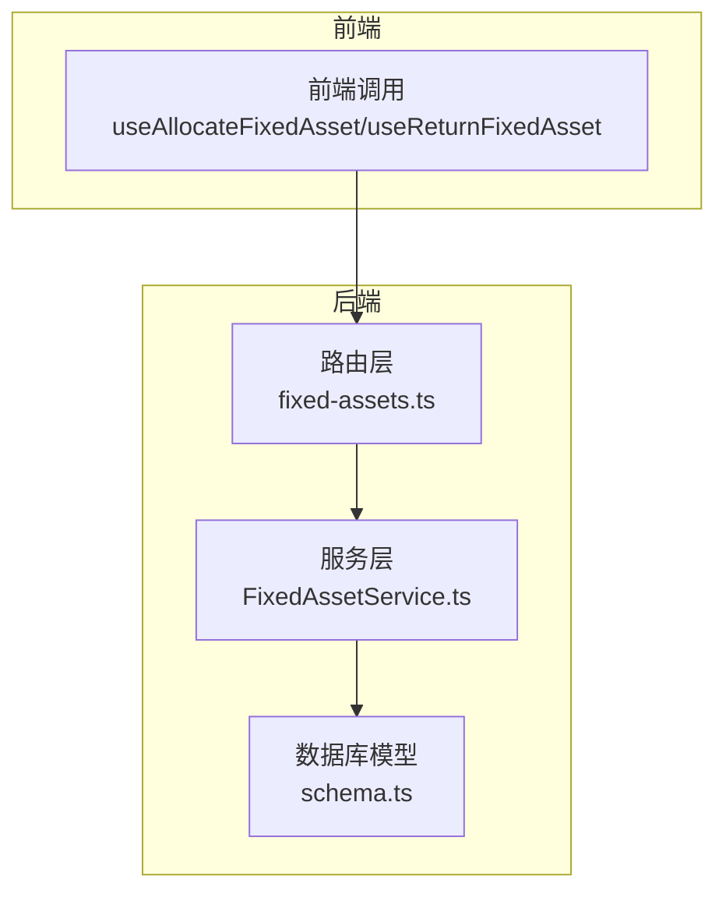
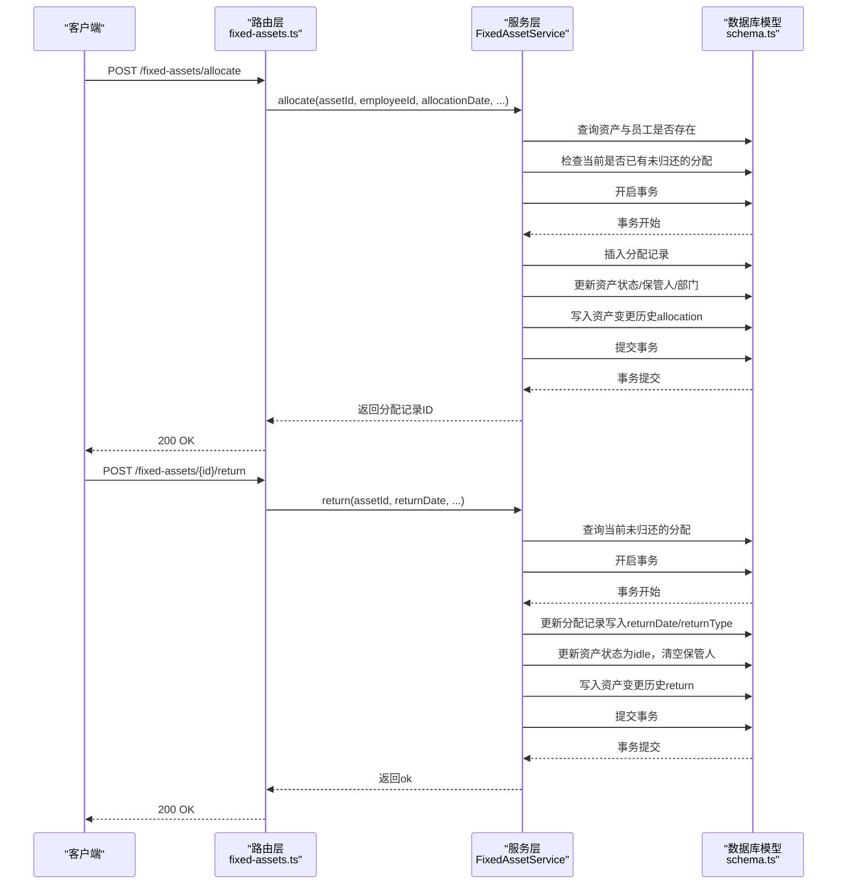
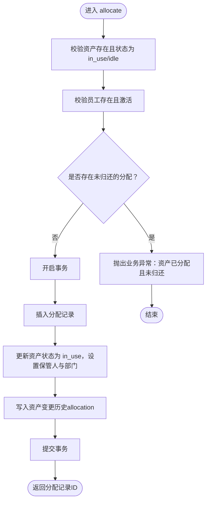
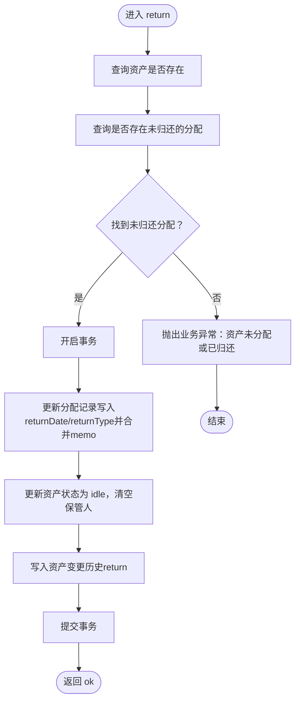
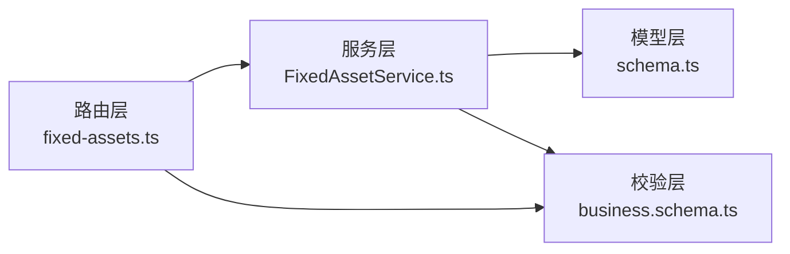

# 分配管理数据模型

<cite>
**本文引用的文件**
- [FixedAssetService.ts](file://backend/src/services/FixedAssetService.ts)
- [schema.ts](file://backend/src/db/schema.ts)
- [fixed-assets.ts](file://backend/src/routes/fixed-assets.ts)
- [business.schema.ts](file://backend/src/schemas/business.schema.ts)
- [migration_add_return_type.sql](file://backend/src/db/migration_add_return_type.sql)
- [fixed-assets.test.ts](file://backend/test/routes/fixed-assets.test.ts)
</cite>

## 目录
1. [简介](#简介)
2. [项目结构](#项目结构)
3. [核心组件](#核心组件)
4. [架构总览](#架构总览)
5. [详细组件分析](#详细组件分析)
6. [依赖关系分析](#依赖关系分析)
7. [性能考量](#性能考量)
8. [故障排查指南](#故障排查指南)
9. [结论](#结论)

## 简介
本技术文档聚焦于固定资产分配管理的数据模型与业务流程，围绕 fixed_asset_allocations 表的字段定义与约束，系统化阐述资产分配（allocate）与归还（return）的完整业务闭环，并解释如何通过数据库事务确保资产状态与分配记录的一致性。同时，文档说明分配记录与资产变更历史（fixed_asset_changes）之间的联动机制，以及 FixedAssetService 中的分配冲突检查与数据完整性保障措施。

## 项目结构
固定资产分配相关的核心代码分布在以下模块：
- 数据库模型定义：backend/src/db/schema.ts
- 服务层实现：backend/src/services/FixedAssetService.ts
- 路由与接口：backend/src/routes/fixed-assets.ts
- 请求/响应校验：backend/src/schemas/business.schema.ts
- 迁移脚本：backend/src/db/migration_add_return_type.sql
- 测试用例：backend/test/routes/fixed-assets.test.ts

图表来源
- [fixed-assets.ts](file://backend/src/routes/fixed-assets.ts#L636-L729)
- [FixedAssetService.ts](file://backend/src/services/FixedAssetService.ts#L644-L777)
- [schema.ts](file://backend/src/db/schema.ts#L502-L532)

章节来源
- [fixed-assets.ts](file://backend/src/routes/fixed-assets.ts#L636-L729)
- [FixedAssetService.ts](file://backend/src/services/FixedAssetService.ts#L644-L777)
- [schema.ts](file://backend/src/db/schema.ts#L502-L532)

## 核心组件
- fixed_asset_allocations 表：用于记录资产与员工之间的分配关系，包含分配日期、归还日期、分配类型、归还类型等关键字段。
- fixed_asset_changes 表：用于记录资产状态、保管人、部门/站点等维度的变更历史，分配与归还都会产生相应的变更记录。
- FixedAssetService.allocate / FixedAssetService.return：提供分配与归还的业务逻辑，包含冲突检测、状态更新与变更日志写入。
- 路由层接口：对外暴露分配与归还的 REST 接口，负责参数校验与审计日志记录。

章节来源
- [schema.ts](file://backend/src/db/schema.ts#L502-L532)
- [FixedAssetService.ts](file://backend/src/services/FixedAssetService.ts#L644-L777)
- [fixed-assets.ts](file://backend/src/routes/fixed-assets.ts#L636-L729)

## 架构总览
下图展示了从接口到服务再到数据库的调用链路，以及事务如何保证一致性。

图表来源
- [fixed-assets.ts](file://backend/src/routes/fixed-assets.ts#L636-L729)
- [FixedAssetService.ts](file://backend/src/services/FixedAssetService.ts#L644-L777)
- [schema.ts](file://backend/src/db/schema.ts#L502-L532)

## 详细组件分析

### 数据模型：fixed_asset_allocations 字段定义
- id：主键
- assetId：外键，关联 fixed_assets.id
- employeeId：外键，关联 employees.id
- allocationDate：分配日期（非空）
- allocationType：分配类型，默认值为 employee_onboarding；支持枚举值：employee_onboarding、transfer、temporary
- returnDate：归还日期（允许为空，表示尚未归还）
- returnType：归还类型（新增列，允许为空，迁移脚本添加）
- memo：备注
- createdBy：创建者
- createdAt / updatedAt：时间戳

字段约束与默认值均在 schema.ts 中定义，分配类型与归还类型在业务层通过枚举进行约束。

章节来源
- [schema.ts](file://backend/src/db/schema.ts#L520-L532)
- [business.schema.ts](file://backend/src/schemas/business.schema.ts#L288-L307)
- [migration_add_return_type.sql](file://backend/src/db/migration_add_return_type.sql#L1-L1)

### 分配流程（allocate）
- 输入参数：assetId、employeeId、allocationDate、allocationType、expectedReturnDate、memo、createdBy
- 业务规则：
  - 资产状态必须为 in_use 或 idle 才能分配
  - 员工必须存在且处于激活状态
  - 若同一资产存在未归还的分配记录，则禁止再次分配
- 事务内执行：
  - 插入一条 fixed_asset_allocations 记录
  - 更新对应 fixed_assets 的状态为 in_use，保管人为员工姓名，部门取员工所在部门（若员工部门为空则保留资产原部门）
  - 写入一条 fixed_asset_changes，changeType 为 allocation，记录 from/to 状态与保管人

图表来源
- [FixedAssetService.ts](file://backend/src/services/FixedAssetService.ts#L644-L717)
- [schema.ts](file://backend/src/db/schema.ts#L502-L532)

章节来源
- [FixedAssetService.ts](file://backend/src/services/FixedAssetService.ts#L644-L717)
- [business.schema.ts](file://backend/src/schemas/business.schema.ts#L288-L307)

### 归还流程（return）
- 输入参数：assetId、returnDate、returnType、memo、createdBy
- 业务规则：
  - 必须存在一条未归还的分配记录（returnDate 为空）
- 事务内执行：
  - 更新该分配记录的 returnDate 与 returnType，并合并 memo
  - 将资产状态更新为 idle，保管人清空
  - 写入一条 fixed_asset_changes，changeType 为 return，记录 from/to 状态与保管人

图表来源
- [FixedAssetService.ts](file://backend/src/services/FixedAssetService.ts#L719-L777)
- [schema.ts](file://backend/src/db/schema.ts#L502-L532)

章节来源
- [FixedAssetService.ts](file://backend/src/services/FixedAssetService.ts#L719-L777)
- [business.schema.ts](file://backend/src/schemas/business.schema.ts#L736-L742)

### 分配记录与资产变更历史联动
- 分配时：写入 fixed_asset_changes，changeType 为 allocation，记录 from/to 状态与保管人，便于追踪资产的保管人与状态变化。
- 归还时：写入 fixed_asset_changes，changeType 为 return，记录 from/to 状态与保管人，便于追溯资产的生命周期。

章节来源
- [FixedAssetService.ts](file://backend/src/services/FixedAssetService.ts#L691-L714)
- [FixedAssetService.ts](file://backend/src/services/FixedAssetService.ts#L741-L774)
- [schema.ts](file://backend/src/db/schema.ts#L502-L518)

### 分配冲突检查与数据完整性保障
- 冲突检查：在分配前查询当前资产是否存在未归还的分配记录，若存在则拒绝重复分配。
- 数据完整性：所有分配与归还操作均在单个数据库事务中完成，确保分配记录与资产状态、变更历史三者一致。
- 参数校验：路由层对请求体进行严格校验，服务层进一步补充业务规则（如资产状态、员工状态、分配类型枚举等）。

章节来源
- [FixedAssetService.ts](file://backend/src/services/FixedAssetService.ts#L663-L717)
- [FixedAssetService.ts](file://backend/src/services/FixedAssetService.ts#L728-L777)
- [fixed-assets.ts](file://backend/src/routes/fixed-assets.ts#L636-L729)
- [business.schema.ts](file://backend/src/schemas/business.schema.ts#L288-L307)
- [business.schema.ts](file://backend/src/schemas/business.schema.ts#L736-L742)

### 接口与路由映射
- 分配接口：POST /fixed-assets/allocate
- 归还接口：POST /fixed-assets/{id}/return
- 路由层负责参数校验、权限控制与审计日志记录，服务层负责业务逻辑与数据库事务。

章节来源
- [fixed-assets.ts](file://backend/src/routes/fixed-assets.ts#L636-L729)
- [business.schema.ts](file://backend/src/schemas/business.schema.ts#L288-L307)
- [business.schema.ts](file://backend/src/schemas/business.schema.ts#L736-L742)

## 依赖关系分析
- 路由层依赖服务层：将请求参数转换为服务层方法调用，并处理审计日志。
- 服务层依赖数据库模型：通过 Drizzle ORM 对 fixed_asset_allocations、fixed_assets、fixed_asset_changes 等表进行读写。
- 业务层依赖校验层：请求体参数在路由层与业务层双重校验，确保输入合法。

图表来源
- [fixed-assets.ts](file://backend/src/routes/fixed-assets.ts#L636-L729)
- [FixedAssetService.ts](file://backend/src/services/FixedAssetService.ts#L644-L777)
- [schema.ts](file://backend/src/db/schema.ts#L502-L532)
- [business.schema.ts](file://backend/src/schemas/business.schema.ts#L288-L307)

章节来源
- [fixed-assets.ts](file://backend/src/routes/fixed-assets.ts#L636-L729)
- [FixedAssetService.ts](file://backend/src/services/FixedAssetService.ts#L644-L777)
- [schema.ts](file://backend/src/db/schema.ts#L502-L532)
- [business.schema.ts](file://backend/src/schemas/business.schema.ts#L288-L307)

## 性能考量
- 单事务批量写入：分配与归还均在一个事务内完成，减少锁竞争与回滚成本。
- 查询优化：分配前的“未归还分配”查询仅按资产与 returnDate 为空条件过滤，索引友好。
- 批量查询：列表接口在服务层对多表进行并行查询，减少往返次数，提升整体响应速度。

章节来源
- [FixedAssetService.ts](file://backend/src/services/FixedAssetService.ts#L644-L777)
- [fixed-assets.ts](file://backend/src/routes/fixed-assets.ts#L124-L175)

## 故障排查指南
- 分配失败：提示“资产已分配且未归还”
  - 排查：确认资产当前是否存在未归还的分配记录；若存在，请先完成归还再重新分配。
  - 参考路径：[FixedAssetService.ts](file://backend/src/services/FixedAssetService.ts#L663-L671)
- 归还失败：提示“资产未分配或已归还”
  - 排查：确认资产是否存在未归还的分配记录；若不存在或已归还，请检查传入的资产ID是否正确。
  - 参考路径：[FixedAssetService.ts](file://backend/src/services/FixedAssetService.ts#L734-L736)
- 参数错误：路由层校验失败
  - 排查：核对请求体字段类型与枚举值；参考业务校验定义。
  - 参考路径：[business.schema.ts](file://backend/src/schemas/business.schema.ts#L288-L307), [business.schema.ts](file://backend/src/schemas/business.schema.ts#L736-L742)
- 接口调用：前端调用
  - 参考路径：[fixed-assets.test.ts](file://backend/test/routes/fixed-assets.test.ts#L290-L321)

章节来源
- [FixedAssetService.ts](file://backend/src/services/FixedAssetService.ts#L663-L671)
- [FixedAssetService.ts](file://backend/src/services/FixedAssetService.ts#L734-L736)
- [business.schema.ts](file://backend/src/schemas/business.schema.ts#L288-L307)
- [business.schema.ts](file://backend/src/schemas/business.schema.ts#L736-L742)
- [fixed-assets.test.ts](file://backend/test/routes/fixed-assets.test.ts#L290-L321)

## 结论
固定资产分配管理通过 fixed_asset_allocations 与 fixed_asset_changes 两张表实现了清晰的分配轨迹与资产状态变更记录。服务层在分配与归还两个关键流程中，采用严格的参数校验、冲突检测与数据库事务，确保了数据一致性与业务完整性。配合路由层的审计日志与前端调用，形成了从接口到数据库的完整闭环。