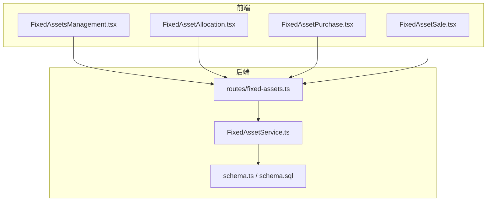
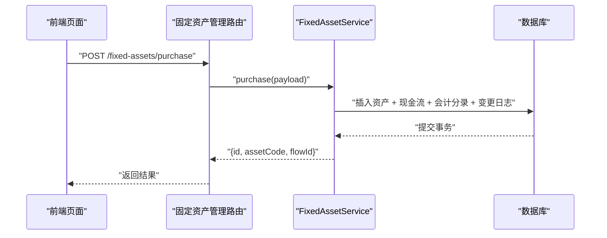
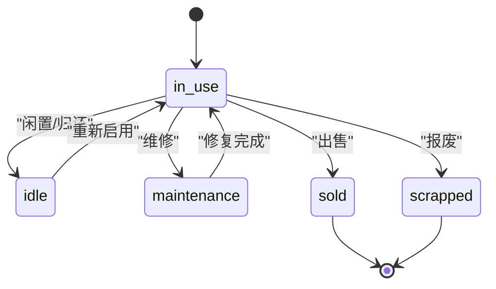
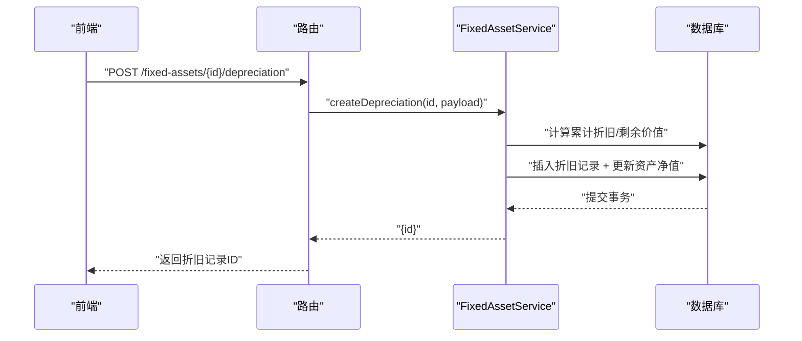
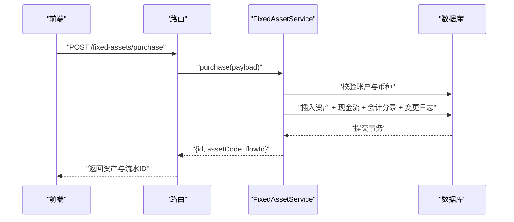
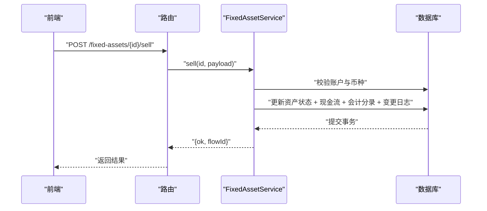
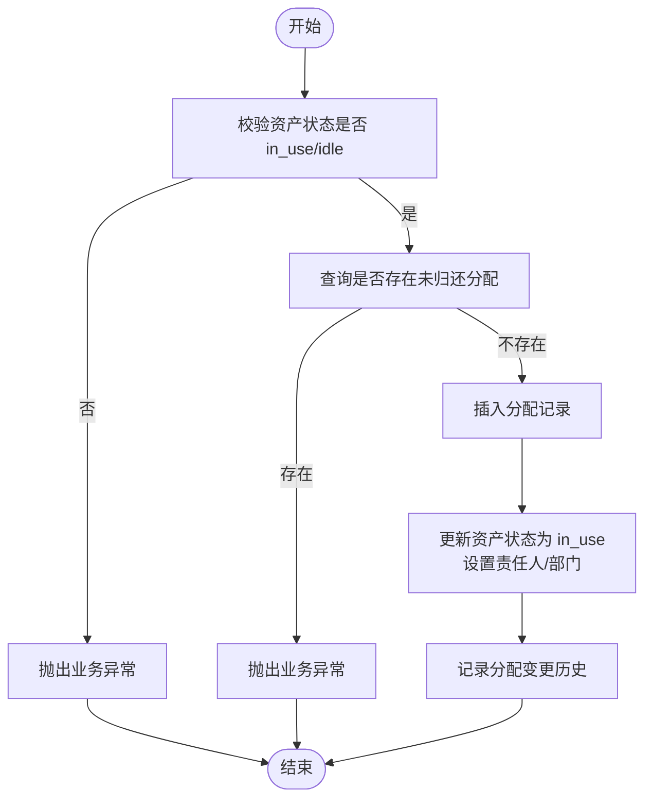
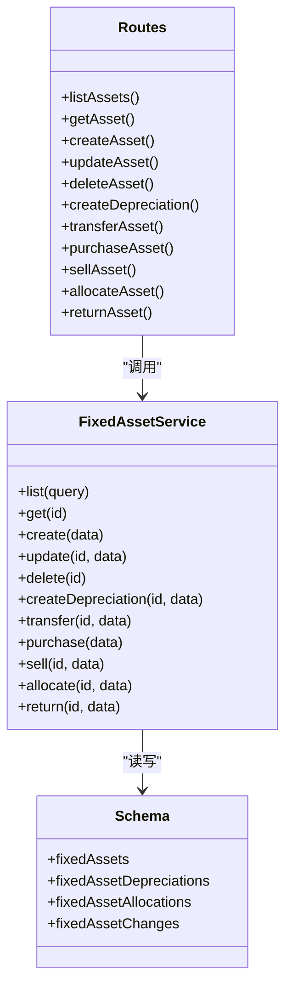

# 固定资产数据模型

<cite>
**本文引用的文件**
- [backend/src/db/schema.ts](file://backend/src/db/schema.ts)
- [backend/src/db/schema.sql](file://backend/src/db/schema.sql)
- [backend/src/services/FixedAssetService.ts](file://backend/src/services/FixedAssetService.ts)
- [backend/src/routes/fixed-assets.ts](file://backend/src/routes/fixed-assets.ts)
- [backend/src/schemas/business.schema.ts](file://backend/src/schemas/business.schema.ts)
- [backend/test/routes/fixed-assets.test.ts](file://backend/test/routes/fixed-assets.test.ts)
- [frontend/src/features/assets/pages/FixedAssetsManagement.tsx](file://frontend/src/features/assets/pages/FixedAssetsManagement.tsx)
- [frontend/src/features/assets/pages/FixedAssetAllocation.tsx](file://frontend/src/features/assets/pages/FixedAssetAllocation.tsx)
- [frontend/src/features/assets/pages/FixedAssetPurchase.tsx](file://frontend/src/features/assets/pages/FixedAssetPurchase.tsx)
- [frontend/src/features/assets/pages/FixedAssetSale.tsx](file://frontend/src/features/assets/pages/FixedAssetSale.tsx)
- [frontend/src/validations/fixedAsset.schema.ts](file://frontend/src/validations/fixedAsset.schema.ts)
</cite>

## 目录
1. [引言](#引言)
2. [项目结构](#项目结构)
3. [核心组件](#核心组件)
4. [架构总览](#架构总览)
5. [详细组件分析](#详细组件分析)
6. [依赖关系分析](#依赖关系分析)
7. [性能考量](#性能考量)
8. [故障排查指南](#故障排查指南)
9. [结论](#结论)
10. [附录](#附录)

## 引言
本技术文档聚焦于固定资产模块的数据模型与生命周期管理，系统性梳理 fixed_assets（固定资产）、fixed_asset_depreciations（折旧）、fixed_asset_allocations（分配）、fixed_asset_changes（变更历史）等核心表的结构、业务规则与一致性保障机制。文档同时覆盖从采购、折旧、分配到报废/出售的完整状态流转，并解释 fixed_asset_changes 如何记录资产的每次变更历史，帮助开发者在创建、更新、删除等关键操作中遵循统一的业务约束与数据完整性策略。

## 项目结构
固定资产模块由三层组成：
- 数据层：基于 Drizzle ORM 的 SQLite 模式定义与迁移脚本，确保数据库结构与应用一致。
- 服务层：FixedAssetService 提供资产全生命周期的业务编排，包含事务控制、校验与审计日志联动。
- 接口层：Hono 路由暴露 REST API，配合 OpenAPI Schema 定义请求/响应契约，并通过权限中间件保护敏感操作。

图表来源
- [backend/src/routes/fixed-assets.ts](file://backend/src/routes/fixed-assets.ts#L1-L730)
- [backend/src/services/FixedAssetService.ts](file://backend/src/services/FixedAssetService.ts#L1-L779)
- [backend/src/db/schema.ts](file://backend/src/db/schema.ts#L464-L532)
- [backend/src/db/schema.sql](file://backend/src/db/schema.sql#L455-L527)

章节来源
- [backend/src/routes/fixed-assets.ts](file://backend/src/routes/fixed-assets.ts#L1-L730)
- [backend/src/services/FixedAssetService.ts](file://backend/src/services/FixedAssetService.ts#L1-L779)
- [backend/src/db/schema.ts](file://backend/src/db/schema.ts#L464-L532)
- [backend/src/db/schema.sql](file://backend/src/db/schema.sql#L455-L527)

## 核心组件
- 固定资产表（fixed_assets）
  - 关键字段：资产编号（唯一）、名称、类别、购买日期/价格、币种、供应商、部门/站点、责任人、状态、折旧方法、使用年限、当前净值、销售相关字段、审计字段。
  - 状态枚举：in_use、idle、maintenance、scrapped、sold。
- 折旧表（fixed_asset_depreciations）
  - 记录每次折旧，包含折旧日期、金额、累计折旧、剩余价值、备注与审计字段。
- 分配表（fixed_asset_allocations）
  - 记录资产与员工的分配关系，含分配/归还日期、类型、备注与审计字段。
- 变更历史表（fixed_asset_changes）
  - 记录资产关键维度的变更，如部门/站点/责任人/状态等，支持审计追溯。

章节来源
- [backend/src/db/schema.ts](file://backend/src/db/schema.ts#L464-L532)
- [backend/src/db/schema.sql](file://backend/src/db/schema.sql#L455-L527)

## 架构总览
固定资产模块采用“路由 -> 服务 -> 数据库”的分层设计，服务层负责：
- 业务规则校验（如折旧金额上限、分配状态互斥、出售状态限制等）
- 事务边界（购买/出售、折旧、分配/归还等）
- 审计联动（调用审计工具记录关键动作）

图表来源
- [backend/src/routes/fixed-assets.ts](file://backend/src/routes/fixed-assets.ts#L511-L576)
- [backend/src/services/FixedAssetService.ts](file://backend/src/services/FixedAssetService.ts#L417-L539)

章节来源
- [backend/src/routes/fixed-assets.ts](file://backend/src/routes/fixed-assets.ts#L511-L576)
- [backend/src/services/FixedAssetService.ts](file://backend/src/services/FixedAssetService.ts#L417-L539)

## 详细组件分析

### 数据模型与字段语义
- 固定资产表（fixed_assets）
  - 唯一约束：asset_code 唯一，防止重复录入。
  - 状态字段：默认 in_use，支持维护、闲置、报废、出售等状态。
  - 当前净值：随折旧累计更新，用于展示资产残值。
  - 销售相关：sale_date、sale_price_cents、sale_buyer、sale_memo。
- 折旧表（fixed_asset_depreciations）
  - 金额与累计折旧：累计折旧不得超过购买价格，避免负值。
  - 剩余价值：购买价格 - 累计折旧。
- 分配表（fixed_asset_allocations）
  - 分配/归还：同一资产同一时间仅允许一条未归还记录。
  - 类型：入职、调拨、临时借用等。
- 变更历史表（fixed_asset_changes）
  - 记录部门/站点/责任人/状态等维度的前后值，便于审计与回溯。

章节来源
- [backend/src/db/schema.ts](file://backend/src/db/schema.ts#L464-L532)
- [backend/src/db/schema.sql](file://backend/src/db/schema.sql#L455-L527)

### 生命周期与状态流转
资产从创建到处置的典型流程如下：

图表来源
- [backend/src/db/schema.ts](file://backend/src/db/schema.ts#L464-L488)
- [frontend/src/features/assets/pages/FixedAssetsManagement.tsx](file://frontend/src/features/assets/pages/FixedAssetsManagement.tsx#L16-L22)

章节来源
- [backend/src/db/schema.ts](file://backend/src/db/schema.ts#L464-L488)
- [frontend/src/features/assets/pages/FixedAssetsManagement.tsx](file://frontend/src/features/assets/pages/FixedAssetsManagement.tsx#L16-L22)

### 折旧处理（createDepreciation）
- 业务规则
  - 折旧金额累计不得超购买价格。
  - 交易内原子性更新折旧明细与资产净值。
- 事务边界
  - 插入折旧记录并同步更新资产 current_value_cents。
- 审计联动
  - 路由层记录折旧动作的审计日志。

图表来源
- [backend/src/routes/fixed-assets.ts](file://backend/src/routes/fixed-assets.ts#L413-L458)
- [backend/src/services/FixedAssetService.ts](file://backend/src/services/FixedAssetService.ts#L325-L369)

章节来源
- [backend/src/routes/fixed-assets.ts](file://backend/src/routes/fixed-assets.ts#L413-L458)
- [backend/src/services/FixedAssetService.ts](file://backend/src/services/FixedAssetService.ts#L325-L369)

### 资产购买（purchase）
- 业务规则
  - 资产编号唯一。
  - 账户存在、有效且币种匹配。
  - 生成凭证号（按业务日期序列）。
  - 写入资产、现金流、会计分录与变更日志。
- 事务边界
  - 上述写入在单事务中执行，保证一致性。
- 审计联动
  - 记录购买动作的审计日志。

图表来源
- [backend/src/routes/fixed-assets.ts](file://backend/src/routes/fixed-assets.ts#L511-L576)
- [backend/src/services/FixedAssetService.ts](file://backend/src/services/FixedAssetService.ts#L417-L539)

章节来源
- [backend/src/routes/fixed-assets.ts](file://backend/src/routes/fixed-assets.ts#L511-L576)
- [backend/src/services/FixedAssetService.ts](file://backend/src/services/FixedAssetService.ts#L417-L539)

### 资产出售（sell）
- 业务规则
  - 资产状态非 sold。
  - 账户存在、有效且币种匹配。
  - 生成凭证号（按业务日期序列）。
  - 更新资产状态为 sold 并写入现金流与会计分录。
- 事务边界
  - 更新资产、写入现金流与会计分录在单事务中执行。
- 审计联动
  - 记录出售动作的审计日志。

图表来源
- [backend/src/routes/fixed-assets.ts](file://backend/src/routes/fixed-assets.ts#L578-L635)
- [backend/src/services/FixedAssetService.ts](file://backend/src/services/FixedAssetService.ts#L541-L642)

章节来源
- [backend/src/routes/fixed-assets.ts](file://backend/src/routes/fixed-assets.ts#L578-L635)
- [backend/src/services/FixedAssetService.ts](file://backend/src/services/FixedAssetService.ts#L541-L642)

### 资产分配与归还（allocate / return）
- 分配规则
  - 资产状态必须为 in_use 或 idle。
  - 同一资产同一时间仅允许一条未归还的分配记录。
  - 自动将资产状态更新为 in_use，并更新责任人、部门等。
  - 记录分配变更历史。
- 归还规则
  - 必须存在未归还的分配记录。
  - 归还后资产状态更新为 idle，责任人清空。
  - 记录归还变更历史。

图表来源
- [backend/src/services/FixedAssetService.ts](file://backend/src/services/FixedAssetService.ts#L644-L717)

章节来源
- [backend/src/services/FixedAssetService.ts](file://backend/src/services/FixedAssetService.ts#L644-L717)

### 变更历史（fixed_asset_changes）
- 记录维度
  - change_type：purchase、sale、transfer、allocation、return、status_change。
  - from/to 部门/站点/责任人/状态，便于审计与报表。
- 生成时机
  - 更新资产关键字段时（状态/部门/站点/责任人）自动生成 status_change。
  - 调拨、分配、归还、购买、出售等操作均生成对应类型的变更记录。

章节来源
- [backend/src/db/schema.ts](file://backend/src/db/schema.ts#L502-L518)
- [backend/src/services/FixedAssetService.ts](file://backend/src/services/FixedAssetService.ts#L280-L301)
- [backend/src/services/FixedAssetService.ts](file://backend/src/services/FixedAssetService.ts#L371-L415)
- [backend/src/services/FixedAssetService.ts](file://backend/src/services/FixedAssetService.ts#L644-L717)
- [backend/src/services/FixedAssetService.ts](file://backend/src/services/FixedAssetService.ts#L719-L777)

### 删除资产（delete）
- 业务规则
  - 若资产存在折旧记录，则禁止删除。
  - 删除时级联清理变更历史，再删除资产。
- 审计联动
  - 记录删除动作的审计日志。

章节来源
- [backend/src/services/FixedAssetService.ts](file://backend/src/services/FixedAssetService.ts#L304-L323)
- [backend/src/routes/fixed-assets.ts](file://backend/src/routes/fixed-assets.ts#L382-L411)

## 依赖关系分析

图表来源
- [backend/src/routes/fixed-assets.ts](file://backend/src/routes/fixed-assets.ts#L1-L730)
- [backend/src/services/FixedAssetService.ts](file://backend/src/services/FixedAssetService.ts#L1-L779)
- [backend/src/db/schema.ts](file://backend/src/db/schema.ts#L464-L532)

章节来源
- [backend/src/routes/fixed-assets.ts](file://backend/src/routes/fixed-assets.ts#L1-L730)
- [backend/src/services/FixedAssetService.ts](file://backend/src/services/FixedAssetService.ts#L1-L779)
- [backend/src/db/schema.ts](file://backend/src/db/schema.ts#L464-L532)

## 性能考量
- 查询优化
  - 列表接口对资产主表进行多条件过滤（搜索、状态、部门、类别），并一次性拉取关联的部门/站点/供应商/用户/币种等元数据，减少 N+1 查询。
  - 分配列表接口同样采用批量拉取与映射策略。
- 事务边界
  - 购买/出售、折旧、分配/归还等关键流程均在事务内执行，确保强一致。
- 索引建议
  - schema.sql 中已包含若干索引（如 users.email、cash_flows.account_id 等），建议根据实际查询模式评估是否需要扩展索引（例如对 fixed_assets.asset_code、fixed_asset_depreciations.asset_id 等）。

章节来源
- [backend/src/services/FixedAssetService.ts](file://backend/src/services/FixedAssetService.ts#L15-L82)
- [backend/src/services/FixedAssetService.ts](file://backend/src/services/FixedAssetService.ts#L84-L148)
- [backend/src/db/schema.sql](file://backend/src/db/schema.sql#L297-L314)

## 故障排查指南
- 常见错误与定位
  - 重复资产编号：创建资产时报错，检查 asset_code 是否唯一。
  - 折旧超限：累计折旧超过购买价格，检查折旧金额与累计值。
  - 分配冲突：资产已有未归还分配，需先归还再分配。
  - 出售限制：资产已出售或报废，无法再次出售。
  - 删除失败：资产存在折旧记录，无法删除。
- 审计与回溯
  - 通过 fixed_asset_changes 查看资产关键维度的历史变化，结合审计日志定位问题。
- 前端辅助
  - 前端页面对状态、金额、币种等做了可视化提示，有助于快速识别异常。

章节来源
- [backend/src/services/FixedAssetService.ts](file://backend/src/services/FixedAssetService.ts#L236-L251)
- [backend/src/services/FixedAssetService.ts](file://backend/src/services/FixedAssetService.ts#L342-L344)
- [backend/src/services/FixedAssetService.ts](file://backend/src/services/FixedAssetService.ts#L655-L671)
- [backend/src/services/FixedAssetService.ts](file://backend/src/services/FixedAssetService.ts#L556-L558)
- [backend/src/services/FixedAssetService.ts](file://backend/src/services/FixedAssetService.ts#L313-L315)
- [backend/src/routes/fixed-assets.ts](file://backend/src/routes/fixed-assets.ts#L382-L411)

## 结论
固定资产模块通过严谨的数据模型与严格的业务规则，实现了从采购、折旧、分配到报废/出售的全生命周期管理。服务层以事务保证关键流程的一致性，并通过 fixed_asset_changes 与审计日志实现可追溯性。开发者在新增、修改、删除等操作中应严格遵循现有约束，确保数据完整性与业务合规。

## 附录

### API 与数据契约
- 创建/更新资产
  - 请求体字段：assetCode、name、category、purchaseDate、purchasePriceCents、currency、vendorId、departmentId、siteId、custodian、status、depreciationMethod、usefulLifeYears、currentValueCents、memo。
  - 状态默认 in_use。
- 折旧
  - 字段：depreciationDate、amountCents、memo。
- 调拨
  - 至少提供 to_departmentId、to_siteId、toCustodian 之一。
- 购买
  - 字段：assetCode、name、category、purchaseDate、purchasePriceCents、currency、accountId、categoryId、vendorId、departmentId、siteId、custodian、memo、voucherUrl、depreciationMethod、usefulLifeYears。
- 出售
  - 字段：saleDate、salePriceCents、currency、accountId、categoryId、voucherUrl、saleBuyer、saleMemo、memo。
- 分配/归还
  - 分配：assetId、employeeId、allocationDate、allocationType、expectedReturnDate、memo。
  - 归还：returnDate、returnType、memo。

章节来源
- [backend/src/schemas/business.schema.ts](file://backend/src/schemas/business.schema.ts#L247-L318)
- [backend/src/schemas/business.schema.ts](file://backend/src/schemas/business.schema.ts#L691-L743)
- [backend/src/schemas/business.schema.ts](file://backend/src/schemas/business.schema.ts#L702-L734)
- [backend/src/schemas/business.schema.ts](file://backend/src/schemas/business.schema.ts#L736-L743)
- [frontend/src/validations/fixedAsset.schema.ts](file://frontend/src/validations/fixedAsset.schema.ts#L1-L44)

### 前端页面与交互要点
- 资产管理页：支持状态、部门、类别筛选，展示购买价格与当前净值，提供调拨与折旧入口。
- 资产分配页：筛选员工与归还状态，分配/归还按钮受权限与状态控制。
- 资产买入页：选择账户与类别，上传凭证，提交购买。
- 资产卖出页：筛选状态与搜索，校验账户币种匹配，上传凭证。

章节来源
- [frontend/src/features/assets/pages/FixedAssetsManagement.tsx](file://frontend/src/features/assets/pages/FixedAssetsManagement.tsx#L1-L523)
- [frontend/src/features/assets/pages/FixedAssetAllocation.tsx](file://frontend/src/features/assets/pages/FixedAssetAllocation.tsx#L1-L355)
- [frontend/src/features/assets/pages/FixedAssetPurchase.tsx](file://frontend/src/features/assets/pages/FixedAssetPurchase.tsx#L1-L257)
- [frontend/src/features/assets/pages/FixedAssetSale.tsx](file://frontend/src/features/assets/pages/FixedAssetSale.tsx#L1-L295)