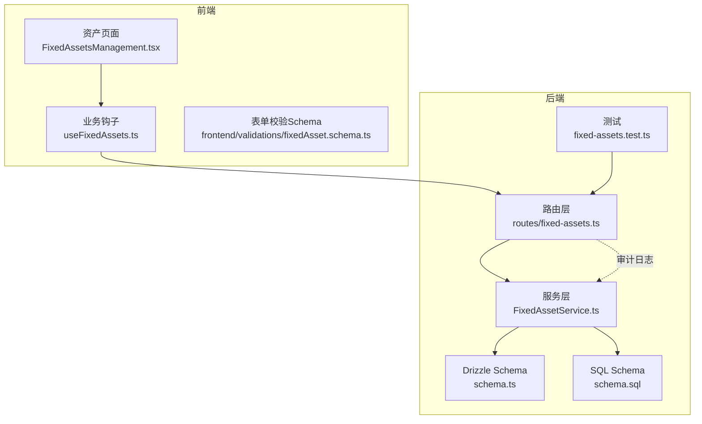
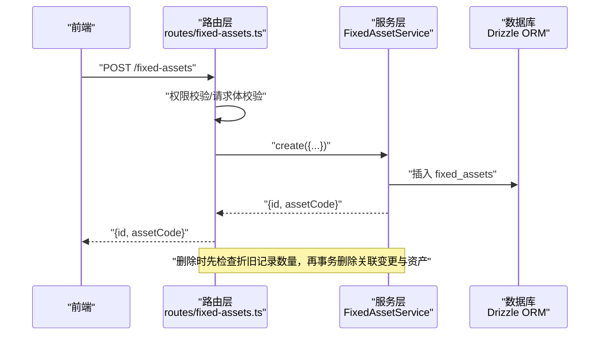
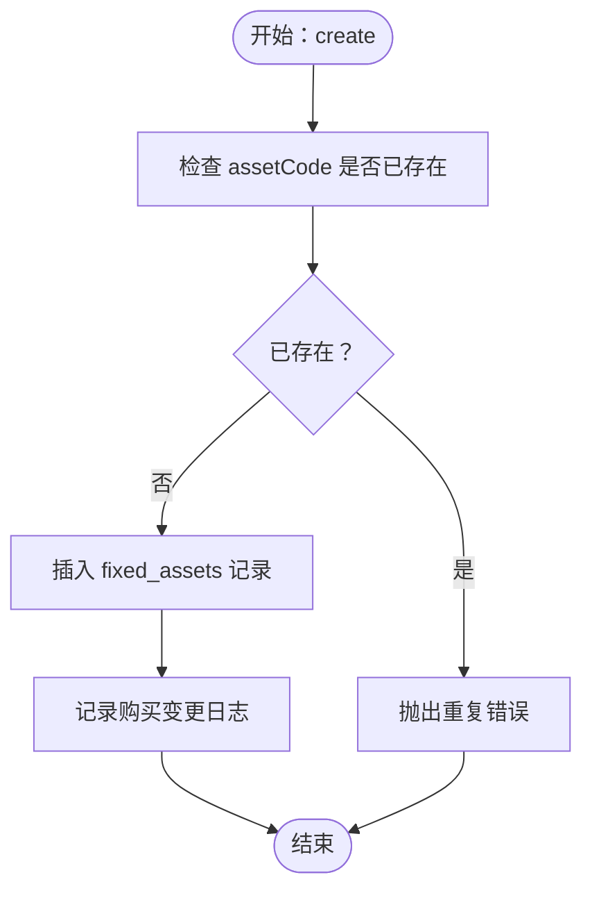
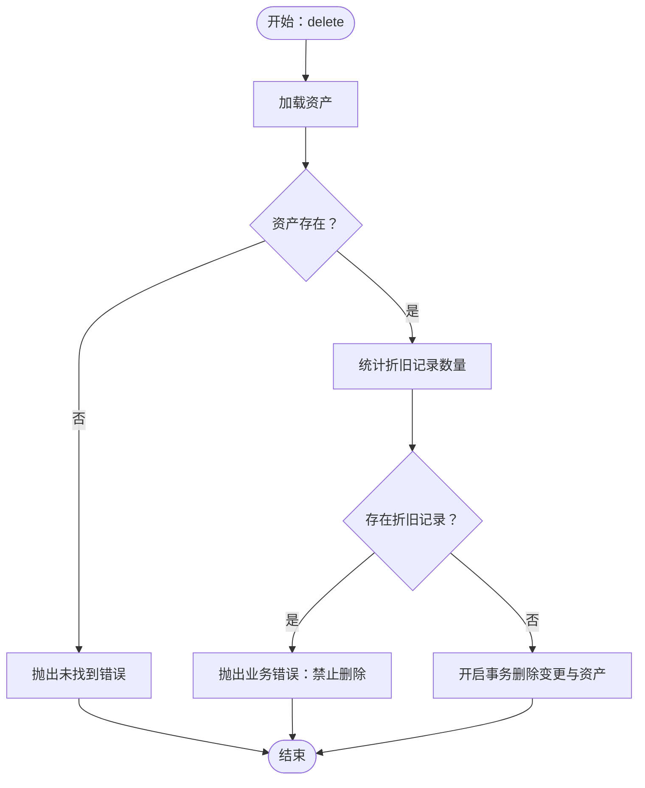

# 固定资产核心数据模型

<cite>
**本文引用的文件列表**
- [backend/src/db/schema.ts](file://backend/src/db/schema.ts)
- [backend/src/db/schema.sql](file://backend/src/db/schema.sql)
- [backend/src/services/FixedAssetService.ts](file://backend/src/services/FixedAssetService.ts)
- [backend/src/routes/fixed-assets.ts](file://backend/src/routes/fixed-assets.ts)
- [backend/src/schemas/business.schema.ts](file://backend/src/schemas/business.schema.ts)
- [frontend/src/validations/fixedAsset.schema.ts](file://frontend/src/validations/fixedAsset.schema.ts)
- [frontend/src/features/assets/pages/FixedAssetsManagement.tsx](file://frontend/src/features/assets/pages/FixedAssetsManagement.tsx)
- [frontend/src/hooks/business/useFixedAssets.ts](file://frontend/src/hooks/business/useFixedAssets.ts)
- [backend/test/routes/fixed-assets.test.ts](file://backend/test/routes/fixed-assets.test.ts)
</cite>

## 目录
1. [引言](#引言)
2. [项目结构与定位](#项目结构与定位)
3. [核心数据模型概览](#核心数据模型概览)
4. [架构总览](#架构总览)
5. [详细组件分析](#详细组件分析)
6. [依赖关系分析](#依赖关系分析)
7. [性能与一致性保障](#性能与一致性保障)
8. [故障排查指南](#故障排查指南)
9. [结论](#结论)

## 引言
本文件聚焦于固定资产核心数据模型，系统化梳理 fixed_assets 表的关键字段、状态生命周期、业务约束与一致性保障机制，并结合 FixedAssetService 的 create/update/delete 方法，解释资产创建、更新、删除的控制流与错误处理策略。同时，结合前后端交互路径，说明资产状态流转（使用中、闲置、维修、报废、已出售）的规则与边界条件，帮助开发者与产品人员快速理解并正确使用固定资产模块。

## 项目结构与定位
- 数据层：通过 Drizzle ORM 定义 fixed_assets、fixed_asset_depreciations、fixed_asset_changes、fixed_asset_allocations 等核心表结构，确保字段约束与业务语义一致。
- 服务层：FixedAssetService 提供资产全生命周期管理能力，包括创建、更新、删除、折旧、转移、购买、出售、分配与归还等。
- 接口层：routes/fixed-assets.ts 暴露 REST API，负责权限校验、请求体校验与审计日志记录。
- 前端层：提供资产列表、详情、折旧与变动记录展示，以及调拨、折旧登记等操作入口。



图表来源
- [backend/src/routes/fixed-assets.ts](file://backend/src/routes/fixed-assets.ts#L1-L730)
- [backend/src/services/FixedAssetService.ts](file://backend/src/services/FixedAssetService.ts#L1-L779)
- [backend/src/db/schema.ts](file://backend/src/db/schema.ts#L464-L532)
- [backend/src/db/schema.sql](file://backend/src/db/schema.sql#L455-L527)
- [frontend/src/features/assets/pages/FixedAssetsManagement.tsx](file://frontend/src/features/assets/pages/FixedAssetsManagement.tsx#L1-L523)
- [frontend/src/hooks/business/useFixedAssets.ts](file://frontend/src/hooks/business/useFixedAssets.ts#L1-L156)
- [frontend/src/validations/fixedAsset.schema.ts](file://frontend/src/validations/fixedAsset.schema.ts#L1-L44)
- [backend/test/routes/fixed-assets.test.ts](file://backend/test/routes/fixed-assets.test.ts#L1-L323)

章节来源
- [backend/src/routes/fixed-assets.ts](file://backend/src/routes/fixed-assets.ts#L1-L730)
- [backend/src/services/FixedAssetService.ts](file://backend/src/services/FixedAssetService.ts#L1-L779)
- [backend/src/db/schema.ts](file://backend/src/db/schema.ts#L464-L532)
- [backend/src/db/schema.sql](file://backend/src/db/schema.sql#L455-L527)
- [frontend/src/features/assets/pages/FixedAssetsManagement.tsx](file://frontend/src/features/assets/pages/FixedAssetsManagement.tsx#L1-L523)
- [frontend/src/hooks/business/useFixedAssets.ts](file://frontend/src/hooks/business/useFixedAssets.ts#L1-L156)
- [frontend/src/validations/fixedAsset.schema.ts](file://frontend/src/validations/fixedAsset.schema.ts#L1-L44)
- [backend/test/routes/fixed-assets.test.ts](file://backend/test/routes/fixed-assets.test.ts#L1-L323)

## 核心数据模型概览
fixed_assets 表是固定资产的核心实体，承载资产的物理属性、财务属性与状态信息。以下为关键字段的定义与约束来源：

- 主键与唯一性
  - id：主键
  - assetCode：非空且唯一，作为资产的全局唯一标识
- 基本信息
  - name：资产名称
  - category：资产类别
  - memo：备注
- 财务信息
  - purchaseDate：购买日期
  - purchasePriceCents：购买价格（分）
  - currency：币种（3 字符）
  - currentValueCents：当前净值（分）
  - saleDate/salePriceCents/saleBuyer/saleMemo：出售相关字段
- 组织与归属
  - vendorId：供应商
  - departmentId：使用项目
  - siteId：资产位置
  - custodian：责任人
- 折旧与计量
  - depreciationMethod：折旧方法
  - usefulLifeYears：预计使用年限
- 状态与审计
  - status：资产状态，默认 in_use
  - createdBy/createdAt/updatedAt：创建与更新审计

章节来源
- [backend/src/db/schema.ts](file://backend/src/db/schema.ts#L464-L488)
- [backend/src/db/schema.sql](file://backend/src/db/schema.sql#L455-L480)

## 架构总览
固定资产模块采用“路由层-服务层-数据层”的分层设计：
- 路由层负责权限校验、请求体校验与审计日志
- 服务层封装业务规则与事务边界，保证数据一致性
- 数据层通过 Drizzle ORM 映射 SQLite 表结构，提供强类型查询与写入



图表来源
- [backend/src/routes/fixed-assets.ts](file://backend/src/routes/fixed-assets.ts#L269-L327)
- [backend/src/services/FixedAssetService.ts](file://backend/src/services/FixedAssetService.ts#L218-L323)

章节来源
- [backend/src/routes/fixed-assets.ts](file://backend/src/routes/fixed-assets.ts#L269-L327)
- [backend/src/services/FixedAssetService.ts](file://backend/src/services/FixedAssetService.ts#L218-L323)

## 详细组件分析

### 1) fixed_assets 表字段与约束
- 唯一性与非空
  - assetCode 非空且唯一，用于防止重复录入
  - purchasePriceCents 非空
  - currency 为 3 字符币种代码
- 状态枚举
  - status 默认 in_use，支持 in_use/idle/maintenance/scrapped/sold
- 财务字段
  - currentValueCents 默认与 purchasePriceCents 保持一致
  - 出售时 saleDate/salePriceCents/saleBuyer/saleMemo 记录出售信息
- 外键与关联
  - vendorId 关联供应商
  - departmentId/siteId/custodian 与组织/位置/责任人关联

章节来源
- [backend/src/db/schema.ts](file://backend/src/db/schema.ts#L464-L488)
- [backend/src/db/schema.sql](file://backend/src/db/schema.sql#L455-L480)

### 2) 资产状态生命周期与流转规则
- 状态集合
  - in_use：使用中
  - idle：闲置
  - maintenance：维修中
  - scrapped：报废
  - sold：已出售
- 流转规则
  - 使用中/闲置 -> 分配给员工：仅当资产状态为 in_use 或 idle 时允许分配
  - 归还：从使用中/闲置状态归还后，资产进入 idle 并清空责任人
  - 出售：若资产已标记为 sold，则禁止再次出售
  - 报废：可通过业务流程将资产标记为 scrapped
  - 维修：可通过转移/变更记录将资产置于 maintenance 状态
  - 调拨：可调整部门、站点与责任人，同时记录变更日志

章节来源
- [backend/src/services/FixedAssetService.ts](file://backend/src/services/FixedAssetService.ts#L644-L777)
- [frontend/src/features/assets/pages/FixedAssetsManagement.tsx](file://frontend/src/features/assets/pages/FixedAssetsManagement.tsx#L16-L22)

### 3) 资产创建 create
- 关键约束
  - 资产代码唯一性校验：若存在同 assetCode 则抛出重复错误
  - 当前净值默认与购买价格一致
  - 状态默认 in_use
- 事务与审计
  - 插入资产记录
  - 记录资产变更日志（购买）



图表来源
- [backend/src/services/FixedAssetService.ts](file://backend/src/services/FixedAssetService.ts#L218-L251)

章节来源
- [backend/src/services/FixedAssetService.ts](file://backend/src/services/FixedAssetService.ts#L218-L251)

### 4) 资产更新 update
- 关键约束
  - 若状态、部门、站点或责任人发生变更，自动记录变更日志
  - 更新时间戳同步更新
- 业务影响
  - 仅允许对存在的资产进行更新

章节来源
- [backend/src/services/FixedAssetService.ts](file://backend/src/services/FixedAssetService.ts#L253-L301)

### 5) 资产删除 delete
- 关键约束
  - 删除前检查是否存在折旧记录；若有折旧记录则拒绝删除
  - 删除时通过事务级联删除相关变更记录与资产本身
- 业务影响
  - 删除不可逆，需谨慎执行



图表来源
- [backend/src/services/FixedAssetService.ts](file://backend/src/services/FixedAssetService.ts#L304-L323)

章节来源
- [backend/src/services/FixedAssetService.ts](file://backend/src/services/FixedAssetService.ts#L304-L323)

### 6) 折旧 createDepreciation
- 关键约束
  - 累计折旧金额不得超出购买价格
  - 更新资产当前净值与更新时间
  - 记录折旧明细与累计折旧、剩余价值
- 事务边界
  - 在同一事务内写入折旧明细并回写资产净值

章节来源
- [backend/src/services/FixedAssetService.ts](file://backend/src/services/FixedAssetService.ts#L325-L369)

### 7) 转移 transfer
- 关键约束
  - 至少提供 to_departmentId、to_siteId、toCustodian 之一
  - 写入资产变更日志并按需更新资产的部门、站点与责任人
- 业务影响
  - 适用于资产跨部门/跨站点/跨责任人的调拨

章节来源
- [backend/src/services/FixedAssetService.ts](file://backend/src/services/FixedAssetService.ts#L371-L415)

### 8) 购买 purchase（含现金流与会计分录）
- 关键约束
  - 资产代码唯一性校验
  - 账户有效性与币种一致性校验
  - 生成凭证号、计算余额并写入现金流与会计分录
  - 记录购买变更日志
- 事务边界
  - 在同一事务内完成资产、现金流、会计分录与变更日志的写入

章节来源
- [backend/src/services/FixedAssetService.ts](file://backend/src/services/FixedAssetService.ts#L417-L539)

### 9) 出售 sell
- 关键约束
  - 资产状态不得为 sold
  - 账户有效性与币种一致性校验
  - 更新资产状态为 sold，并记录出售相关信息
  - 生成收入类现金流与会计分录
  - 记录销售变更日志
- 事务边界
  - 在同一事务内完成资产更新、现金流与会计分录、变更日志

章节来源
- [backend/src/services/FixedAssetService.ts](file://backend/src/services/FixedAssetService.ts#L541-L642)

### 10) 分配 allocate 与归还 return
- 分配
  - 仅允许对 in_use 或 idle 的资产进行分配
  - 不允许存在未归还的分配记录
  - 更新资产状态为 in_use，责任人与部门可能随员工所属部门变化
  - 记录分配变更日志
- 归还
  - 必须存在未归还的分配记录
  - 更新分配记录的归还日期与类型，资产状态回到 idle 并清空责任人
  - 记录归还变更日志

章节来源
- [backend/src/services/FixedAssetService.ts](file://backend/src/services/FixedAssetService.ts#L644-L777)

### 11) 前后端交互与表单校验
- 前端页面
  - 资产管理页面提供资产列表、详情、折旧与变动记录展示，以及调拨、折旧登记等操作入口
- 前端表单校验
  - create/update 固定资产表单校验包含资产编号、名称、购买价格、币种、状态、折旧方法、使用年限、当前净值等字段
- 路由层校验
  - 使用 OpenAPI Schema 对请求体进行严格校验，确保字段类型与取值范围符合预期

章节来源
- [frontend/src/features/assets/pages/FixedAssetsManagement.tsx](file://frontend/src/features/assets/pages/FixedAssetsManagement.tsx#L1-L523)
- [frontend/src/validations/fixedAsset.schema.ts](file://frontend/src/validations/fixedAsset.schema.ts#L1-L44)
- [backend/src/schemas/business.schema.ts](file://backend/src/schemas/business.schema.ts#L248-L286)
- [backend/src/routes/fixed-assets.ts](file://backend/src/routes/fixed-assets.ts#L269-L327)

## 依赖关系分析
- 路由层依赖服务层提供的业务方法，统一进行权限校验与审计日志记录
- 服务层依赖 Drizzle ORM 对固定资产管理表进行读写，并在关键业务上使用事务保证原子性
- 前端通过 React Query 钩子与后端 API 进行数据交互，表单校验在前端与后端双重保障

```mermaid
classDiagram
class FixedAssetService {
+list(query)
+get(id)
+create(data)
+update(id,data)
+delete(id)
+createDepreciation(id,data)
+transfer(id,data)
+purchase(data)
+sell(id,data)
+allocate(id,data)
+return(id,data)
}
class Routes {
+GET /fixed-assets
+GET /fixed-assets/{id}
+POST /fixed-assets
+PUT /fixed-assets/{id}
+DELETE /fixed-assets/{id}
+POST /fixed-assets/{id}/depreciation
+POST /fixed-assets/{id}/transfer
+POST /fixed-assets/purchase
+POST /fixed-assets/{id}/sell
+POST /fixed-assets/allocate
+POST /fixed-assets/{id}/return
}
Routes --> FixedAssetService : "调用"
```

图表来源
- [backend/src/routes/fixed-assets.ts](file://backend/src/routes/fixed-assets.ts#L1-L730)
- [backend/src/services/FixedAssetService.ts](file://backend/src/services/FixedAssetService.ts#L1-L779)

章节来源
- [backend/src/routes/fixed-assets.ts](file://backend/src/routes/fixed-assets.ts#L1-L730)
- [backend/src/services/FixedAssetService.ts](file://backend/src/services/FixedAssetService.ts#L1-L779)

## 性能与一致性保障
- 事务边界
  - 删除资产、折旧登记、购买/出售、分配/归还均在事务内执行，确保多表一致性
- 索引与查询
  - schema.sql 中包含常用索引（如用户、会话、审计日志等），有助于提升查询性能
- 业务约束
  - 资产代码唯一性、折旧金额上限、状态流转限制等，均由服务层实现，避免脏数据进入数据库
- 前端缓存与失效
  - React Query 在成功提交后主动失效相关查询缓存，保证 UI 与后端数据一致

章节来源
- [backend/src/services/FixedAssetService.ts](file://backend/src/services/FixedAssetService.ts#L304-L369)
- [backend/src/db/schema.sql](file://backend/src/db/schema.sql#L297-L314)
- [frontend/src/hooks/business/useFixedAssets.ts](file://frontend/src/hooks/business/useFixedAssets.ts#L53-L156)

## 故障排查指南
- 创建失败：资产代码重复
  - 现象：创建接口返回重复错误
  - 处理：修改资产代码或确认是否已有同编号资产
  - 参考：服务层唯一性校验
- 删除失败：存在折旧记录
  - 现象：删除接口提示无法删除
  - 处理：先清理折旧记录或评估业务合理性
  - 参考：删除前折旧记录检查
- 出售失败：资产已出售
  - 现象：出售接口提示资产已出售
  - 处理：确认资产状态或重新建账
  - 参考：出售状态检查
- 分配失败：资产不在 in_use/idle 或存在未归还分配
  - 现象：分配接口报错
  - 处理：先归还或调整资产状态
  - 参考：分配前置条件
- 归还失败：不存在未归还分配
  - 现象：归还接口报错
  - 处理：确认分配记录状态
  - 参考：归还前置条件

章节来源
- [backend/src/services/FixedAssetService.ts](file://backend/src/services/FixedAssetService.ts#L304-L777)
- [backend/test/routes/fixed-assets.test.ts](file://backend/test/routes/fixed-assets.test.ts#L1-L323)

## 结论
固定资产核心数据模型围绕 fixed_assets 表构建，配合 fixed_asset_depreciations、fixed_asset_changes、fixed_asset_allocations 实现完整的生命周期管理。服务层通过严格的业务约束与事务边界，确保数据一致性；路由层提供清晰的 API 与审计日志；前端通过表单校验与交互增强用户体验。遵循本文所述的状态流转规则与业务约束，可有效避免常见问题并提升系统稳定性。