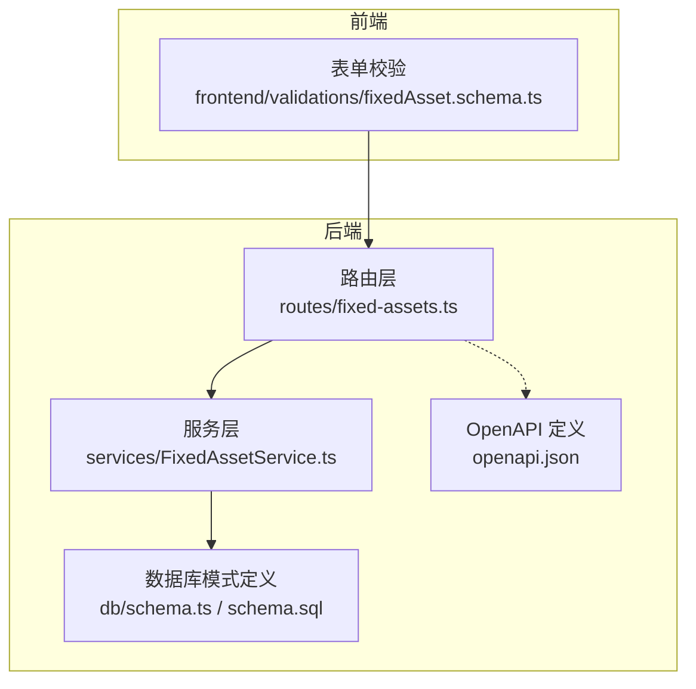
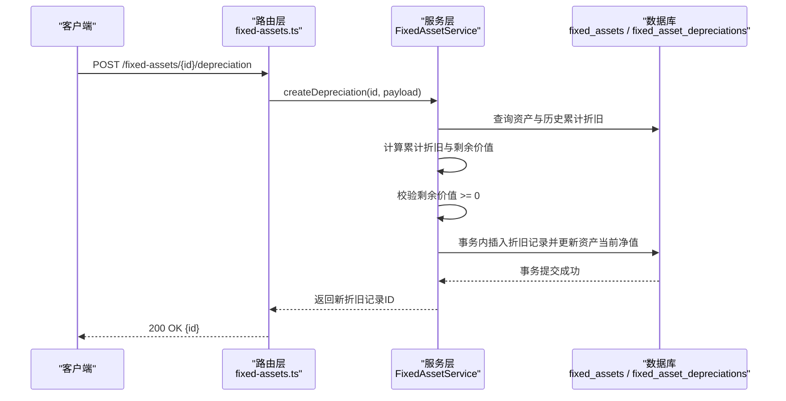
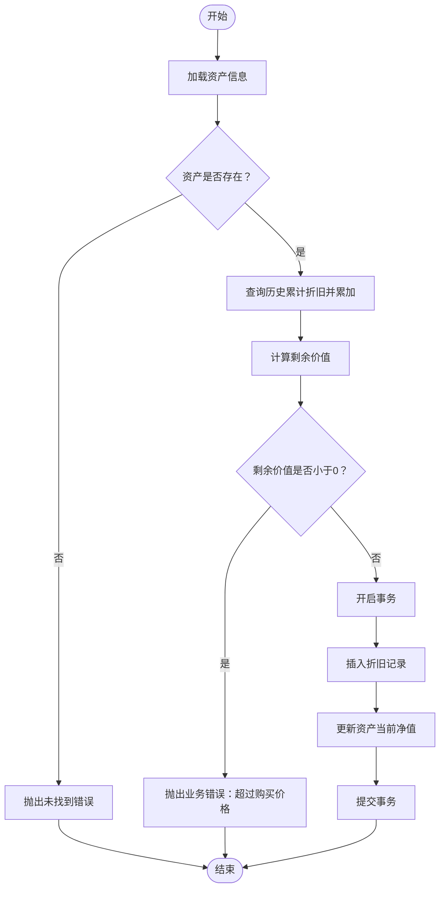
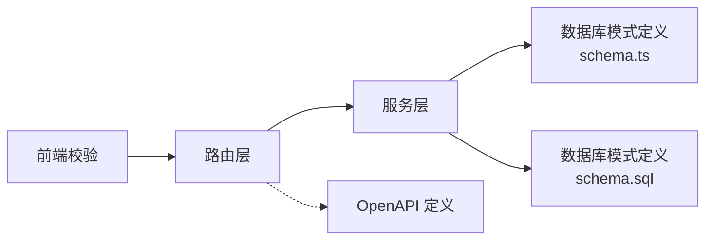

# 折旧管理数据模型

<cite>
**本文引用的文件**
- [backend/src/db/schema.ts](file://backend/src/db/schema.ts)
- [backend/src/db/schema.sql](file://backend/src/db/schema.sql)
- [backend/src/services/FixedAssetService.ts](file://backend/src/services/FixedAssetService.ts)
- [backend/src/routes/fixed-assets.ts](file://backend/src/routes/fixed-assets.ts)
- [backend/src/schemas/business.schema.ts](file://backend/src/schemas/business.schema.ts)
- [backend/openapi.json](file://backend/openapi.json)
- [frontend/src/validations/fixedAsset.schema.ts](file://frontend/src/validations/fixedAsset.schema.ts)
- [backend/test/routes/fixed-assets.test.ts](file://backend/test/routes/fixed-assets.test.ts)
</cite>

## 目录
1. [引言](#引言)
2. [项目结构](#项目结构)
3. [核心组件](#核心组件)
4. [架构总览](#架构总览)
5. [详细组件分析](#详细组件分析)
6. [依赖分析](#依赖分析)
7. [性能考虑](#性能考虑)
8. [故障排查指南](#故障排查指南)
9. [结论](#结论)
10. [附录](#附录)

## 引言
本技术文档聚焦于固定资产折旧管理的数据模型与业务流程，围绕 fixed_asset_depreciations 表展开，系统性解析以下关键点：
- 字段语义与计算逻辑：折旧日期、折旧金额、累计折旧、剩余价值
- 折旧记录创建流程与事务一致性保障
- 通过 createDepreciation 方法确保累计折旧不超过采购价格的校验机制
- 折旧后资产当前价值的同步更新机制
- 折旧数据与资产主表的关联关系
- 资产出售或报废时的处理规则与数据完整性约束

## 项目结构
固定资产相关的核心代码分布在后端路由、服务层与数据库模式定义中，并通过 OpenAPI 定义对外暴露接口。前端对表单输入进行基础校验，后端在服务层执行严格的业务规则与数据一致性控制。

图表来源
- [backend/src/routes/fixed-assets.ts](file://backend/src/routes/fixed-assets.ts#L413-L458)
- [backend/src/services/FixedAssetService.ts](file://backend/src/services/FixedAssetService.ts#L325-L369)
- [backend/src/db/schema.ts](file://backend/src/db/schema.ts#L464-L500)
- [backend/src/db/schema.sql](file://backend/src/db/schema.sql#L455-L493)
- [backend/openapi.json](file://backend/openapi.json#L8092-L8141)
- [frontend/src/validations/fixedAsset.schema.ts](file://frontend/src/validations/fixedAsset.schema.ts#L37-L43)

章节来源
- [backend/src/routes/fixed-assets.ts](file://backend/src/routes/fixed-assets.ts#L413-L458)
- [backend/src/services/FixedAssetService.ts](file://backend/src/services/FixedAssetService.ts#L325-L369)
- [backend/src/db/schema.ts](file://backend/src/db/schema.ts#L464-L500)
- [backend/src/db/schema.sql](file://backend/src/db/schema.sql#L455-L493)
- [backend/openapi.json](file://backend/openapi.json#L8092-L8141)
- [frontend/src/validations/fixedAsset.schema.ts](file://frontend/src/validations/fixedAsset.schema.ts#L37-L43)

## 核心组件
- 数据库表结构
  - 固定资产主表 fixed_assets：存储资产基本信息与当前净值
  - 折旧明细表 fixed_asset_depreciations：存储每次折旧记录及累计折旧、剩余价值
- 服务层方法
  - createDepreciation：创建折旧记录并校验累计折旧上限、同步更新资产当前净值
- 路由层
  - 提供 /fixed-assets/{id}/depreciation 接口，封装权限校验与审计日志
- 模式与校验
  - OpenAPI 与后端 Zod Schema 对请求体进行强约束
  - 前端对表单输入进行基础校验

章节来源
- [backend/src/db/schema.ts](file://backend/src/db/schema.ts#L464-L500)
- [backend/src/services/FixedAssetService.ts](file://backend/src/services/FixedAssetService.ts#L325-L369)
- [backend/src/routes/fixed-assets.ts](file://backend/src/routes/fixed-assets.ts#L413-L458)
- [backend/src/schemas/business.schema.ts](file://backend/src/schemas/business.schema.ts#L300-L308)
- [backend/openapi.json](file://backend/openapi.json#L8092-L8141)
- [frontend/src/validations/fixedAsset.schema.ts](file://frontend/src/validations/fixedAsset.schema.ts#L37-L43)

## 架构总览
下图展示从接口到服务再到数据库的完整调用链路与数据流。

图表来源
- [backend/src/routes/fixed-assets.ts](file://backend/src/routes/fixed-assets.ts#L413-L458)
- [backend/src/services/FixedAssetService.ts](file://backend/src/services/FixedAssetService.ts#L325-L369)
- [backend/src/db/schema.ts](file://backend/src/db/schema.ts#L464-L500)

## 详细组件分析

### 数据模型：fixed_asset_depreciations 表
- 字段说明
  - id：折旧记录唯一标识
  - assetId：关联资产主表 id
  - depreciationDate：折旧日期（YYYY-MM-DD）
  - depreciationAmountCents：本次折旧金额（分）
  - accumulatedDepreciationCents：累计折旧（分）
  - remainingValueCents：剩余价值（分）
  - memo：备注
  - createdBy / createdAt：创建人与创建时间
- 关联关系
  - 与 fixed_assets 的一对多关系：一个资产可有多条折旧记录
- 数据完整性
  - 通过服务层在插入折旧记录前计算并校验累计折旧不超过采购价格，保证 remainingValueCents ≥ 0

章节来源
- [backend/src/db/schema.ts](file://backend/src/db/schema.ts#L464-L500)
- [backend/src/db/schema.sql](file://backend/src/db/schema.sql#L482-L493)

### 字段计算逻辑与业务规则
- 折旧金额与累计折旧
  - 服务层先查询历史累计折旧，再与本次折旧金额相加得到累计折旧
- 剩余价值
  - remainingValueCents = purchasePriceCents − accumulatedDepreciationCents
- 上限校验
  - 若 remainingValueCents < 0，则拒绝本次折旧并返回业务错误
- 当前净值同步
  - 在同一事务中写入折旧记录并更新 fixed_assets.currentValueCents 为最新 remainingValueCents

章节来源
- [backend/src/services/FixedAssetService.ts](file://backend/src/services/FixedAssetService.ts#L325-L369)

### 折旧记录创建流程（含事务与校验）
- 输入约束
  - OpenAPI 与 Zod Schema 约束：depreciationDate（YYYY-MM-DD）、amountCents（>0）、memo（可选）
- 处理步骤
  1) 校验资产存在
  2) 查询历史累计折旧并累加得到本次累计折旧
  3) 计算剩余价值并校验其非负
  4) 开启事务，插入折旧记录并更新资产当前净值
  5) 返回新折旧记录 ID
- 错误处理
  - 资产不存在：抛出“未找到”错误
  - 折旧金额超限：抛出“折旧金额超过购买价格”业务错误
  - 删除资产前需无折旧记录：避免破坏数据完整性

图表来源
- [backend/src/services/FixedAssetService.ts](file://backend/src/services/FixedAssetService.ts#L325-L369)
- [backend/src/routes/fixed-assets.ts](file://backend/src/routes/fixed-assets.ts#L413-L458)
- [backend/src/schemas/business.schema.ts](file://backend/src/schemas/business.schema.ts#L300-L308)
- [backend/openapi.json](file://backend/openapi.json#L8092-L8141)

### 与资产主表的关联与同步
- 关联键
  - fixed_asset_depreciations.assetId → fixed_assets.id
- 同步更新
  - 每次新增折旧记录后，立即更新 fixed_assets.currentValueCents 为最新 remainingValueCents
- 删除限制
  - 删除资产前若存在折旧记录则拒绝删除，防止历史折旧数据孤立

章节来源
- [backend/src/services/FixedAssetService.ts](file://backend/src/services/FixedAssetService.ts#L308-L323)
- [backend/src/db/schema.ts](file://backend/src/db/schema.ts#L464-L500)

### 资产出售或报废时的处理规则
- 出售（sell）
  - 将资产状态标记为 sold，并记录销售日期、售价、买家等信息
  - 与财务流水联动（此处为服务层通用财务流程的一部分）
- 报废（scrapped）
  - 服务层未提供专门的“报废”接口；通常可通过状态变更或销售流程实现
  - 若未来扩展，建议在服务层增加对应校验与变更日志

章节来源
- [backend/src/services/FixedAssetService.ts](file://backend/src/services/FixedAssetService.ts#L541-L642)
- [backend/src/db/schema.ts](file://backend/src/db/schema.ts#L464-L488)

### 接口与数据契约
- 接口路径与方法
  - POST /fixed-assets/{id}/depreciation
- 请求体字段
  - assetId：资产ID（UUID）
  - depreciationDate：折旧日期（YYYY-MM-DD）
  - amountCents：折旧金额（分，>0）
  - memo：备注（可选）
- 响应
  - 返回新建折旧记录的ID
- 权限与审计
  - 路由层包含权限校验中间件与审计日志记录

章节来源
- [backend/src/routes/fixed-assets.ts](file://backend/src/routes/fixed-assets.ts#L413-L458)
- [backend/src/schemas/business.schema.ts](file://backend/src/schemas/business.schema.ts#L300-L308)
- [backend/openapi.json](file://backend/openapi.json#L8092-L8141)
- [frontend/src/validations/fixedAsset.schema.ts](file://frontend/src/validations/fixedAsset.schema.ts#L37-L43)

## 依赖分析
- 组件耦合
  - 路由层仅负责参数校验、权限与审计，核心业务逻辑集中在服务层
  - 服务层依赖数据库模式定义与 Drizzle ORM 进行读写
- 外部依赖
  - OpenAPI 与前端表单校验共同约束请求体，减少后端异常分支
- 潜在风险
  - 若前端未做严格校验，后端仍会通过 Zod Schema 与 OpenAPI 规范进行拦截
  - 事务内原子性保障了折旧记录与资产净值的一致性

图表来源
- [backend/src/routes/fixed-assets.ts](file://backend/src/routes/fixed-assets.ts#L413-L458)
- [backend/src/services/FixedAssetService.ts](file://backend/src/services/FixedAssetService.ts#L325-L369)
- [backend/src/db/schema.ts](file://backend/src/db/schema.ts#L464-L500)
- [backend/src/db/schema.sql](file://backend/src/db/schema.sql#L455-L493)
- [backend/openapi.json](file://backend/openapi.json#L8092-L8141)
- [frontend/src/validations/fixedAsset.schema.ts](file://frontend/src/validations/fixedAsset.schema.ts#L37-L43)

## 性能考虑
- 查询优化
  - 折旧查询按资产ID过滤并按折旧日期降序排列，有利于快速获取最新折旧记录
- 写入优化
  - 折旧写入与资产净值更新在同一事务内完成，避免中间态
- 并发控制
  - 通过事务隔离与锁机制保证并发场景下的数据一致性
- 建议
  - 对折旧频繁的资产，可在资产表上维护一个“最后折旧日期”索引以加速查询（如需）

## 故障排查指南
- 常见错误与定位
  - “折旧金额超过购买价格”：检查历史累计折旧与本次折旧金额之和是否超过采购价格
  - “资产未找到”：确认资产ID有效且存在
  - “删除失败：资产还有折旧记录”：先清理折旧记录再删除资产
- 排查步骤
  1) 确认请求体字段符合 OpenAPI 与 Zod Schema 约束
  2) 检查服务层 createDepreciation 的事务执行情况
  3) 核对 fixed_assets 与 fixed_asset_depreciations 的关联与数据一致性
- 单元测试参考
  - 测试覆盖了创建折旧接口的请求与响应，便于回归验证

章节来源
- [backend/src/services/FixedAssetService.ts](file://backend/src/services/FixedAssetService.ts#L308-L369)
- [backend/test/routes/fixed-assets.test.ts](file://backend/test/routes/fixed-assets.test.ts#L207-L223)

## 结论
本数据模型通过严格的累计折旧上限校验与事务内的资产净值同步，确保了折旧数据的准确性与一致性。固定资产管理的其余生命周期（购买、转移、分配、出售等）与折旧流程相互独立但共享统一的审计与权限体系，满足企业级财务合规要求。

## 附录
- 字段对照表（来自数据库模式）
  - fixed_asset_depreciations
    - id：折旧记录ID
    - asset_id：资产ID
    - depreciation_date：折旧日期
    - depreciation_amount_cents：折旧金额（分）
    - accumulated_depreciation_cents：累计折旧（分）
    - remaining_value_cents：剩余价值（分）
    - memo：备注
    - created_by / created_at：创建人与时间
  - fixed_assets
    - id：资产ID
    - asset_code：资产编号
    - name：资产名称
    - purchase_price_cents：采购价格（分）
    - current_value_cents：当前净值（分）
    - status：状态（in_use/idle/maintenance/scrapped/sold）
    - sale_date / sale_price_cents / sale_buyer / sale_memo：出售相关信息

章节来源
- [backend/src/db/schema.ts](file://backend/src/db/schema.ts#L464-L500)
- [backend/src/db/schema.sql](file://backend/src/db/schema.sql#L455-L493)