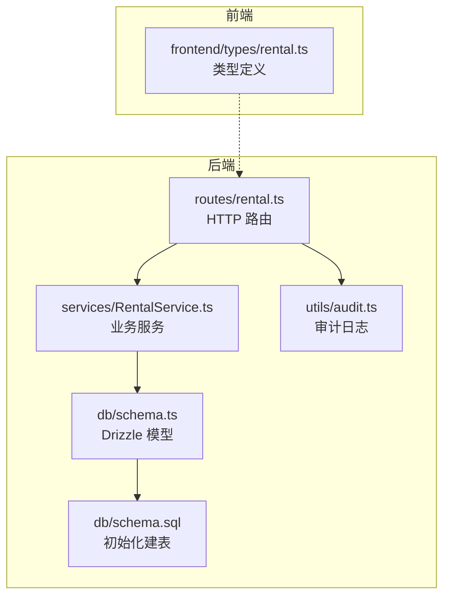
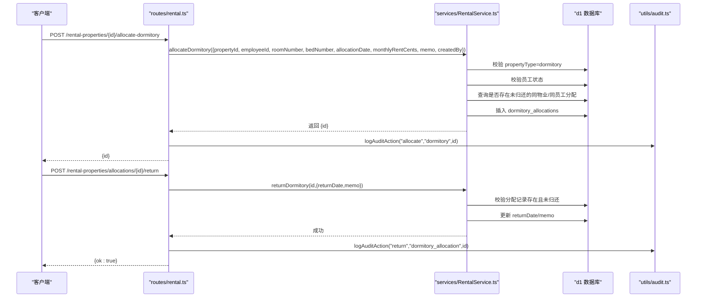
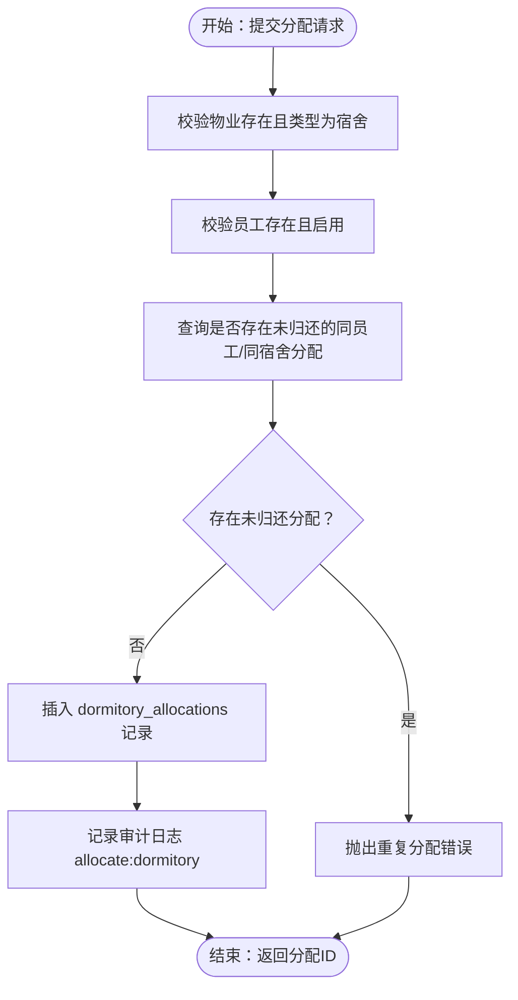
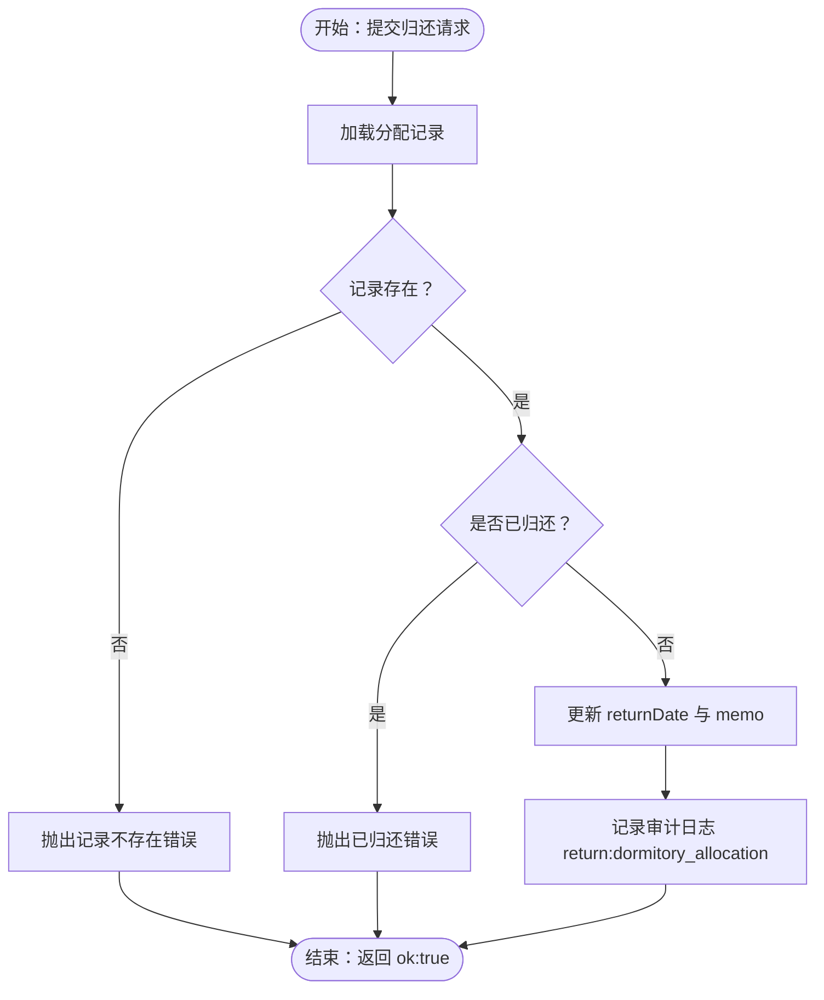
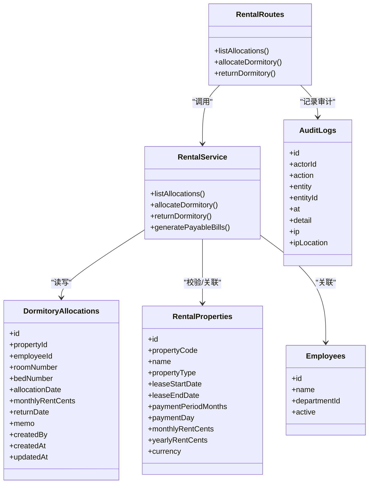

# 宿舍分配数据模型

<cite>
**本文引用的文件**
- [backend/src/db/schema.ts](file://backend/src/db/schema.ts)
- [backend/src/db/schema.sql](file://backend/src/db/schema.sql)
- [backend/src/services/RentalService.ts](file://backend/src/services/RentalService.ts)
- [backend/src/routes/rental.ts](file://backend/src/routes/rental.ts)
- [backend/src/schemas/business.schema.ts](file://backend/src/schemas/business.schema.ts)
- [backend/src/utils/audit.ts](file://backend/src/utils/audit.ts)
- [frontend/src/types/rental.ts](file://frontend/src/types/rental.ts)
- [backend/test/routes/rental.test.ts](file://backend/test/routes/rental.test.ts)
</cite>

## 目录
1. [简介](#简介)
2. [项目结构](#项目结构)
3. [核心组件](#核心组件)
4. [架构总览](#架构总览)
5. [详细组件分析](#详细组件分析)
6. [依赖分析](#依赖分析)
7. [性能考虑](#性能考虑)
8. [故障排查指南](#故障排查指南)
9. [结论](#结论)
10. [附录](#附录)

## 简介
本文件面向开发者，系统性梳理“宿舍分配”数据模型与业务流程，围绕 d1 数据库中的 dormitory_allocations 表展开，覆盖字段语义、与租赁物业（仅限宿舍类型）及员工信息的关联关系，并给出员工入住、租金计算、宿舍调换与归还的完整业务流程说明。同时提供防止重复分配、处理历史记录与生成宿舍报表的实现建议与最佳实践。

## 项目结构
- 后端采用 Drizzle ORM + Cloudflare D1，数据模型定义在 schema.ts 中，SQL 初始化脚本位于 schema.sql。
- 业务服务集中在 RentalService，路由层在 routes/rental.ts，前端类型定义在 frontend/src/types/rental.ts。
- 审计日志通过 utils/audit.ts 记录，测试覆盖 routes 层对宿舍分配接口的行为。

图表来源
- [backend/src/routes/rental.ts](file://backend/src/routes/rental.ts#L1-L200)
- [backend/src/services/RentalService.ts](file://backend/src/services/RentalService.ts#L367-L520)
- [backend/src/db/schema.ts](file://backend/src/db/schema.ts#L599-L643)
- [backend/src/db/schema.sql](file://backend/src/db/schema.sql#L597-L631)
- [backend/src/utils/audit.ts](file://backend/src/utils/audit.ts#L1-L92)
- [frontend/src/types/rental.ts](file://frontend/src/types/rental.ts#L53-L110)

章节来源
- [backend/src/routes/rental.ts](file://backend/src/routes/rental.ts#L1-L200)
- [backend/src/services/RentalService.ts](file://backend/src/services/RentalService.ts#L367-L520)
- [backend/src/db/schema.ts](file://backend/src/db/schema.ts#L599-L643)
- [backend/src/db/schema.sql](file://backend/src/db/schema.sql#L597-L631)
- [backend/src/utils/audit.ts](file://backend/src/utils/audit.ts#L1-L92)
- [frontend/src/types/rental.ts](file://frontend/src/types/rental.ts#L53-L110)

## 核心组件
- dormitory_allocations 表：存储员工宿舍分配的核心数据，包含员工ID、宿舍物业ID、房间号、床位号、分配日期、月租金、归还日期、备注、创建人、创建时间、更新时间等字段。
- 租赁物业（仅限宿舍类型）：通过 rentalProperties 表的 propertyType 字段限定为 dormitory 的物业才可进行宿舍分配。
- 员工信息：通过 employees 表关联员工基本信息，用于展示与统计。
- 审计日志：记录分配与归还的关键动作，便于追溯。

章节来源
- [backend/src/db/schema.ts](file://backend/src/db/schema.ts#L599-L643)
- [backend/src/services/RentalService.ts](file://backend/src/services/RentalService.ts#L367-L520)
- [backend/src/utils/audit.ts](file://backend/src/utils/audit.ts#L1-L92)

## 架构总览
下图展示宿舍分配在路由、服务与数据库之间的交互关系，以及与审计日志的集成。

图表来源
- [backend/src/routes/rental.ts](file://backend/src/routes/rental.ts#L109-L200)
- [backend/src/services/RentalService.ts](file://backend/src/services/RentalService.ts#L431-L486)
- [backend/src/utils/audit.ts](file://backend/src/utils/audit.ts#L61-L92)

## 详细组件分析

### 数据模型：dormitory_allocations 表
- 字段说明
  - id：主键
  - propertyId：宿舍物业外键，关联 rentalProperties
  - employeeId：员工外键，关联 employees
  - roomNumber：房间号（可空）
  - bedNumber：床位号（可空）
  - allocationDate：分配日期（YYYY-MM-DD）
  - monthlyRentCents：月租金（分，可空）
  - returnDate：归还日期（可空）
  - memo：备注（可空）
  - createdBy：创建人（用户ID）
  - createdAt/updatedAt：创建与更新时间戳

- 关联关系
  - 与租赁物业（仅限 dormitory 类型）：propertyId -> rentalProperties.id
  - 与员工：employeeId -> employees.id
  - 与部门：通过 employees.departmentId -> departments.id（用于报表与筛选）

- 约束与索引
  - 主键：id
  - 外键：propertyId、employeeId 引用对应表
  - 业务约束：同一员工在同一宿舍物业上，若 returnDate 为空，则视为“当前有效分配”，用于防止重复分配

章节来源
- [backend/src/db/schema.ts](file://backend/src/db/schema.ts#L599-L643)
- [backend/src/db/schema.sql](file://backend/src/db/schema.sql#L597-L631)
- [backend/src/services/RentalService.ts](file://backend/src/services/RentalService.ts#L431-L474)

### 业务流程：员工入住（宿舍分配）
- 输入校验
  - 物业存在且 propertyType=dormitory
  - 员工存在且 active=1
  - 防止重复分配：同一 propertyId+employeeId 且 returnDate 为空的记录不存在
- 写入分配记录
  - 写入 roomNumber、bedNumber、allocationDate、monthlyRentCents、memo、createdBy、createdAt/updatedAt
- 审计日志
  - 记录 action="allocate"、entity="dormitory"、entityId=分配记录id

图表来源
- [backend/src/services/RentalService.ts](file://backend/src/services/RentalService.ts#L431-L474)
- [backend/src/utils/audit.ts](file://backend/src/utils/audit.ts#L61-L92)

章节来源
- [backend/src/services/RentalService.ts](file://backend/src/services/RentalService.ts#L431-L474)
- [backend/src/utils/audit.ts](file://backend/src/utils/audit.ts#L61-L92)

### 业务流程：宿舍归还
- 输入校验
  - 分配记录存在
  - returnDate 为空（未归还）
- 更新归还日期
  - returnDate=归还日期，memo 可选更新
- 审计日志
  - 记录 action="return"、entity="dormitory_allocation"

图表来源
- [backend/src/services/RentalService.ts](file://backend/src/services/RentalService.ts#L476-L486)
- [backend/src/utils/audit.ts](file://backend/src/utils/audit.ts#L61-L92)

章节来源
- [backend/src/services/RentalService.ts](file://backend/src/services/RentalService.ts#L476-L486)
- [backend/src/utils/audit.ts](file://backend/src/utils/audit.ts#L61-L92)

### 业务流程：租金计算与账单生成（与宿舍分配的关系）
- 说明
  - 宿舍分配表中的 monthlyRentCents 字段为“录入的月租金额”，用于展示与统计。
  - 系统另有“应付账单”生成逻辑，按租赁合同周期与到期日自动生成应付账单，与宿舍分配无直接绑定，但可结合报表进行汇总。
- 关键点
  - 月租录入：分配时可选择性填写 monthlyRentCents
  - 账单生成：基于 rentalProperties 的 leaseStartDate/leaseEndDate、paymentPeriodMonths、paymentDay 等字段自动推导账单周期并生成 rental_payable_bills

章节来源
- [backend/src/services/RentalService.ts](file://backend/src/services/RentalService.ts#L489-L575)
- [backend/src/db/schema.ts](file://backend/src/db/schema.ts#L614-L631)

### 报表与历史记录
- 列表查询
  - 支持按 propertyId、employeeId、returned(true/false) 过滤
  - 返回字段包含：分配记录、物业编码/名称、员工姓名、部门名称、创建人姓名
- 历史记录
  - 通过 returnDate 是否为空区分“在住”与“已归还”
  - 可按分配日期与创建时间倒序排序，便于查看最新分配与归还

章节来源
- [backend/src/services/RentalService.ts](file://backend/src/services/RentalService.ts#L367-L429)
- [frontend/src/types/rental.ts](file://frontend/src/types/rental.ts#L53-L110)

### 防止重复分配与并发控制
- 重复分配判定
  - 同一员工在同一宿舍物业上，若 returnDate 为空，则视为“当前有效分配”，不允许再次分配
- 并发建议
  - 在服务层使用数据库事务或唯一性约束（例如联合唯一索引 propertyId+employeeId+returnDate IS NULL）以避免竞态
  - 对于高并发场景，可在应用层增加幂等键（如分配请求签名）与重试策略

章节来源
- [backend/src/services/RentalService.ts](file://backend/src/services/RentalService.ts#L449-L454)

### 审计与合规
- 审计日志字段
  - actorId、action、entity、entityId、at、detail、ip、ipLocation
- 记录时机
  - 分配：action="allocate"、entity="dormitory"
  - 归还：action="return"、entity="dormitory_allocation"
- 日志落盘
  - 通过 logAuditAction 异步写入，避免阻塞主流程

章节来源
- [backend/src/utils/audit.ts](file://backend/src/utils/audit.ts#L1-L92)
- [backend/src/routes/rental.ts](file://backend/src/routes/rental.ts#L135-L200)

## 依赖分析
- 路由层依赖
  - routes/rental.ts 依赖 schemas/business.schema.ts 中的 allocateDormitorySchema、returnDormitorySchema
  - 路由层调用服务层方法并记录审计日志
- 服务层依赖
  - RentalService.ts 依赖 Drizzle ORM 与 schema.ts 中的 dormitoryAllocations、rentalProperties、employees、departments、users 等表
  - 服务层负责业务规则校验与数据持久化
- 数据层依赖
  - schema.ts 定义表结构；schema.sql 提供初始化建表
- 前端类型
  - frontend/src/types/rental.ts 定义 DormitoryAllocation 接口，与后端返回结构保持一致

图表来源
- [backend/src/routes/rental.ts](file://backend/src/routes/rental.ts#L1-L200)
- [backend/src/services/RentalService.ts](file://backend/src/services/RentalService.ts#L367-L520)
- [backend/src/db/schema.ts](file://backend/src/db/schema.ts#L534-L643)
- [backend/src/utils/audit.ts](file://backend/src/utils/audit.ts#L1-L92)

章节来源
- [backend/src/routes/rental.ts](file://backend/src/routes/rental.ts#L1-L200)
- [backend/src/services/RentalService.ts](file://backend/src/services/RentalService.ts#L367-L520)
- [backend/src/db/schema.ts](file://backend/src/db/schema.ts#L534-L643)
- [backend/src/utils/audit.ts](file://backend/src/utils/audit.ts#L1-L92)

## 性能考虑
- 查询优化
  - 在 dormitory_allocations 上为 propertyId、employeeId、returnDate 建立复合索引，提升过滤与排序效率
  - 列表查询按 allocationDate 与 createdAt 倒序，建议建立相应索引
- 写入优化
  - 批量分配/归还时使用事务，减少锁竞争
- 审计日志
  - 异步写入，避免阻塞主流程；必要时可引入队列或批量入库

[本节为通用指导，无需特定文件引用]

## 故障排查指南
- 常见错误与定位
  - “物业不存在”：检查 rentalProperties.id 是否正确
  - “该物业不是宿舍”：确认 propertyType=dormitory
  - “员工不存在或已停用”：核对 employees.id 与 active 状态
  - “员工已分配到该宿舍”：检查 returnDate 是否为空
  - “分配记录不存在”或“已归还”：核对 dormitory_allocations.id 与 returnDate
- 审计日志核对
  - 通过 action、entity、entityId 快速定位分配/归还事件
- 单元测试参考
  - routes 层测试覆盖了分配与归还接口的基本行为，可用于回归验证

章节来源
- [backend/src/services/RentalService.ts](file://backend/src/services/RentalService.ts#L431-L486)
- [backend/test/routes/rental.test.ts](file://backend/test/routes/rental.test.ts#L135-L197)

## 结论
宿舍分配数据模型以 dormitory_allocations 为核心，通过严格的业务校验与审计日志保障数据一致性与可追溯性。结合 rentalProperties 与 employees 的关联，可实现从入住、在住到归还的全生命周期管理。建议在生产环境中完善索引与并发控制，并将审计日志纳入合规与风控体系。

[本节为总结性内容，无需特定文件引用]

## 附录

### 字段与类型映射（后端）
- dormitory_allocations
  - id: 文本
  - propertyId: 文本（外键）
  - employeeId: 文本（外键）
  - roomNumber: 文本（可空）
  - bedNumber: 文本（可空）
  - allocationDate: 文本（日期字符串）
  - monthlyRentCents: 整数（分，可空）
  - returnDate: 文本（日期字符串，可空）
  - memo: 文本（可空）
  - createdBy: 文本（用户ID）
  - createdAt/updatedAt: 整数（时间戳）

章节来源
- [backend/src/db/schema.ts](file://backend/src/db/schema.ts#L599-L643)

### 前端类型定义（参考）
- DormitoryAllocation
  - id、propertyId、employeeId、employeeName、employee_departmentName、room_number、bed_number、allocationDate、returnDate、monthlyRentCents、createdAt

章节来源
- [frontend/src/types/rental.ts](file://frontend/src/types/rental.ts#L53-L110)