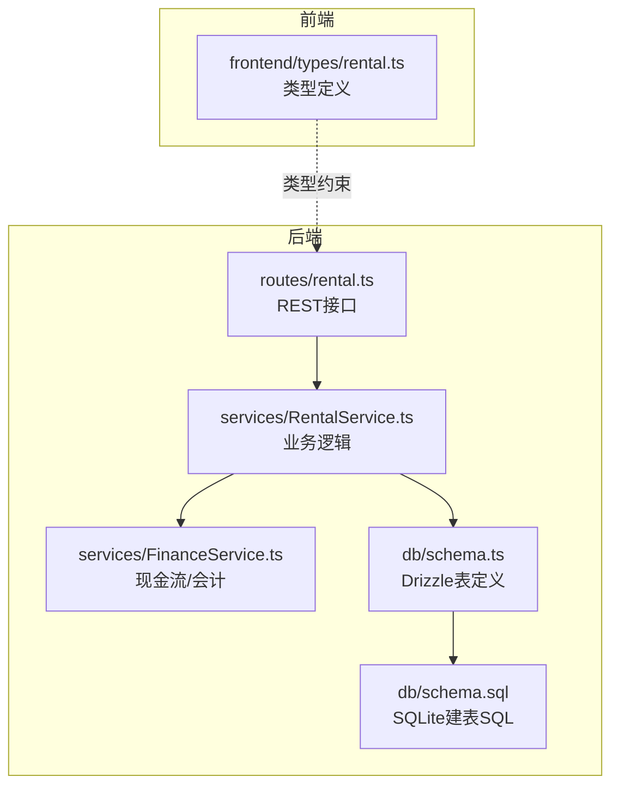
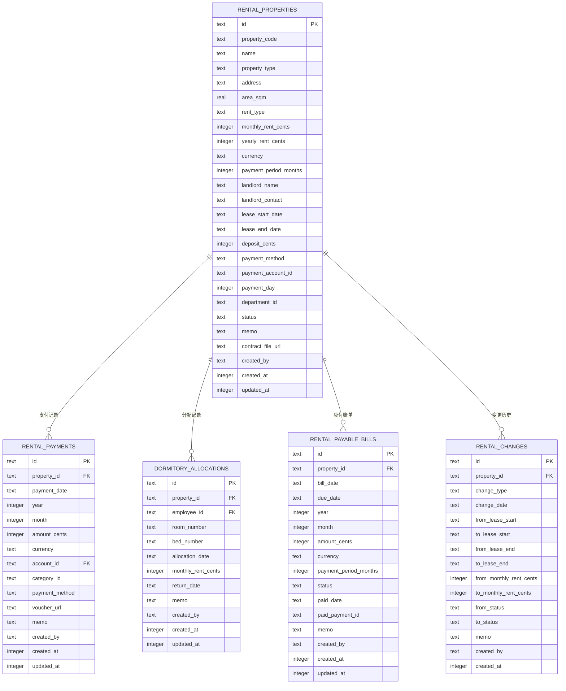
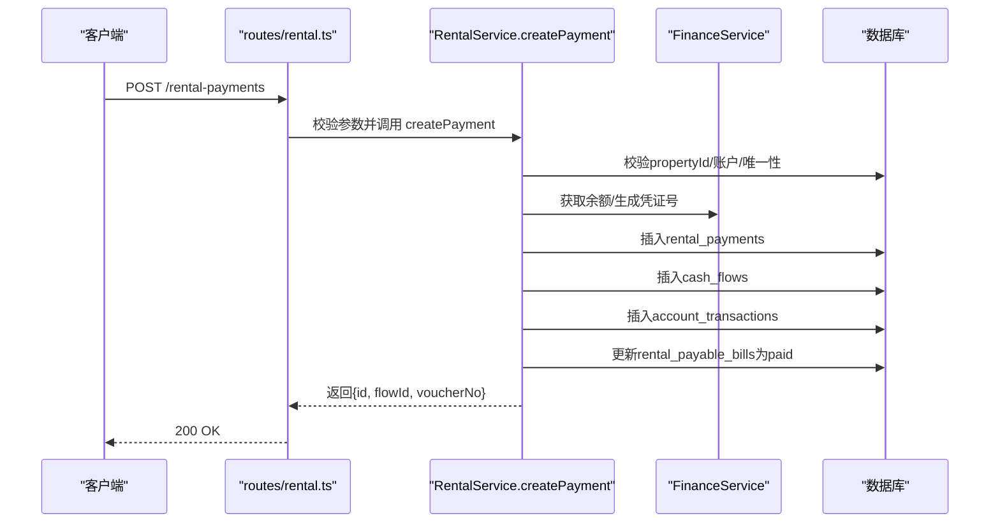
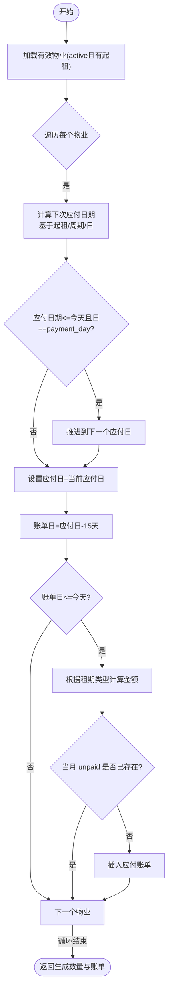
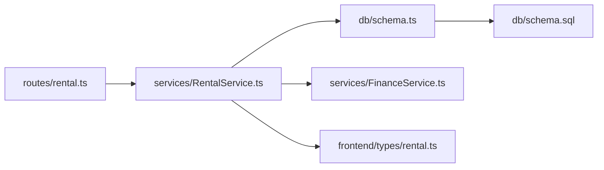

# 租赁物业数据模型

<cite>
**本文引用的文件**
- [schema.ts](file://backend/src/db/schema.ts)
- [schema.sql](file://backend/src/db/schema.sql)
- [routes/rental.ts](file://backend/src/routes/rental.ts)
- [services/RentalService.ts](file://backend/src/services/RentalService.ts)
- [schemas/business.schema.ts](file://backend/src/schemas/business.schema.ts)
- [schemas/common.schema.ts](file://backend/src/schemas/common.schema.ts)
- [FinanceService.ts](file://backend/src/services/FinanceService.ts)
- [frontend/types/rental.ts](file://frontend/src/types/rental.ts)
- [test/routes/rental.test.ts](file://backend/test/routes/rental.test.ts)
</cite>

## 目录
1. [简介](#简介)
2. [项目结构](#项目结构)
3. [核心组件](#核心组件)
4. [架构总览](#架构总览)
5. [详细组件分析](#详细组件分析)
6. [依赖分析](#依赖分析)
7. [性能考虑](#性能考虑)
8. [故障排查指南](#故障排查指南)
9. [结论](#结论)
10. [附录](#附录)

## 简介
本文件系统化梳理“租赁物业”数据模型，围绕 rental_properties 表及其关联表（rental_payments、dormitory_allocations、rental_payable_bills、rental_changes）进行深入解析。内容覆盖：
- 字段语义与约束（含币种、面积、租金类型、租期、房东信息、付款账户、部门归属、状态等）
- 物业生命周期（创建、信息维护、停用/删除）
- 与租金支付、宿舍分配、应付账单的关联关系
- 数据一致性、业务规则校验与性能优化建议
- 开发者实现指南与常见问题定位

## 项目结构
后端采用 Drizzle ORM + SQLite，通过 schema.ts 定义表结构，路由层在 routes/rental.ts 提供 REST 接口，服务层在 services/RentalService.ts 实现业务逻辑，并复用 FinanceService.ts 进行现金流与会计分录处理。

图表来源
- [routes/rental.ts](file://backend/src/routes/rental.ts#L1-L677)
- [services/RentalService.ts](file://backend/src/services/RentalService.ts#L1-L617)
- [services/FinanceService.ts](file://backend/src/services/FinanceService.ts#L1-L614)
- [db/schema.ts](file://backend/src/db/schema.ts#L534-L631)
- [db/schema.sql](file://backend/src/db/schema.sql#L529-L631)
- [frontend/types/rental.ts](file://frontend/src/types/rental.ts#L1-L143)

章节来源
- [routes/rental.ts](file://backend/src/routes/rental.ts#L1-L677)
- [services/RentalService.ts](file://backend/src/services/RentalService.ts#L1-L617)
- [db/schema.ts](file://backend/src/db/schema.ts#L534-L631)
- [db/schema.sql](file://backend/src/db/schema.sql#L529-L631)
- [frontend/types/rental.ts](file://frontend/src/types/rental.ts#L1-L143)

## 核心组件
- rental_properties：租赁物业主表，承载物业代码、名称、类型、地址、面积、租金类型、月/年租金、币种、租期、房东信息、付款账户、部门归属、状态、合同文件等。
- rental_payments：按月/年维度的租金支付记录，关联账户、分类、凭证等。
- dormitory_allocations：宿舍分配记录，支持房间号/床号、月租、分配/归还时间等。
- rental_payable_bills：应付账单，按月生成，自动关联到期日、金额、币种、周期等。
- rental_changes：物业变更历史，记录关键字段变更轨迹。

章节来源
- [db/schema.ts](file://backend/src/db/schema.ts#L534-L631)
- [db/schema.sql](file://backend/src/db/schema.sql#L529-L631)

## 架构总览
下图展示“租赁物业”模块的表结构与关键关联关系，以及创建/支付/生成账单/分配宿舍的典型流程。

图表来源
- [db/schema.ts](file://backend/src/db/schema.ts#L534-L631)

## 详细组件分析

### rental_properties 字段详解与业务规则
- 基本标识
  - property_code：唯一性约束，用于外部识别与审计追踪
  - name：物业名称
  - id：主键
- 类型与空间
  - property_type：枚举 office、dormitory、apartment、warehouse；前端类型定义包含 office、dormitory，后端建表包含更多类型
  - address、area_sqm：地址与面积
- 租金与币种
  - rent_type：monthly/yearly
  - monthly_rent_cents / yearly_rent_cents：金额以“分”存储
  - currency：3字母币种代码
  - payment_period_months：付款周期（月）
  - payment_day：每月付款日（默认1）
- 合同与租期
  - lease_start_date / lease_end_date：租期起止
  - deposit_cents：押金
  - contract_file_url：合同文件链接
- 付款与房东
  - payment_method：付款方式
  - payment_account_id：付款账户（外键至 accounts）
  - landlord_name / landlord_contact：房东信息
- 归属与状态
  - department_id：部门归属（仅 office 类型时强制非空）
  - status：active/inactive
  - memo：备注
- 审计
  - created_by、created_at、updated_at

业务规则要点
- office 类型必须绑定 department_id，否则写入时清空
- 年租/月租模式需满足对应金额字段存在且大于0（见业务 Schema 校验）
- 重复 property_code 拒绝创建
- 删除前需确保无租金支付记录

章节来源
- [db/schema.ts](file://backend/src/db/schema.ts#L534-L561)
- [db/schema.sql](file://backend/src/db/schema.sql#L529-L557)
- [schemas/business.schema.ts](file://backend/src/schemas/business.schema.ts#L80-L116)
- [services/RentalService.ts](file://backend/src/services/RentalService.ts#L122-L158)
- [services/RentalService.ts](file://backend/src/services/RentalService.ts#L190-L204)

### 租金支付流程（createRentalPayment）
- 输入校验
  - propertyId 存在性
  - 同一 propertyId+year+month 的支付记录唯一
  - accountId 存在且启用，且币种一致
- 事务处理
  - 写入 rental_payments
  - 使用 FinanceService 计算余额并生成 cash_flows 与 account_transactions
  - 自动将对应应付账单标记为 paid（若未过期）
- 输出
  - 返回 paymentId、flowId、voucherNo

图表来源
- [routes/rental.ts](file://backend/src/routes/rental.ts#L436-L491)
- [services/RentalService.ts](file://backend/src/services/RentalService.ts#L238-L350)
- [services/FinanceService.ts](file://backend/src/services/FinanceService.ts#L28-L69)

章节来源
- [routes/rental.ts](file://backend/src/routes/rental.ts#L436-L491)
- [services/RentalService.ts](file://backend/src/services/RentalService.ts#L238-L350)
- [services/FinanceService.ts](file://backend/src/services/FinanceService.ts#L28-L69)

### 应付账单生成（generatePayableBills）
- 触发条件
  - 状态为 active 且 lease_start_date 存在
- 生成策略
  - 基于 lease_start_date、lease_end_date、payment_period_months、payment_day 计算下一次应付日期
  - bill_date = due_date - 15 天
  - amountCents 根据 rent_type/yearly/monthly 与 payment_period_months 计算
  - 若当月 unpaid 账单已存在则跳过
- 输出
  - 返回生成数量与账单列表

图表来源
- [services/RentalService.ts](file://backend/src/services/RentalService.ts#L490-L575)

章节来源
- [services/RentalService.ts](file://backend/src/services/RentalService.ts#L490-L575)

### 宿舍分配与归还（allocateDormitory / returnDormitory）
- allocateDormitory
  - 校验 property_type=dormitory
  - 校验员工存在且启用
  - 同一员工对同一宿舍不可重复分配（未归还）
  - 支持 room_number、bed_number、monthly_rent_cents、memo
- returnDormitory
  - 校验分配记录存在且未归还
  - 设置 return_date 与 memo

章节来源
- [services/RentalService.ts](file://backend/src/services/RentalService.ts#L431-L486)
- [routes/rental.ts](file://backend/src/routes/rental.ts#L109-L201)

### 物业生命周期管理
- 创建
  - 校验 property_code 唯一
  - office 类型强制 department_id
  - 默认 status=active，payment_day 默认1
- 更新
  - 关键字段变更（status、月租、年租、租期、类型）自动记录 rental_changes
- 删除
  - 若存在租金支付记录则拒绝删除
  - 事务内级联清理 rental_changes、dormitory_allocations、rental_properties

章节来源
- [services/RentalService.ts](file://backend/src/services/RentalService.ts#L122-L204)
- [routes/rental.ts](file://backend/src/routes/rental.ts#L229-L388)

### 接口与类型约束
- 路由层
  - /rental-properties：列表、详情、创建、更新、删除
  - /rental-payments：列表、创建、更新、删除
  - /rental-properties/allocations：列表、分配、归还
  - /rental-properties/generate-payable-bills：生成应付账单
  - /rental-payable-bills：列表、标记已付
- 业务 Schema
  - createRentalPropertySchema：属性类型、币种长度、月/年租互斥校验
  - createRentalPaymentSchema/updateRentalPaymentSchema：金额正数、日期格式、币种长度
  - allocateDormitorySchema：分配日期、可空字段
- 通用 Schema
  - rentalPropertyQuerySchema、rentalPayableBillQuerySchema：查询过滤

章节来源
- [routes/rental.ts](file://backend/src/routes/rental.ts#L1-L677)
- [schemas/business.schema.ts](file://backend/src/schemas/business.schema.ts#L80-L116)
- [schemas/business.schema.ts](file://backend/src/schemas/business.schema.ts#L580-L603)
- [schemas/business.schema.ts](file://backend/src/schemas/business.schema.ts#L605-L616)
- [schemas/common.schema.ts](file://backend/src/schemas/common.schema.ts#L114-L121)
- [schemas/common.schema.ts](file://backend/src/schemas/common.schema.ts#L221-L230)

## 依赖分析
- 路由层依赖服务层，服务层依赖 Drizzle ORM 与 FinanceService
- rental_payments 与 accounts、categories、cash_flows、account_transactions 强耦合
- dormitory_allocations 与 employees、departments 间接关联（通过员工表）
- rental_payable_bills 与 rental_properties 强关联，用于账单生成与核销

图表来源
- [routes/rental.ts](file://backend/src/routes/rental.ts#L1-L677)
- [services/RentalService.ts](file://backend/src/services/RentalService.ts#L1-L617)
- [services/FinanceService.ts](file://backend/src/services/FinanceService.ts#L1-L614)
- [db/schema.ts](file://backend/src/db/schema.ts#L534-L631)
- [db/schema.sql](file://backend/src/db/schema.sql#L529-L631)
- [frontend/types/rental.ts](file://frontend/src/types/rental.ts#L1-L143)

## 性能考虑
- 查询优化
  - rental_properties 列表按 createdAt 降序，建议在 status、property_type、departmentId 上建立索引以加速筛选
  - rental_payments 按 propertyId/year/month 排序，建议在 propertyId、year、month 上建立复合索引
  - dormitory_allocations 按 propertyId、employeeId、allocation_date 排序，建议相应索引
- 事务与并发
  - createPayment 使用事务保证支付记录、现金流与会计分录的一致性
  - generatePayableBills 逐条物业循环生成，建议批量处理或分批执行，避免长时间锁表
- 余额计算
  - FinanceService.getBalanceBefore 通过时间窗口查找最近交易，建议在 accountTransactions 上按 accountId、transactionDate、createdAt 建立索引
- 前端类型
  - 前端类型定义与后端字段保持一致，减少跨层转换错误

[本节为通用指导，无需列出具体文件来源]

## 故障排查指南
- 创建物业报错“重复物业代码”
  - 检查 property_code 是否唯一
  - 参考：[services/RentalService.ts](file://backend/src/services/RentalService.ts#L122-L124)
- 更新物业时报“无法删除，该物业还有付款记录”
  - 删除前先清理所有租金支付记录
  - 参考：[services/RentalService.ts](file://backend/src/services/RentalService.ts#L194-L196)
- 创建支付报错“账户已停用/币种不匹配”
  - 确认账户存在且 active=1，且 currency 与 payment 一致
  - 参考：[services/RentalService.ts](file://backend/src/services/RentalService.ts#L262-L266)
- 创建支付报错“该月的付款记录”
  - 同一 propertyId+year+month 仅允许一条支付记录
  - 参考：[services/RentalService.ts](file://backend/src/services/RentalService.ts#L255-L261)
- 分配宿舍报错“员工已分配到该宿舍”
  - 同一宿舍同一员工仅允许一条未归还分配
  - 参考：[services/RentalService.ts](file://backend/src/services/RentalService.ts#L449-L455)
- 归还宿舍报错“已归还”
  - 已归还的分配不允许再次归还
  - 参考：[services/RentalService.ts](file://backend/src/services/RentalService.ts#L479-L480)
- 生成应付账单无结果
  - 确认物业 status=active 且 lease_start_date 存在
  - 参考：[services/RentalService.ts](file://backend/src/services/RentalService.ts#L495-L498)

章节来源
- [services/RentalService.ts](file://backend/src/services/RentalService.ts#L122-L204)
- [services/RentalService.ts](file://backend/src/services/RentalService.ts#L238-L350)
- [services/RentalService.ts](file://backend/src/services/RentalService.ts#L431-L486)
- [services/RentalService.ts](file://backend/src/services/RentalService.ts#L490-L575)

## 结论
本数据模型围绕 rental_properties 构建，通过清晰的字段语义与严格的业务校验，支撑了从创建、维护到停用的全生命周期管理。配合应付账单自动生成、支付事务一致性与宿舍分配控制，实现了租赁管理的核心闭环。建议在生产环境完善索引、优化批量任务与监控异常，确保高并发下的稳定性与可维护性。

[本节为总结性内容，无需列出具体文件来源]

## 附录
- 前端类型定义与后端字段映射
  - 前端类型定义与后端字段基本一致，便于前后端协作与类型安全
  - 参考：[frontend/types/rental.ts](file://frontend/src/types/rental.ts#L1-L143)
- 测试用例参考
  - 路由层测试覆盖了主要 CRUD 与业务流程，可作为集成测试的参考
  - 参考：[test/routes/rental.test.ts](file://backend/test/routes/rental.test.ts#L1-L267)