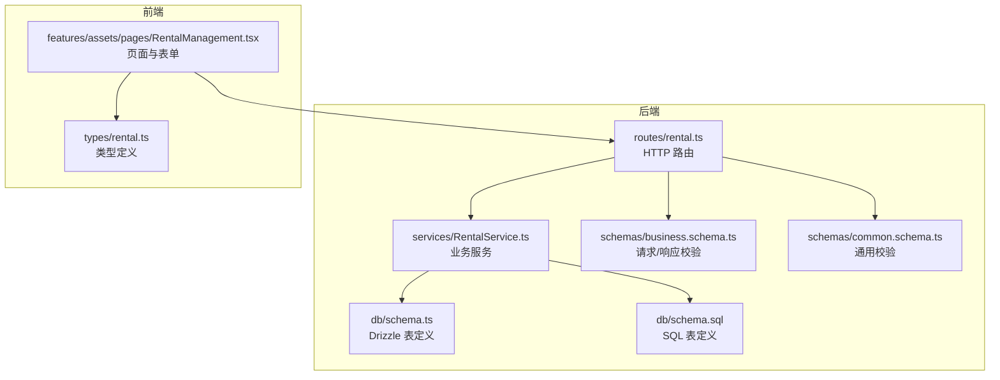
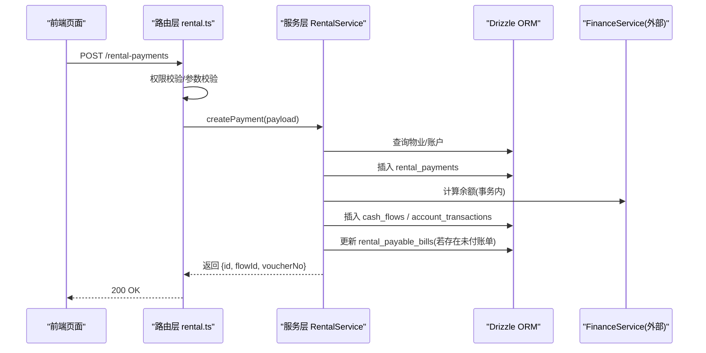
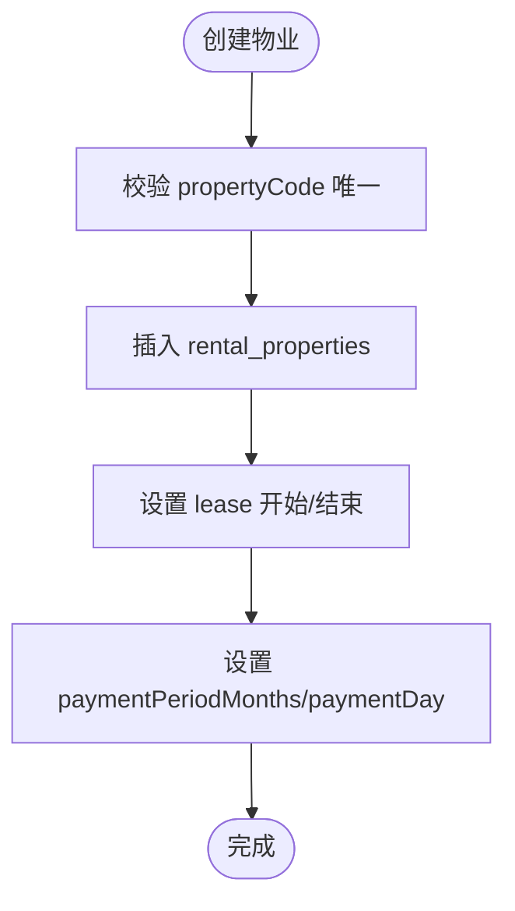
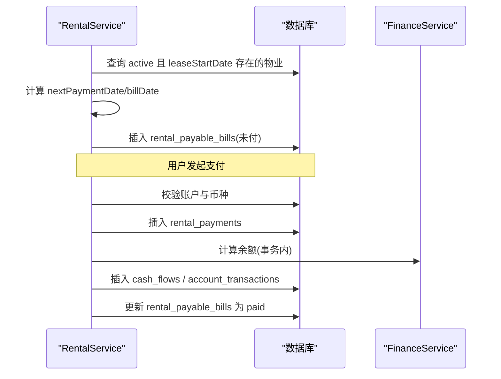
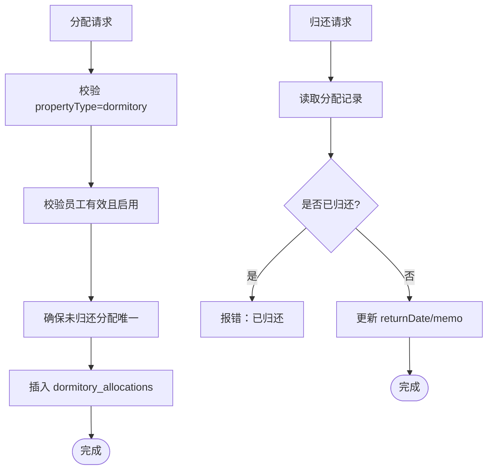
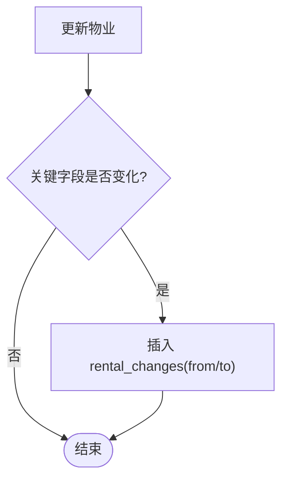
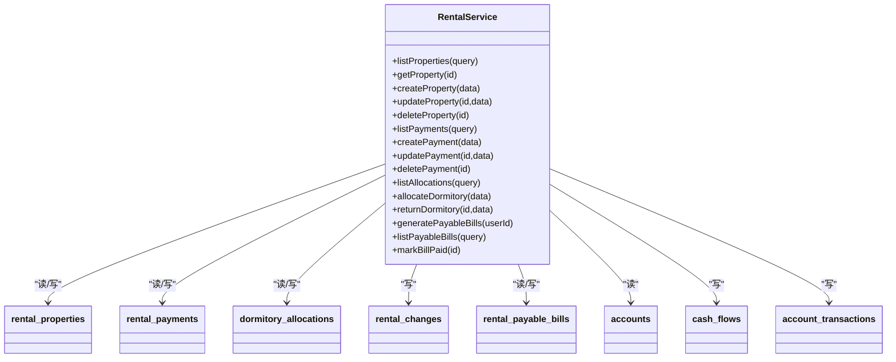
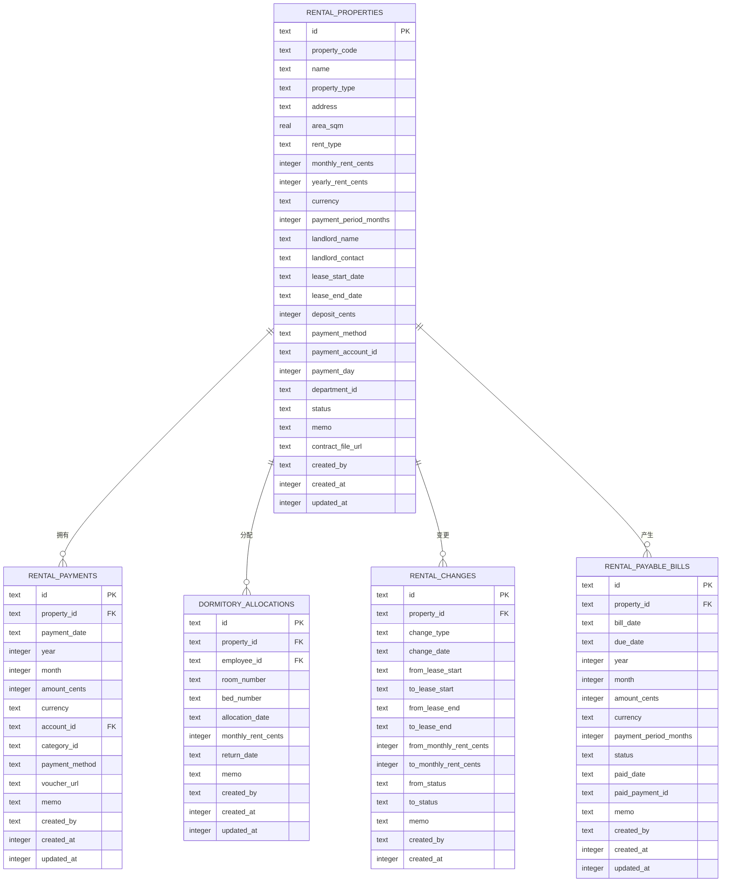

# 租赁管理数据模型

<cite>
**本文引用的文件**
- [schema.ts](file://backend/src/db/schema.ts)
- [schema.sql](file://backend/src/db/schema.sql)
- [RentalService.ts](file://backend/src/services/RentalService.ts)
- [rental.ts](file://backend/src/routes/rental.ts)
- [business.schema.ts](file://backend/src/schemas/business.schema.ts)
- [common.schema.ts](file://backend/src/schemas/common.schema.ts)
- [rental.ts（前端类型）](file://frontend/src/types/rental.ts)
- [RentalManagement.tsx（前端页面）](file://frontend/src/features/assets/pages/RentalManagement.tsx)
- [rental.test.ts（测试）](file://backend/test/routes/rental.test.ts)
</cite>

## 目录
1. [引言](#引言)
2. [项目结构](#项目结构)
3. [核心组件](#核心组件)
4. [架构总览](#架构总览)
5. [详细组件分析](#详细组件分析)
6. [依赖关系分析](#依赖关系分析)
7. [性能考量](#性能考量)
8. [故障排查指南](#故障排查指南)
9. [结论](#结论)
10. [附录](#附录)

## 引言
本文件面向租赁模块开发者，系统性解析“租赁管理”数据模型，覆盖以下关键表与业务流程：
- rental_properties（租赁物业）
- rental_payments（租金支付）
- dormitory_allocations（宿舍分配）
- rental_changes（物业变更历史）
- rental_payable_bills（应付账单）

文档将阐明：
- 物业从创建、合同管理、租金支付到终止的完整生命周期
- rental_changes 如何记录每次变更
- 宿舍分配与租金支付的关联机制
- 数据一致性与完整性保障策略

## 项目结构
后端采用 Drizzle ORM + D1 的 SQLite 数据层，服务层封装业务逻辑，路由层负责接口与权限校验，前端通过 Ant Design 表单驱动数据提交与展示。

图表来源
- [rental.ts](file://backend/src/routes/rental.ts#L1-L677)
- [RentalService.ts](file://backend/src/services/RentalService.ts#L1-L617)
- [schema.ts](file://backend/src/db/schema.ts#L534-L631)
- [schema.sql](file://backend/src/db/schema.sql#L529-L631)
- [business.schema.ts](file://backend/src/schemas/business.schema.ts#L79-L116)
- [common.schema.ts](file://backend/src/schemas/common.schema.ts#L114-L121)
- [RentalManagement.tsx](file://frontend/src/features/assets/pages/RentalManagement.tsx#L1-L800)
- [rental.ts（前端类型）](file://frontend/src/types/rental.ts#L1-L143)

章节来源
- [rental.ts](file://backend/src/routes/rental.ts#L1-L677)
- [RentalService.ts](file://backend/src/services/RentalService.ts#L1-L617)
- [schema.ts](file://backend/src/db/schema.ts#L534-L631)
- [schema.sql](file://backend/src/db/schema.sql#L529-L631)
- [business.schema.ts](file://backend/src/schemas/business.schema.ts#L79-L116)
- [common.schema.ts](file://backend/src/schemas/common.schema.ts#L114-L121)
- [RentalManagement.tsx](file://frontend/src/features/assets/pages/RentalManagement.tsx#L1-L800)
- [rental.ts（前端类型）](file://frontend/src/types/rental.ts#L1-L143)

## 核心组件
- rental_properties：记录物业基本信息、合同信息、计费参数与状态
- rental_payments：记录每次租金支付的流水与凭证
- dormitory_allocations：记录员工宿舍分配与归还
- rental_changes：记录对物业的关键字段变更历史
- rental_payable_bills：记录应付账单（自动生成与手动标记已付）

章节来源
- [schema.ts](file://backend/src/db/schema.ts#L534-L631)
- [schema.sql](file://backend/src/db/schema.sql#L529-L631)
- [RentalService.ts](file://backend/src/services/RentalService.ts#L1-L617)

## 架构总览
后端采用“路由 -> 服务 -> 数据库”的分层设计。路由层负责鉴权、权限校验与请求校验；服务层实现业务规则与事务；数据库层通过 Drizzle ORM 与 SQLite 存储。

图表来源
- [rental.ts](file://backend/src/routes/rental.ts#L436-L491)
- [RentalService.ts](file://backend/src/services/RentalService.ts#L238-L350)

章节来源
- [rental.ts](file://backend/src/routes/rental.ts#L436-L491)
- [RentalService.ts](file://backend/src/services/RentalService.ts#L238-L350)

## 详细组件分析

### 表结构与字段语义
- rental_properties（租赁物业）
  - 关键字段：propertyCode、name、propertyType、address、areaSq、rentType、monthlyRentCents、yearlyRentCents、currency、paymentPeriodMonths、landlordName、landlordContact、leaseStartDate、leaseEndDate、depositCents、paymentMethod、paymentAccountId、paymentDay、departmentId、status、memo、contractFileUrl、createdBy、createdAt、updatedAt
  - 业务要点：
    - 月租/年租二选一，对应字段非负
    - office 类型绑定 departmentId，dormitory 类型用于宿舍分配
    - paymentDay 控制账单生成与付款日期
    - status 控制是否参与账单生成与查询

- rental_payments（租金支付）
  - 关键字段：propertyId、paymentDate、year、month、amountCents、currency、accountId、categoryId、paymentMethod、voucherUrl、memo、createdBy、createdAt、updatedAt
  - 业务要点：
    - 按 propertyId+year+month 去重
    - 与 cash_flows、account_transactions、rental_payable_bills 关联

- dormitory_allocations（宿舍分配）
  - 关键字段：propertyId、employeeId、roomNumber、bedNumber、allocationDate、monthlyRentCents、returnDate、memo、createdBy、createdAt、updatedAt
  - 业务要点：
    - 同一员工在同一物业的未归还分配记录唯一
    - dormitory 类型物业才允许分配

- rental_changes（物业变更历史）
  - 关键字段：propertyId、changeType、changeDate、fromLeaseStart、toLeaseStart、fromLeaseEnd、toLeaseEnd、fromMonthlyRentCents、toMonthlyRentCents、fromStatus、toStatus、memo、createdBy、createdAt
  - 业务要点：
    - 当 status、monthlyRentCents、yearlyRentCents、rentType、leaseStartDate、leaseEndDate 发生变化时记录

- rental_payable_bills（应付账单）
  - 关键字段：propertyId、billDate、dueDate、year、month、amountCents、currency、paymentPeriodMonths、status、paidDate、paidPaymentId、memo、createdBy、createdAt、updatedAt
  - 业务要点：
    - 自动生成：基于 leaseStartDate/End、paymentPeriodMonths、paymentDay
    - 标记已付：createPayment 时自动更新

章节来源
- [schema.ts](file://backend/src/db/schema.ts#L534-L631)
- [schema.sql](file://backend/src/db/schema.sql#L529-L631)
- [RentalService.ts](file://backend/src/services/RentalService.ts#L159-L204)
- [RentalService.ts](file://backend/src/services/RentalService.ts#L238-L350)
- [RentalService.ts](file://backend/src/services/RentalService.ts#L488-L616)

### 生命周期与业务流程

#### 物业创建与合同管理
- 创建流程
  - 路由层校验 createRentalPropertySchema
  - 服务层检查 propertyCode 唯一性
  - 写入 rental_properties，并设置 createdAt/updatedAt
- 合同与计费
  - leaseStartDate/leaseEndDate 决定账单生成窗口
  - paymentPeriodMonths 与 paymentDay 决定账单周期与到期日
  - currency 与 paymentAccountId 决定支付币种与账户

图表来源
- [RentalService.ts](file://backend/src/services/RentalService.ts#L122-L158)
- [business.schema.ts](file://backend/src/schemas/business.schema.ts#L79-L116)

章节来源
- [RentalService.ts](file://backend/src/services/RentalService.ts#L122-L158)
- [business.schema.ts](file://backend/src/schemas/business.schema.ts#L79-L116)

#### 应付账单生成与支付
- 账单生成
  - 服务层遍历 active 且 leaseStartDate 存在的物业
  - 基于 leaseStart/End、paymentPeriodMonths、paymentDay 推导下一次账单日期
  - 若未过账单生成日期且未生成过未付账单，则插入 rental_payable_bills
- 支付流程
  - 路由层校验 createRentalPaymentSchema
  - 服务层校验账户有效性与币种匹配
  - 事务内写入 rental_payments、cash_flows、account_transactions
  - 自动更新对应 rental_payable_bills 为 paid

图表来源
- [RentalService.ts](file://backend/src/services/RentalService.ts#L490-L575)
- [RentalService.ts](file://backend/src/services/RentalService.ts#L238-L350)

章节来源
- [RentalService.ts](file://backend/src/services/RentalService.ts#L490-L575)
- [RentalService.ts](file://backend/src/services/RentalService.ts#L238-L350)

#### 宿舍分配与归还
- 分配
  - 校验 propertyType=dormitory
  - 校验员工有效且启用
  - 同一员工同一物业未归还分配唯一
- 归还
  - 校验分配记录存在且未归还
  - 设置 returnDate 与 memo

图表来源
- [RentalService.ts](file://backend/src/services/RentalService.ts#L431-L486)

章节来源
- [RentalService.ts](file://backend/src/services/RentalService.ts#L431-L486)

#### 物业变更历史（rental_changes）
- 触发条件
  - status、monthlyRentCents、yearlyRentCents、rentType、leaseStartDate、leaseEndDate 任一发生变化
- 记录内容
  - from/to 字段对比，memo 保留说明

图表来源
- [RentalService.ts](file://backend/src/services/RentalService.ts#L160-L188)

章节来源
- [RentalService.ts](file://backend/src/services/RentalService.ts#L160-L188)

### 接口与权限
- 路由层统一进行权限校验与参数校验
- 常用接口
  - GET /rental-properties、GET /rental-properties/{id}
  - POST/PUT/DELETE /rental-properties
  - POST /rental-properties/{id}/allocate-dormitory
  - POST /rental-properties/allocations/{id}/return
  - GET /rental-payments、POST /rental-payments、PUT/DELETE /rental-payments
  - POST /rental-properties/generate-payable-bills、GET /rental-payable-bills、POST /rental-payable-bills/:id/mark-paid

章节来源
- [rental.ts](file://backend/src/routes/rental.ts#L1-L677)
- [business.schema.ts](file://backend/src/schemas/business.schema.ts#L579-L603)
- [business.schema.ts](file://backend/src/schemas/business.schema.ts#L605-L616)
- [common.schema.ts](file://backend/src/schemas/common.schema.ts#L114-L121)

### 前端交互与类型
- 前端页面支持：
  - 新建/编辑/查看详情
  - 记录付款、分配宿舍、批量生成账单
  - 合同与凭证上传
- 类型定义涵盖：
  - 租赁物业、宿舍分配、应付账单、变更记录等

章节来源
- [RentalManagement.tsx](file://frontend/src/features/assets/pages/RentalManagement.tsx#L1-L800)
- [rental.ts（前端类型）](file://frontend/src/types/rental.ts#L1-L143)

## 依赖关系分析

图表来源
- [RentalService.ts](file://backend/src/services/RentalService.ts#L1-L617)
- [schema.ts](file://backend/src/db/schema.ts#L534-L631)

章节来源
- [RentalService.ts](file://backend/src/services/RentalService.ts#L1-L617)
- [schema.ts](file://backend/src/db/schema.ts#L534-L631)

## 性能考量
- 查询优化
  - 对 rental_properties、rental_payments、dormitory_allocations、rental_payable_bills 建议按常用过滤字段建立索引（如 propertyId、year/month、employeeId、status、dueDate 等）
- 事务边界
  - createPayment 使用事务保证 rental_payments、cash_flows、account_transactions 一致性
- 批量生成账单
  - generatePayableBills 采用循环逐条生成，建议在高并发场景考虑分批或异步队列

[本节为通用指导，无需特定文件引用]

## 故障排查指南
- 常见错误与定位
  - 重复记录：创建付款时按 propertyId+year+month 去重，避免重复
  - 账户校验：创建付款前校验账户存在、启用、币种匹配
  - 删除保护：删除物业前检查是否存在付款记录
  - 分配冲突：同一员工同一物业未归还分配唯一
- 日志与审计
  - 路由层统一记录审计日志，便于追踪操作
- 测试参考
  - 后端测试覆盖了主要路由行为，可作为回归测试依据

章节来源
- [RentalService.ts](file://backend/src/services/RentalService.ts#L190-L204)
- [RentalService.ts](file://backend/src/services/RentalService.ts#L252-L266)
- [RentalService.ts](file://backend/src/services/RentalService.ts#L431-L486)
- [rental.test.ts](file://backend/test/routes/rental.test.ts#L1-L267)

## 结论
本数据模型围绕“物业—支付—分配—变更—账单”闭环构建，通过严格的参数校验、事务保证与审计日志，确保业务一致性与可追溯性。开发与运维应重点关注：
- 账单生成算法与边界条件
- 事务内的跨表一致性
- 前后端字段映射与类型约束
- 权限与审计的落地执行

[本节为总结，无需特定文件引用]

## 附录

### 数据模型 ER 图

图表来源
- [schema.ts](file://backend/src/db/schema.ts#L534-L631)