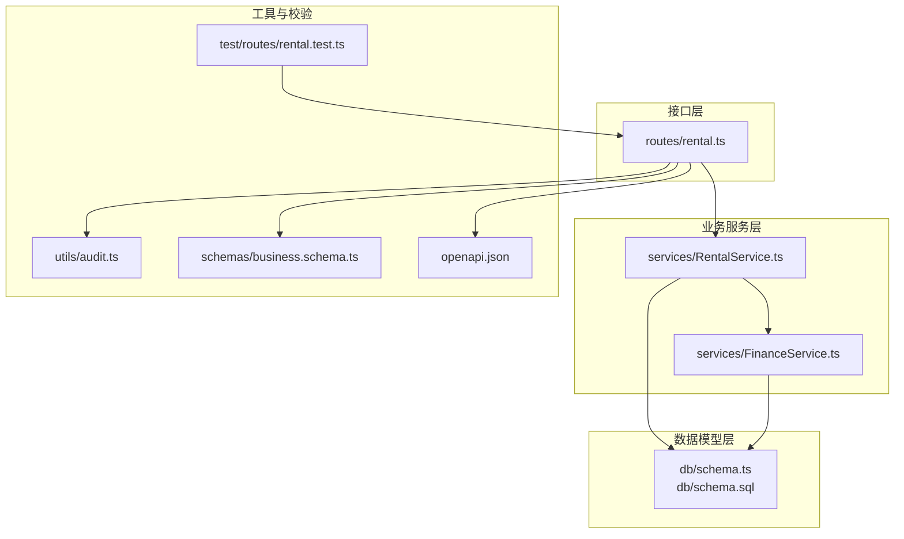
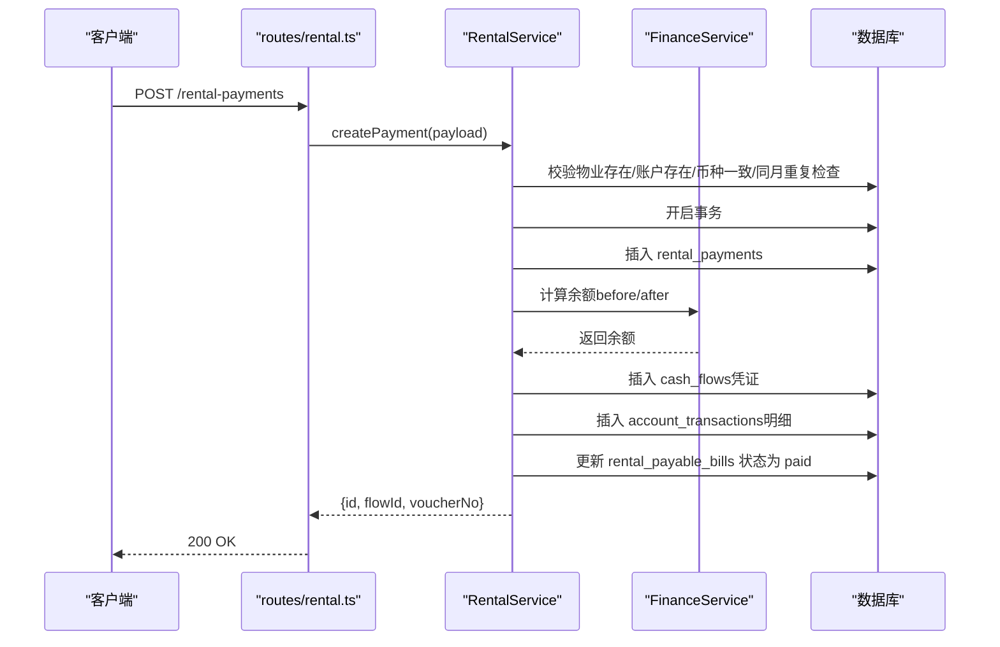
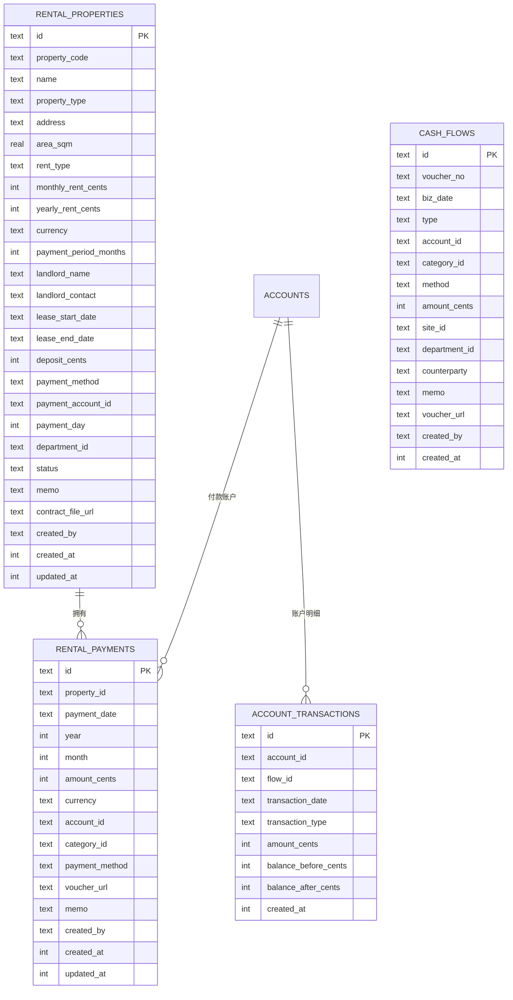
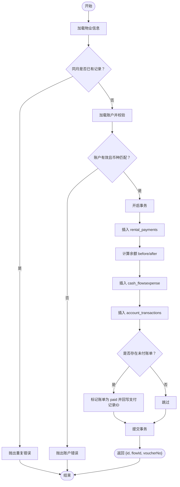
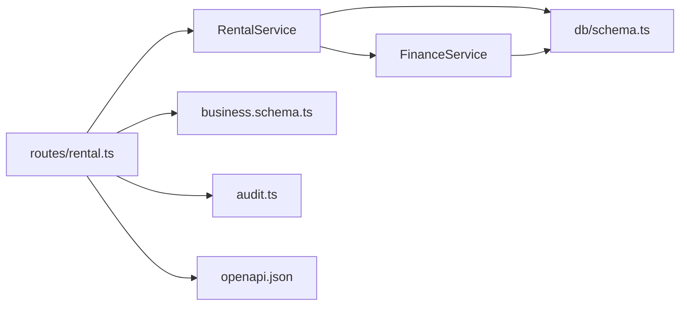

# 租金支付数据模型

<cite>
**本文引用的文件**
- [backend/src/db/schema.ts](file://backend/src/db/schema.ts)
- [backend/src/db/schema.sql](file://backend/src/db/schema.sql)
- [backend/src/services/RentalService.ts](file://backend/src/services/RentalService.ts)
- [backend/src/routes/rental.ts](file://backend/src/routes/rental.ts)
- [backend/src/services/FinanceService.ts](file://backend/src/services/FinanceService.ts)
- [backend/src/utils/audit.ts](file://backend/src/utils/audit.ts)
- [backend/src/schemas/business.schema.ts](file://backend/src/schemas/business.schema.ts)
- [backend/openapi.json](file://backend/openapi.json)
- [backend/test/routes/rental.test.ts](file://backend/test/routes/rental.test.ts)
</cite>

## 目录
1. [简介](#简介)
2. [项目结构](#项目结构)
3. [核心组件](#核心组件)
4. [架构总览](#架构总览)
5. [详细组件分析](#详细组件分析)
6. [依赖关系分析](#依赖关系分析)
7. [性能考量](#性能考量)
8. [故障排查指南](#故障排查指南)
9. [结论](#结论)
10. [附录](#附录)

## 简介
本文件面向开发者，系统化梳理“租金支付”数据模型与业务流程，覆盖以下要点：
- 租金支付表 rental_payments 的字段语义与约束
- 与租赁物业（rental_properties）、财务流水（cash_flows）、账户交易（account_transactions）的关联机制
- 支付记录创建时的事务处理流程，确保财务数据一致性
- 支付记录的查询、对账与审计能力实现细节

## 项目结构
围绕“租金支付”的相关文件组织如下：
- 数据模型层：数据库表定义（schema.ts/schema.sql）
- 业务服务层：RentalService 提供创建/查询/更新/删除等核心逻辑
- 财务支撑层：FinanceService 提供凭证号生成、余额计算等
- 接口路由层：routes/rental.ts 定义对外 API
- 校验与审计：business.schema.ts 定义输入校验；audit.ts 记录审计日志
- 文档与测试：openapi.json 描述接口；rental.test.ts 验证行为

图表来源
- [backend/src/routes/rental.ts](file://backend/src/routes/rental.ts#L1-L677)
- [backend/src/services/RentalService.ts](file://backend/src/services/RentalService.ts#L1-L617)
- [backend/src/services/FinanceService.ts](file://backend/src/services/FinanceService.ts#L1-L614)
- [backend/src/db/schema.ts](file://backend/src/db/schema.ts#L534-L631)
- [backend/src/db/schema.sql](file://backend/src/db/schema.sql#L529-L631)
- [backend/src/utils/audit.ts](file://backend/src/utils/audit.ts#L1-L92)
- [backend/src/schemas/business.schema.ts](file://backend/src/schemas/business.schema.ts#L579-L604)
- [backend/openapi.json](file://backend/openapi.json#L12059-L12106)
- [backend/test/routes/rental.test.ts](file://backend/test/routes/rental.test.ts#L199-L241)

章节来源
- [backend/src/routes/rental.ts](file://backend/src/routes/rental.ts#L1-L677)
- [backend/src/services/RentalService.ts](file://backend/src/services/RentalService.ts#L1-L617)
- [backend/src/db/schema.ts](file://backend/src/db/schema.ts#L534-L631)
- [backend/src/db/schema.sql](file://backend/src/db/schema.sql#L529-L631)

## 核心组件
- 数据表
  - rental_payments：存储每期租金支付记录
  - rental_properties：存储租赁物业基础信息
  - cash_flows：财务流水（凭证载体）
  - account_transactions：账户交易明细（余额链路）
- 服务类
  - RentalService：负责租金支付的创建、查询、更新、删除，并在创建时联动生成财务流水与账户交易
  - FinanceService：提供凭证号生成、账户余额计算等财务支撑能力
- 路由与校验
  - routes/rental.ts：定义创建/查询/更新/删除等 API
  - business.schema.ts：定义 createRentalPaymentSchema、updateRentalPaymentSchema 等输入校验
  - openapi.json：对外接口契约描述
  - audit.ts：统一审计日志记录

章节来源
- [backend/src/db/schema.ts](file://backend/src/db/schema.ts#L534-L631)
- [backend/src/services/RentalService.ts](file://backend/src/services/RentalService.ts#L238-L350)
- [backend/src/services/FinanceService.ts](file://backend/src/services/FinanceService.ts#L28-L69)
- [backend/src/routes/rental.ts](file://backend/src/routes/rental.ts#L436-L568)
- [backend/src/schemas/business.schema.ts](file://backend/src/schemas/business.schema.ts#L579-L604)
- [backend/openapi.json](file://backend/openapi.json#L12059-L12106)
- [backend/src/utils/audit.ts](file://backend/src/utils/audit.ts#L61-L92)

## 架构总览
下图展示“创建租金支付”的端到端流程，包括路由、服务、财务支撑与数据模型之间的交互。

图表来源
- [backend/src/routes/rental.ts](file://backend/src/routes/rental.ts#L436-L491)
- [backend/src/services/RentalService.ts](file://backend/src/services/RentalService.ts#L238-L350)
- [backend/src/services/FinanceService.ts](file://backend/src/services/FinanceService.ts#L28-L69)
- [backend/src/db/schema.ts](file://backend/src/db/schema.ts#L165-L200)

章节来源
- [backend/src/routes/rental.ts](file://backend/src/routes/rental.ts#L436-L491)
- [backend/src/services/RentalService.ts](file://backend/src/services/RentalService.ts#L238-L350)
- [backend/src/services/FinanceService.ts](file://backend/src/services/FinanceService.ts#L28-L69)

## 详细组件分析

### 数据模型：rental_payments 字段详解
- 字段与含义
  - id：支付记录唯一标识
  - property_id：关联的租赁物业
  - payment_date：支付日期（YYYY-MM-DD）
  - year/month：所属会计年度与月份
  - amount_cents：金额（分）
  - currency：币种（ISO 代码）
  - account_id：付款账户
  - category_id：费用类别（可空）
  - payment_method：付款方式（可空）
  - voucher_url：凭证文件链接（可空）
  - memo：备注（可空）
  - created_by/created_at/updated_at：审计字段
- 关键约束
  - 同一 property_id + year + month 的组合在业务上不允许重复（见服务层校验）
  - 与 accounts 的币种需一致（见服务层校验）

章节来源
- [backend/src/db/schema.ts](file://backend/src/db/schema.ts#L563-L579)
- [backend/src/db/schema.sql](file://backend/src/db/schema.sql#L560-L576)
- [backend/src/services/RentalService.ts](file://backend/src/services/RentalService.ts#L252-L266)

### 关联关系与数据流
- 与 rental_properties
  - 通过 property_id 外键关联，用于获取部门、房东名称等上下文信息
- 与 cash_flows
  - 创建支付时插入一条 expense 类型的流水，形成凭证
  - 流水 biz_date 对应 payment_date，memo 包含物业名称与备注
- 与 account_transactions
  - 为账户生成一条明细，记录余额 before/after，保证余额链路完整
- 与 rental_payable_bills
  - 当支付发生时，若存在未付的对应账单，则将其状态更新为 paid，并回写 paid_date/paid_payment_id

图表来源
- [backend/src/db/schema.ts](file://backend/src/db/schema.ts#L165-L200)
- [backend/src/db/schema.ts](file://backend/src/db/schema.ts#L534-L631)

章节来源
- [backend/src/db/schema.ts](file://backend/src/db/schema.ts#L165-L200)
- [backend/src/db/schema.ts](file://backend/src/db/schema.ts#L534-L631)

### 事务处理流程（创建支付）
- 业务前置校验
  - 物业存在性校验
  - 同年同月重复校验
  - 账户存在、启用、币种一致
- 事务内执行
  - 插入 rental_payments
  - 生成凭证号（基于 biz_date 的当日计数）
  - 计算余额 before/after（调用 FinanceService）
  - 插入 cash_flows（expense）
  - 插入 account_transactions
  - 更新 rental_payable_bills（若存在未付账单）
- 返回结果
  - 返回支付记录 id、财务流水 id、凭证号

图表来源
- [backend/src/services/RentalService.ts](file://backend/src/services/RentalService.ts#L238-L350)
- [backend/src/services/FinanceService.ts](file://backend/src/services/FinanceService.ts#L28-L69)

章节来源
- [backend/src/services/RentalService.ts](file://backend/src/services/RentalService.ts#L238-L350)
- [backend/src/services/FinanceService.ts](file://backend/src/services/FinanceService.ts#L28-L69)

### 查询与对账能力
- 查询
  - 支持按 property_id/year/month 过滤
  - 联合查询物业、账户、类别、创建人等上下文信息
- 对账
  - 通过 account_transactions 的余额 before/after 与 cash_flows 的金额方向保持一致，确保逐笔可追溯
  - 余额计算依据“交易日期 < 指定日期 或 (交易日期=指定日期 且 创建时间<指定时间)”的最后一条交易余额
- 审计
  - 路由层在创建/更新/删除后统一记录审计日志（包含 actor、action、entity、entity_id、detail、IP、IP位置）

章节来源
- [backend/src/services/RentalService.ts](file://backend/src/services/RentalService.ts#L208-L236)
- [backend/src/services/FinanceService.ts](file://backend/src/services/FinanceService.ts#L41-L69)
- [backend/src/utils/audit.ts](file://backend/src/utils/audit.ts#L61-L92)

### API 与输入校验
- 创建支付接口
  - 请求体包含 propertyId、paymentDate、year、month、amountCents、currency、accountId 等字段
  - 响应包含 id、flowId、voucherNo
- 输入校验
  - createRentalPaymentSchema：字段类型、长度、枚举、正数等约束
- OpenAPI 描述
  - 在 openapi.json 中定义了请求体与响应体结构

章节来源
- [backend/src/routes/rental.ts](file://backend/src/routes/rental.ts#L436-L491)
- [backend/src/schemas/business.schema.ts](file://backend/src/schemas/business.schema.ts#L579-L604)
- [backend/openapi.json](file://backend/openapi.json#L12059-L12106)
- [backend/test/routes/rental.test.ts](file://backend/test/routes/rental.test.ts#L199-L241)

## 依赖关系分析
- RentalService 依赖
  - db/schema.ts 中的 rental_payments、rental_properties、cash_flows、account_transactions、accounts、rentalPayableBills
  - FinanceService：余额计算、凭证号生成
  - audit：审计日志
- routes/rental.ts 依赖
  - business.schema.ts 的输入校验
  - audit：审计日志
  - openapi.json：接口契约
- FinanceService 依赖
  - db/schema.ts 中的 accounts、cash_flows、account_transactions

图表来源
- [backend/src/services/RentalService.ts](file://backend/src/services/RentalService.ts#L1-L617)
- [backend/src/services/FinanceService.ts](file://backend/src/services/FinanceService.ts#L1-L614)
- [backend/src/db/schema.ts](file://backend/src/db/schema.ts#L165-L200)
- [backend/src/routes/rental.ts](file://backend/src/routes/rental.ts#L1-L677)
- [backend/src/schemas/business.schema.ts](file://backend/src/schemas/business.schema.ts#L579-L604)
- [backend/src/utils/audit.ts](file://backend/src/utils/audit.ts#L61-L92)
- [backend/openapi.json](file://backend/openapi.json#L12059-L12106)

章节来源
- [backend/src/services/RentalService.ts](file://backend/src/services/RentalService.ts#L1-L617)
- [backend/src/services/FinanceService.ts](file://backend/src/services/FinanceService.ts#L1-L614)
- [backend/src/routes/rental.ts](file://backend/src/routes/rental.ts#L1-L677)

## 性能考量
- 索引建议
  - cash_flows 上已存在 biz_date、account_id、type 等索引，有利于按日期与账户检索
  - 建议在 rental_payments 上增加 (property_id, year, month) 复合索引，加速同月重复校验与查询
- 余额计算
  - 余额计算基于 account_transactions 的排序与 limit(1)，注意在高并发下对同一账户的写入顺序与时间戳控制
- 批量与缓存
  - 对账与报表场景建议结合分页与缓存策略，避免一次性拉取大量明细

[本节为通用指导，无需特定文件引用]

## 故障排查指南
- 常见错误
  - 物业不存在：NOT_FOUND('物业')
  - 账户不存在或停用：NOT_FOUND('账户') 或 BUSINESS_ERROR('账户已停用')
  - 币种不匹配：BUSINESS_ERROR('账户币种不匹配')
  - 同月重复：DUPLICATE('该月的付款记录')
- 审计定位
  - 通过 audit 日志中的 actor、action、entity、entity_id、detail、IP、IP位置快速定位操作者与操作内容
- 对账核对
  - 核对 cash_flows 与 account_transactions 的金额方向与余额链路是否一致
  - 使用 account_transactions 的 balance_before/balance_after 与账户 opening_cents 进行首尾校验

章节来源
- [backend/src/services/RentalService.ts](file://backend/src/services/RentalService.ts#L252-L266)
- [backend/src/services/FinanceService.ts](file://backend/src/services/FinanceService.ts#L41-L69)
- [backend/src/utils/audit.ts](file://backend/src/utils/audit.ts#L61-L92)

## 结论
- rental_payments 作为核心支付记录表，承载了支付日期、年月、金额、币种、付款账户、费用类别、凭证等关键字段
- 通过 RentalService 的事务封装，确保支付记录与财务流水、账户交易、应付账单的状态一致性
- 依托 FinanceService 的余额计算与凭证号生成，提供可靠的对账与审计能力
- 建议在生产环境完善索引与监控，保障高并发下的稳定性与可维护性

[本节为总结性内容，无需特定文件引用]

## 附录

### 字段对照与约束清单
- rental_payments
  - 必填：property_id、payment_date、year、month、amount_cents、currency、account_id
  - 可选：category_id、payment_method、voucher_url、memo
  - 业务约束：同 property_id + year + month 不允许重复
- accounts
  - 必填：id、name、type、currency
  - 业务约束：创建支付时需与 payment 的 currency 一致，且账户处于启用状态
- cash_flows
  - 必填：biz_date、type、account_id、amount_cents
  - 业务约束：type 为 expense；memo 包含物业信息
- account_transactions
  - 必填：account_id、flow_id、transaction_date、transaction_type、amount_cents、balance_before_cents、balance_after_cents
  - 业务约束：余额 before/after 与 amount 方向一致

章节来源
- [backend/src/db/schema.ts](file://backend/src/db/schema.ts#L165-L200)
- [backend/src/db/schema.ts](file://backend/src/db/schema.ts#L534-L631)
- [backend/src/services/RentalService.ts](file://backend/src/services/RentalService.ts#L238-L350)
- [backend/src/schemas/business.schema.ts](file://backend/src/schemas/business.schema.ts#L579-L604)