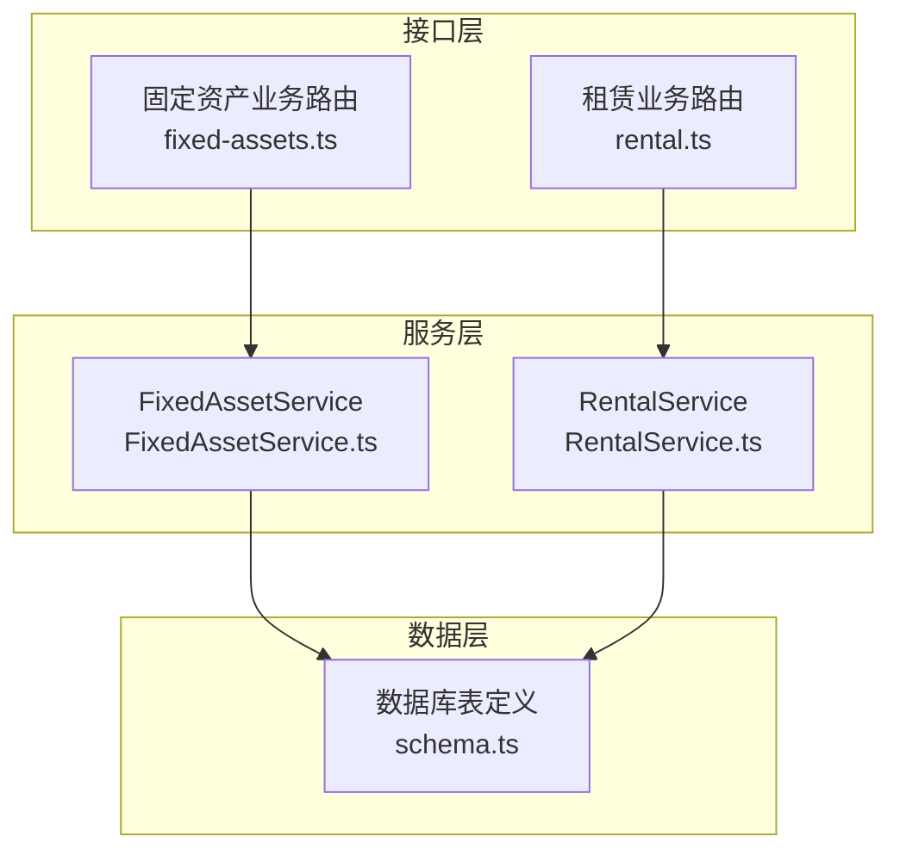
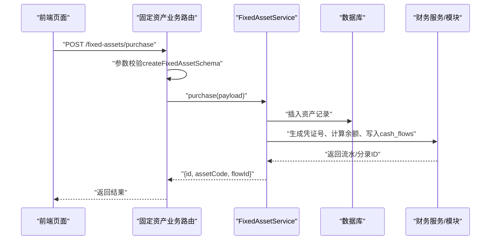
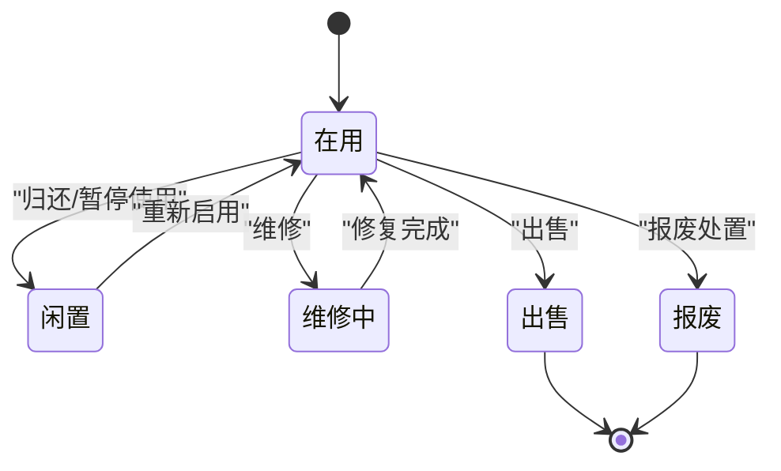
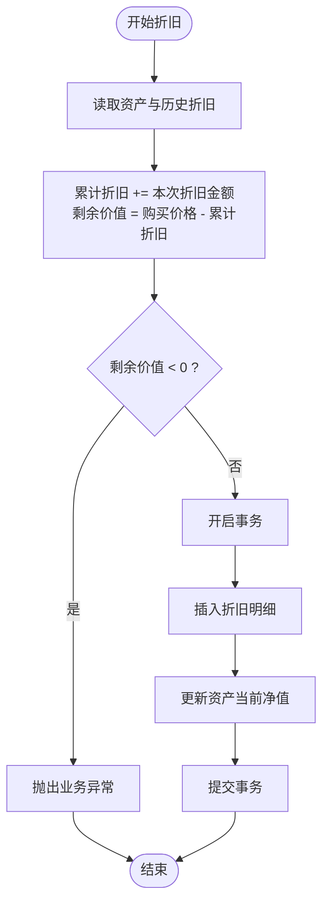
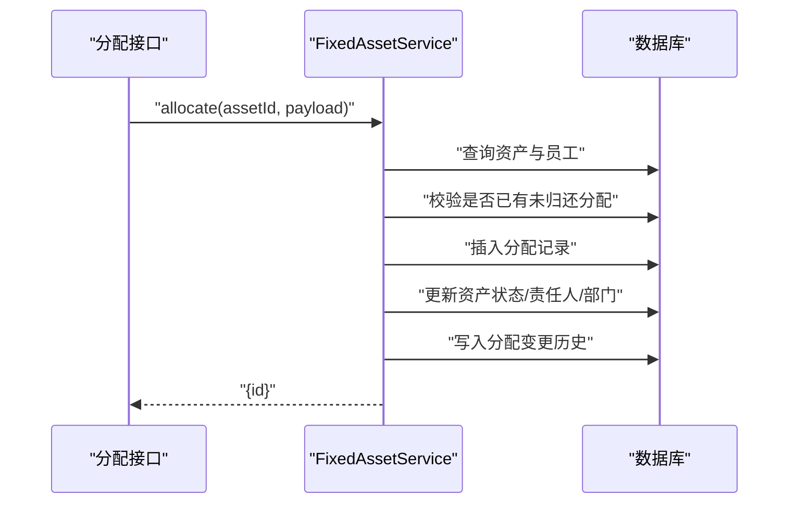
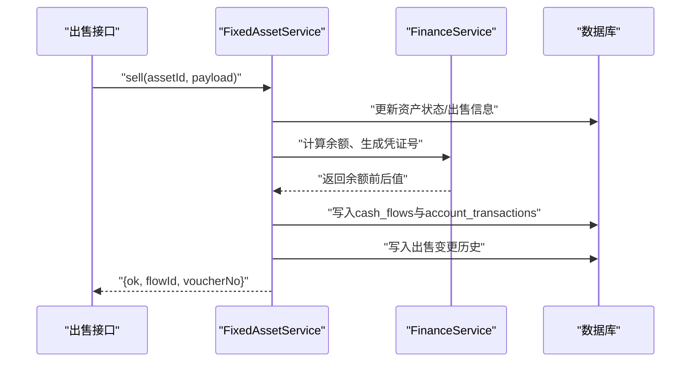
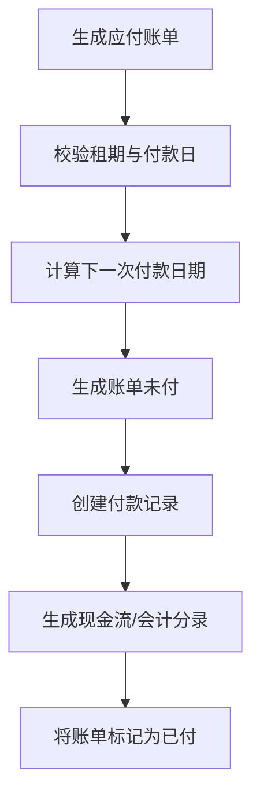
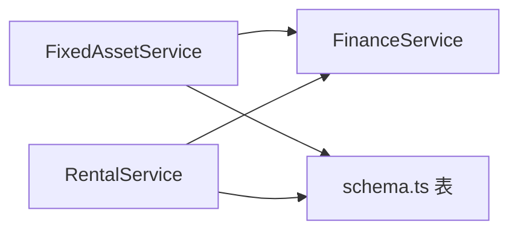
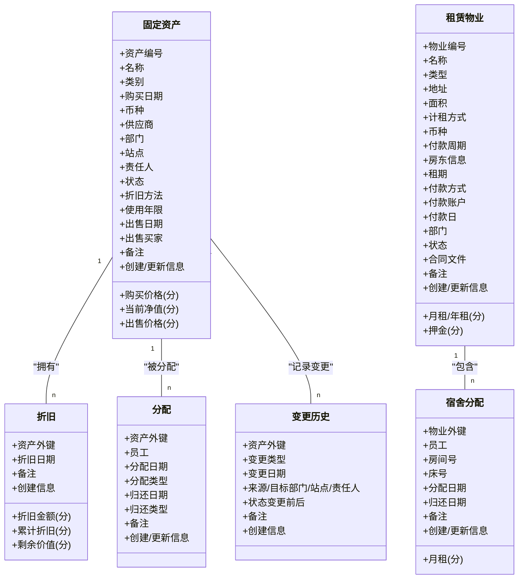

# 资产管理数据模型

<cite>
**本文引用的文件**
- [schema.ts](file://backend/src/db/schema.ts)
- [FixedAssetService.ts](file://backend/src/services/FixedAssetService.ts)
- [fixed-assets.ts](file://backend/src/routes/fixed-assets.ts)
- [business.schema.ts](file://backend/src/schemas/business.schema.ts)
- [RentalService.ts](file://backend/src/services/RentalService.ts)
- [rental.ts](file://backend/src/routes/rental.ts)
- [rental.ts（前端类型）](file://frontend/src/types/rental.ts)
- [FixedAssetsManagement.tsx](file://frontend/src/features/assets/pages/FixedAssetsManagement.tsx)
- [FixedAssetAllocation.tsx](file://frontend/src/features/assets/pages/FixedAssetAllocation.tsx)
- [fixed-assets.test.ts](file://backend/test/routes/fixed-assets.test.ts)
- [rental.test.ts](file://backend/test/routes/rental.test.ts)
</cite>

## 目录
1. [简介](#简介)
2. [项目结构](#项目结构)
3. [核心组件](#核心组件)
4. [架构总览](#架构总览)
5. [详细组件分析](#详细组件分析)
6. [依赖关系分析](#依赖关系分析)
7. [性能考量](#性能考量)
8. [故障排查指南](#故障排查指南)
9. [结论](#结论)
10. [附录](#附录)

## 简介
本文件面向资产模块开发者，系统性梳理固定资产、折旧、分配、变更历史等核心数据模型与生命周期管理，并解释租赁物业与宿舍分配表的设计及与财务模块的集成方式。文档同时提供一致性与完整性保障的最佳实践，帮助你在开发与维护过程中避免常见陷阱。

## 项目结构
资产模块由三层组成：
- 数据层：Drizzle ORM 定义的 SQLite 表结构（固定资产、折旧、分配、变更历史、租赁物业、宿舍分配等）
- 服务层：业务逻辑封装（FixedAssetService、RentalService）
- 接口层：OpenAPI 路由与请求/响应校验（routes 与 schemas）

图表来源
- [fixed-assets.ts](file://backend/src/routes/fixed-assets.ts#L1-L730)
- [rental.ts](file://backend/src/routes/rental.ts#L1-L677)
- [FixedAssetService.ts](file://backend/src/services/FixedAssetService.ts#L1-L779)
- [RentalService.ts](file://backend/src/services/RentalService.ts#L1-L617)
- [schema.ts](file://backend/src/db/schema.ts#L464-L612)

章节来源
- [fixed-assets.ts](file://backend/src/routes/fixed-assets.ts#L1-L730)
- [rental.ts](file://backend/src/routes/rental.ts#L1-L677)
- [FixedAssetService.ts](file://backend/src/services/FixedAssetService.ts#L1-L779)
- [RentalService.ts](file://backend/src/services/RentalService.ts#L1-L617)
- [schema.ts](file://backend/src/db/schema.ts#L464-L612)

## 核心组件
- 固定资产表（fixed_assets）
  - 关键字段：资产编号、名称、类别、购买日期、购买价格、币种、供应商、部门/站点、责任人、状态、折旧方法、使用年限、当前净值、出售相关字段、创建/更新信息
  - 状态枚举：in_use、idle、maintenance、scrapped、sold
- 折旧表（fixed_asset_depreciations）
  - 关键字段：资产关联、折旧日期、折旧金额、累计折旧、剩余价值、备注、创建信息
- 分配表（fixed_asset_allocations）
  - 关键字段：资产、员工、分配日期、分配类型、归还日期、归还类型、备注、创建/更新信息
- 变更历史表（fixed_asset_changes）
  - 关键字段：资产、变更类型（状态变更、转移、分配、归还、采购、出售）、变更日期、来源/目标部门/站点/责任人、状态变更前后值、备注、创建信息
- 租赁物业表（rental_properties）
  - 关键字段：物业编号、名称、类型（办公/宿舍/仓库/公寓等）、地址、面积、计租方式（月/年）、月租/年租、币种、付款周期、房东信息、租期、押金、付款方式、付款账户、付款日、部门、状态、合同文件、备注、创建/更新信息
- 宿舍分配表（dormitory_allocations）
  - 关键字段：物业、员工、房间号、床号、分配日期、月租、归还日期、备注、创建/更新信息
- 财务集成
  - 购买/出售时创建现金流与会计分录（cash_flows、account_transactions），并生成凭证号
  - 租金支付同样生成现金流与会计分录，并联动应付账单状态

章节来源
- [schema.ts](file://backend/src/db/schema.ts#L464-L612)
- [business.schema.ts](file://backend/src/schemas/business.schema.ts#L248-L318)
- [business.schema.ts](file://backend/src/schemas/business.schema.ts#L580-L603)
- [business.schema.ts](file://backend/src/schemas/business.schema.ts#L691-L743)

## 架构总览
固定资产业务通过路由层接收请求，经校验后交由服务层执行事务性操作，最终写入数据库并可能联动财务模块生成现金流与会计分录。租赁业务同理，但侧重于物业与付款流程。

图表来源
- [fixed-assets.ts](file://backend/src/routes/fixed-assets.ts#L511-L576)
- [FixedAssetService.ts](file://backend/src/services/FixedAssetService.ts#L417-L539)
- [business.schema.ts](file://backend/src/schemas/business.schema.ts#L248-L318)

章节来源
- [fixed-assets.ts](file://backend/src/routes/fixed-assets.ts#L511-L576)
- [FixedAssetService.ts](file://backend/src/services/FixedAssetService.ts#L417-L539)

## 详细组件分析

### 固定资产表（fixed_assets）与生命周期
- 结构要点
  - 资产编号唯一，便于外部识别与审计
  - 当前净值与累计折旧联动，确保账面价值准确
  - 出售相关字段（出售日期、售价、买家、备注）用于财务核销
- 生命周期状态流转
  - in_use（在用）：默认状态，资产投入使用
  - idle（闲置）：资产暂时未使用，但仍属公司资产
  - maintenance（维修中）：资产维修保养期间
  - scrapped（报废）：资产报废处置
  - sold（出售）：资产完成销售，状态变为 sold
- 关键约束
  - 删除资产前需无折旧记录
  - 更新资产时若涉及状态/部门/站点/责任人，自动记录变更历史

图表来源
- [schema.ts](file://backend/src/db/schema.ts#L464-L488)
- [FixedAssetService.ts](file://backend/src/services/FixedAssetService.ts#L304-L323)

章节来源
- [schema.ts](file://backend/src/db/schema.ts#L464-L488)
- [FixedAssetService.ts](file://backend/src/services/FixedAssetService.ts#L304-L323)

### 折旧（fixed_asset_depreciations）
- 计算逻辑
  - 累计折旧 = 已有累计折旧 + 本次折旧金额
  - 剩余价值 = 购买价格 - 累计折旧
  - 防止折旧总额超过购买价格
- 写入策略
  - 事务内同时写入折旧明细与更新资产当前净值
- 前端展示
  - 在资产详情页展示折旧明细，支持按时间排序

图表来源
- [FixedAssetService.ts](file://backend/src/services/FixedAssetService.ts#L325-L369)

章节来源
- [FixedAssetService.ts](file://backend/src/services/FixedAssetService.ts#L325-L369)

### 分配与归还（fixed_asset_allocations）
- 分配规则
  - 仅对 in_use/idle 的资产进行分配
  - 同一资产同一时刻仅允许一条未归还的分配记录
  - 分配后资产状态更新为 in_use，责任人更新为员工姓名，部门跟随员工所在部门
- 归还规则
  - 仅存在未归还分配时允许归还
  - 归还后资产状态更新为 idle，责任人清空
- 变更记录
  - 分配/归还均写入变更历史，记录责任人与状态变化

图表来源
- [fixed-assets.ts](file://backend/src/routes/fixed-assets.ts#L637-L682)
- [FixedAssetService.ts](file://backend/src/services/FixedAssetService.ts#L644-L717)

章节来源
- [fixed-assets.ts](file://backend/src/routes/fixed-assets.ts#L637-L682)
- [FixedAssetService.ts](file://backend/src/services/FixedAssetService.ts#L644-L717)

### 变更历史（fixed_asset_changes）
- 记录维度
  - 资产、变更类型、变更日期
  - 来源/目标部门、站点、责任人
  - 状态变更前后值
  - 备注、创建者
- 用途
  - 审计追踪、合规要求、报表统计

章节来源
- [schema.ts](file://backend/src/db/schema.ts#L502-L518)
- [FixedAssetService.ts](file://backend/src/services/FixedAssetService.ts#L279-L299)
- [FixedAssetService.ts](file://backend/src/services/FixedAssetService.ts#L371-L415)
- [FixedAssetService.ts](file://backend/src/services/FixedAssetService.ts#L719-L777)

### 购买与出售（与财务集成）
- 购买
  - 创建资产记录
  - 生成凭证号（JZ+日期+序号）
  - 写入现金流（支出）、会计分录（减少余额）
  - 记录采购变更历史
- 出售
  - 更新资产状态为 sold，写入出售信息
  - 生成凭证号（JZ+日期+序号）
  - 写入现金流（收入）、会计分录（增加余额）
  - 记录出售变更历史

图表来源
- [fixed-assets.ts](file://backend/src/routes/fixed-assets.ts#L578-L635)
- [FixedAssetService.ts](file://backend/src/services/FixedAssetService.ts#L541-L642)

章节来源
- [fixed-assets.ts](file://backend/src/routes/fixed-assets.ts#L578-L635)
- [FixedAssetService.ts](file://backend/src/services/FixedAssetService.ts#L541-L642)

### 租赁物业（rental_properties）与宿舍分配（dormitory_allocations）
- 物业表设计
  - 支持多种物业类型（办公/宿舍/仓库/公寓等）
  - 计租方式（月/年）与月租/年租字段
  - 付款周期、付款日、付款账户、房东信息、租期、押金、状态
- 宿舍分配
  - 仅对宿舍类型物业生效
  - 支持房间号/床号、月租、分配/归还日期
- 应付账单生成
  - 按租期与付款周期自动生成应付账单，设置到期日与金额
- 付款与核销
  - 创建付款记录时生成现金流与会计分录，并将对应应付账单标记为 paid

图表来源
- [RentalService.ts](file://backend/src/services/RentalService.ts#L489-L575)
- [RentalService.ts](file://backend/src/services/RentalService.ts#L238-L350)

章节来源
- [RentalService.ts](file://backend/src/services/RentalService.ts#L489-L575)
- [RentalService.ts](file://backend/src/services/RentalService.ts#L238-L350)
- [rental.ts](file://backend/src/routes/rental.ts#L572-L677)
- [rental.ts（前端类型）](file://frontend/src/types/rental.ts#L1-L143)

### 前端交互与数据映射
- 资产管理页面
  - 支持搜索、筛选（状态/部门/类别）、批量删除
  - 提供调拨、折旧、详情（含折旧与变更历史）等操作
- 资产分配页面
  - 支持按员工与归还状态筛选
  - 分配/归还流程与后端严格对齐

章节来源
- [FixedAssetsManagement.tsx](file://frontend/src/features/assets/pages/FixedAssetsManagement.tsx#L1-L523)
- [FixedAssetAllocation.tsx](file://frontend/src/features/assets/pages/FixedAssetAllocation.tsx#L1-L355)

## 依赖关系分析
- 固定资产服务依赖
  - 与财务模块协作：凭证号生成、余额计算、现金流与会计分录写入
  - 与组织/人员/供应商/币种等主数据表关联
- 租赁服务依赖
  - 与财务模块协作：付款生成现金流与会计分录
  - 与应付账单联动：付款后自动核销未付账单

图表来源
- [FixedAssetService.ts](file://backend/src/services/FixedAssetService.ts#L1-L779)
- [RentalService.ts](file://backend/src/services/RentalService.ts#L1-L617)
- [schema.ts](file://backend/src/db/schema.ts#L464-L612)

章节来源
- [FixedAssetService.ts](file://backend/src/services/FixedAssetService.ts#L1-L779)
- [RentalService.ts](file://backend/src/services/RentalService.ts#L1-L617)
- [schema.ts](file://backend/src/db/schema.ts#L464-L612)

## 性能考量
- 查询优化
  - 列表查询使用条件过滤与分页限制，避免一次性拉取大量数据
  - 对多表关联查询采用并行加载，减少往返次数
- 事务边界
  - 购买/出售、折旧、分配/归还等关键流程均在事务内执行，保证一致性
- 字段设计
  - 金额统一使用“分”级存储，避免浮点误差
  - 时间戳使用整型存储，便于排序与范围查询

[本节为通用指导，无需特定文件引用]

## 故障排查指南
- 删除资产失败
  - 若资产存在折旧记录，服务层会拒绝删除；请先清理折旧记录
- 分配冲突
  - 同一资产同一时刻仅允许一条未归还分配；请先归还再分配
- 折旧超限
  - 折旧累计不得高于购买价格；请检查折旧金额与历史累计
- 账户不匹配
  - 购买/出售与付款时需确保账户币种一致；否则会触发业务异常
- 重复记录
  - 资产编号、物业编号唯一；重复会触发重复异常
- 测试参考
  - 固定资产业务路由测试覆盖了创建、更新、删除、折旧、调拨、购买、出售、分配、归还等场景
  - 租赁业务路由测试覆盖了物业增删改查、分配、付款、应付账单生成与核销

章节来源
- [FixedAssetService.ts](file://backend/src/services/FixedAssetService.ts#L304-L323)
- [FixedAssetService.ts](file://backend/src/services/FixedAssetService.ts#L644-L717)
- [FixedAssetService.ts](file://backend/src/services/FixedAssetService.ts#L325-L369)
- [RentalService.ts](file://backend/src/services/RentalService.ts#L190-L204)
- [fixed-assets.test.ts](file://backend/test/routes/fixed-assets.test.ts#L1-L323)
- [rental.test.ts](file://backend/test/routes/rental.test.ts#L1-L267)

## 结论
本数据模型围绕“资产全生命周期”展开，通过严格的事务控制、审计追踪与财务集成，确保资产数据的准确性与可追溯性。建议在扩展新功能时遵循现有模式：先在路由层做参数校验，再在服务层实现业务规则与事务，最后在数据层落库并联动财务模块。对于复杂流程（如购买/出售、折旧、分配/归还），务必保持原子性与一致性。

[本节为总结性内容，无需特定文件引用]

## 附录

### 数据模型类图（关键实体）

图表来源
- [schema.ts](file://backend/src/db/schema.ts#L464-L612)