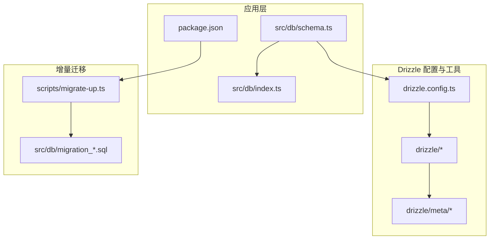
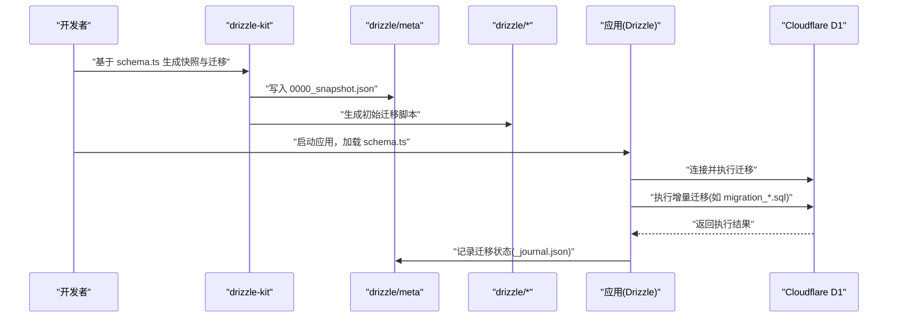
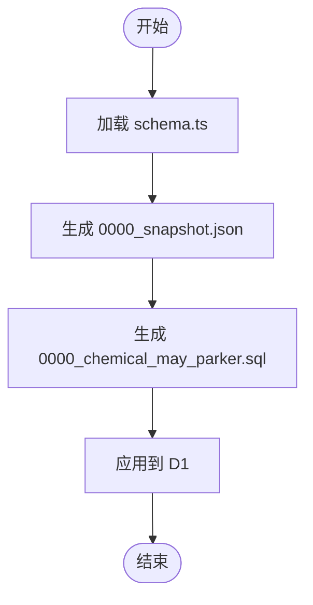
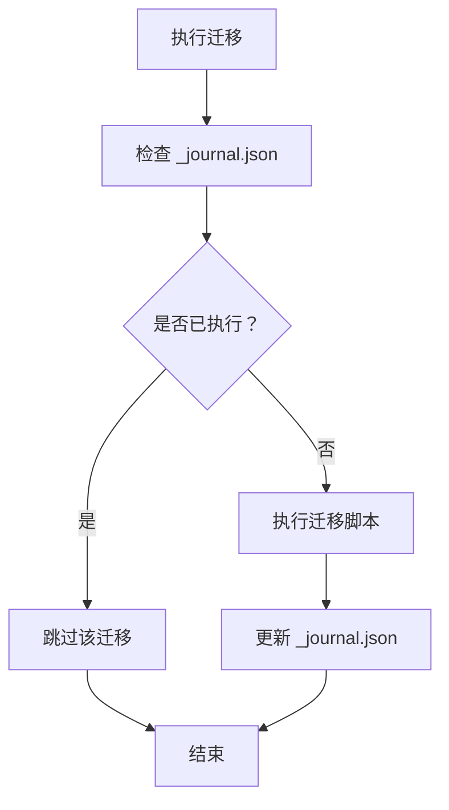
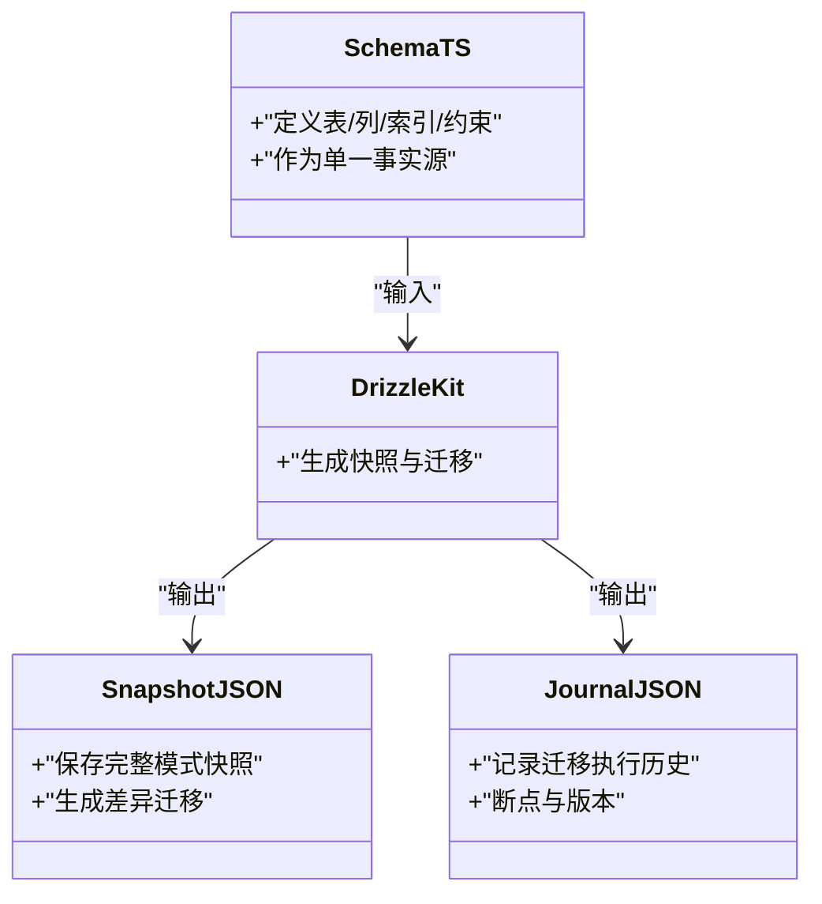
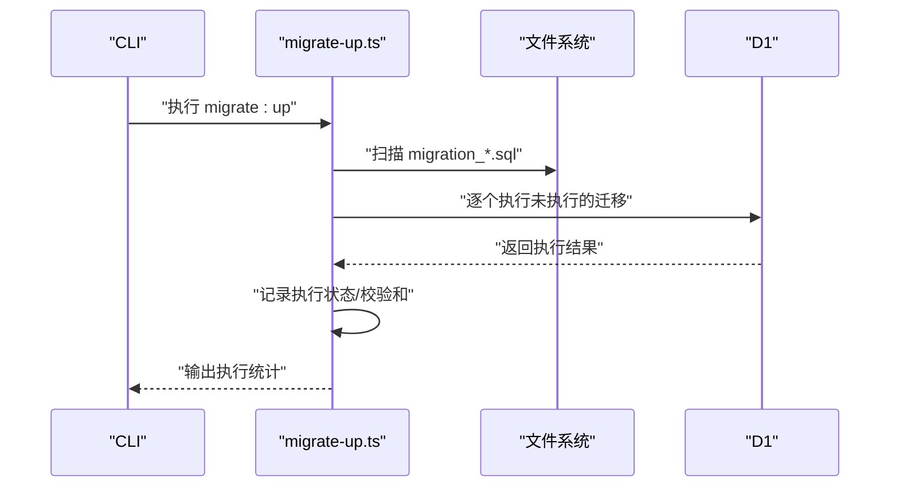
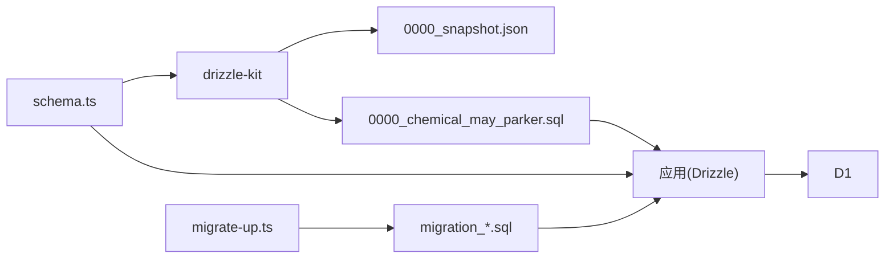

# 迁移历史与快照管理

<cite>
**本文引用的文件**
- [backend/drizzle/meta/0000_snapshot.json](file://backend/drizzle/meta/0000_snapshot.json)
- [backend/drizzle/meta/_journal.json](file://backend/drizzle/meta/_journal.json)
- [backend/drizzle/0000_chemical_may_parker.sql](file://backend/drizzle/0000_chemical_may_parker.sql)
- [backend/drizzle.config.ts](file://backend/drizzle.config.ts)
- [backend/src/db/schema.ts](file://backend/src/db/schema.ts)
- [backend/src/db/index.ts](file://backend/src/db/index.ts)
- [backend/src/db/schema.sql](file://backend/src/db/schema.sql)
- [backend/src/db/migration_add_salary_tables.sql](file://backend/src/db/migration_add_salary_tables.sql)
- [backend/src/db/migration_add_cash_flow_reversal_fields.sql](file://backend/src/db/migration_add_cash_flow_reversal_fields.sql)
- [backend/scripts/migrate-up.ts](file://backend/scripts/migrate-up.ts)
- [backend/package.json](file://backend/package.json)
</cite>

## 目录
1. [简介](#简介)
2. [项目结构](#项目结构)
3. [核心组件](#核心组件)
4. [架构总览](#架构总览)
5. [详细组件分析](#详细组件分析)
6. [依赖关系分析](#依赖关系分析)
7. [性能考量](#性能考量)
8. [故障排查指南](#故障排查指南)
9. [结论](#结论)
10. [附录](#附录)

## 简介
本文件系统性阐述本项目的“迁移历史与快照管理”机制，重点解释以下方面：
- drizzle-kit 生成的 drizzle/meta 目录的作用，尤其是 0000_snapshot.json 如何保存数据库的完整模式快照，用于生成新的迁移差异。
- _journal.json 在迁移协调与状态追踪中的角色。
- schema.ts 作为“单一事实源（Single Source of Truth）”的重要性：所有模式变更最终应反映在此文件中。
- 快照如何帮助开发者快速同步本地数据库到最新状态，并在团队协作中保证模式一致性。
- 对比快照机制与传统增量迁移脚本的优缺点，并说明本项目如何结合两者（增量 SQL 脚本 + 最终快照）来兼顾历史追溯和快速初始化。

## 项目结构
本项目采用“代码驱动的模式定义 + drizzle-kit 快照 + 增量 SQL 迁移”的混合策略：
- 模式定义：以 schema.ts 为核心，使用 Drizzle ORM 的 sqliteTable API 描述数据库表结构。
- 快照与迁移：drizzle/meta 下保存快照与迁移执行日志；drizzle 目录下存放由快照生成的初始迁移脚本。
- 增量迁移：src/db 下的 migration_*.sql 文件用于后续演进。
- 工具链：drizzle.config.ts 指定 schema.ts 为输入，package.json 提供一键迁移命令。

图表来源
- [backend/drizzle.config.ts](file://backend/drizzle.config.ts#L1-L8)
- [backend/src/db/schema.ts](file://backend/src/db/schema.ts#L1-L706)
- [backend/src/db/index.ts](file://backend/src/db/index.ts#L1-L7)
- [backend/package.json](file://backend/package.json#L1-L70)

章节来源
- [backend/drizzle.config.ts](file://backend/drizzle.config.ts#L1-L8)
- [backend/package.json](file://backend/package.json#L1-L70)

## 核心组件
- schema.ts：定义所有表、列、索引、约束等，是“单一事实源”。任何模式变更必须先在此处体现，再通过 drizzle-kit 生成快照与迁移。
- drizzle/meta/0000_snapshot.json：记录数据库的完整模式快照，包含版本、方言、表结构、索引、外键等元数据，用于生成后续差异迁移。
- drizzle/meta/_journal.json：记录迁移执行历史与断点信息，便于追踪哪些迁移已执行、何时执行、是否需要断点处理。
- drizzle/0000_chemical_may_parker.sql：由快照生成的初始迁移脚本，通常对应首次部署时的完整模式。
- src/db/migration_*.sql：后续增量迁移脚本，用于追加演进（如添加表、字段、索引等）。
- scripts/migrate-up.ts：自研迁移执行器，按文件名顺序执行增量迁移，具备幂等与校验能力。
- src/db/index.ts：将 schema.ts 导入 Drizzle，供应用连接 D1 时使用。

章节来源
- [backend/src/db/schema.ts](file://backend/src/db/schema.ts#L1-L706)
- [backend/drizzle/meta/0000_snapshot.json](file://backend/drizzle/meta/0000_snapshot.json#L1-L200)
- [backend/drizzle/meta/_journal.json](file://backend/drizzle/meta/_journal.json#L1-L13)
- [backend/drizzle/0000_chemical_may_parker.sql](file://backend/drizzle/0000_chemical_may_parker.sql#L1-L647)
- [backend/src/db/migration_add_salary_tables.sql](file://backend/src/db/migration_add_salary_tables.sql#L1-L21)
- [backend/src/db/migration_add_cash_flow_reversal_fields.sql](file://backend/src/db/migration_add_cash_flow_reversal_fields.sql#L1-L18)
- [backend/scripts/migrate-up.ts](file://backend/scripts/migrate-up.ts#L1-L183)
- [backend/src/db/index.ts](file://backend/src/db/index.ts#L1-L7)

## 架构总览
下图展示了从“代码模式定义”到“数据库模式落地”的端到端流程，包括快照生成、迁移执行与状态追踪。

图表来源
- [backend/drizzle.config.ts](file://backend/drizzle.config.ts#L1-L8)
- [backend/src/db/schema.ts](file://backend/src/db/schema.ts#L1-L706)
- [backend/drizzle/meta/0000_snapshot.json](file://backend/drizzle/meta/0000_snapshot.json#L1-L200)
- [backend/drizzle/0000_chemical_may_parker.sql](file://backend/drizzle/0000_chemical_may_parker.sql#L1-L647)
- [backend/src/db/index.ts](file://backend/src/db/index.ts#L1-L7)

## 详细组件分析

### 组件A：快照与初始迁移（0000_snapshot.json 与 0000_chemical_may_parker.sql）
- 作用
  - 0000_snapshot.json：保存数据库的完整模式快照，包含表、列、索引、约束等元数据，用于生成差异迁移。
  - 0000_chemical_may_parker.sql：由快照生成的初始迁移脚本，通常一次性创建所有表与索引，确保首次部署的一致性。
- 关系
  - drizzle.config.ts 指定 schema.ts 为输入，drizzle-kit 会据此生成快照与迁移脚本。
  - 应用启动时，Drizzle 会根据 schema.ts 与迁移脚本对 D1 进行同步。
- 影响
  - 快照确保“单一事实源”（schema.ts）与数据库一致，避免手写 SQL 与代码脱节。
  - 初始迁移脚本提供可重复、可审计的部署路径。

图表来源
- [backend/drizzle.config.ts](file://backend/drizzle.config.ts#L1-L8)
- [backend/src/db/schema.ts](file://backend/src/db/schema.ts#L1-L706)
- [backend/drizzle/meta/0000_snapshot.json](file://backend/drizzle/meta/0000_snapshot.json#L1-L200)
- [backend/drizzle/0000_chemical_may_parker.sql](file://backend/drizzle/0000_chemical_may_parker.sql#L1-L647)

章节来源
- [backend/drizzle.meta/0000_snapshot.json](file://backend/drizzle/meta/0000_snapshot.json#L1-L200)
- [backend/drizzle/0000_chemical_may_parker.sql](file://backend/drizzle/0000_chemical_may_parker.sql#L1-L647)
- [backend/drizzle.config.ts](file://backend/drizzle.config.ts#L1-L8)

### 组件B：迁移协调与状态追踪（_journal.json）
- 作用
  - 记录迁移执行历史、版本、时间戳、标签与断点信息，便于追踪哪些迁移已执行、是否需要断点处理。
- 工作方式
  - drizzle-kit 在生成迁移时会更新 _journal.json，标记迁移版本与执行状态。
  - 应用侧（如自研脚本）也可配合记录执行状态，确保幂等与一致性。
- 价值
  - 在团队协作中，_journal.json 是“迁移共识”的证据，避免重复执行或遗漏。

图表来源
- [backend/drizzle/meta/_journal.json](file://backend/drizzle/meta/_journal.json#L1-L13)

章节来源
- [backend/drizzle/meta/_journal.json](file://backend/drizzle/meta/_journal.json#L1-L13)

### 组件C：单一事实源（schema.ts）
- 重要性
  - schema.ts 是“单一事实源”，所有模式变更必须先在此处定义，再通过 drizzle-kit 生成快照与迁移脚本。
  - 任何对数据库结构的修改都应在 schema.ts 中体现，避免手写 SQL 与代码脱节。
- 实践建议
  - 新增表/字段/索引时，优先在 schema.ts 中声明，然后生成快照与迁移。
  - 团队成员在本地/CI 中均应以 schema.ts 为准进行同步。

图表来源
- [backend/src/db/schema.ts](file://backend/src/db/schema.ts#L1-L706)
- [backend/drizzle/meta/0000_snapshot.json](file://backend/drizzle/meta/0000_snapshot.json#L1-L200)
- [backend/drizzle/meta/_journal.json](file://backend/drizzle/meta/_journal.json#L1-L13)
- [backend/drizzle.config.ts](file://backend/drizzle.config.ts#L1-L8)

章节来源
- [backend/src/db/schema.ts](file://backend/src/db/schema.ts#L1-L706)
- [backend/drizzle.config.ts](file://backend/drizzle.config.ts#L1-L8)

### 组件D：增量迁移脚本与执行器（migration_*.sql 与 migrate-up.ts）
- 增量迁移脚本
  - 用于后续演进，如新增表、字段、索引等，保持与 schema.ts 的同步。
  - 示例：添加薪资相关表、为 cash_flows 添加红冲字段等。
- 自研执行器
  - scripts/migrate-up.ts 按文件名顺序执行增量迁移，具备幂等与错误处理能力（识别“已存在/不存在”类错误并记录）。
  - 支持本地与远程数据库（通过 wrangler d1 execute）。

图表来源
- [backend/scripts/migrate-up.ts](file://backend/scripts/migrate-up.ts#L1-L183)
- [backend/src/db/migration_add_salary_tables.sql](file://backend/src/db/migration_add_salary_tables.sql#L1-L21)
- [backend/src/db/migration_add_cash_flow_reversal_fields.sql](file://backend/src/db/migration_add_cash_flow_reversal_fields.sql#L1-L18)

章节来源
- [backend/scripts/migrate-up.ts](file://backend/scripts/migrate-up.ts#L1-L183)
- [backend/src/db/migration_add_salary_tables.sql](file://backend/src/db/migration_add_salary_tables.sql#L1-L21)
- [backend/src/db/migration_add_cash_flow_reversal_fields.sql](file://backend/src/db/migration_add_cash_flow_reversal_fields.sql#L1-L18)

### 组件E：应用侧集成（src/db/index.ts 与 schema.ts）
- src/db/index.ts 将 schema.ts 导入 Drizzle，供应用连接 D1 时使用。
- 通过 Drizzle ORM，应用可以以类型安全的方式操作数据库，同时与 schema.ts 保持一致。

章节来源
- [backend/src/db/index.ts](file://backend/src/db/index.ts#L1-L7)
- [backend/src/db/schema.ts](file://backend/src/db/schema.ts#L1-L706)

## 依赖关系分析
- drizzle.config.ts 指向 schema.ts 作为输入，决定快照与迁移生成的依据。
- schema.ts 与 drizzle-kit 生成的快照/迁移共同构成“模式基线”。
- 增量迁移脚本与自研执行器负责后续演进与幂等执行。
- 应用通过 Drizzle ORM 与 D1 交互，确保运行时与模式定义一致。

图表来源
- [backend/drizzle.config.ts](file://backend/drizzle.config.ts#L1-L8)
- [backend/src/db/schema.ts](file://backend/src/db/schema.ts#L1-L706)
- [backend/drizzle/meta/0000_snapshot.json](file://backend/drizzle/meta/0000_snapshot.json#L1-L200)
- [backend/drizzle/0000_chemical_may_parker.sql](file://backend/drizzle/0000_chemical_may_parker.sql#L1-L647)
- [backend/scripts/migrate-up.ts](file://backend/scripts/migrate-up.ts#L1-L183)

章节来源
- [backend/drizzle.config.ts](file://backend/drizzle.config.ts#L1-L8)
- [backend/src/db/schema.ts](file://backend/src/db/schema.ts#L1-L706)
- [backend/scripts/migrate-up.ts](file://backend/scripts/migrate-up.ts#L1-L183)

## 性能考量
- 快照与初始迁移：一次性创建完整模式，减少多次 ALTER/DROP 的开销，适合首次部署与快速初始化。
- 增量迁移：按需追加演进，避免全量重建；但需注意索引与约束的幂等性，避免重复创建导致性能下降。
- 幂等执行：自研执行器对“已存在/不存在”类错误进行识别与容错，减少重复执行带来的资源浪费。
- 索引与查询：在 schema.ts 中合理设计索引，配合迁移脚本中的索引创建，提升查询性能。

## 故障排查指南
- 快照与代码不一致
  - 现象：生成的迁移与当前 schema.ts 不符。
  - 处理：确认 drizzle.config.ts 的 schema 指向正确；重新生成快照与迁移。
- 迁移重复执行
  - 现象：提示列/表/索引已存在。
  - 处理：自研执行器会识别此类错误并记录为已执行；检查 _journal.json 与执行记录。
- 远程数据库迁移失败
  - 现象：远程执行报错。
  - 处理：使用 migrate:up:remote 或 migrate:remote 脚本；检查网络与凭据；查看错误输出。
- 断点与历史回溯
  - 现象：需要回滚或重放特定迁移。
  - 处理：利用 _journal.json 的断点与版本信息，结合 schema.ts 与快照进行回溯与修复。

章节来源
- [backend/scripts/migrate-up.ts](file://backend/scripts/migrate-up.ts#L1-L183)
- [backend/drizzle/meta/_journal.json](file://backend/drizzle/meta/_journal.json#L1-L13)
- [backend/package.json](file://backend/package.json#L1-L70)

## 结论
本项目通过“代码驱动的模式定义 + drizzle-kit 快照 + 增量 SQL 迁移”的组合，实现了：
- 快速初始化：以快照与初始迁移脚本一次性构建完整模式，便于本地与 CI 快速同步。
- 历史追溯：_journal.json 记录迁移执行历史，保障团队协作中的可追溯性与一致性。
- 单一事实源：schema.ts 作为唯一权威，确保代码与数据库结构保持一致。
- 幂等与健壮：自研迁移执行器对常见错误进行识别与容错，提升迁移可靠性。

## 附录
- 常用命令
  - 生成快照与迁移：npm run db:generate
  - 启动 Drizzle Kit Studio：npm run db:studio
  - 推送模式（仅生成快照，不执行）：npm run db:push
  - 执行增量迁移（本地）：npm run migrate:up
  - 执行增量迁移（远程）：npm run migrate:up:remote
  - 检查迁移状态：npm run migrate:status
  - 迁移现有数据库：npm run migrate:existing

章节来源
- [backend/package.json](file://backend/package.json#L1-L70)