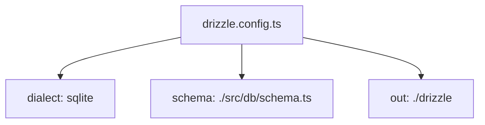
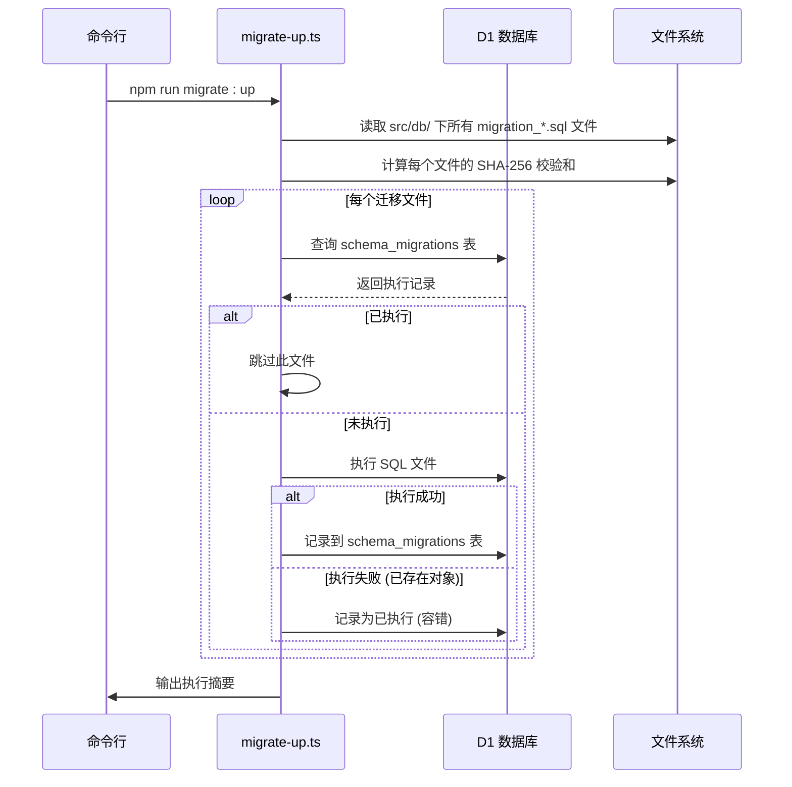
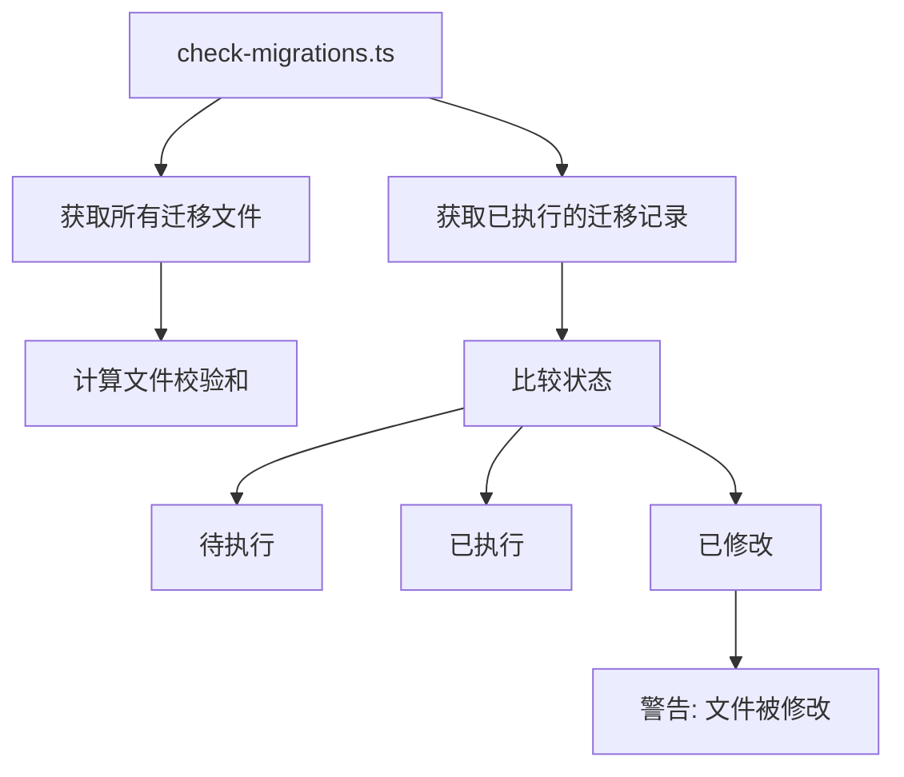

# 迁移工具与配置

<cite>
**本文档引用的文件**  
- [drizzle.config.ts](file://backend/drizzle.config.ts)
- [migrate-up.ts](file://backend/scripts/migrate-up.ts)
- [check-migrations.ts](file://backend/scripts/check-migrations.ts)
- [package.json](file://backend/package.json)
- [schema.ts](file://backend/src/db/schema.ts)
- [wrangler.toml](file://backend/wrangler.toml)
</cite>

## 目录
1. [引言](#引言)
2. [核心迁移工具与脚本](#核心迁移工具与脚本)
3. [drizzle-kit 配置详解](#drizzle-kit-配置详解)
4. [自动化迁移执行机制](#自动化迁移执行机制)
5. [迁移一致性检查](#迁移一致性检查)
6. [实际操作示例](#实际操作示例)
7. [安全与可靠性](#安全与可靠性)
8. [结论](#结论)

## 引言

本项目采用自定义的数据库迁移系统，结合 `drizzle-kit` 工具，实现对 Cloudflare D1 数据库的可靠、可重复的模式变更管理。该系统不仅支持本地开发环境的数据库变更，还通过 `wrangler` CLI 无缝集成远程生产环境的迁移操作。其核心目标是确保数据库模式变更的安全性、一致性和可追溯性，特别是在 CI/CD 流程中防止因迁移不一致导致的部署失败。

## 核心迁移工具与脚本

项目中的数据库迁移由一组精心设计的 TypeScript 脚本驱动，这些脚本位于 `backend/scripts/` 目录下，通过 `package.json` 中的 npm 脚本进行调用。它们共同构成了一个健壮的迁移工作流。

### 迁移文件约定

所有数据库变更脚本均以 SQL 文件形式存放于 `backend/src/db/` 目录下，文件名遵循 `migration_*.sql` 的命名约定（例如 `migration_add_salary_tables.sql`）。这种命名方式确保了文件可以按字母顺序被正确读取和执行，从而保证了迁移的有序性。

**Section sources**
- [migrate-up.ts](file://backend/scripts/migrate-up.ts#L34-L35)
- [check-migrations.ts](file://backend/scripts/check-migrations.ts#L38-L39)

## drizzle-kit 配置详解

`drizzle.config.ts` 文件是 `drizzle-kit` 工具的配置中心，它定义了工具如何与项目代码库进行交互。



**Diagram sources**
- [drizzle.config.ts](file://backend/drizzle.config.ts#L1-L8)

### dialect 配置项

`dialect: "sqlite"` 明确指定了项目所使用的数据库方言为 SQLite。这对于 `drizzle-kit` 至关重要，因为它需要根据此配置生成符合 SQLite 语法的 SQL 语句，并在内部使用相应的驱动程序来解析和操作数据库模式。

**Section sources**
- [drizzle.config.ts](file://backend/drizzle.config.ts#L4)

### schema 配置项

`schema: "./src/db/schema.ts"` 指向了项目中使用 Drizzle ORM 定义数据库模式的 TypeScript 文件。这个文件是整个迁移系统的核心元数据源。`drizzle-kit` 会读取此文件，将其解析为内存中的模式对象，用于生成迁移脚本、推送到数据库或生成快照。

**Section sources**
- [drizzle.config.ts](file://backend/drizzle.config.ts#L5)
- [schema.ts](file://backend/src/db/schema.ts)

### out 配置项

`out: "./drizzle"` 指定了由 `drizzle-kit` 生成的所有输出文件的存放目录。这包括：
- **迁移文件**：当使用 `db:generate` 命令时，新生成的迁移 SQL 文件会存放在该目录。
- **元数据**：`drizzle-kit` 会在此目录下创建一个 `meta` 子目录，用于存储数据库模式的 JSON 快照和变更日志（journal），这对于增量生成迁移至关重要。

**Section sources**
- [drizzle.config.ts](file://backend/drizzle.config.ts#L6)

## 自动化迁移执行机制

`migrate-up.ts` 脚本是执行数据库迁移的核心自动化工具，它实现了幂等、安全的迁移流程。



**Diagram sources**
- [migrate-up.ts](file://backend/scripts/migrate-up.ts#L138-L176)

### 迁移文件的读取与校验

脚本首先通过 `fs.readdirSync` 读取 `src/db/` 目录下所有以 `migration_` 开头且以 `.sql` 结尾的文件，并按文件名排序。对于每个文件，它会读取其内容并使用 `crypto.createHash('sha256')` 计算其 SHA-256 校验和。这个校验和是确保迁移文件完整性和一致性的重要手段。

**Section sources**
- [migrate-up.ts](file://backend/scripts/migrate-up.ts#L31-L42)

### 执行状态检查

在执行任何迁移之前，脚本会通过 `wrangler d1 execute` 命令查询数据库中的 `schema_migrations` 表。该表记录了所有已成功执行的迁移文件名（`version`）。如果当前迁移文件的文件名已存在于该表中，脚本将跳过执行，从而保证了迁移的幂等性。

**Section sources**
- [migrate-up.ts](file://backend/scripts/migrate-up.ts#L48-L67)

### 错误容错处理

迁移执行过程中，脚本具备强大的容错能力。当执行 SQL 文件时，如果捕获到错误，它会检查错误信息。如果错误是“对象已存在”（如 `already exists`, `duplicate column`）或“对象不存在”（如 `no such table`, `no such column`）等类型，脚本会认为该迁移可能已经部分执行或因模式合并而不再需要，此时会将该迁移记录为“已执行”，而不是中断整个流程。这极大地提高了在复杂历史环境下迁移的鲁棒性。

**Section sources**
- [migrate-up.ts](file://backend/scripts/migrate-up.ts#L114-L128)

### 远程数据库支持

通过检查命令行参数（`--remote` 或 `-r`），`migrate-up.ts` 脚本能自动区分本地和远程数据库操作。当检测到远程标志时，它会在所有 `wrangler d1 execute` 命令后添加 `--remote` 参数，从而将操作定向到 Cloudflare 的远程 D1 数据库实例，实现了开发与生产环境的一致性。

**Section sources**
- [migrate-up.ts](file://backend/scripts/migrate-up.ts#L140)

## 迁移一致性检查

`check-migrations.ts` 脚本是保障迁移一致性的关键工具，尤其在 CI/CD 流程中不可或缺。



**Diagram sources**
- [check-migrations.ts](file://backend/scripts/check-migrations.ts#L102-L175)

该脚本会并行获取两组信息：一是本地文件系统中的所有迁移文件及其校验和；二是数据库中 `schema_migrations` 表记录的已执行迁移及其校验和。通过对比，它可以输出三种状态：
- **待执行**：文件存在但未在数据库中记录。
- **已执行**：文件存在且校验和匹配。
- **已修改**：文件存在且已在数据库中记录，但当前文件的校验和与记录的校验和不匹配，这表示迁移文件被修改过，可能存在不一致风险。

在 CI/CD 流程中，可以配置此脚本，如果存在“待执行”的迁移，则阻止部署，从而强制要求开发者先在本地执行迁移，确保生产环境的数据库模式与代码库同步。

**Section sources**
- [check-migrations.ts](file://backend/scripts/check-migrations.ts#L102-L175)

## 实际操作示例

### 触发本地迁移

要执行所有未应用的迁移到本地数据库，只需运行：
```bash
npm run migrate:up
```

### 触发远程迁移

要将迁移应用到远程生产数据库，运行：
```bash
npm run migrate:up:remote
```

### 检查迁移状态

在部署前检查迁移状态：
```bash
npm run migrate:check:remote
```

这些 npm 脚本在 `package.json` 中定义，它们通过 `tsx` 执行器来运行相应的 TypeScript 脚本，无需预先编译。

**Section sources**
- [package.json](file://backend/package.json#L14-L15)
- [migrate-up.ts](file://backend/scripts/migrate-up.ts#L8)
- [check-migrations.ts](file://backend/scripts/check-migrations.ts#L7)

## 安全与可靠性

该迁移系统通过多种机制确保了安全与可靠性：
1.  **幂等性**：通过 `schema_migrations` 表跟踪执行状态，避免重复执行。
2.  **可追溯性**：每条执行记录都包含时间戳和文件校验和，便于审计和问题排查。
3.  **容错性**：对“已存在”和“不存在”等常见错误进行智能处理，防止流程中断。
4.  **一致性检查**：`check-migrations` 脚本提供了在部署前验证环境一致性的能力。
5.  **可重复执行**：整个流程设计为可重复运行，无论成功与否，都能将系统带入一个已知的、一致的状态。

## 结论

该项目的数据库迁移方案通过 `drizzle-kit` 与自定义脚本的结合，构建了一个高效、安全且可靠的自动化流程。`drizzle.config.ts` 提供了清晰的配置，而 `migrate-up.ts` 和 `check-migrations.ts` 脚本则实现了复杂的业务逻辑，确保了数据库模式变更的可控性和一致性。这套工具链不仅简化了开发者的日常操作，更为 CI/CD 流程提供了坚实的基础，是项目数据层稳定运行的重要保障。