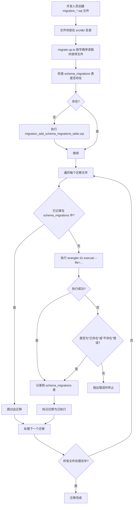

# 迁移执行流程

<cite>
**本文档引用的文件**
- [migrate-up.ts](file://backend/scripts/migrate-up.ts)
- [check-migrations.ts](file://backend/scripts/check-migrations.ts)
- [migrate-status.ts](file://backend/scripts/migrate-status.ts)
- [migration_add_salary_tables.sql](file://backend/src/db/migration_add_salary_tables.sql)
- [migration_add_departments_sort_order.sql](file://backend/src/db/migration_add_departments_sort_order.sql)
- [migration_update_hq_org_departments.sql](file://backend/src/db/migration_update_hq_org_departments.sql)
- [schema.sql](file://backend/src/db/schema.sql)
- [schema.ts](file://backend/src/db/schema.ts)
- [wrangler.toml](file://backend/wrangler.toml)
</cite>

## 目录
1. [项目结构](#项目结构)
2. [核心迁移流程](#核心迁移流程)
3. [迁移文件规范](#迁移文件规范)
4. [迁移执行脚本分析](#迁移执行脚本分析)
5. [状态检查与验证](#状态检查与验证)
6. [迁移生命周期流程图](#迁移生命周期流程图)
7. [初始化流程分析](#初始化流程分析)

## 项目结构

根据项目目录结构，数据库迁移相关的文件主要分布在以下路径：

- `backend/src/db/`：存放所有SQL迁移文件（以`migration_*.sql`命名）和数据库模式文件
- `backend/scripts/`：存放迁移相关的TypeScript脚本，如`migrate-up.ts`、`check-migrations.ts`等
- `backend/drizzle/`：Drizzle ORM的配置和生成文件
- `backend/wrangler.toml`：Cloudflare Workers的配置文件，包含D1数据库绑定信息

**Section sources**
- [wrangler.toml](file://backend/wrangler.toml#L1-L48)

## 核心迁移流程

数据库迁移的完整执行流程从开发人员创建新的SQL迁移文件开始，通过`migrate-up.ts`脚本按字典序读取并排序这些文件，确保变更按预期顺序应用。脚本通过`wrangler d1 execute`命令与Cloudflare D1数据库交互，执行SQL语句。`schema_migrations`表用于记录版本、执行时间戳和内容校验和，实现迁移的幂等性和可追溯性。

## 迁移文件规范

迁移文件遵循严格的命名和存放规范：

- **文件命名**：所有迁移文件必须以`migration_`为前缀，以`.sql`为后缀，例如`migration_add_salary_tables.sql`。文件名应描述迁移内容，建议使用下划线分隔的描述性名称。
- **存放路径**：所有迁移文件必须存放在`src/db/`目录下。
- **文件内容**：每个SQL文件包含一个或多个SQL语句，用于修改数据库模式，如创建表、添加列、修改索引等。

通过`readdirSync`和`filter`方法筛选出符合`migration_*.sql`模式的文件，并使用`sort()`方法按字典序排序，确保迁移按文件名顺序执行。

**Section sources**
- [migrate-up.ts](file://backend/scripts/migrate-up.ts#L31-L35)

## 迁移执行脚本分析

`migrate-up.ts`是核心的迁移执行脚本，负责读取、排序、执行和记录迁移文件。

### 主要功能模块

#### 1. 读取迁移文件
```typescript
function getMigrationFiles(): MigrationFile[] {
  const dbDir = resolve(process.cwd(), 'src/db')
  const files = readdirSync(dbDir)
    .filter(f => f.startsWith('migration_') && f.endsWith('.sql'))
    .sort() // 按文件名排序，确保执行顺序

  return files.map(filename => {
    const path = join(dbDir, filename)
    const content = readFileSync(path, 'utf-8')
    const checksum = calculateChecksum(content)
    return { filename, path, content, checksum }
  })
}
```
该函数读取`src/db/`目录下的所有`migration_*.sql`文件，按字典序排序，并为每个文件计算SHA-256校验和。

#### 2. 检查迁移执行状态
```typescript
async function checkMigrationExecuted(version: string, remote: boolean = false): Promise<boolean> {
  const dbName = 'caiwu-db'
  const remoteFlag = remote ? '--remote' : ''
  const query = `SELECT version FROM schema_migrations WHERE version = '${version}'`
  const command = `wrangler d1 execute ${dbName} ${remoteFlag} --command "${query}"`
  
  const output = execSync(command, { encoding: 'utf-8', stdio: ['pipe', 'pipe', 'pipe'] })
  return output.includes(version)
}
```
该函数查询`schema_migrations`表，检查指定版本的迁移是否已执行。

#### 3. 执行迁移
```typescript
async function executeMigration(file: MigrationFile, remote: boolean = false): Promise<void> {
  const dbName = 'caiwu-db'
  const remoteFlag = remote ? '--remote' : ''
  const command = `wrangler d1 execute ${dbName} ${remoteFlag} --file="${file.path}"`
  
  try {
    execSync(command, { encoding: 'utf-8', stdio: 'pipe' })
    await recordMigration(file.filename, file.filename, file.checksum, remote)
  } catch (error: any) {
    // 处理已存在或不存在的错误，视为已执行
    if (isAlreadyExistsError) {
      await recordMigration(file.filename, file.filename, file.checksum, remote)
    } else {
      throw error
    }
  }
}
```
该函数使用`wrangler d1 execute`命令执行SQL文件，并在成功后记录迁移信息。它能智能处理“已存在”或“不存在”等错误，将其视为迁移已执行，确保幂等性。

#### 4. 主执行流程
```typescript
async function main() {
  // 确保迁移追踪表存在
  const migrationTableFile = resolve(process.cwd(), 'src/db/migration_add_schema_migrations_table.sql')
  execSync(`wrangler d1 execute ${dbName} ${remoteFlag} --file="${migrationTableFile}"`)

  // 获取所有迁移文件
  const migrations = getMigrationFiles()

  // 检查并执行未执行的迁移
  for (const migration of migrations) {
    const executed = await checkMigrationExecuted(migration.filename, remote)
    if (!executed) {
      await executeMigration(migration, remote)
    }
  }
}
```
主函数首先确保`schema_migrations`表存在，然后获取所有迁移文件，按顺序检查并执行未执行的迁移。

**Section sources**
- [migrate-up.ts](file://backend/scripts/migrate-up.ts#L138-L176)

## 状态检查与验证

项目提供了多个脚本用于检查和验证迁移状态：

### 1. `check-migrations.ts` - 迁移状态检查
该脚本显示所有迁移文件的执行状态，包括已执行、待执行和已修改的迁移。它通过比较文件内容的校验和来检测迁移文件是否被修改。

### 2. `migrate-status.ts` - 迁移历史查看
该脚本查询`schema_migrations`表，显示详细的迁移执行历史，包括版本、执行时间和校验和。

### 3. `package.json`中的脚本定义
```json
"scripts": {
  "migrate:up": "tsx scripts/migrate-up.ts",
  "migrate:up:remote": "tsx scripts/migrate-up.ts --remote",
  "migrate:check": "tsx scripts/check-migrations.ts",
  "migrate:check:remote": "tsx scripts/check-migrations.ts --remote",
  "migrate:status": "tsx scripts/migrate-status.ts",
  "migrate:status:remote": "tsx scripts/migrate-status.ts --remote"
}
```
这些npm脚本提供了本地和远程数据库迁移的统一接口。

**Section sources**
- [check-migrations.ts](file://backend/scripts/check-migrations.ts#L102-L175)
- [migrate-status.ts](file://backend/scripts/migrate-status.ts#L16-L38)
- [package.json](file://backend/package.json#L14-L17)

## 迁移生命周期流程图



**Diagram sources**
- [migrate-up.ts](file://backend/scripts/migrate-up.ts#L138-L176)
- [migration_add_schema_migrations_table.sql](file://backend/src/db/migration_add_schema_migrations_table.sql)

## 初始化流程分析

虽然`migration_add_schema_migrations_table.sql`文件在当前代码库中不存在，但`migrate-up.ts`脚本中明确引用了它，说明这是一个关键的初始化迁移文件。

### `schema_migrations` 表结构推断
根据代码中的`recordMigration`函数，可以推断`schema_migrations`表的结构如下：
- `version` (TEXT): 迁移文件名，作为主键
- `name` (TEXT): 迁移名称
- `executed_at` (INTEGER): 执行时间戳
- `checksum` (TEXT): 文件内容的SHA-256校验和

### 其他迁移文件示例
#### `migration_add_salary_tables.sql`
```sql
CREATE TABLE IF NOT EXISTS employee_salaries (
  id TEXT PRIMARY KEY,
  employee_id TEXT NOT NULL,
  salary_type TEXT NOT NULL,
  currency_id TEXT NOT NULL,
  amount_cents INTEGER NOT NULL,
  effective_date TEXT,
  created_at INTEGER,
  updated_at INTEGER
);
```
此迁移文件创建了员工薪资相关表。

#### `migration_add_departments_sort_order.sql`
```sql
ALTER TABLE departments ADD COLUMN sort_order INTEGER DEFAULT 100;
UPDATE departments SET sort_order = 0 WHERE name = '总部';
```
此迁移文件为部门表添加排序字段，并为“总部”设置最高优先级。

**Section sources**
- [migrate-up.ts](file://backend/scripts/migrate-up.ts#L145-L156)
- [migration_add_salary_tables.sql](file://backend/src/db/migration_add_salary_tables.sql)
- [migration_add_departments_sort_order.sql](file://backend/src/db/migration_add_departments_sort_order.sql)