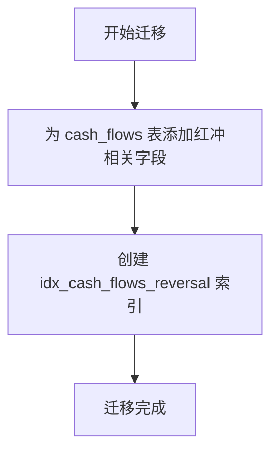
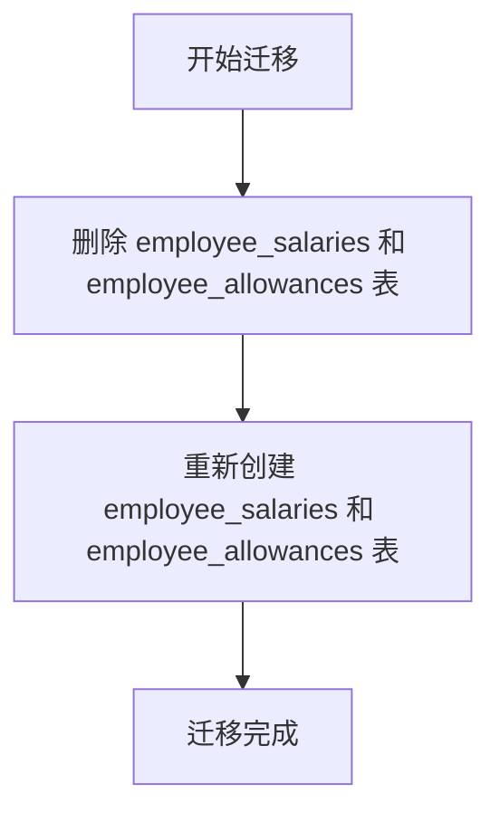
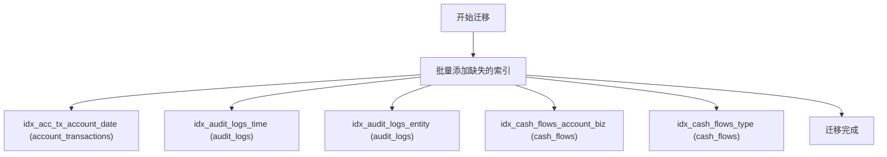
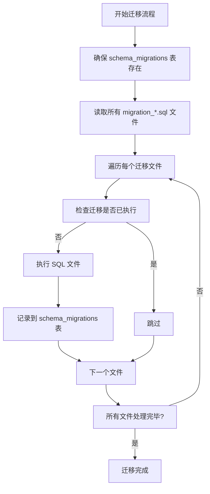

# 迁移最佳实践

<cite>
**本文档引用的文件**
- [migration_add_cash_flow_reversal_fields.sql](file://backend/src/db/migration_add_cash_flow_reversal_fields.sql)
- [migration_force_recreate_salary_tables.sql](file://backend/src/db/migration_force_recreate_salary_tables.sql)
- [migration_audit_fixes_indexes_20241217.sql](file://backend/src/db/migration_audit_fixes_indexes_20241217.sql)
- [migration_add_departments_sort_order.sql](file://backend/src/db/migration_add_departments_sort_order.sql)
- [migration_add_salary_tables.sql](file://backend/src/db/migration_add_salary_tables.sql)
- [migration_update_hq_org_departments.sql](file://backend/src/db/migration_update_hq_org_departments.sql)
- [schema.sql](file://backend/src/db/schema.sql)
- [0000_chemical_may_parker.sql](file://backend/drizzle/0000_chemical_may_parker.sql)
- [drizzle.config.ts](file://backend/drizzle.config.ts)
- [index.ts](file://backend/src/db/index.ts)
- [migrate_hq_org_departments.ts](file://backend/src/db/migrate_hq_org_departments.ts)
- [migrate-up.ts](file://backend/scripts/migrate-up.ts)
- [check-migrations.ts](file://backend/scripts/check-migrations.ts)
- [V2_MIGRATION_GUIDE.md](file://backend/test/V2_MIGRATION_GUIDE.md)
</cite>

## 目录
1. [引言](#引言)
2. [迁移类型与策略](#迁移类型与策略)
3. [可逆性与补偿机制](#可逆性与补偿机制)
4. [数据迁移与模式迁移分离](#数据迁移与模式迁移分离)
5. [迁移工具与执行流程](#迁移工具与执行流程)
6. [版本控制与代码审查](#版本控制与代码审查)
7. [测试环境验证](#测试环境验证)
8. [生产环境灰度发布](#生产环境灰度发布)
9. [结论](#结论)

## 引言

数据库迁移是财务系统演进过程中的关键环节，直接影响数据完整性、系统稳定性和业务连续性。本指南基于项目中已有的迁移文件和实践，制定并阐述数据库迁移的最佳实践。通过分析`migration_add_cash_flow_reversal_fields.sql`、`migration_force_recreate_salary_tables.sql`和`migration_audit_fixes_indexes_20241217.sql`等具体案例，我们将探讨不同类型变更的处理策略，强调编写可逆或可补偿迁移的重要性，并提供从开发到生产部署的完整流程建议。

**本文档引用的文件**
- [migration_add_cash_flow_reversal_fields.sql](file://backend/src/db/migration_add_cash_flow_reversal_fields.sql)
- [migration_force_recreate_salary_tables.sql](file://backend/src/db/migration_force_recreate_salary_tables.sql)
- [migration_audit_fixes_indexes_20241217.sql](file://backend/src/db/migration_audit_fixes_indexes_20241217.sql)

## 迁移类型与策略

数据库迁移根据其变更性质可分为三类：结构增强、模式重构和性能优化。每种类型都有其特定的处理策略和风险考量。

### 结构增强：安全地添加新字段

结构增强是最常见的迁移类型，旨在为现有表添加新功能所需的数据字段。`migration_add_cash_flow_reversal_fields.sql`是此类迁移的典范。

该迁移通过`ALTER TABLE`语句为`cash_flows`表安全地添加了四个新字段：`is_reversal`、`reversal_of_flow_id`、`is_reversed`和`reversed_by_flow_id`，以支持现金流水的红冲（冲正）功能。所有新字段都设置了合理的默认值（如`DEFAULT 0`），确保了向后兼容性，即旧数据在迁移后依然有效。此外，迁移脚本还创建了`idx_cash_flows_reversal`索引，以优化基于`reversal_of_flow_id`的查询性能。

这种策略的核心是**非破坏性变更**。它不修改现有数据，只扩展表结构，因此风险较低，是推荐的日常变更方式。



**图示来源**
- [migration_add_cash_flow_reversal_fields.sql](file://backend/src/db/migration_add_cash_flow_reversal_fields.sql)

**本节来源**
- [migration_add_cash_flow_reversal_fields.sql](file://backend/src/db/migration_add_cash_flow_reversal_fields.sql)

### 模式重构：激进的表结构变更

当现有表结构无法满足业务需求，且无法通过增量修改实现时，可能需要进行模式重构。`migration_force_recreate_salary_tables.sql`展示了这种激进但必要的方法。

该迁移首先使用`DROP TABLE IF EXISTS`语句删除了`employee_salaries`和`employee_allowances`两个旧表，然后使用`CREATE TABLE`语句重新创建了它们。新表结构可能包含了更合理的字段定义、约束或索引。这种操作是**高风险**的，因为它会永久删除现有数据。

项目中的`migration_add_salary_tables.sql`文件的存在表明，最初是通过`CREATE TABLE IF NOT EXISTS`来创建这些表的，这是一种安全的初始化方式。而`migration_force_recreate_salary_tables.sql`的出现，说明在系统发展的某个阶段，必须对薪资表进行彻底的重构。

执行此类迁移时，必须有完整的数据备份和恢复计划，并且通常需要在维护窗口内进行，以最小化对业务的影响。



**图示来源**
- [migration_force_recreate_salary_tables.sql](file://backend/src/db/migration_force_recreate_salary_tables.sql)

**本节来源**
- [migration_force_recreate_salary_tables.sql](file://backend/src/db/migration_force_recreate_salary_tables.sql)
- [migration_add_salary_tables.sql](file://backend/src/db/migration_add_salary_tables.sql)

### 性能优化：索引调整

性能优化类迁移不改变数据的逻辑结构，而是通过调整物理结构来提升查询效率。`migration_audit_fixes_indexes_20241217.sql`是这类迁移的代表。

该迁移脚本一次性为多个表创建了多个索引：
- 为`account_transactions`表创建了`idx_acc_tx_account_date`复合索引，优化按账户和日期查询的性能。
- 为`audit_logs`表创建了`idx_audit_logs_time`和`idx_audit_logs_entity`索引，加速按时间和实体查询审计日志。
- 为`cash_flows`表创建了`idx_cash_flows_account_biz`和`idx_cash_flows_type`索引。

这类迁移通常基于性能监控和审计报告（如脚本注释中提到的"Audit Report 2024-12-17"）来识别瓶颈。它们是安全的，因为`CREATE INDEX IF NOT EXISTS`语句确保了即使索引已存在，也不会报错。然而，创建索引会增加写操作的开销并占用存储空间，因此应基于实际查询需求进行。



**图示来源**
- [migration_audit_fixes_indexes_20241217.sql](file://backend/src/db/migration_audit_fixes_indexes_20241217.sql)

**本节来源**
- [migration_audit_fixes_indexes_20241217.sql](file://backend/src/db/migration_audit_fixes_indexes_20241217.sql)

## 可逆性与补偿机制

编写可逆的迁移是最佳实践的核心。一个可逆的迁移意味着可以安全地“回滚”到迁移前的状态。然而，在某些情况下（如数据迁移），完全回滚可能不切实际或不可能。此时，应设计“补偿”机制。

### 可逆迁移示例

对于`ALTER TABLE ADD COLUMN`这类操作，其可逆形式是`ALTER TABLE DROP COLUMN`。例如，`migration_add_departments_sort_order.sql`为`departments`表添加了`sort_order`字段。其可逆迁移应为：
```sql
ALTER TABLE departments DROP COLUMN sort_order;
```

### 补偿机制

对于`DROP TABLE`或`UPDATE`等不可逆操作，应设计补偿脚本。例如，如果`migration_force_recreate_salary_tables.sql`导致问题，补偿机制不是重新运行该脚本，而是从备份中恢复旧表结构和数据，或者运行一个反向的`INSERT`脚本来恢复被删除的数据。

项目中的`migrate_hq_org_departments.ts`脚本（一个TypeScript脚本而非纯SQL）说明了复杂迁移的处理方式。它通过应用代码来查找或创建总部部门ID，然后更新`org_departments`表。这种迁移很难用纯SQL回滚，其补偿机制可能是将`project_id`重置为`NULL`。

**本节来源**
- [migration_add_departments_sort_order.sql](file://backend/src/db/migration_add_departments_sort_order.sql)
- [migration_update_hq_org_departments.sql](file://backend/src/db/migration_update_hq_org_departments.sql)
- [migrate_hq_org_departments.ts](file://backend/src/db/migrate_hq_org_departments.ts)

## 数据迁移与模式迁移分离

一个关键的最佳实践是将**模式迁移**（Schema Migration）与**数据迁移**（Data Migration）严格分离。

- **模式迁移**：仅包含`CREATE`、`ALTER`、`DROP`等DDL语句，用于修改数据库结构。
- **数据迁移**：包含`INSERT`、`UPDATE`、`DELETE`等DML语句，用于修改数据内容。

在本项目中，`migration_add_cash_flow_reversal_fields.sql`是一个纯粹的模式迁移，只修改了表结构。而`migration_update_hq_org_departments.sql`虽然名为“migration”，但它包含了`UPDATE`语句，属于数据迁移。这种混合命名容易造成混淆。

最佳实践是将数据迁移脚本与模式迁移脚本分开存放，并使用不同的命名约定（如`data_migration_*.sql`）。此外，复杂的数据迁移应使用应用代码（如`migrate_hq_org_departments.ts`）来执行，以便利用应用的业务逻辑和错误处理能力，而不是在SQL脚本中硬编码业务规则。

**本节来源**
- [migration_add_cash_flow_reversal_fields.sql](file://backend/src/db/migration_add_cash_flow_reversal_fields.sql)
- [migration_update_hq_org_departments.sql](file://backend/src/db/migration_update_hq_org_departments.sql)
- [migrate_hq_org_departments.ts](file://backend/src/db/migrate_hq_org_departments.ts)

## 迁移工具与执行流程

项目使用自定义的Node.js脚本进行迁移管理，而非标准的ORM迁移工具。

### 迁移追踪

`migrate-up.ts`和`check-migrations.ts`脚本通过一个名为`schema_migrations`的追踪表来记录已执行的迁移。每次成功执行一个迁移文件，其文件名（作为版本号）、执行时间和校验和（checksum）都会被插入到该表中。`check-migrations.ts`脚本可以检查哪些迁移已执行、哪些待执行，甚至能检测到已执行的迁移文件是否被修改过（通过校验和比对）。

### 执行流程

`migrate-up.ts`脚本的执行流程如下：
1. 确保`schema_migrations`表存在。
2. 读取`src/db`目录下所有以`migration_`开头的`.sql`文件，并按文件名排序。
3. 对每个迁移文件，检查其是否已在`schema_migrations`表中记录。
4. 如果未记录，则通过`wrangler d1 execute`命令执行该SQL文件，并记录执行结果。
5. 如果执行失败，脚本会捕获特定的错误（如“列已存在”），并智能地将其视为“已执行”以避免阻塞，然后继续执行后续迁移。

这种设计确保了迁移的幂等性和可重复执行性。



**图示来源**
- [migrate-up.ts](file://backend/scripts/migrate-up.ts)

**本节来源**
- [migrate-up.ts](file://backend/scripts/migrate-up.ts)
- [check-migrations.ts](file://backend/scripts/check-migrations.ts)

## 版本控制与代码审查

所有迁移文件（`.sql`和`.ts`）都应纳入Git等版本控制系统。每次提交迁移脚本都应附带清晰的提交信息，说明变更的目的和影响。

代码审查（Code Review）是防止错误迁移进入生产环境的关键防线。审查者应重点关注：
- 迁移的可逆性或补偿方案。
- 是否遵循了模式迁移与数据迁移分离的原则。
- SQL语句的正确性和潜在性能影响（如是否需要索引）。
- 是否有遗漏的边界情况（如处理`NULL`值）。

例如，`migration_add_departments_sort_order.sql`在添加`sort_order`字段后，立即执行`UPDATE`语句将“总部”的排序设为0。审查者应确认这个逻辑是正确的，并且不会影响其他部门。

**本节来源**
- [migration_add_departments_sort_order.sql](file://backend/src/db/migration_add_departments_sort_order.sql)

## 测试环境验证

在任何迁移进入生产环境之前，必须在与生产环境尽可能一致的测试环境中进行充分验证。

1. **单元测试**：为涉及迁移的业务逻辑编写单元测试。例如，当`cash_flows`表添加了红冲字段后，应测试红冲功能是否正常工作。
2. **集成测试**：在测试数据库上执行迁移脚本，然后运行应用的集成测试套件，确保所有功能正常。
3. **性能测试**：对于性能优化迁移（如添加索引），应在测试环境中使用生产级别的数据量进行查询性能测试，验证优化效果。

项目中的`V2_MIGRATION_GUIDE.md`文件虽然主要关于API迁移，但它强调了测试的重要性，这同样适用于数据库迁移。

**本节来源**
- [V2_MIGRATION_GUIDE.md](file://backend/test/V2_MIGRATION_GUIDE.md)

## 生产环境灰度发布

对于高风险的迁移（如模式重构），应采用灰度发布策略，而不是一次性全量上线。

1. **备份**：在执行任何生产迁移前，必须对数据库进行完整备份。
2. **小范围验证**：如果可能，先在生产环境的一个子集（如一个非关键部门）上执行迁移，观察效果。
3. **监控**：在迁移执行期间和之后，密切监控系统性能、错误日志和业务指标。
4. **回滚计划**：准备好明确的回滚步骤。对于可逆迁移，回滚就是执行反向脚本。对于不可逆迁移，回滚就是从备份中恢复。

`migrate-up.ts`脚本的智能错误处理（将“已存在”错误视为成功）本身就是一种灰度发布的思想，它允许脚本在部分执行失败的情况下继续，避免了因单个迁移失败而导致整个流程中断。

**本节来源**
- [migrate-up.ts](file://backend/scripts/migrate-up.ts)

## 结论

成功的数据库迁移依赖于严谨的规划、正确的工具和严格的流程。通过分析本项目的实践，我们总结出以下核心原则：
1. **优先选择非破坏性变更**：尽可能使用`ALTER TABLE ADD COLUMN`等安全操作。
2. **确保可逆性或提供补偿**：为每一次迁移设计回退方案。
3. **分离关注点**：严格区分模式迁移和数据迁移。
4. **自动化与追踪**：使用工具自动执行和追踪迁移状态。
5. **全面验证**：在测试环境中充分验证，再谨慎地在生产环境中发布。

遵循这些最佳实践，可以最大限度地降低数据库迁移的风险，确保财务系统的稳定和数据的完整。