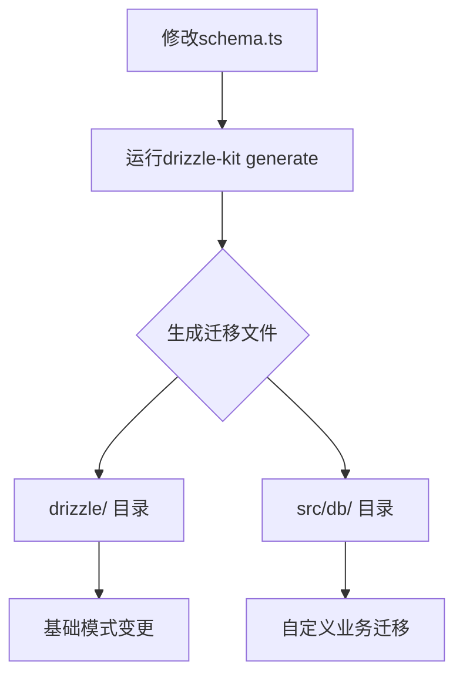
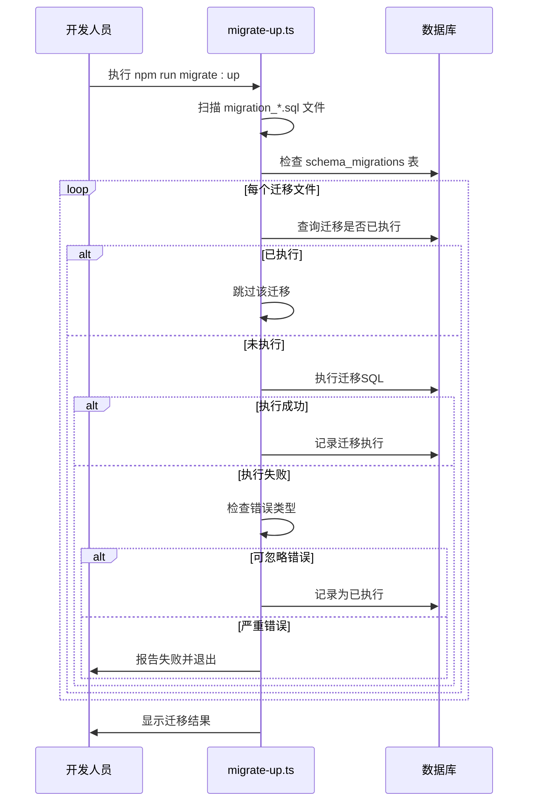
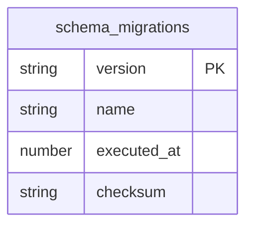

# 迁移管理

<cite>
**本文档引用的文件**   
- [drizzle.config.ts](file://backend/drizzle.config.ts)
- [migrate-up.ts](file://backend/scripts/migrate-up.ts)
- [schema.ts](file://backend/src/db/schema.ts)
- [schema.sql](file://backend/src/db/schema.sql)
- [migration_add_cash_flow_reversal_fields.sql](file://backend/src/db/migration_add_cash_flow_reversal_fields.sql)
- [migration_add_salary_tables.sql](file://backend/src/db/migration_add_salary_tables.sql)
- [migration_add_departments_sort_order.sql](file://backend/src/db/migration_add_departments_sort_order.sql)
- [migration_audit_fixes_indexes_20241217.sql](file://backend/src/db/migration_audit_fixes_indexes_20241217.sql)
- [migration_force_recreate_salary_tables.sql](file://backend/src/db/migration_force_recreate_salary_tables.sql)
- [migration_update_hq_org_departments.sql](file://backend/src/db/migration_update_hq_org_departments.sql)
- [_journal.json](file://backend/drizzle/meta/_journal.json)
- [0000_chemical_may_parker.sql](file://backend/drizzle/0000_chemical_may_parker.sql)
- [0000_snapshot.json](file://backend/drizzle/meta/0000_snapshot.json)
</cite>

## 目录
1. [引言](#引言)
2. [Drizzle ORM迁移机制概述](#drizzle-orm迁移机制概述)
3. [迁移文件生成与管理](#迁移文件生成与管理)
4. [现有迁移脚本分析](#现有迁移脚本分析)
5. [自动化迁移流程](#自动化迁移流程)
6. [迁移历史与快照管理](#迁移历史与快照管理)
7. [最佳实践指南](#最佳实践指南)
8. [生产环境迁移安全步骤](#生产环境迁移安全步骤)
9. [结论](#结论)

## 引言
本文档详细说明了基于Drizzle ORM的数据库迁移管理机制。系统采用结构化的迁移策略，通过SQL脚本和自动化脚本确保数据库模式变更的安全性和可追溯性。迁移系统设计考虑了开发、测试和生产环境的不同需求，提供了完整的迁移生命周期管理。

## Drizzle ORM迁移机制概述

本系统采用Drizzle ORM作为数据库抽象层，结合自定义迁移脚本实现数据库模式管理。迁移机制的核心是将数据库变更作为版本化脚本进行管理，确保所有环境的数据库状态一致。

系统配置文件`drizzle.config.ts`定义了Drizzle ORM的基本配置：
- **dialect**: 使用SQLite作为数据库方言
- **schema**: 指向`./src/db/schema.ts`作为数据模型定义文件
- **out**: 指定迁移文件输出目录为`./drizzle`

该配置使得Drizzle ORM能够根据TypeScript定义的数据模型生成相应的数据库迁移文件。

**Section sources**
- [drizzle.config.ts](file://backend/drizzle.config.ts#L1-L8)

## 迁移文件生成与管理

### drizzle-kit迁移文件生成

系统使用`drizzle-kit`工具生成数据库迁移文件。开发人员通过以下步骤创建迁移：

1. 在`src/db/schema.ts`中定义或修改数据模型
2. 运行`npm run db:generate`命令生成迁移文件
3. 生成的迁移文件会自动放置在`drizzle/`目录下

`drizzle-kit`会比较当前数据模型与数据库快照的差异，生成相应的SQL迁移脚本。每个迁移文件都有唯一的版本号前缀（如`0000_chemical_may_parker.sql`），确保迁移的有序执行。

### 迁移文件命名与组织

迁移文件采用以下命名约定：
- 基础迁移文件：`0000_chemical_may_parker.sql`（由drizzle-kit生成）
- 自定义迁移文件：以`migration_`为前缀，后接描述性名称，如`migration_add_cash_flow_reversal_fields.sql`

所有自定义迁移脚本存储在`src/db/`目录下，而由drizzle-kit生成的迁移文件存储在`drizzle/`目录下。这种分离设计使得开发人员可以灵活地管理不同类型的迁移。



**Diagram sources**
- [drizzle.config.ts](file://backend/drizzle.config.ts#L3-L7)
- [schema.ts](file://backend/src/db/schema.ts#L1-L706)

**Section sources**
- [drizzle.config.ts](file://backend/drizzle.config.ts#L1-L8)
- [schema.ts](file://backend/src/db/schema.ts#L1-L706)

## 现有迁移脚本分析

### 现金流水红冲字段迁移

`migration_add_cash_flow_reversal_fields.sql`脚本为现金流水表添加了红冲功能所需的新字段：

```sql
ALTER TABLE cash_flows ADD COLUMN is_reversal INTEGER DEFAULT 0;
ALTER TABLE cash_flows ADD COLUMN reversal_of_flow_id TEXT;
ALTER TABLE cash_flows ADD COLUMN is_reversed INTEGER DEFAULT 0;
ALTER TABLE cash_flows ADD COLUMN reversed_by_flow_id TEXT;
```

该迁移还创建了索引以优化查询性能：
```sql
CREATE INDEX IF NOT EXISTS idx_cash_flows_reversal ON cash_flows(reversal_of_flow_id);
```

这些字段的用途如下：
- **is_reversal**: 标识是否为红冲记录
- **reversal_of_flow_id**: 关联被冲正的原始流水ID
- **is_reversed**: 标识是否已被冲正
- **reversed_by_flow_id**: 关联冲正记录ID

**Section sources**
- [migration_add_cash_flow_reversal_fields.sql](file://backend/src/db/migration_add_cash_flow_reversal_fields.sql#L1-L18)

### 薪资表创建迁移

`migration_add_salary_tables.sql`脚本创建了薪资管理相关的两个新表：

```sql
CREATE TABLE IF NOT EXISTS employee_salaries (
  id TEXT PRIMARY KEY,
  employee_id TEXT NOT NULL,
  salary_type TEXT NOT NULL,
  currency_id TEXT NOT NULL,
  amount_cents INTEGER NOT NULL,
  effective_date TEXT,
  created_at INTEGER,
  updated_at INTEGER
);
```

```sql
CREATE TABLE IF NOT EXISTS employee_allowances (
  id TEXT PRIMARY KEY,
  employee_id TEXT NOT NULL,
  allowance_type TEXT NOT NULL,
  currency_id TEXT NOT NULL,
  amount_cents INTEGER NOT NULL,
  created_at INTEGER,
  updated_at INTEGER
);
```

这些表用于存储员工的薪资和津贴信息，支持多种薪资类型（试用期、正式）和津贴类型（生活、住房、交通、餐补）。

**Section sources**
- [migration_add_salary_tables.sql](file://backend/src/db/migration_add_salary_tables.sql#L1-L21)

### 部门排序字段迁移

`migration_add_departments_sort_order.sql`脚本为部门表添加了排序功能：

```sql
ALTER TABLE departments ADD COLUMN sort_order INTEGER DEFAULT 100;
UPDATE departments SET sort_order = 0 WHERE name = '总部';
```

该迁移首先添加`sort_order`字段，默认值为100，然后将"总部"部门的排序值设置为0，使其在列表中显示在最前面。

**Section sources**
- [migration_add_departments_sort_order.sql](file://backend/src/db/migration_add_departments_sort_order.sql#L1-L9)

### 审计索引优化迁移

`migration_audit_fixes_indexes_20241217.sql`脚本添加了多个性能优化索引：

```sql
CREATE INDEX IF NOT EXISTS idx_acc_tx_account_date ON account_transactions (account_id, transaction_date);
CREATE INDEX IF NOT EXISTS idx_audit_logs_time ON audit_logs (at);
CREATE INDEX IF NOT EXISTS idx_audit_logs_entity ON audit_logs (entity_id);
CREATE INDEX IF NOT EXISTS idx_cash_flows_account_biz ON cash_flows (account_id, biz_date);
CREATE INDEX IF NOT EXISTS idx_cash_flows_type ON cash_flows (type);
```

这些索引针对常见的查询模式进行了优化，显著提升了相关查询的性能。

**Section sources**
- [migration_audit_fixes_indexes_20241217.sql](file://backend/src/db/migration_audit_fixes_indexes_20241217.sql#L1-L13)

### 薪资表强制重建迁移

`migration_force_recreate_salary_tables.sql`脚本展示了如何安全地重建表结构：

```sql
DROP TABLE IF EXISTS employee_salaries;
DROP TABLE IF EXISTS employee_allowances;

CREATE TABLE employee_salaries (...);
CREATE TABLE employee_allowances (...);
```

这种模式适用于需要完全重构表结构的场景，通过先删除后创建的方式实现表的重建。

**Section sources**
- [migration_force_recreate_salary_tables.sql](file://backend/src/db/migration_force_recreate_salary_tables.sql#L1-L24)

### 总部组织部门迁移

`migration_update_hq_org_departments.sql`脚本处理了组织架构的逻辑变更：

```sql
UPDATE org_departments
SET project_id = (SELECT id FROM departments WHERE name = '总部' LIMIT 1)
WHERE project_id IS NULL
  AND EXISTS (SELECT 1 FROM departments WHERE name = '总部');
```

该迁移将所有`project_id`为空的组织部门更新为"总部"部门的ID，实现了组织架构的逻辑统一。

**Section sources**
- [migration_update_hq_org_departments.sql](file://backend/src/db/migration_update_hq_org_departments.sql#L1-L17)

## 自动化迁移流程

### migrate-up.ts脚本分析

`migrate-up.ts`脚本是系统自动化迁移的核心，实现了安全的迁移执行流程。该脚本的主要功能包括：

1. **迁移文件发现**: 扫描`src/db/`目录下所有以`migration_`开头的SQL文件
2. **执行状态检查**: 查询`schema_migrations`表检查迁移是否已执行
3. **迁移执行**: 按文件名排序后依次执行未执行的迁移
4. **执行记录**: 在成功执行后记录迁移信息

脚本的关键特性：
- **排序执行**: 迁移文件按名称排序，确保执行顺序
- **幂等性处理**: 对于"已存在"错误自动标记为已执行，避免重复执行
- **错误处理**: 区分可忽略的错误（如字段已存在）和严重错误
- **远程支持**: 支持本地和远程数据库迁移



**Diagram sources**
- [migrate-up.ts](file://backend/scripts/migrate-up.ts#L1-L183)

**Section sources**
- [migrate-up.ts](file://backend/scripts/migrate-up.ts#L1-L183)

### 迁移执行策略

系统采用以下迁移执行策略：

1. **文件排序**: 所有迁移文件按名称进行字典序排序
2. **状态检查**: 通过`schema_migrations`表跟踪每个迁移的执行状态
3. **校验和验证**: 计算每个迁移文件的SHA-256校验和用于完整性验证
4. **事务性执行**: 每个迁移文件作为一个独立的执行单元

这种策略确保了迁移的可预测性和可重复性，即使在部分失败的情况下也能安全恢复。

## 迁移历史与快照管理

### drizzle/meta目录

`drizzle/meta`目录是Drizzle ORM的元数据存储目录，包含以下重要文件：

- **0000_snapshot.json**: 数据库模式的JSON快照，用于比较和生成迁移
- **_journal.json**: 迁移执行日志，记录drizzle-kit的操作历史

`_journal.json`文件示例：
```json
{
  "version": "7",
  "dialect": "sqlite",
  "entries": [
    {
      "idx": 0,
      "version": "6",
      "when": 1765967452579,
      "tag": "0000_chemical_may_parker",
      "breakpoints": true
    }
  ]
}
```

该文件记录了drizzle-kit的每次操作，包括时间戳和版本信息。

### schema_migrations表

系统使用`schema_migrations`表来跟踪所有自定义迁移的执行状态。该表包含以下字段：
- **version**: 迁移文件名
- **name**: 迁移名称
- **executed_at**: 执行时间戳
- **checksum**: 文件SHA-256校验和

这个表是`migrate-up.ts`脚本判断迁移是否已执行的关键依据。



**Diagram sources**
- [migrate-up.ts](file://backend/scripts/migrate-up.ts#L73-L87)
- [drizzle/meta/_journal.json](file://backend/drizzle/meta/_journal.json#L1-L13)

**Section sources**
- [migrate-up.ts](file://backend/scripts/migrate-up.ts#L73-L87)
- [drizzle/meta/_journal.json](file://backend/drizzle/meta/_journal.json#L1-L13)

## 最佳实践指南

### 编写可逆迁移

编写可逆迁移是数据库迁移的最佳实践。虽然本系统中的迁移主要是单向的，但建议在可能的情况下提供回滚脚本。可逆迁移的示例模式：

```sql
-- Up: 添加字段
ALTER TABLE table_name ADD COLUMN new_column TEXT;

-- Down: 删除字段
ALTER TABLE table_name DROP COLUMN new_column;
```

对于无法安全删除的数据变更，应提供详细的回滚说明文档。

### 处理数据迁移

数据迁移应遵循以下原则：
1. **备份优先**: 在执行数据迁移前必须备份数据库
2. **分批处理**: 对大量数据的迁移应分批进行，避免长时间锁定
3. **验证机制**: 迁移后应有数据验证步骤
4. **回滚计划**: 准备好数据回滚方案

### 版本控制策略

迁移文件的版本控制应遵循：
1. **原子性**: 每个迁移文件只包含一个逻辑变更
2. **描述性命名**: 使用清晰的文件名描述迁移内容
3. **代码审查**: 所有迁移文件必须经过代码审查
4. **测试覆盖**: 在测试环境中验证迁移脚本

## 生产环境迁移安全步骤

在生产环境执行数据库迁移时，应遵循以下安全步骤：

1. **备份数据库**: 执行完整数据库备份
2. **检查依赖**: 确认迁移不会影响正在运行的服务
3. **维护窗口**: 在业务低峰期执行迁移
4. **逐步部署**: 先在预发布环境验证
5. **监控执行**: 实时监控迁移过程
6. **验证结果**: 迁移后验证数据完整性和应用功能
7. **准备回滚**: 确保能够快速回滚到备份状态

使用`npm run migrate:up:remote`命令执行远程数据库迁移，该命令会连接到生产环境的数据库并应用未执行的迁移。

## 结论

本系统的数据库迁移管理机制结合了Drizzle ORM的自动化能力和自定义脚本的灵活性。通过结构化的迁移文件、自动化执行脚本和完善的跟踪机制，确保了数据库变更的安全性和可追溯性。建议开发团队遵循文档中的最佳实践，确保数据库迁移过程的稳定和可靠。