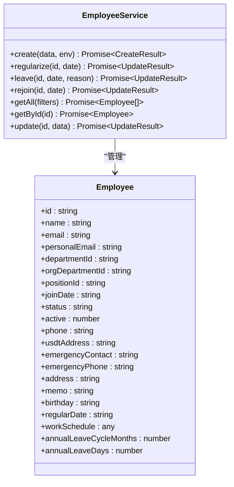
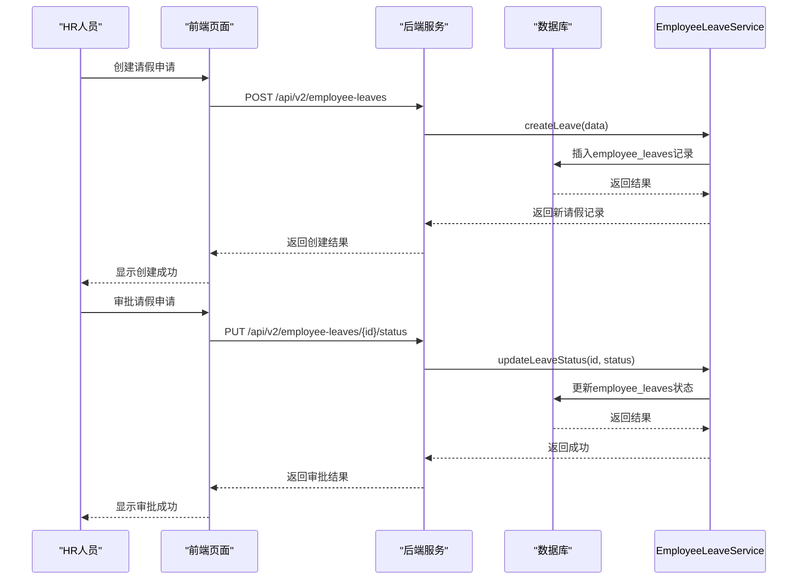
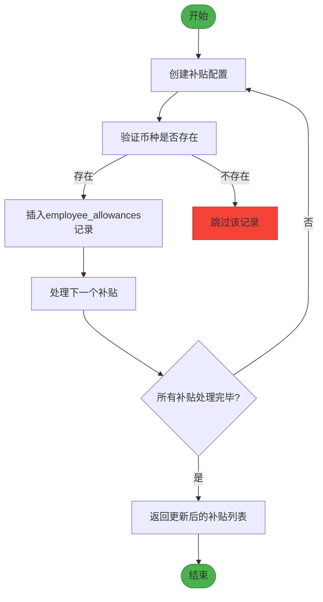
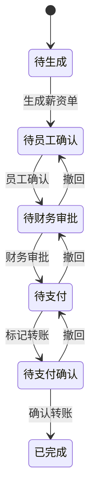

# 人事管理

<cite>
**本文档引用文件**  
- [EmployeeService.ts](file://backend/src/services/EmployeeService.ts)
- [EmployeeLeaveService.ts](file://backend/src/services/EmployeeLeaveService.ts)
- [AllowanceService.ts](file://backend/src/services/AllowanceService.ts)
- [SalaryService.ts](file://backend/src/services/SalaryService.ts)
- [employees.ts](file://backend/src/routes/v2/employees.ts)
- [employee-leaves.ts](file://backend/src/routes/v2/employee-leaves.ts)
- [employee-allowances.ts](file://backend/src/routes/v2/employee-allowances.ts)
- [employee-salaries.ts](file://backend/src/routes/v2/employee-salaries.ts)
- [schema.ts](file://backend/src/db/schema.ts)
- [EmployeeManagementPage.tsx](file://frontend/src/features/hr/pages/EmployeeManagementPage.tsx)
- [LeaveManagementPage.tsx](file://frontend/src/features/hr/pages/LeaveManagementPage.tsx)
- [AllowancePaymentsPage.tsx](file://frontend/src/features/hr/pages/AllowancePaymentsPage.tsx)
- [SalaryPaymentsPage.tsx](file://frontend/src/features/hr/pages/SalaryPaymentsPage.tsx)
- [employee.schema.ts](file://backend/src/schemas/employee.schema.ts)
- [domain.ts](file://frontend/src/types/domain.ts)
</cite>

## 目录
1. [员工全生命周期管理](#员工全生命周期管理)
2. [请假管理](#请假管理)
3. [津贴管理](#津贴管理)
4. [薪资管理](#薪资管理)
5. [HR操作流程](#hr操作流程)
6. [API接口使用示例](#api接口使用示例)

## 员工全生命周期管理

员工全生命周期管理是人事管理的核心功能，涵盖了员工从入职到离职的全过程。系统通过`EmployeeService`类实现员工状态的变更管理，包括入职、转正和离职等关键操作。

当HR创建新员工时，系统会自动生成公司邮箱（如`zhangsan@cloudflarets.com`），并创建用户账号。员工状态初始为`probation`（试用期）。转正操作通过`regularize`方法实现，将员工状态从`probation`更新为`regular`（正式），并记录转正日期。离职操作通过`leave`方法实现，将员工状态设置为`resigned`（已离职），并禁用其登录权限。员工重新入职时，可通过`rejoin`方法将其状态恢复为`probation`，并更新入职日期。

系统还提供了丰富的员工信息查询功能，包括按状态、部门、职位等条件筛选员工列表。员工的详细信息包括基本信息（姓名、联系方式）、工作信息（部门、职位、入职日期）、薪资信息（试用期/正式工资）和津贴信息（生活/住房/交通/伙食补贴）等。



**图源**
- [EmployeeService.ts](file://backend/src/services/EmployeeService.ts#L11-L757)
- [schema.ts](file://backend/src/db/schema.ts#L14-L48)

**节源**
- [EmployeeService.ts](file://backend/src/services/EmployeeService.ts#L20-L564)
- [employees.ts](file://backend/src/routes/v2/employees.ts#L156-L483)
- [EmployeeManagementPage.tsx](file://frontend/src/features/hr/pages/EmployeeManagementPage.tsx#L19-L366)

## 请假管理

请假管理功能通过`EmployeeLeaveService`类实现，支持员工请假申请的创建、查询和审批。请假类型包括病假、年假、事假和其他类型。请假申请的状态包括`pending`（待审批）、`approved`（已批准）和`rejected`（已拒绝）。

HR或员工本人可以在前端页面创建请假申请，填写请假类型、开始日期、结束日期、天数和原因等信息。系统会自动计算请假天数。创建后，申请状态为`pending`，等待审批。审批人（具有审批权限的HR或主管）可以在系统中查看待审批的请假申请，并进行批准或拒绝操作。审批通过后，状态变为`approved`，并记录审批人和审批时间。

系统还提供了请假统计功能，可以按年份和员工查询已使用的各类假期天数，便于HR进行假期管理。



**图源**
- [EmployeeLeaveService.ts](file://backend/src/services/EmployeeLeaveService.ts#L7-L181)
- [employee-leaves.ts](file://backend/src/routes/v2/employee-leaves.ts#L8-L175)
- [LeaveManagementPage.tsx](file://frontend/src/features/hr/pages/LeaveManagementPage.tsx#L29-L562)

**节源**
- [EmployeeLeaveService.ts](file://backend/src/services/EmployeeLeaveService.ts#L100-L149)
- [employee-leaves.ts](file://backend/src/routes/v2/employee-leaves.ts#L84-L122)
- [LeaveManagementPage.tsx](file://frontend/src/features/hr/pages/LeaveManagementPage.tsx#L29-L562)

## 津贴管理

津贴管理功能通过`AllowanceService`类实现，支持对员工各类补贴的配置和发放。系统支持的补贴类型包括生活补贴、住房补贴、交通补贴、伙食补贴和生日补贴等。

HR可以在系统中为员工配置各类补贴的金额。系统支持批量更新功能，可以一次性为员工更新多种币种的补贴金额。当员工的补贴配置发生变化时，系统会先删除该类型的所有现有记录，然后插入新的记录。

补贴发放管理通过`AllowancePaymentService`实现，HR可以创建补贴发放记录，记录发放的年份、月份、补贴类型、金额、发放方式和凭证等信息。系统支持上传发放凭证（如转账截图），并提供查看功能。



**图源**
- [AllowanceService.ts](file://backend/src/services/AllowanceService.ts#L8-L176)
- [employee-allowances.ts](file://backend/src/routes/v2/employee-allowances.ts#L10-L260)
- [AllowancePaymentsPage.tsx](file://frontend/src/features/hr/pages/AllowancePaymentsPage.tsx#L38-L573)

**节源**
- [AllowanceService.ts](file://backend/src/services/AllowanceService.ts#L31-L176)
- [employee-allowances.ts](file://backend/src/routes/v2/employee-allowances.ts#L94-L259)
- [AllowancePaymentsPage.tsx](file://frontend/src/features/hr/pages/AllowancePaymentsPage.tsx#L38-L573)

## 薪资管理

薪资管理功能通过`SalaryService`类实现，支持对员工薪资的配置和计算。系统区分试用期工资和正式工资，支持多种币种。HR可以为员工配置不同币种的薪资金额。

薪资发放流程通过`SalaryPaymentService`实现，是一个多步骤的审批流程。首先由财务人员生成薪资单，状态为`pending_employee_confirmation`。员工确认后，状态变为`pending_finance_approval`。财务审批通过后，状态变为`pending_payment`。财务标记转账后，状态变为`pending_payment_confirmation`。最后财务上传转账凭证并确认，状态变为`completed`。

系统支持薪资的币种分配功能，可以将一笔以USDT计价的薪资分配到多个不同币种的账户中。分配申请需要经过审批流程。



**图源**
- [SalaryService.ts](file://backend/src/services/SalaryService.ts#L8-L185)
- [employee-salaries.ts](file://backend/src/routes/v2/employee-salaries.ts#L10-L257)
- [SalaryPaymentsPage.tsx](file://frontend/src/features/hr/pages/SalaryPaymentsPage.tsx#L24-L684)

**节源**
- [SalaryService.ts](file://backend/src/services/SalaryService.ts#L31-L185)
- [employee-salaries.ts](file://backend/src/routes/v2/employee-salaries.ts#L91-L256)
- [SalaryPaymentsPage.tsx](file://frontend/src/features/hr/pages/SalaryPaymentsPage.tsx#L24-L684)

## HR操作流程

HR人员在系统中主要通过四个页面进行操作：员工管理、请假管理、补贴发放管理和薪资发放管理。

在**员工管理**页面，HR可以查看所有员工的列表，按状态、部门等条件筛选。可以新建员工，编辑员工信息，管理员工账号（重置密码、重置2FA、启用/停用账号）。员工的详细信息通过展开行显示，包括联系方式、薪资、补贴等敏感信息，这些信息的查看受权限控制。

在**请假管理**页面，HR可以创建、编辑和删除请假申请。可以审批待处理的请假申请。系统提供了按员工、请假类型和状态的筛选功能。

在**补贴发放管理**页面，HR可以生成某年某月所有员工的补贴发放记录，也可以为单个员工创建发放记录。可以上传发放凭证，便于后续审计。

在**薪资发放管理**页面，HR（财务）可以生成薪资单，处理薪资发放的全流程，包括员工确认、财务审批、标记转账和确认转账。

## API接口使用示例

### 创建员工
```http
POST /api/v2/employees
Content-Type: application/json

{
  "name": "张三",
  "personalEmail": "zhangsan@gmail.com",
  "orgDepartmentId": "org-dept-1",
  "positionId": "pos-1",
  "joinDate": "2024-01-01"
}
```

### 创建请假申请
```http
POST /api/v2/employee-leaves
Content-Type: application/json

{
  "employeeId": "emp-123",
  "leaveType": "annual",
  "startDate": "2024-01-01",
  "endDate": "2024-01-05",
  "days": 5,
  "reason": "年假休息"
}
```

### 批量更新员工津贴
```http
PUT /api/v2/employee-allowances/batch
Content-Type: application/json

{
  "employeeId": "emp-123",
  "allowanceType": "living",
  "allowances": [
    {
      "currencyId": "USDT",
      "amountCents": 10000
    },
    {
      "currencyId": "CNY",
      "amountCents": 70000
    }
  ]
}
```

### 生成薪资单
```http
POST /api/v2/salary-payments/generate
Content-Type: application/json

{
  "year": 2024,
  "month": 1
}
```

### 最佳实践
1. **权限控制**：确保只有授权的HR人员才能执行敏感操作，如创建员工、审批请假、发放薪资等。
2. **数据验证**：在创建和更新数据时，系统会自动验证数据的完整性和正确性，如邮箱格式、币种存在性等。
3. **审计日志**：所有关键操作都会记录到审计日志中，包括操作人、操作时间、操作类型和详细信息，便于追踪和审计。
4. **凭证管理**：薪资和补贴发放应上传转账凭证，确保财务流程的可追溯性。
5. **状态机管理**：薪资发放等复杂流程采用状态机模式，确保流程的完整性和一致性。