# 员工管理

<cite>
**本文档引用文件**   
- [EmployeeService.ts](file://backend/src/services/EmployeeService.ts)
- [employees.ts](file://backend/src/routes/v2/employees.ts)
- [EmployeeManagementPage.tsx](file://frontend/src/features/hr/pages/EmployeeManagementPage.tsx)
- [EmployeeForm.tsx](file://frontend/src/features/employees/components/forms/EmployeeForm.tsx)
- [EmployeeFormModal.tsx](file://frontend/src/features/employees/components/modals/EmployeeFormModal.tsx)
- [schema.ts](file://backend/src/db/schema.ts)
- [EmailRoutingService.ts](file://backend/src/services/EmailRoutingService.ts)
- [EmailService.ts](file://backend/src/services/EmailService.ts)
- [employee.schema.ts](file://backend/src/schemas/employee.schema.ts)
</cite>

## 目录
1. [简介](#简介)
2. [核心组件](#核心组件)
3. [员工全生命周期管理](#员工全生命周期管理)
4. [员工状态机](#员工状态机)
5. [组织架构关联](#组织架构关联)
6. [前端操作流程](#前端操作流程)
7. [高级功能实现](#高级功能实现)
8. [常见问题解决方案](#常见问题解决方案)

## 简介
本系统提供完整的员工管理模块，涵盖员工从创建、转正、离职到复职的全生命周期管理。系统通过EmployeeService服务类实现核心业务逻辑，结合Cloudflare邮件路由服务实现企业邮箱自动配置，并通过前端组件提供直观的操作界面。员工状态采用状态机模式进行管理，确保状态转换的合法性。

## 核心组件

### EmployeeService
作为员工管理的核心服务类，EmployeeService负责处理所有员工相关的业务逻辑，包括创建、更新、状态变更等操作。该服务与数据库直接交互，并集成邮件服务以实现账号激活功能。

**Section sources**
- [EmployeeService.ts](file://backend/src/services/EmployeeService.ts#L11-L758)

### 员工数据模型
员工数据模型包含基本信息、组织架构信息和认证信息，统一存储在employees表中。该设计简化了用户与员工的关联管理。

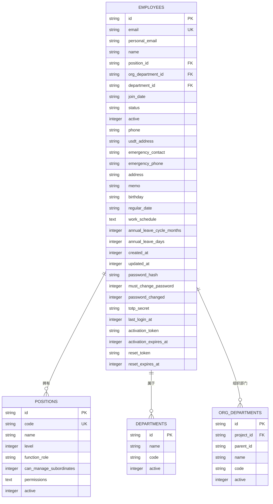

**Diagram sources**
- [schema.ts](file://backend/src/db/schema.ts#L14-L48)
- [schema.ts](file://backend/src/db/schema.ts#L50-L63)
- [schema.ts](file://backend/src/db/schema.ts#L65-L74)
- [schema.ts](file://backend/src/db/schema.ts#L95-L109)

## 员工全生命周期管理

### 创建员工
创建员工是员工生命周期的起点，系统会自动完成以下操作：
1. 生成企业邮箱地址
2. 创建员工记录
3. 配置邮件路由规则
4. 生成账号激活令牌

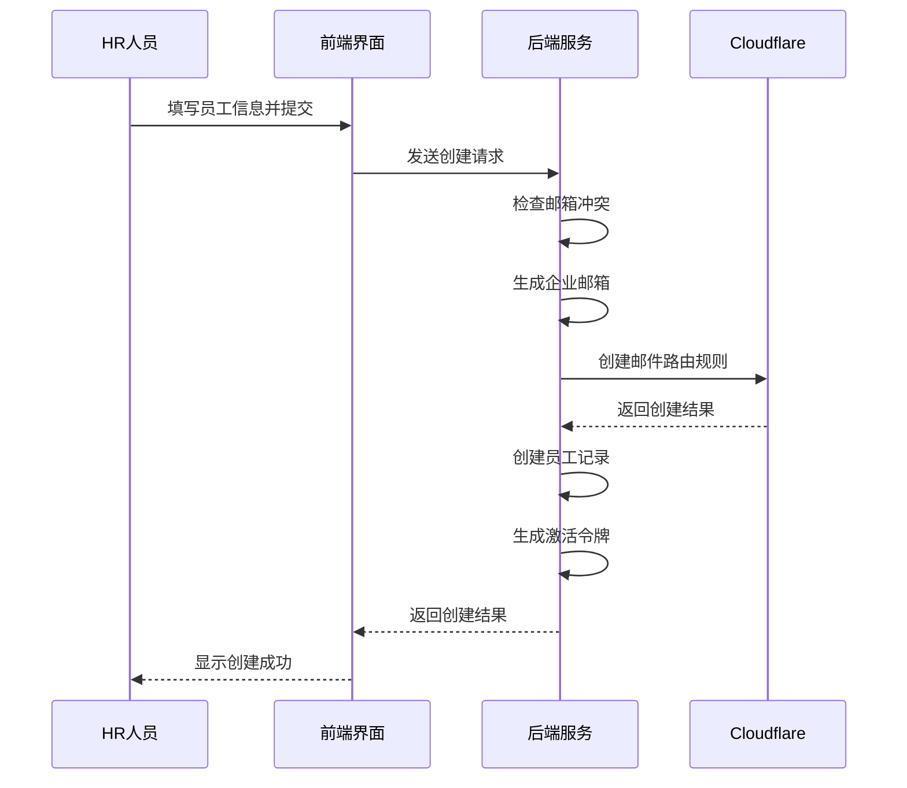

**Diagram sources**
- [EmployeeService.ts](file://backend/src/services/EmployeeService.ts#L20-L233)
- [employees.ts](file://backend/src/routes/v2/employees.ts#L184-L241)

### 转正员工
员工试用期结束后，HR可执行转正操作，将员工状态从"试用"变更为"正式"。

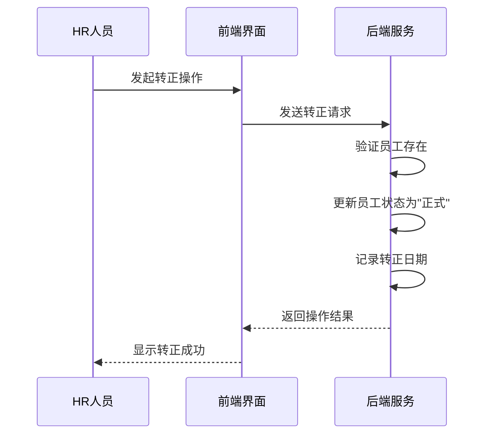

**Diagram sources**
- [EmployeeService.ts](file://backend/src/services/EmployeeService.ts#L485-L502)
- [employees.ts](file://backend/src/routes/v2/employees.ts#L428-L440)

### 离职员工
当员工离职时，系统会更新其状态并禁用账号登录权限。

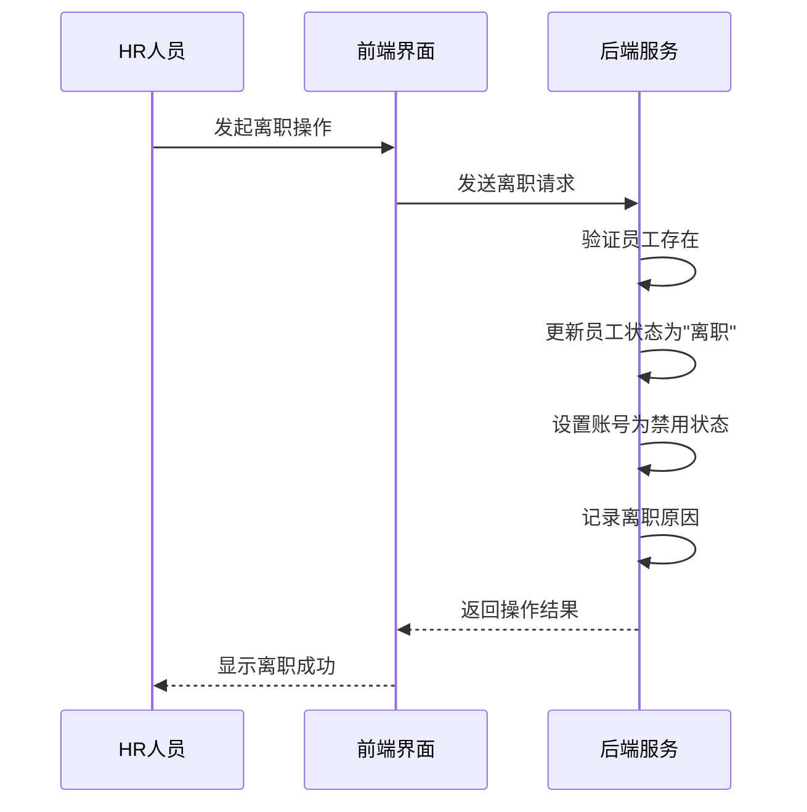

**Diagram sources**
- [EmployeeService.ts](file://backend/src/services/EmployeeService.ts#L504-L535)
- [employees.ts](file://backend/src/routes/v2/employees.ts#L471-L483)

### 复职员工
已离职员工重新入职时，可执行复职操作，恢复其账号并更新入职日期。

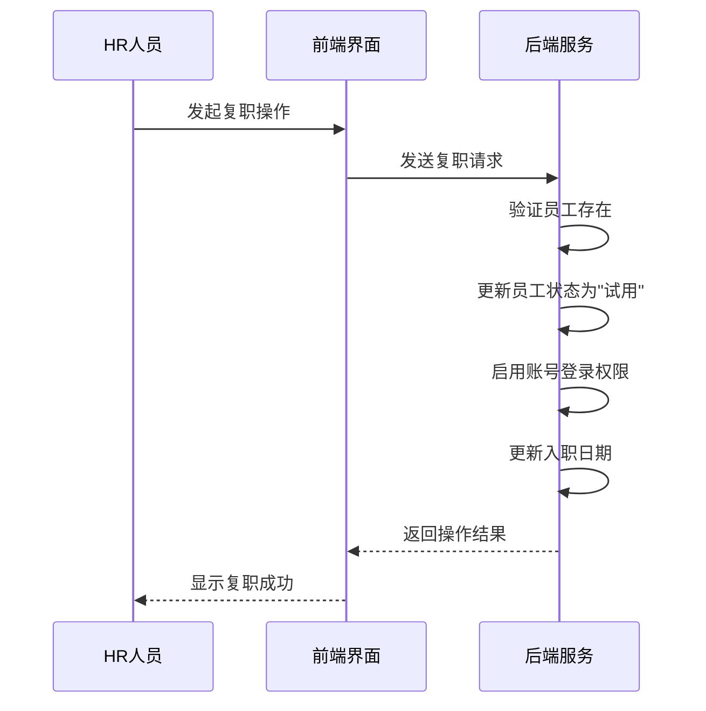

**Diagram sources**
- [EmployeeService.ts](file://backend/src/services/EmployeeService.ts#L537-L564)
- [employees.ts](file://backend/src/routes/v2/employees.ts#L514-L526)

## 员工状态机

### 状态定义
系统定义了三种主要员工状态：
- **试用** (probation): 新员工入职后的初始状态
- **正式** (regular): 试用期结束后的正式员工状态
- **离职** (resigned): 员工离职后的状态

### 状态转换规则
员工状态遵循严格的转换规则，确保业务流程的正确性。

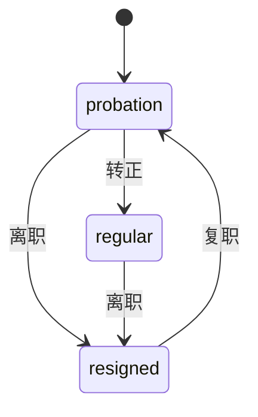

**Diagram sources**
- [EmployeeService.ts](file://backend/src/services/EmployeeService.ts#L160-L161)
- [EmployeeService.ts](file://backend/src/services/EmployeeService.ts#L494-L495)
- [EmployeeService.ts](file://backend/src/services/EmployeeService.ts#L513-L514)
- [EmployeeService.ts](file://backend/src/services/EmployeeService.ts#L546-L547)

## 组织架构关联

### 部门与职位管理
员工与部门、职位之间存在明确的关联关系，支持灵活的组织架构管理。

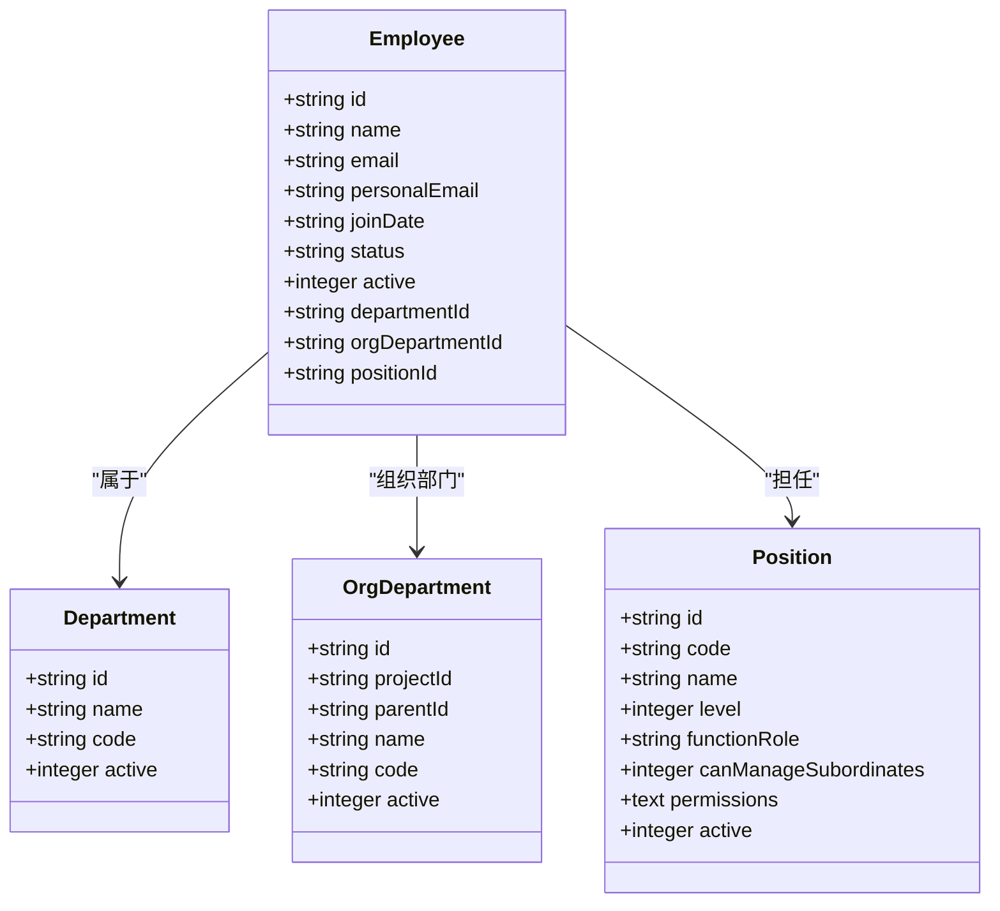

**Diagram sources**
- [schema.ts](file://backend/src/db/schema.ts#L14-L48)
- [schema.ts](file://backend/src/db/schema.ts#L50-L63)
- [schema.ts](file://backend/src/db/schema.ts#L65-L74)
- [schema.ts](file://backend/src/db/schema.ts#L95-L109)

## 前端操作流程

### 员工管理界面
HR人员通过员工管理界面进行员工信息维护，界面提供完整的操作功能。

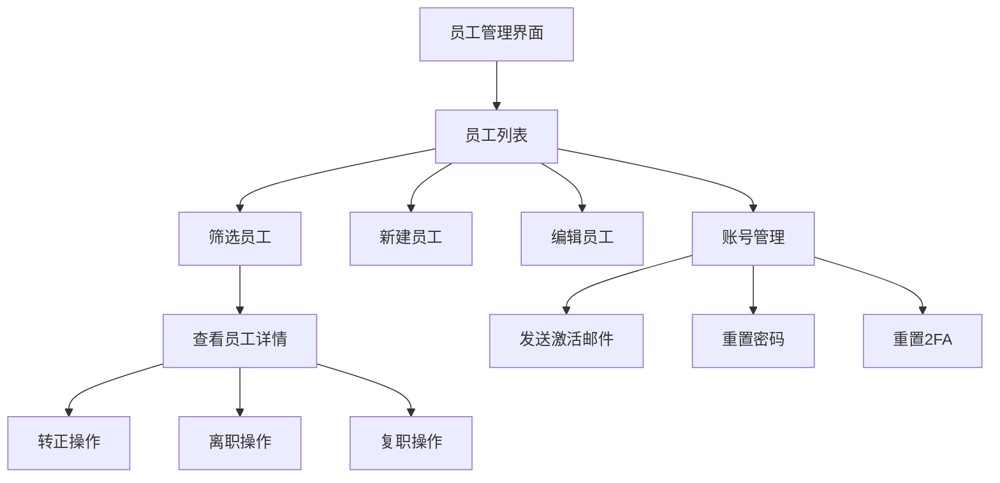

**Diagram sources**
- [EmployeeManagementPage.tsx](file://frontend/src/features/hr/pages/EmployeeManagementPage.tsx#L1-L367)

### 员工信息表单
员工信息表单采用多标签页设计，分类展示员工信息。

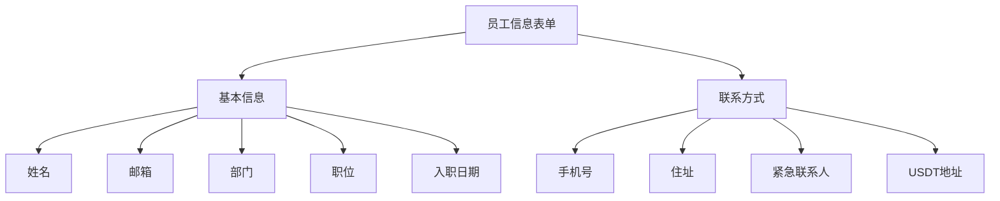

**Diagram sources**
- [EmployeeForm.tsx](file://frontend/src/features/employees/components/forms/EmployeeForm.tsx#L1-L315)

## 高级功能实现

### 邮箱自动生成
系统根据员工姓名自动生成企业邮箱地址，避免重复。

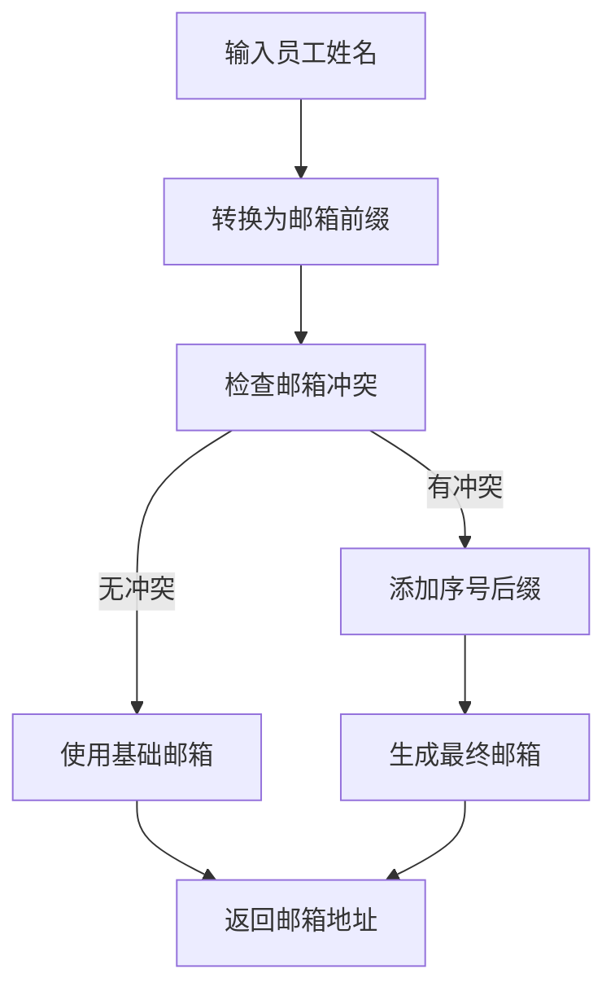

**Diagram sources**
- [EmailRoutingService.ts](file://backend/src/services/EmailRoutingService.ts#L39-L55)

### Cloudflare邮件路由集成
系统与Cloudflare邮件路由服务集成，实现邮件自动转发。

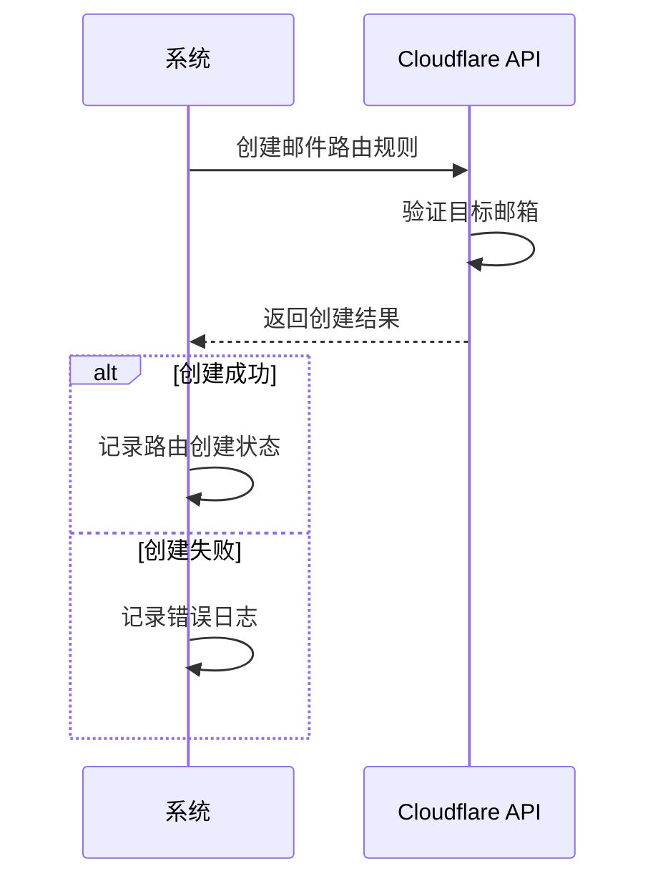

**Diagram sources**
- [EmailRoutingService.ts](file://backend/src/services/EmailRoutingService.ts#L119-L168)
- [EmployeeService.ts](file://backend/src/services/EmployeeService.ts#L172-L183)

### 账号激活流程
新员工通过激活邮件设置初始密码，完成账号激活。

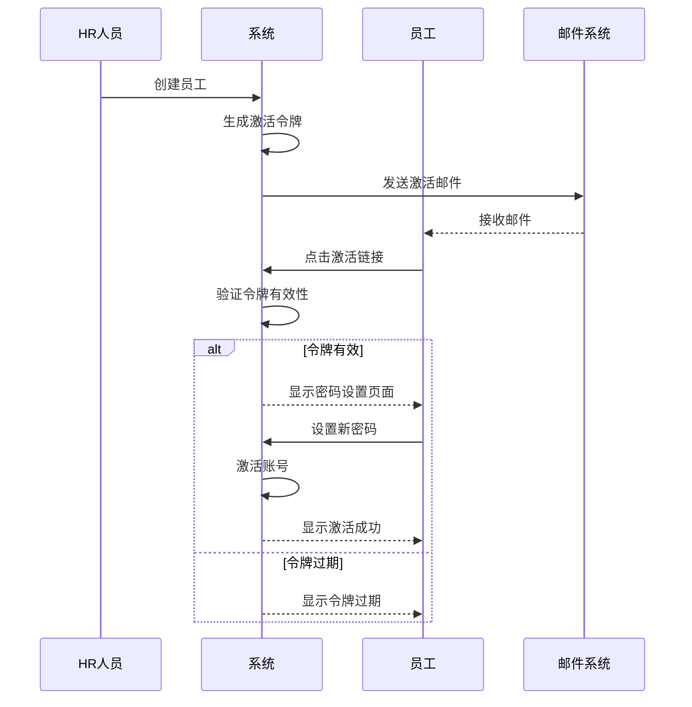

**Diagram sources**
- [EmployeeService.ts](file://backend/src/services/EmployeeService.ts#L186-L202)
- [EmailService.ts](file://backend/src/services/EmailService.ts#L197-L247)

## 常见问题解决方案

### 邮箱冲突
当系统检测到邮箱地址冲突时，会自动生成带序号的邮箱地址。

**解决方案**:
1. 系统自动检测现有邮箱
2. 生成基础邮箱前缀
3. 检查冲突并添加序号
4. 返回唯一邮箱地址

**Section sources**
- [EmailRoutingService.ts](file://backend/src/services/EmailRoutingService.ts#L46-L52)

### 状态变更失败
状态变更失败通常由权限不足或状态转换不合法引起。

**解决方案**:
1. 检查操作者权限
2. 验证当前状态是否允许目标状态转换
3. 记录错误日志
4. 返回明确的错误信息

**Section sources**
- [EmployeeService.ts](file://backend/src/services/EmployeeService.ts#L486-L489)
- [EmployeeService.ts](file://backend/src/services/EmployeeService.ts#L491-L499)