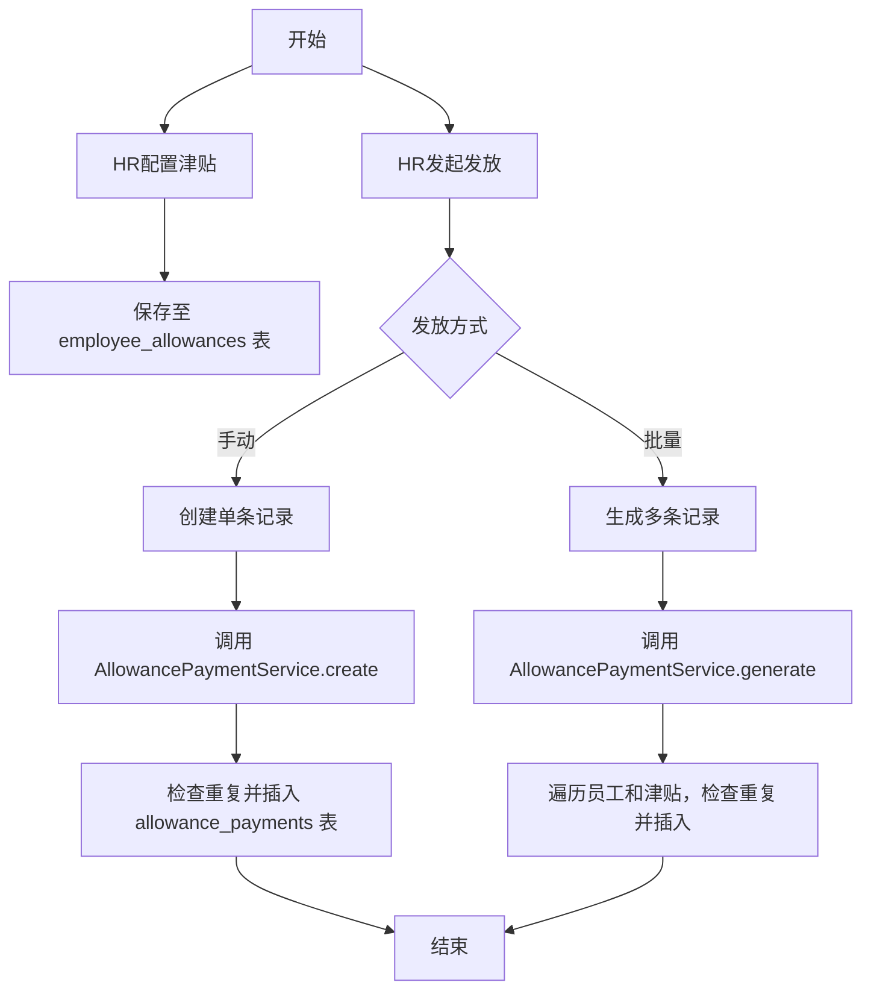
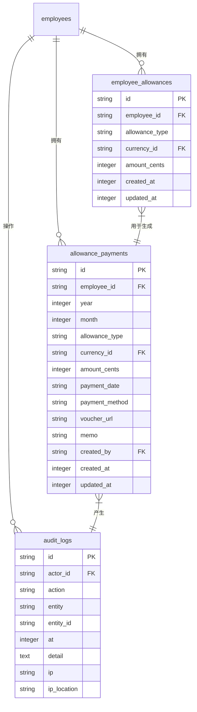

# 津贴管理

<cite>
**本文档引用文件**   
- [AllowanceService.ts](file://backend/src/services/AllowanceService.ts)
- [AllowancePaymentService.ts](file://backend/src/services/AllowancePaymentService.ts)
- [allowance-payments.ts](file://backend/src/routes/v2/allowance-payments.ts)
- [schema.ts](file://backend/src/db/schema.ts)
- [AllowancePaymentsPage.tsx](file://frontend/src/features/hr/pages/AllowancePaymentsPage.tsx)
- [AllowanceConfigModal.tsx](file://frontend/src/features/employees/components/modals/AllowanceConfigModal.tsx)
- [allowance.schema.ts](file://frontend/src/validations/allowance.schema.ts)
- [useAllowances.ts](file://frontend/src/hooks/business/useAllowances.ts)
- [state-machine.ts](file://backend/src/utils/state-machine.ts)
- [audit.ts](file://backend/src/utils/audit.ts)
</cite>

## 目录
1. [简介](#简介)
2. [核心组件](#核心组件)
3. [津贴配置与发放流程](#津贴配置与发放流程)
4. [状态机与审计追踪](#状态机与审计追踪)
5. [前端界面与操作流程](#前端界面与操作流程)
6. [数据一致性与重试机制](#数据一致性与重试机制)
7. [配置实例](#配置实例)

## 简介
本系统为财务管理系统中的津贴管理模块，核心功能由`AllowanceService`和`AllowancePaymentService`两个服务协同实现。`AllowanceService`负责管理员工的津贴类型和金额配置，而`AllowancePaymentService`则负责根据配置生成和管理具体的津贴发放记录。该模块支持多币种、多类型的津贴（如交通补贴、餐补、生日补贴等），并提供了批量生成、手动创建、凭证上传等完整功能。通过前端`AllowancePaymentsPage`和`AllowanceConfigModal`组件，HR可以方便地进行配置和执行发放操作，系统通过状态机和审计日志确保了数据的一致性和可追溯性。

## 核心组件

`AllowanceService`和`AllowancePaymentService`是本模块的两个核心后端服务。`AllowanceService`主要处理员工津贴的增删改查，其数据存储在`employee_allowances`表中，记录了每个员工每种津贴的币种和金额。`AllowancePaymentService`则负责津贴的发放，其数据存储在`allowance_payments`表中，记录了每次发放的年月、金额、发放日期和方式等信息。两个服务通过员工ID和津贴类型进行关联，`AllowancePaymentService`在生成发放记录时会查询`AllowanceService`的配置。前端通过`useAllowances`等自定义Hook与后端API交互，实现了数据的获取和操作。

**Section sources**
- [AllowanceService.ts](file://backend/src/services/AllowanceService.ts)
- [AllowancePaymentService.ts](file://backend/src/services/AllowancePaymentService.ts)
- [useAllowances.ts](file://frontend/src/hooks/business/useAllowances.ts)

## 津贴配置与发放流程

津贴管理流程分为配置和发放两个阶段。首先，HR通过`AllowanceConfigModal`组件为员工配置津贴。该组件支持为同一津贴类型（如交通补贴）配置多种币种，例如同时配置人民币和美元。配置数据通过`AllowanceService`的`batchUpdate`方法保存到`employee_allowances`表中。

发放阶段分为手动创建和批量生成两种方式。手动创建通过`AllowancePaymentsPage`的“新建发放记录”模态框完成，HR填写员工、年月、金额等信息后，调用`AllowancePaymentService`的`create`方法。该方法会检查是否已存在相同员工、年月、类型和币种的发放记录，防止重复。批量生成是核心功能，HR在“生成补贴发放”模态框中指定年月和发放日期，点击生成后，系统会调用`AllowancePaymentService`的`generate`方法。该方法会查询所有在职员工及其津贴配置，为每个符合条件的员工（如生日补贴需检查生日月份）生成一条发放记录，并自动跳过已存在的记录。

**Diagram sources **
- [AllowanceService.ts](file://backend/src/services/AllowanceService.ts#L103-L170)
- [AllowancePaymentService.ts](file://backend/src/services/AllowancePaymentService.ts#L155-L230)
- [AllowancePaymentsPage.tsx](file://frontend/src/features/hr/pages/AllowancePaymentsPage.tsx#L105-L127)
- [AllowanceConfigModal.tsx](file://frontend/src/features/employees/components/modals/AllowanceConfigModal.tsx#L47-L66)

## 状态机与审计追踪

本模块虽未明确定义津贴发放的状态机，但其设计遵循了状态管理的原则。发放记录的生命周期从“待发放”（创建后）到“已发放”（生成或手动创建后），最终状态为“已发放”，系统通过数据库的唯一索引`idx_unq_allowance_payments_emp_period_type`来保证同一员工在同一个月内同一种类的津贴不会被重复发放，这起到了类似状态机终态的作用。

系统通过强大的审计追踪功能记录所有操作。每次创建、更新或删除发放记录时，都会调用`logAuditAction`函数。该函数会记录操作者ID、操作类型（create, update, delete）、实体类型（allowance_payment）、实体ID以及操作详情。IP信息和地理位置也一并记录，增强了安全性。这些日志存储在`audit_logs`表中，可用于后续的审计和问题排查。

**Diagram sources **
- [schema.ts](file://backend/src/db/schema.ts#L231-L267)
- [allowance-payments.ts](file://backend/src/routes/v2/allowance-payments.ts#L210-L222)
- [audit.ts](file://backend/src/utils/audit.ts#L33-L89)

## 前端界面与操作流程

HR通过`AllowancePaymentsPage`页面进行津贴发放管理。页面顶部提供按年份、月份、补贴类型和员工的筛选条件。主体部分是一个数据表格，展示所有发放记录，包含员工、部门、年月、金额、发放日期等信息。操作栏提供“编辑”和“删除”按钮。

页面工具栏提供“生成补贴发放”和“新建发放记录”两个主要操作按钮。点击“生成补贴发放”会弹出一个模态框，HR需填写年月和发放日期，系统将自动为所有符合条件的员工生成发放记录。点击“新建发放记录”则可手动创建单条记录，需填写员工、年月、金额、发放日期等详细信息，并支持上传凭证图片。

津贴的配置则在员工管理的上下文中完成，通过`AllowanceConfigModal`组件实现。该组件以模态框形式弹出，允许HR为特定员工的特定津贴类型（如住房补贴）配置多币种金额，支持动态添加和删除币种配置。

**Section sources**
- [AllowancePaymentsPage.tsx](file://frontend/src/features/hr/pages/AllowancePaymentsPage.tsx)
- [AllowanceConfigModal.tsx](file://frontend/src/features/employees/components/modals/AllowanceConfigModal.tsx)

## 数据一致性与重试机制

系统通过多种机制保障数据一致性。首先，`allowance_payments`表上建立了唯一索引，确保了发放记录的唯一性，防止了因网络重试等原因导致的重复发放。其次，在生成批量发放记录时，系统会先查询现有记录并构建一个集合，避免了在循环中重复插入。

对于失败的发放操作，系统提供了重试机制。如果批量生成因网络或服务问题中断，HR可以重新点击“生成”按钮。由于系统有重复检查机制，只会为缺失的记录生成新的发放项，而不会影响已成功生成的记录，从而保证了幂等性。此外，所有操作都记录了详细的审计日志，即使出现问题，也可以通过日志追溯原因并进行人工干预。

**Section sources**
- [AllowancePaymentService.ts](file://backend/src/services/AllowancePaymentService.ts#L171-L184)
- [allowance-payments.ts](file://backend/src/routes/v2/allowance-payments.ts#L62-L74)

## 配置实例

以下是两种常见津贴类型的配置实例：

**交通补贴配置实例**：
- **津贴类型**: 交通补贴
- **配置方式**: HR在员工管理界面，为员工张三打开“交通补贴配置”模态框。
- **多币种配置**:
  - 币种: CNY (人民币), 金额: 500元
  - 币种: USD (美元), 金额: 70元
- **发放规则**: 每月15日随工资一同发放。
- **系统行为**: 每月批量生成时，系统会为张三生成两条发放记录，一条人民币500元，一条美元70元。

**生日补贴配置实例**：
- **津贴类型**: 生日补贴
- **配置方式**: HR为员工李四配置生日补贴，金额为1000元人民币。
- **特殊规则**: 该津贴类型有特殊逻辑，`AllowancePaymentService`在生成时会检查员工的生日月份。
- **系统行为**: 假设李四的生日在5月，系统只会在每年5月为他生成一条1000元的生日补贴发放记录，其他月份则跳过。

**Section sources**
- [AllowanceConfigModal.tsx](file://frontend/src/features/employees/components/modals/AllowanceConfigModal.tsx)
- [AllowancePaymentService.ts](file://backend/src/services/AllowancePaymentService.ts#L198-L203)