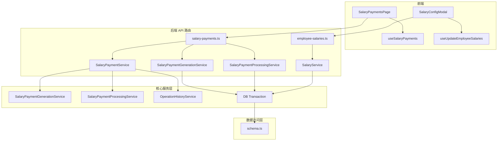
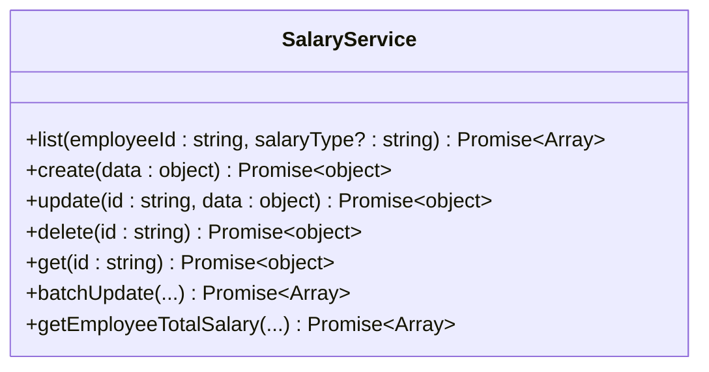
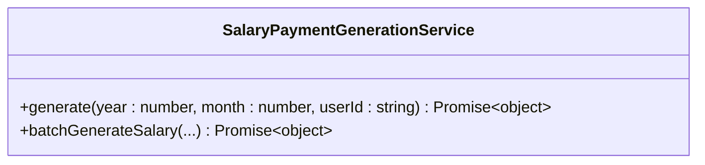
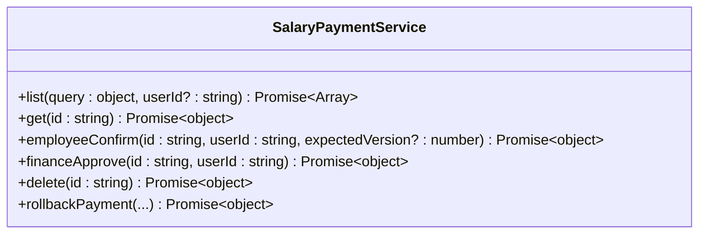
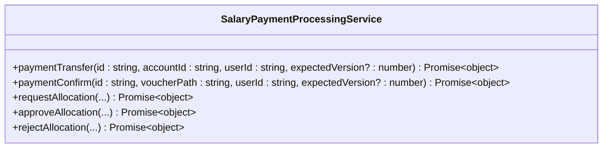
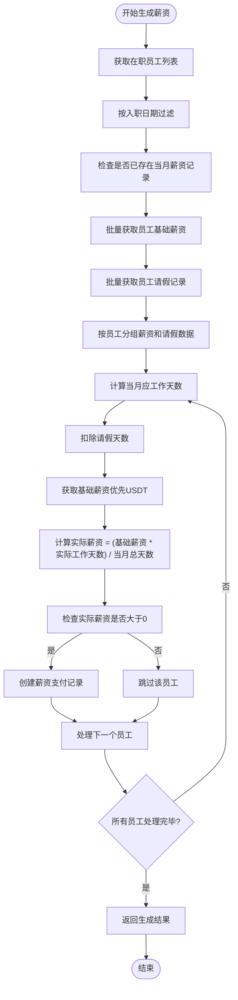
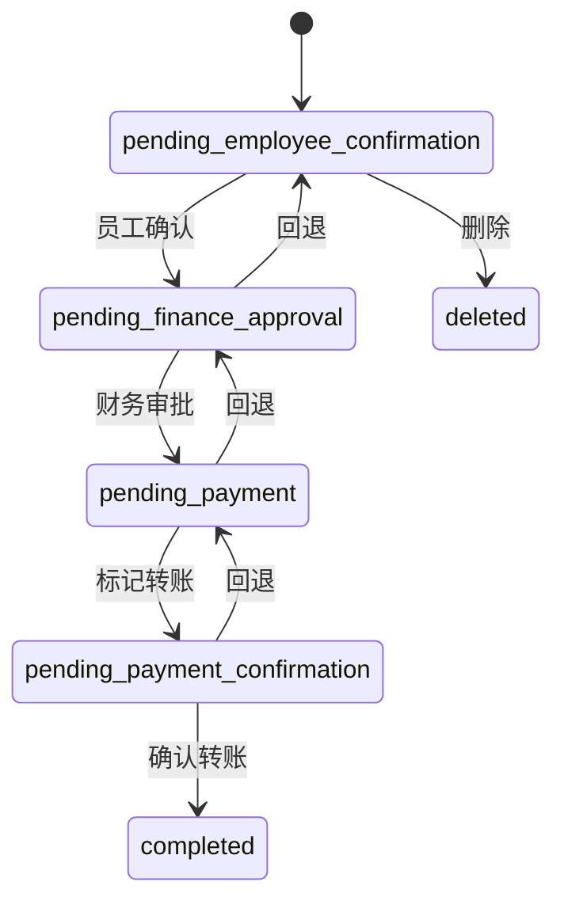
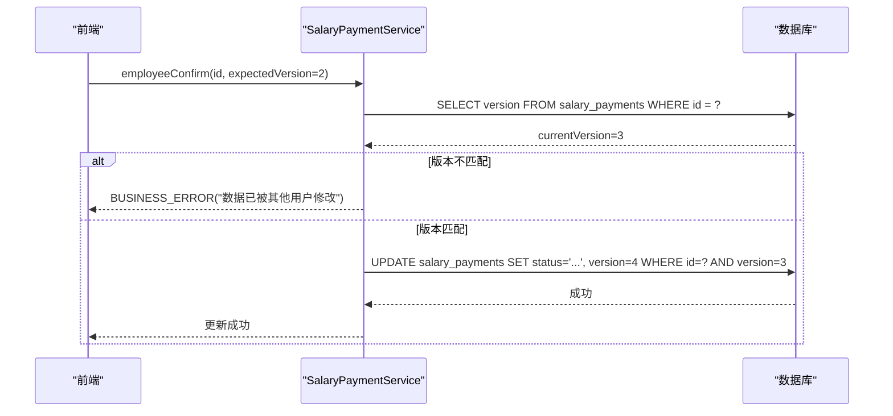
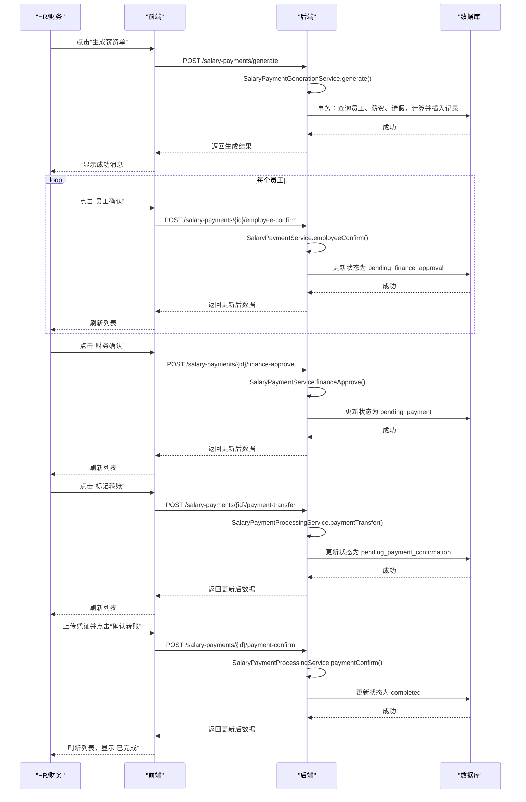

# 薪资管理

<cite>
**本文档引用文件**   
- [SalaryService.ts](file://backend/src/services/SalaryService.ts)
- [SalaryPaymentService.ts](file://backend/src/services/SalaryPaymentService.ts)
- [SalaryPaymentGenerationService.ts](file://backend/src/services/SalaryPaymentGenerationService.ts)
- [SalaryPaymentProcessingService.ts](file://backend/src/services/SalaryPaymentProcessingService.ts)
- [SalaryPaymentsPage.tsx](file://frontend/src/features/hr/pages/SalaryPaymentsPage.tsx)
- [SalaryConfigModal.tsx](file://frontend/src/features/employees/components/modals/SalaryConfigModal.tsx)
- [schema.ts](file://backend/src/db/schema.ts)
- [state-machine.ts](file://backend/src/utils/state-machine.ts)
- [optimistic-lock.ts](file://backend/src/utils/optimistic-lock.ts)
- [salary-payments.ts](file://backend/src/routes/v2/salary-payments.ts)
- [useSalaryPayments.ts](file://frontend/src/hooks/business/useSalaryPayments.ts)
- [salary.schema.ts](file://frontend/src/validations/salary.schema.ts)
- [status.tsx](file://frontend/src/utils/status.tsx)
</cite>

## 目录
1. [引言](#引言)
2. [核心服务架构](#核心服务架构)
3. [薪资计算与生成流程](#薪资计算与生成流程)
4. [薪资发放状态流转](#薪资发放状态流转)
5. [幂等性保障与并发控制](#幂等性保障与并发控制)
6. [前端操作流程](#前端操作流程)
7. [异常处理与数据修复](#异常处理与数据修复)
8. [性能优化建议](#性能优化建议)
9. [结论](#结论)

## 引言

本技术文档旨在深入剖析财务系统中的薪资管理模块，系统阐述 `SalaryService`、`SalaryPaymentService`、`SalaryPaymentGenerationService` 和 `SalaryPaymentProcessingService` 四大核心服务的协作架构。文档将详细解析从薪资配置、批量生成、支付处理到状态追踪的完整业务流程，重点说明系统如何通过状态机、乐观锁和事务一致性来保障薪资发放的准确性和可靠性。同时，结合前端 `SalaryPaymentsPage` 和 `SalaryConfigModal` 组件，说明人力资源（HR）进行薪资配置、生成、发放和对账的完整操作流程。最后，提供薪资发放失败的诊断方法、数据修复指南和性能优化建议。

**Section sources**
- [SalaryService.ts](file://backend/src/services/SalaryService.ts#L1-L186)
- [SalaryPaymentService.ts](file://backend/src/services/SalaryPaymentService.ts#L1-L326)
- [SalaryPaymentGenerationService.ts](file://backend/src/services/SalaryPaymentGenerationService.ts#L1-L278)
- [SalaryPaymentProcessingService.ts](file://backend/src/services/SalaryPaymentProcessingService.ts#L1-L378)

## 核心服务架构

薪资管理模块采用分层服务架构，将不同的业务职责解耦，确保代码的可维护性和扩展性。

**Diagram sources**
- [SalaryPaymentsPage.tsx](file://frontend/src/features/hr/pages/SalaryPaymentsPage.tsx#L1-L685)
- [SalaryConfigModal.tsx](file://frontend/src/features/employees/components/modals/SalaryConfigModal.tsx#L1-L104)
- [salary-payments.ts](file://backend/src/routes/v2/salary-payments.ts#L1-L604)
- [SalaryPaymentService.ts](file://backend/src/services/SalaryPaymentService.ts#L1-L326)
- [SalaryPaymentGenerationService.ts](file://backend/src/services/SalaryPaymentGenerationService.ts#L1-L278)
- [SalaryPaymentProcessingService.ts](file://backend/src/services/SalaryPaymentProcessingService.ts#L1-L378)
- [SalaryService.ts](file://backend/src/services/SalaryService.ts#L1-L186)
- [schema.ts](file://backend/src/db/schema.ts#L1-L706)

**Section sources**
- [SalaryPaymentsPage.tsx](file://frontend/src/features/hr/pages/SalaryPaymentsPage.tsx#L1-L685)
- [SalaryConfigModal.tsx](file://frontend/src/features/employees/components/modals/SalaryConfigModal.tsx#L1-L104)
- [salary-payments.ts](file://backend/src/routes/v2/salary-payments.ts#L1-L604)
- [SalaryPaymentService.ts](file://backend/src/services/SalaryPaymentService.ts#L1-L326)
- [SalaryPaymentGenerationService.ts](file://backend/src/services/SalaryPaymentGenerationService.ts#L1-L278)
- [SalaryPaymentProcessingService.ts](file://backend/src/services/SalaryPaymentProcessingService.ts#L1-L378)
- [SalaryService.ts](file://backend/src/services/SalaryService.ts#L1-L186)
- [schema.ts](file://backend/src/db/schema.ts#L1-L706)

### SalaryService

`SalaryService` 负责管理员工的基础薪资配置。它提供了对 `employee_salaries` 表的增删改查操作，支持按员工ID和薪资类型（试用期/转正）查询薪资。该服务是薪资计算的起点，为后续的薪资生成提供基础数据。

**Diagram sources**
- [SalaryService.ts](file://backend/src/services/SalaryService.ts#L8-L186)

### SalaryPaymentGenerationService

`SalaryPaymentGenerationService` 是薪资计算引擎的核心。它根据员工的在职状态、入职日期、请假记录和基础薪资配置，计算出当月应发薪资。该服务在生成薪资单时会进行幂等性检查，避免重复生成。

**Diagram sources**
- [SalaryPaymentGenerationService.ts](file://backend/src/services/SalaryPaymentGenerationService.ts#L18-L278)

### SalaryPaymentService

`SalaryPaymentService` 是薪资支付流程的控制中心。它负责处理薪资支付记录的查询、员工确认和财务审批等核心流程。该服务通过状态机（`salaryPaymentStateMachine`）来严格控制状态流转，确保业务流程的合规性。

**Diagram sources**
- [SalaryPaymentService.ts](file://backend/src/services/SalaryPaymentService.ts#L22-L326)

### SalaryPaymentProcessingService

`SalaryPaymentProcessingService` 负责处理支付转账、凭证确认和多币种分配等支付处理逻辑。它与 `SalaryPaymentService` 紧密协作，共同完成薪资发放的最后阶段。

**Diagram sources**
- [SalaryPaymentProcessingService.ts](file://backend/src/services/SalaryPaymentProcessingService.ts#L23-L378)

## 薪资计算与生成流程

薪资的生成是一个复杂的计算过程，涉及多个数据源的整合与计算。

**Diagram sources**
- [SalaryPaymentGenerationService.ts](file://backend/src/services/SalaryPaymentGenerationService.ts#L21-L210)

**Section sources**
- [SalaryPaymentGenerationService.ts](file://backend/src/services/SalaryPaymentGenerationService.ts#L21-L210)
- [schema.ts](file://backend/src/db/schema.ts#L286-L316)

## 薪资发放状态流转

薪资发放的整个生命周期由一个严格的状态机进行管理，确保每一步操作都符合预定义的业务规则。

**Diagram sources**
- [state-machine.ts](file://backend/src/utils/state-machine.ts#L48-L54)
- [SalaryPaymentService.ts](file://backend/src/services/SalaryPaymentService.ts#L133-L149)
- [SalaryPaymentProcessingService.ts](file://backend/src/services/SalaryPaymentProcessingService.ts#L55-L89)

**Section sources**
- [state-machine.ts](file://backend/src/utils/state-machine.ts#L48-L54)
- [SalaryPaymentService.ts](file://backend/src/services/SalaryPaymentService.ts#L133-L149)
- [SalaryPaymentProcessingService.ts](file://backend/src/services/SalaryPaymentProcessingService.ts#L55-L89)
- [status.tsx](file://frontend/src/utils/status.tsx#L53-L59)

## 幂等性保障与并发控制

系统通过多种机制确保薪资发放的幂等性和数据一致性。

### 乐观锁机制

在 `salary_payments` 和 `employee_leaves` 等关键表中，引入了 `version` 字段作为乐观锁的版本号。当更新记录时，服务会检查客户端传入的 `expectedVersion` 是否与数据库中的 `currentVersion` 一致。如果不一致，则抛出并发修改错误，防止数据被覆盖。

**Diagram sources**
- [optimistic-lock.ts](file://backend/src/utils/optimistic-lock.ts#L16-L32)
- [SalaryPaymentService.ts](file://backend/src/services/SalaryPaymentService.ts#L128-L130)
- [schema.ts](file://backend/src/db/schema.ts#L309)

### 事务一致性

所有涉及多个数据表更新的操作（如生成薪资、申请币种分配）都包裹在数据库事务中。这确保了操作的原子性，要么全部成功，要么全部回滚，避免了数据不一致。

**Section sources**
- [optimistic-lock.ts](file://backend/src/utils/optimistic-lock.ts#L16-L32)
- [SalaryPaymentService.ts](file://backend/src/services/SalaryPaymentService.ts#L128-L130)
- [SalaryPaymentGenerationService.ts](file://backend/src/services/SalaryPaymentGenerationService.ts#L22-L210)
- [SalaryPaymentProcessingService.ts](file://backend/src/services/SalaryPaymentProcessingService.ts#L228-L277)
- [schema.ts](file://backend/src/db/schema.ts#L309)

## 前端操作流程

HR用户通过 `SalaryPaymentsPage` 和 `SalaryConfigModal` 组件完成完整的薪资管理操作。

### 薪资配置流程

1.  HR在员工管理页面点击“配置薪资”。
2.  弹出 `SalaryConfigModal` 模态框，HR可以为员工配置试用期或转正后的多币种底薪。
3.  提交后，数据通过 `useUpdateEmployeeSalaries` 钩子发送到后端，由 `SalaryService` 处理并存入 `employee_salaries` 表。

### 薪资发放流程

1.  HR进入“薪资发放管理”页面 (`SalaryPaymentsPage`)。
2.  选择年份和月份，点击“生成薪资单”。
3.  后端 `SalaryPaymentGenerationService` 开始计算并生成所有符合条件员工的薪资支付记录，状态为“待员工确认”。
4.  员工登录系统，确认自己的薪资，状态变为“待财务审批”。
5.  财务人员审批通过，状态变为“待支付”。
6.  财务人员在“标记转账”对话框中选择转账账户，状态变为“待确认转账”。
7.  财务人员上传转账凭证，点击“确认转账”，状态变为“已完成”。

**Diagram sources**
- [SalaryPaymentsPage.tsx](file://frontend/src/features/hr/pages/SalaryPaymentsPage.tsx#L1-L685)
- [useSalaryPayments.ts](file://frontend/src/hooks/business/useSalaryPayments.ts#L71-L154)
- [salary-payments.ts](file://backend/src/routes/v2/salary-payments.ts#L84-L94)
- [SalaryPaymentGenerationService.ts](file://backend/src/services/SalaryPaymentGenerationService.ts#L21-L210)
- [SalaryPaymentService.ts](file://backend/src/services/SalaryPaymentService.ts#L117-L171)
- [SalaryPaymentProcessingService.ts](file://backend/src/services/SalaryPaymentProcessingService.ts#L30-L116)

**Section sources**
- [SalaryPaymentsPage.tsx](file://frontend/src/features/hr/pages/SalaryPaymentsPage.tsx#L1-L685)
- [useSalaryPayments.ts](file://frontend/src/hooks/business/useSalaryPayments.ts#L71-L154)
- [salary-payments.ts](file://backend/src/routes/v2/salary-payments.ts#L84-L94)
- [SalaryPaymentGenerationService.ts](file://backend/src/services/SalaryPaymentGenerationService.ts#L21-L210)
- [SalaryPaymentService.ts](file://backend/src/services/SalaryPaymentService.ts#L117-L171)
- [SalaryPaymentProcessingService.ts](file://backend/src/services/SalaryPaymentProcessingService.ts#L30-L116)

## 异常处理与数据修复

### 薪资发放失败诊断

当薪资发放失败时，应按以下步骤进行诊断：
1.  **检查状态机错误**：查看错误信息是否包含“不允许从状态 X 转换到 Y”，这表明操作顺序错误。
2.  **检查并发冲突**：如果错误信息为“数据已被其他用户修改”，说明发生了并发修改，需要刷新页面重试。
3.  **检查业务规则**：例如，在财务审批时，如果分配状态为“待审批”，则无法进行审批。
4.  **检查数据库事务**：查看日志中是否有事务回滚的记录，定位具体失败的SQL语句。

### 数据修复指南

在极端情况下，可能需要手动修复数据：
1.  **回退操作**：利用 `SalaryPaymentService.rollbackPayment` 接口，将薪资记录回退到上一个状态。
2.  **手动更新**：在数据库中直接更新 `salary_payments` 表的 `status` 字段（需谨慎操作，并记录操作日志）。
3.  **重新生成**：删除错误的薪资记录，然后重新执行生成操作。

**Section sources**
- [SalaryPaymentService.ts](file://backend/src/services/SalaryPaymentService.ts#L262-L324)
- [state-machine.ts](file://backend/src/utils/state-machine.ts#L27-L33)
- [optimistic-lock.ts](file://backend/src/utils/optimistic-lock.ts#L22-L31)

## 性能优化建议

1.  **批量操作**：在 `SalaryPaymentGenerationService` 中，使用 `inArray` 批量查询员工的薪资和请假记录，减少数据库往返次数。
2.  **数据库索引**：确保 `salary_payments` 表的 `(employee_id, year, month)` 组合上有唯一索引，以加速幂等性检查。
3.  **前端缓存**：使用 `useQueryClient` 的 `invalidateQueries` 来管理前端缓存，避免不必要的重复请求。
4.  **分页查询**：对于 `SalaryPaymentsPage`，实现分页查询，避免一次性加载过多数据。

**Section sources**
- [SalaryPaymentGenerationService.ts](file://backend/src/services/SalaryPaymentGenerationService.ts#L70-L86)
- [schema.ts](file://backend/src/db/schema.ts#L314-L316)
- [useSalaryPayments.ts](file://frontend/src/hooks/business/useSalaryPayments.ts#L77-L81)

## 结论

本薪资管理模块通过清晰的服务分层、严谨的状态机控制和有效的并发处理机制，构建了一个健壮、可靠的薪资发放系统。`SalaryService`、`SalaryPaymentGenerationService`、`SalaryPaymentService` 和 `SalaryPaymentProcessingService` 各司其职，协同工作，完整地覆盖了从薪资配置到最终发放的全生命周期。前端组件与后端API紧密配合，为HR和财务人员提供了流畅的操作体验。通过深入理解这些机制，可以更好地维护和扩展该模块，确保薪资数据的准确性和安全性。