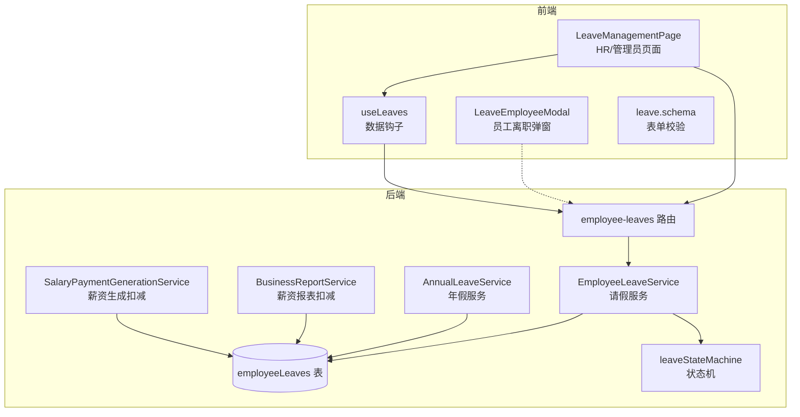
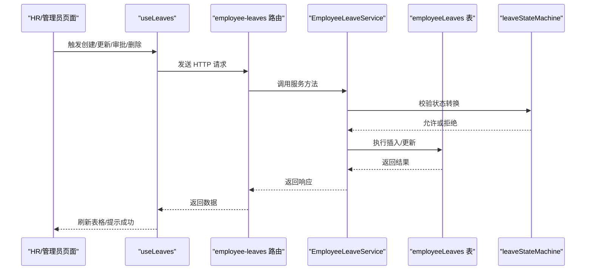
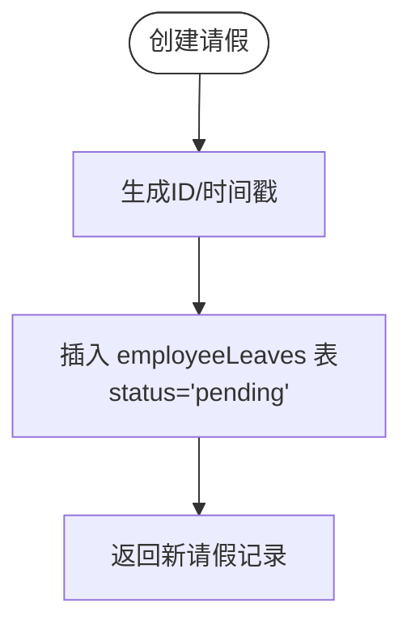
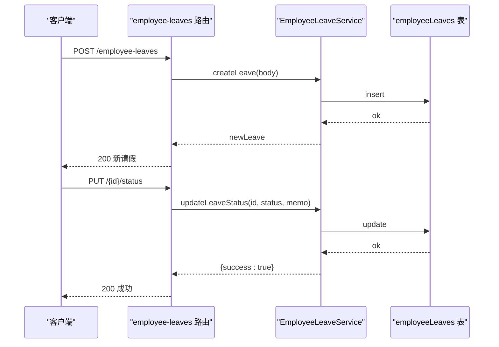
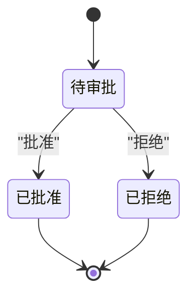
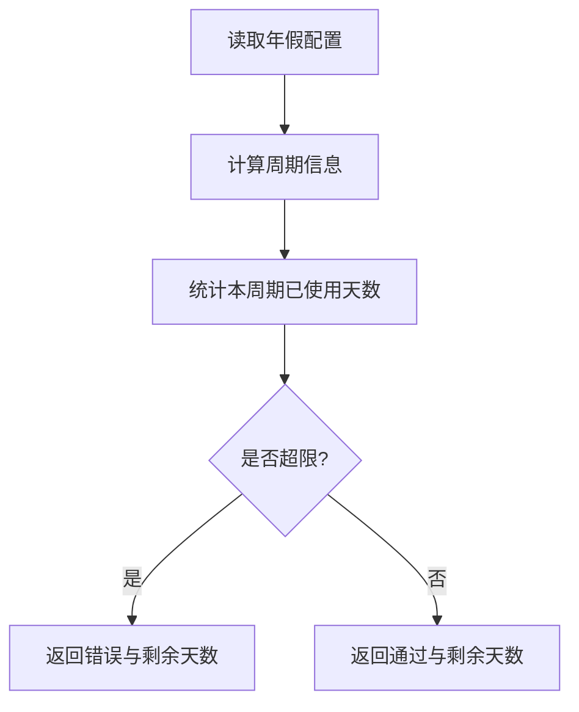
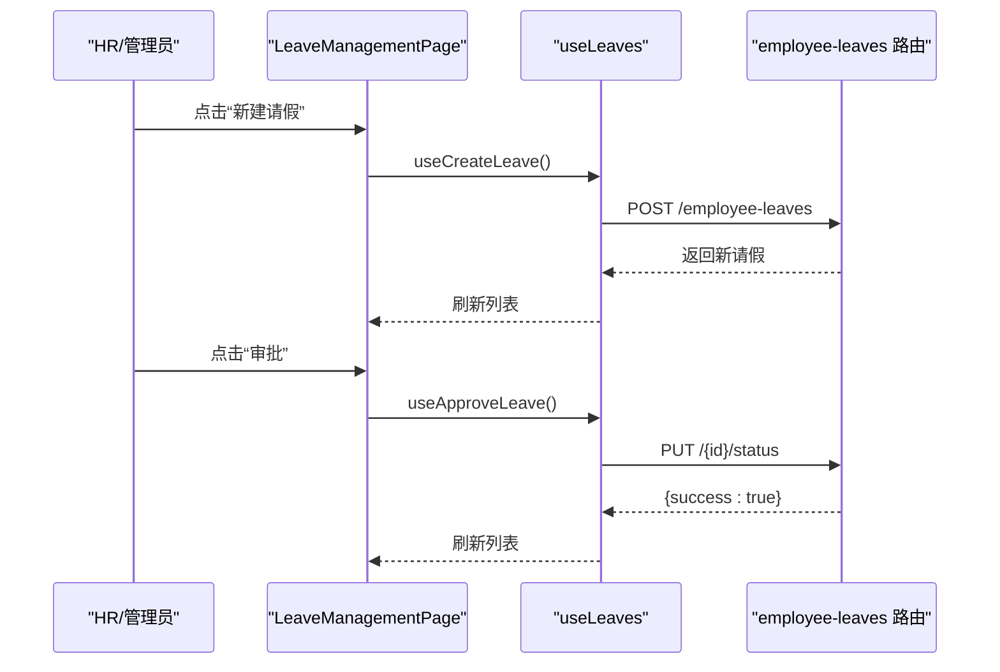
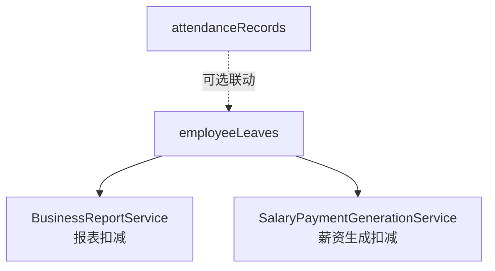
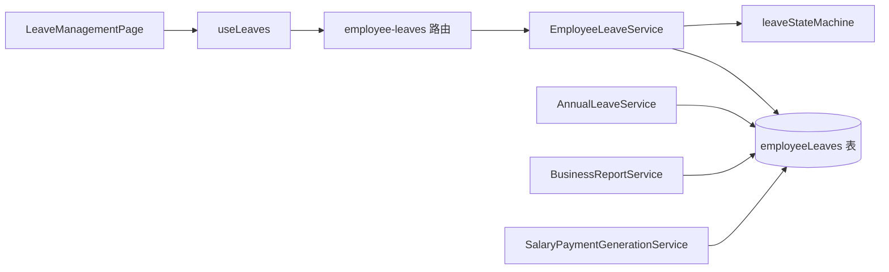

# 请假管理

<cite>
**本文引用的文件**
- [backend/src/services/EmployeeLeaveService.ts](file://backend/src/services/EmployeeLeaveService.ts)
- [backend/src/routes/v2/employee-leaves.ts](file://backend/src/routes/v2/employee-leaves.ts)
- [backend/src/db/schema.ts](file://backend/src/db/schema.ts)
- [backend/src/utils/state-machine.ts](file://backend/src/utils/state-machine.ts)
- [backend/src/services/AnnualLeaveService.ts](file://backend/src/services/AnnualLeaveService.ts)
- [backend/src/services/BusinessReportService.ts](file://backend/src/services/BusinessReportService.ts)
- [backend/src/services/SalaryPaymentGenerationService.ts](file://backend/src/services/SalaryPaymentGenerationService.ts)
- [frontend/src/features/hr/pages/LeaveManagementPage.tsx](file://frontend/src/features/hr/pages/LeaveManagementPage.tsx)
- [frontend/src/features/employees/components/modals/LeaveEmployeeModal.tsx](file://frontend/src/features/employees/components/modals/LeaveEmployeeModal.tsx)
- [frontend/src/hooks/business/useLeaves.ts](file://frontend/src/hooks/business/useLeaves.ts)
- [frontend/src/validations/leave.schema.ts](file://frontend/src/validations/leave.schema.ts)
- [frontend/src/utils/status.tsx](file://frontend/src/utils/status.tsx)
</cite>

## 目录
1. [简介](#简介)
2. [项目结构](#项目结构)
3. [核心组件](#核心组件)
4. [架构总览](#架构总览)
5. [详细组件分析](#详细组件分析)
6. [依赖关系分析](#依赖关系分析)
7. [性能考虑](#性能考虑)
8. [故障排查指南](#故障排查指南)
9. [结论](#结论)
10. [附录](#附录)

## 简介
本文件围绕“请假管理”模块，系统化梳理后端 EmployeeLeaveService 的业务逻辑与状态机约束，结合前端 LeaveManagementPage 与 LeaveEmployeeModal 的交互流程，说明请假申请、审批、状态变更、假期类型与余额计算、并发控制策略，以及与考勤、薪资模块的集成方式。同时提供请假规则配置、审批权限设置、典型场景（年假、病假）的实现要点与最佳实践。

## 项目结构
请假管理涉及前后端协作的关键文件如下：
- 后端
  - 服务层：EmployeeLeaveService（请假 CRUD、状态更新）、AnnualLeaveService（年假配置与校验）
  - 路由层：employee-leaves 路由（列表、创建、审批）
  - 数据模型：db/schema.ts 中的 employeeLeaves 表
  - 状态机：utils/state-machine.ts 中的 leaveStateMachine
  - 集成：BusinessReportService、SalaryPaymentGenerationService 对请假与薪资的扣减逻辑
- 前端
  - 页面：LeaveManagementPage（HR/管理员视角的请假管理）
  - 弹窗：LeaveEmployeeModal（员工离职流程，非请假审批）
  - Hook：useLeaves（请假数据查询与变更触发）
  - 校验：leave.schema（请假表单校验）

图表来源
- [backend/src/routes/v2/employee-leaves.ts](file://backend/src/routes/v2/employee-leaves.ts#L1-L176)
- [backend/src/services/EmployeeLeaveService.ts](file://backend/src/services/EmployeeLeaveService.ts#L1-L182)
- [backend/src/services/AnnualLeaveService.ts](file://backend/src/services/AnnualLeaveService.ts#L1-L226)
- [backend/src/db/schema.ts](file://backend/src/db/schema.ts#L269-L284)
- [backend/src/utils/state-machine.ts](file://backend/src/utils/state-machine.ts#L78-L89)
- [backend/src/services/BusinessReportService.ts](file://backend/src/services/BusinessReportService.ts#L352-L450)
- [backend/src/services/SalaryPaymentGenerationService.ts](file://backend/src/services/SalaryPaymentGenerationService.ts#L147-L168)
- [frontend/src/features/hr/pages/LeaveManagementPage.tsx](file://frontend/src/features/hr/pages/LeaveManagementPage.tsx#L1-L563)
- [frontend/src/features/employees/components/modals/LeaveEmployeeModal.tsx](file://frontend/src/features/employees/components/modals/LeaveEmployeeModal.tsx#L1-L114)
- [frontend/src/hooks/business/useLeaves.ts](file://frontend/src/hooks/business/useLeaves.ts#L1-L103)
- [frontend/src/validations/leave.schema.ts](file://frontend/src/validations/leave.schema.ts#L1-L32)

章节来源
- [backend/src/routes/v2/employee-leaves.ts](file://backend/src/routes/v2/employee-leaves.ts#L1-L176)
- [backend/src/services/EmployeeLeaveService.ts](file://backend/src/services/EmployeeLeaveService.ts#L1-L182)
- [backend/src/db/schema.ts](file://backend/src/db/schema.ts#L269-L284)
- [backend/src/utils/state-machine.ts](file://backend/src/utils/state-machine.ts#L78-L89)
- [frontend/src/features/hr/pages/LeaveManagementPage.tsx](file://frontend/src/features/hr/pages/LeaveManagementPage.tsx#L1-L563)
- [frontend/src/features/employees/components/modals/LeaveEmployeeModal.tsx](file://frontend/src/features/employees/components/modals/LeaveEmployeeModal.tsx#L1-L114)
- [frontend/src/hooks/business/useLeaves.ts](file://frontend/src/hooks/business/useLeaves.ts#L1-L103)
- [frontend/src/validations/leave.schema.ts](file://frontend/src/validations/leave.schema.ts#L1-L32)

## 核心组件
- 后端服务 EmployeeLeaveService
  - 列表查询（支持按员工、状态、年份过滤）
  - 创建请假（默认状态为“待审批”，自动填充时间戳）
  - 更新状态（批准/拒绝时写入审批人与审批时间）
  - 统计接口（按类型统计已批准的请假天数）
- 路由层 employee-leaves
  - GET /employee-leaves（列表）
  - POST /employee-leaves（创建）
  - PUT /employee-leaves/{id}/status（审批）
- 数据模型 employeeLeaves
  - 字段包含：员工、类型、起止日期、天数、状态、审批人、审批时间、乐观锁版本号等
- 状态机 leaveStateMachine
  - 仅允许从“待审批”到“已批准/已拒绝”，批准后为终态
- 年假服务 AnnualLeaveService
  - 年假配置读取、周期计算、使用统计、超支校验、离职结算
- 前端页面 LeaveManagementPage
  - 查询、筛选、新建、编辑、审批、删除
  - 权限控制：视图权限、审批权限、管理者删除权限
- 前端弹窗 LeaveEmployeeModal
  - 员工离职流程（非请假审批），与请假模块解耦
- 前端 Hook useLeaves
  - 查询、创建、更新、删除、审批的 API 调用与缓存失效

章节来源
- [backend/src/services/EmployeeLeaveService.ts](file://backend/src/services/EmployeeLeaveService.ts#L10-L182)
- [backend/src/routes/v2/employee-leaves.ts](file://backend/src/routes/v2/employee-leaves.ts#L43-L176)
- [backend/src/db/schema.ts](file://backend/src/db/schema.ts#L269-L284)
- [backend/src/utils/state-machine.ts](file://backend/src/utils/state-machine.ts#L78-L89)
- [backend/src/services/AnnualLeaveService.ts](file://backend/src/services/AnnualLeaveService.ts#L1-L226)
- [frontend/src/features/hr/pages/LeaveManagementPage.tsx](file://frontend/src/features/hr/pages/LeaveManagementPage.tsx#L1-L563)
- [frontend/src/features/employees/components/modals/LeaveEmployeeModal.tsx](file://frontend/src/features/employees/components/modals/LeaveEmployeeModal.tsx#L1-L114)
- [frontend/src/hooks/business/useLeaves.ts](file://frontend/src/hooks/business/useLeaves.ts#L1-L103)

## 架构总览
请假管理从前端页面发起请求，经路由层进入服务层，持久化到数据库；状态机保障审批流程的合法性；年假服务提供额度与校验；薪资模块在报表与薪资生成阶段对请假进行扣减。

图表来源
- [backend/src/routes/v2/employee-leaves.ts](file://backend/src/routes/v2/employee-leaves.ts#L112-L176)
- [backend/src/services/EmployeeLeaveService.ts](file://backend/src/services/EmployeeLeaveService.ts#L100-L182)
- [backend/src/utils/state-machine.ts](file://backend/src/utils/state-machine.ts#L16-L42)
- [backend/src/db/schema.ts](file://backend/src/db/schema.ts#L269-L284)

## 详细组件分析

### 后端服务：EmployeeLeaveService
- 列表查询
  - 支持按员工、状态、年份过滤；返回员工姓名与审批人姓名（通过左连接）
- 创建请假
  - 自动生成 ID 与时间戳，状态初始化为“待审批”
- 更新状态
  - 批准/拒绝时写入审批人与审批时间；仅当状态为“待审批”时允许转换
- 统计接口
  - 按请假类型统计某年已批准的天数，用于报表与薪资扣减

图表来源
- [backend/src/services/EmployeeLeaveService.ts](file://backend/src/services/EmployeeLeaveService.ts#L100-L151)

章节来源
- [backend/src/services/EmployeeLeaveService.ts](file://backend/src/services/EmployeeLeaveService.ts#L10-L182)

### 路由层：employee-leaves
- GET /employee-leaves：列表查询（支持 employeeId、status）
- POST /employee-leaves：创建请假（需要“hr.leave.create”权限）
- PUT /employee-leaves/{id}/status：审批（需要“hr.leave.approve”权限）

图表来源
- [backend/src/routes/v2/employee-leaves.ts](file://backend/src/routes/v2/employee-leaves.ts#L83-L176)
- [backend/src/services/EmployeeLeaveService.ts](file://backend/src/services/EmployeeLeaveService.ts#L153-L181)

章节来源
- [backend/src/routes/v2/employee-leaves.ts](file://backend/src/routes/v2/employee-leaves.ts#L1-L176)
- [backend/src/services/EmployeeLeaveService.ts](file://backend/src/services/EmployeeLeaveService.ts#L100-L182)

### 数据模型：employeeLeaves
- 关键字段：employeeId、leaveType、startDate、endDate、days、status、approvedBy、approvedAt、version（乐观锁）、createdAt、updatedAt
- 与 employees 表通过外键关联（用于显示员工与审批人姓名）

章节来源
- [backend/src/db/schema.ts](file://backend/src/db/schema.ts#L269-L284)

### 状态机：leaveStateMachine
- 状态转换规则
  - pending → approved/rejected
  - approved/rejected 为终态，不可再转换
- 作用
  - 在审批接口中调用，确保业务状态变更合法

图表来源
- [backend/src/utils/state-machine.ts](file://backend/src/utils/state-machine.ts#L78-L89)

章节来源
- [backend/src/utils/state-machine.ts](file://backend/src/utils/state-machine.ts#L1-L89)

### 年假服务：AnnualLeaveService
- 年假配置
  - 从 system_config 读取周期月数、每周期天数、未休折算系数
- 周期计算
  - 基于入职日期与目标日期计算当前周期、周期起止、工作天数占比
- 使用统计与校验
  - 统计本周期已使用天数，校验申请是否超限
- 离职结算
  - 按比例计算应得年假、已用天数、未休天数，按日薪与折算系数结算

图表来源
- [backend/src/services/AnnualLeaveService.ts](file://backend/src/services/AnnualLeaveService.ts#L1-L226)

章节来源
- [backend/src/services/AnnualLeaveService.ts](file://backend/src/services/AnnualLeaveService.ts#L1-L226)

### 前端页面：LeaveManagementPage
- 功能
  - 列表展示、搜索过滤（员工、类型、状态）
  - 新建/编辑请假（仅“待审批”状态可编辑）
  - 审批弹窗（批准/拒绝），支持填写备注
  - 删除（管理者）
- 权限
  - 视图权限：hr.leave.view
  - 审批权限：hr.leave.approve 或管理下属
- 表单校验
  - 请假类型枚举、日期范围、天数最小值、长度限制

图表来源
- [frontend/src/features/hr/pages/LeaveManagementPage.tsx](file://frontend/src/features/hr/pages/LeaveManagementPage.tsx#L1-L563)
- [frontend/src/hooks/business/useLeaves.ts](file://frontend/src/hooks/business/useLeaves.ts#L1-L103)
- [frontend/src/validations/leave.schema.ts](file://frontend/src/validations/leave.schema.ts#L1-L32)

章节来源
- [frontend/src/features/hr/pages/LeaveManagementPage.tsx](file://frontend/src/features/hr/pages/LeaveManagementPage.tsx#L1-L563)
- [frontend/src/hooks/business/useLeaves.ts](file://frontend/src/hooks/business/useLeaves.ts#L1-L103)
- [frontend/src/validations/leave.schema.ts](file://frontend/src/validations/leave.schema.ts#L1-L32)

### 前端弹窗：LeaveEmployeeModal
- 用途：员工离职流程，包含离职日期、类型、原因、备注与账号处理开关
- 与请假模块解耦，不参与请假审批

章节来源
- [frontend/src/features/employees/components/modals/LeaveEmployeeModal.tsx](file://frontend/src/features/employees/components/modals/LeaveEmployeeModal.tsx#L1-L114)

### 与薪资、考勤的集成
- 薪资报表扣减
  - 报表计算时，对非年假类型的请假进行重叠天数扣减，影响实际工资
- 薪资生成扣减
  - 薪资生成阶段同样基于请假重叠天数进行扣减
- 考勤模块
  - 代码库中存在 attendanceRecords 表，但请假模块未直接引用该表；若需联动考勤，可在业务层扩展

图表来源
- [backend/src/services/BusinessReportService.ts](file://backend/src/services/BusinessReportService.ts#L352-L450)
- [backend/src/services/SalaryPaymentGenerationService.ts](file://backend/src/services/SalaryPaymentGenerationService.ts#L147-L168)
- [backend/src/db/schema.ts](file://backend/src/db/schema.ts#L412-L424)

章节来源
- [backend/src/services/BusinessReportService.ts](file://backend/src/services/BusinessReportService.ts#L352-L450)
- [backend/src/services/SalaryPaymentGenerationService.ts](file://backend/src/services/SalaryPaymentGenerationService.ts#L147-L168)
- [backend/src/db/schema.ts](file://backend/src/db/schema.ts#L412-L424)

## 依赖关系分析
- 服务层依赖
  - EmployeeLeaveService 依赖 db/schema.ts 的 employeeLeaves 表与状态机
  - AnnualLeaveService 依赖 system_config 与 employeeLeaves
  - 薪资相关服务依赖 employeeLeaves 进行扣减
- 路由层依赖
  - 路由层依赖权限校验与服务层
- 前端依赖
  - 页面依赖 useLeaves Hook、表单校验与状态映射

图表来源
- [backend/src/routes/v2/employee-leaves.ts](file://backend/src/routes/v2/employee-leaves.ts#L1-L176)
- [backend/src/services/EmployeeLeaveService.ts](file://backend/src/services/EmployeeLeaveService.ts#L1-L182)
- [backend/src/services/AnnualLeaveService.ts](file://backend/src/services/AnnualLeaveService.ts#L1-L226)
- [backend/src/db/schema.ts](file://backend/src/db/schema.ts#L269-L284)
- [backend/src/utils/state-machine.ts](file://backend/src/utils/state-machine.ts#L78-L89)
- [backend/src/services/BusinessReportService.ts](file://backend/src/services/BusinessReportService.ts#L352-L450)
- [backend/src/services/SalaryPaymentGenerationService.ts](file://backend/src/services/SalaryPaymentGenerationService.ts#L147-L168)
- [frontend/src/features/hr/pages/LeaveManagementPage.tsx](file://frontend/src/features/hr/pages/LeaveManagementPage.tsx#L1-L563)
- [frontend/src/hooks/business/useLeaves.ts](file://frontend/src/hooks/business/useLeaves.ts#L1-L103)

章节来源
- [backend/src/routes/v2/employee-leaves.ts](file://backend/src/routes/v2/employee-leaves.ts#L1-L176)
- [backend/src/services/EmployeeLeaveService.ts](file://backend/src/services/EmployeeLeaveService.ts#L1-L182)
- [backend/src/services/AnnualLeaveService.ts](file://backend/src/services/AnnualLeaveService.ts#L1-L226)
- [backend/src/db/schema.ts](file://backend/src/db/schema.ts#L269-L284)
- [backend/src/utils/state-machine.ts](file://backend/src/utils/state-machine.ts#L78-L89)
- [backend/src/services/BusinessReportService.ts](file://backend/src/services/BusinessReportService.ts#L352-L450)
- [backend/src/services/SalaryPaymentGenerationService.ts](file://backend/src/services/SalaryPaymentGenerationService.ts#L147-L168)
- [frontend/src/features/hr/pages/LeaveManagementPage.tsx](file://frontend/src/features/hr/pages/LeaveManagementPage.tsx#L1-L563)
- [frontend/src/hooks/business/useLeaves.ts](file://frontend/src/hooks/business/useLeaves.ts#L1-L103)

## 性能考虑
- 列表查询
  - 使用左连接显示员工与审批人姓名，注意避免重复别名导致的复杂度；可按需裁剪字段
- 状态机校验
  - 在审批接口中进行状态转换校验，避免无效写入
- 年假校验
  - 申请前先计算周期与剩余天数，减少无效请求
- 前端缓存
  - useLeaves 使用 React Query 缓存，变更后主动失效，避免重复拉取

[本节为通用建议，不直接分析具体文件]

## 故障排查指南
- 审批失败
  - 检查状态机是否允许从“待审批”转换到目标状态
  - 确认路由权限是否满足“hr.leave.approve”
- 无法编辑
  - 仅“待审批”状态允许编辑；否则前端会提示
- 日期校验失败
  - 结束日期不得早于开始日期；天数最小值为 0.5
- 年假超限
  - 申请前调用 AnnualLeaveService 的校验接口，查看剩余天数

章节来源
- [backend/src/utils/state-machine.ts](file://backend/src/utils/state-machine.ts#L16-L42)
- [frontend/src/features/hr/pages/LeaveManagementPage.tsx](file://frontend/src/features/hr/pages/LeaveManagementPage.tsx#L180-L207)
- [frontend/src/validations/leave.schema.ts](file://frontend/src/validations/leave.schema.ts#L1-L32)
- [backend/src/services/AnnualLeaveService.ts](file://backend/src/services/AnnualLeaveService.ts#L198-L226)

## 结论
请假管理模块以 EmployeeLeaveService 为核心，配合路由层、状态机与前端页面形成闭环。通过 AnnualLeaveService 提供额度与校验，结合薪资报表与薪资生成的扣减逻辑，实现了请假与薪酬的紧密衔接。前端页面提供了完善的 HR/管理员工作流，权限控制与表单校验保证了业务正确性与用户体验。

[本节为总结，不直接分析具体文件]

## 附录

### 请假状态机转换规则
- 待审批 → 已批准/已拒绝
- 已批准/已拒绝 → 不可再转换

章节来源
- [backend/src/utils/state-machine.ts](file://backend/src/utils/state-machine.ts#L78-L89)

### 请假类型与前端映射
- sick：病假
- annual：年假
- personal：事假
- other：其他

章节来源
- [frontend/src/features/hr/pages/LeaveManagementPage.tsx](file://frontend/src/features/hr/pages/LeaveManagementPage.tsx#L22-L27)

### 典型使用场景
- 年假计算
  - 读取年假配置，计算周期、应得天数、已用天数、剩余天数
  - 离职结算：按比例计算未休天数与折算金额
- 病假审批
  - 创建请假后等待审批；HR/管理者进行批准或拒绝
  - 报表与薪资生成阶段对非年假类型的请假进行扣减

章节来源
- [backend/src/services/AnnualLeaveService.ts](file://backend/src/services/AnnualLeaveService.ts#L1-L226)
- [frontend/src/features/hr/pages/LeaveManagementPage.tsx](file://frontend/src/features/hr/pages/LeaveManagementPage.tsx#L1-L563)
- [backend/src/services/BusinessReportService.ts](file://backend/src/services/BusinessReportService.ts#L352-L450)
- [backend/src/services/SalaryPaymentGenerationService.ts](file://backend/src/services/SalaryPaymentGenerationService.ts#L147-L168)

### 高级配置指南
- 请假规则配置
  - 年假周期月数、每周期天数、未休折算系数通过 system_config 键读取
- 审批权限设置
  - 路由层要求“hr.leave.create”与“hr.leave.approve”权限
- 并发冲突处理
  - employeeLeaves 表含 version 字段，可用于乐观锁控制（当前服务未显式使用，可在业务层扩展）

章节来源
- [backend/src/services/AnnualLeaveService.ts](file://backend/src/services/AnnualLeaveService.ts#L46-L63)
- [backend/src/routes/v2/employee-leaves.ts](file://backend/src/routes/v2/employee-leaves.ts#L116-L176)
- [backend/src/db/schema.ts](file://backend/src/db/schema.ts#L269-L284)