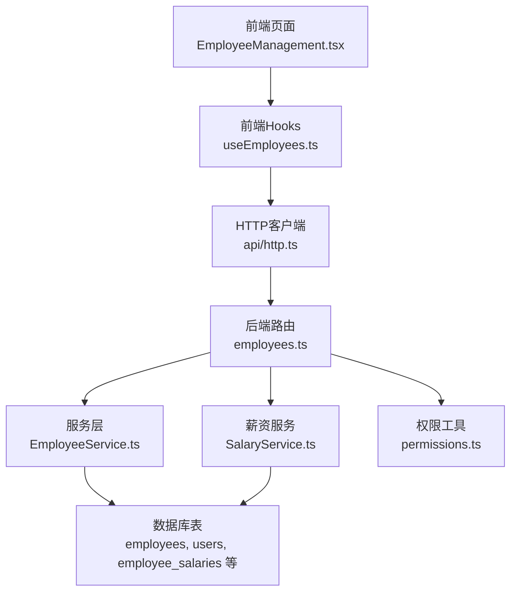
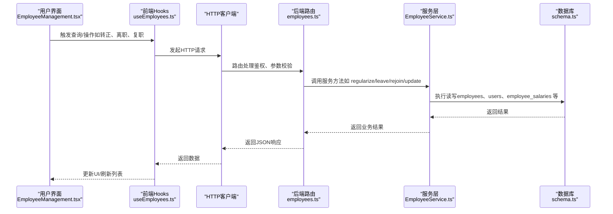
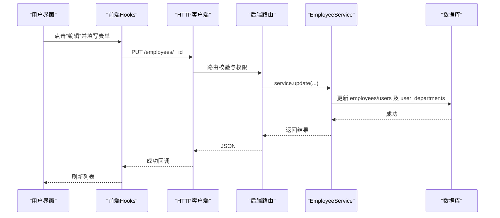
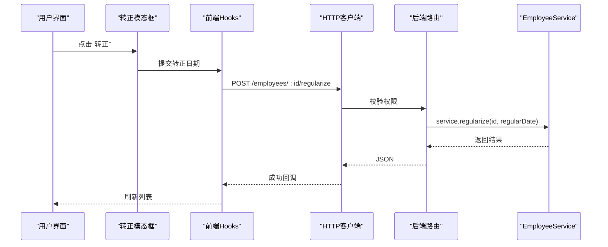
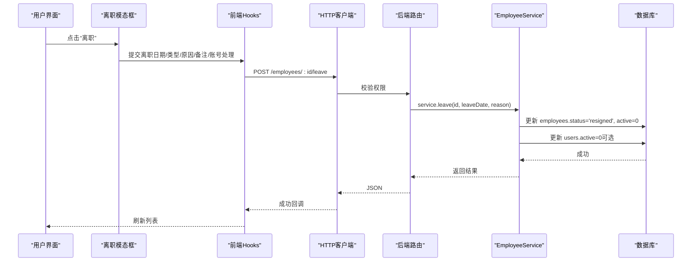
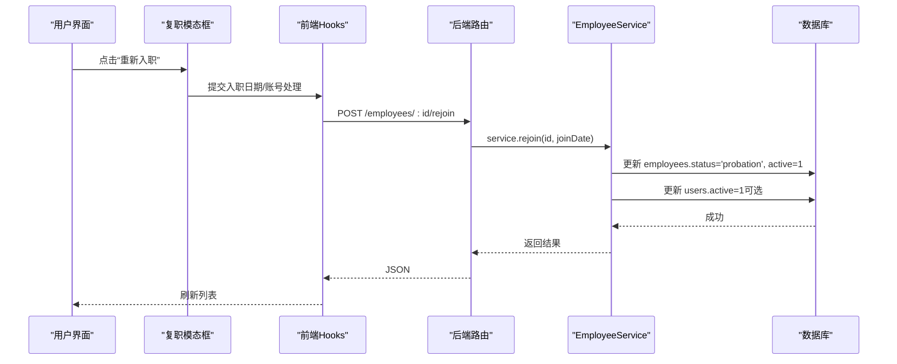
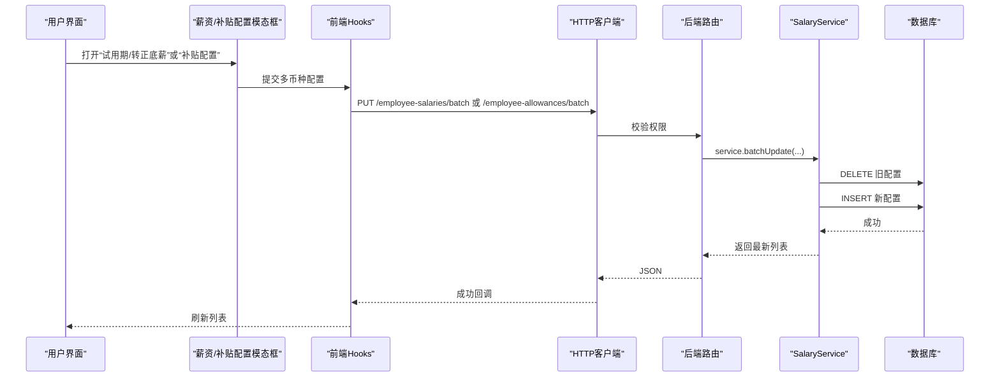
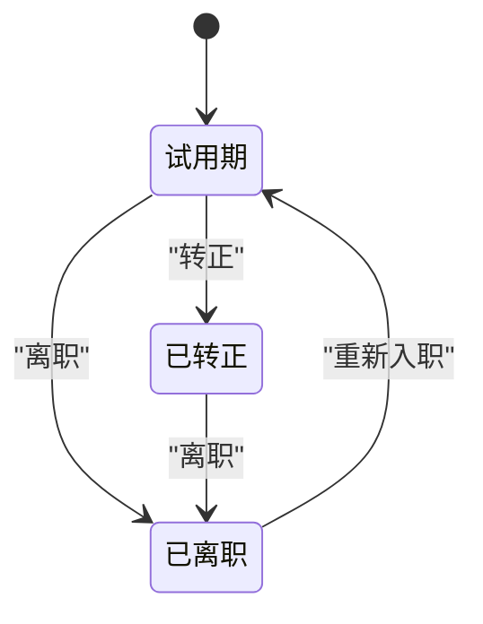
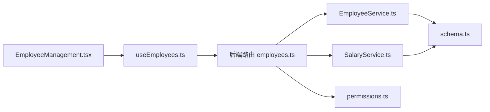

# 员工管理模块

<cite>
**本文引用的文件**
- [EmployeeManagement.tsx](file://frontend/src/features/hr/pages/EmployeeManagement.tsx)
- [RegularizeEmployeeModal.tsx](file://frontend/src/features/employees/components/modals/RegularizeEmployeeModal.tsx)
- [LeaveEmployeeModal.tsx](file://frontend/src/features/employees/components/modals/LeaveEmployeeModal.tsx)
- [RejoinEmployeeModal.tsx](file://frontend/src/features/employees/components/modals/RejoinEmployeeModal.tsx)
- [SalaryConfigModal.tsx](file://frontend/src/features/employees/components/modals/SalaryConfigModal.tsx)
- [AllowanceConfigModal.tsx](file://frontend/src/features/employees/components/modals/AllowanceConfigModal.tsx)
- [EditEmployeeModal.tsx](file://frontend/src/features/employees/components/modals/EditEmployeeModal.tsx)
- [useEmployees.ts](file://frontend/src/hooks/business/useEmployees.ts)
- [employee.schema.ts](file://frontend/src/validations/employee.schema.ts)
- [domain.ts](file://frontend/src/types/domain.ts)
- [employees.ts](file://backend/src/routes/employees.ts)
- [EmployeeService.ts](file://backend/src/services/EmployeeService.ts)
- [SalaryService.ts](file://backend/src/services/SalaryService.ts)
- [employee.schema.ts（后端）](file://backend/src/schemas/employee.schema.ts)
- [schema.ts（数据库）](file://backend/src/db/schema.ts)
- [permissions.ts](file://backend/src/utils/permissions.ts)
</cite>

## 目录
1. [简介](#简介)
2. [项目结构](#项目结构)
3. [核心组件](#核心组件)
4. [架构总览](#架构总览)
5. [详细组件分析](#详细组件分析)
6. [依赖分析](#依赖分析)
7. [性能考虑](#性能考虑)
8. [故障排查指南](#故障排查指南)
9. [结论](#结论)
10. [附录](#附录)

## 简介
本文件系统性阐述员工管理模块的完整生命周期功能，覆盖入职、信息维护、转正、离职、复职等全流程；结合前端页面组件（如 EmployeeManagement.tsx）与后端路由（employees.ts）说明数据流与交互逻辑；解释敏感信息（如薪资、身份证号）的存储与权限控制机制；并给出员工状态机模型与与薪资、权限系统的集成关系说明。

## 项目结构
- 前端位于 frontend/src/features/hr/pages/EmployeeManagement.tsx，配套多个模态框组件（转正、离职、复职、薪资配置、补贴配置、编辑），并通过 hooks/business/useEmployees.ts 与后端 API 交互。
- 后端位于 backend/src/routes/employees.ts，提供员工 CRUD、状态变更、重置密码等接口；核心业务逻辑在 backend/src/services/EmployeeService.ts 中；薪资配置通过 backend/src/services/SalaryService.ts 管理；数据库表结构在 backend/src/db/schema.ts 定义。

图表来源
- [EmployeeManagement.tsx](file://frontend/src/features/hr/pages/EmployeeManagement.tsx#L1-L586)
- [useEmployees.ts](file://frontend/src/hooks/business/useEmployees.ts#L1-L147)
- [employees.ts](file://backend/src/routes/employees.ts#L1-L462)
- [EmployeeService.ts](file://backend/src/services/EmployeeService.ts#L1-L593)
- [SalaryService.ts](file://backend/src/services/SalaryService.ts#L1-L140)
- [schema.ts（数据库）](file://backend/src/db/schema.ts#L1-L644)
- [permissions.ts](file://backend/src/utils/permissions.ts#L1-L330)

章节来源
- [EmployeeManagement.tsx](file://frontend/src/features/hr/pages/EmployeeManagement.tsx#L1-L586)
- [employees.ts](file://backend/src/routes/employees.ts#L1-L462)
- [EmployeeService.ts](file://backend/src/services/EmployeeService.ts#L1-L593)
- [SalaryService.ts](file://backend/src/services/SalaryService.ts#L1-L140)
- [schema.ts（数据库）](file://backend/src/db/schema.ts#L1-L644)
- [permissions.ts](file://backend/src/utils/permissions.ts#L1-L330)

## 核心组件
- 前端页面 EmployeeManagement.tsx：负责员工列表展示、筛选、批量操作、展开行显示敏感字段、以及打开各类操作模态框。
- 模态框组件：
  - 转正：RegularizeEmployeeModal.tsx
  - 离职：LeaveEmployeeModal.tsx
  - 复职：RejoinEmployeeModal.tsx
  - 薪资配置：SalaryConfigModal.tsx
  - 补贴配置：AllowanceConfigModal.tsx
  - 编辑员工：EditEmployeeModal.tsx
- 前端 Hooks：useEmployees.ts 提供查询、状态变更、批量删除、重置密码、账号启停等 Mutation。
- 后端路由 employees.ts：提供员工列表、详情、创建、更新、转正、离职、复职、重置密码等接口。
- 服务层 EmployeeService.ts：实现入职创建（含用户账号、邮箱路由、欢迎邮件）、状态变更（转正、离职、复职）、信息同步（用户表）等。
- 薪资服务 SalaryService.ts：提供薪资配置的增删改查与批量更新。
- 数据库 schema.ts：定义 employees、users、employee_salaries、employee_allowances 等表结构。
- 权限工具 permissions.ts：基于职位层级与权限配置进行模块与操作授权校验。

章节来源
- [EmployeeManagement.tsx](file://frontend/src/features/hr/pages/EmployeeManagement.tsx#L1-L586)
- [RegularizeEmployeeModal.tsx](file://frontend/src/features/employees/components/modals/RegularizeEmployeeModal.tsx#L1-L73)
- [LeaveEmployeeModal.tsx](file://frontend/src/features/employees/components/modals/LeaveEmployeeModal.tsx#L1-L114)
- [RejoinEmployeeModal.tsx](file://frontend/src/features/employees/components/modals/RejoinEmployeeModal.tsx#L1-L82)
- [SalaryConfigModal.tsx](file://frontend/src/features/employees/components/modals/SalaryConfigModal.tsx#L1-L111)
- [AllowanceConfigModal.tsx](file://frontend/src/features/employees/components/modals/AllowanceConfigModal.tsx#L1-L119)
- [EditEmployeeModal.tsx](file://frontend/src/features/employees/components/modals/EditEmployeeModal.tsx#L1-L205)
- [useEmployees.ts](file://frontend/src/hooks/business/useEmployees.ts#L1-L147)
- [employees.ts](file://backend/src/routes/employees.ts#L1-L462)
- [EmployeeService.ts](file://backend/src/services/EmployeeService.ts#L1-L593)
- [SalaryService.ts](file://backend/src/services/SalaryService.ts#L1-L140)
- [schema.ts（数据库）](file://backend/src/db/schema.ts#L1-L644)
- [permissions.ts](file://backend/src/utils/permissions.ts#L1-L330)

## 架构总览
从前端到后端再到数据库的完整链路如下：

图表来源
- [EmployeeManagement.tsx](file://frontend/src/features/hr/pages/EmployeeManagement.tsx#L1-L586)
- [useEmployees.ts](file://frontend/src/hooks/business/useEmployees.ts#L1-L147)
- [employees.ts](file://backend/src/routes/employees.ts#L1-L462)
- [EmployeeService.ts](file://backend/src/services/EmployeeService.ts#L1-L593)
- [schema.ts（数据库）](file://backend/src/db/schema.ts#L1-L644)

## 详细组件分析

### 员工入职流程
- 前端入口：EmployeeManagement.tsx 中的“编辑”按钮可打开 EditEmployeeModal.tsx，内部使用 EmployeeForm 表单提交更新请求。
- 后端路由：employees.ts 的 POST /employees 接口，经权限校验后调用 EmployeeService.create。
- 服务层逻辑：
  - 自动生成公司邮箱（Cloudflare 邮箱路由），确保个人邮箱加入路由目的地。
  - 若不存在用户账号，则创建用户并写入 users、user_departments；同时发送欢迎邮件。
  - 初始化员工状态为“试用期”，默认薪资与补贴为 0。
- 数据库：写入 employees、users、user_departments；若失败则回滚。

图表来源
- [EditEmployeeModal.tsx](file://frontend/src/features/employees/components/modals/EditEmployeeModal.tsx#L1-L205)
- [employees.ts](file://backend/src/routes/employees.ts#L207-L271)
- [EmployeeService.ts](file://backend/src/services/EmployeeService.ts#L422-L493)
- [schema.ts（数据库）](file://backend/src/db/schema.ts#L1-L644)

章节来源
- [EditEmployeeModal.tsx](file://frontend/src/features/employees/components/modals/EditEmployeeModal.tsx#L1-L205)
- [employees.ts](file://backend/src/routes/employees.ts#L207-L271)
- [EmployeeService.ts](file://backend/src/services/EmployeeService.ts#L10-L249)
- [schema.ts（数据库）](file://backend/src/db/schema.ts#L1-L644)

### 员工转正流程
- 前端：EmployeeManagement.tsx 在状态为“试用期”时显示“转正”按钮，点击打开 RegularizeEmployeeModal.tsx。
- 表单校验：employee.schema.ts 的 employeeRegularizeSchema。
- 前端 Hook：useEmployees.ts 的 useRegularizeEmployee 使用 POST /employees/:id/regularize。
- 后端：employees.ts 的 regularize 路由，调用 EmployeeService.regularize 将状态改为“已转正”。

图表来源
- [RegularizeEmployeeModal.tsx](file://frontend/src/features/employees/components/modals/RegularizeEmployeeModal.tsx#L1-L73)
- [useEmployees.ts](file://frontend/src/hooks/business/useEmployees.ts#L36-L46)
- [employees.ts](file://backend/src/routes/employees.ts#L274-L308)
- [EmployeeService.ts](file://backend/src/services/EmployeeService.ts#L497-L508)

章节来源
- [RegularizeEmployeeModal.tsx](file://frontend/src/features/employees/components/modals/RegularizeEmployeeModal.tsx#L1-L73)
- [useEmployees.ts](file://frontend/src/hooks/business/useEmployees.ts#L36-L46)
- [employees.ts](file://backend/src/routes/employees.ts#L274-L308)
- [EmployeeService.ts](file://backend/src/services/EmployeeService.ts#L497-L508)

### 员工离职流程
- 前端：EmployeeManagement.tsx 在状态为“在职”时显示“离职”按钮，打开 LeaveEmployeeModal.tsx。
- 表单校验：employee.schema.ts 的 employeeLeaveSchema。
- 前端 Hook：useEmployees.ts 的 useLeaveEmployee 使用 POST /employees/:id/leave。
- 后端：employees.ts 的 leave 路由，调用 EmployeeService.leave 设置状态为“已离职”，并根据选项禁用用户账号。

图表来源
- [LeaveEmployeeModal.tsx](file://frontend/src/features/employees/components/modals/LeaveEmployeeModal.tsx#L1-L114)
- [useEmployees.ts](file://frontend/src/hooks/business/useEmployees.ts#L48-L58)
- [employees.ts](file://backend/src/routes/employees.ts#L309-L343)
- [EmployeeService.ts](file://backend/src/services/EmployeeService.ts#L510-L527)
- [schema.ts（数据库）](file://backend/src/db/schema.ts#L1-L644)

章节来源
- [LeaveEmployeeModal.tsx](file://frontend/src/features/employees/components/modals/LeaveEmployeeModal.tsx#L1-L114)
- [useEmployees.ts](file://frontend/src/hooks/business/useEmployees.ts#L48-L58)
- [employees.ts](file://backend/src/routes/employees.ts#L309-L343)
- [EmployeeService.ts](file://backend/src/services/EmployeeService.ts#L510-L527)
- [schema.ts（数据库）](file://backend/src/db/schema.ts#L1-L644)

### 员工复职流程
- 前端：EmployeeManagement.tsx 在状态为“已离职”时显示“重新入职”按钮，打开 RejoinEmployeeModal.tsx。
- 表单校验：employee.schema.ts 的 employeeRejoinSchema。
- 前端 Hook：useEmployees.ts 的 useRejoinEmployee 使用 POST /employees/:id/rejoin。
- 后端：employees.ts 的 rejoin 路由，调用 EmployeeService.rejoin 将状态改为“试用期”，并根据选项启用用户账号。

图表来源
- [RejoinEmployeeModal.tsx](file://frontend/src/features/employees/components/modals/RejoinEmployeeModal.tsx#L1-L82)
- [useEmployees.ts](file://frontend/src/hooks/business/useEmployees.ts#L60-L70)
- [employees.ts](file://backend/src/routes/employees.ts#L344-L378)
- [EmployeeService.ts](file://backend/src/services/EmployeeService.ts#L529-L546)
- [schema.ts（数据库）](file://backend/src/db/schema.ts#L1-L644)

章节来源
- [RejoinEmployeeModal.tsx](file://frontend/src/features/employees/components/modals/RejoinEmployeeModal.tsx#L1-L82)
- [useEmployees.ts](file://frontend/src/hooks/business/useEmployees.ts#L60-L70)
- [employees.ts](file://backend/src/routes/employees.ts#L344-L378)
- [EmployeeService.ts](file://backend/src/services/EmployeeService.ts#L529-L546)
- [schema.ts（数据库）](file://backend/src/db/schema.ts#L1-L644)

### 薪资与补贴配置
- 前端：
  - 薪资配置：SalaryConfigModal.tsx 支持多币种试用期/转正底薪配置，使用 useEmployees.ts 的 useUpdateEmployeeSalaries。
  - 补贴配置：AllowanceConfigModal.tsx 支持多币种生活/住房/交通/伙食/生日补贴配置，使用 useEmployees.ts 的 useUpdateEmployeeAllowances。
- 后端：
  - 薪资服务：SalaryService.ts 提供批量更新接口（删除旧配置并插入新配置），返回最新列表。
  - 路由：employees.ts 的薪资/补贴批量更新接口（PUT /employee-salaries/batch、PUT /employee-allowances/batch）。

图表来源
- [SalaryConfigModal.tsx](file://frontend/src/features/employees/components/modals/SalaryConfigModal.tsx#L1-L111)
- [AllowanceConfigModal.tsx](file://frontend/src/features/employees/components/modals/AllowanceConfigModal.tsx#L1-L119)
- [useEmployees.ts](file://frontend/src/hooks/business/useEmployees.ts#L72-L94)
- [employees.ts](file://backend/src/routes/employees.ts#L1-L462)
- [SalaryService.ts](file://backend/src/services/SalaryService.ts#L86-L139)
- [schema.ts（数据库）](file://backend/src/db/schema.ts#L1-L644)

章节来源
- [SalaryConfigModal.tsx](file://frontend/src/features/employees/components/modals/SalaryConfigModal.tsx#L1-L111)
- [AllowanceConfigModal.tsx](file://frontend/src/features/employees/components/modals/AllowanceConfigModal.tsx#L1-L119)
- [useEmployees.ts](file://frontend/src/hooks/business/useEmployees.ts#L72-L94)
- [employees.ts](file://backend/src/routes/employees.ts#L1-L462)
- [SalaryService.ts](file://backend/src/services/SalaryService.ts#L86-L139)
- [schema.ts（数据库）](file://backend/src/db/schema.ts#L1-L644)

### 敏感信息与权限控制
- 前端对敏感字段采用 SensitiveField 组件包裹，仅在具备相应权限时显示真实值；权限键包括但不限于 hr.employee.view_sensitive、hr.salary.view。
- 后端权限工具 permissions.ts 基于职位层级与权限配置进行模块与操作授权校验，支持总部/项目/组三级访问范围控制。
- 数据库层面，薪资与补贴以整数分计价存储（如 amountCents），避免浮点误差；员工表包含敏感字段（如 phone、address、emergency_*），但前端通过权限控制显示。

章节来源
- [EmployeeManagement.tsx](file://frontend/src/features/hr/pages/EmployeeManagement.tsx#L1-L586)
- [permissions.ts](file://backend/src/utils/permissions.ts#L1-L330)
- [schema.ts（数据库）](file://backend/src/db/schema.ts#L1-L644)

### 员工状态机模型
- 状态集合：probation（试用期）、regular（已转正）、resigned（已离职）。
- 转换规则：
  - probation → regular：通过“转正”流程完成。
  - probation → resigned：通过“离职”流程完成。
  - resigned → probation：通过“重新入职”流程完成。
- 状态变更影响：
  - 更新 employees.status 字段。
  - 离职时可同步禁用用户账号（users.active=0）。
  - 复职时可同步启用用户账号（users.active=1）。

图表来源
- [EmployeeService.ts](file://backend/src/services/EmployeeService.ts#L497-L546)
- [employees.ts](file://backend/src/routes/employees.ts#L274-L378)

章节来源
- [EmployeeService.ts](file://backend/src/services/EmployeeService.ts#L497-L546)
- [employees.ts](file://backend/src/routes/employees.ts#L274-L378)

### 与薪资、权限系统的集成
- 薪资系统：
  - 薪资配置通过 SalaryService.batchUpdate 实现，按员工与类型（probation/regular）维护多币种底薪。
  - 补贴配置通过相同模式维护多币种补贴。
- 权限系统：
  - 前端通过 usePermissions 与 usePermissions.isManager 判断操作按钮可见性与可用性。
  - 后端通过 permissions.hasPermission 对模块/子模块/动作进行细粒度授权，且支持按职位层级限制数据访问范围。

章节来源
- [SalaryService.ts](file://backend/src/services/SalaryService.ts#L86-L139)
- [permissions.ts](file://backend/src/utils/permissions.ts#L88-L114)
- [EmployeeManagement.tsx](file://frontend/src/features/hr/pages/EmployeeManagement.tsx#L1-L586)

## 依赖分析
- 前端依赖关系：
  - EmployeeManagement.tsx 依赖 useEmployees.ts、usePermissions、各模态框组件。
  - 各模态框组件依赖 useEmployees.ts 的对应 Mutation。
  - 表单校验依赖 employee.schema.ts。
- 后端依赖关系：
  - employees.ts 依赖 EmployeeService.ts、SalaryService.ts、permissions.ts、db/schema.ts。
  - EmployeeService.ts 依赖 drizzle-orm、bcryptjs、email 工具（延迟导入）。
  - SalaryService.ts 依赖 drizzle-orm、currencies 表。

图表来源
- [EmployeeManagement.tsx](file://frontend/src/features/hr/pages/EmployeeManagement.tsx#L1-L586)
- [useEmployees.ts](file://frontend/src/hooks/business/useEmployees.ts#L1-L147)
- [employees.ts](file://backend/src/routes/employees.ts#L1-L462)
- [EmployeeService.ts](file://backend/src/services/EmployeeService.ts#L1-L593)
- [SalaryService.ts](file://backend/src/services/SalaryService.ts#L1-L140)
- [schema.ts（数据库）](file://backend/src/db/schema.ts#L1-L644)
- [permissions.ts](file://backend/src/utils/permissions.ts#L1-L330)

章节来源
- [EmployeeManagement.tsx](file://frontend/src/features/hr/pages/EmployeeManagement.tsx#L1-L586)
- [useEmployees.ts](file://frontend/src/hooks/business/useEmployees.ts#L1-L147)
- [employees.ts](file://backend/src/routes/employees.ts#L1-L462)
- [EmployeeService.ts](file://backend/src/services/EmployeeService.ts#L1-L593)
- [SalaryService.ts](file://backend/src/services/SalaryService.ts#L1-L140)
- [schema.ts（数据库）](file://backend/src/db/schema.ts#L1-L644)
- [permissions.ts](file://backend/src/utils/permissions.ts#L1-L330)

## 性能考虑
- 前端缓存与失效：useEmployees.ts 使用 React Query 的 invalidateQueries 在成功后刷新员工列表，减少重复请求。
- 查询优化：后端 EmployeeService.getAll 支持 limit/offset 分页与多条件过滤，避免一次性拉取大量数据。
- 数据库存储：薪资与补贴以整数分计价，避免浮点运算误差；索引建议：employees.status、employees.departmentId、employees.orgDepartmentId、users.email 等字段建立索引可提升查询性能。
- 并发与事务：D1 不支持传统事务，EmployeeService.create 通过回滚策略保证一致性；SalaryService.batchUpdate 使用批量删除+插入，减少锁竞争。

[本节为通用指导，无需列出具体文件来源]

## 故障排查指南
- 前端常见问题：
  - 表单校验失败：检查 employee.schema.ts 的字段约束与提示文案。
  - 操作无响应：确认 useEmployees.ts 的 Mutation 是否正确绑定；检查网络面板与错误消息。
  - 敏感字段不显示：确认权限键是否授予，以及 SensitiveField 的 permission 参数是否正确。
- 后端常见问题：
  - 权限不足：检查 permissions.hasPermission 的模块/子模块/动作是否匹配；确认职位权限配置。
  - 数据访问范围异常：检查 getDataAccessFilter 的层级判断与绑定参数。
  - 入职创建失败：关注 EmployeeService.create 的回滚逻辑与日志输出。
- 数据库常见问题：
  - 重复邮箱：创建员工时会检查 personalEmail 与 users.email，避免重复。
  - 薪资配置异常：确认 currencies 表存在对应币种；SalaryService.batchUpdate 会跳过无效币种。

章节来源
- [employee.schema.ts](file://frontend/src/validations/employee.schema.ts#L1-L122)
- [useEmployees.ts](file://frontend/src/hooks/business/useEmployees.ts#L1-L147)
- [permissions.ts](file://backend/src/utils/permissions.ts#L88-L114)
- [EmployeeService.ts](file://backend/src/services/EmployeeService.ts#L10-L249)
- [SalaryService.ts](file://backend/src/services/SalaryService.ts#L86-L139)
- [schema.ts（数据库）](file://backend/src/db/schema.ts#L1-L644)

## 结论
员工管理模块通过前后端清晰的职责划分与严格的权限控制，实现了从入职到复职的全生命周期管理。前端以页面与模态框为核心交互载体，后端以服务层封装业务逻辑并与数据库紧密协作。薪资与补贴配置通过独立服务实现灵活扩展，权限系统贯穿模块与数据访问控制，确保安全与合规。

[本节为总结性内容，无需列出具体文件来源]

## 附录
- API 调用示例（路径引用）
  - 创建员工：POST /employees
    - 路由定义：[employees.ts](file://backend/src/routes/employees.ts#L93-L161)
    - 请求体校验：[employee.schema.ts（后端）](file://backend/src/schemas/employee.schema.ts#L85-L110)
  - 更新员工：PUT /employees/:id
    - 路由定义：[employees.ts](file://backend/src/routes/employees.ts#L208-L271)
    - 请求体校验：[employee.schema.ts（后端）](file://backend/src/schemas/employee.schema.ts#L46-L71)
  - 转正：POST /employees/:id/regularize
    - 路由定义：[employees.ts](file://backend/src/routes/employees.ts#L274-L308)
    - 请求体校验：[employee.schema.ts（后端）](file://backend/src/schemas/employee.schema.ts#L72-L75)
  - 离职：POST /employees/:id/leave
    - 路由定义：[employees.ts](file://backend/src/routes/employees.ts#L309-L343)
    - 请求体校验：[employee.schema.ts（后端）](file://backend/src/schemas/employee.schema.ts#L76-L81)
  - 复职：POST /employees/:id/rejoin
    - 路由定义：[employees.ts](file://backend/src/routes/employees.ts#L344-L378)
    - 请求体校验：[employee.schema.ts（后端）](file://backend/src/schemas/employee.schema.ts#L81-L84)
  - 重置密码：POST /employees/:id/reset-password
    - 路由定义：[employees.ts](file://backend/src/routes/employees.ts#L379-L462)
  - 批量更新薪资：PUT /employee-salaries/batch
    - 路由定义：[employees.ts](file://backend/src/routes/employees.ts#L1-L462)
    - 服务实现：[SalaryService.ts](file://backend/src/services/SalaryService.ts#L86-L139)
  - 批量更新补贴：PUT /employee-allowances/batch
    - 路由定义：[employees.ts](file://backend/src/routes/employees.ts#L1-L462)
    - 服务实现：[SalaryService.ts](file://backend/src/services/SalaryService.ts#L86-L139)