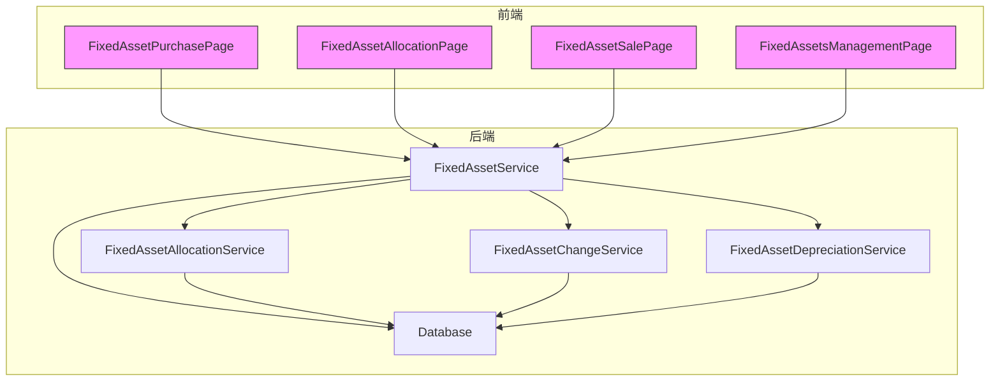
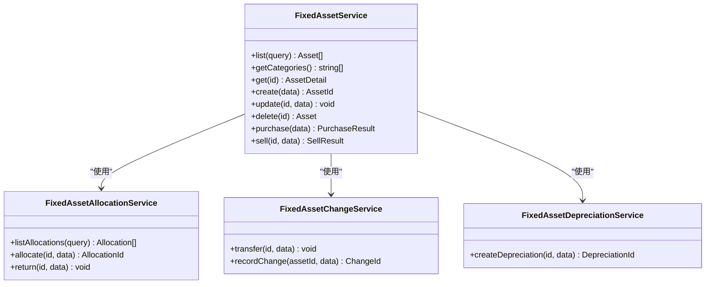
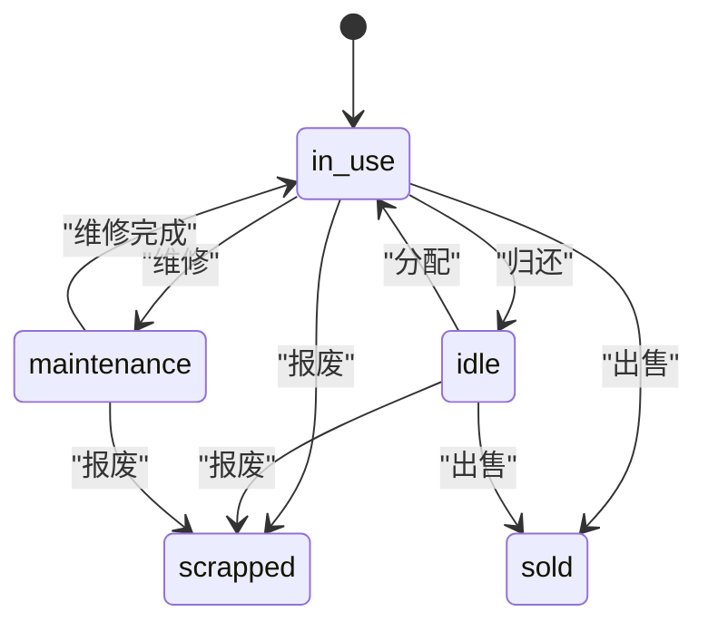
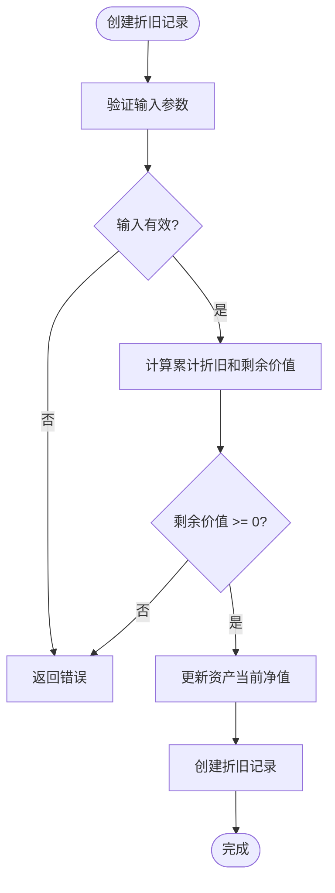
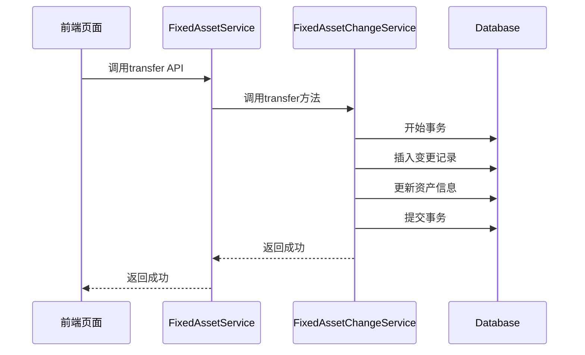
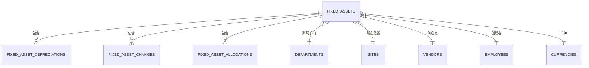

# 固定资产管理

<cite>
**本文档引用的文件**  
- [FixedAssetService.ts](file://backend/src/services/FixedAssetService.ts)
- [FixedAssetAllocationService.ts](file://backend/src/services/FixedAssetAllocationService.ts)
- [FixedAssetChangeService.ts](file://backend/src/services/FixedAssetChangeService.ts)
- [FixedAssetDepreciationService.ts](file://backend/src/services/FixedAssetDepreciationService.ts)
- [fixed-assets.ts](file://backend/src/routes/v2/fixed-assets.ts)
- [FixedAssetPurchasePage.tsx](file://frontend/src/features/assets/pages/FixedAssetPurchasePage.tsx)
- [FixedAssetAllocationPage.tsx](file://frontend/src/features/assets/pages/FixedAssetAllocationPage.tsx)
- [FixedAssetSalePage.tsx](file://frontend/src/features/assets/pages/FixedAssetSalePage.tsx)
- [FixedAssetsManagementPage.tsx](file://frontend/src/features/assets/pages/FixedAssetsManagementPage.tsx)
- [schema.ts](file://backend/src/db/schema.ts)
- [state-machine.ts](file://backend/src/utils/state-machine.ts)
- [business.schema.ts](file://backend/src/schemas/business.schema.ts)
- [fixedAsset.schema.ts](file://frontend/src/validations/fixedAsset.schema.ts)
</cite>

## 目录
1. [引言](#引言)
2. [项目结构](#项目结构)
3. [核心组件](#核心组件)
4. [架构概述](#架构概述)
5. [详细组件分析](#详细组件分析)
6. [依赖分析](#依赖分析)
7. [性能考虑](#性能考虑)
8. [故障排除指南](#故障排除指南)
9. [结论](#结论)

## 引言
本文档旨在全面阐述固定资产管理模块的设计与实现，涵盖资产的全生命周期管理，包括资产采购、调拨、折旧和处置四大核心功能。文档详细说明了`FixedAssetService`作为主服务如何协调`FixedAssetAllocationService`（资产分配）、`FixedAssetChangeService`（资产变更）和`FixedAssetDepreciationService`（折旧管理）三个子服务。同时，解释了资产状态机、折旧计算方法、调拨流程和处置逻辑，并结合前端管理页面说明资产管理人员的操作流程，提供资产相关API的使用指南和常见问题排查方法。

## 项目结构
固定资产管理模块的代码分布在后端服务和前端页面中。后端服务位于`backend/src/services/`目录下，主要包括`FixedAssetService`、`FixedAssetAllocationService`、`FixedAssetChangeService`和`FixedAssetDepreciationService`四个核心服务类。这些服务通过`backend/src/routes/v2/fixed-assets.ts`文件暴露RESTful API。前端页面位于`frontend/src/features/assets/pages/`目录下，包括资产采购、分配、出售和综合管理页面。

**Section sources**
- [FixedAssetService.ts](file://backend/src/services/FixedAssetService.ts)
- [FixedAssetAllocationService.ts](file://backend/src/services/FixedAssetAllocationService.ts)
- [FixedAssetChangeService.ts](file://backend/src/services/FixedAssetChangeService.ts)
- [FixedAssetDepreciationService.ts](file://backend/src/services/FixedAssetDepreciationService.ts)
- [fixed-assets.ts](file://backend/src/routes/v2/fixed-assets.ts)
- [FixedAssetPurchasePage.tsx](file://frontend/src/features/assets/pages/FixedAssetPurchasePage.tsx)
- [FixedAssetAllocationPage.tsx](file://frontend/src/features/assets/pages/FixedAssetAllocationPage.tsx)
- [FixedAssetSalePage.tsx](file://frontend/src/features/assets/pages/FixedAssetSalePage.tsx)
- [FixedAssetsManagementPage.tsx](file://frontend/src/features/assets/pages/FixedAssetsManagementPage.tsx)

## 核心组件
固定资产管理模块的核心由一个主服务和三个子服务构成。`FixedAssetService`作为主服务，负责资产的创建、更新、删除以及采购和处置等复合操作。`FixedAssetAllocationService`负责资产的分配和归还，`FixedAssetChangeService`负责资产的转移和变更记录，`FixedAssetDepreciationService`负责折旧的计算和记录。这些服务通过协调工作，实现了资产全生命周期的管理。

**Section sources**
- [FixedAssetService.ts](file://backend/src/services/FixedAssetService.ts#L22-L607)
- [FixedAssetAllocationService.ts](file://backend/src/services/FixedAssetAllocationService.ts#L20-L289)
- [FixedAssetChangeService.ts](file://backend/src/services/FixedAssetChangeService.ts#L13-L114)
- [FixedAssetDepreciationService.ts](file://backend/src/services/FixedAssetDepreciationService.ts#L14-L78)

## 架构概述
固定资产管理模块采用分层架构，前端通过API与后端服务交互，后端服务通过数据库访问层与数据库进行数据交换。主服务`FixedAssetService`在执行复杂业务逻辑时，会调用子服务来完成特定任务，确保了代码的模块化和可维护性。



**Diagram sources **
- [FixedAssetService.ts](file://backend/src/services/FixedAssetService.ts)
- [FixedAssetAllocationService.ts](file://backend/src/services/FixedAssetAllocationService.ts)
- [FixedAssetChangeService.ts](file://backend/src/services/FixedAssetChangeService.ts)
- [FixedAssetDepreciationService.ts](file://backend/src/services/FixedAssetDepreciationService.ts)
- [FixedAssetPurchasePage.tsx](file://frontend/src/features/assets/pages/FixedAssetPurchasePage.tsx)
- [FixedAssetAllocationPage.tsx](file://frontend/src/features/assets/pages/FixedAssetAllocationPage.tsx)
- [FixedAssetSalePage.tsx](file://frontend/src/features/assets/pages/FixedAssetSalePage.tsx)
- [FixedAssetsManagementPage.tsx](file://frontend/src/features/assets/pages/FixedAssetsManagementPage.tsx)

## 详细组件分析

### FixedAssetService 分析
`FixedAssetService`是固定资产管理的主服务，负责处理资产的全生命周期操作。它不仅管理资产的基本信息（如创建、更新、删除），还封装了复杂的业务流程，如资产采购和处置。在采购流程中，该服务会协调创建资产记录、生成现金流水、创建交易记录和记录资产变更日志，确保所有操作在一个数据库事务中完成，保证了数据的一致性。



**Diagram sources **
- [FixedAssetService.ts](file://backend/src/services/FixedAssetService.ts#L22-L607)
- [FixedAssetAllocationService.ts](file://backend/src/services/FixedAssetAllocationService.ts#L20-L289)
- [FixedAssetChangeService.ts](file://backend/src/services/FixedAssetChangeService.ts#L13-L114)
- [FixedAssetDepreciationService.ts](file://backend/src/services/FixedAssetDepreciationService.ts#L14-L78)

### 资产状态机分析
资产状态机定义了资产在不同状态之间的合法转换。根据数据库模式，资产的状态包括`in_use`（使用中）、`idle`（闲置）、`maintenance`（维修中）、`scrapped`（已报废）和`sold`（已出售）。状态转换受到严格控制，例如，只有在“使用中”或“闲置”状态的资产才能被分配，而一旦资产被“出售”，其状态将变为“sold”，不能再进行其他操作。



**Diagram sources **
- [schema.ts](file://backend/src/db/schema.ts#L518-L529)
- [FixedAssetAllocationService.ts](file://backend/src/services/FixedAssetAllocationService.ts#L125-L127)
- [FixedAssetService.ts](file://backend/src/services/FixedAssetService.ts#L490-L492)

### 折旧计算方法分析
折旧管理由`FixedAssetDepreciationService`负责。该服务在创建折旧记录时，会验证折旧金额是否超过资产的购买价格。系统会自动计算累计折旧和剩余价值，并更新资产的当前净值。折旧记录与资产本身关联，确保了财务数据的准确性。



**Diagram sources **
- [FixedAssetDepreciationService.ts](file://backend/src/services/FixedAssetDepreciationService.ts#L42-L47)
- [FixedAssetDepreciationService.ts](file://backend/src/services/FixedAssetDepreciationService.ts#L52-L72)

### 调拨流程分析
资产调拨流程由`FixedAssetChangeService`的`transfer`方法实现。该流程允许改变资产的所属部门、位置和责任人。调拨操作会创建一条变更记录，记录调拨前后的状态，并更新资产的主记录。调拨日期是必填项，且至少需要指定一个变更目标（部门、位置或责任人）。



**Diagram sources **
- [fixed-assets.ts](file://backend/src/routes/v2/fixed-assets.ts#L548-L611)
- [FixedAssetChangeService.ts](file://backend/src/services/FixedAssetChangeService.ts#L19-L78)

### 处置逻辑分析
资产处置（出售）由`FixedAssetService`的`sell`方法处理。该流程首先检查资产是否已出售，然后验证目标账户的有效性。处置操作会更新资产状态为“sold”，并生成相应的现金流入流水和交易记录。同时，会创建一条资产变更日志，记录出售详情。

```mermaid
flowchart TD
A([资产出售]) --> B{资产状态为"sold"?}
B --> |是| C[抛出业务错误]
B --> |否| D{账户有效?}
D --> |否| C
D --> |是| E[更新资产状态为"sold"]
E --> F[创建现金流入流水]
F --> G[创建交易记录]
G --> H[创建资产变更日志]
H --> I[返回成功]
```

**Diagram sources **
- [FixedAssetService.ts](file://backend/src/services/FixedAssetService.ts#L470-L604)

## 依赖分析
固定资产管理模块依赖于多个其他服务和数据表。`FixedAssetService`依赖于`FinanceService`来获取账户余额，依赖于`QueryBuilder`来批量获取关联数据。数据表之间存在明确的关联关系，如`fixed_assets`表与`departments`、`sites`、`vendors`等表通过外键关联。



**Diagram sources **
- [schema.ts](file://backend/src/db/schema.ts#L506-L574)

## 性能考虑
为了提高性能，系统在查询资产列表时，使用`QueryBuilder`工具类批量提取和获取关联ID，避免了N+1查询问题。此外，数据库表上建立了适当的索引，如`fixed_assets`表上的`departmentId`和`status`索引，以加速查询操作。

**Section sources**
- [FixedAssetService.ts](file://backend/src/services/FixedAssetService.ts#L59-L87)
- [schema.ts](file://backend/src/db/schema.ts)

## 故障排除指南
### 常见问题
1.  **无法创建资产**：检查资产代码是否已存在，确保所有必填字段都已填写。
2.  **无法分配资产**：检查资产状态是否为“使用中”或“闲置”，并确认该资产没有未归还的分配记录。
3.  **折旧失败**：检查折旧金额是否超过了资产的购买价格。
4.  **API权限错误**：确认当前用户具有执行该操作的权限。

### API使用指南
- **采购资产**：使用`POST /fixed-assets/purchase`接口，需提供资产信息、账户信息和支出类别。
- **分配资产**：使用`POST /fixed-assets/allocate`接口，需提供资产ID和员工ID。
- **记录折旧**：使用`POST /fixed-assets/{id}/depreciation`接口，需提供折旧金额和日期。
- **出售资产**：使用`POST /fixed-assets/{id}/sell`接口，需提供出售价格、账户和收入类别。

**Section sources**
- [FixedAssetService.ts](file://backend/src/services/FixedAssetService.ts)
- [fixed-assets.ts](file://backend/src/routes/v2/fixed-assets.ts)

## 结论
本文档详细介绍了固定资产管理模块的架构、核心组件、业务流程和API使用方法。通过主服务与子服务的协同工作，系统实现了资产从采购到处置的全生命周期管理。清晰的状态机和严谨的业务逻辑确保了数据的准确性和一致性。前端页面与后端API紧密结合，为资产管理人员提供了直观、高效的操作体验。