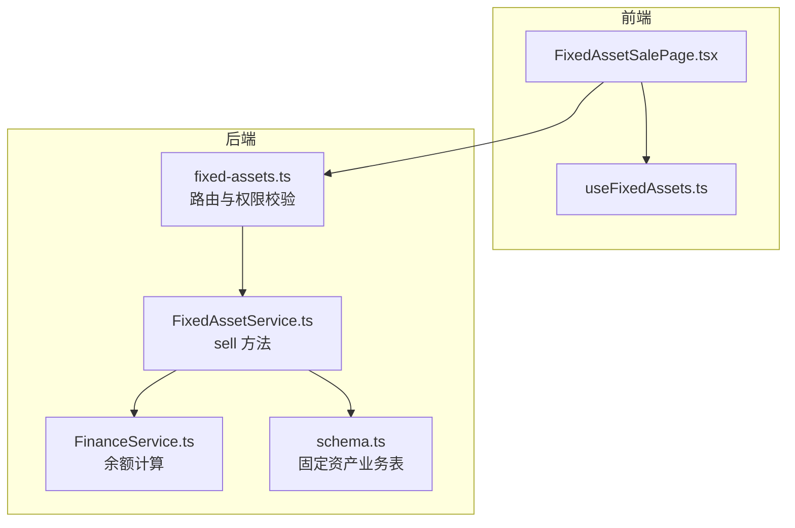
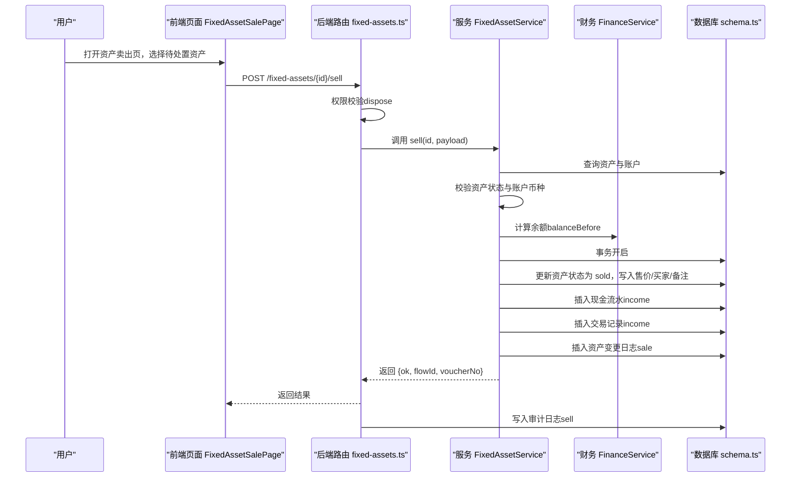
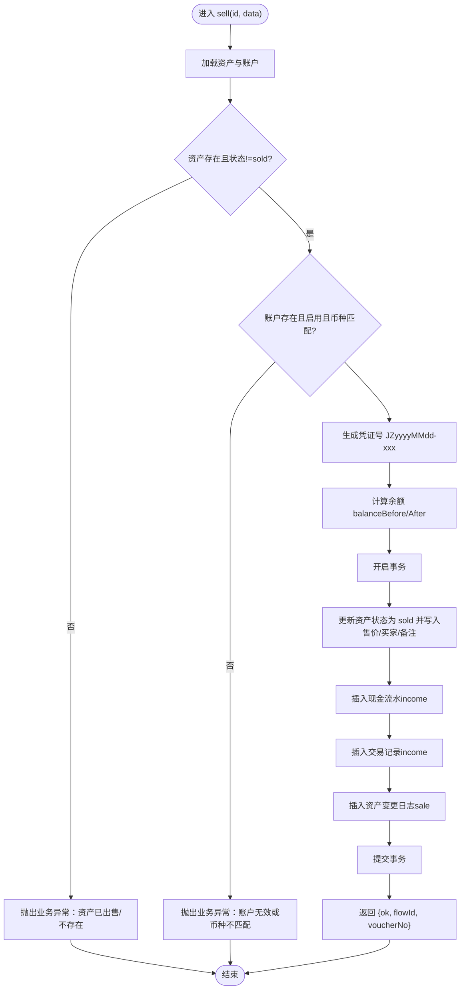
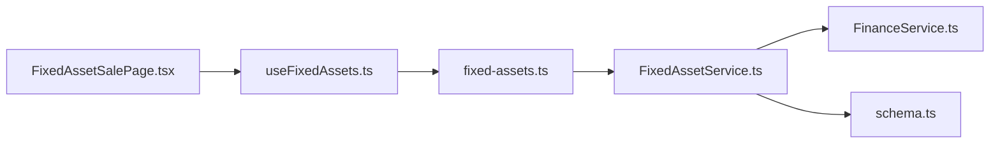

# 资产处置

<cite>
**本文引用的文件**
- [FixedAssetService.ts](file://backend/src/services/FixedAssetService.ts)
- [fixed-assets.ts](file://backend/src/routes/v2/fixed-assets.ts)
- [schema.ts](file://backend/src/db/schema.ts)
- [FinanceService.ts](file://backend/src/services/FinanceService.ts)
- [business.schema.ts](file://backend/src/schemas/business.schema.ts)
- [FixedAssetSalePage.tsx](file://frontend/src/features/assets/pages/FixedAssetSalePage.tsx)
- [useFixedAssets.ts](file://frontend/src/hooks/business/useFixedAssets.ts)
- [schema.d.ts](file://frontend/src/types/schema.d.ts)
</cite>

## 目录
1. [简介](#简介)
2. [项目结构](#项目结构)
3. [核心组件](#核心组件)
4. [架构总览](#架构总览)
5. [详细组件分析](#详细组件分析)
6. [依赖关系分析](#依赖关系分析)
7. [性能考量](#性能考量)
8. [故障排查指南](#故障排查指南)
9. [结论](#结论)
10. [附录](#附录)

## 简介
本文件围绕“资产处置（变卖 sell）”功能进行系统化说明，覆盖后端服务实现、前端交互、数据模型、凭证号生成规则、事务一致性、状态校验与财务入账等关键点。目标读者既包括开发者也包括非技术使用者，力求以循序渐进的方式呈现从用户操作到数据库落库的完整链路。

## 项目结构
资产处置涉及前后端协作：
- 后端
  - 路由层：定义 /fixed-assets/{id}/sell 接口，负责鉴权与参数校验
  - 服务层：FixedAssetService.sell 实现业务逻辑，包含状态校验、账户币种匹配、凭证号生成、事务写入
  - 数据层：Drizzle ORM 映射 fixed_assets、cash_flows、account_transactions、fixed_asset_changes 等表
  - 财务服务：FinanceService 提供账户余额计算辅助
- 前端
  - 页面 FixedAssetSalePage 提供资产筛选、表单填写、价格与币种校验、凭证上传
  - Hook useFixedAssets.ts 提供资产列表查询与缓存策略

图表来源
- [fixed-assets.ts](file://backend/src/routes/v2/fixed-assets.ts#L694-L765)
- [FixedAssetService.ts](file://backend/src/services/FixedAssetService.ts#L470-L607)
- [FinanceService.ts](file://backend/src/services/FinanceService.ts#L41-L114)
- [schema.ts](file://backend/src/db/schema.ts#L506-L561)

章节来源
- [fixed-assets.ts](file://backend/src/routes/v2/fixed-assets.ts#L694-L765)
- [FixedAssetService.ts](file://backend/src/services/FixedAssetService.ts#L470-L607)
- [schema.ts](file://backend/src/db/schema.ts#L506-L561)

## 核心组件
- 后端接口与权限
  - /fixed-assets/{id}/sell：POST，要求 dispose 权限，接收 saleDate、salePriceCents、currency、accountId、categoryId、voucherUrl、saleBuyer、saleMemo、memo 等字段
- 服务层 sell 流程
  - 资产存在性与状态校验（禁止重复出售）
  - 账户有效性与币种匹配校验
  - 凭证号生成规则（JZyyyyMMdd-xxx）
  - 事务内执行四步写入：更新资产状态与售价、创建现金流水、创建交易记录、记录资产变更日志
- 前端页面与交互
  - 过滤掉已售出/报废资产，仅展示可处置资产
  - 表单校验：日期、金额、币种与账户币种一致、凭证上传
  - 成功提示与凭证号回显

章节来源
- [fixed-assets.ts](file://backend/src/routes/v2/fixed-assets.ts#L694-L765)
- [FixedAssetService.ts](file://backend/src/services/FixedAssetService.ts#L470-L607)
- [FixedAssetSalePage.tsx](file://frontend/src/features/assets/pages/FixedAssetSalePage.tsx#L25-L198)

## 架构总览
下图展示了资产变卖的端到端调用序列，从前端发起请求到后端服务落库与审计日志记录。

图表来源
- [fixed-assets.ts](file://backend/src/routes/v2/fixed-assets.ts#L694-L765)
- [FixedAssetService.ts](file://backend/src/services/FixedAssetService.ts#L470-L607)
- [FinanceService.ts](file://backend/src/services/FinanceService.ts#L41-L114)
- [schema.ts](file://backend/src/db/schema.ts#L506-L561)

## 详细组件分析

### 后端服务：FixedAssetService.sell
- 输入参数与约束
  - 必填：saleDate、salePriceCents（>0）、currency（3位）、accountId、categoryId
  - 可选：voucherUrl、saleBuyer、saleMemo、memo
- 核心校验
  - 资产存在且状态非 sold（防止重复出售）
  - 账户存在、启用、币种与传入 currency 匹配
- 凭证号生成规则
  - 基于业务日期 bizDate 的序列计数，格式为 JZyyyyMMdd-xxx（三位递增序号）
- 事务处理
  - 步骤一：更新资产状态为 sold，写入 saleDate、salePriceCents、saleBuyer、saleMemo、updatedAt
  - 步骤二：插入 cash_flows（type=income，amountCents=售价，memo含资产信息）
  - 步骤三：插入 account_transactions（transactionType=income，balanceBefore/balanceAfter 基于余额计算）
  - 步骤四：插入 fixed_asset_changes（changeType=sale，fromStatus=原状态，toStatus=sold）
- 返回值
  - ok、flowId、voucherNo

图表来源
- [FixedAssetService.ts](file://backend/src/services/FixedAssetService.ts#L470-L607)

章节来源
- [FixedAssetService.ts](file://backend/src/services/FixedAssetService.ts#L470-L607)
- [business.schema.ts](file://backend/src/schemas/business.schema.ts#L768-L779)

### 路由层：/fixed-assets/{id}/sell
- 权限控制：要求 dispose 权限
- 参数校验：基于 sellFixedAssetSchema
- 审计日志：记录 sell 动作及售价

章节来源
- [fixed-assets.ts](file://backend/src/routes/v2/fixed-assets.ts#L694-L765)
- [business.schema.ts](file://backend/src/schemas/business.schema.ts#L768-L779)

### 数据模型：资产与财务相关表
- 固定资产表（fixed_assets）
  - 关键字段：status、saleDate、salePriceCents、saleBuyer、saleMemo
- 现金流表（cash_flows）
  - 关键字段：voucherNo、bizDate、type、accountId、categoryId、amountCents、memo、voucherUrl
- 账户交易表（account_transactions）
  - 关键字段：flowId、transactionDate、transactionType、amountCents、balanceBeforeCents、balanceAfterCents
- 资产变更日志（fixed_asset_changes）
  - 关键字段：changeType、changeDate、fromStatus、toStatus、memo

章节来源
- [schema.ts](file://backend/src/db/schema.ts#L506-L561)

### 前端页面：FixedAssetSalePage
- 资产筛选
  - 默认过滤掉 status='sold' 或 'scrapped' 的资产
- 表单字段
  - 卖出日期、卖出价格、收入账户（按币种过滤）、收入类别、买方信息、凭证上传、备注
- 价格与币种校验
  - 将金额乘以 100 转为分（cents）
  - 校验账户币种与资产币种一致
- 成功反馈
  - 成功后提示并显示凭证号

章节来源
- [FixedAssetSalePage.tsx](file://frontend/src/features/assets/pages/FixedAssetSalePage.tsx#L25-L198)
- [useFixedAssets.ts](file://frontend/src/hooks/business/useFixedAssets.ts#L1-L200)
- [schema.d.ts](file://frontend/src/types/schema.d.ts#L5459-L5497)

## 依赖关系分析
- 服务层依赖
  - FixedAssetService 依赖 Drizzle ORM 对多张表进行读写
  - 依赖 FinanceService 计算余额
- 路由层依赖
  - 依赖权限中间件与审计日志工具
- 前端依赖
  - 依赖 useFixedAssets.ts 提供资产列表与缓存
  - 依赖 useFixedAssetSale() 发起 sell 请求

图表来源
- [fixed-assets.ts](file://backend/src/routes/v2/fixed-assets.ts#L694-L765)
- [FixedAssetService.ts](file://backend/src/services/FixedAssetService.ts#L470-L607)
- [FinanceService.ts](file://backend/src/services/FinanceService.ts#L41-L114)
- [schema.ts](file://backend/src/db/schema.ts#L506-L561)
- [FixedAssetSalePage.tsx](file://frontend/src/features/assets/pages/FixedAssetSalePage.tsx#L25-L198)
- [useFixedAssets.ts](file://frontend/src/hooks/business/useFixedAssets.ts#L1-L200)

## 性能考量
- 余额计算
  - 通过 FinanceService 的历史交易回溯计算余额，避免维护冗余字段，但需注意历史交易索引与查询效率
- 事务边界
  - sell 在单事务内完成资产状态、现金流、交易记录与变更日志的写入，保证强一致性
- 前端缓存
  - useFixedAssets.ts 使用 React Query 缓存资产列表，减少重复请求

章节来源
- [FinanceService.ts](file://backend/src/services/FinanceService.ts#L41-L114)
- [FixedAssetService.ts](file://backend/src/services/FixedAssetService.ts#L470-L607)
- [useFixedAssets.ts](file://frontend/src/hooks/business/useFixedAssets.ts#L1-L200)

## 故障排查指南
- 常见错误与定位
  - 资产不存在或状态为 sold：检查资产 ID 与状态
  - 账户不存在或停用或币种不匹配：核对 accountId 与 currency
  - 金额非法：确认 salePriceCents 为正整数（分）
  - 凭证上传失败：检查文件类型与大小限制
- 日志与审计
  - 后端会记录 sell 审计日志，便于追踪操作人与金额
- 前端提示
  - 若账户币种与资产币种不一致，前端会给出明确提示

章节来源
- [FixedAssetService.ts](file://backend/src/services/FixedAssetService.ts#L470-L607)
- [fixed-assets.ts](file://backend/src/routes/v2/fixed-assets.ts#L727-L765)
- [FixedAssetSalePage.tsx](file://frontend/src/features/assets/pages/FixedAssetSalePage.tsx#L97-L128)

## 结论
资产变卖（sell）流程在后端通过严格的参数校验、账户币种匹配与事务一致性保障，实现了资产状态变更、财务入账与审计日志的闭环。前端通过直观的表单与校验，提升了用户体验与数据准确性。凭证号生成规则统一且可追溯，便于后续对账与审计。

## 附录

### 凭证号生成规则说明
- 规则：JZyyyyMMdd-xxx
- 生成逻辑
  - 以 bizDate 为粒度统计当日流水数量，序号从 1 开始，不足三位前补 0
  - 例如：2025-01-01 当日第 5 条流水，凭证号为 JZ20250101-005

章节来源
- [FixedAssetService.ts](file://backend/src/services/FixedAssetService.ts#L513-L521)

### 处置后的资产查询限制
- 前端默认过滤掉 status='sold' 与 'scrapped' 的资产，避免重复处置
- 后端 sell 逻辑同样拒绝已售出资产

章节来源
- [FixedAssetSalePage.tsx](file://frontend/src/features/assets/pages/FixedAssetSalePage.tsx#L45-L58)
- [FixedAssetService.ts](file://backend/src/services/FixedAssetService.ts#L485-L492)

### 财务报表影响说明
- 现金流（cash_flows）
  - 类型为 income，金额为卖出价格，memo 包含资产名称与编号
- 账户交易（account_transactions）
  - 类型为 income，记录 balanceBefore 与 balanceAfter，便于余额核对
- 资产变更日志（fixed_asset_changes）
  - 记录 sale 变更，fromStatus 为原状态，toStatus 为 sold

章节来源
- [FixedAssetService.ts](file://backend/src/services/FixedAssetService.ts#L546-L601)
- [schema.ts](file://backend/src/db/schema.ts#L506-L561)