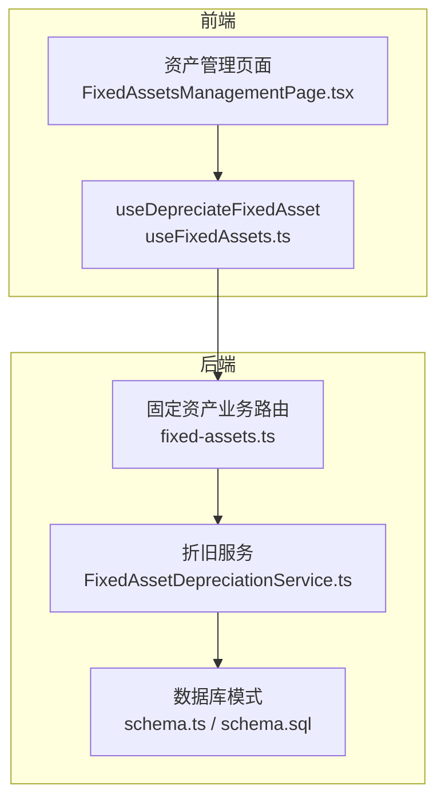
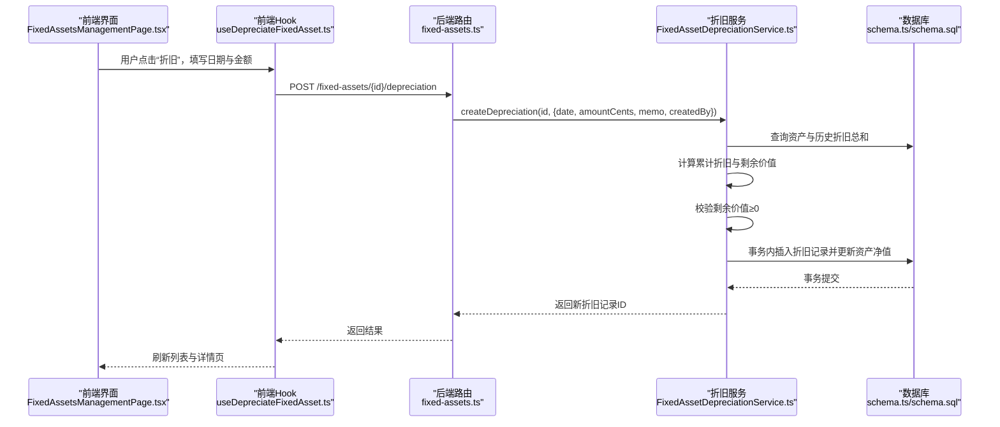
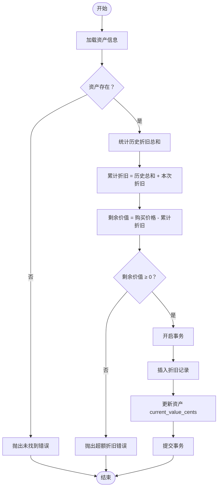
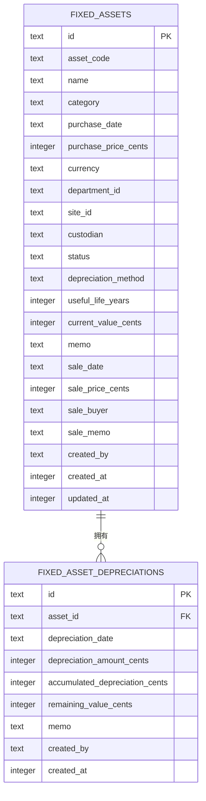

# 资产折旧

<cite>
**本文引用的文件**
- [FixedAssetDepreciationService.ts](file://backend/src/services/FixedAssetDepreciationService.ts)
- [fixed-assets.ts](file://backend/src/routes/v2/fixed-assets.ts)
- [schema.ts](file://backend/src/db/schema.ts)
- [schema.sql](file://backend/src/db/schema.sql)
- [0000_snapshot.json](file://backend/drizzle/meta/0000_snapshot.json)
- [FixedAssetsManagementPage.tsx](file://frontend/src/features/assets/pages/FixedAssetsManagementPage.tsx)
- [useFixedAssets.ts](file://frontend/src/hooks/business/useFixedAssets.ts)
- [fixedAsset.schema.ts](file://frontend/src/validations/fixedAsset.schema.ts)
</cite>

## 目录
1. [简介](#简介)
2. [项目结构](#项目结构)
3. [核心组件](#核心组件)
4. [架构总览](#架构总览)
5. [详细组件分析](#详细组件分析)
6. [依赖分析](#依赖分析)
7. [性能考虑](#性能考虑)
8. [故障排查指南](#故障排查指南)
9. [结论](#结论)
10. [附录](#附录)

## 简介
本文件围绕“固定资产折旧”功能进行系统化文档说明，重点覆盖以下方面：
- 折旧计算与记录机制：累计折旧、剩余价值的计算逻辑，以及对折旧金额不超过资产原值的校验。
- 数据模型：折旧记录表（fixed_asset_depreciations）的结构与与主资产表（fixed_assets）的关联关系。
- 事务一致性：通过数据库事务确保折旧记录与资产净值字段的一致性更新。
- 前端集成：资产管理页面中的折旧入口、历史记录展示与财务影响呈现。
- 实操示例与异常处理：折旧计算示例、超额折旧等异常场景的处理策略。

## 项目结构
本功能涉及后端服务层、路由层、数据库模式与前端页面/Hook三部分协作：
- 后端
  - 服务层：FixedAssetDepreciationService 提供折旧创建能力。
  - 路由层：/fixed-assets/{id}/depreciation 接口暴露折旧创建。
  - 数据库：fixed_assets 与 fixed_asset_depreciations 表定义。
- 前端
  - 页面：资产管理页面提供折旧入口与历史记录展示。
  - Hook：useDepreciateFixedAsset 封装折旧请求与缓存失效。
  - 校验：表单校验约束折旧金额非负。

图表来源
- [FixedAssetsManagementPage.tsx](file://frontend/src/features/assets/pages/FixedAssetsManagementPage.tsx#L176-L191)
- [useFixedAssets.ts](file://frontend/src/hooks/business/useFixedAssets.ts#L118-L129)
- [fixed-assets.ts](file://backend/src/routes/v2/fixed-assets.ts#L487-L546)
- [FixedAssetDepreciationService.ts](file://backend/src/services/FixedAssetDepreciationService.ts#L17-L76)
- [schema.ts](file://backend/src/db/schema.ts#L506-L542)
- [schema.sql](file://backend/src/db/schema.sql#L471-L509)

章节来源
- [FixedAssetsManagementPage.tsx](file://frontend/src/features/assets/pages/FixedAssetsManagementPage.tsx#L176-L191)
- [useFixedAssets.ts](file://frontend/src/hooks/business/useFixedAssets.ts#L118-L129)
- [fixed-assets.ts](file://backend/src/routes/v2/fixed-assets.ts#L487-L546)
- [FixedAssetDepreciationService.ts](file://backend/src/services/FixedAssetDepreciationService.ts#L17-L76)
- [schema.ts](file://backend/src/db/schema.ts#L506-L542)
- [schema.sql](file://backend/src/db/schema.sql#L471-L509)

## 核心组件
- FixedAssetDepreciationService.createDepreciation
  - 输入：资产ID、折旧日期、折旧金额（分）、可选备注、创建者。
  - 关键流程：
    - 查询资产是否存在。
    - 统计该资产已有折旧总和，计算累计折旧与剩余价值。
    - 校验剩余价值是否小于0（即折旧金额超过购买价格），超限则抛业务异常。
    - 在事务中写入折旧记录并同步更新资产的 current_value_cents 字段。
  - 输出：返回新折旧记录的ID。

- 路由接口 /fixed-assets/{id}/depreciation
  - 权限控制：需要具备“资产-固定资产-折旧”权限。
  - 参数校验：使用 createDepreciationSchema。
  - 调用服务层执行折旧创建，并记录审计日志。

- 数据模型
  - fixed_assets：包含 purchase_price_cents、current_value_cents、depreciation_method、useful_life_years 等字段。
  - fixed_asset_depreciations：记录每次折旧的日期、金额、累计折旧、剩余价值等。

章节来源
- [FixedAssetDepreciationService.ts](file://backend/src/services/FixedAssetDepreciationService.ts#L17-L76)
- [fixed-assets.ts](file://backend/src/routes/v2/fixed-assets.ts#L487-L546)
- [schema.ts](file://backend/src/db/schema.ts#L506-L542)
- [schema.sql](file://backend/src/db/schema.sql#L471-L509)

## 架构总览
下图展示了从前端到后端再到数据库的完整折旧流程。

图表来源
- [FixedAssetsManagementPage.tsx](file://frontend/src/features/assets/pages/FixedAssetsManagementPage.tsx#L176-L191)
- [useFixedAssets.ts](file://frontend/src/hooks/business/useFixedAssets.ts#L118-L129)
- [fixed-assets.ts](file://backend/src/routes/v2/fixed-assets.ts#L487-L546)
- [FixedAssetDepreciationService.ts](file://backend/src/services/FixedAssetDepreciationService.ts#L17-L76)
- [schema.ts](file://backend/src/db/schema.ts#L506-L542)
- [schema.sql](file://backend/src/db/schema.sql#L471-L509)

## 详细组件分析

### 后端服务：FixedAssetDepreciationService.createDepreciation
- 功能要点
  - 资产存在性校验：若资产不存在，抛出未找到错误。
  - 历史折旧统计：按资产ID聚合已发生折旧总和，与本次折旧金额相加得到累计折旧。
  - 剩余价值计算：用购买价格（分）减去累计折旧，作为剩余价值。
  - 额度校验：若剩余价值为负，抛出业务异常，防止超额折旧。
  - 事务一致性：在单个事务中完成折旧记录插入与资产净值字段更新，保证原子性。
  - 时间戳：统一使用毫秒级时间戳，便于后续排序与审计。

- 数据流与复杂度
  - 查询资产与历史折旧：O(1) 单表查询；历史折旧聚合为 O(n)（n为历史折旧条目数）。
  - 事务写入：插入一条折旧记录与一次资产更新，均为 O(1)。
  - 整体复杂度：O(n)（主要受历史折旧条目数量影响）。

- 错误处理
  - 资产不存在：抛出未找到错误。
  - 超额折旧：抛出业务异常，提示“折旧金额超过购买价格”。

- 事务与一致性
  - 使用数据库事务包裹插入与更新，避免中间状态导致的数据不一致。

章节来源
- [FixedAssetDepreciationService.ts](file://backend/src/services/FixedAssetDepreciationService.ts#L17-L76)

### 路由层：/fixed-assets/{id}/depreciation
- 权限控制：仅具备“资产-固定资产-折旧”权限的用户可操作。
- 参数校验：使用 createDepreciationSchema，要求折旧日期与折旧金额（分）非空且金额非负。
- 审计日志：记录折旧动作及金额，便于追踪。

章节来源
- [fixed-assets.ts](file://backend/src/routes/v2/fixed-assets.ts#L487-L546)

### 数据模型：fixed_assets 与 fixed_asset_depreciations
- fixed_assets
  - 关键字段：asset_code、name、category、purchase_date、purchase_price_cents、currency、department_id、site_id、custodian、status、depreciation_method、useful_life_years、current_value_cents、memo、sale_date、sale_price_cents、sale_buyer、sale_memo、created_by、created_at、updated_at。
  - 与折旧记录的关系：一对多（一个资产对应多条折旧记录）。

- fixed_asset_depreciations
  - 关键字段：id、asset_id、depreciation_date、depreciation_amount_cents、accumulated_depreciation_cents、remaining_value_cents、memo、created_by、created_at。
  - 与资产表关联：asset_id 外键指向 fixed_assets.id。

- 数据库快照与SQL
  - 快照与SQL均定义了上述字段与约束，确保前后端与迁移脚本一致。

章节来源
- [schema.ts](file://backend/src/db/schema.ts#L506-L542)
- [schema.sql](file://backend/src/db/schema.sql#L471-L509)
- [0000_snapshot.json](file://backend/drizzle/meta/0000_snapshot.json#L2085-L2140)

### 前端：资产管理页面与折旧入口
- 折旧入口
  - 在资产列表行中提供“折旧”按钮，打开模态框输入折旧日期与金额。
  - 表单校验：折旧金额必须为非负数。
- 历史记录展示
  - 在资产详情页的“折旧记录”标签中，展示折旧日期、折旧金额、累计折旧、剩余价值与备注。
- 财务影响
  - 当前净值（current_value_cents）随每次折旧自动更新，前端以金额格式显示，直观反映资产账面价值变化。

章节来源
- [FixedAssetsManagementPage.tsx](file://frontend/src/features/assets/pages/FixedAssetsManagementPage.tsx#L176-L191)
- [FixedAssetsManagementPage.tsx](file://frontend/src/features/assets/pages/FixedAssetsManagementPage.tsx#L486-L500)
- [fixedAsset.schema.ts](file://frontend/src/validations/fixedAsset.schema.ts#L37-L41)

### 前端Hook：useDepreciateFixedAsset
- 功能：封装 POST /fixed-assets/{id}/depreciation 请求。
- 缓存策略：成功后使“资产列表”与“指定资产详情”查询失效，触发重新拉取最新数据。

章节来源
- [useFixedAssets.ts](file://frontend/src/hooks/business/useFixedAssets.ts#L118-L129)

## 依赖分析
- 组件耦合
  - 路由层依赖服务层；服务层依赖数据库模式；前端依赖路由与Hook。
- 外部依赖
  - 数据库：SQLite（通过 Drizzle ORM）。
  - 前端：Ant Design 表单、React Query（TanStack）用于请求与缓存。
- 潜在循环依赖
  - 无直接循环依赖；各层职责清晰，通过接口与DTO解耦。

图表来源
- [useFixedAssets.ts](file://frontend/src/hooks/business/useFixedAssets.ts#L118-L129)
- [fixed-assets.ts](file://backend/src/routes/v2/fixed-assets.ts#L487-L546)
- [FixedAssetDepreciationService.ts](file://backend/src/services/FixedAssetDepreciationService.ts#L17-L76)
- [schema.ts](file://backend/src/db/schema.ts#L506-L542)

章节来源
- [useFixedAssets.ts](file://frontend/src/hooks/business/useFixedAssets.ts#L118-L129)
- [fixed-assets.ts](file://backend/src/routes/v2/fixed-assets.ts#L487-L546)
- [FixedAssetDepreciationService.ts](file://backend/src/services/FixedAssetDepreciationService.ts#L17-L76)
- [schema.ts](file://backend/src/db/schema.ts#L506-L542)

## 性能考虑
- 历史折旧聚合：每次折旧都会对历史折旧进行求和，若历史记录较多，建议：
  - 在数据库层面建立合适的索引（如按 asset_id 的索引）以优化聚合查询。
  - 对高频折旧场景，可在应用层维护累计折旧缓存并在事务提交后更新缓存。
- 事务范围：将折旧记录与资产净值更新放入同一事务，减少并发冲突概率。
- 前端渲染：折旧历史表格采用虚拟滚动与分页，降低大数据量下的渲染压力。

## 故障排查指南
- 常见异常
  - “折旧金额超过购买价格”：检查历史折旧总和与本次折旧金额之和是否超过购买价格（分）。
  - “资产不存在”：确认资产ID正确且资产已创建。
- 排查步骤
  - 后端：查看服务层日志与审计日志，定位具体错误点。
  - 前端：确认表单校验通过、请求URL与参数正确、缓存是否已失效并刷新。
- 事务回滚
  - 若出现部分写入，数据库事务会回滚，确保数据一致性。请重试或检查网络与数据库连接。

章节来源
- [FixedAssetDepreciationService.ts](file://backend/src/services/FixedAssetDepreciationService.ts#L17-L76)
- [fixed-assets.ts](file://backend/src/routes/v2/fixed-assets.ts#L487-L546)

## 结论
本折旧功能通过严谨的计算与事务保障，实现了累计折旧与剩余价值的准确计算，并在前端以直观方式呈现历史折旧与当前净值。服务层与路由层职责清晰，数据模型设计合理，前端交互友好。建议在高并发与历史数据量较大的场景下，进一步优化索引与缓存策略，以提升整体性能与用户体验。

## 附录

### 折旧计算流程图

图表来源
- [FixedAssetDepreciationService.ts](file://backend/src/services/FixedAssetDepreciationService.ts#L17-L76)

### 数据模型ER图

图表来源
- [schema.ts](file://backend/src/db/schema.ts#L506-L542)
- [schema.sql](file://backend/src/db/schema.sql#L471-L509)
- [0000_snapshot.json](file://backend/drizzle/meta/0000_snapshot.json#L2085-L2140)