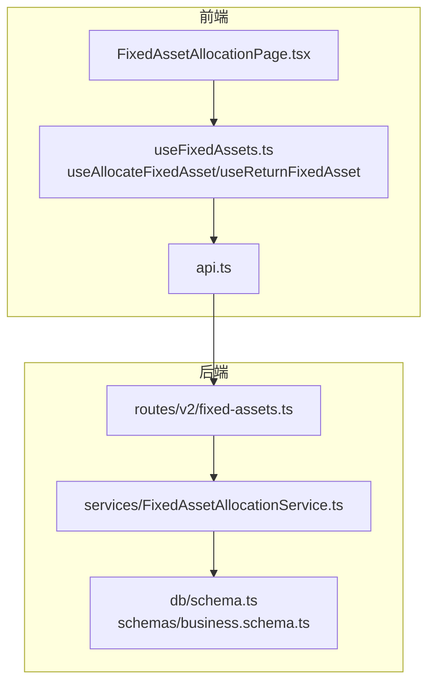
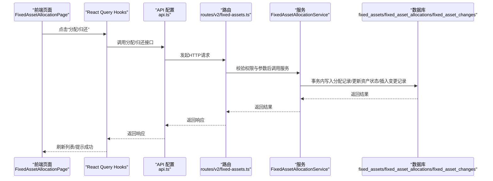
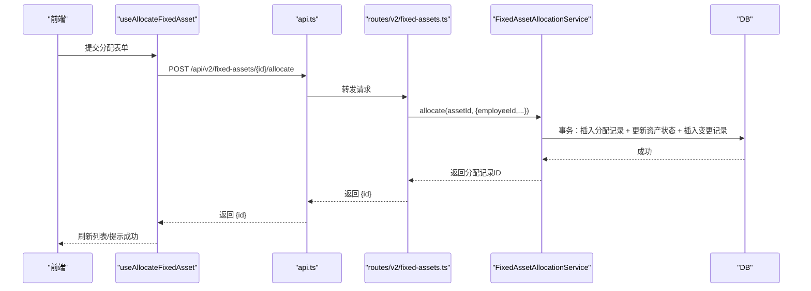
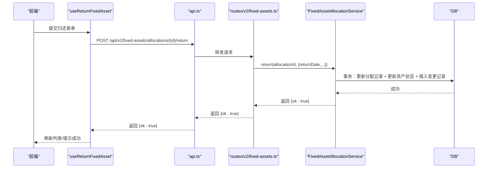
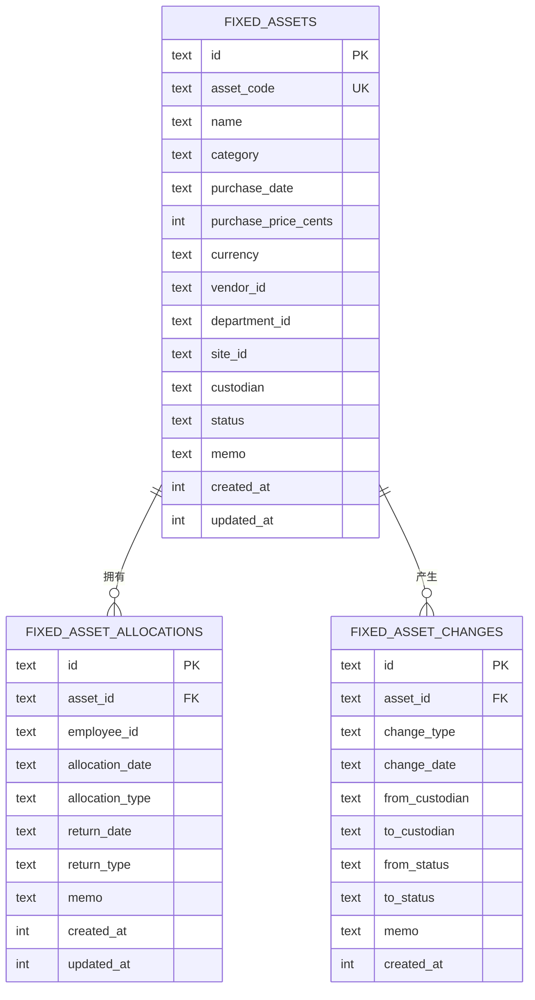
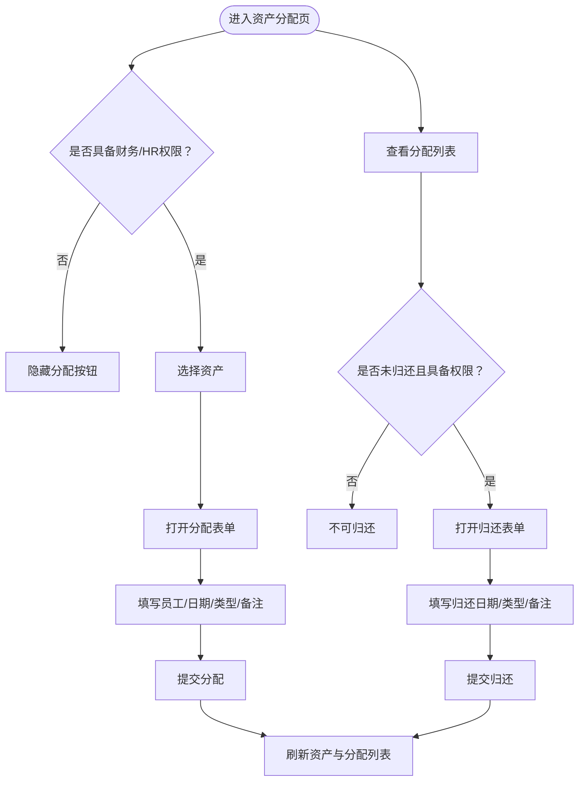
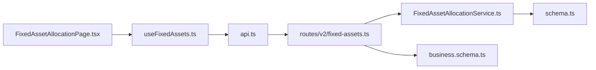

# 资产调拨

<cite>
**本文引用的文件**
- [FixedAssetAllocationService.ts](file://backend/src/services/FixedAssetAllocationService.ts)
- [fixed-assets.ts](file://backend/src/routes/v2/fixed-assets.ts)
- [business.schema.ts](file://backend/src/schemas/business.schema.ts)
- [schema.ts](file://backend/src/db/schema.ts)
- [schema.sql](file://backend/src/db/schema.sql)
- [FixedAssetAllocationPage.tsx](file://frontend/src/features/assets/pages/FixedAssetAllocationPage.tsx)
- [useFixedAssets.ts](file://frontend/src/hooks/business/useFixedAssets.ts)
- [api.ts](file://frontend/src/config/api.ts)
- [domain.ts](file://frontend/src/types/domain.ts)
- [errors.ts](file://backend/src/utils/errors.ts)
</cite>

## 目录
1. [简介](#简介)
2. [项目结构](#项目结构)
3. [核心组件](#核心组件)
4. [架构总览](#架构总览)
5. [详细组件分析](#详细组件分析)
6. [依赖关系分析](#依赖关系分析)
7. [性能考量](#性能考量)
8. [故障排查指南](#故障排查指南)
9. [结论](#结论)
10. [附录](#附录)

## 简介
本文件面向“资产调拨”功能，围绕固定资产的分配（allocate）与归还（return）两大核心操作进行系统化说明。内容覆盖：
- FixedAssetAllocationService 如何管理资产与员工之间的分配关系，包括分配时的状态变更（从闲置或使用中变为使用中）、保管人更新、部门调整等。
- 分配记录表 fixed_asset_allocations 的数据结构与业务规则（例如同一资产不可重复分配未归还）。
- 归还操作如何将资产状态重置为闲置并清除保管人信息。
- 前端 FixedAssetAllocationPage 的调拨操作界面与审批流程说明。
- 错误处理与边界情况的解决方案。

## 项目结构
资产调拨涉及前后端协作的关键模块如下：
- 后端
  - 服务层：FixedAssetAllocationService（分配/归还事务与状态变更）
  - 路由层：/api/v2/fixed-assets/…（分配、归还、列表接口）
  - 数据模型：fixed_assets、fixed_asset_allocations、fixed_asset_changes
  - 校验 Schema：allocateFixedAssetSchema、returnFixedAssetSchema
- 前端
  - 页面：FixedAssetAllocationPage（分配/归还表单与列表）
  - Hooks：useAllocateFixedAsset、useReturnFixedAsset、useFixedAssetAllocations
  - API 配置：api.ts 中的分配/归还端点
  - 类型定义：domain.ts 中的 FixedAsset、FixedAssetAllocation

图表来源
- [FixedAssetAllocationPage.tsx](file://frontend/src/features/assets/pages/FixedAssetAllocationPage.tsx#L1-L326)
- [useFixedAssets.ts](file://frontend/src/hooks/business/useFixedAssets.ts#L131-L155)
- [api.ts](file://frontend/src/config/api.ts#L137-L147)
- [fixed-assets.ts](file://backend/src/routes/v2/fixed-assets.ts#L150-L211)
- [FixedAssetAllocationService.ts](file://backend/src/services/FixedAssetAllocationService.ts#L1-L290)
- [schema.ts](file://backend/src/db/schema.ts#L544-L574)
- [business.schema.ts](file://backend/src/schemas/business.schema.ts#L314-L324)

章节来源
- [FixedAssetAllocationPage.tsx](file://frontend/src/features/assets/pages/FixedAssetAllocationPage.tsx#L1-L326)
- [useFixedAssets.ts](file://frontend/src/hooks/business/useFixedAssets.ts#L131-L155)
- [api.ts](file://frontend/src/config/api.ts#L137-L147)
- [fixed-assets.ts](file://backend/src/routes/v2/fixed-assets.ts#L150-L211)
- [FixedAssetAllocationService.ts](file://backend/src/services/FixedAssetAllocationService.ts#L1-L290)
- [schema.ts](file://backend/src/db/schema.ts#L544-L574)
- [business.schema.ts](file://backend/src/schemas/business.schema.ts#L314-L324)

## 核心组件
- FixedAssetAllocationService：负责分配与归还的业务逻辑，包含事务性写入、状态变更、变更记录插入等。
- 路由层：提供分配/归还/分配列表的 HTTP 接口，携带权限校验与请求体校验。
- 数据模型：fixed_assets、fixed_asset_allocations、fixed_asset_changes 三张表支撑分配与归还的持久化与审计。
- 前端页面：FixedAssetAllocationPage 提供分配/归还表单、筛选与列表展示，并通过 Hooks 触发后端接口。

章节来源
- [FixedAssetAllocationService.ts](file://backend/src/services/FixedAssetAllocationService.ts#L1-L290)
- [fixed-assets.ts](file://backend/src/routes/v2/fixed-assets.ts#L150-L211)
- [schema.ts](file://backend/src/db/schema.ts#L544-L574)
- [FixedAssetAllocationPage.tsx](file://frontend/src/features/assets/pages/FixedAssetAllocationPage.tsx#L1-L326)

## 架构总览
下图展示了从前端到后端再到数据库的完整调拨链路，包括分配与归还两条主路径。

图表来源
- [FixedAssetAllocationPage.tsx](file://frontend/src/features/assets/pages/FixedAssetAllocationPage.tsx#L1-L326)
- [useFixedAssets.ts](file://frontend/src/hooks/business/useFixedAssets.ts#L131-L155)
- [api.ts](file://frontend/src/config/api.ts#L137-L147)
- [fixed-assets.ts](file://backend/src/routes/v2/fixed-assets.ts#L767-L888)
- [FixedAssetAllocationService.ts](file://backend/src/services/FixedAssetAllocationService.ts#L106-L208)

## 详细组件分析

### 分配（allocate）流程
- 前端触发：用户在页面选择资产并填写分配表单（员工、分配日期、分配类型、备注等），提交后通过 useAllocateFixedAsset 触发后端接口。
- 后端路由：/api/v2/fixed-assets/{id}/allocate，接收分配参数并进行权限校验与请求体校验。
- 服务实现：
  - 校验资产存在与状态（仅允许 in_use 或 idle 的资产进行分配）。
  - 校验员工存在且有效。
  - 检查是否存在未归还的分配记录（同一资产不可重复分配未归还）。
  - 事务内执行：
    - 写入 fixed_asset_allocations。
    - 更新 fixed_assets 的状态为 in_use，设置 custodian 为员工姓名，departmentId 为员工部门（若员工有部门）或保持原部门。
    - 插入 fixed_asset_changes，记录分配事件。
- 前端反馈：调用成功后刷新资产与分配列表。

图表来源
- [FixedAssetAllocationPage.tsx](file://frontend/src/features/assets/pages/FixedAssetAllocationPage.tsx#L57-L124)
- [useFixedAssets.ts](file://frontend/src/hooks/business/useFixedAssets.ts#L131-L142)
- [api.ts](file://frontend/src/config/api.ts#L145-L146)
- [fixed-assets.ts](file://backend/src/routes/v2/fixed-assets.ts#L767-L826)
- [FixedAssetAllocationService.ts](file://backend/src/services/FixedAssetAllocationService.ts#L106-L208)

章节来源
- [FixedAssetAllocationPage.tsx](file://frontend/src/features/assets/pages/FixedAssetAllocationPage.tsx#L57-L124)
- [useFixedAssets.ts](file://frontend/src/hooks/business/useFixedAssets.ts#L131-L142)
- [api.ts](file://frontend/src/config/api.ts#L145-L146)
- [fixed-assets.ts](file://backend/src/routes/v2/fixed-assets.ts#L767-L826)
- [FixedAssetAllocationService.ts](file://backend/src/services/FixedAssetAllocationService.ts#L106-L208)

### 归还（return）流程
- 前端触发：用户在分配列表中点击“归还”，填写归还日期、归还类型、备注等，提交后通过 useReturnFixedAsset 触发后端接口。
- 后端路由：/api/v2/fixed-assets/allocations/{id}/return，接收归还参数并进行权限校验与请求体校验。
- 服务实现：
  - 校验资产存在。
  - 查找当前未归还的分配记录（确保资产确处于分配中）。
  - 事务内执行：
    - 更新 fixed_asset_allocations 的 returnDate、returnType、memo。
    - 更新 fixed_assets 的状态为 idle，清空 custodian。
    - 插入 fixed_asset_changes，记录归还事件。
- 前端反馈：调用成功后刷新资产与分配列表。

图表来源
- [FixedAssetAllocationPage.tsx](file://frontend/src/features/assets/pages/FixedAssetAllocationPage.tsx#L71-L124)
- [useFixedAssets.ts](file://frontend/src/hooks/business/useFixedAssets.ts#L144-L155)
- [api.ts](file://frontend/src/config/api.ts#L147-L147)
- [fixed-assets.ts](file://backend/src/routes/v2/fixed-assets.ts#L828-L888)
- [FixedAssetAllocationService.ts](file://backend/src/services/FixedAssetAllocationService.ts#L210-L288)

章节来源
- [FixedAssetAllocationPage.tsx](file://frontend/src/features/assets/pages/FixedAssetAllocationPage.tsx#L71-L124)
- [useFixedAssets.ts](file://frontend/src/hooks/business/useFixedAssets.ts#L144-L155)
- [api.ts](file://frontend/src/config/api.ts#L147-L147)
- [fixed-assets.ts](file://backend/src/routes/v2/fixed-assets.ts#L828-L888)
- [FixedAssetAllocationService.ts](file://backend/src/services/FixedAssetAllocationService.ts#L210-L288)

### 数据模型与业务规则
- 表结构概览
  - fixed_assets：资产基本信息与状态（idle/in_use/maintenance/sold/scrapped），包含 custodian、departmentId 等。
  - fixed_asset_allocations：分配记录，包含 asset_id、employee_id、allocation_date、allocation_type、return_date、return_type、memo 等。
  - fixed_asset_changes：资产变更记录，用于审计分配/归还等事件。
- 关键业务规则
  - 分配前资产状态必须为 in_use 或 idle。
  - 不允许对同一资产进行重复分配（同一资产的未归还分配记录存在时禁止再次分配）。
  - 归还前必须存在未归还的分配记录。
  - 分配时会更新资产状态为 in_use，并设置 custodian 与 departmentId。
  - 归还时会将资产状态重置为 idle，并清除 custodian。

图表来源
- [schema.ts](file://backend/src/db/schema.ts#L506-L574)
- [schema.sql](file://backend/src/db/schema.sql#L511-L543)

章节来源
- [schema.ts](file://backend/src/db/schema.ts#L506-L574)
- [schema.sql](file://backend/src/db/schema.sql#L511-L543)

### 前端界面与审批流程
- 界面入口：资产管理 -> 资产分配。
- 功能要点：
  - 分配按钮：仅具备财务或HR权限的用户可见；打开资产选择对话框后选择资产进入分配表单。
  - 归还按钮：仅具备财务或HR权限且分配记录未归还时可用。
  - 筛选器：支持按员工与归还状态筛选。
  - 列表：展示资产编号、资产名称、员工姓名、员工部门、分配类型、分配日期、归还日期、状态等。
- 审批流程：
  - 路由层对分配/归还接口均进行了权限校验（需具备 asset.fixed.allocate 权限）。
  - 前端通过 useAllocateFixedAsset/useReturnFixedAsset 触发接口，接口返回后自动刷新缓存，确保列表与资产状态同步。

图表来源
- [FixedAssetAllocationPage.tsx](file://frontend/src/features/assets/pages/FixedAssetAllocationPage.tsx#L1-L326)
- [useFixedAssets.ts](file://frontend/src/hooks/business/useFixedAssets.ts#L131-L155)
- [api.ts](file://frontend/src/config/api.ts#L137-L147)

章节来源
- [FixedAssetAllocationPage.tsx](file://frontend/src/features/assets/pages/FixedAssetAllocationPage.tsx#L1-L326)
- [useFixedAssets.ts](file://frontend/src/hooks/business/useFixedAssets.ts#L131-L155)
- [api.ts](file://frontend/src/config/api.ts#L137-L147)

## 依赖关系分析
- 服务层依赖
  - FixedAssetAllocationService 依赖 drizzle-orm 的数据库连接，读取/写入 fixed_assets、fixed_asset_allocations、fixed_asset_changes，并通过 QueryBuilder 批量获取关联数据。
- 路由层依赖
  - routes/v2/fixed-assets.ts 依赖权限中间件与请求体 Schema（allocateFixedAssetSchema、returnFixedAssetSchema），并在成功后记录审计日志。
- 前端依赖
  - FixedAssetAllocationPage 依赖 useEmployees/useFixedAssets/useFixedAssetAllocations，以及 useAllocateFixedAsset/useReturnFixedAsset。
  - API 配置 api.ts 定义了分配/归还端点，类型 domain.ts 定义了 FixedAsset 与 FixedAssetAllocation 的结构。

图表来源
- [FixedAssetAllocationPage.tsx](file://frontend/src/features/assets/pages/FixedAssetAllocationPage.tsx#L1-L326)
- [useFixedAssets.ts](file://frontend/src/hooks/business/useFixedAssets.ts#L131-L155)
- [api.ts](file://frontend/src/config/api.ts#L137-L147)
- [fixed-assets.ts](file://backend/src/routes/v2/fixed-assets.ts#L150-L211)
- [FixedAssetAllocationService.ts](file://backend/src/services/FixedAssetAllocationService.ts#L1-L290)
- [schema.ts](file://backend/src/db/schema.ts#L544-L574)
- [business.schema.ts](file://backend/src/schemas/business.schema.ts#L314-L324)

章节来源
- [FixedAssetAllocationPage.tsx](file://frontend/src/features/assets/pages/FixedAssetAllocationPage.tsx#L1-L326)
- [useFixedAssets.ts](file://frontend/src/hooks/business/useFixedAssets.ts#L131-L155)
- [api.ts](file://frontend/src/config/api.ts#L137-L147)
- [fixed-assets.ts](file://backend/src/routes/v2/fixed-assets.ts#L150-L211)
- [FixedAssetAllocationService.ts](file://backend/src/services/FixedAssetAllocationService.ts#L1-L290)
- [schema.ts](file://backend/src/db/schema.ts#L544-L574)
- [business.schema.ts](file://backend/src/schemas/business.schema.ts#L314-L324)

## 性能考量
- 批量关联查询：服务端在 listAllocations 中会批量获取资产与员工信息，并通过 Map 结构进行映射，减少多次查询。
- 事务一致性：分配与归还均在事务中完成，保证分配记录、资产状态与变更记录的一致性。
- 前端缓存：React Query 在分配/归还成功后主动失效相关查询缓存，确保列表与资产状态即时更新。

章节来源
- [FixedAssetAllocationService.ts](file://backend/src/services/FixedAssetAllocationService.ts#L26-L104)
- [useFixedAssets.ts](file://frontend/src/hooks/business/useFixedAssets.ts#L131-L155)

## 故障排查指南
- 常见错误与处理
  - 资产不存在：抛出资源不存在错误。
  - 员工不存在或已停用：抛出业务错误。
  - 资产状态非法：仅允许 in_use 或 idle 的资产进行分配。
  - 重复分配未归还：同一资产不可重复分配未归还。
  - 未分配或已归还：尝试归还时必须存在未归还的分配记录。
- 错误码与统一处理
  - 服务端通过统一错误工具抛出业务错误与验证错误，前端根据响应进行提示与回退。
- 边界情况
  - 分配类型：支持“员工入职”“调拨”“临时借用”，前端提供选项。
  - 归还类型：支持“员工离职”“调拨”“过期”“其他”，前端提供选项。
  - 备注合并：归还时会将新备注与已有备注合并保存。

章节来源
- [FixedAssetAllocationService.ts](file://backend/src/services/FixedAssetAllocationService.ts#L120-L151)
- [FixedAssetAllocationService.ts](file://backend/src/services/FixedAssetAllocationService.ts#L222-L238)
- [errors.ts](file://backend/src/utils/errors.ts#L35-L55)
- [business.schema.ts](file://backend/src/schemas/business.schema.ts#L314-L324)
- [business.schema.ts](file://backend/src/schemas/business.schema.ts#L781-L788)
- [FixedAssetAllocationPage.tsx](file://frontend/src/features/assets/pages/FixedAssetAllocationPage.tsx#L14-L18)
- [FixedAssetAllocationPage.tsx](file://frontend/src/features/assets/pages/FixedAssetAllocationPage.tsx#L140-L167)

## 结论
资产调拨功能通过前后端协同实现了严谨的分配与归还流程。后端以事务保障一致性，前端提供直观的表单与筛选能力，并通过权限控制确保合规操作。数据模型与审计记录为后续追踪与报表提供了坚实基础。

## 附录
- 关键类型定义
  - FixedAsset：资产实体，包含状态、保管人、部门等字段。
  - FixedAssetAllocation：分配实体，包含分配类型、分配日期、归还日期等字段。
- 关键端点
  - 分配：POST /api/v2/fixed-assets/{id}/allocate
  - 归还：POST /api/v2/fixed-assets/allocations/{id}/return
  - 分配列表：GET /api/v2/fixed-assets/allocations

章节来源
- [domain.ts](file://frontend/src/types/domain.ts#L256-L303)
- [api.ts](file://frontend/src/config/api.ts#L145-L147)