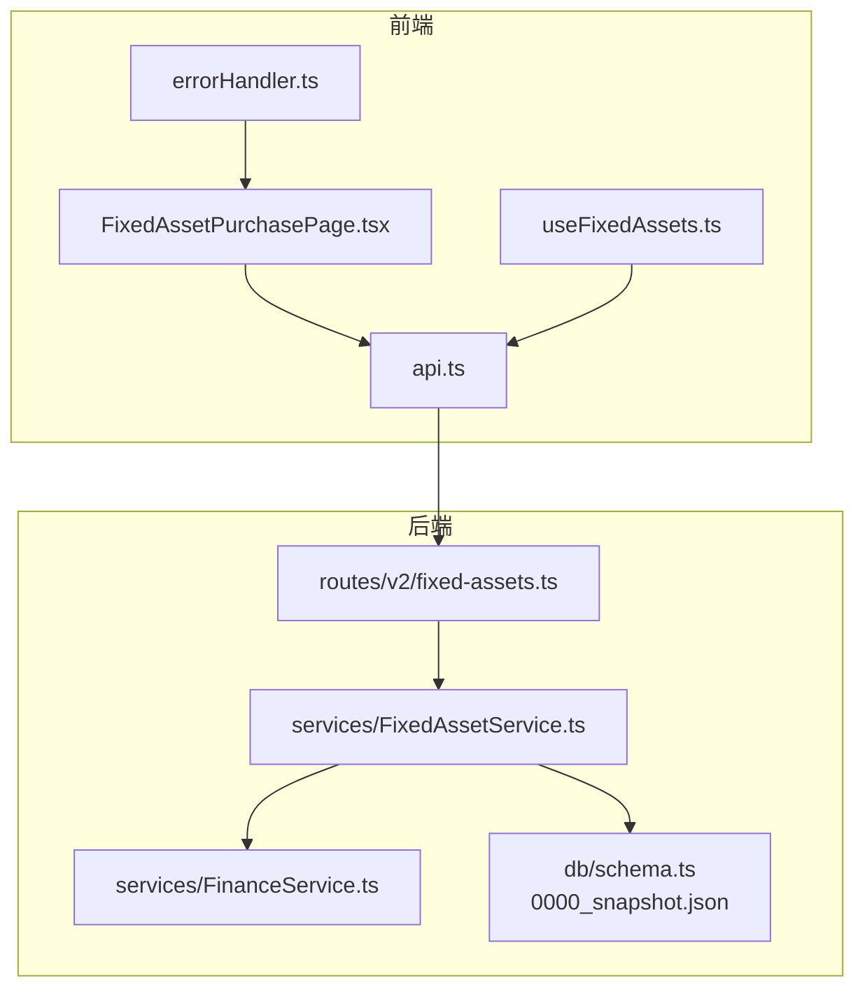
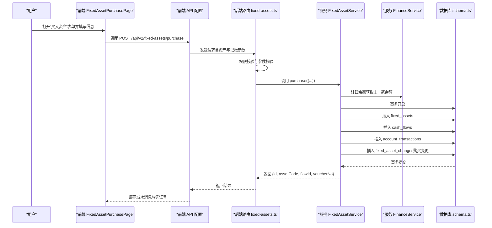
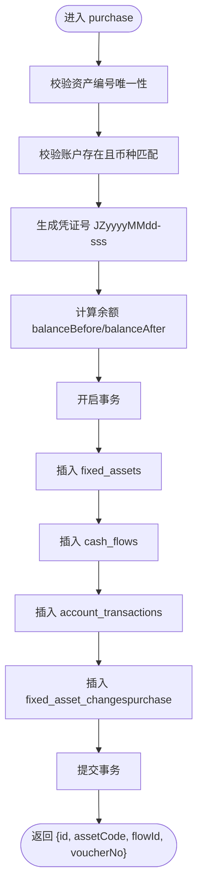
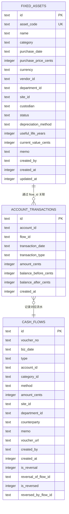
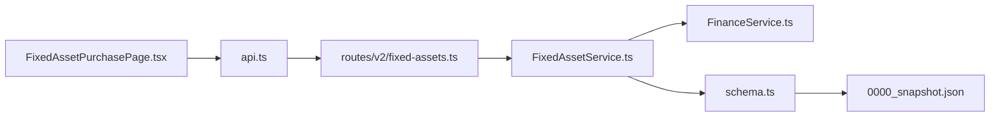

# 资产采购与管理

<cite>
**本文引用的文件**
- [FixedAssetService.ts](file://backend/src/services/FixedAssetService.ts)
- [fixed-assets.ts](file://backend/src/routes/v2/fixed-assets.ts)
- [schema.ts](file://backend/src/db/schema.ts)
- [business.schema.ts](file://backend/src/schemas/business.schema.ts)
- [FixedAssetPurchasePage.tsx](file://frontend/src/features/assets/pages/FixedAssetPurchasePage.tsx)
- [api.ts](file://frontend/src/config/api.ts)
- [useFixedAssets.ts](file://frontend/src/hooks/business/useFixedAssets.ts)
- [errorHandler.ts](file://frontend/src/utils/errorHandler.ts)
- [0000_snapshot.json](file://backend/drizzle/meta/0000_snapshot.json)
- [FinanceService.ts](file://backend/src/services/FinanceService.ts)
</cite>

## 目录
1. [简介](#简介)
2. [项目结构](#项目结构)
3. [核心组件](#核心组件)
4. [架构总览](#架构总览)
5. [详细组件分析](#详细组件分析)
6. [依赖关系分析](#依赖关系分析)
7. [性能考量](#性能考量)
8. [故障排查指南](#故障排查指南)
9. [结论](#结论)
10. [附录](#附录)

## 简介
本文件围绕“资产采购与管理”模块，系统化阐述通过 purchase 方法实现的资产采购流程。重点说明：
- 在创建资产的同时，如何生成财务流水（cash_flows）与交易记录（account_transactions），并确保数据一致性；
- 凭证号（voucherNo）的生成规则；
- 如何通过事务处理保证资产创建、财务记账与变更日志记录的原子性；
- 结合前端 FixedAssetPurchasePage 的用户界面与交互流程；
- 提供 API 调用示例与常见错误处理方案。

## 项目结构
资产采购涉及前后端协作的关键文件如下：
- 后端路由层：固定资产管理路由，负责权限校验与请求转发
- 服务层：FixedAssetService.purchase 实现核心业务逻辑
- 数据层：数据库表结构（资产、流水、交易、账户等）
- 前端页面：FixedAssetPurchasePage 负责用户输入与提交
- 前端工具：API 配置、错误处理与数据钩子

图表来源
- [FixedAssetPurchasePage.tsx](file://frontend/src/features/assets/pages/FixedAssetPurchasePage.tsx#L1-L255)
- [api.ts](file://frontend/src/config/api.ts#L1-L188)
- [useFixedAssets.ts](file://frontend/src/hooks/business/useFixedAssets.ts#L157-L168)
- [errorHandler.ts](file://frontend/src/utils/errorHandler.ts#L1-L178)
- [fixed-assets.ts](file://backend/src/routes/v2/fixed-assets.ts#L613-L692)
- [FixedAssetService.ts](file://backend/src/services/FixedAssetService.ts#L313-L468)
- [FinanceService.ts](file://backend/src/services/FinanceService.ts#L41-L114)
- [schema.ts](file://backend/src/db/schema.ts#L159-L206)
- [0000_snapshot.json](file://backend/drizzle/meta/0000_snapshot.json#L1-L1028)

章节来源
- [FixedAssetPurchasePage.tsx](file://frontend/src/features/assets/pages/FixedAssetPurchasePage.tsx#L1-L255)
- [fixed-assets.ts](file://backend/src/routes/v2/fixed-assets.ts#L613-L692)
- [FixedAssetService.ts](file://backend/src/services/FixedAssetService.ts#L313-L468)
- [schema.ts](file://backend/src/db/schema.ts#L159-L206)
- [0000_snapshot.json](file://backend/drizzle/meta/0000_snapshot.json#L1-L1028)

## 核心组件
- 后端路由层（固定资产管理）：对 /api/v2/fixed-assets/purchase 进行权限校验与参数校验，调用服务层 purchase 并记录审计日志。
- 服务层（FixedAssetService）：实现资产创建、凭证号生成、财务记账与变更日志记录，全部包裹在事务中保证原子性。
- 财务服务（FinanceService）：提供账户余额计算与流水创建能力，支撑资产采购的记账逻辑。
- 前端页面（FixedAssetPurchasePage）：提供资产采购表单、凭证上传、权限控制与统一错误处理。
- 数据库（schema.ts 与迁移快照）：定义资产、流水、交易、账户等核心表结构及索引。

章节来源
- [fixed-assets.ts](file://backend/src/routes/v2/fixed-assets.ts#L613-L692)
- [FixedAssetService.ts](file://backend/src/services/FixedAssetService.ts#L313-L468)
- [FinanceService.ts](file://backend/src/services/FinanceService.ts#L41-L114)
- [schema.ts](file://backend/src/db/schema.ts#L159-L206)
- [0000_snapshot.json](file://backend/drizzle/meta/0000_snapshot.json#L1-L1028)

## 架构总览
资产采购的端到端流程如下：

图表来源
- [FixedAssetPurchasePage.tsx](file://frontend/src/features/assets/pages/FixedAssetPurchasePage.tsx#L99-L120)
- [api.ts](file://frontend/src/config/api.ts#L137-L144)
- [fixed-assets.ts](file://backend/src/routes/v2/fixed-assets.ts#L646-L691)
- [FixedAssetService.ts](file://backend/src/services/FixedAssetService.ts#L356-L468)
- [FinanceService.ts](file://backend/src/services/FinanceService.ts#L41-L114)
- [schema.ts](file://backend/src/db/schema.ts#L159-L206)

## 详细组件分析

### 后端路由层：固定资产管理
- 路由定义：/api/v2/fixed-assets/purchase，使用 purchaseFixedAssetWithFlowSchema 校验请求体。
- 权限校验：要求具备资产采购权限。
- 参数透传：将前端提交的资产与记账参数传递给服务层 purchase。
- 审计日志：记录采购动作与关键数据（资产编号、金额）。

章节来源
- [fixed-assets.ts](file://backend/src/routes/v2/fixed-assets.ts#L613-L692)
- [business.schema.ts](file://backend/src/schemas/business.schema.ts#L1012-L1033)

### 服务层：FixedAssetService.purchase
- 资产唯一性校验：防止重复资产编号。
- 账户有效性与币种匹配校验：确保账户存在且币种一致。
- 凭证号生成规则：基于业务日期 bizDate 计算当日流水数量并补零，形成 JZyyyyMMdd-sss 格式。
- 余额计算：调用 FinanceService.getAccountBalanceBefore 获取上一笔余额，计算 balanceBefore 与 balanceAfter。
- 事务处理：将资产创建、现金流水、交易记录与资产变更日志四步写入封装在一个事务中，保证原子性。
- 返回值：返回资产 ID、资产编号、流水 ID 与凭证号，便于前端展示与后续追踪。

图表来源
- [FixedAssetService.ts](file://backend/src/services/FixedAssetService.ts#L313-L468)
- [FinanceService.ts](file://backend/src/services/FinanceService.ts#L41-L114)

章节来源
- [FixedAssetService.ts](file://backend/src/services/FixedAssetService.ts#L313-L468)

### 财务服务：FinanceService 余额与流水
- 余额计算：根据 accountId 与 bizDate/时间戳查找最近一条交易记录的 balanceAfter，若无则回退到账户期初 openingCents。
- 流水创建：在 createCashFlow 中会插入 cash_flows 与 account_transactions，并计算余额，支持冲正等扩展场景。

章节来源
- [FinanceService.ts](file://backend/src/services/FinanceService.ts#L41-L114)
- [FinanceService.ts](file://backend/src/services/FinanceService.ts#L167-L210)

### 数据模型：资产、流水与交易
- 固定资产表（fixed_assets）：存储资产基本信息、折旧方法、当前净值等。
- 现金流水表（cash_flows）：记录每笔收支、凭证号、摘要、附件等。
- 账户交易表（account_transactions）：记录账户每一笔交易的余额前/后金额，用于对账与报表。
- 红冲字段：cash_flows 表新增 is_reversal、reversal_of_flow_id、is_reversed、reversed_by_flow_id，支持冲正流水。

图表来源
- [schema.ts](file://backend/src/db/schema.ts#L159-L206)
- [schema.ts](file://backend/src/db/schema.ts#L506-L530)
- [0000_snapshot.json](file://backend/drizzle/meta/0000_snapshot.json#L1-L1028)

章节来源
- [schema.ts](file://backend/src/db/schema.ts#L159-L206)
- [0000_snapshot.json](file://backend/drizzle/meta/0000_snapshot.json#L1-L1028)

### 前端页面：FixedAssetPurchasePage
- 表单字段：资产编号、名称、类别、购买日期、购买价格、币种、支出账户、支出类别、供应商、使用项目、资产位置、责任人、折旧方法、预计使用年限、购买凭证、备注等。
- 凭证上传：支持图片转 WebP 并上传至后端，返回 URL 填充到表单。
- 权限控制：仅财务角色可见“买入资产”按钮。
- 提交流程：表单校验通过后，调用 useFixedAssets 的 useFixedAssetPurchase 钩子，POST 到 /api/v2/fixed-assets/purchase，成功后弹出凭证号提示并刷新列表。

章节来源
- [FixedAssetPurchasePage.tsx](file://frontend/src/features/assets/pages/FixedAssetPurchasePage.tsx#L1-L255)
- [useFixedAssets.ts](file://frontend/src/hooks/business/useFixedAssets.ts#L157-L168)
- [api.ts](file://frontend/src/config/api.ts#L137-L144)

## 依赖关系分析
- 路由层依赖服务层：/api/v2/fixed-assets/purchase -> FixedAssetService.purchase
- 服务层依赖财务服务与数据库：purchase -> FinanceService.getAccountBalanceBefore -> DB（事务）
- 前端依赖路由层：FixedAssetPurchasePage -> api.fixedAssetsPurchase -> 后端接口
- 数据层依赖 schema 与迁移快照：cash_flows、account_transactions、fixed_assets 等

图表来源
- [FixedAssetPurchasePage.tsx](file://frontend/src/features/assets/pages/FixedAssetPurchasePage.tsx#L1-L255)
- [api.ts](file://frontend/src/config/api.ts#L137-L144)
- [fixed-assets.ts](file://backend/src/routes/v2/fixed-assets.ts#L646-L691)
- [FixedAssetService.ts](file://backend/src/services/FixedAssetService.ts#L313-L468)
- [FinanceService.ts](file://backend/src/services/FinanceService.ts#L41-L114)
- [schema.ts](file://backend/src/db/schema.ts#L159-L206)
- [0000_snapshot.json](file://backend/drizzle/meta/0000_snapshot.json#L1-L1028)

章节来源
- [fixed-assets.ts](file://backend/src/routes/v2/fixed-assets.ts#L646-L691)
- [FixedAssetService.ts](file://backend/src/services/FixedAssetService.ts#L313-L468)
- [schema.ts](file://backend/src/db/schema.ts#L159-L206)

## 性能考量
- 事务边界：将资产创建、流水与交易记录、变更日志放在同一事务内，避免中间态导致的数据不一致。
- 余额计算：通过 account_transactions 快速定位上一笔余额，减少全表扫描；cash_flows 与 account_transactions 均有索引辅助查询。
- 前端缓存：useFixedAssets 的查询缓存可降低重复请求成本；购买成功后主动失效相关查询，确保数据新鲜度。
- 凭证号生成：按业务日期统计当日流水数量，序列号补零，避免跨天冲突，提升可读性与可追溯性。

[本节为通用指导，无需列出具体文件来源]

## 故障排查指南
- 常见错误与处理
  - 资产编号重复：服务层检测到重复资产编号时抛出重复错误，前端应提示用户修正。
  - 账户不存在或币种不匹配：服务层校验失败，前端应引导用户选择正确的账户与币种。
  - 余额不足：FinanceService 在创建流水时进行余额检查，若不足会抛出业务错误，前端需提示用户调整金额或账户。
  - 权限不足：路由层校验失败，返回 403，前端应提示用户无权操作。
  - 凭证上传失败：前端上传图片格式限制与大小限制，错误统一通过错误处理工具展示。
- 前端错误处理
  - 使用 withErrorHandler 包裹提交逻辑，自动弹出错误消息并可选地执行回调。
  - useErrorHandler 提供便捷的错误处理钩子，适合在组件内复用。

章节来源
- [FixedAssetService.ts](file://backend/src/services/FixedAssetService.ts#L313-L468)
- [FinanceService.ts](file://backend/src/services/FinanceService.ts#L167-L210)
- [errorHandler.ts](file://frontend/src/utils/errorHandler.ts#L1-L178)

## 结论
资产采购流程通过 purchase 方法实现了“资产创建 + 财务记账 + 变更日志”的强一致原子操作。凭证号生成规则清晰、可追溯；前端提供完善的表单与错误处理机制。整体设计兼顾了业务完整性、用户体验与可维护性。

[本节为总结性内容，无需列出具体文件来源]

## 附录

### API 调用示例（后端）
- 请求路径：POST /api/v2/fixed-assets/purchase
- 权限：需要资产采购权限
- 请求体字段（节选）：assetCode、name、purchaseDate、purchasePriceCents、currency、accountId、categoryId、vendorId、departmentId、siteId、custodian、memo、voucherUrl、depreciationMethod、usefulLifeYears
- 响应体字段：id、assetCode、flowId

章节来源
- [fixed-assets.ts](file://backend/src/routes/v2/fixed-assets.ts#L613-L692)
- [business.schema.ts](file://backend/src/schemas/business.schema.ts#L1012-L1033)

### 前端调用示例（前端）
- 路径：/api/v2/fixed-assets/purchase
- 调用方式：POST
- 成功后：展示凭证号并刷新资产列表
- 错误处理：统一通过 withErrorHandler 展示错误消息

章节来源
- [api.ts](file://frontend/src/config/api.ts#L137-L144)
- [useFixedAssets.ts](file://frontend/src/hooks/business/useFixedAssets.ts#L157-L168)
- [FixedAssetPurchasePage.tsx](file://frontend/src/features/assets/pages/FixedAssetPurchasePage.tsx#L99-L120)

### 凭证号生成规则说明
- 规则：JZyyyyMMdd-sss
  - yyyyMMdd：业务日期（purchaseDate）
  - sss：当日流水序号，从 001 开始递增
- 生成逻辑：按 bizDate 查询当日 cash_flows 数量，+1 后补零至三位

章节来源
- [FixedAssetService.ts](file://backend/src/services/FixedAssetService.ts#L356-L385)
- [schema.ts](file://backend/src/db/schema.ts#L159-L177)