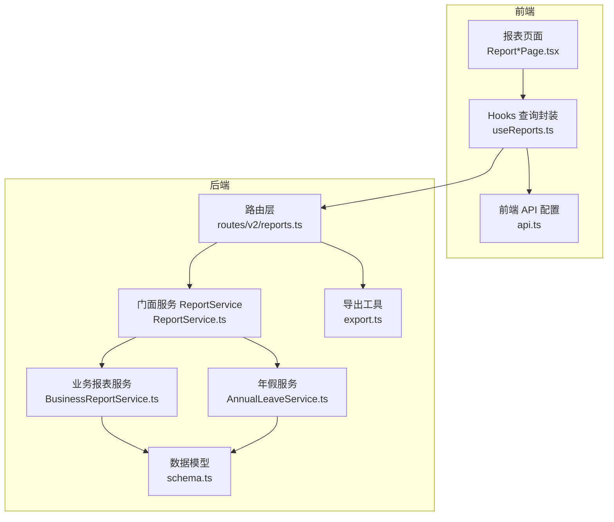
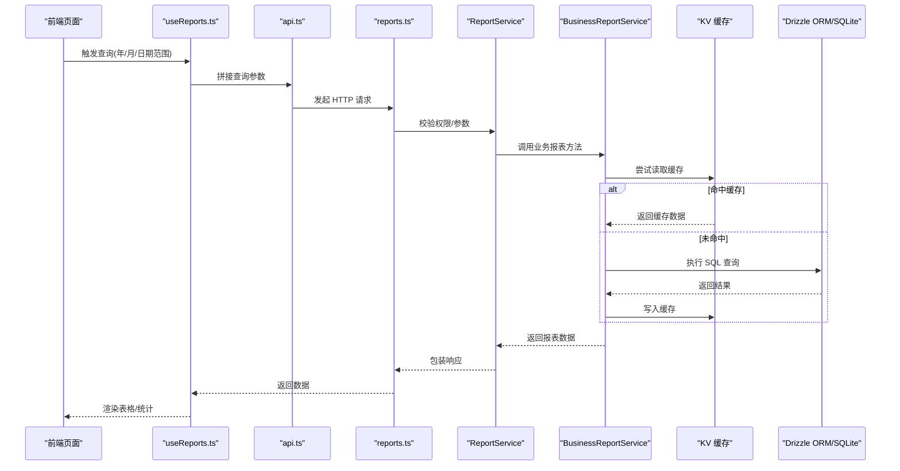
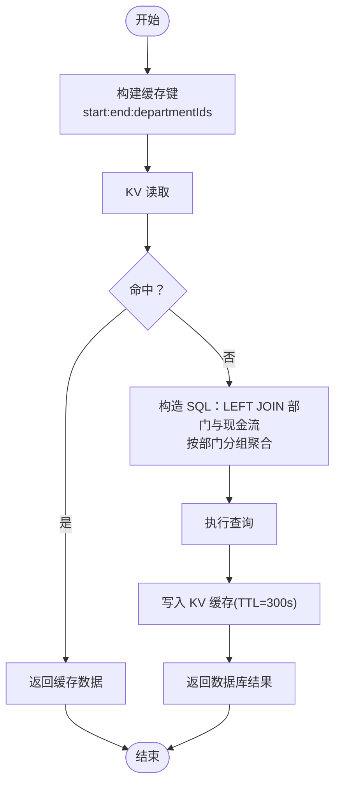
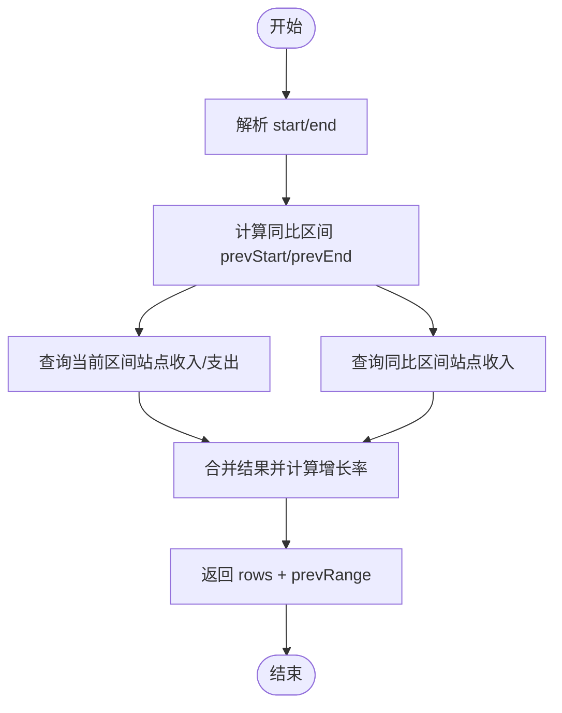
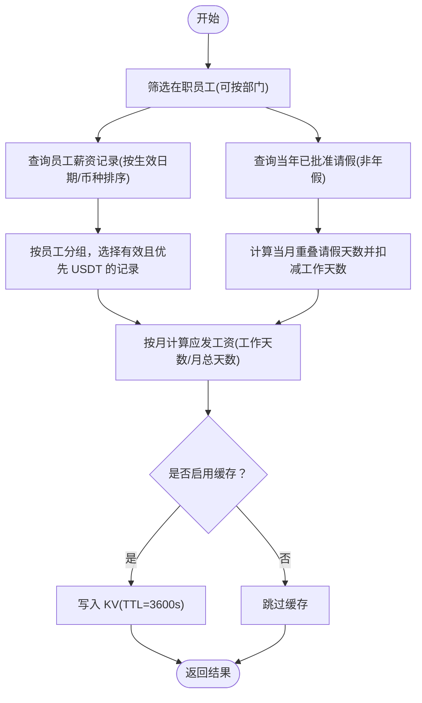
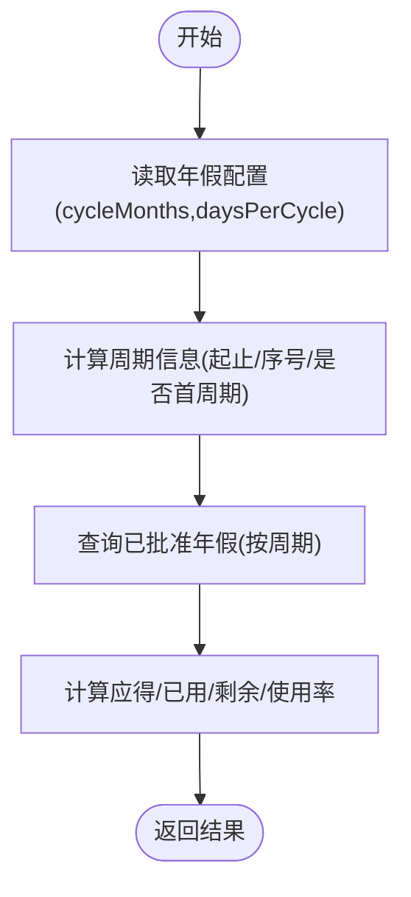
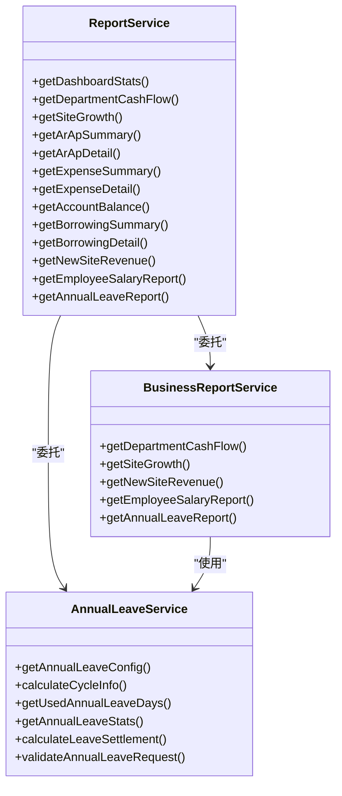

# 业务报表

<cite>
**本文引用的文件**
- [BusinessReportService.ts](file://backend/src/services/BusinessReportService.ts)
- [AnnualLeaveService.ts](file://backend/src/services/AnnualLeaveService.ts)
- [ReportService.ts](file://backend/src/services/ReportService.ts)
- [reports.ts](file://backend/src/routes/v2/reports.ts)
- [common.schema.ts](file://backend/src/schemas/common.schema.ts)
- [schema.ts](file://backend/src/db/schema.ts)
- [export.ts](file://backend/src/utils/export.ts)
- [ReportDepartmentCashPage.tsx](file://frontend/src/features/reports/pages/ReportDepartmentCashPage.tsx)
- [ReportSiteGrowthPage.tsx](file://frontend/src/features/reports/pages/ReportSiteGrowthPage.tsx)
- [ReportEmployeeSalaryPage.tsx](file://frontend/src/features/reports/pages/ReportEmployeeSalaryPage.tsx)
- [ReportAnnualLeavePage.tsx](file://frontend/src/features/reports/pages/ReportAnnualLeavePage.tsx)
- [useReports.ts](file://frontend/src/hooks/business/useReports.ts)
- [api.ts](file://frontend/src/config/api.ts)
</cite>

## 目录
1. [简介](#简介)
2. [项目结构](#项目结构)
3. [核心组件](#核心组件)
4. [架构总览](#架构总览)
5. [详细组件分析](#详细组件分析)
6. [依赖关系分析](#依赖关系分析)
7. [性能与缓存](#性能与缓存)
8. [故障排查指南](#故障排查指南)
9. [结论](#结论)
10. [附录：API 与前端使用](#附录api-与前端使用)

## 简介
本文件面向“业务报表模块”的开发者与使用者，系统性梳理部门现金流、站点增长、员工薪资、年假等业务分析报表的实现与使用方法。重点说明 BusinessReportService 如何整合财务、人事与业务数据，生成多维度分析报告；并结合前端报表页面，给出 API 接口调用参数、响应格式与缓存策略，帮助快速落地与优化。

## 项目结构
业务报表相关代码主要分布在后端服务层与前端页面层：
- 后端
  - 服务层：BusinessReportService、AnnualLeaveService、ReportService（门面）
  - 路由层：reports.ts 提供各报表接口
  - 数据模型：schema.ts 定义 cash_flows、employees、employee_salaries、employee_leaves、sites 等
  - 工具：export.ts 提供 CSV 导出能力
- 前端
  - 页面：四个报表页面分别对应部门现金流、站点增长、员工薪资、年假
  - Hooks：useReports.ts 统一封装查询与缓存策略
  - API 配置：api.ts 定义各报表接口地址

图表来源
- [reports.ts](file://backend/src/routes/v2/reports.ts#L1-L200)
- [ReportService.ts](file://backend/src/services/ReportService.ts#L1-L84)
- [BusinessReportService.ts](file://backend/src/services/BusinessReportService.ts#L1-L120)
- [AnnualLeaveService.ts](file://backend/src/services/AnnualLeaveService.ts#L1-L60)
- [schema.ts](file://backend/src/db/schema.ts#L159-L239)
- [export.ts](file://backend/src/utils/export.ts#L1-L85)
- [api.ts](file://frontend/src/config/api.ts#L64-L79)
- [useReports.ts](file://frontend/src/hooks/business/useReports.ts#L370-L478)

章节来源
- [reports.ts](file://backend/src/routes/v2/reports.ts#L1-L200)
- [ReportService.ts](file://backend/src/services/ReportService.ts#L1-L84)
- [BusinessReportService.ts](file://backend/src/services/BusinessReportService.ts#L1-L120)
- [AnnualLeaveService.ts](file://backend/src/services/AnnualLeaveService.ts#L1-L60)
- [schema.ts](file://backend/src/db/schema.ts#L159-L239)
- [export.ts](file://backend/src/utils/export.ts#L1-L85)
- [api.ts](file://frontend/src/config/api.ts#L64-L79)
- [useReports.ts](file://frontend/src/hooks/business/useReports.ts#L370-L478)

## 核心组件
- BusinessReportService：负责部门现金流、站点增长、新站点收入、员工薪资、年假等业务报表的核心逻辑与缓存。
- AnnualLeaveService：提供年假周期计算、使用统计、离职结算等能力，被业务报表复用。
- ReportService（门面）：对外暴露统一入口，按领域拆分到财务/业务服务，便于扩展与测试。
- 路由 reports.ts：定义各报表接口的 OpenAPI 规范、鉴权与参数校验，调用 ReportService。
- 前端 useReports.ts：封装查询、缓存与数据转换，统一暴露给页面组件。
- 前端页面：四个报表页面分别渲染对应数据。

章节来源
- [BusinessReportService.ts](file://backend/src/services/BusinessReportService.ts#L1-L120)
- [AnnualLeaveService.ts](file://backend/src/services/AnnualLeaveService.ts#L1-L60)
- [ReportService.ts](file://backend/src/services/ReportService.ts#L1-L84)
- [reports.ts](file://backend/src/routes/v2/reports.ts#L115-L217)
- [useReports.ts](file://frontend/src/hooks/business/useReports.ts#L370-L478)

## 架构总览
后端采用“路由 -> 门面服务 -> 业务/财务服务 -> 数据库/缓存”的分层设计；前端通过 Hooks 统一发起请求并缓存结果，页面组件只关注展示。

图表来源
- [reports.ts](file://backend/src/routes/v2/reports.ts#L115-L217)
- [ReportService.ts](file://backend/src/services/ReportService.ts#L1-L84)
- [BusinessReportService.ts](file://backend/src/services/BusinessReportService.ts#L28-L87)
- [useReports.ts](file://frontend/src/hooks/business/useReports.ts#L370-L478)
- [api.ts](file://frontend/src/config/api.ts#L64-L79)

## 详细组件分析

### 部门现金流报表（部门汇总）
- 功能概述
  - 按部门统计指定日期范围内的收入、支出、净额与流水笔数，支持按部门过滤。
  - 自动忽略冲正流水（isReversal=0 或为空）。
- 关键逻辑
  - 使用 LEFT JOIN 将部门与现金流关联，按部门分组聚合。
  - 使用条件聚合计算收入/支出金额与计数。
  - 支持 departmentIds 参数进行多部门过滤。
- 缓存策略
  - 缓存键包含起止日期与部门列表，命中后直接返回，未命中则写入 TTL=300s 的缓存。
- 前端使用
  - 页面 ReportDepartmentCashPage.tsx 提供月度默认日期范围，表格列包含“项目”、“收入”、“支出”、“净额”。

图表来源
- [BusinessReportService.ts](file://backend/src/services/BusinessReportService.ts#L28-L87)
- [schema.ts](file://backend/src/db/schema.ts#L159-L188)

章节来源
- [BusinessReportService.ts](file://backend/src/services/BusinessReportService.ts#L28-L87)
- [ReportDepartmentCashPage.tsx](file://frontend/src/features/reports/pages/ReportDepartmentCashPage.tsx#L1-L62)

### 站点增长报表（同比环比）
- 功能概述
  - 对比当前区间与“同比区间”（长度相同）的站点收入，计算增长率。
  - 返回站点维度的收入、支出、净额、对比期收入与增长率。
- 关键逻辑
  - 计算同比区间：根据日期跨度推导 prevStart/prevEnd。
  - 分别查询当前区间与同比区间的站点收入，映射计算增长率。
  - 增长率公式：(当期收入 - 对比期收入) / 对比期收入；对比期为 0 时特殊处理。
- 前端使用
  - 页面 ReportSiteGrowthPage.tsx 展示对比期收入与增长率列，支持快速选择月度日期范围。

图表来源
- [BusinessReportService.ts](file://backend/src/services/BusinessReportService.ts#L89-L164)
- [schema.ts](file://backend/src/db/schema.ts#L159-L188)

章节来源
- [BusinessReportService.ts](file://backend/src/services/BusinessReportService.ts#L89-L164)
- [ReportSiteGrowthPage.tsx](file://frontend/src/features/reports/pages/ReportSiteGrowthPage.tsx#L1-L65)

### 新站点收入报表（限定创建窗口）
- 功能概述
  - 在指定日期范围内，筛选“近 N 天内创建”的站点，统计其收入。
- 关键逻辑
  - 先查询站点列表并筛选创建时间在 [start-N, start] 区间内的站点。
  - 再按这些站点统计收入。
- 前端使用
  - 可在报表页面中传入 days 参数控制创建窗口，默认 30 天。

章节来源
- [BusinessReportService.ts](file://backend/src/services/BusinessReportService.ts#L166-L224)

### 员工薪资报表（工资核算逻辑）
- 功能概述
  - 按年/月统计员工应发工资，考虑入职当月工作天数、请假扣减与货币优先级。
- 关键逻辑
  - 人员筛选：仅统计在职员工，可按部门过滤。
  - 薪资记录：按员工分组，优先取有效日期 ≤ 月末的记录；若存在 USDT 则优先 USDT。
  - 工作天数：入职当月按实际工作天数折算；非入职当月按整月计算。
  - 请假扣减：仅对非年假类型请假进行重叠天数扣减。
  - 输出：每条记录包含基础工资、工作天数、请假天数、月总天数、应发工资等。
- 缓存策略
  - 缓存键包含 year/month/departmentId，命中后直接返回；未命中写入 TTL=3600s。
- 导出
  - 提供 CSV 导出接口，列包括员工姓名、项目、入职/转正日期、状态、年份、月份、基础工资、工作天数、请假天数、月总天数、应发工资等。

图表来源
- [BusinessReportService.ts](file://backend/src/services/BusinessReportService.ts#L226-L496)
- [schema.ts](file://backend/src/db/schema.ts#L220-L239)
- [reports.ts](file://backend/src/routes/v2/reports.ts#L639-L791)
- [export.ts](file://backend/src/utils/export.ts#L1-L85)

章节来源
- [BusinessReportService.ts](file://backend/src/services/BusinessReportService.ts#L226-L496)
- [ReportEmployeeSalaryPage.tsx](file://frontend/src/features/reports/pages/ReportEmployeeSalaryPage.tsx#L1-L260)
- [reports.ts](file://backend/src/routes/v2/reports.ts#L639-L791)
- [export.ts](file://backend/src/utils/export.ts#L1-L85)

### 年假报表（假期周期管理）
- 功能概述
  - 按部门/组织部门统计员工年假周期、应得/已用/剩余天数与使用率。
- 关键逻辑
  - 年假配置：从系统配置读取周期月数、每周期天数、未休折算系数。
  - 周期计算：基于入职日期与目标日期，计算当前周期起止、周期序号、是否首周期。
  - 使用统计：查询已批准的年假记录，按周期汇总使用天数。
  - 输出：每条记录包含周期编号、周期起止、应得/已用/剩余天数、使用率等。
- 前端使用
  - 页面 ReportAnnualLeavePage.tsx 展示汇总统计与表格，支持按部门筛选。

图表来源
- [AnnualLeaveService.ts](file://backend/src/services/AnnualLeaveService.ts#L1-L227)
- [BusinessReportService.ts](file://backend/src/services/BusinessReportService.ts#L498-L546)
- [schema.ts](file://backend/src/db/schema.ts#L1-L706)

章节来源
- [AnnualLeaveService.ts](file://backend/src/services/AnnualLeaveService.ts#L1-L227)
- [BusinessReportService.ts](file://backend/src/services/BusinessReportService.ts#L498-L546)
- [ReportAnnualLeavePage.tsx](file://frontend/src/features/reports/pages/ReportAnnualLeavePage.tsx#L1-L212)

## 依赖关系分析
- 服务耦合
  - ReportService 作为门面，组合 BusinessReportService 与 AnnualLeaveService，避免路由直接依赖具体服务。
  - BusinessReportService 依赖 Drizzle ORM 与 KV 缓存，查询 cash_flows、employees、employee_salaries、employee_leaves、sites 等表。
- 前后端交互
  - 前端通过 useReports.ts 统一发起请求，路由 reports.ts 校验权限与参数，再委托给 ReportService。
- 数据模型
  - 现金流表 cash_flows 包含 bizDate、type、amountCents、departmentId、siteId 等字段，支撑部门现金流与站点增长报表。
  - 员工表 employees 与薪资表 employee_salaries、请假表 employee_leaves 支撑员工薪资与年假报表。

图表来源
- [ReportService.ts](file://backend/src/services/ReportService.ts#L1-L84)
- [BusinessReportService.ts](file://backend/src/services/BusinessReportService.ts#L1-L120)
- [AnnualLeaveService.ts](file://backend/src/services/AnnualLeaveService.ts#L1-L60)

章节来源
- [ReportService.ts](file://backend/src/services/ReportService.ts#L1-L84)
- [BusinessReportService.ts](file://backend/src/services/BusinessReportService.ts#L1-L120)
- [AnnualLeaveService.ts](file://backend/src/services/AnnualLeaveService.ts#L1-L60)

## 性能与缓存
- 缓存键设计
  - 部门现金流：report:dept_flow:start:end:departmentIds
  - 员工薪资：report:salary:year:month:departmentId
- TTL 设置
  - 部门现金流：300 秒
  - 员工薪资：3600 秒
- 前端缓存
  - useReports.ts 中对多数报表设置 staleTime（如 2 分钟、5 分钟），减少重复请求。
- SQL 优化
  - 使用 LEFT JOIN + GROUP BY 聚合，配合索引字段（如 cash_flows.account_id、cash_flows.biz_date、cash_flows.reversal_of_flow_id）提升查询效率。
- 导出性能
  - CSV 导出在后端完成，避免前端大对象渲染压力。

章节来源
- [BusinessReportService.ts](file://backend/src/services/BusinessReportService.ts#L28-L87)
- [reports.ts](file://backend/src/routes/v2/reports.ts#L639-L791)
- [useReports.ts](file://frontend/src/hooks/business/useReports.ts#L370-L478)
- [schema.ts](file://backend/src/db/schema.ts#L159-L188)

## 故障排查指南
- 权限不足
  - 路由层对报表接口进行权限校验，若无相应权限会抛出禁止访问错误。请确认用户岗位层级与部门范围。
- 参数校验失败
  - 日期范围 start/end 必须满足 start ≤ end；年/月参数范围需符合 schema 校验。
- 数据缺失
  - 员工薪资报表兼容旧数据库缺少 effective_date 字段的情况，自动降级查询。
- 缓存异常
  - KV 读写失败会被记录日志但不影响主流程；若出现长时间无数据，检查 KV 可用性与 TTL 设置。
- 导出问题
  - CSV 导出接口不使用缓存，确保导出最新数据；若中文 Excel 显示异常，检查浏览器编码与 BOM。

章节来源
- [reports.ts](file://backend/src/routes/v2/reports.ts#L19-L46)
- [common.schema.ts](file://backend/src/schemas/common.schema.ts#L57-L91)
- [BusinessReportService.ts](file://backend/src/services/BusinessReportService.ts#L304-L349)
- [export.ts](file://backend/src/utils/export.ts#L1-L85)

## 结论
业务报表模块通过清晰的服务分层与统一的门面入口，将财务、人事与业务数据有机整合，形成多维度分析能力。部门现金流、站点增长、员工薪资与年假报表覆盖了日常运营的关键指标，配合 KV 缓存与前端 Hooks，既保证了性能也提升了用户体验。后续可在以下方面持续优化：
- 增加更多指标与钻取能力（如按站点/部门/币种细化）。
- 引入更丰富的可视化组件与交互。
- 优化复杂报表的分页与分段加载策略。

## 附录：API 与前端使用

### API 接口一览（v2）
- 部门现金流
  - 方法：GET
  - 路径：/api/v2/reports/department-cash
  - 查询参数：start(YYYY-MM-DD)、end(YYYY-MM-DD)、departmentIds(逗号分隔)
  - 权限：report.finance.view
  - 响应：数组，每项包含 departmentId、departmentName、incomeCents、expenseCents、netCents、incomeCount、expenseCount
- 站点增长
  - 方法：GET
  - 路径：/api/v2/reports/site-growth
  - 查询参数：start、end、departmentId(可选)
  - 权限：report.finance.view
  - 响应：{ rows: [...], prevRange: { start, end } }
- 新站点收入
  - 方法：GET
  - 路径：/api/v2/reports/new-site-revenue
  - 查询参数：start、end、days(可选，默认30)、departmentId(可选)
  - 权限：report.finance.view
  - 响应：{ rows: [{ siteId, siteName, incomeCents }] }
- 员工薪资
  - 方法：GET
  - 路径：/api/v2/reports/employee-salary
  - 查询参数：year(可选，默认当年)、month(可选)、departmentId(可选)
  - 权限：report.salary.view 或 report.finance.view
  - 响应：{ results: [...] }，每项包含 employeeId、employeeName、departmentName、joinDate、status、regularDate、year、month、baseSalaryCents、workDays、leaveDays、daysInMonth、actualSalaryCents
- 员工薪资导出
  - 方法：GET
  - 路径：/api/v2/reports/employee-salary/export
  - 查询参数：year、month(可选)、departmentId(可选)
  - 权限：report.salary.view 或 report.finance.view
  - 响应：text/csv
- 年假报表
  - 方法：GET
  - 路径：/api/v2/reports/annual-leave
  - 查询参数：departmentId(可选)、orgDepartmentId(可选)
  - 权限：report.hr.view
  - 响应：{ results: [...], summary: {...}, config: {...} }

章节来源
- [reports.ts](file://backend/src/routes/v2/reports.ts#L115-L217)
- [reports.ts](file://backend/src/routes/v2/reports.ts#L229-L317)
- [reports.ts](file://backend/src/routes/v2/reports.ts#L398-L477)
- [reports.ts](file://backend/src/routes/v2/reports.ts#L598-L637)
- [reports.ts](file://backend/src/routes/v2/reports.ts#L639-L791)
- [reports.ts](file://backend/src/routes/v2/reports.ts#L793-L833)
- [common.schema.ts](file://backend/src/schemas/common.schema.ts#L57-L91)

### 前端页面与 Hooks 使用
- 页面组件
  - ReportDepartmentCashPage.tsx：部门现金流页面，支持月度日期范围筛选与表格展示。
  - ReportSiteGrowthPage.tsx：站点增长页面，展示对比期收入与增长率。
  - ReportEmployeeSalaryPage.tsx：员工薪资页面，支持年/月筛选与汇总统计。
  - ReportAnnualLeavePage.tsx：年假统计页面，支持部门筛选与汇总卡片。
- Hooks
  - useReports.ts 中封装了各报表的查询与缓存策略，统一返回数据结构与 staleTime。
- API 地址
  - 前端 api.ts 中定义了各报表接口地址，便于集中维护与替换。

章节来源
- [ReportDepartmentCashPage.tsx](file://frontend/src/features/reports/pages/ReportDepartmentCashPage.tsx#L1-L62)
- [ReportSiteGrowthPage.tsx](file://frontend/src/features/reports/pages/ReportSiteGrowthPage.tsx#L1-L65)
- [ReportEmployeeSalaryPage.tsx](file://frontend/src/features/reports/pages/ReportEmployeeSalaryPage.tsx#L1-L260)
- [ReportAnnualLeavePage.tsx](file://frontend/src/features/reports/pages/ReportAnnualLeavePage.tsx#L1-L212)
- [useReports.ts](file://frontend/src/hooks/business/useReports.ts#L370-L478)
- [api.ts](file://frontend/src/config/api.ts#L64-L79)