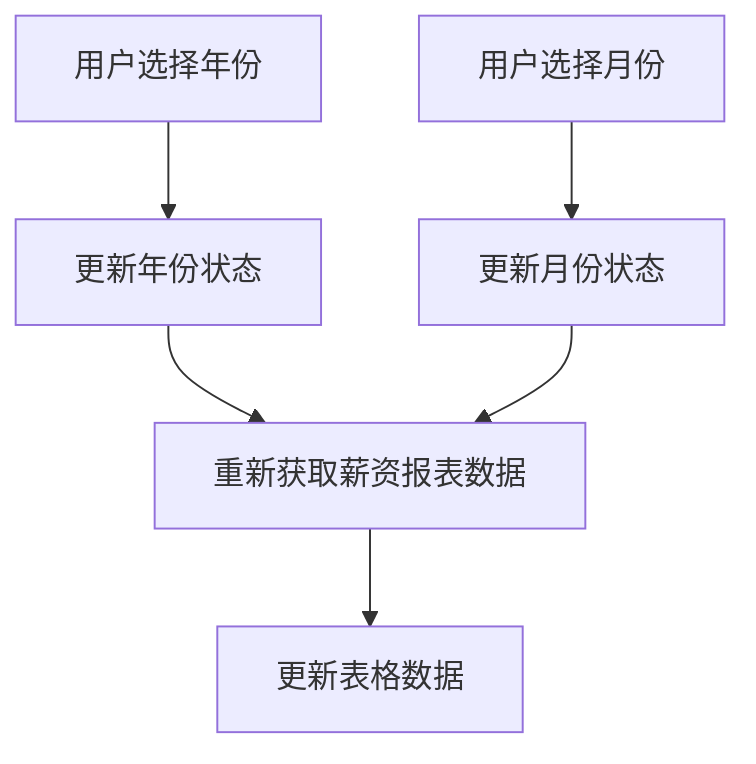
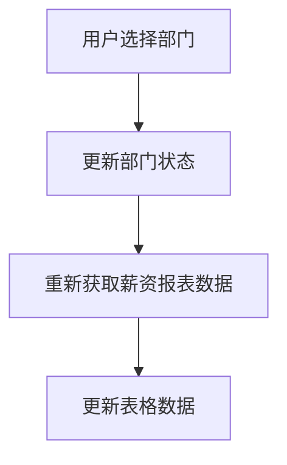
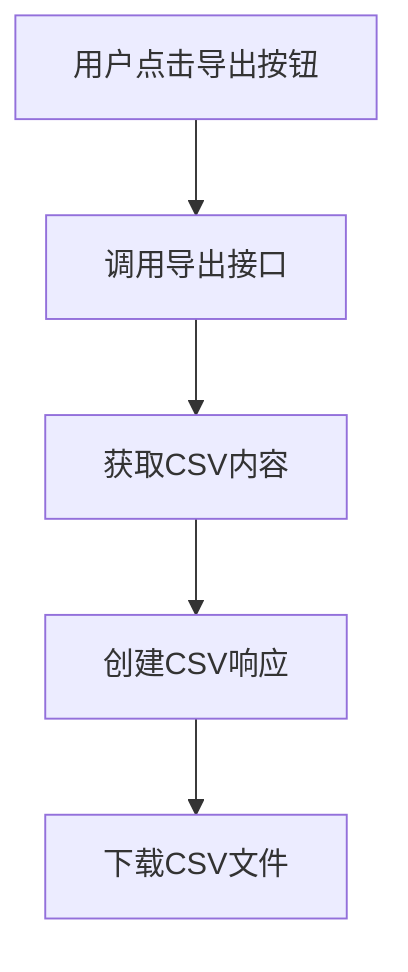
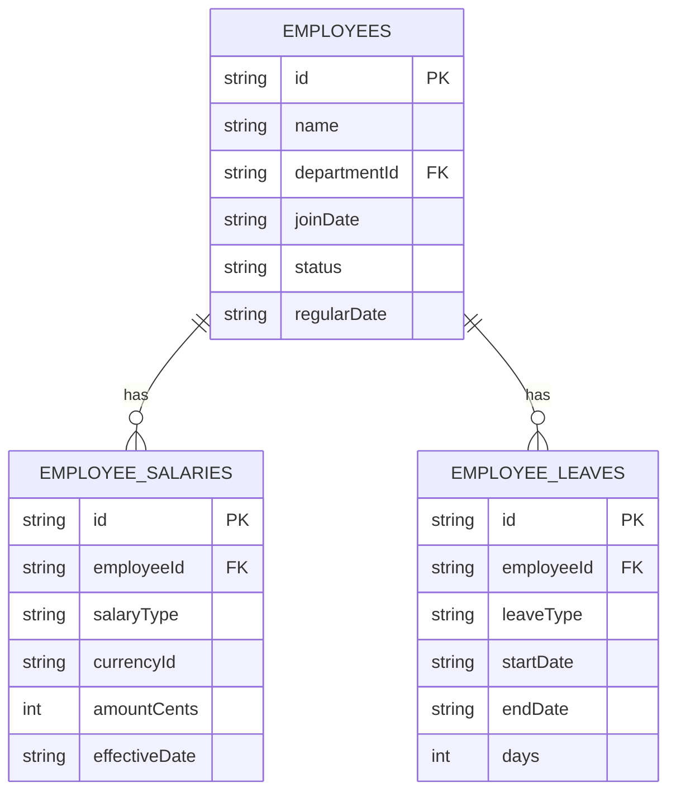
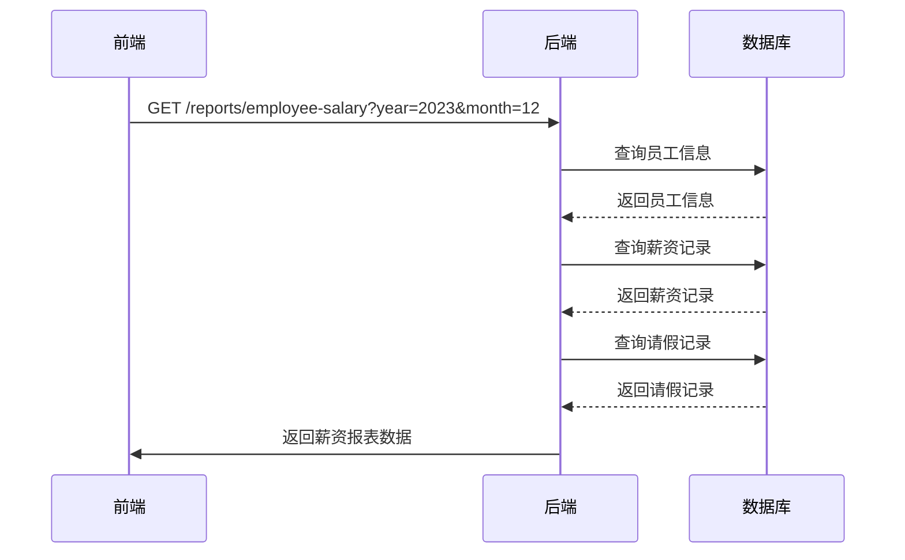
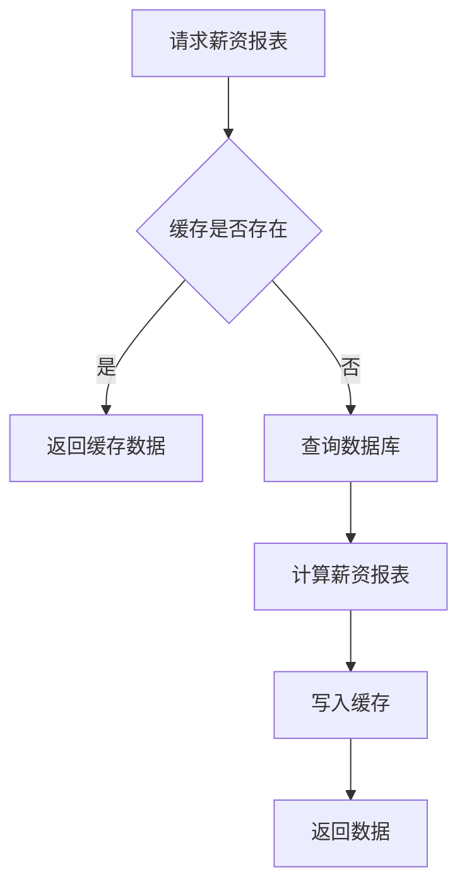

# 员工薪资报表

<cite>
**本文档引用文件**   
- [BusinessReportService.ts](file://backend/src/services/BusinessReportService.ts)
- [reports.ts](file://backend/src/routes/v2/reports.ts)
- [ReportEmployeeSalaryPage.tsx](file://frontend/src/features/reports/pages/ReportEmployeeSalaryPage.tsx)
- [schema.ts](file://backend/src/db/schema.ts)
- [common.schema.ts](file://backend/src/schemas/common.schema.ts)
- [export.ts](file://backend/src/utils/export.ts)
</cite>

## 目录
1. [简介](#简介)
2. [核心服务方法分析](#核心服务方法分析)
3. [薪资核算逻辑详解](#薪资核算逻辑详解)
4. [前端页面功能实现](#前端页面功能实现)
5. [数据模型与接口定义](#数据模型与接口定义)
6. [缓存机制](#缓存机制)

## 简介
员工薪资报表是财务系统中的核心功能之一，用于计算和展示员工的实际应发工资。该报表整合了员工信息、薪资记录和请假数据，根据员工状态（试用期/正式）获取对应薪资，按工作天数比例计算实际应发工资，并扣除非年假请假天数。报表支持年/月筛选、部门筛选和CSV导出功能。

## 核心服务方法分析
`getEmployeeSalaryReport` 服务方法是员工薪资报表的核心，负责整合员工信息、薪资记录和请假数据，计算实际应发工资。

**Section sources**
- [BusinessReportService.ts](file://backend/src/services/BusinessReportService.ts#L226-L496)

## 薪资核算逻辑详解
薪资核算逻辑主要包括以下几个步骤：

1. **获取员工信息**：根据年份、月份和部门ID筛选活跃员工，获取员工的基本信息，包括姓名、部门、入职日期、状态和转正日期。

2. **获取请假记录**：查询指定年份内已批准的请假记录，按员工ID分组，用于后续计算请假天数。

3. **获取薪资记录**：查询员工的薪资记录，包括试用期和正式薪资，支持多币种薪资，并优先选择USDT薪资。

4. **计算实际应发工资**：
   - 根据员工状态（试用期/正式）获取对应薪资。
   - 按工作天数比例计算实际应发工资（actualSalaryCents）。
   - 扣除非年假请假天数。

5. **兼容性处理**：`effectiveDate` 字段用于兼容旧数据库，如果字段不存在，则使用简化查询。

**Section sources**
- [BusinessReportService.ts](file://backend/src/services/BusinessReportService.ts#L226-L496)

## 前端页面功能实现
前端页面 `ReportEmployeeSalaryPage.tsx` 实现了员工薪资报表的展示和交互功能，包括年/月筛选、部门筛选和CSV导出。

**Section sources**
- [ReportEmployeeSalaryPage.tsx](file://frontend/src/features/reports/pages/ReportEmployeeSalaryPage.tsx#L1-L260)

### 年/月筛选
通过 `Select` 组件实现年份和月份的筛选，用户可以选择特定年份和月份查看薪资报表。

**Diagram sources**
- [ReportEmployeeSalaryPage.tsx](file://frontend/src/features/reports/pages/ReportEmployeeSalaryPage.tsx#L30-L33)

### 部门筛选
通过 `SearchFilters` 组件实现部门筛选，用户可以选择特定部门查看薪资报表。

**Diagram sources**
- [ReportEmployeeSalaryPage.tsx](file://frontend/src/features/reports/pages/ReportEmployeeSalaryPage.tsx#L190-L215)

### CSV导出
通过 `createCSVResponse` 函数实现CSV导出功能，用户可以将薪资报表导出为CSV文件。

**Diagram sources**
- [export.ts](file://backend/src/utils/export.ts#L61-L68)
- [reports.ts](file://backend/src/routes/v2/reports.ts#L737-L791)

## 数据模型与接口定义
### 数据模型
- `employees` 表：存储员工基本信息，包括姓名、部门、入职日期、状态和转正日期。
- `employeeSalaries` 表：存储员工薪资记录，包括试用期和正式薪资，支持多币种薪资。
- `employeeLeaves` 表：存储员工请假记录，包括请假类型、开始日期、结束日期和天数。

**Diagram sources**
- [schema.ts](file://backend/src/db/schema.ts#L14-L38)
- [schema.ts](file://backend/src/db/schema.ts#L220-L229)
- [schema.ts](file://backend/src/db/schema.ts#L240-L250)

### 接口定义
- `GET /reports/employee-salary`：获取员工薪资报表。
- `GET /reports/employee-salary/export`：导出员工薪资报表为CSV文件。

**Diagram sources**
- [reports.ts](file://backend/src/routes/v2/reports.ts#L640-L678)
- [reports.ts](file://backend/src/routes/v2/reports.ts#L737-L791)

## 缓存机制
员工薪资报表使用KV缓存机制，缓存键为 `report:salary:${year}:${month || 'all'}:${departmentId || 'all'}`，缓存有效期为3600秒。

**Diagram sources**
- [BusinessReportService.ts](file://backend/src/services/BusinessReportService.ts#L232-L242)
- [BusinessReportService.ts](file://backend/src/services/BusinessReportService.ts#L486-L492)