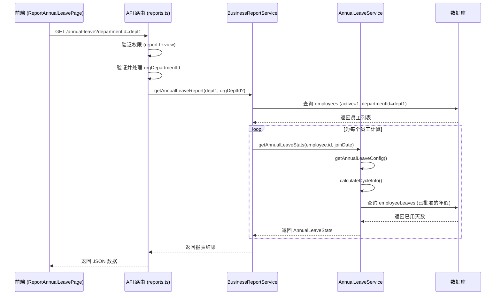

# 年假报表

<cite>
**本文档引用文件**   
- [AnnualLeaveService.ts](file://backend/src/services/AnnualLeaveService.ts)
- [BusinessReportService.ts](file://backend/src/services/BusinessReportService.ts)
- [reports.ts](file://backend/src/routes/v2/reports.ts)
- [useReports.ts](file://frontend/src/hooks/business/useReports.ts)
- [ReportAnnualLeavePage.tsx](file://frontend/src/features/reports/pages/ReportAnnualLeavePage.tsx)
</cite>

## 目录
1. [简介](#简介)
2. [年假周期与额度计算逻辑](#年假周期与额度计算逻辑)
3. [后端服务方法分析](#后端服务方法分析)
4. [前端数据展示与交互](#前端数据展示与交互)
5. [权限与数据访问控制](#权限与数据访问控制)
6. [系统配置与数据结构](#系统配置与数据结构)

## 简介

年假报表是人力资源管理模块中的核心功能之一，用于统计和展示所有在职员工的年假使用情况。该报表基于员工的入职日期，结合系统配置的年假周期规则，动态计算每位员工当前周期的年假额度、已用天数和剩余天数。报表支持按部门和组织部门进行筛选，并对不同职位级别的用户实施严格的数据访问控制。

本系统支持两种年假周期制度：半年制（6个月）和年制（12个月），具体规则由系统配置决定。员工在入职后的第一个周期内不享有年假，从第二个周期开始，每个周期可获得固定的年假天数。

**Section sources**
- [AnnualLeaveService.ts](file://backend/src/services/AnnualLeaveService.ts#L1-L227)

## 年假周期与额度计算逻辑

年假周期的计算以员工的入职日期为起点，根据系统配置的周期月数（`cycleMonths`）进行划分。计算过程如下：

1.  **确定当前周期**：系统会计算从入职日期到目标日期（通常为当前日期）之间的完整月数，并除以周期月数，结果向下取整后加1，即为当前所处的周期序号（`cycleNumber`）。
2.  **计算周期时间范围**：根据周期序号，可以推算出当前周期的开始日期（`cycleStart`）和结束日期（`cycleEnd`）。例如，一个6个月周期的员工，其第一个周期为入职日到入职后第6个月的最后一天。
3.  **判断首周期**：如果当前周期序号为1，则标记为`isFirstCycle: true`，表示该员工处于入职后的第一个周期。
4.  **计算应享天数**：如果员工处于第一个周期，则`entitledDays`（应得天数）为0。否则，`entitledDays`等于系统配置的每周期天数（`daysPerCycle`）。
5.  **计算已用天数**：通过查询数据库中状态为“已批准”（`approved`）且请假类型为“年假”（`annual`）的记录，统计在当前周期时间范围内已使用的天数总和。
6.  **计算剩余天数**：剩余天数（`remainingDays`）为应得天数减去已用天数，结果不会为负数。

**Section sources**
- [AnnualLeaveService.ts](file://backend/src/services/AnnualLeaveService.ts#L66-L103)
- [AnnualLeaveService.ts](file://backend/src/services/AnnualLeaveService.ts#L130-L152)

## 后端服务方法分析

年假报表的核心逻辑由后端的 `BusinessReportService` 和 `AnnualLeaveService` 两个服务类协同完成。

### AnnualLeaveService 服务

`AnnualLeaveService` 是专门处理年假相关计算的核心服务。其主要方法包括：

*   **`getAnnualLeaveConfig()`**: 从数据库的 `systemConfig` 表中读取以 `annual_leave` 开头的所有配置项，包括 `annual_leave_cycle_months`（周期月数）、`annual_leave_days_per_cycle`（每周期天数）和 `annual_leave_overtime_multiplier`（未休折算系数），并返回一个 `AnnualLeaveConfig` 对象。
*   **`calculateCycleInfo()`**: 核心算法，根据员工的入职日期、目标日期和周期月数，精确计算出当前周期的序号、起止日期、总天数、已工作天数以及是否为首周期。
*   **`getUsedAnnualLeaveDays()`**: 查询 `employeeLeaves` 表，统计指定员工在给定周期内已批准的年假天数。
*   **`getAnnualLeaveStats()`**: 综合调用以上方法，为单个员工生成完整的年假统计信息，包括配置、周期信息、应得、已用和剩余天数。

```mermaid
classDiagram
class AnnualLeaveService {
+getAnnualLeaveConfig() AnnualLeaveConfig
+calculateCycleInfo(joinDate, targetDate, cycleMonths) CycleInfo
+getUsedAnnualLeaveDays(employeeId, cycleStart, cycleEnd) number
+getAnnualLeaveStats(employeeId, joinDate, targetDate?) AnnualLeaveStats
+calculateLeaveSettlement(...) LeaveSettlement
+validateAnnualLeaveRequest(...) {valid, message?, remaining?}
}
class AnnualLeaveConfig {
+cycleMonths : number
+daysPerCycle : number
+overtimeMultiplier : number
}
class CycleInfo {
+cycleNumber : number
+cycleStart : string
+cycleEnd : string
+daysInCycle : number
+daysWorkedInCycle : number
+isFirstCycle : boolean
}
class AnnualLeaveStats {
+config : AnnualLeaveConfig
+cycle : CycleInfo
+entitledDays : number
+usedDays : number
+remainingDays : number
}
AnnualLeaveService --> AnnualLeaveConfig : "返回"
AnnualLeaveService --> CycleInfo : "返回"
AnnualLeaveService --> AnnualLeaveStats : "返回"
```

**Diagram sources **
- [AnnualLeaveService.ts](file://backend/src/services/AnnualLeaveService.ts#L11-L41)

### BusinessReportService 与 API 路由

`BusinessReportService` 的 `getAnnualLeaveReport` 方法负责生成整个报表。它首先根据可选的 `departmentId` 和 `orgDepartmentId` 筛选条件，从 `employees` 表中获取所有符合条件的在职员工列表。然后，它使用 `Promise.all` 并发地为每个员工调用 `AnnualLeaveService.getAnnualLeaveStats` 方法，收集所有员工的年假统计数据，并组装成最终的报表结果。

该服务通过 `reports.ts` 中的路由暴露为一个 RESTful API 端点 `GET /api/reports/annual-leave`。此端点接受 `departmentId` 和 `orgDepartmentId` 作为查询参数。



**Diagram sources **
- [BusinessReportService.ts](file://backend/src/services/BusinessReportService.ts#L498-L547)
- [reports.ts](file://backend/src/routes/v2/reports.ts#L681-L735)

**Section sources**
- [BusinessReportService.ts](file://backend/src/services/BusinessReportService.ts#L498-L547)
- [reports.ts](file://backend/src/routes/v2/reports.ts#L681-L735)

## 前端数据展示与交互

前端的年假报表页面由 `ReportAnnualLeavePage.tsx` 组件实现，它使用 Ant Design 组件库构建用户界面。

### 数据获取

页面通过 `useAnnualLeave` 自定义 Hook 从 `useReports.ts` 中导入，该 Hook 封装了对 `/api/reports/annual-leave` API 的调用。当用户选择部门筛选器时，`selectedDept` 状态更新，触发 `useAnnualLeave` 重新发起带有 `departmentId` 参数的请求。

### 页面结构

页面主要由两部分组成：
1.  **统计摘要卡片**：在页面顶部以卡片形式展示关键汇总数据，包括员工总数、总应得年假天数、已使用年假天数和平均使用率。
2.  **数据表格**：展示每位员工的详细信息，列包括员工姓名、部门、组织部门、入职日期、当前周期、周期时间、应得/已用/剩余天数以及使用率（以进度条形式展示）。

### 数据类型

前端定义了清晰的 TypeScript 接口来描述数据结构：
*   `AnnualLeaveRecord`: 定义了表格中每一行的数据结构。
*   `Summary`: 定义了统计摘要的数据结构。
*   `AnnualLeaveConfig`: 定义了年假配置信息。

```mermaid
flowchart TD
A[ReportAnnualLeavePage.tsx] --> B[useState: selectedDept]
B --> C[useAnnualLeave(selectedDept)]
C --> D[API: /annual-leave?departmentId]
D --> E{响应数据}
E --> F[summary: 统计摘要]
E --> G[config: 年假配置]
E --> H[results: 员工记录数组]
F --> I[显示在顶部卡片]
G --> J[显示在信息提示 Alert]
H --> K[DataTable 组件渲染表格]
K --> L[列: 姓名, 部门, 周期, 天数, 使用率等]
```

**Diagram sources **
- [ReportAnnualLeavePage.tsx](file://frontend/src/features/reports/pages/ReportAnnualLeavePage.tsx#L41-L212)
- [useReports.ts](file://frontend/src/hooks/business/useReports.ts#L214-L241)

**Section sources**
- [ReportAnnualLeavePage.tsx](file://frontend/src/features/reports/pages/ReportAnnualLeavePage.tsx#L41-L212)
- [useReports.ts](file://frontend/src/hooks/business/useReports.ts#L214-L241)

## 权限与数据访问控制

系统对年假报表的访问实施了严格的权限和数据范围控制。

### 权限验证

访问 `/api/reports/annual-leave` 端点需要 `report.hr.view` 权限。这是通过 `reports.ts` 路由中的 `hasPermission(c, 'report', 'hr', 'view')` 检查来实现的。

### 三级职位用户的数据访问限制

对于职位级别（`level`）为3的用户（如团队主管），系统会强制其数据访问范围限制在自己所属的组织部门内。具体逻辑如下：
1.  在 API 路由中，获取当前用户的位置（`position`）和员工信息（`employee`）。
2.  如果用户是三级职位（`position.level === 3`），则检查其 `employee.orgDepartmentId`。
3.  如果请求中指定了 `orgDepartmentId` 且与用户自身的 `orgDepartmentId` 不符，则抛出 `FORBIDDEN` 错误。
4.  如果用户没有 `orgDepartmentId`，则将其 `validOrgDeptId` 设置为 `'NONE'`，以确保其无法访问任何组织部门的数据。

此机制确保了三级职位用户只能查看和管理自己团队内的员工数据，保障了数据的隐私和安全。

**Section sources**
- [reports.ts](file://backend/src/routes/v2/reports.ts#L720-L728)

## 系统配置与数据结构

系统的年假行为由存储在数据库 `systemConfig` 表中的配置项决定。主要配置包括：

| 配置键 (key) | 描述 | 默认值 |
| :--- | :--- | :--- |
| `annual_leave_cycle_months` | 年假周期的月数 | 6 |
| `annual_leave_days_per_cycle` | 每个周期可享有的年假天数 | 5 |
| `annual_leave_overtime_multiplier` | 未休年假折算为工资的系数 | 1 |

后端定义了清晰的接口来组织数据：
*   `AnnualLeaveConfig`: 封装系统配置。
*   `CycleInfo`: 封装单个周期的详细信息。
*   `AnnualLeaveStats`: 封装单个员工的完整年假统计。

前端通过 `AnnualLeaveResponse` 接口接收后端返回的完整报表数据，其中包含 `results`（员工列表）、`summary`（汇总信息）和 `config`（配置信息）。

**Section sources**
- [AnnualLeaveService.ts](file://backend/src/services/AnnualLeaveService.ts#L11-L41)
- [useReports.ts](file://frontend/src/hooks/business/useReports.ts#L214-L241)