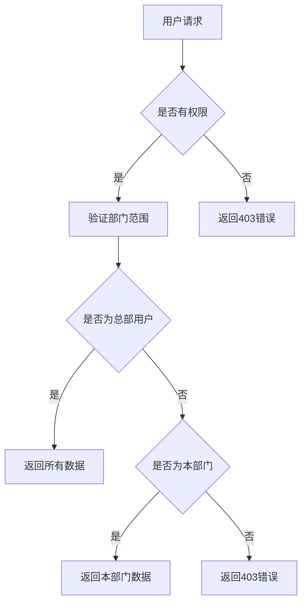
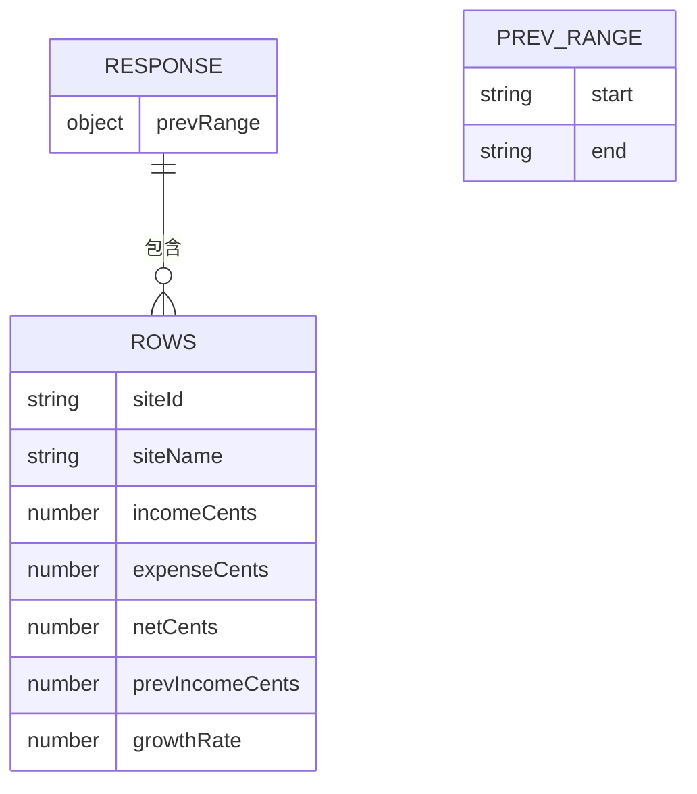
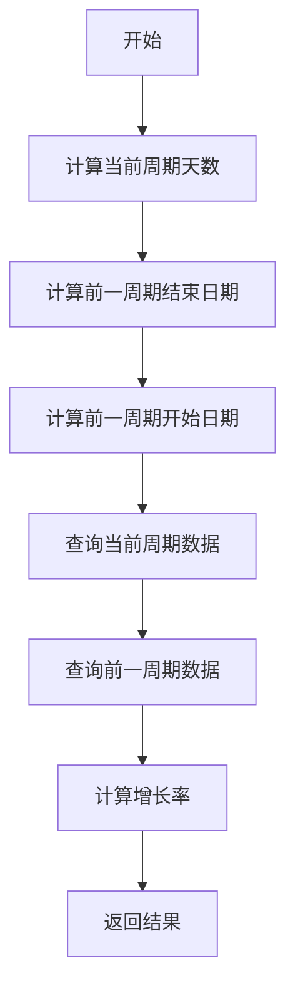

# 站点增长报表

<cite>
**本文档引用的文件**   
- [ReportSiteGrowthPage.tsx](file://frontend/src/features/reports/pages/ReportSiteGrowthPage.tsx)
- [BusinessReportService.ts](file://backend/src/services/BusinessReportService.ts)
- [reports.ts](file://backend/src/routes/v2/reports.ts)
- [useReports.ts](file://frontend/src/hooks/business/useReports.ts)
- [api.ts](file://frontend/src/config/api.ts)
- [schema.ts](file://backend/src/db/schema.ts)
</cite>

## 目录
1. [简介](#简介)
2. [核心服务方法分析](#核心服务方法分析)
3. [前端页面实现](#前端页面实现)
4. [权限验证与数据隔离](#权限验证与数据隔离)
5. [数据结构与API响应](#数据结构与api响应)
6. [计算逻辑详解](#计算逻辑详解)

## 简介
站点增长报表功能用于分析各站点在指定时间段内的财务表现，通过计算收入、支出和增长率来评估站点的业务增长情况。该功能支持按部门筛选数据，提供直观的对比分析。

## 核心服务方法分析

站点增长报表的核心计算逻辑由 `BusinessReportService` 类中的 `getSiteGrowth` 方法实现。该方法接收起止日期和可选的部门ID作为参数，返回各站点的收入、支出、净额以及与前一周期相比的增长率。

**Section sources**
- [BusinessReportService.ts](file://backend/src/services/BusinessReportService.ts#L89-L163)

## 前端页面实现

前端通过 `ReportSiteGrowthPage.tsx` 组件实现站点增长报表的展示。该组件使用 `useSiteGrowth` 钩子获取数据，并通过 `DataTable` 组件展示结果。用户可以通过日期范围选择器筛选数据。

**Section sources**
- [ReportSiteGrowthPage.tsx](file://frontend/src/features/reports/pages/ReportSiteGrowthPage.tsx#L1-L65)

## 权限验证与数据隔离

系统通过 `validateScope` 函数实现数据隔离。不同级别的用户只能访问其权限范围内的数据。例如，项目/团队级别的用户只能访问本部门的数据，而总部级别的用户可以访问所有数据。

**Diagram sources**
- [reports.ts](file://backend/src/routes/v2/reports.ts#L19-L46)

## 数据结构与API响应

API响应包含 `rows` 数组和 `prevRange` 对象。`rows` 数组中的每个对象包含站点ID、名称、收入、支出、净额、前一周期收入和增长率。`prevRange` 对象包含前一周期的起止日期。

**Diagram sources**
- [BusinessReportService.ts](file://backend/src/services/BusinessReportService.ts#L143-L162)

## 计算逻辑详解

### 增长率计算
增长率通过当前周期与前一周期的收入对比计算。如果前一周期无收入且当前周期有收入，则增长率为100%；如果前一周期无收入且当前周期也无收入，则增长率为0%；否则，增长率为（当前收入 - 前一周期收入）/ 前一周期收入。

### 前一周期计算
前一周期的结束日期为当前周期开始日期的前一天，持续时间与当前周期相同。例如，如果当前周期为2023-01-01至2023-01-31，则前一周期为2022-12-01至2022-12-31。

**Diagram sources**
- [BusinessReportService.ts](file://backend/src/services/BusinessReportService.ts#L92-L96)
- [BusinessReportService.ts](file://backend/src/services/BusinessReportService.ts#L146-L151)