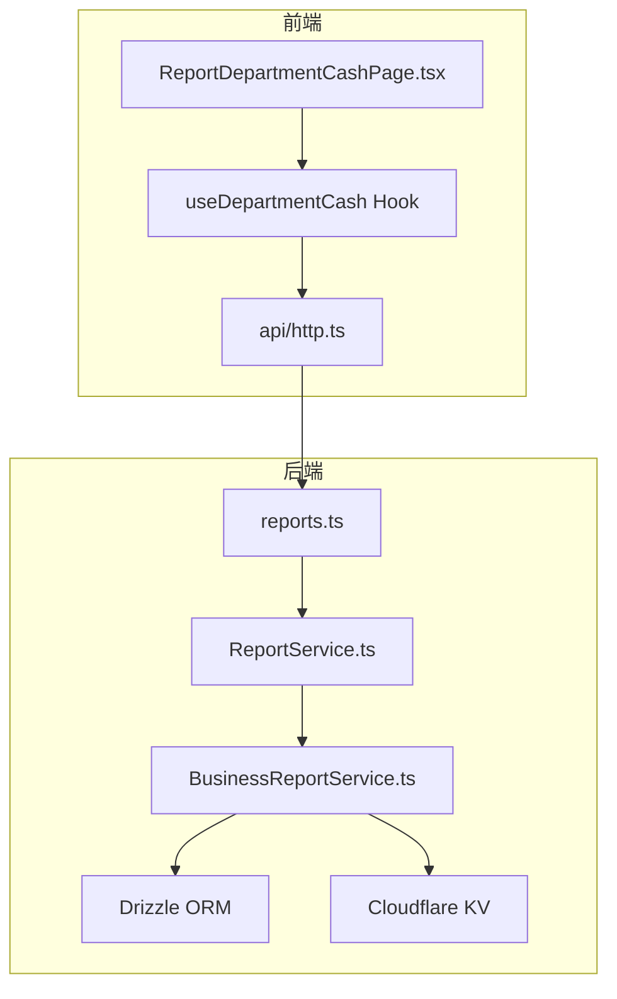
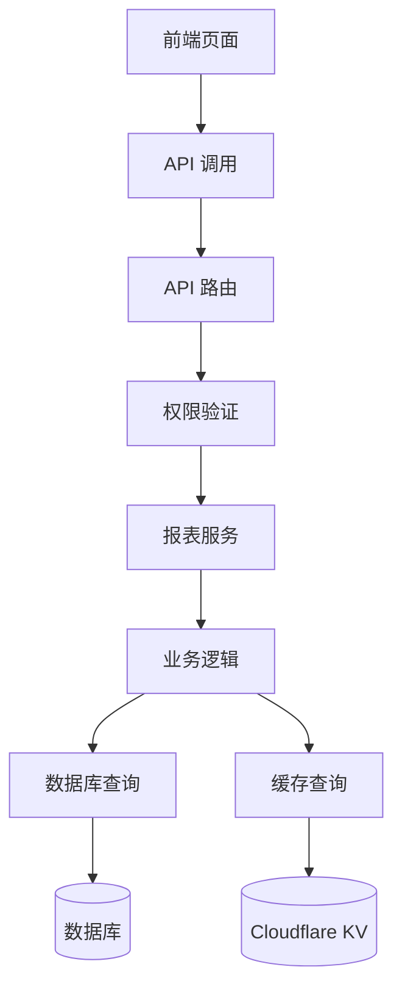
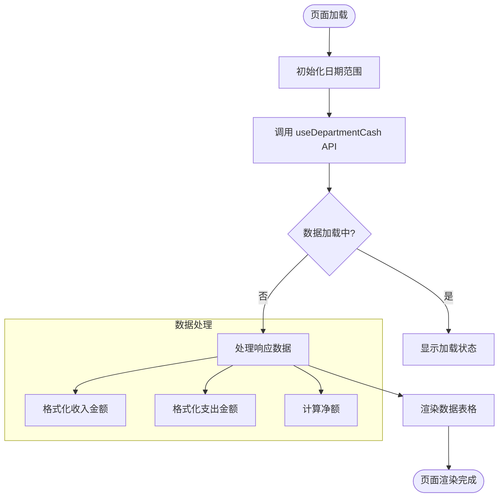
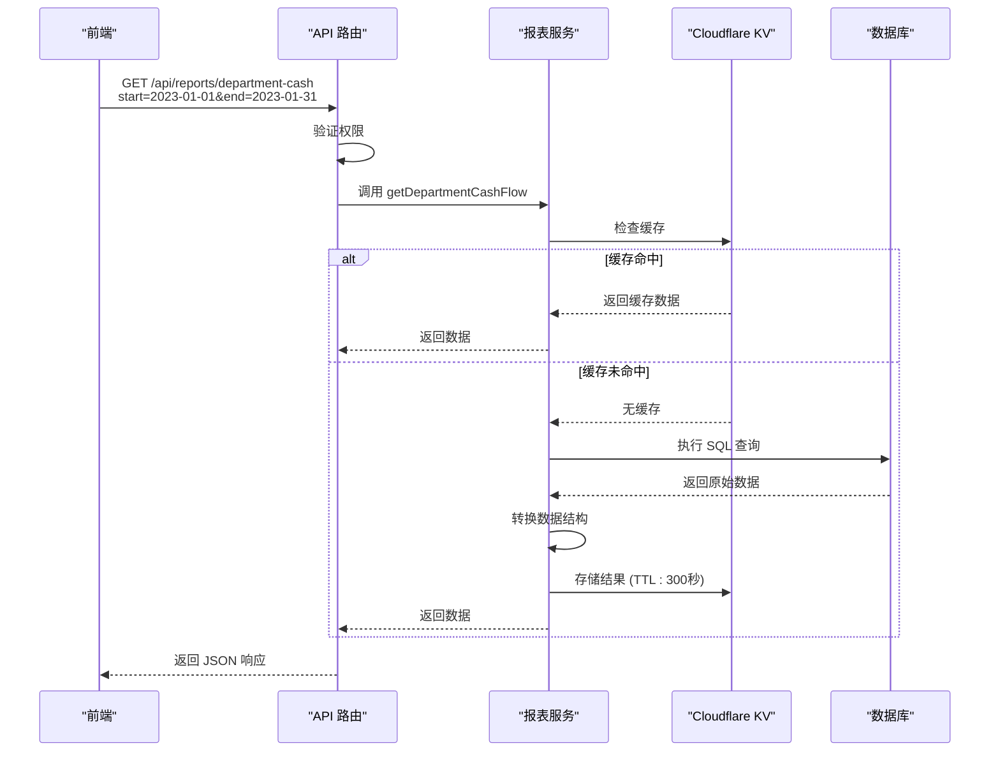
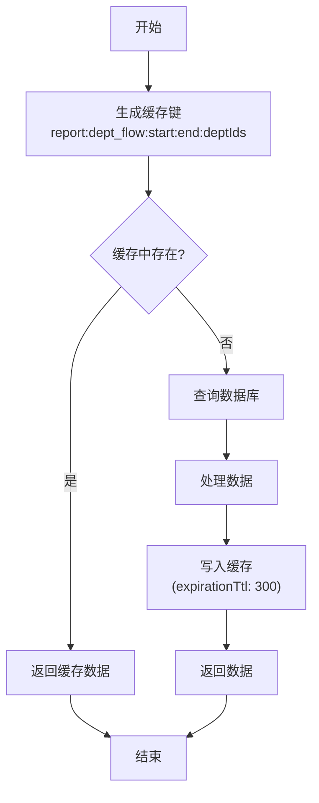
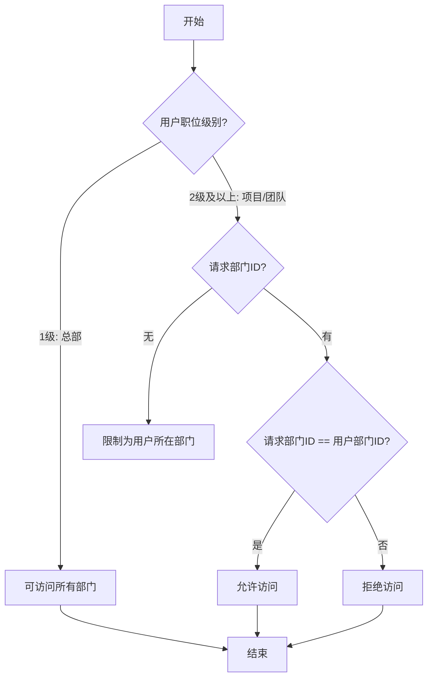
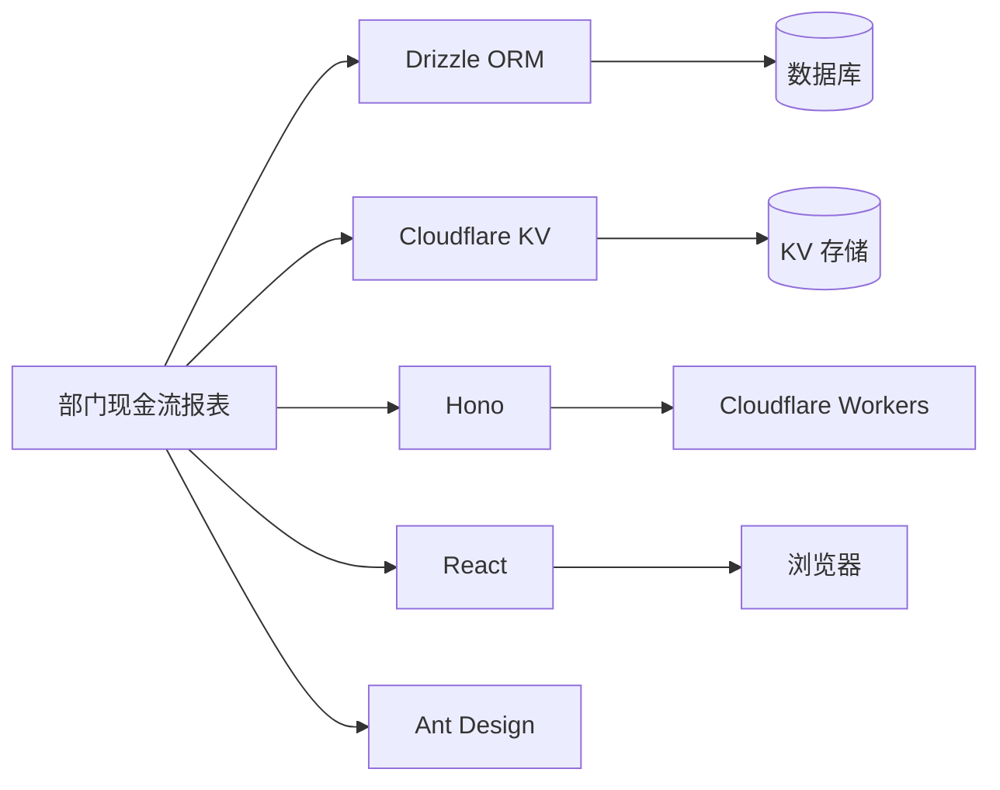

# 部门现金流报表

<cite>
**本文档引用文件**   
- [ReportDepartmentCashPage.tsx](file://frontend/src/features/reports/pages/ReportDepartmentCashPage.tsx)
- [BusinessReportService.ts](file://backend/src/services/BusinessReportService.ts)
- [reports.ts](file://backend/src/routes/v2/reports.ts)
- [ReportService.ts](file://backend/src/services/ReportService.ts)
- [permissions.ts](file://backend/src/utils/permissions.ts)
- [schema.ts](file://backend/src/db/schema.ts)
- [useReports.ts](file://frontend/src/hooks/business/useReports.ts)
- [http.ts](file://frontend/src/api/http.ts)
</cite>

## 目录
1. [简介](#简介)
2. [项目结构](#项目结构)
3. [核心组件](#核心组件)
4. [架构概述](#架构概述)
5. [详细组件分析](#详细组件分析)
6. [依赖分析](#依赖分析)
7. [性能考虑](#性能考虑)
8. [故障排除指南](#故障排除指南)
9. [结论](#结论)

## 简介
本技术文档详细说明了财务系统中部门现金流报表的功能实现。该报表通过 `getDepartmentCashFlow` 服务方法，利用 Drizzle ORM 查询各部门在指定时间范围内的收入、支出和净现金流数据。文档涵盖前端数据可视化实现、后端查询逻辑、基于 Cloudflare KV 的缓存机制以及基于职位级别的权限控制逻辑。

## 项目结构
该财务系统采用前后端分离架构，前端使用 React 框架，后端基于 Hono 框架运行在 Cloudflare Workers 上。部门现金流报表功能主要涉及前端报表页面、API 路由、报表服务和数据库查询。

**图表来源**
- [ReportDepartmentCashPage.tsx](file://frontend/src/features/reports/pages/ReportDepartmentCashPage.tsx)
- [useReports.ts](file://frontend/src/hooks/business/useReports.ts)
- [http.ts](file://frontend/src/api/http.ts)
- [reports.ts](file://backend/src/routes/v2/reports.ts)
- [ReportService.ts](file://backend/src/services/ReportService.ts)
- [BusinessReportService.ts](file://backend/src/services/BusinessReportService.ts)

**章节来源**
- [ReportDepartmentCashPage.tsx](file://frontend/src/features/reports/pages/ReportDepartmentCashPage.tsx)
- [reports.ts](file://backend/src/routes/v2/reports.ts)
- [BusinessReportService.ts](file://backend/src/services/BusinessReportService.ts)

## 核心组件
部门现金流报表的核心是 `getDepartmentCashFlow` 方法，它位于 `BusinessReportService` 类中。该方法通过 Drizzle ORM 执行 SQL 查询，从 `cash_flows` 表中聚合数据，并通过 Cloudflare KV 进行缓存以提高性能。前端通过 `useDepartmentCash` 自定义 Hook 调用此 API，并将结果在 `ReportDepartmentCashPage` 页面上进行可视化展示。

**章节来源**
- [BusinessReportService.ts](file://backend/src/services/BusinessReportService.ts#L28-L87)
- [useReports.ts](file://frontend/src/hooks/business/useReports.ts#L370-L379)

## 架构概述
系统架构遵循分层设计模式，从前端页面到后端服务，再到数据访问层和缓存层。API 路由层负责接收请求并进行权限验证，服务层处理业务逻辑，数据访问层执行数据库查询，缓存层则用于存储查询结果以减少数据库负载。

**图表来源**
- [reports.ts](file://backend/src/routes/v2/reports.ts)
- [BusinessReportService.ts](file://backend/src/services/BusinessReportService.ts)
- [permissions.ts](file://backend/src/utils/permissions.ts)

## 详细组件分析

### 前端数据可视化分析
`ReportDepartmentCashPage` 组件实现了部门现金流报表的用户界面。它使用 `useState` 管理日期范围搜索参数，并通过 `useDepartmentCash` Hook 获取数据。数据通过 `DataTable` 组件进行展示，其中 `AmountDisplay` 组件用于格式化金额显示。

**图表来源**
- [ReportDepartmentCashPage.tsx](file://frontend/src/features/reports/pages/ReportDepartmentCashPage.tsx)
- [useReports.ts](file://frontend/src/hooks/business/useReports.ts)

**章节来源**
- [ReportDepartmentCashPage.tsx](file://frontend/src/features/reports/pages/ReportDepartmentCashPage.tsx#L1-L62)

### 后端服务方法分析
`getDepartmentCashFlow` 服务方法是报表功能的核心。它首先检查缓存，如果缓存中存在数据则直接返回；否则，构建 SQL 查询，从 `departments` 和 `cash_flows` 表中联查数据，按部门分组并计算收入、支出和净现金流。

**图表来源**
- [BusinessReportService.ts](file://backend/src/services/BusinessReportService.ts#L28-L87)
- [reports.ts](file://backend/src/routes/v2/reports.ts#L116-L182)

**章节来源**
- [BusinessReportService.ts](file://backend/src/services/BusinessReportService.ts#L28-L87)

### 缓存机制分析
系统使用 Cloudflare KV 作为缓存层，`getDepartmentCashFlow` 方法在查询数据库前会先检查缓存。缓存键由时间范围和部门ID生成，缓存有效期为300秒（5分钟），有效减少了对数据库的重复查询。

**图表来源**
- [BusinessReportService.ts](file://backend/src/services/BusinessReportService.ts#L29-L35)
- [BusinessReportService.ts](file://backend/src/services/BusinessReportService.ts#L80-L84)

**章节来源**
- [BusinessReportService.ts](file://backend/src/services/BusinessReportService.ts#L29-L35)
- [BusinessReportService.ts](file://backend/src/services/BusinessReportService.ts#L80-L84)

### 权限控制分析
系统实现了基于职位级别的数据访问控制。`validateScope` 函数根据用户职位级别决定其数据访问范围：总部人员（1级）可访问所有部门数据，而项目/团队人员（2级及以上）只能访问本部门数据。

**图表来源**
- [reports.ts](file://backend/src/routes/v2/reports.ts#L19-L46)
- [permissions.ts](file://backend/src/utils/permissions.ts)

**章节来源**
- [reports.ts](file://backend/src/routes/v2/reports.ts#L19-L46)

## 依赖分析
部门现金流报表功能依赖于多个核心模块和外部服务。前端依赖于 React、Ant Design 和自定义 Hook，后端依赖于 Hono、Drizzle ORM 和 Cloudflare KV。数据库表 `departments` 和 `cash_flows` 是数据查询的基础。

**图表来源**
- [BusinessReportService.ts](file://backend/src/services/BusinessReportService.ts)
- [ReportDepartmentCashPage.tsx](file://frontend/src/features/reports/pages/ReportDepartmentCashPage.tsx)

**章节来源**
- [BusinessReportService.ts](file://backend/src/services/BusinessReportService.ts)
- [ReportDepartmentCashPage.tsx](file://frontend/src/features/reports/pages/ReportDepartmentCashPage.tsx)

## 性能考虑
为了优化性能，系统采用了多层缓存策略。Cloudflare KV 缓存将报表查询结果缓存5分钟，显著减少了数据库查询次数。此外，API 路由层的权限验证和数据过滤逻辑也经过优化，确保查询效率。

## 故障排除指南
当部门现金流报表无法正常显示数据时，应按以下步骤排查：
1. 检查前端网络请求是否成功，确认 API 返回状态码为 200。
2. 检查用户权限，确认用户职位级别和部门设置是否正确。
3. 检查数据库中 `cash_flows` 表是否存在对应时间范围和部门的流水数据。
4. 检查 Cloudflare KV 缓存是否正常工作，确认缓存键和值是否正确。

**章节来源**
- [reports.ts](file://backend/src/routes/v2/reports.ts#L144-L146)
- [BusinessReportService.ts](file://backend/src/services/BusinessReportService.ts#L31-L35)

## 结论
部门现金流报表功能通过清晰的分层架构和高效的缓存机制，实现了对各部门财务数据的快速查询和可视化展示。系统通过严格的权限控制确保了数据安全，同时利用现代前端框架提供了良好的用户体验。该实现方案具有良好的可维护性和扩展性，为财务分析提供了可靠的数据支持。