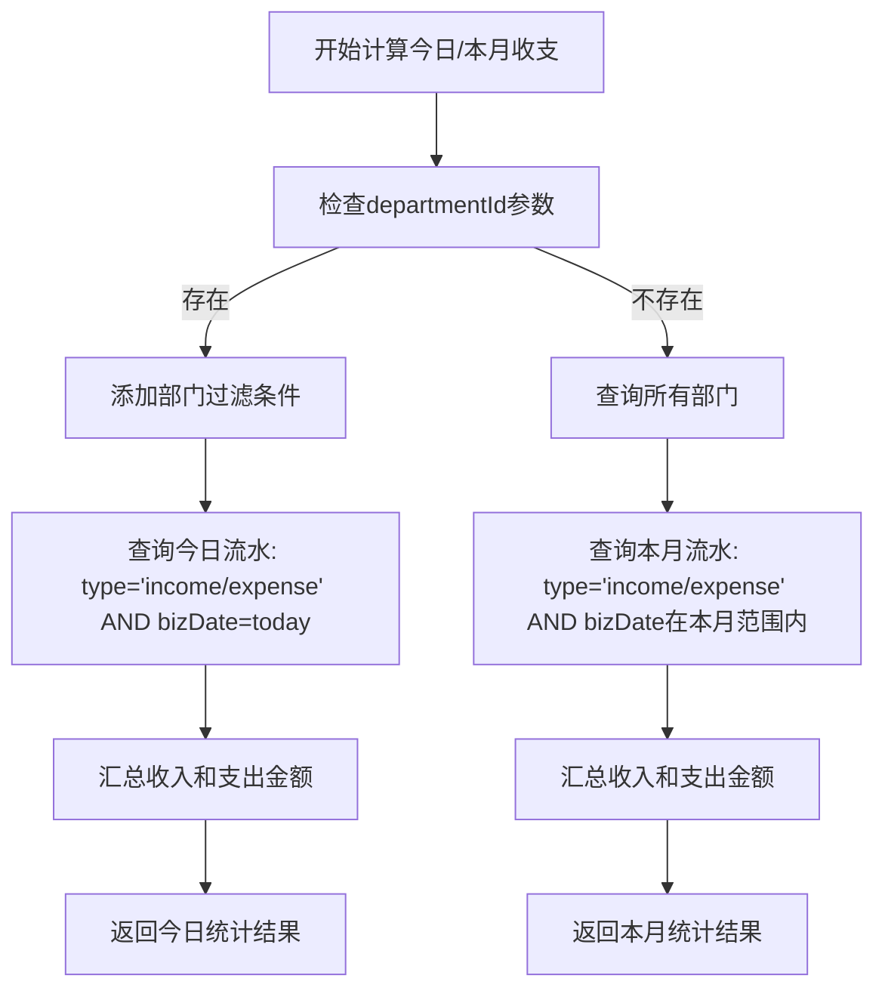
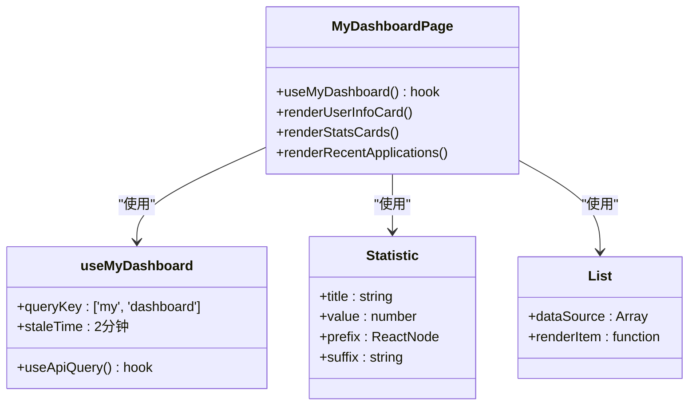
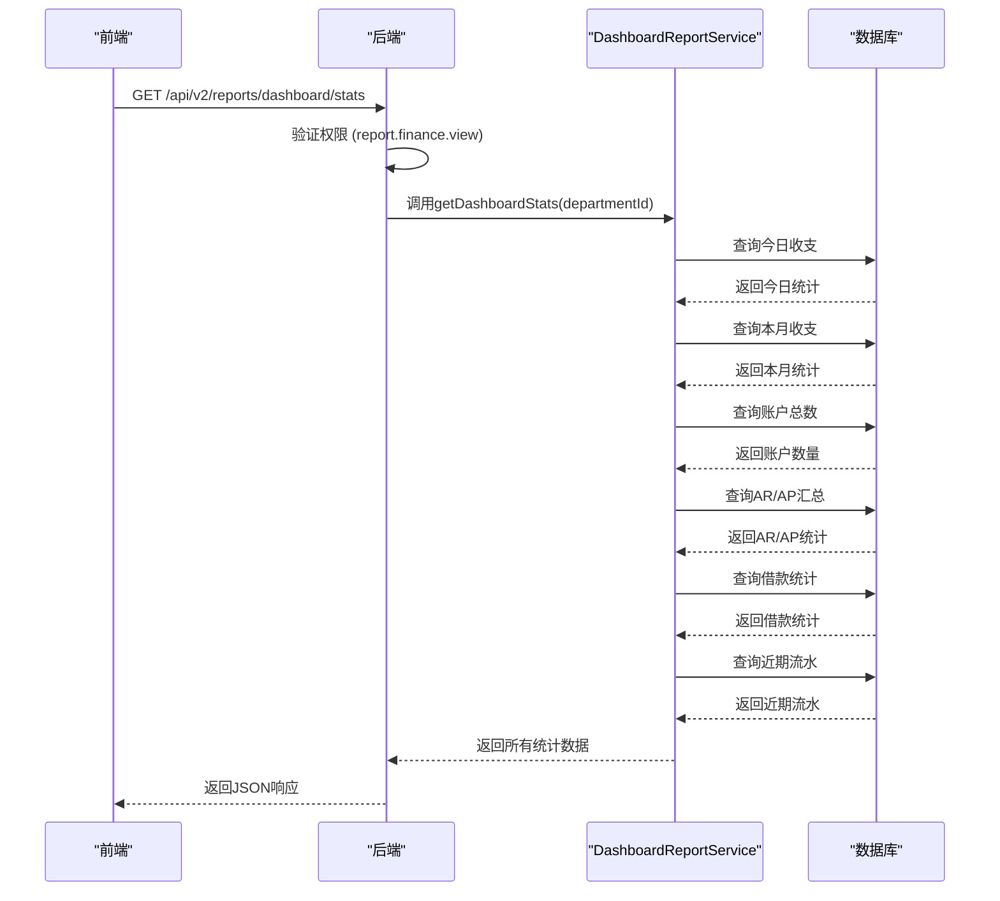

# 仪表板报表

<cite>
**本文档引用的文件**   
- [DashboardReportService.ts](file://backend/src/services/DashboardReportService.ts)
- [DashboardPage.tsx](file://frontend/src/features/dashboard/pages/DashboardPage.tsx)
- [MyDashboardPage.tsx](file://frontend/src/features/my/pages/MyDashboardPage.tsx)
- [reports.ts](file://backend/src/routes/v2/reports.ts)
- [schema.ts](file://backend/src/db/schema.ts)
- [useApiQuery.ts](file://frontend/src/utils/useApiQuery.ts)
- [api.ts](file://frontend/src/config/api.ts)
- [permission.ts](file://backend/src/middleware/permission.ts)
- [permissions.ts](file://backend/src/utils/permissions.ts)
</cite>

## 目录
1. [简介](#简介)
2. [核心指标计算逻辑](#核心指标计算逻辑)
3. [数据可视化展示](#数据可视化展示)
4. [API接口与权限控制](#api接口与权限控制)
5. [性能优化与缓存策略](#性能优化与缓存策略)
6. [结论](#结论)

## 简介

仪表板报表是财务管理系统的核心功能之一，为用户提供系统关键指标的实时统计视图。该功能通过后端的`DashboardReportService`服务生成统计数据，并由前端`DashboardPage`组件进行可视化展示。仪表板提供了今日收支、本月收支、账户总数、应收应付汇总、借款统计和近期流水等核心指标，帮助用户快速了解财务状况。

**Section sources**
- [DashboardReportService.ts](file://backend/src/services/DashboardReportService.ts#L1-L197)
- [DashboardPage.tsx](file://frontend/src/features/dashboard/pages/DashboardPage.tsx#L1-L98)

## 核心指标计算逻辑

仪表板报表的核心指标由`DashboardReportService`服务计算生成，该服务通过Drizzle ORM与数据库交互，执行高效的SQL查询来获取统计数据。

### 今日与本月收支统计

今日收支统计基于当天的业务日期（`bizDate`）进行查询，而本月收支统计则基于当月的起止日期。查询时会排除红冲记录（`isReversal`为0或NULL），确保统计数据的准确性。

**Diagram sources**
- [DashboardReportService.ts](file://backend/src/services/DashboardReportService.ts#L45-L83)

### 账户总数统计

账户总数统计通过查询`accounts`表中所有激活状态（`active=1`）的账户记录来实现。这是一个简单的计数查询，用于显示系统中当前可用的账户数量。

### 应收应付（AR/AP）汇总

应收应付汇总统计基于`arApDocs`表，按文档类型（`kind`）分组，计算每个类型的总数量、总金额和未结清金额。查询条件包括指定的起始日期和可选的部门ID。

### 借款统计

借款统计包括借款人数、总借款金额、总还款金额和借款余额。借款余额通过总借款金额减去总还款金额计算得出，反映了系统的借款净额。

### 近期流水

近期流水查询返回最近的10条流水记录，按创建时间倒序排列。查询结果包含流水信息以及关联的账户名称、分类名称和部门名称，为用户提供详细的交易历史。

**Section sources**
- [DashboardReportService.ts](file://backend/src/services/DashboardReportService.ts#L1-L197)
- [schema.ts](file://backend/src/db/schema.ts#L159-L188)

## 数据可视化展示

仪表板的数据可视化主要通过前端`MyDashboardPage`组件实现，该组件使用Ant Design的Card、Statistic和List等组件来展示数据。

### 组件结构

`MyDashboardPage`组件包含用户信息卡片、统计卡片和最近申请列表三个主要部分。统计卡片使用`Statistic`组件展示关键指标，如本月薪资、年假余额、待报销金额和借支余额。

**Diagram sources**
- [MyDashboardPage.tsx](file://frontend/src/features/my/pages/MyDashboardPage.tsx#L1-L179)
- [useApiQuery.ts](file://frontend/src/utils/useApiQuery.ts#L1-L103)

### 数据获取

`MyDashboardPage`组件通过`useMyDashboard`自定义Hook获取数据。该Hook使用`useApiQuery`封装了API调用，设置了2分钟的缓存时间，以减少对后端的频繁请求。

**Section sources**
- [MyDashboardPage.tsx](file://frontend/src/features/my/pages/MyDashboardPage.tsx#L1-L179)
- [useMy.ts](file://frontend/src/hooks/business/useMy.ts#L1-L54)

## API接口与权限控制

仪表板报表的API接口定义在`reports.ts`路由文件中，通过OpenAPI规范描述了接口的请求和响应格式。

### API接口定义

`/dashboard/stats`接口支持可选的`departmentId`查询参数，允许用户按部门查看统计数据。接口响应包含所有核心指标的详细数据结构。

**Diagram sources**
- [reports.ts](file://backend/src/routes/v2/reports.ts#L48-L113)
- [DashboardReportService.ts](file://backend/src/services/DashboardReportService.ts#L26-L194)

### 权限控制

权限控制通过`permission.ts`中间件实现，使用`hasPermission`函数检查用户是否有`report.finance.view`权限。权限检查结合了用户职位的权限配置和部门的模块访问权限。

**Section sources**
- [reports.ts](file://backend/src/routes/v2/reports.ts#L103-L106)
- [permission.ts](file://backend/src/middleware/permission.ts#L1-L43)
- [permissions.ts](file://backend/src/utils/permissions.ts#L91-L135)

## 性能优化与缓存策略

仪表板报表采用了多层缓存策略来优化性能，确保高频访问的接口能够快速响应。

### 服务端缓存

`DashboardReportService`使用KV命名空间进行服务端缓存，缓存键包含日期和部门ID，缓存有效期为5分钟。这有效减少了数据库查询压力，特别是在高并发场景下。

### 客户端缓存

前端通过`useApiQuery` Hook实现了客户端缓存，`MyDashboard`页面的数据缓存时间为2分钟。这减少了不必要的网络请求，提升了用户体验。

### 缓存策略对比

| 缓存类型 | 实现方式 | 缓存时间 | 作用 |
|---------|--------|--------|-----|
| 服务端缓存 | KV命名空间 | 5分钟 | 减少数据库查询，降低后端负载 |
| 客户端缓存 | React Query | 2分钟 | 减少网络请求，提升前端响应速度 |

**Section sources**
- [DashboardReportService.ts](file://backend/src/services/DashboardReportService.ts#L27-L37)
- [useApiQuery.ts](file://frontend/src/utils/useApiQuery.ts#L11-L41)

## 结论

仪表板报表功能通过高效的后端服务和直观的前端展示，为用户提供了实时的财务概览。核心指标的计算逻辑清晰，数据来源可靠，权限控制严格，缓存策略合理。该功能不仅满足了用户对关键指标的实时监控需求，还通过优化的性能设计确保了系统的稳定性和响应速度。