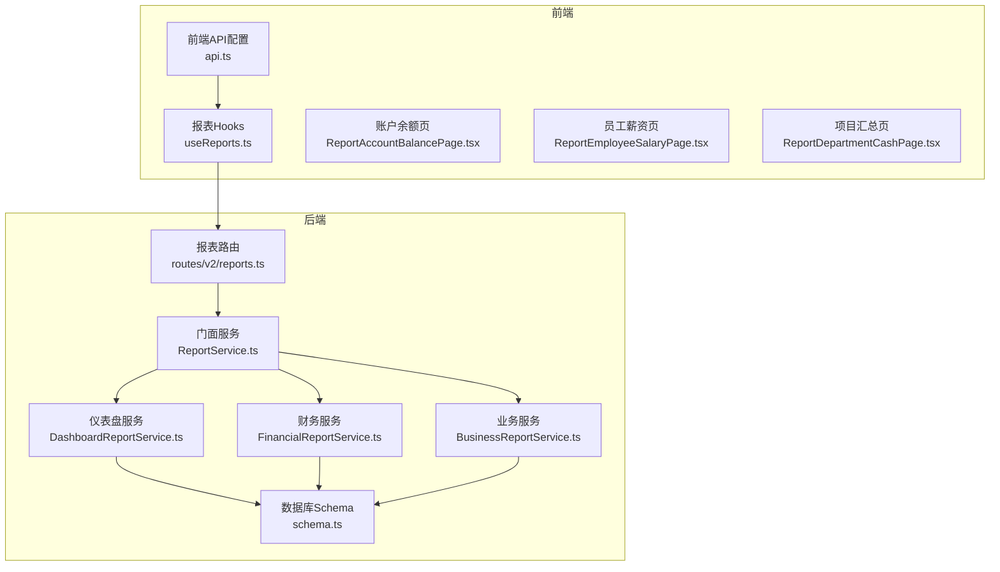
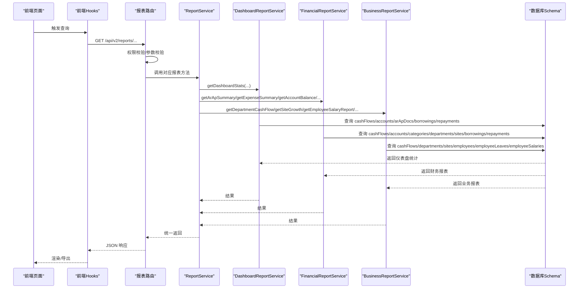
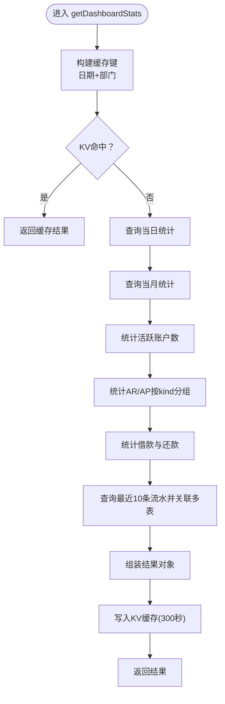
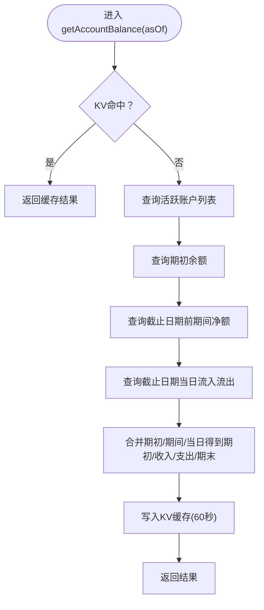
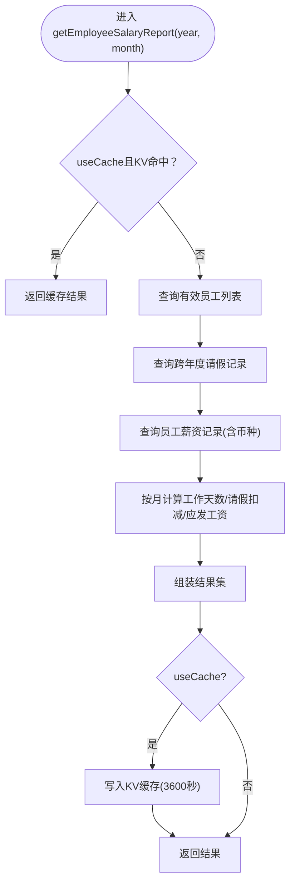
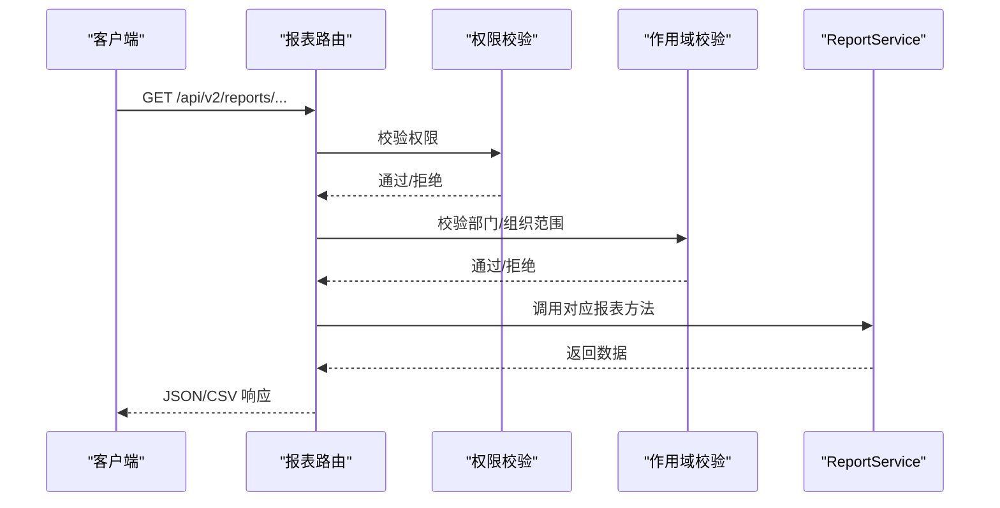
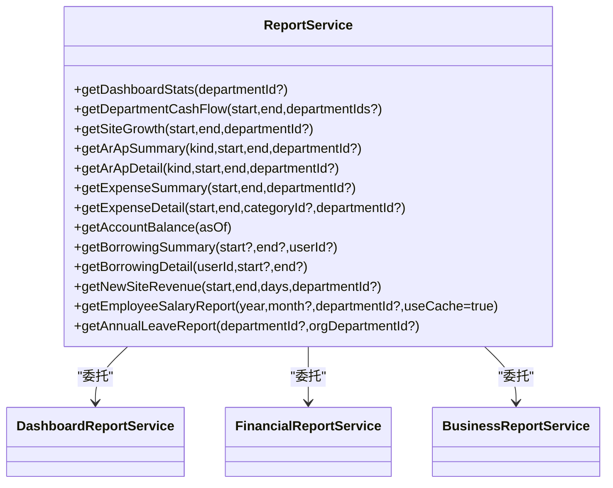
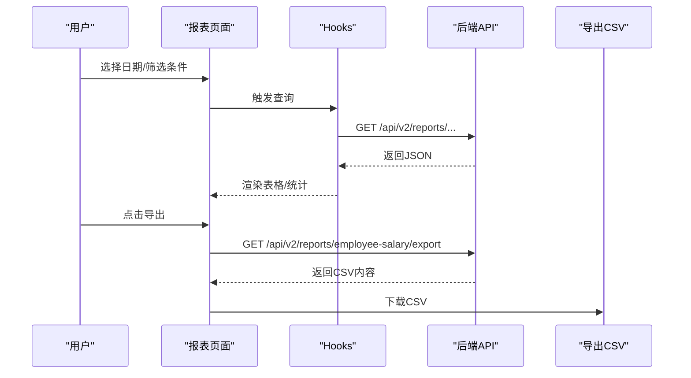

# 报表系统

<cite>
**本文引用的文件**
- [ReportService.ts](file://backend/src/services/ReportService.ts)
- [DashboardReportService.ts](file://backend/src/services/DashboardReportService.ts)
- [FinancialReportService.ts](file://backend/src/services/FinancialReportService.ts)
- [BusinessReportService.ts](file://backend/src/services/BusinessReportService.ts)
- [reports.ts](file://backend/src/routes/v2/reports.ts)
- [schema.ts](file://backend/src/db/schema.ts)
- [api.ts](file://frontend/src/config/api.ts)
- [useReports.ts](file://frontend/src/hooks/business/useReports.ts)
- [ReportAccountBalancePage.tsx](file://frontend/src/features/reports/pages/ReportAccountBalancePage.tsx)
- [ReportEmployeeSalaryPage.tsx](file://frontend/src/features/reports/pages/ReportEmployeeSalaryPage.tsx)
- [ReportDepartmentCashPage.tsx](file://frontend/src/features/reports/pages/ReportDepartmentCashPage.tsx)
</cite>

## 目录
1. [简介](#简介)
2. [项目结构](#项目结构)
3. [核心组件](#核心组件)
4. [架构总览](#架构总览)
5. [详细组件分析](#详细组件分析)
6. [依赖关系分析](#依赖关系分析)
7. [性能与缓存策略](#性能与缓存策略)
8. [前端使用与导出](#前端使用与导出)
9. [故障排查指南](#故障排查指南)
10. [结论](#结论)

## 简介
本文件面向“报表系统”模块，系统性梳理仪表板、财务报表与业务报表三类报表的实现与使用。重点说明 ReportService 作为门面服务如何整合 DashboardReportService、FinancialReportService 和 BusinessReportService 三个子服务；阐述各类报表的数据来源、查询逻辑与展示方式；并结合前端报表页面说明用户如何查看与导出报表，最后给出报表 API 的调用方法与性能优化建议。

## 项目结构
- 后端采用分层设计：
  - 服务层：ReportService 门面 + DashboardReportService、FinancialReportService、BusinessReportService 子服务
  - 路由层：OpenAPI 路由定义，负责鉴权、参数校验、调用服务层并返回结果
  - 数据层：Drizzle ORM Schema 定义各实体表，服务层基于 Schema 执行查询
- 前端采用 Hooks + 页面组件的模式：
  - Hooks 封装请求与缓存策略
  - 页面组件负责交互、面包屑、表格与导出

图表来源
- [reports.ts](file://backend/src/routes/v2/reports.ts#L1-L120)
- [ReportService.ts](file://backend/src/services/ReportService.ts#L1-L85)
- [DashboardReportService.ts](file://backend/src/services/DashboardReportService.ts#L1-L60)
- [FinancialReportService.ts](file://backend/src/services/FinancialReportService.ts#L1-L60)
- [BusinessReportService.ts](file://backend/src/services/BusinessReportService.ts#L1-L60)
- [schema.ts](file://backend/src/db/schema.ts#L139-L188)
- [api.ts](file://frontend/src/config/api.ts#L64-L79)
- [useReports.ts](file://frontend/src/hooks/business/useReports.ts#L354-L366)

章节来源
- [reports.ts](file://backend/src/routes/v2/reports.ts#L1-L120)
- [ReportService.ts](file://backend/src/services/ReportService.ts#L1-L85)
- [schema.ts](file://backend/src/db/schema.ts#L139-L188)
- [api.ts](file://frontend/src/config/api.ts#L64-L79)
- [useReports.ts](file://frontend/src/hooks/business/useReports.ts#L354-L366)

## 核心组件
- ReportService（门面）：聚合三个子服务，统一对外暴露报表能力，便于路由层调用与权限控制。
- DashboardReportService：仪表盘统计数据（当日/当月收入支出、账户数、AR/AP、借款与最近流水）。
- FinancialReportService：财务类报表（AR/AP 汇总/明细、费用汇总/明细、账户余额、借款汇总/明细）。
- BusinessReportService：业务类报表（部门现金流、站点增长、新站点收入、员工薪资、年假）。

章节来源
- [ReportService.ts](file://backend/src/services/ReportService.ts#L1-L85)
- [DashboardReportService.ts](file://backend/src/services/DashboardReportService.ts#L1-L60)
- [FinancialReportService.ts](file://backend/src/services/FinancialReportService.ts#L1-L60)
- [BusinessReportService.ts](file://backend/src/services/BusinessReportService.ts#L1-L60)

## 架构总览
后端以 OpenAPI 路由为入口，统一进行权限校验与参数校验，随后委托给 ReportService，再由其分派到具体子服务。子服务通过 Drizzle ORM 查询 schema 中的表，组装报表数据并返回。前端通过 Hooks 发起请求，页面组件渲染数据并支持导出。

图表来源
- [reports.ts](file://backend/src/routes/v2/reports.ts#L1-L120)
- [ReportService.ts](file://backend/src/services/ReportService.ts#L28-L84)
- [DashboardReportService.ts](file://backend/src/services/DashboardReportService.ts#L26-L194)
- [FinancialReportService.ts](file://backend/src/services/FinancialReportService.ts#L28-L374)
- [BusinessReportService.ts](file://backend/src/services/BusinessReportService.ts#L28-L549)
- [schema.ts](file://backend/src/db/schema.ts#L139-L188)

## 详细组件分析

### 仪表板报表（DashboardReportService）
- 功能要点
  - 当日/当月收入支出与笔数统计
  - 账户总数
  - AR/AP 按类型统计（数量、金额、未结清金额）
  - 借款与还款统计及余额
  - 最近 10 笔流水（关联账户、分类、部门）
  - 支持按部门维度过滤
  - 使用 KV 缓存（当日维度+部门维度），过期时间 5 分钟
- 关键数据源
  - cashFlows、accounts、arApDocs、borrowings、repayments、departments、categories
- 性能与复杂度
  - 多个条件查询与分组聚合，KV 缓存显著降低重复查询成本

图表来源
- [DashboardReportService.ts](file://backend/src/services/DashboardReportService.ts#L26-L194)
- [schema.ts](file://backend/src/db/schema.ts#L139-L188)

章节来源
- [DashboardReportService.ts](file://backend/src/services/DashboardReportService.ts#L26-L194)
- [schema.ts](file://backend/src/db/schema.ts#L139-L188)

### 财务报表（FinancialReportService）
- 财务类报表
  - AR/AP 汇总/明细：按日期范围与部门过滤，计算总金额、已结算金额、按状态分布
  - 费用汇总/明细：按类别汇总或明细展示，支持按类别与部门过滤
  - 账户余额：按截止日期计算期初、期间收入/支出、期末余额，支持缓存（60 秒）
  - 借款汇总/明细：按用户、时间范围汇总，或按用户明细展示
- 关键数据源
  - arApDocs、cashFlows、accounts、categories、departments、sites、borrowings、repayments、employees
- 复杂度与优化
  - 账户余额涉及期初、期间净额与当日流水的多表联接与映射，使用 KV 缓存提升性能

图表来源
- [FinancialReportService.ts](file://backend/src/services/FinancialReportService.ts#L165-L274)
- [schema.ts](file://backend/src/db/schema.ts#L139-L188)

章节来源
- [FinancialReportService.ts](file://backend/src/services/FinancialReportService.ts#L28-L374)
- [schema.ts](file://backend/src/db/schema.ts#L139-L188)

### 业务报表（BusinessReportService）
- 业务类报表
  - 部门现金流：按日期范围统计部门收入/支出/净额与笔数
  - 站点增长：对比当前窗口与同比窗口的收入，计算增长率
  - 新站点收入：筛选创建时间在指定窗口内的站点，统计其收入
  - 员工薪资：按年/月计算应发工资，考虑入职当月工作天数与请假扣减，支持 USDT 优先薪资币种
  - 年假：基于 AnnualLeaveService 计算周期、额度、已用、剩余
- 关键数据源
  - cashFlows、departments、sites、employees、employeeLeaves、employeeSalaries、currencies
- 复杂度与优化
  - 员工薪资计算涉及多币种、生效日期、请假重叠天数等，使用 KV 缓存（默认 1 小时）

图表来源
- [BusinessReportService.ts](file://backend/src/services/BusinessReportService.ts#L226-L496)
- [schema.ts](file://backend/src/db/schema.ts#L220-L229)

章节来源
- [BusinessReportService.ts](file://backend/src/services/BusinessReportService.ts#L28-L549)
- [schema.ts](file://backend/src/db/schema.ts#L220-L229)

### 报表API与权限控制（后端路由）
- 路由层职责
  - OpenAPI 定义与参数校验
  - 权限校验：不同报表需要不同权限位
  - 作用域校验：validateScope 根据用户岗位级别与所属部门限制可访问范围
  - 调用 ReportService 对应方法并返回
- 导出支持
  - 员工薪资报表提供 CSV 导出接口，禁用缓存以保证导出数据实时性

图表来源
- [reports.ts](file://backend/src/routes/v2/reports.ts#L19-L46)
- [reports.ts](file://backend/src/routes/v2/reports.ts#L115-L182)
- [reports.ts](file://backend/src/routes/v2/reports.ts#L639-L791)

章节来源
- [reports.ts](file://backend/src/routes/v2/reports.ts#L19-L46)
- [reports.ts](file://backend/src/routes/v2/reports.ts#L115-L182)
- [reports.ts](file://backend/src/routes/v2/reports.ts#L639-L791)

## 依赖关系分析
- 服务间耦合
  - ReportService 仅依赖三个子服务，低耦合高内聚
  - 子服务均依赖 Drizzle 与 schema，避免直接依赖路由层
- 外部依赖
  - KV 缓存用于热点报表（仪表盘、部门现金流、薪资等）
  - 前端通过 api.ts 统一管理后端接口地址

图表来源
- [ReportService.ts](file://backend/src/services/ReportService.ts#L1-L85)

章节来源
- [ReportService.ts](file://backend/src/services/ReportService.ts#L1-L85)

## 性能与缓存策略
- 缓存策略
  - 仪表盘：当日+部门维度，过期 300 秒
  - 部门现金流：日期+部门维度，过期 300 秒
  - 账户余额：截止日期维度，过期 60 秒
  - 员工薪资：默认过期 3600 秒；导出接口禁用缓存
- 建议
  - 对高频查询（仪表盘、部门现金流）可进一步按用户维度细化缓存键
  - 对大结果集报表（费用明细、AR/AP 明细）建议前端分页或后端分页参数化
  - 对跨年/跨币种薪资计算，建议在前端缓存用户可见的短期结果，减少重复请求

[本节为通用性能建议，不直接分析具体文件]

## 前端使用与导出

### 接口与调用方法
- 前端通过 api.ts 统一配置后端接口地址，例如：
  - 报表路由：/api/v2/reports/department-cash、/api/v2/reports/account-balance、/api/v2/reports/employee-salary 等
  - 员工薪资导出：/api/v2/reports/employee-salary/export
- Hooks 层封装请求与缓存策略，如 useAccountBalance、useDepartmentCash、useEmployeeSalary 等

章节来源
- [api.ts](file://frontend/src/config/api.ts#L64-L79)
- [useReports.ts](file://frontend/src/hooks/business/useReports.ts#L354-L366)
- [useReports.ts](file://frontend/src/hooks/business/useReports.ts#L418-L446)

### 用户查看与导出流程
- 账户余额报表
  - 页面支持按币种/账户/明细三级视图切换，支持凭证预览
  - 导出：前端根据 CSV 列定义生成并下载
- 员工薪资报表
  - 支持年/月筛选，汇总统计（总人数、工资总额、平均工资）
  - 提供 CSV 导出接口，禁用缓存确保数据实时
- 项目汇总报表
  - 支持日期范围筛选，展示部门收入/支出/净额

图表来源
- [ReportAccountBalancePage.tsx](file://frontend/src/features/reports/pages/ReportAccountBalancePage.tsx#L1-L120)
- [ReportEmployeeSalaryPage.tsx](file://frontend/src/features/reports/pages/ReportEmployeeSalaryPage.tsx#L1-L120)
- [ReportDepartmentCashPage.tsx](file://frontend/src/features/reports/pages/ReportDepartmentCashPage.tsx#L1-L62)
- [reports.ts](file://backend/src/routes/v2/reports.ts#L639-L791)

章节来源
- [ReportAccountBalancePage.tsx](file://frontend/src/features/reports/pages/ReportAccountBalancePage.tsx#L1-L120)
- [ReportEmployeeSalaryPage.tsx](file://frontend/src/features/reports/pages/ReportEmployeeSalaryPage.tsx#L1-L120)
- [ReportDepartmentCashPage.tsx](file://frontend/src/features/reports/pages/ReportDepartmentCashPage.tsx#L1-L62)
- [reports.ts](file://backend/src/routes/v2/reports.ts#L639-L791)

## 故障排查指南
- 权限不足
  - 现象：返回 403 Forbidden
  - 排查：确认用户岗位级别与所需权限位（report.*.view）
- 参数非法
  - 现象：参数校验失败
  - 排查：核对日期范围、部门 ID、用户 ID 等参数格式与范围
- 缓存异常
  - 现象：仪表盘/部门现金流/薪资报表数据陈旧
  - 排查：检查 KV 缓存键与过期时间；必要时清理缓存或等待过期
- 数据缺失
  - 现象：报表为空或部分字段为 0
  - 排查：确认业务数据是否已录入（流水、AR/AP、薪资等）；检查过滤条件（部门、日期范围）

章节来源
- [reports.ts](file://backend/src/routes/v2/reports.ts#L19-L46)
- [reports.ts](file://backend/src/routes/v2/reports.ts#L115-L182)
- [DashboardReportService.ts](file://backend/src/services/DashboardReportService.ts#L26-L60)
- [BusinessReportService.ts](file://backend/src/services/BusinessReportService.ts#L28-L87)

## 结论
报表系统通过 ReportService 门面将仪表盘、财务与业务三类报表解耦，配合 KV 缓存与严格的权限/作用域控制，实现了高效、安全、可扩展的报表能力。前端以 Hooks 与页面组件形式提供直观的查询与导出体验。建议持续关注高频报表的缓存粒度与导出性能，并在业务数据量增长时引入分页与索引优化。