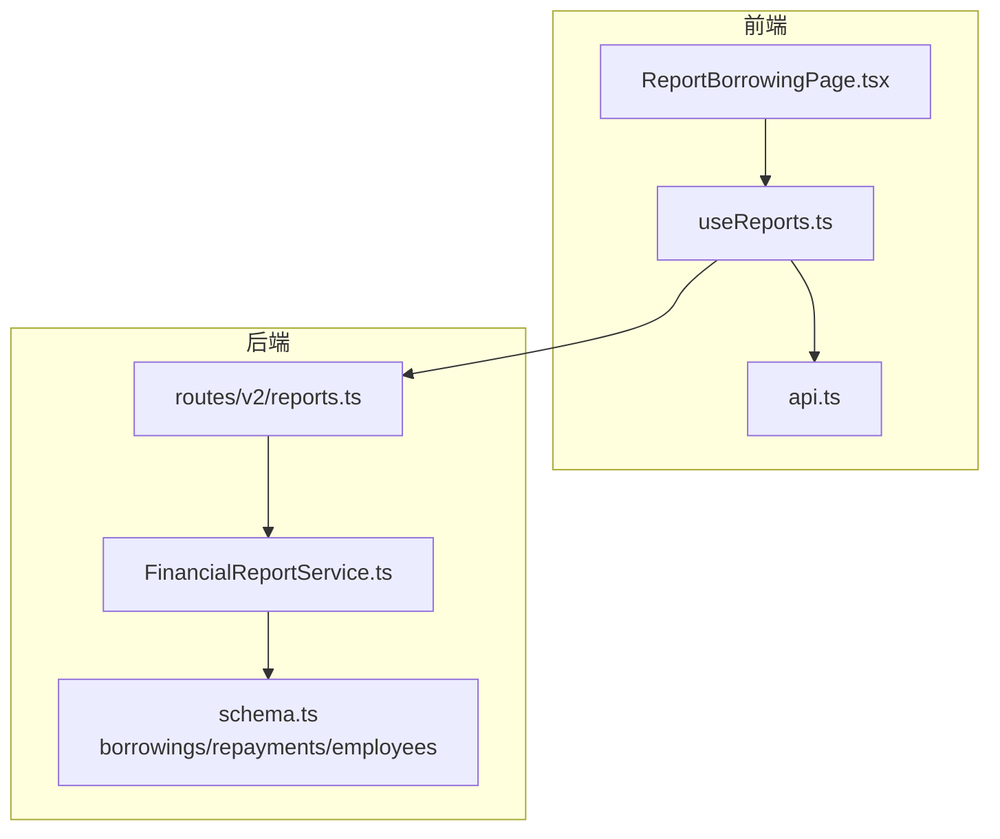
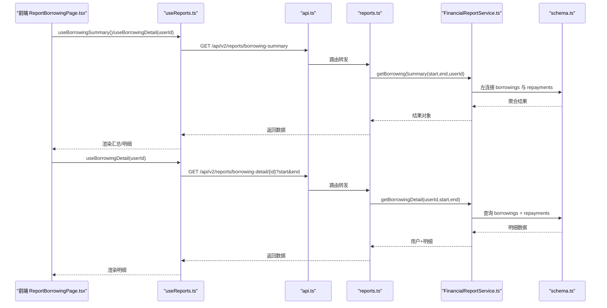
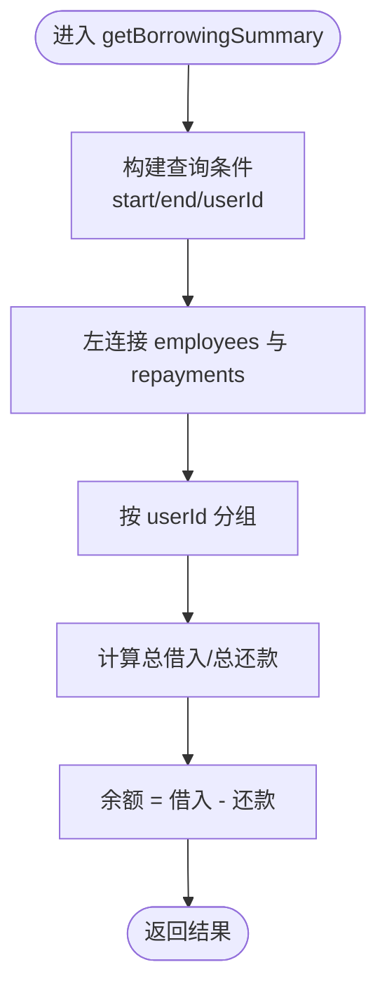
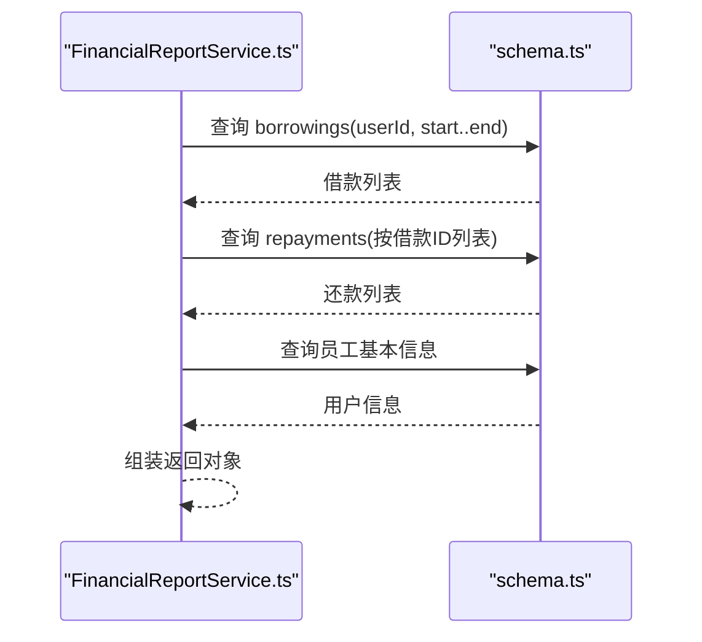
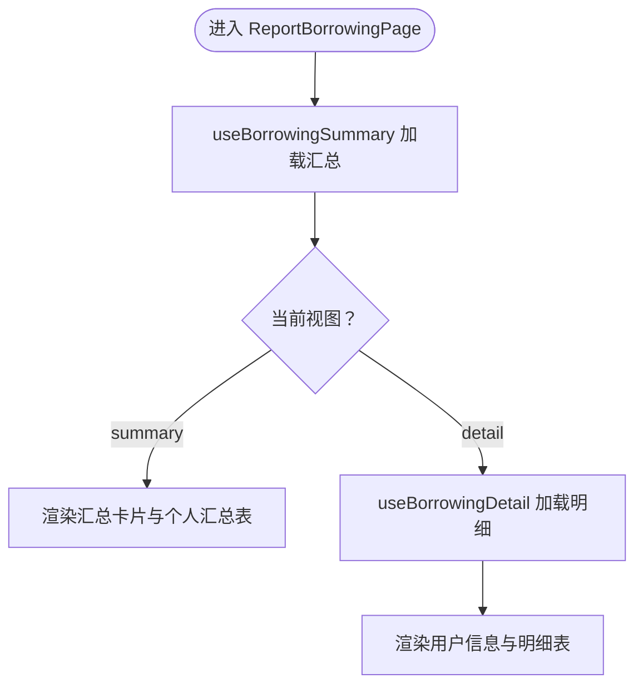
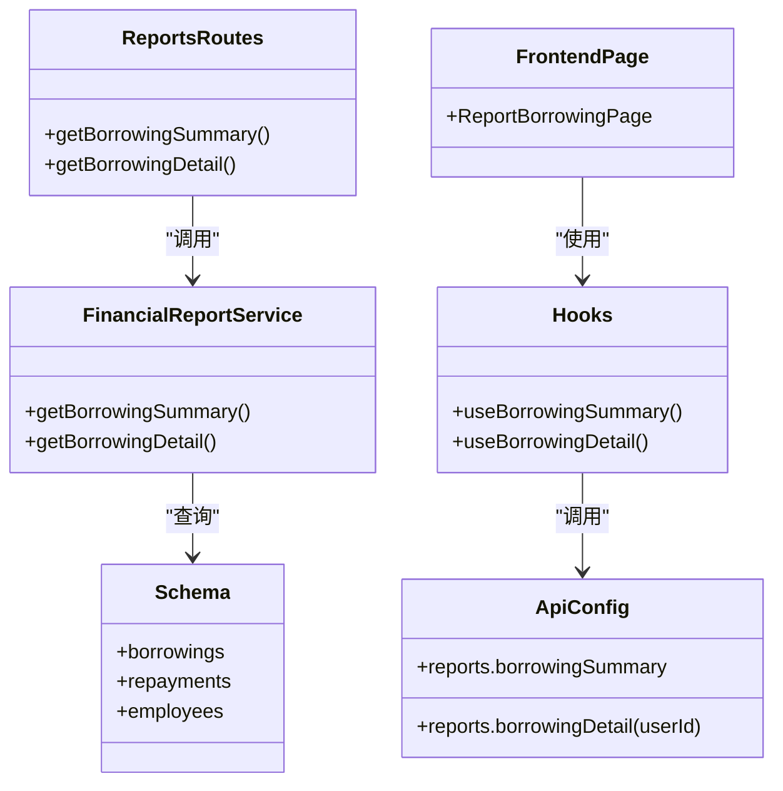

# 借款报表

<cite>
**本文引用的文件**
- [backend/src/services/FinancialReportService.ts](file://backend/src/services/FinancialReportService.ts)
- [backend/src/routes/v2/reports.ts](file://backend/src/routes/v2/reports.ts)
- [frontend/src/features/reports/pages/ReportBorrowingPage.tsx](file://frontend/src/features/reports/pages/ReportBorrowingPage.tsx)
- [frontend/src/hooks/business/useReports.ts](file://frontend/src/hooks/business/useReports.ts)
- [frontend/src/config/api.ts](file://frontend/src/config/api.ts)
- [backend/src/db/schema.ts](file://backend/src/db/schema.ts)
- [backend/src/services/BorrowingService.ts](file://backend/src/services/BorrowingService.ts)
</cite>

## 目录
1. [简介](#简介)
2. [项目结构](#项目结构)
3. [核心组件](#核心组件)
4. [架构总览](#架构总览)
5. [详细组件分析](#详细组件分析)
6. [依赖关系分析](#依赖关系分析)
7. [性能考量](#性能考量)
8. [故障排查指南](#故障排查指南)
9. [结论](#结论)
10. [附录](#附录)

## 简介
本技术文档聚焦于“借款报表”功能，系统性解析后端服务层 FinancialReportService 的两个关键方法：
- getBorrowingSummary：基于借款表与还款表的左连接，生成个人借款汇总与余额。
- getBorrowingDetail：按用户维度拉取其借款与还款明细，并进行前端展示。

同时，结合前端 ReportBorrowingPage.tsx 的实现，说明如何在页面中展示员工借款总览与详细交易流水；并提供 API 使用示例（按时间范围筛选与特定用户查询），以及在处理大量借款记录时的性能优化建议。

## 项目结构
借款报表涉及前后端协作的关键模块如下：
- 后端路由层：定义 /reports/borrowing-summary 与 /reports/borrowing-detail/{id} 接口，负责参数校验与鉴权。
- 后端服务层：FinancialReportService 提供 getBorrowingSummary 与 getBorrowingDetail 的数据聚合逻辑。
- 数据库模型：borrowings、repayments、employees 等表定义，支撑汇总与明细查询。
- 前端页面：ReportBorrowingPage.tsx 展示汇总与明细，useReports.ts 提供 React Query 查询钩子。
- API 配置：frontend/src/config/api.ts 统一管理后端接口地址。

图表来源
- [frontend/src/features/reports/pages/ReportBorrowingPage.tsx](file://frontend/src/features/reports/pages/ReportBorrowingPage.tsx#L1-L394)
- [frontend/src/hooks/business/useReports.ts](file://frontend/src/hooks/business/useReports.ts#L256-L325)
- [frontend/src/config/api.ts](file://frontend/src/config/api.ts#L64-L79)
- [backend/src/routes/v2/reports.ts](file://backend/src/routes/v2/reports.ts#L517-L596)
- [backend/src/services/FinancialReportService.ts](file://backend/src/services/FinancialReportService.ts#L276-L371)
- [backend/src/db/schema.ts](file://backend/src/db/schema.ts#L368-L437)

章节来源
- [backend/src/routes/v2/reports.ts](file://backend/src/routes/v2/reports.ts#L517-L596)
- [backend/src/services/FinancialReportService.ts](file://backend/src/services/FinancialReportService.ts#L276-L371)
- [frontend/src/features/reports/pages/ReportBorrowingPage.tsx](file://frontend/src/features/reports/pages/ReportBorrowingPage.tsx#L1-L394)
- [frontend/src/hooks/business/useReports.ts](file://frontend/src/hooks/business/useReports.ts#L256-L325)
- [frontend/src/config/api.ts](file://frontend/src/config/api.ts#L64-L79)
- [backend/src/db/schema.ts](file://backend/src/db/schema.ts#L368-L437)

## 核心组件
- 后端路由 reports.ts
  - 定义 /reports/borrowing-summary 与 /reports/borrowing-detail/{id} 两个接口，支持查询参数 start/end、userId 等。
  - 调用 c.var.services.report 实例的 getBorrowingSummary/getBorrowingDetail 方法。
- 服务层 FinancialReportService
  - getBorrowingSummary：对 borrowings 表做左连接 repayments，按 userId 分组，计算总借入与总还款，余额=借入-还款。
  - getBorrowingDetail：先按用户查询 borrowings，再根据借款 ID 列表查询对应的 repayments，最后补充用户基本信息。
- 前端 ReportBorrowingPage.tsx
  - 提供“汇总视图”与“明细视图”，汇总页展示各币种统计与个人汇总表，明细页展示该用户的借款与还款流水。
- 前端 useReports.ts
  - useBorrowingSummary/useBorrowingDetail 提供 React Query 查询钩子，自动缓存与分页。
- 数据库 schema.ts
  - 定义 borrowings、repayments、employees 等核心表，字段包含金额、币种、时间、状态等，支撑报表聚合。

章节来源
- [backend/src/routes/v2/reports.ts](file://backend/src/routes/v2/reports.ts#L517-L596)
- [backend/src/services/FinancialReportService.ts](file://backend/src/services/FinancialReportService.ts#L276-L371)
- [frontend/src/features/reports/pages/ReportBorrowingPage.tsx](file://frontend/src/features/reports/pages/ReportBorrowingPage.tsx#L53-L394)
- [frontend/src/hooks/business/useReports.ts](file://frontend/src/hooks/business/useReports.ts#L256-L325)
- [backend/src/db/schema.ts](file://backend/src/db/schema.ts#L368-L437)

## 架构总览
下图展示了从前端到后端再到数据库的数据流与调用链路。

图表来源
- [frontend/src/features/reports/pages/ReportBorrowingPage.tsx](file://frontend/src/features/reports/pages/ReportBorrowingPage.tsx#L53-L394)
- [frontend/src/hooks/business/useReports.ts](file://frontend/src/hooks/business/useReports.ts#L256-L325)
- [frontend/src/config/api.ts](file://frontend/src/config/api.ts#L64-L79)
- [backend/src/routes/v2/reports.ts](file://backend/src/routes/v2/reports.ts#L517-L596)
- [backend/src/services/FinancialReportService.ts](file://backend/src/services/FinancialReportService.ts#L276-L371)
- [backend/src/db/schema.ts](file://backend/src/db/schema.ts#L368-L437)

## 详细组件分析

### 后端服务：FinancialReportService.getBorrowingSummary
- 查询条件
  - 支持 start/end 时间范围过滤，以及可选的 userId 过滤。
- 关键逻辑
  - 从 borrowings 表开始，左连接 employees（用于获取姓名/邮箱）与 repayments（用于累计还款）。
  - 使用 coalesce(sum(amountCents)) 计算总借入与总还款，余额=借入-还款。
  - 按 userId、姓名、邮箱分组，最终返回包含用户标识、币种、借入、还款、余额的结果集。
- 性能要点
  - 左连接确保即使某用户无还款记录也会出现在结果中。
  - 使用 coalesce 避免 NULL 导致的计算问题。
  - 分组与聚合在数据库侧完成，减少应用层开销。

图表来源
- [backend/src/services/FinancialReportService.ts](file://backend/src/services/FinancialReportService.ts#L276-L312)

章节来源
- [backend/src/services/FinancialReportService.ts](file://backend/src/services/FinancialReportService.ts#L276-L312)

### 后端服务：FinancialReportService.getBorrowingDetail
- 查询条件
  - 必填 userId；可选 start/end 时间范围。
- 关键逻辑
  - 先按 userId 与时间范围查询 borrowings，得到借款列表。
  - 取出所有借款 ID，查询对应的 repayments，按创建时间倒序排列。
  - 查询员工基本信息（姓名/邮箱），若不存在则返回占位用户信息。
  - 最终返回用户信息与两条明细列表（borrowings、repayments）。
- 性能要点
  - 先查主表再查从表，避免 N+1 查询。
  - 对 repayments 使用 inArray(borrowingId...) 批量查询，提升效率。

图表来源
- [backend/src/services/FinancialReportService.ts](file://backend/src/services/FinancialReportService.ts#L314-L371)

章节来源
- [backend/src/services/FinancialReportService.ts](file://backend/src/services/FinancialReportService.ts#L314-L371)

### 前端页面：ReportBorrowingPage.tsx
- 视图切换
  - summary：展示各币种汇总与个人汇总表，支持“查看明细”跳转。
  - detail：展示指定用户的借款与还款明细，按币种统计汇总。
- 数据来源
  - useBorrowingSummary/useBorrowingDetail 钩子分别请求后端接口。
- 展示细节
  - 汇总页：统计借款人数、借款总额、还款总额、总余额。
  - 明细页：分别渲染借款记录与还款记录表格，含金额、账户、备注、创建人等字段。
  - 余额颜色区分：正余额显示为红色，零余额显示为绿色。

图表来源
- [frontend/src/features/reports/pages/ReportBorrowingPage.tsx](file://frontend/src/features/reports/pages/ReportBorrowingPage.tsx#L53-L394)
- [frontend/src/hooks/business/useReports.ts](file://frontend/src/hooks/business/useReports.ts#L256-L325)

章节来源
- [frontend/src/features/reports/pages/ReportBorrowingPage.tsx](file://frontend/src/features/reports/pages/ReportBorrowingPage.tsx#L53-L394)
- [frontend/src/hooks/business/useReports.ts](file://frontend/src/hooks/business/useReports.ts#L256-L325)

### API 使用示例
- 汇总接口
  - GET /api/v2/reports/borrowing-summary
  - 查询参数：
    - start：开始日期（可选）
    - end：结束日期（可选）
    - userId：用户ID（可选）
  - 示例：
    - GET /api/v2/reports/borrowing-summary?start=2024-01-01&end=2024-12-31
    - GET /api/v2/reports/borrowing-summary?userId=xxx-xxx-xxx
- 明细接口
  - GET /api/v2/reports/borrowing-detail/{id}
  - 查询参数：
    - start：开始日期（可选）
    - end：结束日期（可选）
  - 示例：
    - GET /api/v2/reports/borrowing-detail/xxx-xxx-xxx?start=2024-01-01&end=2024-12-31

章节来源
- [backend/src/routes/v2/reports.ts](file://backend/src/routes/v2/reports.ts#L517-L596)
- [frontend/src/config/api.ts](file://frontend/src/config/api.ts#L64-L79)

## 依赖关系分析
- 路由层依赖服务层
  - reports.ts 中的路由处理器调用 c.var.services.report 的 getBorrowingSummary/getBorrowingDetail。
- 服务层依赖数据库模型
  - FinancialReportService 使用 schema.ts 中的 borrowings、repayments、employees 表进行查询。
- 前端依赖后端接口
  - ReportBorrowingPage.tsx 通过 useReports.ts 的钩子发起请求，api.ts 统一管理接口地址。
- 借款余额计算
  - 借款余额 = 借入总和 - 还款总和，其中借入来自 borrowings.amountCents，还款来自 repayments.amountCents。
  - 由于采用左连接，未产生还款记录的用户也会出现在汇总中，余额为借入总和。

图表来源
- [backend/src/routes/v2/reports.ts](file://backend/src/routes/v2/reports.ts#L517-L596)
- [backend/src/services/FinancialReportService.ts](file://backend/src/services/FinancialReportService.ts#L276-L371)
- [backend/src/db/schema.ts](file://backend/src/db/schema.ts#L368-L437)
- [frontend/src/features/reports/pages/ReportBorrowingPage.tsx](file://frontend/src/features/reports/pages/ReportBorrowingPage.tsx#L53-L394)
- [frontend/src/hooks/business/useReports.ts](file://frontend/src/hooks/business/useReports.ts#L256-L325)
- [frontend/src/config/api.ts](file://frontend/src/config/api.ts#L64-L79)

章节来源
- [backend/src/routes/v2/reports.ts](file://backend/src/routes/v2/reports.ts#L517-L596)
- [backend/src/services/FinancialReportService.ts](file://backend/src/services/FinancialReportService.ts#L276-L371)
- [frontend/src/features/reports/pages/ReportBorrowingPage.tsx](file://frontend/src/features/reports/pages/ReportBorrowingPage.tsx#L53-L394)
- [frontend/src/hooks/business/useReports.ts](file://frontend/src/hooks/business/useReports.ts#L256-L325)
- [frontend/src/config/api.ts](file://frontend/src/config/api.ts#L64-L79)
- [backend/src/db/schema.ts](file://backend/src/db/schema.ts#L368-L437)

## 性能考量
- 数据库层面
  - 左连接与分组聚合在数据库侧执行，避免应用层二次处理。
  - 对 repayments 的批量查询使用 inArray(borrowingId...)，减少多次往返。
  - 建议在 borrowings.createdAt、repayments.repayDate 等常用过滤字段上建立索引，以加速时间范围查询。
- 服务层层面
  - 使用 coalesce(sum(amountCents)) 避免 NULL 值导致的计算异常与额外判断。
  - 对于大表，建议在 userId、currency 等维度上建立复合索引，提升分组与过滤性能。
- 前端层面
  - useReports.ts 中使用 staleTime 缓存，降低重复请求频率。
  - 前端分页与虚拟滚动（如 DataTable/VirtualTable）可进一步优化大数据量下的渲染性能。
- API 层面
  - 路由层对 start/end 参数进行严格校验，避免无效查询。
  - 对于高频查询，可在网关或边缘层增加缓存策略（如 KV 缓存）以减轻数据库压力。

[本节为通用性能建议，不直接分析具体文件，故不附“章节来源”]

## 故障排查指南
- 权限不足
  - 路由层在访问报表接口前会校验权限，若无权限将抛出错误。请确认当前用户具备 report.finance.view 或 report.salary.view 等相应权限。
- 用户不存在
  - getBorrowingDetail 在找不到用户时返回占位用户信息，前端仍可正常渲染用户卡片。
- 数据为空
  - 汇总接口在无匹配数据时返回空列表；明细接口在无借款或还款时返回空数组。
- 时间范围无效
  - start/end 参数需为合法日期字符串；若传入非法值，查询可能返回空结果，请检查前端日期选择器与后端参数校验。
- 大数据量卡顿
  - 建议开启分页与虚拟滚动；同时在数据库侧为关键字段添加索引；必要时引入边缘缓存。

章节来源
- [backend/src/routes/v2/reports.ts](file://backend/src/routes/v2/reports.ts#L517-L596)
- [backend/src/services/FinancialReportService.ts](file://backend/src/services/FinancialReportService.ts#L314-L371)

## 结论
- FinancialReportService 的 getBorrowingSummary 通过左连接 borrowings 与 repayments，实现了“以用户为中心”的借款汇总与余额计算，逻辑清晰且性能可控。
- getBorrowingDetail 采用两阶段查询（先主表后从表）与批量 IN 查询，保证了明细查询的稳定性与效率。
- 前端 ReportBorrowingPage.tsx 将汇总与明细以卡片与表格形式直观呈现，辅以 React Query 的缓存与分页，用户体验良好。
- 在处理大量借款记录时，建议从数据库索引、服务层聚合、前端分页与缓存等多维度协同优化，确保系统稳定高效运行。

[本节为总结性内容，不直接分析具体文件，故不附“章节来源”]

## 附录
- 数据模型要点
  - borrowings：包含用户ID、账户ID、金额（分）、币种、借出日期、状态、创建时间等。
  - repayments：包含借款ID、账户ID、金额（分）、币种、还款日期、创建时间等。
  - employees：包含用户ID、姓名、邮箱等，用于汇总与明细展示。

章节来源
- [backend/src/db/schema.ts](file://backend/src/db/schema.ts#L368-L437)