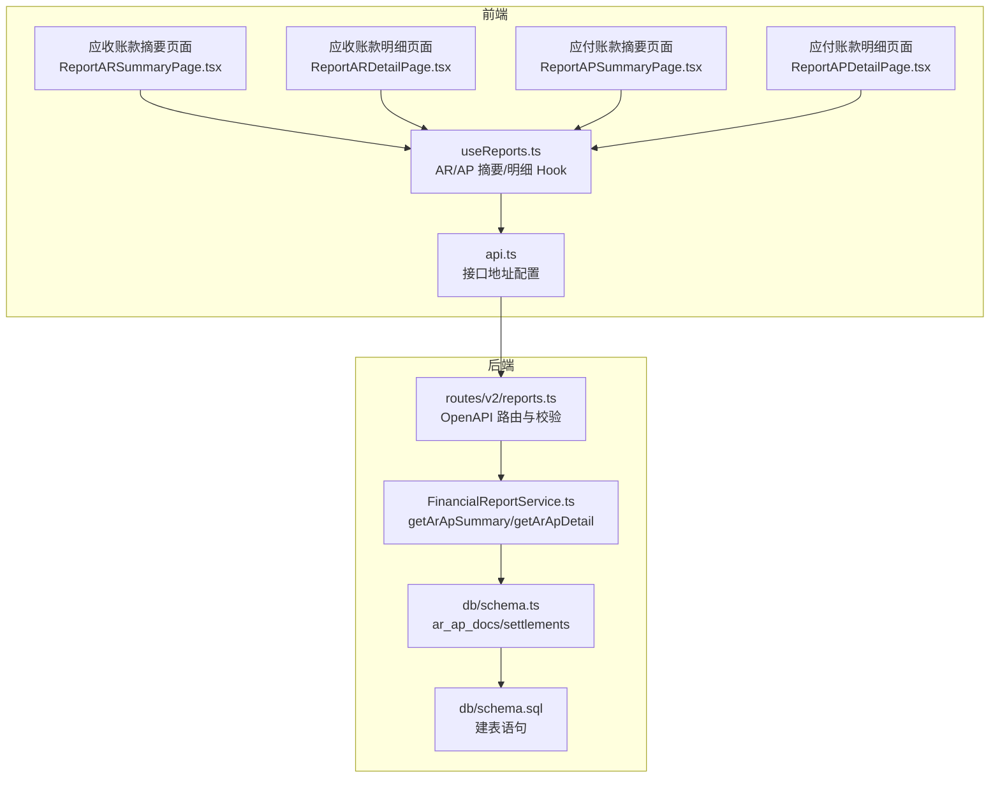
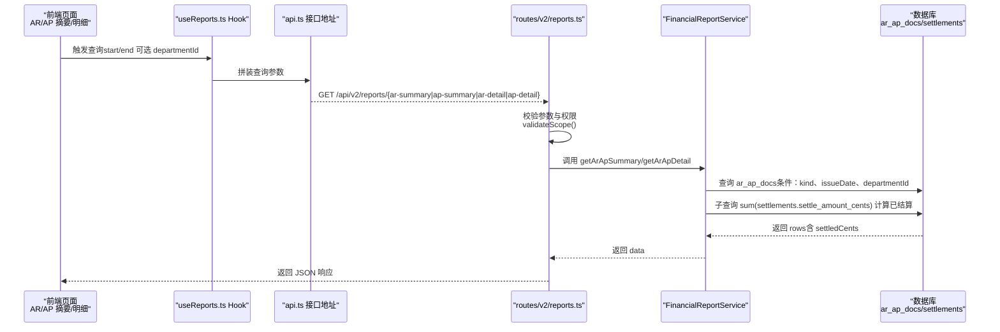
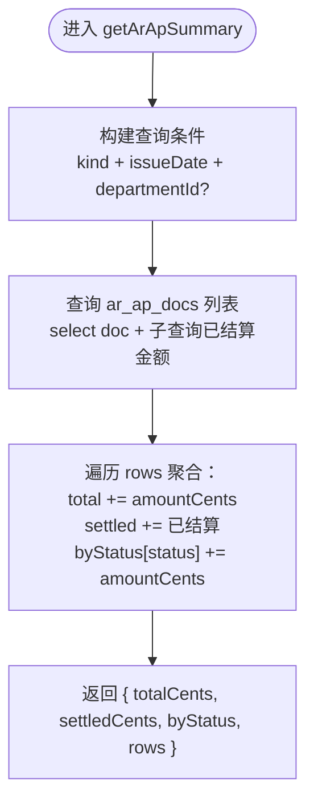
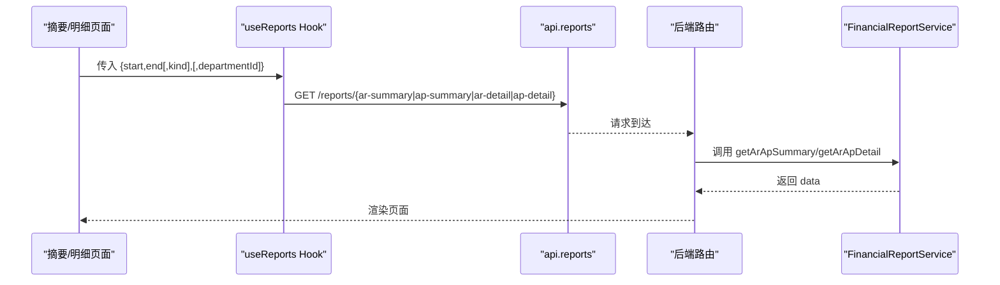
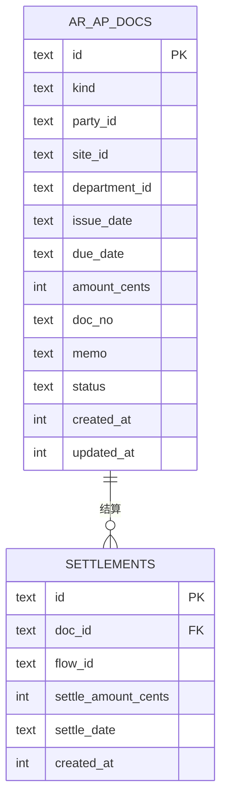
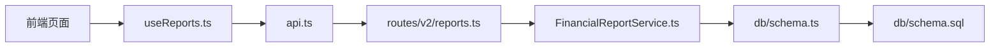

# 应收应付报表

<cite>
**本文引用的文件列表**
- [FinancialReportService.ts](file://backend/src/services/FinancialReportService.ts)
- [reports.ts](file://backend/src/routes/v2/reports.ts)
- [schema.ts](file://backend/src/db/schema.ts)
- [schema.sql](file://backend/src/db/schema.sql)
- [ReportARSummaryPage.tsx](file://frontend/src/features/reports/pages/ReportARSummaryPage.tsx)
- [ReportARDetailPage.tsx](file://frontend/src/features/reports/pages/ReportARDetailPage.tsx)
- [ReportAPSummaryPage.tsx](file://frontend/src/features/reports/pages/ReportAPSummaryPage.tsx)
- [ReportAPDetailPage.tsx](file://frontend/src/features/reports/pages/ReportAPDetailPage.tsx)
- [useReports.ts](file://frontend/src/hooks/business/useReports.ts)
- [api.ts](file://frontend/src/config/api.ts)
- [common.schema.ts](file://backend/src/schemas/common.schema.ts)
- [pagination.ts](file://backend/src/utils/pagination.ts)
</cite>

## 目录
1. [简介](#简介)
2. [项目结构](#项目结构)
3. [核心组件](#核心组件)
4. [架构总览](#架构总览)
5. [详细组件分析](#详细组件分析)
6. [依赖关系分析](#依赖关系分析)
7. [性能考量](#性能考量)
8. [故障排查指南](#故障排查指南)
9. [结论](#结论)
10. [附录](#附录)

## 简介
本文件系统性文档化“应收应付报表”功能，覆盖应收账款（AR）与应付账款（AP）两类报表。重点解析后端服务层 FinancialReportService 的摘要与明细聚合逻辑，尤其是按状态统计与“已结算金额”的子查询实现；结合前端四个页面组件，说明摘要报表的多维度汇总展示与明细报表的逐笔查询实现；并提供完整的 API 参数说明、响应结构示例、分页处理策略，以及如何基于部门进行数据过滤分析的操作指引。

## 项目结构
- 后端路由与服务：
  - 路由：/api/v2/reports 下的 ar-summary、ap-summary、ar-detail、ap-detail 接口
  - 服务：FinancialReportService 提供 getArApSummary 与 getArApDetail 两个方法
  - 数据模型：ar_ap_docs、settlements 等表
- 前端页面与 Hook：
  - 页面：应收账款/应付账款 摘要与明细页面
  - Hook：useARSummary、useAPSummary、useARDetail、useAPDetail
  - API 配置：api.reports 下对应接口地址

图表来源
- [reports.ts](file://backend/src/routes/v2/reports.ts#L230-L396)
- [FinancialReportService.ts](file://backend/src/services/FinancialReportService.ts#L28-L82)
- [schema.ts](file://backend/src/db/schema.ts#L352-L366)
- [schema.sql](file://backend/src/db/schema.sql#L352-L367)
- [ReportARSummaryPage.tsx](file://frontend/src/features/reports/pages/ReportARSummaryPage.tsx#L1-L89)
- [ReportARDetailPage.tsx](file://frontend/src/features/reports/pages/ReportARDetailPage.tsx#L1-L67)
- [ReportAPSummaryPage.tsx](file://frontend/src/features/reports/pages/ReportAPSummaryPage.tsx#L1-L88)
- [ReportAPDetailPage.tsx](file://frontend/src/features/reports/pages/ReportAPDetailPage.tsx#L1-L67)
- [useReports.ts](file://frontend/src/hooks/business/useReports.ts#L32-L147)
- [api.ts](file://frontend/src/config/api.ts#L64-L79)

章节来源
- [reports.ts](file://backend/src/routes/v2/reports.ts#L230-L396)
- [FinancialReportService.ts](file://backend/src/services/FinancialReportService.ts#L28-L82)
- [schema.ts](file://backend/src/db/schema.ts#L352-L366)
- [schema.sql](file://backend/src/db/schema.sql#L352-L367)
- [ReportARSummaryPage.tsx](file://frontend/src/features/reports/pages/ReportARSummaryPage.tsx#L1-L89)
- [ReportARDetailPage.tsx](file://frontend/src/features/reports/pages/ReportARDetailPage.tsx#L1-L67)
- [ReportAPSummaryPage.tsx](file://frontend/src/features/reports/pages/ReportAPSummaryPage.tsx#L1-L88)
- [ReportAPDetailPage.tsx](file://frontend/src/features/reports/pages/ReportAPDetailPage.tsx#L1-L67)
- [useReports.ts](file://frontend/src/hooks/business/useReports.ts#L32-L147)
- [api.ts](file://frontend/src/config/api.ts#L64-L79)

## 核心组件
- 后端服务层 FinancialReportService
  - getArApSummary(kind, start, end, departmentId?)
    - 功能：按 AR/AP 类型、时间范围、可选部门过滤，返回总金额、已结算金额、按状态统计、明细行
    - 关键点：对 ar_ap_docs 行进行遍历聚合；使用子查询计算每笔单据的已结算金额
  - getArApDetail(kind, start, end, departmentId?)
    - 功能：按 AR/AP 类型、时间范围、可选部门过滤，返回明细行（含已结算金额）
- 前端页面与 Hook
  - 摘要页面：展示期间总额、已结、按状态统计与明细表格
  - 明细页面：展示逐笔单据的已结/未结与状态
  - Hook：封装查询参数与请求，自动缓存与去重

章节来源
- [FinancialReportService.ts](file://backend/src/services/FinancialReportService.ts#L28-L82)
- [ReportARSummaryPage.tsx](file://frontend/src/features/reports/pages/ReportARSummaryPage.tsx#L1-L89)
- [ReportARDetailPage.tsx](file://frontend/src/features/reports/pages/ReportARDetailPage.tsx#L1-L67)
- [ReportAPSummaryPage.tsx](file://frontend/src/features/reports/pages/ReportAPSummaryPage.tsx#L1-L88)
- [ReportAPDetailPage.tsx](file://frontend/src/features/reports/pages/ReportAPDetailPage.tsx#L1-L67)
- [useReports.ts](file://frontend/src/hooks/business/useReports.ts#L32-L147)

## 架构总览
后端采用 OpenAPI 路由定义 + 服务层聚合的方式，前端通过 Hook 统一发起请求并渲染页面。部门过滤通过统一的 validateScope 函数在路由层完成权限与范围控制。

图表来源
- [reports.ts](file://backend/src/routes/v2/reports.ts#L230-L396)
- [FinancialReportService.ts](file://backend/src/services/FinancialReportService.ts#L28-L82)
- [useReports.ts](file://frontend/src/hooks/business/useReports.ts#L32-L147)
- [api.ts](file://frontend/src/config/api.ts#L64-L79)

## 详细组件分析

### 后端服务层：FinancialReportService
- getArApSummary
  - 输入：kind（'AR'|'AP'）、start、end、departmentId（可选）
  - 查询条件：ar_ap_docs.kind = kind，issueDate 在 [start, end]，departmentId 可选
  - 聚合逻辑：
    - 总金额：sum(amountCents)
    - 已结算：对每条 ar_ap_docs 执行子查询 sum(settlements.settle_amount_cents) 并累加
    - 按状态统计：按 doc.status 分类累加金额
    - 输出：totalCents、settledCents、byStatus、rows
  - 复杂度：O(n + m)，n 为 ar_ap_docs 笔数，m 为匹配的 settlement 记录数
- getArApDetail
  - 输入：同上
  - 查询：与摘要类似，但仅返回明细行
  - 输出：rows（每行含 settledCents）

图表来源
- [FinancialReportService.ts](file://backend/src/services/FinancialReportService.ts#L28-L82)

章节来源
- [FinancialReportService.ts](file://backend/src/services/FinancialReportService.ts#L28-L82)

### 前端页面与 Hook
- 摘要页面（AR/AP）
  - 展示期间总额、已结、按状态统计与明细表格
  - 通过 useARSummary/useAPSummary 发起请求，参数包含 start、end、kind（AR/AP）
- 明细页面（AR/AP）
  - 展示逐笔单据的已结/未结与状态
  - 通过 useARDetail/useAPDetail 发起请求，参数包含 start、end
- Hook 设计
  - 自动拼接查询参数，启用缓存（staleTime），仅在必要时触发

图表来源
- [ReportARSummaryPage.tsx](file://frontend/src/features/reports/pages/ReportARSummaryPage.tsx#L1-L89)
- [ReportARDetailPage.tsx](file://frontend/src/features/reports/pages/ReportARDetailPage.tsx#L1-L67)
- [ReportAPSummaryPage.tsx](file://frontend/src/features/reports/pages/ReportAPSummaryPage.tsx#L1-L88)
- [ReportAPDetailPage.tsx](file://frontend/src/features/reports/pages/ReportAPDetailPage.tsx#L1-L67)
- [useReports.ts](file://frontend/src/hooks/business/useReports.ts#L32-L147)
- [api.ts](file://frontend/src/config/api.ts#L64-L79)

章节来源
- [ReportARSummaryPage.tsx](file://frontend/src/features/reports/pages/ReportARSummaryPage.tsx#L1-L89)
- [ReportARDetailPage.tsx](file://frontend/src/features/reports/pages/ReportARDetailPage.tsx#L1-L67)
- [ReportAPSummaryPage.tsx](file://frontend/src/features/reports/pages/ReportAPSummaryPage.tsx#L1-L88)
- [ReportAPDetailPage.tsx](file://frontend/src/features/reports/pages/ReportAPDetailPage.tsx#L1-L67)
- [useReports.ts](file://frontend/src/hooks/business/useReports.ts#L32-L147)
- [api.ts](file://frontend/src/config/api.ts#L64-L79)

### 数据模型与关系
- ar_ap_docs：AR/AP 单据主表，包含 kind、partyId、issueDate、dueDate、amountCents、status、departmentId 等
- settlements：结算记录表，记录每笔 AR/AP 的结算金额与结算日期
- 两者通过 doc_id 关联，用于计算每笔 AR/AP 的已结算金额

图表来源
- [schema.ts](file://backend/src/db/schema.ts#L352-L366)
- [schema.sql](file://backend/src/db/schema.sql#L352-L367)

章节来源
- [schema.ts](file://backend/src/db/schema.ts#L352-L366)
- [schema.sql](file://backend/src/db/schema.sql#L352-L367)

### API 参数与响应说明
- 路由与权限
  - /api/v2/reports/ar-summary
  - /api/v2/reports/ap-summary
  - /api/v2/reports/ar-detail
  - /api/v2/reports/ap-detail
  - 权限：需要 report.finance.view 或 report.hr.view 权限
- 参数
  - start: YYYY-MM-DD（必填）
  - end: YYYY-MM-DD（必填）
  - departmentId: UUID（可选，路由层会做范围校验）
  - kind: AR/AP（摘要接口中 kind 作为查询参数传入，服务层固定为 AR/AP）
- 响应结构（摘要）
  - data.totalCents: 数字
  - data.settledCents: 数字
  - data.byStatus: 对象，键为状态值，值为金额
  - data.rows: 数组，每项包含 docNo、issueDate、dueDate、partyId、amountCents、settledCents、status 等
- 响应结构（明细）
  - data.rows: 数组，每项包含 docNo、issueDate、dueDate、partyId、amountCents、settledCents、status、memo 等

章节来源
- [reports.ts](file://backend/src/routes/v2/reports.ts#L230-L396)
- [common.schema.ts](file://backend/src/schemas/common.schema.ts#L60-L84)
- [useReports.ts](file://frontend/src/hooks/business/useReports.ts#L32-L147)

### 分页处理策略
- 当前 AR/AP 报表接口未实现分页参数（page/pageSize/limit/offset），前端 Hook 也未传递分页参数
- 若未来需要分页，建议：
  - 后端：在路由层增加分页参数校验与 getPagination 计算
  - 前端：在 Hook 中支持 page/pageSize，并在页面中集成虚拟滚动或分页控件
- 当前实现特点：以时间范围与部门过滤为主，适合中小规模数据量场景

章节来源
- [reports.ts](file://backend/src/routes/v2/reports.ts#L230-L396)
- [pagination.ts](file://backend/src/utils/pagination.ts#L1-L35)
- [useReports.ts](file://frontend/src/hooks/business/useReports.ts#L32-L147)

### 部门过滤与权限控制
- 路由层统一校验：validateScope
  - 总部（level=1）：可访问任意部门数据
  - 项目/团队（level≥2）：仅能访问自身部门，若请求其他部门则拒绝
- 前端调用建议：
  - 不显式传 departmentId，让后端根据当前用户身份自动判定
  - 如需跨部门查看，需具备总部权限

章节来源
- [reports.ts](file://backend/src/routes/v2/reports.ts#L19-L66)

## 依赖关系分析
- 前端依赖
  - 页面组件依赖 Hook 与 API 配置
  - Hook 依赖 api.reports 下的具体接口地址
- 后端依赖
  - 路由依赖 OpenAPI 校验与权限校验
  - 服务层依赖数据库 schema（ar_ap_docs、settlements）
- 数据依赖
  - AR/AP 明细依赖结算记录表进行已结算金额计算

图表来源
- [useReports.ts](file://frontend/src/hooks/business/useReports.ts#L32-L147)
- [api.ts](file://frontend/src/config/api.ts#L64-L79)
- [reports.ts](file://backend/src/routes/v2/reports.ts#L230-L396)
- [FinancialReportService.ts](file://backend/src/services/FinancialReportService.ts#L28-L82)
- [schema.ts](file://backend/src/db/schema.ts#L352-L366)
- [schema.sql](file://backend/src/db/schema.sql#L352-L367)

章节来源
- [useReports.ts](file://frontend/src/hooks/business/useReports.ts#L32-L147)
- [api.ts](file://frontend/src/config/api.ts#L64-L79)
- [reports.ts](file://backend/src/routes/v2/reports.ts#L230-L396)
- [FinancialReportService.ts](file://backend/src/services/FinancialReportService.ts#L28-L82)
- [schema.ts](file://backend/src/db/schema.ts#L352-L366)
- [schema.sql](file://backend/src/db/schema.sql#L352-L367)

## 性能考量
- 子查询开销：getArApSummary/getArApDetail 对每条 AR/AP 单据执行一次子查询计算已结算金额，复杂度 O(n+m)。建议：
  - 为 settlements.doc_id 建立索引（如存在）
  - 控制时间范围，避免超大范围扫描
  - 对 ar_ap_docs.issueDate、departmentId 建立合适索引
- 缓存策略：当前摘要/明细接口未内置缓存，建议：
  - 对固定时间范围的摘要结果进行短期缓存（如 2-5 分钟）
  - 明细接口默认开启缓存，避免频繁重复查询
- 分页扩展：当数据量增大时，建议引入分页参数与服务端分页

[本节为通用建议，无需特定文件引用]

## 故障排查指南
- 权限错误
  - 现象：返回 403 Forbidden
  - 原因：非总部用户请求了其他部门数据
  - 处理：确认用户所属部门，或提升权限级别
- 参数错误
  - 现象：返回 400 Bad Request
  - 原因：start/end 格式不正确或 end 早于 start
  - 处理：检查日期格式与范围
- 数据为空
  - 现象：rows 为空
  - 原因：时间范围或部门过滤条件过于严格
  - 处理：扩大时间范围或移除部门过滤

章节来源
- [reports.ts](file://backend/src/routes/v2/reports.ts#L19-L66)
- [common.schema.ts](file://backend/src/schemas/common.schema.ts#L60-L84)

## 结论
应收应付报表通过后端服务层的子查询聚合与前端 Hook 的统一请求封装，实现了 AR/AP 的摘要与明细展示。摘要报表提供多维度统计（总额、已结、按状态），明细报表提供逐笔查询能力。当前接口未实现分页，建议后续引入分页参数与缓存优化；同时保持严格的部门过滤与权限控制，确保数据安全与合规。

[本节为总结，无需特定文件引用]

## 附录

### API 定义与示例
- 摘要接口
  - GET /api/v2/reports/ar-summary
  - GET /api/v2/reports/ap-summary
  - 参数：start、end、departmentId（可选）
  - 响应：data.totalCents、data.settledCents、data.byStatus、data.rows
- 明细接口
  - GET /api/v2/reports/ar-detail
  - GET /api/v2/reports/ap-detail
  - 参数：start、end、departmentId（可选）
  - 响应：data.rows（含已结/未结金额）

章节来源
- [reports.ts](file://backend/src/routes/v2/reports.ts#L230-L396)
- [useReports.ts](file://frontend/src/hooks/business/useReports.ts#L32-L147)