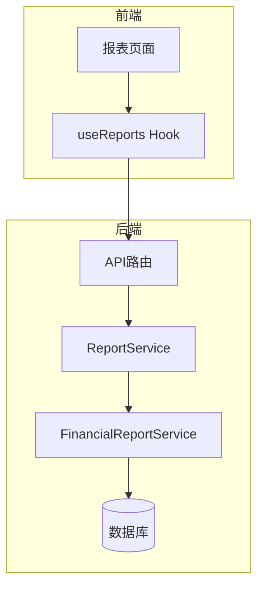
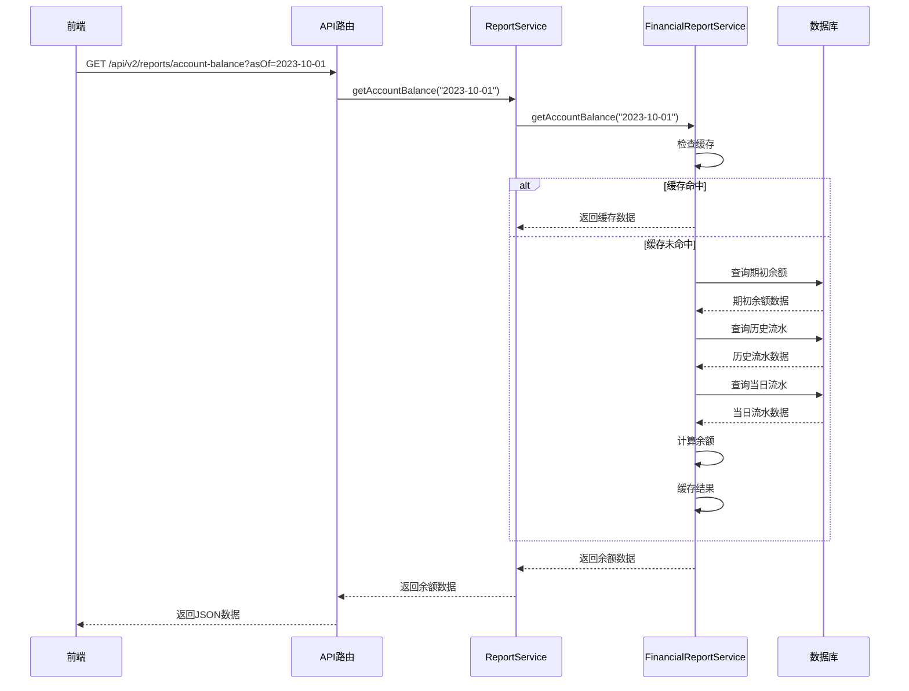
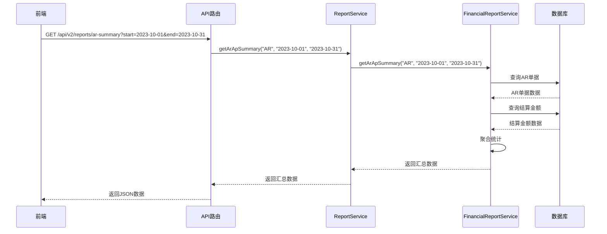
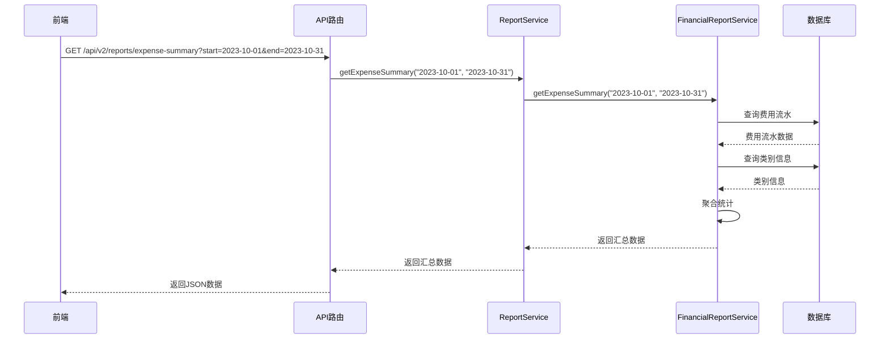
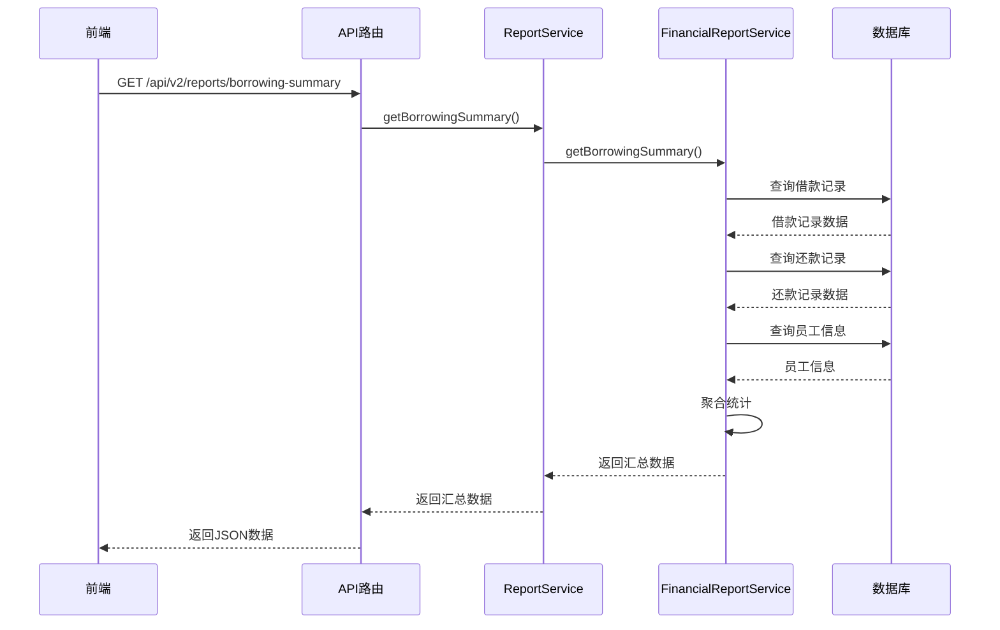
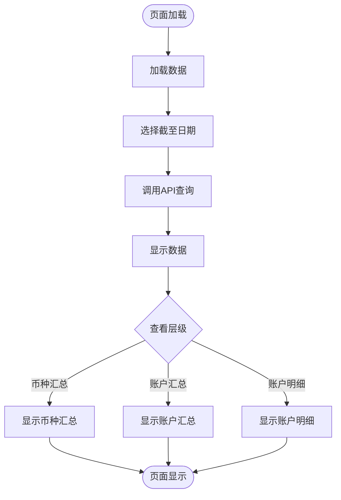
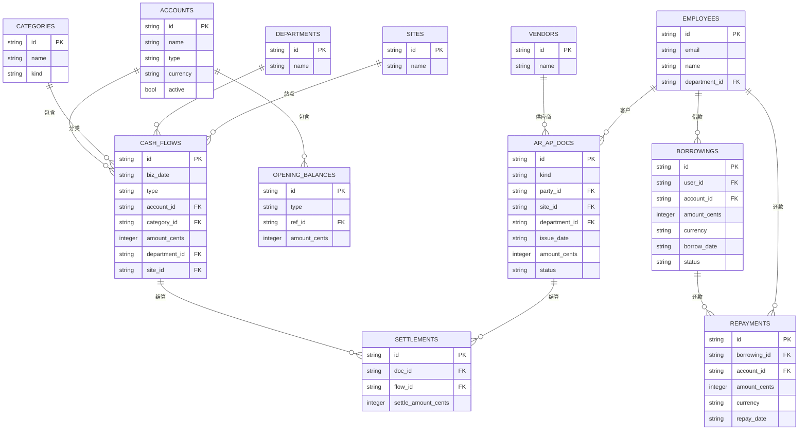

# 财务报表

<cite>
**本文档引用的文件**   
- [FinancialReportService.ts](file://backend/src/services/FinancialReportService.ts)
- [reports.ts](file://backend/src/routes/v2/reports.ts)
- [ReportAccountBalancePage.tsx](file://frontend/src/features/reports/pages/ReportAccountBalancePage.tsx)
- [ReportARDetailPage.tsx](file://frontend/src/features/reports/pages/ReportARDetailPage.tsx)
- [ReportAPDetailPage.tsx](file://frontend/src/features/reports/pages/ReportAPDetailPage.tsx)
- [ReportBorrowingPage.tsx](file://frontend/src/features/reports/pages/ReportBorrowingPage.tsx)
- [useReports.ts](file://frontend/src/hooks/business/useReports.ts)
- [schema.ts](file://backend/src/db/schema.ts)
- [api.ts](file://frontend/src/config/api.ts)
- [export.ts](file://backend/src/utils/export.ts)
</cite>

## 目录
1. [引言](#引言)
2. [项目结构](#项目结构)
3. [核心组件](#核心组件)
4. [架构概述](#架构概述)
5. [详细组件分析](#详细组件分析)
6. [依赖分析](#依赖分析)
7. [性能考虑](#性能考虑)
8. [故障排除指南](#故障排除指南)
9. [结论](#结论)
10. [附录](#附录) (如有必要)

## 引言
本文档旨在全面阐述财务报表模块的设计与实现，涵盖账户余额、应收应付、费用和借款等核心财务报表。通过深入分析`FinancialReportService`中的查询逻辑、数据聚合方法和业务规则，详细说明各类报表的计算方式。同时，结合前端各报表页面的功能，说明用户如何进行数据筛选、导出和可视化分析，并提供相关API的调用示例和性能调优建议。

## 项目结构
财务报表模块的代码分布在后端服务和前端应用中。后端主要位于`backend/src/services/FinancialReportService.ts`和`backend/src/routes/v2/reports.ts`，负责报表数据的查询和聚合。前端页面位于`frontend/src/features/reports/pages/`目录下，提供用户交互界面。数据模型定义在`backend/src/db/schema.ts`中。

**Section sources**
- [FinancialReportService.ts](file://backend/src/services/FinancialReportService.ts#L1-L374)
- [reports.ts](file://backend/src/routes/v2/reports.ts#L1-L834)

## 核心组件
财务报表模块的核心是`FinancialReportService`类，它提供了多种报表的查询方法，包括应收应付汇总与明细、费用汇总与明细、账户余额和借款报表。这些方法通过Drizzle ORM与数据库交互，执行复杂的SQL查询来聚合数据。

**Section sources**
- [FinancialReportService.ts](file://backend/src/services/FinancialReportService.ts#L22-L374)

## 架构概述
财务报表模块采用分层架构，前端通过API调用后端服务，后端服务查询数据库并返回数据。`ReportService`作为门面模式，将报表请求委托给具体的报表服务类，如`FinancialReportService`。



**Diagram sources **
- [reports.ts](file://backend/src/routes/v2/reports.ts#L48-L833)
- [FinancialReportService.ts](file://backend/src/services/FinancialReportService.ts#L22-L374)
- [useReports.ts](file://frontend/src/hooks/business/useReports.ts#L1-L478)

## 详细组件分析

### 账户余额报表分析
账户余额报表提供账户在指定日期的时点快照，包括期初余额、当日收入、当日支出和期末余额。报表数据通过缓存机制提高性能，避免重复计算。

#### 账户余额报表类图
```mermaid
classDiagram
class FinancialReportService {
+getAccountBalance(asOf : string) : Promise<{ rows : any[]; asOf : string }>
}
class ReportService {
+getAccountBalance(asOf : string) : Promise<{ rows : any[]; asOf : string }>
}
FinancialReportService --> ReportService : "委托"
```

**Diagram sources **
- [FinancialReportService.ts](file://backend/src/services/FinancialReportService.ts#L165-L274)
- [ReportService.ts](file://backend/src/services/ReportService.ts#L56-L58)

#### 账户余额报表查询流程


**Diagram sources **
- [reports.ts](file://backend/src/routes/v2/reports.ts#L479-L515)
- [FinancialReportService.ts](file://backend/src/services/FinancialReportService.ts#L165-L274)

### 应收应付报表分析
应收应付报表提供应收账款（AR）和应付账款（AP）的汇总与明细查询。汇总报表按状态分组统计金额，明细报表列出每笔单据的详细信息。

#### 应收应付报表查询流程


**Diagram sources **
- [reports.ts](file://backend/src/routes/v2/reports.ts#L230-L317)
- [FinancialReportService.ts](file://backend/src/services/FinancialReportService.ts#L28-L60)

### 费用报表分析
费用报表提供费用的分类统计和明细查询。汇总报表按费用类别分组统计金额和笔数，明细报表列出每笔费用的详细信息。

#### 费用报表查询流程


**Diagram sources **
- [reports.ts](file://backend/src/routes/v2/reports.ts#L398-L436)
- [FinancialReportService.ts](file://backend/src/services/FinancialReportService.ts#L84-L120)

### 借款报表分析
借款报表提供借款的汇总与明细查询。汇总报表按借款人分组统计借款总额、还款总额和余额，明细报表列出每笔借款和还款的详细信息。

#### 借款报表查询流程


**Diagram sources **
- [reports.ts](file://backend/src/routes/v2/reports.ts#L517-L556)
- [FinancialReportService.ts](file://backend/src/services/FinancialReportService.ts#L276-L312)

### 前端报表页面分析
前端报表页面使用React和Ant Design构建，通过`useReports` Hook获取报表数据，并提供数据筛选、导出和可视化分析功能。

#### 账户余额报表页面流程


**Diagram sources **
- [ReportAccountBalancePage.tsx](file://frontend/src/features/reports/pages/ReportAccountBalancePage.tsx#L1-L384)

## 依赖分析
财务报表模块依赖于多个后端服务和数据库表。`FinancialReportService`依赖于`DrizzleD1Database`和`KVNamespace`，通过`schema.ts`定义的表结构与数据库交互。



**Diagram sources **
- [schema.ts](file://backend/src/db/schema.ts#L1-L706)

## 性能考虑
财务报表模块通过多种方式优化性能，包括使用数据库索引、缓存机制和分页查询。`FinancialReportService`中的方法使用KV命名空间缓存结果，避免重复计算。

**Section sources**
- [FinancialReportService.ts](file://backend/src/services/FinancialReportService.ts#L166-L274)
- [schema.sql](file://backend/src/db/schema.sql#L314-L330)

## 故障排除指南
当财务报表模块出现问题时，可以检查以下方面：
1. 确认数据库连接正常
2. 检查API路由是否正确
3. 验证缓存配置
4. 查看日志输出

**Section sources**
- [FinancialReportService.ts](file://backend/src/services/FinancialReportService.ts#L173-L175)
- [DashboardReportService.ts](file://backend/src/services/DashboardReportService.ts#L187-L190)

## 结论
财务报表模块通过`FinancialReportService`提供了全面的财务报表功能，包括账户余额、应收应付、费用和借款等。模块采用分层架构，前后端分离，通过API进行通信。通过缓存和数据库索引优化性能，确保报表查询的高效性。