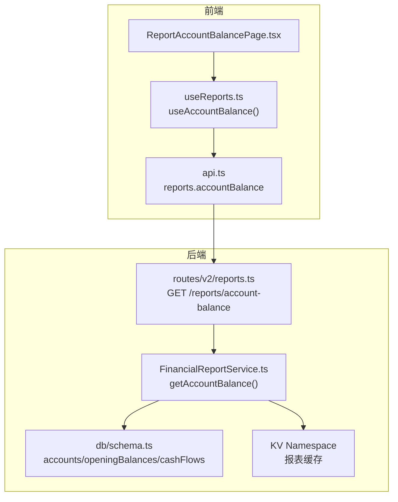
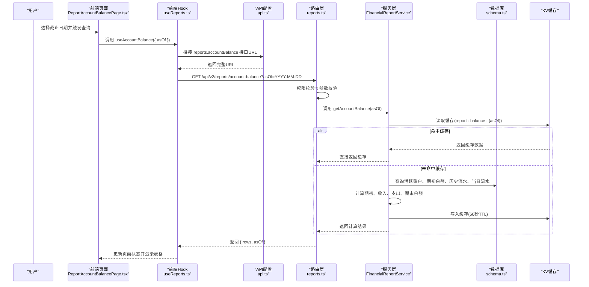
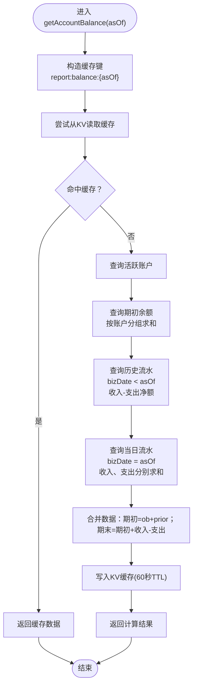
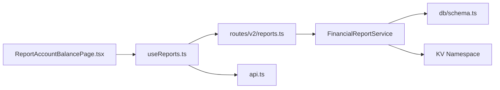

# 账户余额报表

<cite>
**本文引用的文件**
- [FinancialReportService.ts](file://backend/src/services/FinancialReportService.ts)
- [reports.ts](file://backend/src/routes/v2/reports.ts)
- [common.schema.ts](file://backend/src/schemas/common.schema.ts)
- [ReportAccountBalancePage.tsx](file://frontend/src/features/reports/pages/ReportAccountBalancePage.tsx)
- [useReports.ts](file://frontend/src/hooks/business/useReports.ts)
- [api.ts](file://frontend/src/config/api.ts)
- [schema.ts](file://backend/src/db/schema.ts)
- [index.ts](file://backend/src/index.ts)
- [query-cache.ts](file://backend/src/utils/query-cache.ts)
</cite>

## 目录
1. [简介](#简介)
2. [项目结构](#项目结构)
3. [核心组件](#核心组件)
4. [架构总览](#架构总览)
5. [详细组件分析](#详细组件分析)
6. [依赖关系分析](#依赖关系分析)
7. [性能考量](#性能考量)
8. [故障排查指南](#故障排查指南)
9. [结论](#结论)
10. [附录](#附录)

## 简介
本文件围绕“账户余额报表”功能，系统性说明后端服务方法与前端页面的协作方式，重点解析 FinancialReportService.getAccountBalance 的实现逻辑，阐述期初余额、历史流水与当日流水的计算过程，并解释 KV 缓存机制对报表性能的优化作用。同时给出前端请求流程、响应数据处理与表格展示方式，提供 API 调用示例、常见问题排查方法以及大规模账户数据下的性能调优建议。

## 项目结构
该功能横跨后端服务层与前端页面层：
- 后端：路由层负责鉴权与参数校验，服务层执行报表计算，数据库层提供数据模型。
- 前端：页面组件负责交互与展示，Hooks 负责请求与缓存策略，API 配置提供接口地址。

图表来源
- [ReportAccountBalancePage.tsx](file://frontend/src/features/reports/pages/ReportAccountBalancePage.tsx#L52-L66)
- [useReports.ts](file://frontend/src/hooks/business/useReports.ts#L354-L366)
- [api.ts](file://frontend/src/config/api.ts#L64-L79)
- [reports.ts](file://backend/src/routes/v2/reports.ts#L479-L515)
- [FinancialReportService.ts](file://backend/src/services/FinancialReportService.ts#L165-L274)
- [schema.ts](file://backend/src/db/schema.ts#L139-L188)

章节来源
- [ReportAccountBalancePage.tsx](file://frontend/src/features/reports/pages/ReportAccountBalancePage.tsx#L52-L66)
- [useReports.ts](file://frontend/src/hooks/business/useReports.ts#L354-L366)
- [api.ts](file://frontend/src/config/api.ts#L64-L79)
- [reports.ts](file://backend/src/routes/v2/reports.ts#L479-L515)
- [FinancialReportService.ts](file://backend/src/services/FinancialReportService.ts#L165-L274)
- [schema.ts](file://backend/src/db/schema.ts#L139-L188)

## 核心组件
- 后端服务层：FinancialReportService.getAccountBalance 负责计算账户余额报表的核心逻辑。
- 路由层：reports.ts 中的 GET /reports/account-balance 接口，进行权限校验与参数校验，并调用服务层。
- 前端页面：ReportAccountBalancePage.tsx 展示币种汇总、账户汇总与账户明细三视图；useReports.ts 提供 useAccountBalance Hook 发起请求。
- 数据模型：db/schema.ts 定义 accounts、openingBalances、cashFlows 等表结构，支撑余额计算。
- 缓存：KV 缓存用于短期缓存报表结果，提升重复查询性能。

章节来源
- [FinancialReportService.ts](file://backend/src/services/FinancialReportService.ts#L165-L274)
- [reports.ts](file://backend/src/routes/v2/reports.ts#L479-L515)
- [ReportAccountBalancePage.tsx](file://frontend/src/features/reports/pages/ReportAccountBalancePage.tsx#L1-L384)
- [useReports.ts](file://frontend/src/hooks/business/useReports.ts#L327-L366)
- [schema.ts](file://backend/src/db/schema.ts#L139-L188)

## 架构总览
下图展示了从前端到后端的完整调用链路与数据流向：

图表来源
- [ReportAccountBalancePage.tsx](file://frontend/src/features/reports/pages/ReportAccountBalancePage.tsx#L52-L66)
- [useReports.ts](file://frontend/src/hooks/business/useReports.ts#L354-L366)
- [api.ts](file://frontend/src/config/api.ts#L64-L79)
- [reports.ts](file://backend/src/routes/v2/reports.ts#L479-L515)
- [FinancialReportService.ts](file://backend/src/services/FinancialReportService.ts#L165-L274)
- [schema.ts](file://backend/src/db/schema.ts#L139-L188)

## 详细组件分析

### 后端服务：FinancialReportService.getAccountBalance
该方法通过三个阶段的数据库查询与一次 KV 缓存读写，完成账户余额报表的计算与缓存。

- 步骤概览
  1) 读取活跃账户清单
  2) 计算期初余额（期初余额合计）
  3) 计算历史净额（bizDate < asOf 的收入-支出）
  4) 计算当日发生额（bizDate = asOf 的收入、支出）
  5) 合并结果：期初 = 期初余额 + 历史净额；期末 = 期初 + 当日收入 - 当日支出
  6) KV 缓存写入（60秒TTL）

- 关键点说明
  - 期初余额：从 openingBalances 表按账户分组求和，仅统计账户维度的期初余额。
  - 历史流水：bizDate < asOf 的流水，按账户分组计算收入与支出的差额。
  - 当日流水：bizDate = asOf 的流水，按账户分组分别统计收入与支出。
  - 过滤条件：排除被冲正的流水（isReversal 为空或 0）。
  - 结果合并：对每个账户，期初 = ob + prior；期末 = 期初 + income - expense。
  - 缓存键：report:balance:{asOf}；写入 TTL 60 秒；读取失败会降级为直连数据库。

- 性能与一致性
  - 通过 KV 缓存显著降低重复查询的数据库压力。
  - 若 KV 读取失败，服务层会记录告警并继续执行数据库查询，保证可用性。
  - 写入 KV 失败同样会记录告警，不影响主流程。

章节来源
- [FinancialReportService.ts](file://backend/src/services/FinancialReportService.ts#L165-L274)

#### 方法实现流程图

图表来源
- [FinancialReportService.ts](file://backend/src/services/FinancialReportService.ts#L165-L274)

### 路由层：reports.ts 的 /reports/account-balance
- 权限控制：要求 report.finance.view 权限。
- 参数校验：单日期参数 asOf，格式为 YYYY-MM-DD。
- 调用服务：直接调用 reportService.getAccountBalance(asOf)，并将结果返回给前端。

章节来源
- [reports.ts](file://backend/src/routes/v2/reports.ts#L479-L515)
- [common.schema.ts](file://backend/src/schemas/common.schema.ts#L70-L76)

### 前端页面：ReportAccountBalancePage.tsx
- 交互逻辑
  - 顶部日期选择器，默认当天；点击查询按钮刷新数据。
  - 三视图切换：币种汇总 -> 账户汇总 -> 账户明细。
  - 支持凭证预览弹窗。
- 数据处理
  - useAccountBalance({ asOf }) 返回 rows 与 asOf。
  - 币种汇总：按币种聚合期初、收入、支出、期末与账户数量。
  - 账户汇总：按币种筛选后展示各账户的期初、收入、支出、期末。
  - 明细：按账户筛选后展示当日流水明细（含余额前后、摘要等）。
- 渲染表格
  - 使用 DataTable 组件，按列宽与对齐方式展示金额与文本。
  - 金额显示使用 AmountDisplay 组件，自动按币种格式化。

章节来源
- [ReportAccountBalancePage.tsx](file://frontend/src/features/reports/pages/ReportAccountBalancePage.tsx#L1-L384)
- [useReports.ts](file://frontend/src/hooks/business/useReports.ts#L327-L366)
- [api.ts](file://frontend/src/config/api.ts#L64-L79)

### 前端 Hook：useReports.ts 的 useAccountBalance
- 请求参数：asOf=YYYY-MM-DD。
- 缓存策略：staleTime=2分钟，避免频繁重复请求。
- 返回类型：AccountBalanceResponse.rows 包含账户级与明细级字段。

章节来源
- [useReports.ts](file://frontend/src/hooks/business/useReports.ts#L327-L366)

### 数据模型：db/schema.ts
- accounts：账户基本信息（名称、类型、币种、账号等）。
- openingBalances：账户维度的期初余额记录。
- cashFlows：现金流水，包含业务日期、账户、收支类型、金额、凭证等字段，并支持冲正标记。

章节来源
- [schema.ts](file://backend/src/db/schema.ts#L139-L188)

## 依赖关系分析
- 服务层依赖
  - 数据库：accounts、openingBalances、cashFlows。
  - KV：用于报表结果缓存。
- 路由层依赖
  - 权限校验与参数校验（singleDateQuerySchema）。
- 前端依赖
  - API 配置 reports.accountBalance。
  - useAccountBalance Hook。
  - 页面组件 DataTable、AmountDisplay 等。

图表来源
- [FinancialReportService.ts](file://backend/src/services/FinancialReportService.ts#L165-L274)
- [reports.ts](file://backend/src/routes/v2/reports.ts#L479-L515)
- [useReports.ts](file://frontend/src/hooks/business/useReports.ts#L354-L366)
- [api.ts](file://frontend/src/config/api.ts#L64-L79)
- [schema.ts](file://backend/src/db/schema.ts#L139-L188)

章节来源
- [FinancialReportService.ts](file://backend/src/services/FinancialReportService.ts#L165-L274)
- [reports.ts](file://backend/src/routes/v2/reports.ts#L479-L515)
- [useReports.ts](file://frontend/src/hooks/business/useReports.ts#L354-L366)
- [api.ts](file://frontend/src/config/api.ts#L64-L79)
- [schema.ts](file://backend/src/db/schema.ts#L139-L188)

## 性能考量
- KV 缓存
  - 服务层在 getAccountBalance 中优先读取 KV，命中则直接返回，显著降低数据库压力。
  - 写入 KV 的 TTL 为 60 秒，适合报表这种允许一定延迟的场景。
  - KV 读写异常会被捕获并记录告警，不影响主流程。
- 数据库索引与查询
  - cashFlows 表具备按 accountId+bizDate 的复合索引，有利于历史与当日流水查询。
  - 查询中使用分组与条件过滤，避免全表扫描。
- 前端缓存
  - useAccountBalance 的 staleTime=2分钟，减少重复请求。
  - 页面渲染采用虚拟表格与分页（明细页），避免一次性渲染大量行。
- 大规模账户数据下的建议
  - 合理设置 asOf 日期，避免跨长周期导致的计算量增大。
  - 前端分页与懒加载（明细页已内置分页）。
  - 如需更高并发，可在网关或边缘层增加缓存层（例如基于 Cache API 的边缘缓存）。
  - 对 KV 写入失败的场景，可考虑降级策略（如记录错误并继续返回数据库结果）。

章节来源
- [FinancialReportService.ts](file://backend/src/services/FinancialReportService.ts#L165-L274)
- [query-cache.ts](file://backend/src/utils/query-cache.ts#L1-L155)
- [schema.ts](file://backend/src/db/schema.ts#L183-L188)
- [ReportAccountBalancePage.tsx](file://frontend/src/features/reports/pages/ReportAccountBalancePage.tsx#L310-L373)

## 故障排查指南
- 前端无法获取数据
  - 检查日期参数格式是否为 YYYY-MM-DD。
  - 确认用户具备 report.finance.view 权限。
  - 查看浏览器网络面板，确认请求 URL 与状态码。
- 报表数据不一致
  - 冲正流水：服务层已过滤 isReversal 为空或 0 的记录，确保不重复计入。
  - 期初余额：确认 openingBalances 中是否存在账户维度的期初余额记录。
  - 历史与当日数据：检查 bizDate 字段是否正确，避免跨天或跨月导致的错配。
- KV 缓存异常
  - 服务层会记录 KV 读写失败的日志，可在日志中定位具体错误。
  - 若 KV 不可用，服务层会回退到数据库查询，确保功能可用。
- 边缘健康检查
  - 后端健康检查会检测 DB、KV、R2 的可用性，若某项异常，需优先修复对应基础设施。

章节来源
- [reports.ts](file://backend/src/routes/v2/reports.ts#L479-L515)
- [FinancialReportService.ts](file://backend/src/services/FinancialReportService.ts#L165-L274)
- [index.ts](file://backend/src/index.ts#L108-L152)

## 结论
账户余额报表通过“期初余额 + 历史净额”的方式计算期初，再叠加当日收入与支出得到期末余额。服务层在 KV 上做短期缓存，显著提升了重复查询的性能与稳定性。前端页面提供多层级视图与明细展示，配合 Hook 的缓存策略，形成完整的报表体验。针对大规模账户数据，建议结合边缘缓存与合理的查询范围，持续优化性能与一致性。

## 附录

### API 调用示例
- 请求
  - 方法：GET
  - 路径：/api/v2/reports/account-balance?asOf=YYYY-MM-DD
  - 权限：report.finance.view
- 响应
  - 结构：success: boolean, data: { rows: any[], asOf: string }
  - rows 字段包含账户级与明细级字段（详见前端 Hook 类型 AccountBalanceResponse）

章节来源
- [reports.ts](file://backend/src/routes/v2/reports.ts#L479-L515)
- [useReports.ts](file://frontend/src/hooks/business/useReports.ts#L327-L366)
- [api.ts](file://frontend/src/config/api.ts#L64-L79)