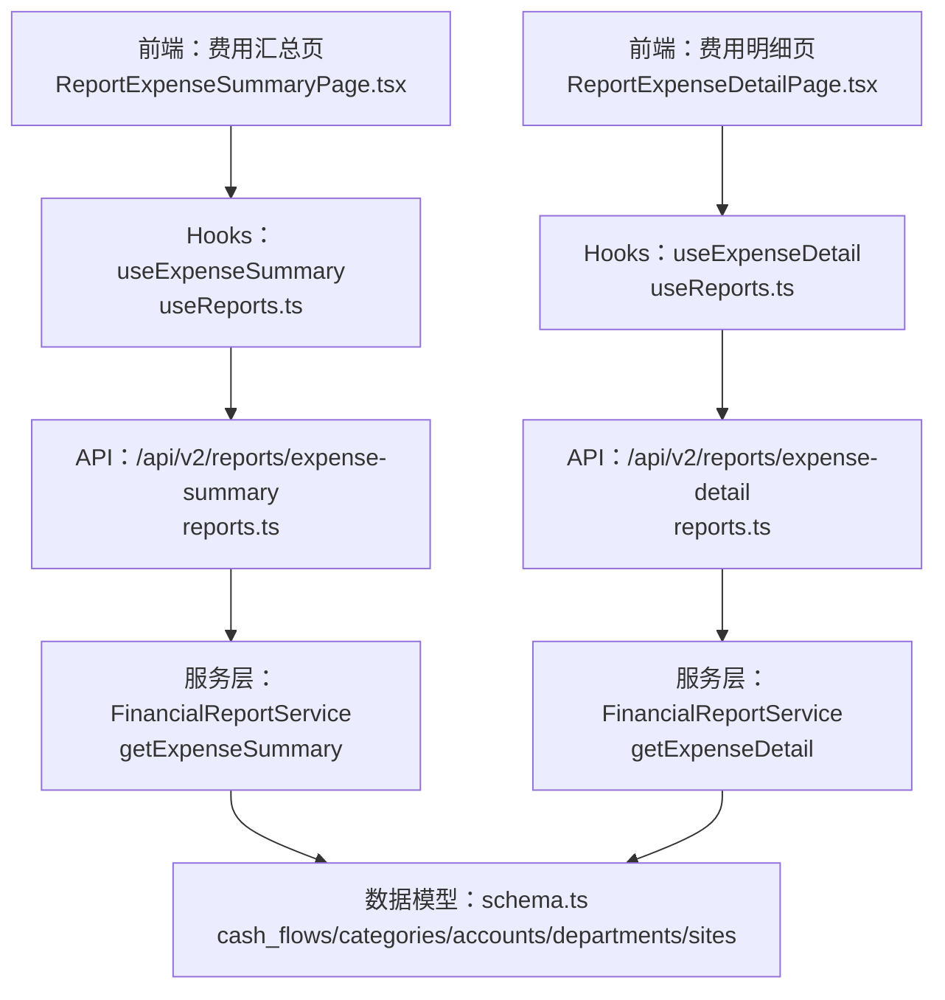
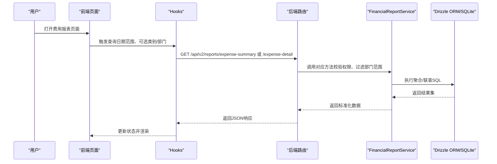
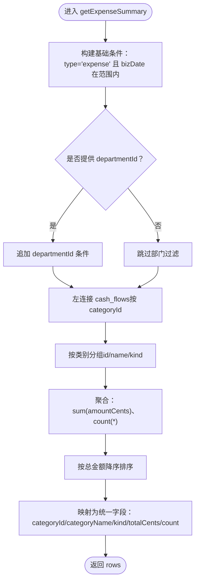
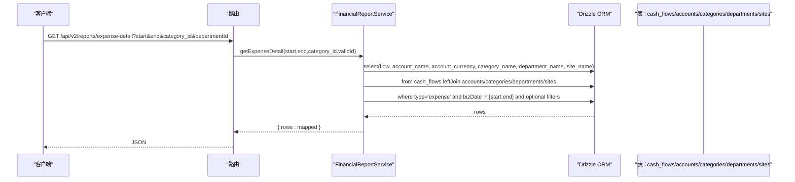
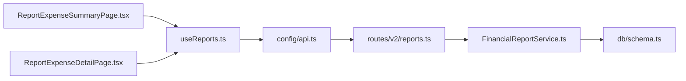

# 费用报表

<cite>
**本文引用的文件列表**
- [backend/src/services/FinancialReportService.ts](file://backend/src/services/FinancialReportService.ts)
- [backend/src/routes/v2/reports.ts](file://backend/src/routes/v2/reports.ts)
- [backend/src/db/schema.ts](file://backend/src/db/schema.ts)
- [frontend/src/features/reports/pages/ReportExpenseSummaryPage.tsx](file://frontend/src/features/reports/pages/ReportExpenseSummaryPage.tsx)
- [frontend/src/features/reports/pages/ReportExpenseDetailPage.tsx](file://frontend/src/features/reports/pages/ReportExpenseDetailPage.tsx)
- [frontend/src/hooks/business/useReports.ts](file://frontend/src/hooks/business/useReports.ts)
- [frontend/src/config/api.ts](file://frontend/src/config/api.ts)
</cite>

## 目录
1. [简介](#简介)
2. [项目结构与入口](#项目结构与入口)
3. [核心组件](#核心组件)
4. [架构总览](#架构总览)
5. [详细组件分析](#详细组件分析)
6. [依赖关系分析](#依赖关系分析)
7. [性能考量与优化建议](#性能考量与优化建议)
8. [故障排查指南](#故障排查指南)
9. [结论](#结论)

## 简介
本文件面向“费用报表”功能，系统性梳理后端服务层与前端页面的协作方式，重点围绕以下目标：
- 详述 FinancialReportService 中 getExpenseSummary 与 getExpenseDetail 的实现细节
- 解释摘要报表按费用类别分组统计的聚合逻辑（总金额与交易笔数）
- 解释明细报表的多表关联查询逻辑（账户、类别、部门、站点等维度）
- 结合前端页面说明用户如何进行类别与部门筛选
- 提供大数据量下的性能优化建议与查询超时处理策略

## 项目结构与入口
- 后端服务层位于 backend/src/services/FinancialReportService.ts，提供费用报表的两类接口：摘要与明细
- 前端页面位于 frontend/src/features/reports/pages/ReportExpenseSummaryPage.tsx 与 ReportExpenseDetailPage.tsx
- 前端通过 hooks/useReports.ts 发起请求，调用后端 /api/v2/reports 下的 expense-summary 与 expense-detail 接口
- 数据模型定义在 backend/src/db/schema.ts，涵盖 cash_flows、categories、accounts、departments、sites 等关键表

图表来源
- [backend/src/routes/v2/reports.ts](file://backend/src/routes/v2/reports.ts#L399-L477)
- [backend/src/services/FinancialReportService.ts](file://backend/src/services/FinancialReportService.ts#L84-L163)
- [frontend/src/features/reports/pages/ReportExpenseSummaryPage.tsx](file://frontend/src/features/reports/pages/ReportExpenseSummaryPage.tsx#L1-L73)
- [frontend/src/features/reports/pages/ReportExpenseDetailPage.tsx](file://frontend/src/features/reports/pages/ReportExpenseDetailPage.tsx#L1-L88)
- [frontend/src/hooks/business/useReports.ts](file://frontend/src/hooks/business/useReports.ts#L149-L209)
- [frontend/src/config/api.ts](file://frontend/src/config/api.ts#L64-L79)
- [backend/src/db/schema.ts](file://backend/src/db/schema.ts#L159-L188)

章节来源
- [backend/src/routes/v2/reports.ts](file://backend/src/routes/v2/reports.ts#L399-L477)
- [backend/src/services/FinancialReportService.ts](file://backend/src/services/FinancialReportService.ts#L84-L163)
- [frontend/src/features/reports/pages/ReportExpenseSummaryPage.tsx](file://frontend/src/features/reports/pages/ReportExpenseSummaryPage.tsx#L1-L73)
- [frontend/src/features/reports/pages/ReportExpenseDetailPage.tsx](file://frontend/src/features/reports/pages/ReportExpenseDetailPage.tsx#L1-L88)
- [frontend/src/hooks/business/useReports.ts](file://frontend/src/hooks/business/useReports.ts#L149-L209)
- [frontend/src/config/api.ts](file://frontend/src/config/api.ts#L64-L79)
- [backend/src/db/schema.ts](file://backend/src/db/schema.ts#L159-L188)

## 核心组件
- FinancialReportService：封装费用报表的两类查询
  - getExpenseSummary：按费用类别分组统计，输出类别、总金额、交易笔数
  - getExpenseDetail：按流水明细展开，联查账户、类别、部门、站点等维度
- 前端页面与 Hooks：
  - ReportExpenseSummaryPage：日期范围筛选，展示汇总统计与表格
  - ReportExpenseDetailPage：日期范围+类别筛选，展示明细表格
  - useExpenseSummary/useExpenseDetail：封装请求参数与缓存策略
- 后端路由：
  - /api/v2/reports/expense-summary 与 /api/v2/reports/expense-detail 对应上述两个方法

章节来源
- [backend/src/services/FinancialReportService.ts](file://backend/src/services/FinancialReportService.ts#L84-L163)
- [frontend/src/features/reports/pages/ReportExpenseSummaryPage.tsx](file://frontend/src/features/reports/pages/ReportExpenseSummaryPage.tsx#L1-L73)
- [frontend/src/features/reports/pages/ReportExpenseDetailPage.tsx](file://frontend/src/features/reports/pages/ReportExpenseDetailPage.tsx#L1-L88)
- [frontend/src/hooks/business/useReports.ts](file://frontend/src/hooks/business/useReports.ts#L149-L209)
- [backend/src/routes/v2/reports.ts](file://backend/src/routes/v2/reports.ts#L399-L477)

## 架构总览
后端采用“路由 -> 服务层 -> 数据模型”的分层设计；前端通过 Hooks 统一发起请求，页面负责渲染与交互。

图表来源
- [backend/src/routes/v2/reports.ts](file://backend/src/routes/v2/reports.ts#L399-L477)
- [backend/src/services/FinancialReportService.ts](file://backend/src/services/FinancialReportService.ts#L84-L163)
- [frontend/src/hooks/business/useReports.ts](file://frontend/src/hooks/business/useReports.ts#L149-L209)

## 详细组件分析

### 摘要报表：getExpenseSummary
- 查询条件
  - 类型限定为“expense”
  - 业务日期在 start 到 end 之间
  - 可选 departmentId 进行部门过滤（经权限校验后的有效ID）
- 分组与聚合
  - 以类别（categories）为维度，左连接流水（cash_flows）
  - 聚合：
    - 总金额：对 amountCents 求和（coalesce 防止 null）
    - 笔数：对每条流水计数
  - 排序：按总金额降序
- 输出字段
  - categoryId、categoryName、kind、totalCents、count

图表来源
- [backend/src/services/FinancialReportService.ts](file://backend/src/services/FinancialReportService.ts#L84-L120)

章节来源
- [backend/src/services/FinancialReportService.ts](file://backend/src/services/FinancialReportService.ts#L84-L120)

### 明细报表：getExpenseDetail
- 查询条件
  - 类型限定为“expense”
  - 业务日期在 start 到 end 之间
  - 可选 categoryId 与 departmentId（经权限校验后的有效ID）
- 多表联查
  - 主表：cash_flows
  - 左连接 accounts（账户名与币种）
  - 左连接 categories（类别名）
  - 左连接 departments（部门名）
  - 左连接 sites（站点名）
- 排序
  - 先按业务日期降序，再按创建时间降序
- 输出字段
  - 流水主表字段 + 账户名/币种 + 类别名 + 部门名 + 站点名

图表来源
- [backend/src/routes/v2/reports.ts](file://backend/src/routes/v2/reports.ts#L439-L477)
- [backend/src/services/FinancialReportService.ts](file://backend/src/services/FinancialReportService.ts#L122-L163)

章节来源
- [backend/src/services/FinancialReportService.ts](file://backend/src/services/FinancialReportService.ts#L122-L163)
- [backend/src/routes/v2/reports.ts](file://backend/src/routes/v2/reports.ts#L439-L477)

### 前端页面与筛选交互
- 费用汇总页（ReportExpenseSummaryPage）
  - 日期范围：默认当月起止，支持快捷选择
  - 展示汇总统计（总支出）与表格（类别、金额、笔数）
- 费用明细页（ReportExpenseDetailPage）
  - 日期范围：默认当月起止
  - 类别筛选：下拉选择（来源于 useExpenseCategories），支持清空
  - 表格列：凭证号、日期、类别、账户、金额、对方、项目、站点、备注
- 请求参数
  - Hooks 将 start/end 作为必填项，categoryId 作为可选项
  - API 路由定义中，category_id 与 departmentId 均为可选

章节来源
- [frontend/src/features/reports/pages/ReportExpenseSummaryPage.tsx](file://frontend/src/features/reports/pages/ReportExpenseSummaryPage.tsx#L1-L73)
- [frontend/src/features/reports/pages/ReportExpenseDetailPage.tsx](file://frontend/src/features/reports/pages/ReportExpenseDetailPage.tsx#L1-L88)
- [frontend/src/hooks/business/useReports.ts](file://frontend/src/hooks/business/useReports.ts#L149-L209)
- [frontend/src/config/api.ts](file://frontend/src/config/api.ts#L64-L79)
- [backend/src/routes/v2/reports.ts](file://backend/src/routes/v2/reports.ts#L439-L477)

### 数据模型与索引要点
- 关键表
  - cash_flows：流水主表，包含业务日期、类型、账户、类别、部门、站点、金额等
  - categories：类别，区分 income/expense
  - accounts/departments/sites：用于明细联查
- 索引
  - cash_flows 上存在针对 accountId+bizDate、type、reversal 字段的索引，有助于明细查询与冲正过滤
- 重要字段
  - isReversal/reversalOfFlowId：用于冲正场景的过滤，明细查询中已体现

章节来源
- [backend/src/db/schema.ts](file://backend/src/db/schema.ts#L159-L188)

## 依赖关系分析
- 服务层依赖
  - 使用 Drizzle ORM 进行 SQL 构建与执行
  - 依赖 schema.ts 中的表定义进行联查与聚合
- 路由层依赖
  - 校验权限（report:finance:view）
  - validateScope 校验并规范化 departmentId（支持单个或多个）
- 前端依赖
  - 通过 api.reports.expenseSummary/expenseDetail 调用后端接口
  - useExpenseSummary/useExpenseDetail 统一封装请求与缓存

图表来源
- [backend/src/routes/v2/reports.ts](file://backend/src/routes/v2/reports.ts#L399-L477)
- [backend/src/services/FinancialReportService.ts](file://backend/src/services/FinancialReportService.ts#L84-L163)
- [backend/src/db/schema.ts](file://backend/src/db/schema.ts#L159-L188)
- [frontend/src/features/reports/pages/ReportExpenseSummaryPage.tsx](file://frontend/src/features/reports/pages/ReportExpenseSummaryPage.tsx#L1-L73)
- [frontend/src/features/reports/pages/ReportExpenseDetailPage.tsx](file://frontend/src/features/reports/pages/ReportExpenseDetailPage.tsx#L1-L88)
- [frontend/src/hooks/business/useReports.ts](file://frontend/src/hooks/business/useReports.ts#L149-L209)
- [frontend/src/config/api.ts](file://frontend/src/config/api.ts#L64-L79)

## 性能考量与优化建议
- 查询超时与大数据量
  - 明细查询涉及多表联查与排序，建议：
    - 限制日期范围，避免跨年度或跨季度的大跨度查询
    - 优先使用类别过滤（category_id）缩小数据集
    - 对 cash_flows 增设复合索引（bizDate + type + departmentId + categoryId），以提升明细查询效率
- 缓存策略
  - 服务层对部分报表已内置 KV 缓存（例如账户余额），可参考其模式对高频查询结果进行短期缓存
- 分页与虚拟滚动
  - 前端明细表格已使用虚拟滚动组件，建议后端在必要时提供游标分页能力（当前实现为一次性返回）
- 冲正与过滤
  - 明细查询已考虑 isReversal 过滤，确保统计口径一致；若历史数据较多，建议定期清理无效冲正记录以降低扫描成本

[本节为通用性能建议，不直接分析具体文件，故无章节来源]

## 故障排查指南
- 权限问题
  - 路由层在访问 expense-summary 与 expense-detail 前会校验 report:finance:view 权限，若报 403，请确认用户角色具备相应权限
- 参数校验
  - start/end 必须为合法日期字符串；category_id 与 departmentId 为可选
  - 若 departmentId 为空，validateScope 会根据用户所在部门自动过滤
- 数据为空
  - 汇总报表可能因日期范围或类别过滤过于严格导致为空，建议放宽范围或清除过滤条件
  - 明细报表若无匹配数据，返回空数组属正常行为
- 前端请求失败
  - 检查 api.reports.expenseSummary/expenseDetail 的 URL 是否正确
  - 确认网络代理或 Worker 地址在开发环境配置正确

章节来源
- [backend/src/routes/v2/reports.ts](file://backend/src/routes/v2/reports.ts#L399-L477)
- [frontend/src/config/api.ts](file://frontend/src/config/api.ts#L64-L79)
- [frontend/src/hooks/business/useReports.ts](file://frontend/src/hooks/business/useReports.ts#L149-L209)

## 结论
- 摘要报表通过类别维度进行聚合，输出总金额与笔数，适合快速概览费用分布
- 明细报表提供多维联查，便于溯源与审计，建议配合类别与部门筛选使用
- 前后端职责清晰：前端负责交互与筛选，后端负责数据聚合与联查
- 面向大数据量场景，建议从索引优化、参数约束与缓存三方面入手，持续提升查询稳定性与响应速度