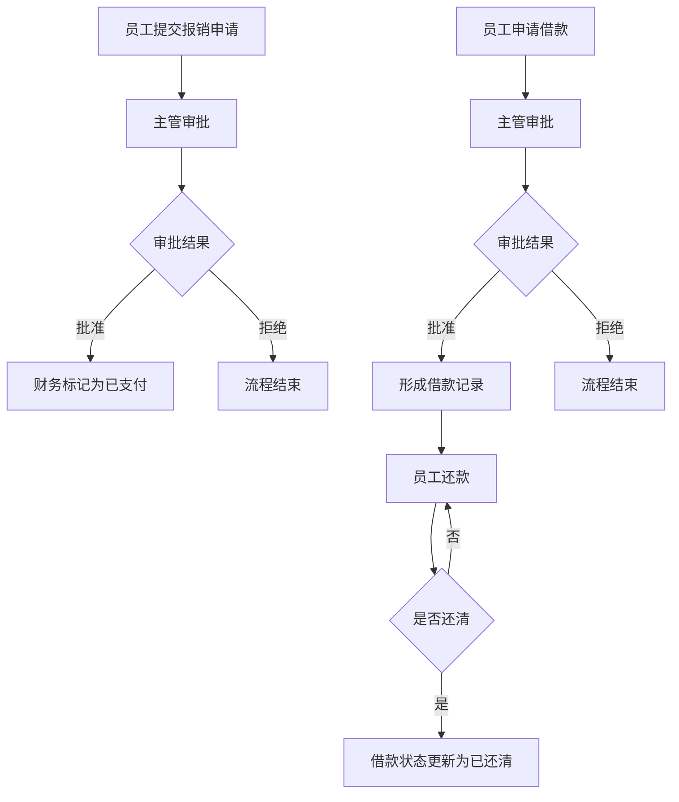
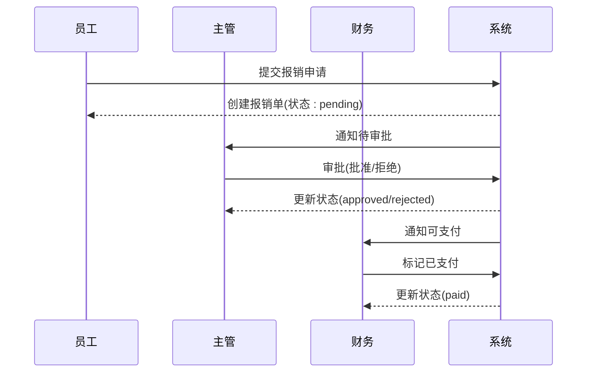
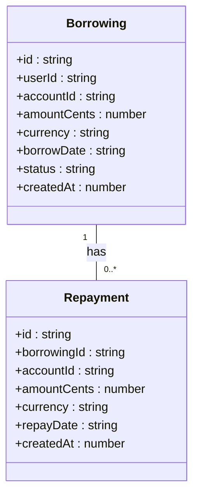
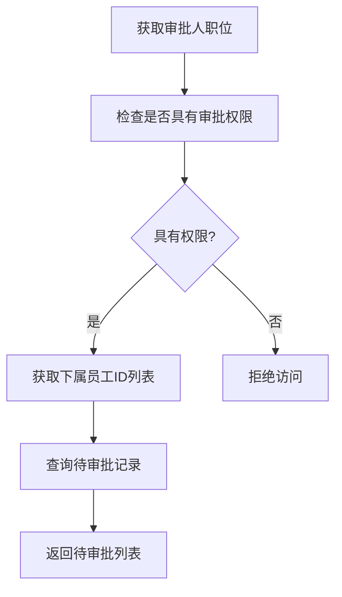
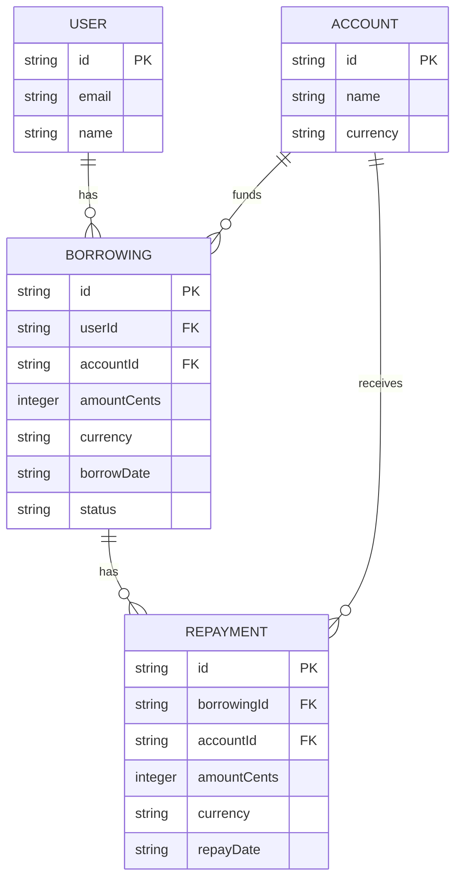

# 报销与借款模块

<cite>
**本文档引用的文件**   
- [expense-reimbursements.ts](file://backend/src/routes/expense-reimbursements.ts)
- [borrowings.ts](file://backend/src/routes/borrowings.ts)
- [ApprovalService.ts](file://backend/src/services/ApprovalService.ts)
- [schema.ts](file://backend/src/db/schema.ts)
- [business.schema.ts](file://backend/src/schemas/business.schema.ts)
- [ExpenseReimbursement.tsx](file://frontend/src/features/hr/pages/ExpenseReimbursement.tsx)
- [BorrowingManagement.tsx](file://frontend/src/features/finance/pages/BorrowingManagement.tsx)
- [MyBorrowings.tsx](file://frontend/src/features/my/pages/MyBorrowings.tsx)
- [FinanceService.ts](file://backend/src/services/FinanceService.ts)
</cite>

## 目录
1. [引言](#引言)
2. [报销与借款流程概览](#报销与借款流程概览)
3. [报销单管理](#报销单管理)
4. [借款与还款管理](#借款与还款管理)
5. [审批服务与状态机](#审批服务与状态机)
6. [API设计与数据验证](#api设计与数据验证)
7. [账务集成与自动对账](#账务集成与自动对账)
8. [异常情况处理](#异常情况处理)
9. [结论](#结论)

## 引言
本文档深入解析费用报销与员工借款管理功能，涵盖申请、审批、支付、还款全流程。详细说明报销单和借款单的多级审批链配置机制，结合`ApprovalService.ts`分析审批状态机。描述借款与还款的关联关系及自动对账逻辑。解释报销费用的分类管理（如差旅、办公）和预算控制集成。结合`expense-reimbursements.ts`和`borrowings.ts`说明API设计与数据验证规则。文档包含审批流程配置示例、异常情况处理（如审批驳回、超期未还）、与财务模块的账务集成方式。

**Section sources**
- [expense-reimbursements.ts](file://backend/src/routes/expense-reimbursements.ts#L1-L263)
- [borrowings.ts](file://backend/src/routes/borrowings.ts#L1-L443)

## 报销与借款流程概览
系统实现了完整的费用报销和员工借款管理流程。员工可提交报销申请，经审批通过后由财务标记为已支付。员工可申请借款，经审批后形成借款记录，后续通过还款操作逐步清偿。所有流程均与财务账务系统集成，确保资金流动的准确性和可追溯性。

**Diagram sources **
- [expense-reimbursements.ts](file://backend/src/routes/expense-reimbursements.ts#L111-L263)
- [borrowings.ts](file://backend/src/routes/borrowings.ts#L135-L443)

## 报销单管理

### 报销申请与审批
员工通过前端界面提交报销申请，需填写员工、报销类型、金额、报销日期、说明等信息，并上传凭证。报销类型包括差旅费、办公用品、餐饮、交通等。后端API `POST /expense-reimbursements` 接收创建请求，初始状态为"pending"（待审批）。

审批流程由`ApprovalService`驱动，主管可在"我的审批"页面查看下属的待审批报销单。审批时可选择批准或拒绝，并填写审批备注。API `PUT /expense-reimbursements/{id}/status` 处理状态更新，将状态变更为"approved"或"rejected"。

**Section sources**
- [expense-reimbursements.ts](file://backend/src/routes/expense-reimbursements.ts#L111-L216)
- [ExpenseReimbursement.tsx](file://frontend/src/features/hr/pages/ExpenseReimbursement.tsx#L1-L741)

### 支付处理
报销单被批准后，财务人员可通过"标记已支付"操作完成支付流程。此操作调用API `POST /expense-reimbursements/{id}/pay`，将状态从"approved"更新为"paid"。系统会检查报销单是否已批准，防止重复支付或对未批准单据进行支付。

**Diagram sources **
- [expense-reimbursements.ts](file://backend/src/routes/expense-reimbursements.ts#L219-L263)
- [ApprovalService.ts](file://backend/src/services/ApprovalService.ts#L198-L234)

## 借款与还款管理

### 借款申请与审批
员工或财务人员可创建借款记录，指定借款人、资金账户、金额、币种、借款日期等。借款初始状态为"outstanding"（未结清）。与报销不同，借款的审批流程是可选的，但通常需要主管审批。

审批通过后，借款记录保持"outstanding"状态，等待后续还款。还款操作会创建还款记录，并关联到原始借款。系统通过`repayments`表与`borrowings`表的外键关系维护借款与还款的关联。

**Section sources**
- [borrowings.ts](file://backend/src/routes/borrowings.ts#L135-L189)
- [BorrowingManagement.tsx](file://frontend/src/features/finance/pages/BorrowingManagement.tsx#L1-L150)

### 还款与自动对账
还款操作通过API `POST /repayments`创建。每次还款会记录还款金额、账户、日期等信息。系统通过`FinanceService`中的`createRepayment`方法处理还款，自动更新相关财务数据。

借款余额的计算是自动的，通过汇总所有关联的还款记录金额，从原始借款金额中扣除，得到当前余额。前端"我的借支"页面展示了累计借支、累计还款和待还余额的统计信息，并以进度条形式显示还款进度。

**Diagram sources **
- [schema.ts](file://backend/src/db/schema.ts#L328-L342)
- [schema.ts](file://backend/src/db/schema.ts#L384-L395)
- [FinanceService.ts](file://backend/src/services/FinanceService.ts#L506-L528)

## 审批服务与状态机

### ApprovalService状态机
`ApprovalService`是整个审批流程的核心，它实现了统一的审批状态机。该服务管理请假、报销、借款三类业务的审批。状态机的关键状态包括：
- **pending**: 待审批
- **approved**: 已批准
- **rejected**: 已拒绝

服务通过`approveXxx`和`rejectXxx`方法处理状态转换。在状态转换前，会进行权限检查，确保审批人是申请人的主管。状态转换后，更新`approvedBy`、`approvedAt`等字段。

**Section sources**
- [ApprovalService.ts](file://backend/src/services/ApprovalService.ts#L160-L282)

### 多级审批链配置
系统的多级审批链基于组织架构和职位权限配置。通过`positions`表中的`level`字段定义职位层级，`canManageSubordinates`字段标识是否具有管理下属的权限。`EmployeeService`提供`getSubordinateEmployeeIds`方法，根据组织架构计算直接和间接下属。

审批权限通过`hasPermission`函数检查，结合用户角色和数据访问范围，实现灵活的审批链配置。例如，部门经理可审批本部门所有员工的报销，而财务人员可审批所有借款。

**Diagram sources **
- [ApprovalService.ts](file://backend/src/services/ApprovalService.ts#L10-L99)
- [permissions.ts](file://backend/src/utils/permissions.ts)

## API设计与数据验证

### 报销API设计
报销模块的API设计遵循RESTful原则，提供资源的增删改查操作：
- `GET /expense-reimbursements`: 查询报销列表，支持按员工和状态过滤
- `POST /expense-reimbursements`: 创建报销申请
- `PUT /expense-reimbursements/{id}/status`: 更新报销状态
- `POST /expense-reimbursements/{id}/pay`: 标记为已支付

数据验证通过Zod Schema在API入口处进行。`CreateReimbursementSchema`定义了创建报销所需字段的类型和约束，如金额必须大于0，日期格式正确等。

**Section sources**
- [expense-reimbursements.ts](file://backend/src/routes/expense-reimbursements.ts)
- [business.schema.ts](file://backend/src/schemas/business.schema.ts)

### 借款API设计
借款模块的API设计与报销类似，但更侧重于资金流动：
- `GET /borrowings`: 查询借款列表
- `POST /borrowings`: 创建借款
- `PUT /borrowings/{id}/status`: 更新借款审批状态
- `GET /repayments`: 查询还款记录
- `POST /repayments`: 创建还款

数据验证同样使用Zod Schema，`createBorrowingSchema`确保借款金额大于0，币种为有效代码，日期格式正确。

**Diagram sources **
- [schema.ts](file://backend/src/db/schema.ts)
- [borrowings.ts](file://backend/src/routes/borrowings.ts)

## 账务集成与自动对账
报销支付和借款还款操作均与财务账务系统深度集成。当报销被标记为已支付时，系统会生成相应的现金流水记录，更新账户余额。借款和还款操作同样会创建财务流水，确保资金流动的可追溯性。

`FinanceService`作为财务核心服务，提供了`createCashFlow`、`createAccountTransfer`等方法，处理各种财务交易。通过事务性操作，确保业务状态更新与财务记账的一致性。例如，创建还款时，不仅创建还款记录，还会生成对应的现金流入流水，更新账户余额。

**Section sources**
- [FinanceService.ts](file://backend/src/services/FinanceService.ts)
- [expense-reimbursements.ts](file://backend/src/routes/expense-reimbursements.ts#L241-L261)

## 异常情况处理

### 审批驳回处理
当审批被驳回时，系统将报销或借款状态更新为"rejected"，并记录驳回人和时间。前端界面会显示驳回状态和备注，申请人可查看被驳回的原因。被驳回的记录通常不可再修改或重新提交，需创建新的申请。

### 超期未还处理
系统目前通过`borrowings`表的`status`字段跟踪借款状态。虽然没有自动的超期提醒机制，但财务人员可通过查询未结清借款列表，手动跟进超期未还的借款。建议未来增加逾期提醒功能，通过邮件或系统通知提醒借款人和财务人员。

**Section sources**
- [ApprovalService.ts](file://backend/src/services/ApprovalService.ts#L179-L196)
- [ApprovalService.ts](file://backend/src/services/ApprovalService.ts#L217-L234)

## 结论
本系统实现了功能完整的费用报销与员工借款管理模块。通过清晰的API设计、严格的数据验证、灵活的审批链配置和深度的财务集成，确保了业务流程的规范性和财务数据的准确性。审批服务的状态机设计统一了不同业务的审批逻辑，提高了代码复用性。借款与还款的关联设计实现了自动对账，简化了财务核算工作。未来可考虑增加预算控制、逾期提醒等高级功能，进一步提升系统智能化水平。