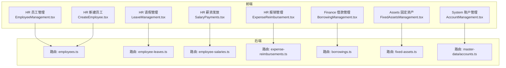
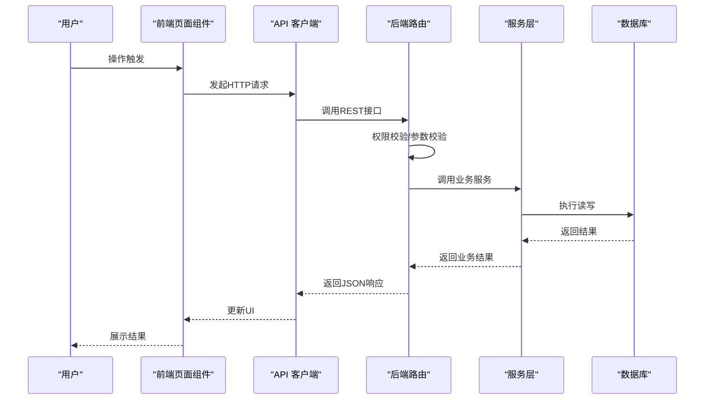
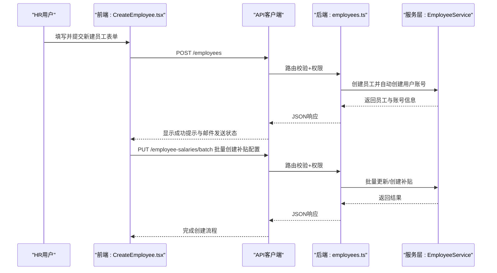
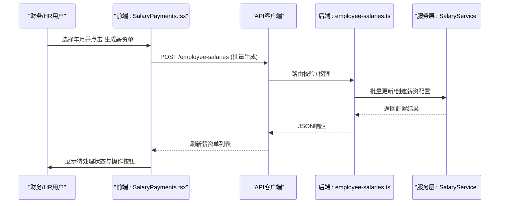
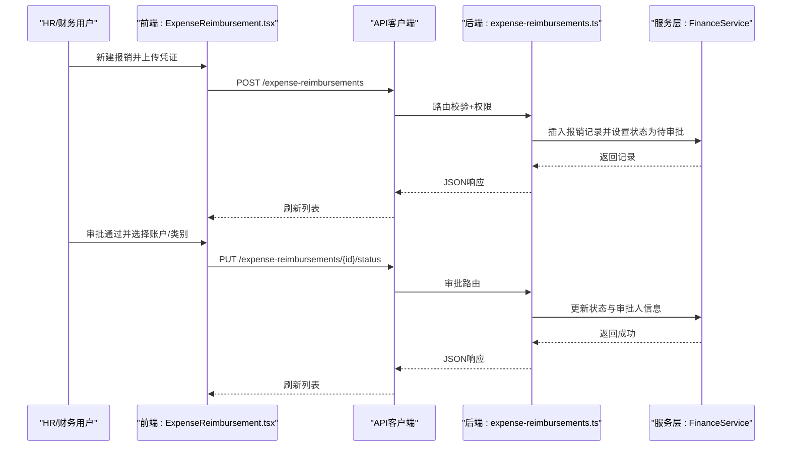
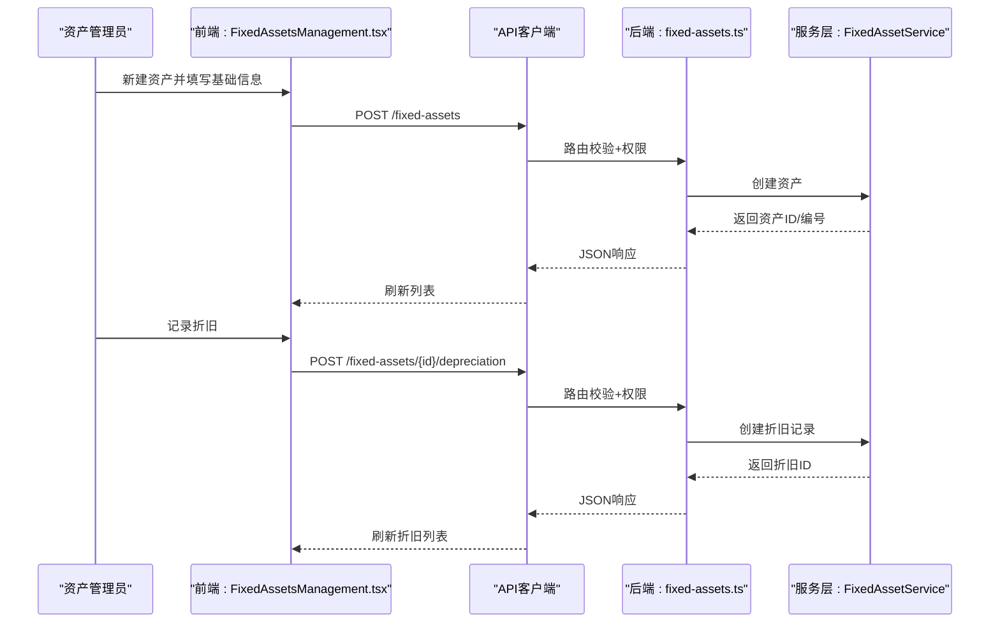
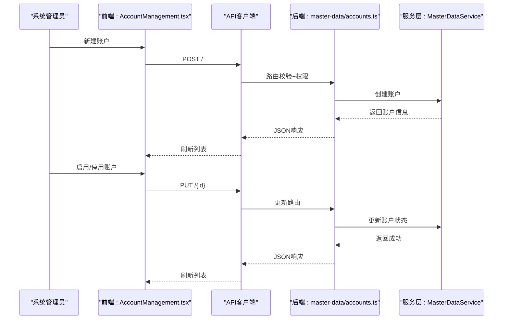
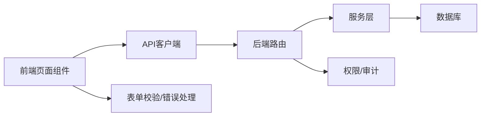

# 核心功能模块

<cite>
**本文引用的文件**
- [EmployeeManagement.tsx](file://frontend/src/features/hr/pages/EmployeeManagement.tsx)
- [employees.ts](file://backend/src/routes/employees.ts)
- [CreateEmployee.tsx](file://frontend/src/features/hr/pages/CreateEmployee.tsx)
- [LeaveManagement.tsx](file://frontend/src/features/hr/pages/LeaveManagement.tsx)
- [employee-leaves.ts](file://backend/src/routes/employee-leaves.ts)
- [SalaryPayments.tsx](file://frontend/src/features/hr/pages/SalaryPayments.tsx)
- [employee-salaries.ts](file://backend/src/routes/employee-salaries.ts)
- [ExpenseReimbursement.tsx](file://frontend/src/features/hr/pages/ExpenseReimbursement.tsx)
- [expense-reimbursements.ts](file://backend/src/routes/expense-reimbursements.ts)
- [BorrowingManagement.tsx](file://frontend/src/features/finance/pages/BorrowingManagement.tsx)
- [borrowings.ts](file://backend/src/routes/borrowings.ts)
- [FixedAssetsManagement.tsx](file://frontend/src/features/assets/pages/FixedAssetsManagement.tsx)
- [fixed-assets.ts](file://backend/src/routes/fixed-assets.ts)
- [AccountManagement.tsx](file://frontend/src/features/system/pages/AccountManagement.tsx)
- [accounts.ts](file://backend/src/routes/master-data/accounts.ts)
</cite>

## 目录
1. [引言](#引言)
2. [项目结构](#项目结构)
3. [核心组件](#核心组件)
4. [架构总览](#架构总览)
5. [详细组件分析](#详细组件分析)
6. [依赖关系分析](#依赖关系分析)
7. [性能考量](#性能考量)
8. [故障排查指南](#故障排查指南)
9. [结论](#结论)
10. [附录](#附录)

## 引言
本文件面向产品经理与业务分析师，系统梳理财务系统的五大核心业务模块：员工管理、薪资管理、财务管理（含借款与报销）、资产管理、系统设置。文档以“前端页面组件 + 后端路由”的实现路径为主线，解释各模块的业务流程、关键接口与数据交互，并给出面向开发者的依赖关系与优化建议。

## 项目结构
系统采用前后端分离架构：
- 前端位于 frontend/src/features 下按功能域划分页面与组件，通过 hooks/useBusinessData 与 hooks/business/* 获取业务数据，通过 api/http 与后端交互。
- 后端位于 backend/src/routes 下按领域划分路由，统一通过 OpenAPIHono 定义接口契约，配合服务层与数据库访问层完成业务处理。

图表来源
- [EmployeeManagement.tsx](file://frontend/src/features/hr/pages/EmployeeManagement.tsx#L1-L586)
- [employees.ts](file://backend/src/routes/employees.ts#L1-L462)
- [LeaveManagement.tsx](file://frontend/src/features/hr/pages/LeaveManagement.tsx#L1-L495)
- [employee-leaves.ts](file://backend/src/routes/employee-leaves.ts#L1-L210)
- [SalaryPayments.tsx](file://frontend/src/features/hr/pages/SalaryPayments.tsx#L1-L690)
- [employee-salaries.ts](file://backend/src/routes/employee-salaries.ts#L1-L251)
- [ExpenseReimbursement.tsx](file://frontend/src/features/hr/pages/ExpenseReimbursement.tsx#L1-L741)
- [expense-reimbursements.ts](file://backend/src/routes/expense-reimbursements.ts#L1-L263)
- [BorrowingManagement.tsx](file://frontend/src/features/finance/pages/BorrowingManagement.tsx#L1-L150)
- [borrowings.ts](file://backend/src/routes/borrowings.ts#L1-L443)
- [FixedAssetsManagement.tsx](file://frontend/src/features/assets/pages/FixedAssetsManagement.tsx#L1-L523)
- [fixed-assets.ts](file://backend/src/routes/fixed-assets.ts#L1-L730)
- [AccountManagement.tsx](file://frontend/src/features/system/pages/AccountManagement.tsx#L1-L267)
- [accounts.ts](file://backend/src/routes/master-data/accounts.ts#L1-L253)

章节来源
- [EmployeeManagement.tsx](file://frontend/src/features/hr/pages/EmployeeManagement.tsx#L1-L586)
- [employees.ts](file://backend/src/routes/employees.ts#L1-L462)

## 核心组件
- 员工管理：员工信息维护、入职/转正/离职/重新入职、薪资与补贴配置、账号启停用与密码重置。
- 薪资管理：薪资单生成、员工确认、财务审批、转账标记、币种分配审批、出纳确认与凭证上传。
- 财务管理：借款管理（创建、审批、还款、余额查询），费用报销（创建、审批、支付）。
- 资产管理：固定资产全生命周期（采购、登记、调拨、折旧、处置、分配/归还、明细与变更记录）。
- 系统设置：账户管理（创建/更新/启用停用/批量删除）。

章节来源
- [SalaryPayments.tsx](file://frontend/src/features/hr/pages/SalaryPayments.tsx#L1-L690)
- [employee-salaries.ts](file://backend/src/routes/employee-salaries.ts#L1-L251)
- [BorrowingManagement.tsx](file://frontend/src/features/finance/pages/BorrowingManagement.tsx#L1-L150)
- [borrowings.ts](file://backend/src/routes/borrowings.ts#L1-L443)
- [ExpenseReimbursement.tsx](file://frontend/src/features/hr/pages/ExpenseReimbursement.tsx#L1-L741)
- [expense-reimbursements.ts](file://backend/src/routes/expense-reimbursements.ts#L1-L263)
- [FixedAssetsManagement.tsx](file://frontend/src/features/assets/pages/FixedAssetsManagement.tsx#L1-L523)
- [fixed-assets.ts](file://backend/src/routes/fixed-assets.ts#L1-L730)
- [AccountManagement.tsx](file://frontend/src/features/system/pages/AccountManagement.tsx#L1-L267)
- [accounts.ts](file://backend/src/routes/master-data/accounts.ts#L1-L253)

## 架构总览
系统采用“前端页面组件 + 后端路由 + 服务层 + 数据库”的分层架构。前端通过 hooks 与 API 客户端发起请求，后端路由校验权限与参数，调用服务层执行业务逻辑并返回标准化响应。

图表来源
- [EmployeeManagement.tsx](file://frontend/src/features/hr/pages/EmployeeManagement.tsx#L1-L586)
- [employees.ts](file://backend/src/routes/employees.ts#L1-L462)
- [SalaryPayments.tsx](file://frontend/src/features/hr/pages/SalaryPayments.tsx#L1-L690)
- [employee-salaries.ts](file://backend/src/routes/employee-salaries.ts#L1-L251)

## 详细组件分析

### 员工管理模块
- 功能要点
  - 员工列表与筛选（状态、项目、部门、手机号敏感字段展示控制）
  - 员工信息编辑、账号启停用、密码重置
  - 底薪与各类补贴配置（多币种）
  - 入职、转正、离职、重新入职流程
- 关键流程
  - 新建员工：前端收集信息并通过 employees 接口创建；同时批量创建/更新补贴配置。
  - 转正/离职/重新入职：调用对应后端接口，记录审计日志。
- 前后端实现路径
  - 前端：EmployeeManagement.tsx、CreateEmployee.tsx
  - 后端：employees.ts（包含 list/get/create/update/regularize/leave/rejoin/reset-password 等路由）

图表来源
- [CreateEmployee.tsx](file://frontend/src/features/hr/pages/CreateEmployee.tsx#L1-L317)
- [employees.ts](file://backend/src/routes/employees.ts#L1-L462)
- [employee-salaries.ts](file://backend/src/routes/employee-salaries.ts#L1-L251)

章节来源
- [EmployeeManagement.tsx](file://frontend/src/features/hr/pages/EmployeeManagement.tsx#L1-L586)
- [employees.ts](file://backend/src/routes/employees.ts#L1-L462)
- [CreateEmployee.tsx](file://frontend/src/features/hr/pages/CreateEmployee.tsx#L1-L317)

### 薪资管理模块
- 功能要点
  - 年月筛选、状态筛选、薪资单列表
  - 员工确认、财务审批、转账标记、币种分配申请/审批、出纳确认与凭证上传
  - 支持多币种分配与账户选择
- 关键流程
  - 生成薪资单：前端调用生成接口，后端批量创建薪资单并返回数量。
  - 币种分配：员工或财务发起申请，财务审批，最终出纳转账并上传凭证。
- 前后端实现路径
  - 前端：SalaryPayments.tsx
  - 后端：employee-salaries.ts（底薪/补贴配置）、borrowings.ts（转账相关流程）

图表来源
- [SalaryPayments.tsx](file://frontend/src/features/hr/pages/SalaryPayments.tsx#L1-L690)
- [employee-salaries.ts](file://backend/src/routes/employee-salaries.ts#L1-L251)

章节来源
- [SalaryPayments.tsx](file://frontend/src/features/hr/pages/SalaryPayments.tsx#L1-L690)
- [employee-salaries.ts](file://backend/src/routes/employee-salaries.ts#L1-L251)

### 财务管理模块（借款与报销）
- 借款管理
  - 新建借款：选择借款人、币种、资金账户、金额、日期、备注
  - 审批：财务审批（批准/拒绝），记录审批意见
  - 还款：创建还款记录，支持按借款单查询还款列表
  - 余额：按用户/币种统计未还余额
- 报销管理
  - 新建/编辑/删除：仅待审批状态下允许编辑
  - 审批：审批通过时选择支出账户与支出类别
  - 支付：标记为已支付
  - 凭证：上传图片凭证并预览
- 前后端实现路径
  - 借款：BorrowingManagement.tsx → borrowings.ts
  - 报销：ExpenseReimbursement.tsx → expense-reimbursements.ts

图表来源
- [ExpenseReimbursement.tsx](file://frontend/src/features/hr/pages/ExpenseReimbursement.tsx#L1-L741)
- [expense-reimbursements.ts](file://backend/src/routes/expense-reimbursements.ts#L1-L263)

章节来源
- [BorrowingManagement.tsx](file://frontend/src/features/finance/pages/BorrowingManagement.tsx#L1-L150)
- [borrowings.ts](file://backend/src/routes/borrowings.ts#L1-L443)
- [ExpenseReimbursement.tsx](file://frontend/src/features/hr/pages/ExpenseReimbursement.tsx#L1-L741)
- [expense-reimbursements.ts](file://backend/src/routes/expense-reimbursements.ts#L1-L263)

### 资产管理模块
- 功能要点
  - 资产登记：资产编号、名称、类别、购买日期、购买价格、币种、供应商、使用项目、位置、责任人、状态、折旧方法、使用年限、当前净值、备注
  - 调拨：项目/位置/责任人变更
  - 折旧：记录折旧日期、金额、累计折旧、剩余价值、备注
  - 分配/归还：员工与资产的分配与归还
  - 明细与变更：查看折旧记录与历史变更
- 前后端实现路径
  - 前端：FixedAssetsManagement.tsx
  - 后端：fixed-assets.ts（资产 CRUD、折旧、调拨、分配/归还、分类与明细）

图表来源
- [FixedAssetsManagement.tsx](file://frontend/src/features/assets/pages/FixedAssetsManagement.tsx#L1-L523)
- [fixed-assets.ts](file://backend/src/routes/fixed-assets.ts#L1-L730)

章节来源
- [FixedAssetsManagement.tsx](file://frontend/src/features/assets/pages/FixedAssetsManagement.tsx#L1-L523)
- [fixed-assets.ts](file://backend/src/routes/fixed-assets.ts#L1-L730)

### 系统设置模块（账户管理）
- 功能要点
  - 账户列表：名称、账户号、别名、类型、币种、管理人员、启用状态
  - 新建/编辑：名称、账户号、别名、类型、币种、管理人员
  - 启用/停用：切换 active 状态
  - 批量删除：删除无流水使用的账户
- 前后端实现路径
  - 前端：AccountManagement.tsx
  - 后端：master-data/accounts.ts（账户 CRUD、交易流水查询）

图表来源
- [AccountManagement.tsx](file://frontend/src/features/system/pages/AccountManagement.tsx#L1-L267)
- [accounts.ts](file://backend/src/routes/master-data/accounts.ts#L1-L253)

章节来源
- [AccountManagement.tsx](file://frontend/src/features/system/pages/AccountManagement.tsx#L1-L267)
- [accounts.ts](file://backend/src/routes/master-data/accounts.ts#L1-L253)

## 依赖关系分析
- 前端依赖
  - 页面组件依赖 hooks/useBusinessData 与 hooks/business/* 获取数据与封装业务操作
  - 通过 api/http 与后端路由通信，使用 withErrorHandler 统一错误处理
- 后端依赖
  - 路由层依赖权限工具（hasPermission、getUserPosition）、审计日志（logAuditAction）、错误定义（Errors）
  - 服务层负责具体业务逻辑，路由层仅做参数校验与权限控制
- 数据一致性
  - 薪资单与补贴配置通过 employee-salaries 路由进行批量更新，确保数据一致性
  - 报销与借款均支持状态流转与审批，后端严格校验状态变更权限

图表来源
- [SalaryPayments.tsx](file://frontend/src/features/hr/pages/SalaryPayments.tsx#L1-L690)
- [employee-salaries.ts](file://backend/src/routes/employee-salaries.ts#L1-L251)
- [ExpenseReimbursement.tsx](file://frontend/src/features/hr/pages/ExpenseReimbursement.tsx#L1-L741)
- [expense-reimbursements.ts](file://backend/src/routes/expense-reimbursements.ts#L1-L263)
- [BorrowingManagement.tsx](file://frontend/src/features/finance/pages/BorrowingManagement.tsx#L1-L150)
- [borrowings.ts](file://backend/src/routes/borrowings.ts#L1-L443)
- [FixedAssetsManagement.tsx](file://frontend/src/features/assets/pages/FixedAssetsManagement.tsx#L1-L523)
- [fixed-assets.ts](file://backend/src/routes/fixed-assets.ts#L1-L730)
- [AccountManagement.tsx](file://frontend/src/features/system/pages/AccountManagement.tsx#L1-L267)
- [accounts.ts](file://backend/src/routes/master-data/accounts.ts#L1-L253)

章节来源
- [employees.ts](file://backend/src/routes/employees.ts#L1-L462)
- [employee-leaves.ts](file://backend/src/routes/employee-leaves.ts#L1-L210)

## 性能考量
- 前端
  - 使用虚拟表格（VirtualTable）提升大列表渲染性能
  - 表单与查询参数缓存，减少重复请求
  - 图片凭证上传前转换为 WebP，降低体积
- 后端
  - 路由层尽量将复杂查询交给服务层，保持路由简洁
  - 对列表接口使用分页与过滤，避免一次性返回大量数据
  - 审计日志异步化，避免阻塞主流程

## 故障排查指南
- 权限不足
  - 现象：接口返回 403
  - 排查：确认用户角色与权限位（如 hr.employee.create、finance.borrowing.approve 等）
- 参数校验失败
  - 现象：接口返回 400 或表单提示
  - 排查：核对必填字段、日期格式、金额精度、币种匹配
- 数据冲突
  - 现象：账户/员工创建失败
  - 排查：检查唯一约束（如账户名称、员工姓名），使用 handleConflictError 提示
- 状态流转异常
  - 现象：报销/请假/借款状态不可更新
  - 排查：确认当前状态与目标状态是否合法，审批人是否具备权限

章节来源
- [AccountManagement.tsx](file://frontend/src/features/system/pages/AccountManagement.tsx#L1-L267)
- [ExpenseReimbursement.tsx](file://frontend/src/features/hr/pages/ExpenseReimbursement.tsx#L1-L741)
- [borrowings.ts](file://backend/src/routes/borrowings.ts#L1-L443)

## 结论
本系统围绕“员工—薪资—财务—资产—系统”五大模块构建了完整的财务业务闭环。前端通过清晰的页面组件与 hooks 实现业务交互，后端通过严格的权限与审计保障安全合规。模块间通过标准化接口协作，具备良好的扩展性与可维护性。建议后续持续完善报表与自动化流程，进一步提升运营效率。

## 附录
- 业务术语
  - 底薪：员工固定工资部分
  - 补贴：生活、住房、交通、伙食等津贴
  - 币种分配：薪资按不同币种拆分
  - 凭证：财务支付/报销的附件
- 最佳实践
  - 严格遵循 RBAC 权限模型
  - 所有关键操作记录审计日志
  - 对外暴露接口统一使用 OpenAPI 规范
  - 前端表单校验与后端参数校验双重保障