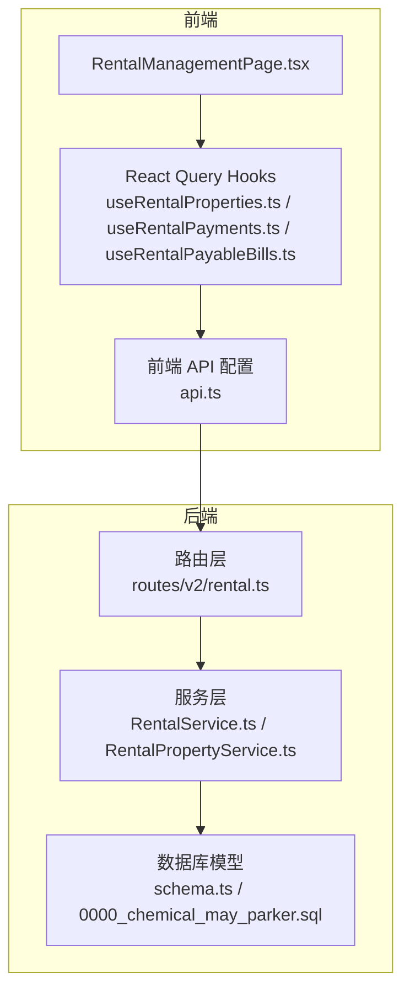
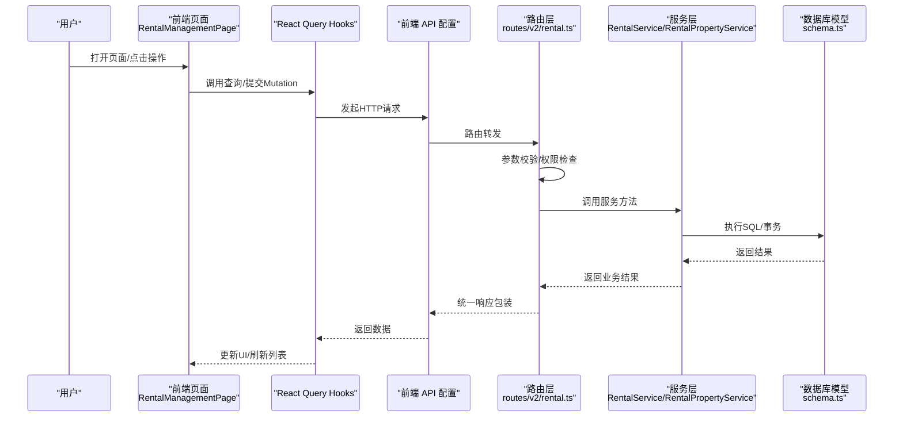
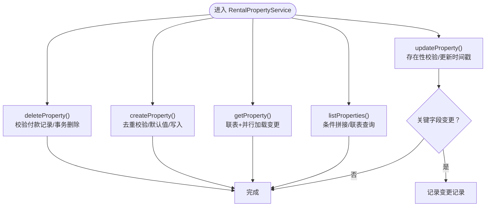
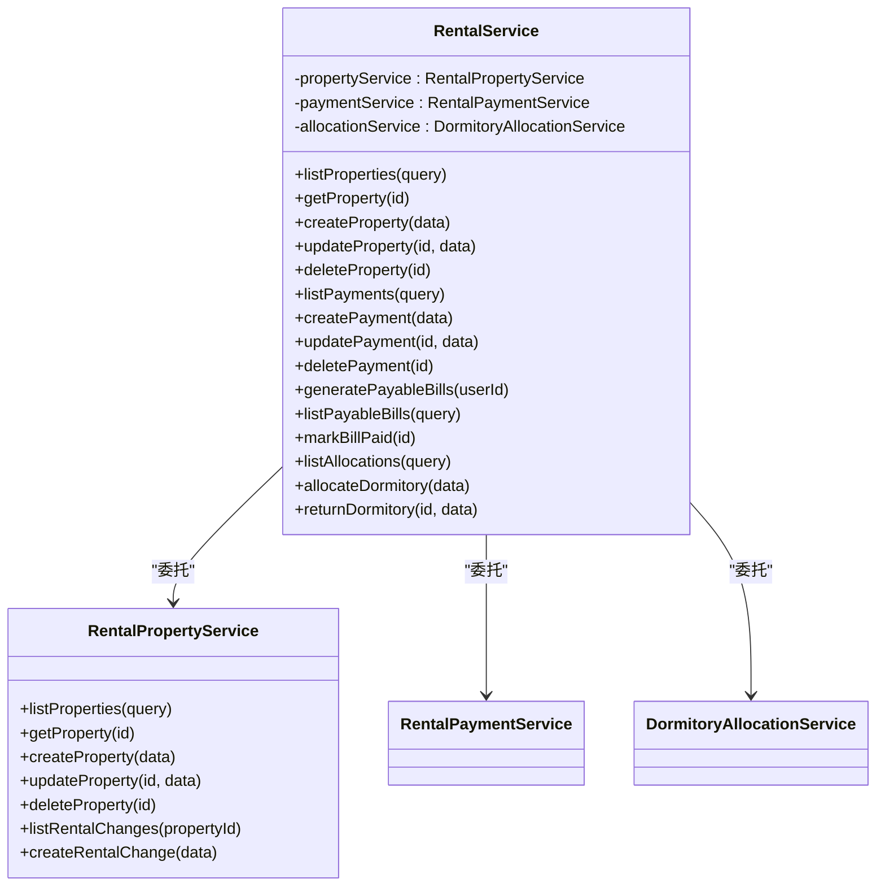
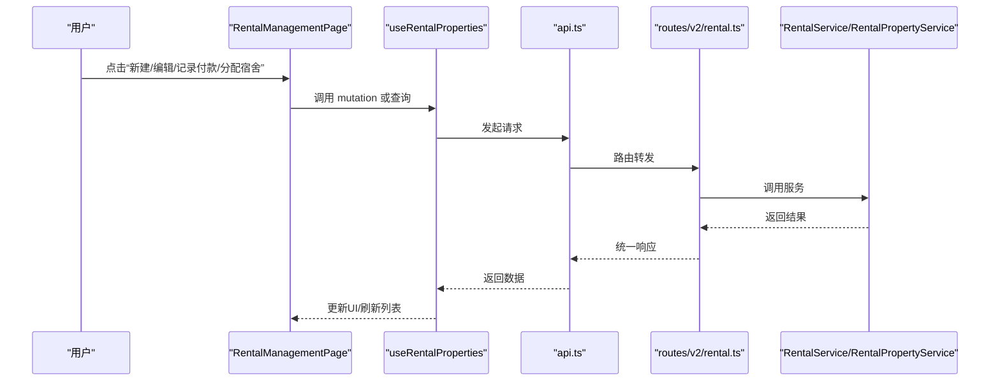
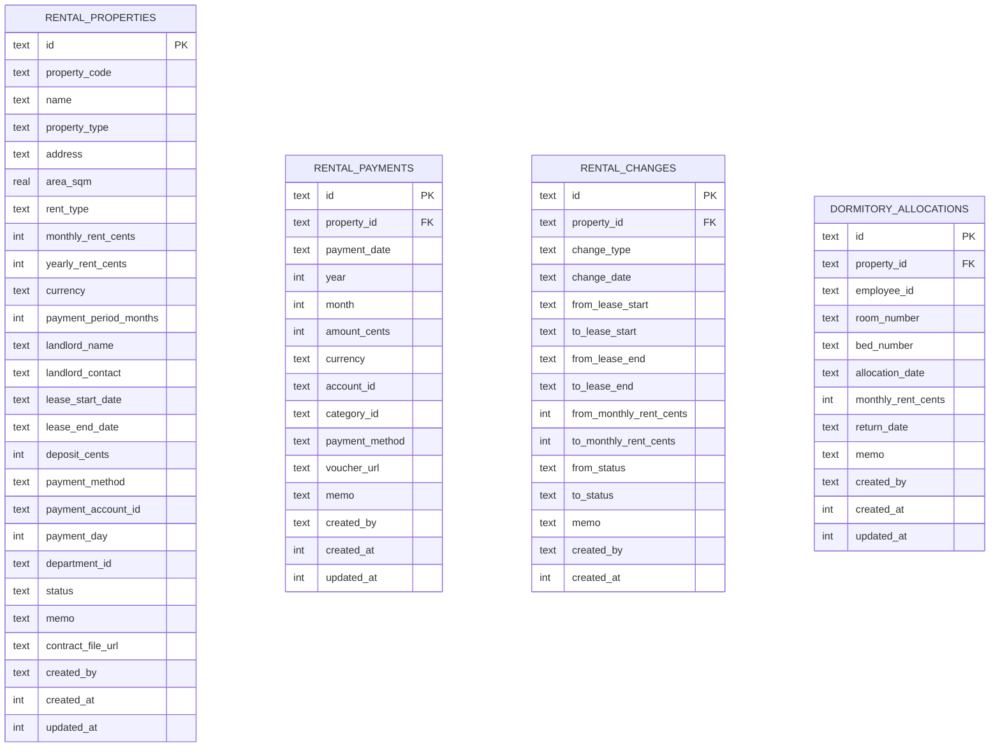
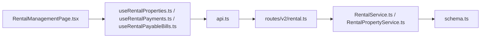

# 租赁物业管理

<cite>
**本文引用的文件**
- [RentalPropertyService.ts](file://backend/src/services/RentalPropertyService.ts)
- [RentalService.ts](file://backend/src/services/RentalService.ts)
- [rental.ts](file://backend/src/routes/v2/rental.ts)
- [schema.ts](file://backend/src/db/schema.ts)
- [0000_chemical_may_parker.sql](file://backend/drizzle/0000_chemical_may_parker.sql)
- [RentalManagementPage.tsx](file://frontend/src/features/assets/pages/RentalManagementPage.tsx)
- [useRentalProperties.ts](file://frontend/src/hooks/business/useRentalProperties.ts)
- [useRentalPayments.ts](file://frontend/src/hooks/business/useRentalPayments.ts)
- [useRentalPayableBills.ts](file://frontend/src/hooks/business/useRentalPayableBills.ts)
- [api.ts](file://frontend/src/config/api.ts)
- [rental.ts（前端类型）](file://frontend/src/types/rental.ts)
- [rental.schema.ts（前端校验）](file://frontend/src/validations/rental.schema.ts)
</cite>

## 目录
1. [简介](#简介)
2. [项目结构](#项目结构)
3. [核心组件](#核心组件)
4. [架构总览](#架构总览)
5. [详细组件分析](#详细组件分析)
6. [依赖分析](#依赖分析)
7. [性能考虑](#性能考虑)
8. [故障排查指南](#故障排查指南)
9. [结论](#结论)
10. [附录：API 接口规范](#附录api-接口规范)

## 简介
本文件面向“租赁物业管理”功能，系统性阐述后端 RentalPropertyService 的实现机制与其与 RentalService 的协作关系，覆盖物业信息的创建、更新、删除、查询，以及与“租赁合同、房东信息、租金周期、付款周期、币种、状态”等核心字段的管理。同时结合前端 RentalManagementPage 页面，说明物业管理人员的操作流程（列表展示、筛选查询、表单输入验证），并提供完整的 API 规范（请求参数、响应结构、权限控制策略）及调用示例。

## 项目结构
- 后端采用 Hono + Drizzle ORM，路由层定义 OpenAPI 路由，服务层封装业务逻辑，数据库层使用 SQLite 表结构定义。
- 前端使用 React + Ant Design + React Query，页面组件负责用户交互与数据展示，Hooks 封装 API 请求与缓存。

图表来源
- [RentalManagementPage.tsx](file://frontend/src/features/assets/pages/RentalManagementPage.tsx#L95-L111)
- [useRentalProperties.ts](file://frontend/src/hooks/business/useRentalProperties.ts#L13-L27)
- [api.ts](file://frontend/src/config/api.ts#L148-L157)
- [rental.ts](file://backend/src/routes/v2/rental.ts#L26-L66)
- [RentalService.ts](file://backend/src/services/RentalService.ts#L1-L21)
- [RentalPropertyService.ts](file://backend/src/services/RentalPropertyService.ts#L1-L20)
- [schema.ts](file://backend/src/db/schema.ts#L576-L639)
- [0000_chemical_may_parker.sql](file://backend/drizzle/0000_chemical_may_parker.sql#L1-L200)

章节来源
- [RentalManagementPage.tsx](file://frontend/src/features/assets/pages/RentalManagementPage.tsx#L95-L111)
- [useRentalProperties.ts](file://frontend/src/hooks/business/useRentalProperties.ts#L13-L27)
- [api.ts](file://frontend/src/config/api.ts#L148-L157)
- [rental.ts](file://backend/src/routes/v2/rental.ts#L26-L66)
- [RentalService.ts](file://backend/src/services/RentalService.ts#L1-L21)
- [RentalPropertyService.ts](file://backend/src/services/RentalPropertyService.ts#L1-L20)
- [schema.ts](file://backend/src/db/schema.ts#L576-L639)
- [0000_chemical_may_parker.sql](file://backend/drizzle/0000_chemical_may_parker.sql#L1-L200)

## 核心组件
- RentalPropertyService：负责租赁物业的 CRUD、变更记录、关联删除事务、关键字段变更审计。
- RentalService：门面模式聚合 RentalPropertyService、RentalPaymentService、DormitoryAllocationService，统一对外提供属性、支付、分配等能力。
- 路由层 rental.ts：定义 OpenAPI 路由，参数校验、权限控制、审计日志。
- 数据库模型 schema.ts：定义 rental_properties、rental_payments、rental_changes、dormitory_allocations 等表结构。
- 前端 RentalManagementPage：列表、筛选、表单校验、上传凭证/合同、操作按钮（新建、编辑、记录付款、分配宿舍）。

章节来源
- [RentalPropertyService.ts](file://backend/src/services/RentalPropertyService.ts#L1-L291)
- [RentalService.ts](file://backend/src/services/RentalService.ts#L1-L162)
- [rental.ts](file://backend/src/routes/v2/rental.ts#L26-L66)
- [schema.ts](file://backend/src/db/schema.ts#L576-L639)
- [RentalManagementPage.tsx](file://frontend/src/features/assets/pages/RentalManagementPage.tsx#L95-L111)

## 架构总览
后端采用“路由层 -> 服务层 -> 数据库层”的分层架构。前端通过 React Query 与后端 API 交互，页面组件驱动业务流程。

图表来源
- [RentalManagementPage.tsx](file://frontend/src/features/assets/pages/RentalManagementPage.tsx#L95-L111)
- [useRentalProperties.ts](file://frontend/src/hooks/business/useRentalProperties.ts#L13-L27)
- [api.ts](file://frontend/src/config/api.ts#L148-L157)
- [rental.ts](file://backend/src/routes/v2/rental.ts#L26-L66)
- [RentalService.ts](file://backend/src/services/RentalService.ts#L1-L21)
- [RentalPropertyService.ts](file://backend/src/services/RentalPropertyService.ts#L1-L20)
- [schema.ts](file://backend/src/db/schema.ts#L576-L639)

## 详细组件分析

### RentalPropertyService 实现机制
- 列表查询：支持按物业类型、状态、部门过滤，联表返回部门、账户、币种、创建人等信息，并统计未归还宿舍分配数量。
- 单条查询：返回物业详情，同时并行加载变更记录。
- 创建：校验重复编码，写入基础字段（含默认值与业务约束），返回新 ID。
- 更新：校验存在性，更新时间戳，若关键字段变化则记录变更记录。
- 删除：校验是否存在付款记录，存在则拒绝；否则事务内级联删除变更记录与宿舍分配，再删除物业。
- 变更记录：独立的变更记录表，记录修改前后的关键字段与备注。

图表来源
- [RentalPropertyService.ts](file://backend/src/services/RentalPropertyService.ts#L20-L84)
- [RentalPropertyService.ts](file://backend/src/services/RentalPropertyService.ts#L86-L156)
- [RentalPropertyService.ts](file://backend/src/services/RentalPropertyService.ts#L158-L211)
- [RentalPropertyService.ts](file://backend/src/services/RentalPropertyService.ts#L213-L239)
- [RentalPropertyService.ts](file://backend/src/services/RentalPropertyService.ts#L241-L289)

章节来源
- [RentalPropertyService.ts](file://backend/src/services/RentalPropertyService.ts#L20-L84)
- [RentalPropertyService.ts](file://backend/src/services/RentalPropertyService.ts#L86-L156)
- [RentalPropertyService.ts](file://backend/src/services/RentalPropertyService.ts#L158-L211)
- [RentalPropertyService.ts](file://backend/src/services/RentalPropertyService.ts#L213-L239)
- [RentalPropertyService.ts](file://backend/src/services/RentalPropertyService.ts#L241-L289)

### RentalService 协作关系
- 作为门面，组合 RentalPropertyService、RentalPaymentService、DormitoryAllocationService。
- 在获取物业详情时，按需并行加载支付记录与宿舍分配记录（宿舍类型才加载）。
- 对外暴露统一的属性、支付、分配接口，便于前端与路由层复用。

图表来源
- [RentalService.ts](file://backend/src/services/RentalService.ts#L1-L162)
- [RentalPropertyService.ts](file://backend/src/services/RentalPropertyService.ts#L1-L291)

章节来源
- [RentalService.ts](file://backend/src/services/RentalService.ts#L1-L162)

### 前端 RentalManagementPage 操作流程
- 列表展示：通过 React Query 查询租赁物业列表，支持按类型与状态筛选。
- 表单输入验证：使用 Zod Schema 进行前端校验，包含金额、日期、币种、付款周期等。
- 上传凭证/合同：支持图片凭证上传（自动转 WebP）、PDF 合同上传。
- 操作按钮：
  - 新建：打开新建模态框，提交创建请求。
  - 编辑：打开编辑模态框，提交更新请求。
  - 记录付款：根据付款周期自动计算金额，提交付款记录。
  - 分配宿舍：仅宿舍类型显示，提交分配请求。
- 权限控制：基于 hasPermission('asset','rental','create'|'allocate') 控制按钮显隐。

图表来源
- [RentalManagementPage.tsx](file://frontend/src/features/assets/pages/RentalManagementPage.tsx#L95-L111)
- [useRentalProperties.ts](file://frontend/src/hooks/business/useRentalProperties.ts#L13-L27)
- [api.ts](file://frontend/src/config/api.ts#L148-L157)
- [rental.ts](file://backend/src/routes/v2/rental.ts#L26-L66)
- [RentalService.ts](file://backend/src/services/RentalService.ts#L1-L21)
- [RentalPropertyService.ts](file://backend/src/services/RentalPropertyService.ts#L1-L20)

章节来源
- [RentalManagementPage.tsx](file://frontend/src/features/assets/pages/RentalManagementPage.tsx#L95-L111)
- [useRentalProperties.ts](file://frontend/src/hooks/business/useRentalProperties.ts#L13-L27)
- [api.ts](file://frontend/src/config/api.ts#L148-L157)

### 数据模型与字段说明
- 物业表（rental_properties）：包含物业类型、地址、面积、租金类型（月租/年租）、月/年租金、币种、付款周期、房东信息、租赁起止日期、押金、付款方式、付款账户、付款日、使用部门、状态、备注、合同文件、创建者与时间戳。
- 支付表（rental_payments）：包含支付日期、年、月、金额、币种、账户、分类、付款方式、凭证、备注、创建者与时间戳。
- 变更表（rental_changes）：记录关键字段变更（起止日期、月租、状态等）与备注。
- 宿舍分配表（dormitory_allocations）：记录员工分配、房间床铺、分配日期、月租、归还日期等。

图表来源
- [schema.ts](file://backend/src/db/schema.ts#L576-L639)
- [0000_chemical_may_parker.sql](file://backend/drizzle/0000_chemical_may_parker.sql#L1-L200)

章节来源
- [schema.ts](file://backend/src/db/schema.ts#L576-L639)
- [0000_chemical_may_parker.sql](file://backend/drizzle/0000_chemical_may_parker.sql#L1-L200)

## 依赖分析
- 前端依赖关系：页面组件依赖 React Query Hooks，Hooks 依赖前端 API 配置，API 配置指向后端路由。
- 后端依赖关系：路由层依赖服务层，服务层依赖数据库模型；服务层内部通过门面模式组合多个子服务。
- 外部依赖：Hono（路由与 OpenAPI）、Drizzle ORM（数据库访问）、Ant Design（前端组件库）、React Query（数据缓存与并发）。

图表来源
- [RentalManagementPage.tsx](file://frontend/src/features/assets/pages/RentalManagementPage.tsx#L95-L111)
- [useRentalProperties.ts](file://frontend/src/hooks/business/useRentalProperties.ts#L13-L27)
- [api.ts](file://frontend/src/config/api.ts#L148-L157)
- [rental.ts](file://backend/src/routes/v2/rental.ts#L26-L66)
- [RentalService.ts](file://backend/src/services/RentalService.ts#L1-L21)
- [RentalPropertyService.ts](file://backend/src/services/RentalPropertyService.ts#L1-L20)
- [schema.ts](file://backend/src/db/schema.ts#L576-L639)

章节来源
- [RentalManagementPage.tsx](file://frontend/src/features/assets/pages/RentalManagementPage.tsx#L95-L111)
- [useRentalProperties.ts](file://frontend/src/hooks/business/useRentalProperties.ts#L13-L27)
- [api.ts](file://frontend/src/config/api.ts#L148-L157)
- [rental.ts](file://backend/src/routes/v2/rental.ts#L26-L66)
- [RentalService.ts](file://backend/src/services/RentalService.ts#L1-L21)
- [RentalPropertyService.ts](file://backend/src/services/RentalPropertyService.ts#L1-L20)
- [schema.ts](file://backend/src/db/schema.ts#L576-L639)

## 性能考虑
- 列表查询使用联表与条件过滤，建议在相关列建立索引（如 property_type、status、department_id、lease_start_date、lease_end_date）。
- 关键字段变更记录采用事务写入，避免脏数据。
- 前端使用 React Query 缓存与并发请求，减少重复请求与提升交互体验。
- 上传凭证/合同采用异步上传与预览，避免阻塞主流程。

[本节为通用指导，无需列出具体文件来源]

## 故障排查指南
- 创建失败：检查 propertyCode 是否重复、租金类型与金额是否匹配、日期区间是否有效。
- 更新失败：确认物业存在性、关键字段变更是否触发变更记录。
- 删除失败：若存在付款记录将被拒绝，请先清理相关支付记录。
- 权限不足：部分操作（如更新/删除付款、标记账单为已付）需要特定权限位。
- 前端校验失败：检查金额、日期、币种、付款周期等字段是否符合前端 Schema。

章节来源
- [RentalPropertyService.ts](file://backend/src/services/RentalPropertyService.ts#L111-L156)
- [RentalPropertyService.ts](file://backend/src/services/RentalPropertyService.ts#L158-L211)
- [RentalPropertyService.ts](file://backend/src/services/RentalPropertyService.ts#L213-L239)
- [rental.ts](file://backend/src/routes/v2/rental.ts#L648-L664)
- [rental.ts](file://backend/src/routes/v2/rental.ts#L692-L711)
- [rental.ts](file://backend/src/routes/v2/rental.ts#L842-L851)
- [rental.schema.ts（前端校验）](file://frontend/src/validations/rental.schema.ts#L1-L83)

## 结论
RentalPropertyService 提供了完善的物业 CRUD 与变更审计能力，RentalService 通过门面模式整合了属性、支付、分配等子服务，前后端通过统一的 API 与 Schema 实现强一致的数据流。前端页面围绕列表、筛选、表单校验与上传能力构建，形成完整的租赁物业管理闭环。

[本节为总结性内容，无需列出具体文件来源]

## 附录：API 接口规范

### 通用说明
- 版本：v2
- 基础路径：见前端 API 配置
- 响应格式：统一 success/data 包裹，详见各路由定义
- 权限控制：部分路由明确要求权限位（如 asset:rental:create/update/delete）

章节来源
- [api.ts](file://frontend/src/config/api.ts#L148-L157)
- [rental.ts](file://backend/src/routes/v2/rental.ts#L26-L66)

### 物业管理接口
- 获取物业列表
  - 方法：GET
  - 路径：/api/v2/rental-properties
  - 查询参数：
    - propertyType: string（可选）
    - status: string（可选）
    - departmentId: string（可选）
  - 响应：results 数组，包含 property、departmentName、paymentAccountName、currencyName、createdByName
  - 权限：公开
  - 示例：GET /api/v2/rental-properties?propertyType=office&status=active

- 获取单个物业详情
  - 方法：GET
  - 路径：/api/v2/rental-properties/{id}
  - 路径参数：id: string（UUID）
  - 响应：data 为物业详情，包含 payments、allocations、changes 等
  - 权限：公开
  - 示例：GET /api/v2/rental-properties/xxxx-xxxx-xxxx

- 创建物业
  - 方法：POST
  - 路径：/api/v2/rental-properties
  - 请求体：propertyCode、name、propertyType、address、areaSqm、rentType、monthlyRentCents、yearlyRentCents、currency、paymentPeriodMonths、landlordName、landlordContact、leaseStartDate、leaseEndDate、depositCents、paymentMethod、paymentAccountId、paymentDay、departmentId、status、memo、contractFileUrl
  - 响应：{ id, propertyCode }
  - 权限：需要权限位 asset:rental:create
  - 示例：POST /api/v2/rental-properties

- 更新物业
  - 方法：PUT
  - 路径：/api/v2/rental-properties/{id}
  - 路径参数：id: string（UUID）
  - 请求体：同创建（部分字段可选）
  - 响应：{ ok: true }
  - 权限：需要权限位 asset:rental:update
  - 示例：PUT /api/v2/rental-properties/{id}

- 删除物业
  - 方法：DELETE
  - 路径：/api/v2/rental-properties/{id}
  - 路径参数：id: string（UUID）
  - 响应：{ ok: true }
  - 权限：需要权限位 asset:rental:delete
  - 示例：DELETE /api/v2/rental-properties/{id}

章节来源
- [rental.ts](file://backend/src/routes/v2/rental.ts#L26-L66)
- [rental.ts](file://backend/src/routes/v2/rental.ts#L255-L285)
- [rental.ts](file://backend/src/routes/v2/rental.ts#L287-L371)
- [rental.ts](file://backend/src/routes/v2/rental.ts#L373-L441)
- [rental.ts](file://backend/src/routes/v2/rental.ts#L443-L482)

### 支付管理接口
- 获取付款记录列表
  - 方法：GET
  - 路径：/api/v2/rental-payments
  - 查询参数：propertyId、year、month
  - 响应：results 数组，包含 payment、propertyCode、propertyName、accountName、categoryName、createdByName
  - 权限：公开
  - 示例：GET /api/v2/rental-payments?propertyId=xxx&year=2025&month=1

- 创建付款记录
  - 方法：POST
  - 路径：/api/v2/rental-payments
  - 请求体：propertyId、paymentDate、year、month、amountCents、currency、accountId、categoryId、paymentMethod、voucherUrl、memo
  - 响应：{ id, flowId, voucherNo }
  - 权限：公开
  - 示例：POST /api/v2/rental-payments

- 更新付款记录
  - 方法：PUT
  - 路径：/api/v2/rental-payments/{id}
  - 路径参数：id: string（UUID）
  - 请求体：paymentDate、amountCents、voucherUrl、memo
  - 响应：{ ok: true }
  - 权限：需要权限位 asset:rental:update
  - 示例：PUT /api/v2/rental-payments/{id}

- 删除付款记录
  - 方法：DELETE
  - 路径：/api/v2/rental-payments/{id}
  - 路径参数：id: string（UUID）
  - 响应：{ ok: true }
  - 权限：需要权限位 asset:rental:delete
  - 示例：DELETE /api/v2/rental-payments/{id}

章节来源
- [rental.ts](file://backend/src/routes/v2/rental.ts#L484-L536)
- [rental.ts](file://backend/src/routes/v2/rental.ts#L538-L614)
- [rental.ts](file://backend/src/routes/v2/rental.ts#L616-L665)
- [rental.ts](file://backend/src/routes/v2/rental.ts#L667-L713)

### 应付账单接口
- 生成应付账单
  - 方法：POST
  - 路径：/api/v2/rental-properties/generate-payable-bills
  - 响应：{ generated, bills }
  - 权限：需要权限位 asset:rental:create
  - 示例：POST /api/v2/rental-properties/generate-payable-bills

- 获取应付账单列表
  - 方法：GET
  - 路径：/api/v2/rental-payable-bills
  - 查询参数：propertyId、status、startDate、endDate
  - 响应：results 数组，包含 bill、propertyCode、propertyName、propertyType、landlordName
  - 权限：需要岗位权限 getUserPosition
  - 示例：GET /api/v2/rental-payable-bills?status=unpaid

- 标记账单为已付
  - 方法：POST
  - 路径：/api/v2/rental-payable-bills/{id}/mark-paid
  - 路径参数：id: string（UUID）
  - 响应：{ ok: true }
  - 权限：需要权限位 asset:rental:update
  - 示例：POST /api/v2/rental-payable-bills/{id}/mark-paid

章节来源
- [rental.ts](file://backend/src/routes/v2/rental.ts#L715-L763)
- [rental.ts](file://backend/src/routes/v2/rental.ts#L765-L815)
- [rental.ts](file://backend/src/routes/v2/rental.ts#L817-L852)

### 宿舍分配接口
- 获取宿舍分配列表
  - 方法：GET
  - 路径：/api/v2/rental-properties/allocations
  - 查询参数：propertyId、employeeId、returned（true/false）
  - 响应：results 数组，包含 allocation、propertyCode、propertyName、employeeName、employeeDepartmentName、createdByName
  - 权限：公开
  - 示例：GET /api/v2/rental-properties/allocations?propertyId=xxx&returned=false

- 分配宿舍
  - 方法：POST
  - 路径：/api/v2/rental-properties/{id}/allocate-dormitory
  - 路径参数：id: string（UUID）
  - 请求体：employeeId、roomNumber、bedNumber、allocationDate、monthlyRentCents、memo
  - 响应：{ id }
  - 权限：需要权限位 asset:rental:allocate 或 create
  - 示例：POST /api/v2/rental-properties/{id}/allocate-dormitory

- 归还宿舍
  - 方法：POST
  - 路径：/api/v2/rental-properties/allocations/{id}/return
  - 路径参数：id: string（UUID）
  - 请求体：returnDate、memo
  - 响应：{ ok: true }
  - 权限：需要权限位 asset:rental:allocate 或 create
  - 示例：POST /api/v2/rental-properties/allocations/{id}/return

章节来源
- [rental.ts](file://backend/src/routes/v2/rental.ts#L69-L106)
- [rental.ts](file://backend/src/routes/v2/rental.ts#L125-L200)
- [rental.ts](file://backend/src/routes/v2/rental.ts#L202-L253)

### 前端调用示例（参考）
- 列表查询：GET /api/v2/rental-properties?propertyType=office&status=active
- 创建物业：POST /api/v2/rental-properties（携带 propertyCode、name、propertyType、currency、rentType、monthlyRentCents/yearlyRentCents 等）
- 更新物业：PUT /api/v2/rental-properties/{id}
- 删除物业：DELETE /api/v2/rental-properties/{id}
- 记录付款：POST /api/v2/rental-payments（携带 propertyId、paymentDate、amountCents、currency、accountId 等）
- 生成应付账单：POST /api/v2/rental-properties/generate-payable-bills
- 获取应付账单：GET /api/v2/rental-payable-bills?status=unpaid
- 标记已付：POST /api/v2/rental-payable-bills/{id}/mark-paid
- 分配宿舍：POST /api/v2/rental-properties/{id}/allocate-dormitory
- 归还宿舍：POST /api/v2/rental-properties/allocations/{id}/return

章节来源
- [api.ts](file://frontend/src/config/api.ts#L148-L157)
- [rental.ts](file://backend/src/routes/v2/rental.ts#L26-L66)
- [rental.ts](file://backend/src/routes/v2/rental.ts#L484-L536)
- [rental.ts](file://backend/src/routes/v2/rental.ts#L715-L763)
- [rental.ts](file://backend/src/routes/v2/rental.ts#L69-L106)