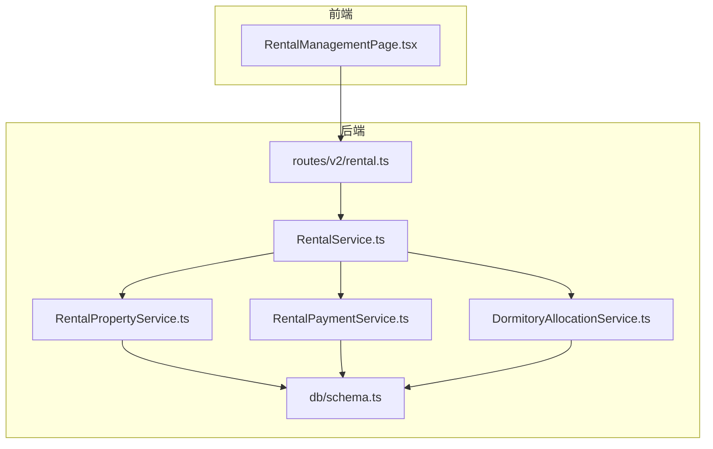
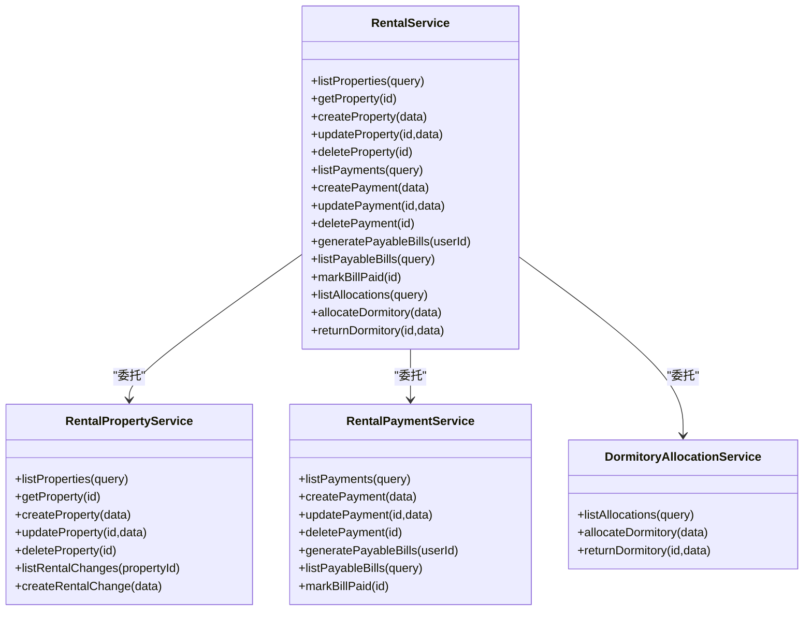
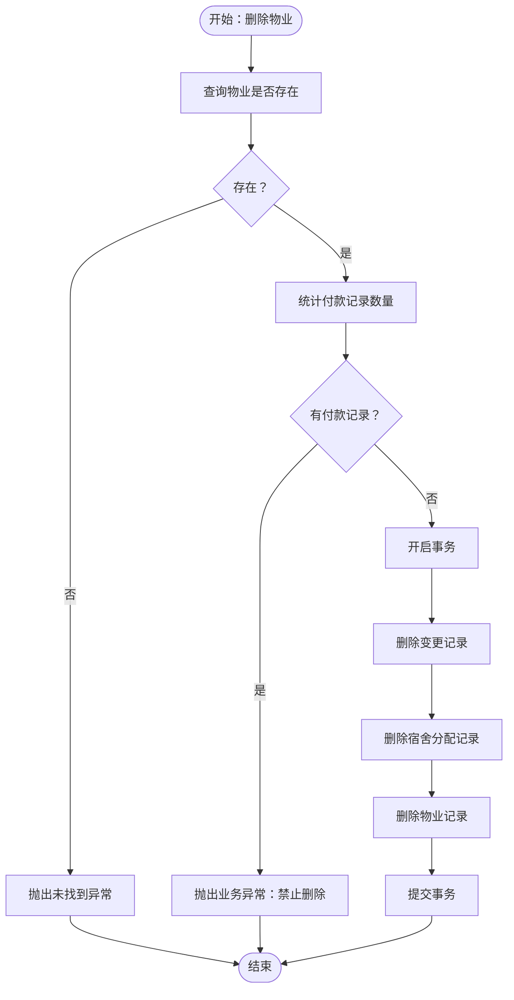
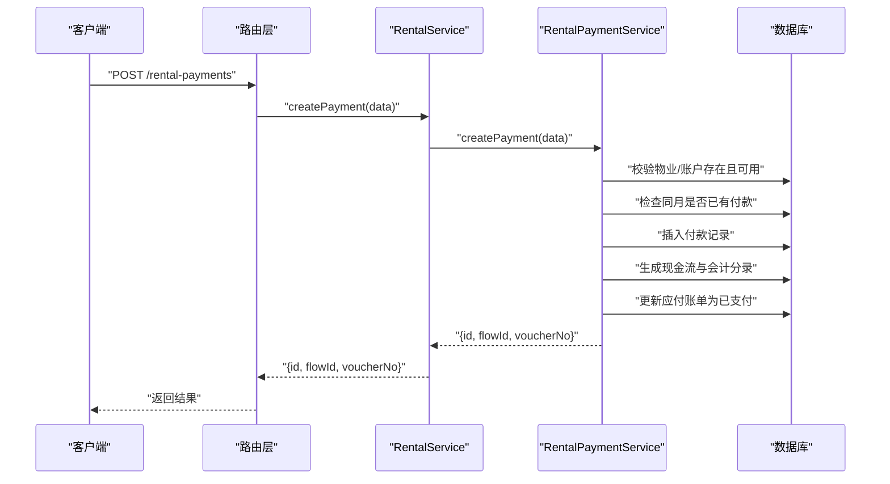
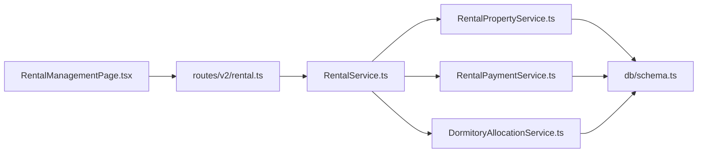

# 租赁管理

<cite>
**本文引用的文件**
- [RentalService.ts](file://backend/src/services/RentalService.ts)
- [RentalPropertyService.ts](file://backend/src/services/RentalPropertyService.ts)
- [RentalPaymentService.ts](file://backend/src/services/RentalPaymentService.ts)
- [DormitoryAllocationService.ts](file://backend/src/services/DormitoryAllocationService.ts)
- [rental.ts（后端路由）](file://backend/src/routes/v2/rental.ts)
- [RentalManagementPage.tsx（前端页面）](file://frontend/src/features/assets/pages/RentalManagementPage.tsx)
- [rental.ts（前端类型）](file://frontend/src/types/rental.ts)
- [rental.schema.ts（前端校验）](file://frontend/src/validations/rental.schema.ts)
- [schema.ts（数据库表结构）](file://backend/src/db/schema.ts)
- [rental.test.ts（后端测试）](file://backend/test/routes/rental.test.ts)
</cite>

## 目录
1. [简介](#简介)
2. [项目结构](#项目结构)
3. [核心组件](#核心组件)
4. [架构总览](#架构总览)
5. [详细组件分析](#详细组件分析)
6. [依赖关系分析](#依赖关系分析)
7. [性能考量](#性能考量)
8. [故障排查指南](#故障排查指南)
9. [结论](#结论)
10. [附录：API 接口规范与使用示例](#附录api-接口规范与使用示例)

## 简介
本模块围绕“租赁管理”构建，覆盖三大能力：
- 物业信息管理：支持新增、查询、更新、删除租赁物业，记录关键字段变更历史。
- 租赁账单处理：自动生成应付账单，支持按条件查询账单，标记账单为已支付。
- 付款管理：支持按月记录付款，联动生成现金流与会计分录，支持删除付款并回滚状态。

RentalService 作为门面服务，协调 RentalPropertyService（物业管理）与 RentalPaymentService（付款管理），并在需要时协同 DormitoryAllocationService（宿舍分配）完成综合业务闭环。

## 项目结构
后端采用分层设计：
- 路由层：定义 OpenAPI 路由与请求/响应结构，负责鉴权、参数校验与调用服务层。
- 服务层：RentalService 门面 + 各子服务（RentalPropertyService、RentalPaymentService、DormitoryAllocationService）。
- 数据访问层：基于 Drizzle ORM 的 schema 定义与查询。

前端页面 RentalManagementPage 提供可视化操作入口，包括物业列表、详情、编辑、付款记录、宿舍分配等。

图表来源
- [RentalManagementPage.tsx](file://frontend/src/features/assets/pages/RentalManagementPage.tsx#L1-L120)
- [rental.ts（后端路由）](file://backend/src/routes/v2/rental.ts#L1-L120)
- [RentalService.ts](file://backend/src/services/RentalService.ts#L1-L40)
- [RentalPropertyService.ts](file://backend/src/services/RentalPropertyService.ts#L1-L40)
- [RentalPaymentService.ts](file://backend/src/services/RentalPaymentService.ts#L1-L40)
- [DormitoryAllocationService.ts](file://backend/src/services/DormitoryAllocationService.ts#L1-L40)
- [schema.ts（数据库表结构）](file://backend/src/db/schema.ts#L576-L673)

章节来源
- [RentalManagementPage.tsx](file://frontend/src/features/assets/pages/RentalManagementPage.tsx#L1-L120)
- [rental.ts（后端路由）](file://backend/src/routes/v2/rental.ts#L1-L120)
- [RentalService.ts](file://backend/src/services/RentalService.ts#L1-L40)
- [schema.ts（数据库表结构）](file://backend/src/db/schema.ts#L576-L673)

## 核心组件
- RentalService（门面）：聚合物业管理与付款管理能力，必要时联动宿舍分配。
- RentalPropertyService：负责物业 CRUD、关联变更记录查询与删除前约束检查。
- RentalPaymentService：负责付款记录创建与删除、应付账单生成与状态更新、联动现金流与会计分录。
- DormitoryAllocationService：负责宿舍分配与归还。
- 路由层：定义 OpenAPI 接口，参数校验，权限控制，审计日志。
- 前端页面：提供物业列表、详情、编辑、付款记录、宿舍分配等交互。

章节来源
- [RentalService.ts](file://backend/src/services/RentalService.ts#L1-L162)
- [RentalPropertyService.ts](file://backend/src/services/RentalPropertyService.ts#L1-L291)
- [RentalPaymentService.ts](file://backend/src/services/RentalPaymentService.ts#L1-L400)
- [DormitoryAllocationService.ts](file://backend/src/services/DormitoryAllocationService.ts#L1-L200)
- [rental.ts（后端路由）](file://backend/src/routes/v2/rental.ts#L1-L200)
- [RentalManagementPage.tsx](file://frontend/src/features/assets/pages/RentalManagementPage.tsx#L1-L200)

## 架构总览
RentalService 作为门面，统一对外暴露以下能力：
- 物业管理：列表、详情、创建、更新、删除。
- 付款管理：列表、创建、更新、删除、生成应付账单、查询应付账单、标记账单已支付。
- 宿舍分配：列表、分配、归还。

图表来源
- [RentalService.ts](file://backend/src/services/RentalService.ts#L1-L162)
- [RentalPropertyService.ts](file://backend/src/services/RentalPropertyService.ts#L1-L291)
- [RentalPaymentService.ts](file://backend/src/services/RentalPaymentService.ts#L1-L400)
- [DormitoryAllocationService.ts](file://backend/src/services/DormitoryAllocationService.ts#L1-L200)

## 详细组件分析

### 物业信息管理（RentalPropertyService）
- 列表与详情：支持按类型、状态、部门过滤；详情包含部门、账户、币种、创建人等关联信息，以及变更历史。
- 创建：校验重复编码，写入基础字段与默认值，记录创建时间。
- 更新：关键字段变更会记录变更历史（起止日期、月租/年租、状态等）。
- 删除：若存在付款记录则禁止删除；事务内级联清理变更与分配记录。

图表来源
- [RentalPropertyService.ts](file://backend/src/services/RentalPropertyService.ts#L213-L239)

章节来源
- [RentalPropertyService.ts](file://backend/src/services/RentalPropertyService.ts#L1-L291)

### 租赁账单处理（RentalPaymentService）
- 应付账单生成：遍历有效状态且有起止日期的物业，按付款周期与付款日推导下一次账单日期，生成未到期的应付账单。
- 查询应付账单：支持按物业、状态、起止日期范围过滤。
- 标记已支付：校验账单存在且未支付，更新状态与支付日期。
- 付款创建：校验物业与账户存在且可用，避免重复月度付款；创建付款记录并生成现金流与会计分录；同时将对应应付账单标记为已支付。

图表来源
- [rental.ts（后端路由）](file://backend/src/routes/v2/rental.ts#L538-L614)
- [RentalPaymentService.ts](file://backend/src/services/RentalPaymentService.ts#L53-L211)

章节来源
- [RentalPaymentService.ts](file://backend/src/services/RentalPaymentService.ts#L1-L400)
- [rental.ts（后端路由）](file://backend/src/routes/v2/rental.ts#L538-L614)

### 付款管理（RentalPaymentService）
- 列表：支持按物业、年、月过滤，返回付款明细及关联属性（物业、账户、分类、创建人）。
- 更新/删除：更新付款信息；删除付款记录并返回原记录。
- 与财务联动：创建付款时生成凭证号、现金流、会计分录，并更新应付账单状态。

章节来源
- [RentalPaymentService.ts](file://backend/src/services/RentalPaymentService.ts#L23-L120)
- [RentalPaymentService.ts](file://backend/src/services/RentalPaymentService.ts#L213-L242)

### 宿舍分配（DormitoryAllocationService）
- 分配：记录员工宿舍分配，支持房间号、床号、月租等字段。
- 归还：记录归还日期与备注。
- 列表：支持按物业、员工、是否归还过滤。

章节来源
- [DormitoryAllocationService.ts](file://backend/src/services/DormitoryAllocationService.ts#L1-L200)

### 前端页面（RentalManagementPage）
- 功能概览：列表展示、搜索过滤、详情弹窗、编辑弹窗、记录付款、分配宿舍。
- 表单校验：使用 Zod schema 对创建/更新物业、创建付款、分配宿舍进行前端校验。
- 文件上传：支持凭证图片转 WebP 上传、合同 PDF 上传。
- 权限控制：根据权限决定按钮可见性与操作能力。

章节来源
- [RentalManagementPage.tsx](file://frontend/src/features/assets/pages/RentalManagementPage.tsx#L1-L200)
- [rental.schema.ts（前端校验）](file://frontend/src/validations/rental.schema.ts#L1-L83)
- [rental.ts（前端类型）](file://frontend/src/types/rental.ts#L1-L144)

## 依赖关系分析
- 路由层依赖服务层：所有接口均通过 c.var.services.rental 调用门面服务。
- 门面服务依赖子服务：RentalService 组合 RentalPropertyService、RentalPaymentService、DormitoryAllocationService。
- 子服务依赖数据库 schema：通过 Drizzle ORM 访问 rentalProperties、rentalPayments、rentalPayableBills、dormitoryAllocations 等表。
- 前端依赖类型与校验：RentalManagementPage 使用类型与 Zod schema 进行强类型与校验。

图表来源
- [rental.ts（后端路由）](file://backend/src/routes/v2/rental.ts#L1-L120)
- [RentalService.ts](file://backend/src/services/RentalService.ts#L1-L40)
- [RentalPropertyService.ts](file://backend/src/services/RentalPropertyService.ts#L1-L40)
- [RentalPaymentService.ts](file://backend/src/services/RentalPaymentService.ts#L1-L40)
- [DormitoryAllocationService.ts](file://backend/src/services/DormitoryAllocationService.ts#L1-L40)
- [schema.ts（数据库表结构）](file://backend/src/db/schema.ts#L576-L673)
- [RentalManagementPage.tsx](file://frontend/src/features/assets/pages/RentalManagementPage.tsx#L1-L120)

章节来源
- [rental.ts（后端路由）](file://backend/src/routes/v2/rental.ts#L1-L200)
- [RentalService.ts](file://backend/src/services/RentalService.ts#L1-L162)
- [schema.ts（数据库表结构）](file://backend/src/db/schema.ts#L576-L673)
- [RentalManagementPage.tsx](file://frontend/src/features/assets/pages/RentalManagementPage.tsx#L1-L120)

## 性能考量
- 批量查询优化：RentalService 在获取物业详情时并行拉取付款与宿舍分配信息，减少往返次数。
- 数据库索引：cash_flows、account_transactions、audit_logs 等表具备常用索引，有助于查询与对账。
- 事务一致性：付款创建与账单更新在同一事务内完成，确保数据一致性。
- 前端缓存与懒加载：列表分页与按需加载详情，降低前端渲染压力。

章节来源
- [RentalService.ts](file://backend/src/services/RentalService.ts#L23-L60)
- [RentalPaymentService.ts](file://backend/src/services/RentalPaymentService.ts#L113-L211)
- [schema.ts（数据库表结构）](file://backend/src/db/schema.ts#L159-L206)

## 故障排查指南
- 未找到实体：当查询或更新不存在的物业/付款/账单时，服务层抛出相应异常，路由层返回标准错误响应。
- 业务约束：删除物业前若存在付款记录会阻止删除；创建付款时若同月已存在则拒绝重复创建。
- 账户校验：创建付款时需校验账户存在、启用且币种一致。
- 权限不足：部分接口（如删除付款、标记账单已支付）需要特定权限，否则返回禁止访问。

章节来源
- [RentalPropertyService.ts](file://backend/src/services/RentalPropertyService.ts#L213-L239)
- [RentalPaymentService.ts](file://backend/src/services/RentalPaymentService.ts#L72-L110)
- [rental.ts（后端路由）](file://backend/src/routes/v2/rental.ts#L644-L713)

## 结论
本模块以 RentalService 为核心门面，将物业管理、付款管理与宿舍分配整合为统一的服务层，配合路由层的 OpenAPI 定义与权限控制，形成清晰、可扩展、可审计的租赁管理能力。前端页面提供直观的操作体验，结合类型与校验保障数据质量。建议在生产环境中持续完善账单生成策略与对账机制，确保账实相符。

## 附录：API 接口规范与使用示例

### 通用约定
- 响应格式遵循 V2 规范：success 与 data 字段。
- 鉴权与权限：部分接口需要资产模块的租赁相关权限。
- 审计日志：成功操作会记录审计动作。

章节来源
- [rental.ts（后端路由）](file://backend/src/routes/v2/rental.ts#L1-L120)

### 物业管理
- 获取物业列表
  - 方法：GET
  - 路径：/rental-properties
  - 查询参数：propertyType、status、departmentId
  - 返回：results 数组，包含 property、departmentName、paymentAccountName、currencyName、createdByName 等
- 获取物业详情
  - 方法：GET
  - 路径：/rental-properties/{id}
  - 返回：property 详情，包含关联信息与变更历史
- 创建物业
  - 方法：POST
  - 路径：/rental-properties
  - 请求体：propertyCode、name、propertyType、address、areaSqm、rentType、monthlyRentCents、yearlyRentCents、currency、paymentPeriodMonths、landlordName、landlordContact、leaseStartDate、leaseEndDate、depositCents、paymentMethod、paymentAccountId、paymentDay、departmentId、status、memo、contractFileUrl、createdBy
  - 返回：{ id, propertyCode }
- 更新物业
  - 方法：PUT
  - 路径：/rental-properties/{id}
  - 请求体：同创建（可部分字段）
  - 返回：{ ok: true }
- 删除物业
  - 方法：DELETE
  - 路径：/rental-properties/{id}
  - 返回：{ ok: true }

章节来源
- [rental.ts（后端路由）](file://backend/src/routes/v2/rental.ts#L26-L120)
- [rental.ts（后端路由）](file://backend/src/routes/v2/rental.ts#L255-L482)

### 付款管理
- 获取付款列表
  - 方法：GET
  - 路径：/rental-payments
  - 查询参数：propertyId、year、month
  - 返回：results 数组，包含 payment、propertyCode、propertyName、propertyType、accountName、categoryName、createdByName
- 创建付款
  - 方法：POST
  - 路径：/rental-payments
  - 请求体：propertyId、paymentDate、year、month、amountCents、currency、accountId、categoryId、paymentMethod、voucherUrl、memo、createdBy
  - 返回：{ id, flowId, voucherNo }
- 更新付款
  - 方法：PUT
  - 路径：/rental-payments/{id}
  - 请求体：paymentDate、amountCents、voucherUrl、memo
  - 返回：{ ok: true }
- 删除付款
  - 方法：DELETE
  - 路径：/rental-payments/{id}
  - 返回：{ ok: true }

章节来源
- [rental.ts（后端路由）](file://backend/src/routes/v2/rental.ts#L484-L714)

### 应付账单
- 生成应付账单
  - 方法：POST
  - 路径：/rental-properties/generate-payable-bills
  - 返回：{ generated, bills }
- 获取应付账单列表
  - 方法：GET
  - 路径：/rental-payable-bills
  - 查询参数：propertyId、status、startDate、endDate
  - 返回：results 数组，包含 bill、propertyCode、propertyName、propertyType、landlordName
- 标记账单已支付
  - 方法：POST
  - 路径：/rental-payable-bills/{id}/mark-paid
  - 返回：{ ok: true }

章节来源
- [rental.ts（后端路由）](file://backend/src/routes/v2/rental.ts#L715-L852)

### 宿舍分配
- 获取分配列表
  - 方法：GET
  - 路径：/rental-properties/allocations
  - 查询参数：propertyId、employeeId、returned
  - 返回：results 数组，包含 allocation、propertyCode、propertyName、employeeName、employeeDepartmentName、employeeDepartmentId、createdByName
- 分配宿舍
  - 方法：POST
  - 路径：/rental-properties/{id}/allocate-dormitory
  - 请求体：employeeId、roomNumber、bedNumber、allocationDate、monthlyRentCents、memo
  - 返回：{ id }
- 归还宿舍
  - 方法：POST
  - 路径：/rental-properties/allocations/{id}/return
  - 请求体：returnDate、memo
  - 返回：{ ok: true }

章节来源
- [rental.ts（后端路由）](file://backend/src/routes/v2/rental.ts#L68-L200)

### 前端操作流程（RentalManagementPage）
- 列表与搜索：支持按类型与状态筛选，查看房屋编号、名称、类型、租金、付款周期、租赁起止、使用项目/员工、状态等。
- 详情：查看物业详情、付款记录、宿舍分配情况与变更历史。
- 编辑：修改物业信息（含起止日期、月租/年租、状态等），关键字段变更会记录变更历史。
- 记录付款：自动计算应付金额（根据付款周期），上传凭证，创建付款并生成凭证号。
- 分配宿舍：选择员工、设置分配日期与月租，完成分配。

章节来源
- [RentalManagementPage.tsx](file://frontend/src/features/assets/pages/RentalManagementPage.tsx#L1-L565)
- [rental.schema.ts（前端校验）](file://frontend/src/validations/rental.schema.ts#L1-L83)
- [rental.ts（前端类型）](file://frontend/src/types/rental.ts#L1-L144)